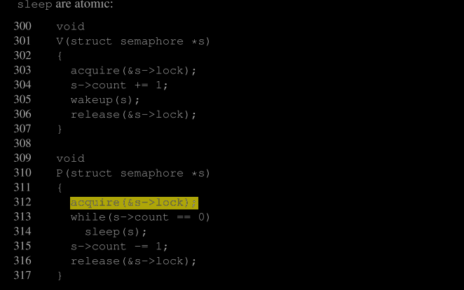

# Scheduling
任何操作系统运行时，进程数量通常多于计算机的CPU数量，因此需要一个计划**在进程之间共享CPU时间**。理想情况下，这种共享对于用户进程来说应该是透明的。一种常见的方法是通过将进程多路复用到硬件CPU上，为每个进程提供它拥有自己虚拟CPU的错觉。本章解释了xv6如何实现这种多路复用。

## 7.1 Multiplexing
Xv6通过在两种情况下**将每个CPU从一个进程切换到另一个进程来实现多路复用**。首先，当进程等待设备或管道I/O完成、等待子进程退出或在睡眠系统调用中等待时，xv6的睡眠和唤醒机制会进行切换。其次，xv6会定期强制切换，以应对长时间计算而不进行睡眠的进程。这种多路复用创造了每个进程都拥有自己CPU的错觉，就像xv6使用内存分配器和硬件页表来创造每个进程都拥有自己内存的错觉一样。

**实现多路复用面临一些挑战。**
首先，如何从一个进程切换到另一个进程？尽管上下文切换的概念很简单，但其实现是xv6中最复杂的代码之一。
其次，如何以对用户进程透明的方式强制切换？xv6使用了一种标准技术，通过硬件定时器的中断来驱动上下文切换。第三，所有的CPU在同一个共享的进程集合之间进行切换，因此需要一个锁定计划来避免竞争条件。
第四，当进程退出时，必须释放其内存和其他资源，但进程不能完全自己完成这一切，因为它不能在使用自己的内核栈时释放它。
第五，多核机器的每个核心必须记住它正在执行哪个进程，以便系统调用影响正确进程的内核状态。
最后，睡眠和唤醒机制允许进程放弃CPU并等待被另一个进程或中断唤醒，需要小心避免竞争条件导致唤醒通知的丢失。xv6尽可能简单地解决这些问题，但即使如此，最终的代码仍然很复杂。

## 7.2 context switching
图7.1概述了从一个用户进程切换到另一个用户进程所涉及的步骤：从旧进程的内核线程到用户-内核的转换（系统调用或中断），上下文切换到当前CPU的调度线程，上下文切换到新进程的内核线程，然后是陷阱返回到用户级进程。xv6的调度器为每个CPU提供了一个**专用线程（保存的寄存器和栈）**，因为让调度器在旧进程的内核栈上执行是不安全的：其他内核可能会唤醒进程并运行它，如果在两个不同的内核上使用相同的栈将是灾难性的。在本节中，我们将研究在内核线程和调度器线程之间切换的机制。

从一个线程切换到另一个线程涉及到保存旧线程的CPU寄存器，并恢复新线程先前保存的寄存器；保存和恢复栈指针和程序计数器意味着CPU将切换栈并切换正在执行的代码。

`swtch` 函数执行内核线程切换时的保存和恢复操作。`swtch` 并不直接处理线程；它只是保存和恢复32个 RISC-V 寄存器集，称为上下文。当一个进程需要放弃 CPU 时，该进程的内核线程调用 `swtch` 来保存它自己的上下文并返回到调度器上下文。每个上下文包含在一个 `struct context` 中（kernel/proc.h:2），该结构体本身包含在进程的 `struct proc `或 CPU 的 `struct cpu` 中。`swtch` 接受两个参数：`struct context *old` 和 `struct context *new`。它将当前寄存器保存在 `old` 中，从 `new` 中加载寄存器，并返回。

让我们跟随一个进程通过 `swtch` 进入调度器。我们在第4章看到，中断结束时的一种可能性是 `usertrap` 调用 `yield`。`yield` 反过来调用 `sched`，`sched` 调用 `swtch` 将当前上下文保存在 `p->context` 中，并切换到之前保存在 `cpu->scheduler` 中的调度器上下文（kernel/proc.c:490）。

`swtch`（kernel/swtch.S:3）只保存被调用者保存的寄存器(相当于系统调用)；C编译器生成代码在调用者中将调用者保存的寄存器保存到堆栈上（发生函数调用时，会保存调用者保存寄存器保存到堆栈上，返回的时候会自动恢复）。`swtch`知道每个寄存器字段在 `struct context` 中的偏移量。它不保存程序计数器。相反，`swtch` 保存 `ra` 寄存器，它持有从 `swtch` 调用的返回地址。现在 `swtch` 从新的上下文中恢复寄存器，这些寄存器保存了先前 `swtch` 保存的值。当 `swtch` 返回时，它返回到由恢复的 `ra` 寄存器指向的指令，即新线程先前调用 `swtch` 的指令。此外，它在新线程的堆栈上返回，因为这就是恢复的 `sp` 指向的位置。

>为什么保存 ra（返回地址）寄存器而不是直接保存 pc（程序计数器）寄存器？
>1. 上下文切换的设计：
 + 在 RISC-V 架构中，ra 寄存器用于保存函数的返回地址。当一个线程或进程调用 swtch 函数时，它实际上是在执行上下文切换的过程。此时，ra 寄存器保存的是即将返回的地址，即函数调用的返回点，而不是当前正在执行的指令地址
 + 保存 ra 寄存器可以确保在上下文切换后，线程或进程能够从正确的点继续执行，而不需要直接操作 pc。pc 会在 CPU 内部的指令流中自动更新，因此 ra 是保存调用位置的更直接的选择。
>2. 栈帧的管理：
 + 在函数调用过程中，pc 寄存器会被自动更新以指向当前执行的指令，而 ra 寄存器则保存函数的返回地址。保存 ra 而不是 pc 是为了保持对调用栈的完整性。
 + 当进行上下文切换时，保存 ra 可以确保在切换回该线程或进程时，从正确的返回点继续执行。这对于函数的调用和返回管理至关重要。
>3. 上下文的保存和恢复：
 + 在上下文切换过程中，swtch 函数需要保存当前线程的状态，并恢复另一个线程的状态。保存 ra 确保在恢复上下文时能够正确返回到先前的函数调用点，而 pc 寄存器的更新则由 CPU 自动管理。

>为什么保存sp寄存器？
>sp 寄存器（堆栈指针寄存器）保存的是当前堆栈的顶部位置,保存的一些关键内容。
  1. 堆栈的顶端地址：sp 寄存器指向当前堆栈的顶部。堆栈通常是向下增长的，即新数据会被压入堆栈时，sp 的值会减小。sp 保存的是当前可用堆栈空间的地址。
  2. 函数调用信息：堆栈用于存储函数调用的信息，包括返回地址、参数和局部变量。当函数被调用时，调用信息（如返回地址）会被压入堆栈中。sp 记录了这些信息的位置。
  3. 局部变量：函数的局部变量通常存储在堆栈上。sp 寄存器帮助确定这些局部变量在堆栈中的位置。
  4. 保存的寄存器状态：在上下文切换期间，操作系统通常会保存当前进程的所有寄存器状态，包括 sp。这样，在恢复进程时，操作系统可以恢复到进程中断之前的状态。
  5. 调用链和堆栈帧：堆栈帧包含了函数的调用链、局部变量、参数以及保存的返回地址等。sp 寄存器的值帮助确定堆栈帧的位置，从而确保函数调用和返回能够正确地处理。
>sp（堆栈指针）寄存器的保存和恢复尤为重要，原因如下：
>1. 堆栈完整性：
  + sp 寄存器指示当前堆栈的顶部位置。上下文切换时，当前进程的堆栈可能包含函数调用的局部变量、返回地址以及其他重要的数据。如果不保存 sp 的值，堆栈的状态将会丢失，导致进程无法正确恢复它的执行状态
>2. 函数调用和返回：
  + 当进程在运行时，函数调用和返回会改变堆栈指针的值。如果在上下文切换时不保存 sp，则在切换回进程时，堆栈的状态会混乱，这可能会导致程序崩溃或不稳定的行为。
>3. 线程栈的正确性：
  + 线程的堆栈用于存储局部变量、函数参数和返回地址。如果在上下文切换时不保存 sp，进程在恢复时会丢失这些信息，无法正确恢复函数的执行状态。
  + 

>调用者保存寄存器是指在函数调用过程中，由调用函数（caller）负责保存和恢复的寄存器。这意味着在调用函数前，调用者必须将这些寄存器的值保存到堆栈或其他存储位置，并在函数调用返回后恢复它们。这样做的目的是为了确保被调用函数（callee）不会修改调用者期望保持不变的寄存器值。

在我们的例子中，`sched` 调用了 `swtch` 来切换到 `cpu->scheduler`，即每个 `CPU` 的调度器上下文。这个上下文是在过去某个时刻保存的，当时调度器调用 `swtch`（kernel/proc.c:456）来切换到现在放弃 CPU 的进程。当我们一直在跟踪的 `swtch `返回时，它不是返回到 `sched`，而是返回到调度器，并且堆栈指针指向当前 CPU 的调度器堆栈。

## 7.3 Code:Scheduling

上一节讨论了 swtch 函数的低级细节；现在我们假设 `swtch` 函数是已知的，来考察**从一个进程的内核线程通过调度器切换到另一个进程的过程**。**调度器以每个 CPU 上运行的特殊线程的形式存在，每个线程都在运行调度器函数。**这个函数负责选择下一个要运行的进程。一个想要放弃 CPU 的进程必须先获取它自己的进程锁 `p->lock`，释放它持有的任何其他锁，更新它自己的状态 (`p->state`)，然后调用 `sched` 函数。这个过程可以在 `yield` (kernel/proc.c:496)、`sleep` 和 `exit` 函数中看到。`sched` 函数会对这些要求进行双重检查 (kernel/proc.c:480-485)，然后检查一个隐含的条件：由于持有锁，中断应该被禁用。最后，`sched` 调用 `swtch` 函数，将当前上下文保存到 `p->context` 中，并切换到 CPU 的调度器上下文 `cpu->scheduler` 中。`swtch` 返回时会在调度器的栈上，就好像调度器的 `swtch` 已经返回了一样。调度器继续其 `for` 循环，找到一个要运行的进程，切换到该进程，然后这个过程会重复进行。

我们刚刚看到 xv6 在调用 `swtch` 时会持有 `p->lock`：调用 swtch 的线程必须已经持有该锁，并且锁的控制权会传递给切换后的代码。这个惯例在锁的使用中是不寻常的；通常情况下，获取锁的线程也负责释放该锁，这样更容易推理其正确性。对于上下文切换，打破这个惯例是必要的，因为 `p->lock` 保护了进程的状态和上下文字段上的不变量，而这些不变量在执行 swtch 时是不成立的。一个可能出现的问题是，如果 `p->lock` 在 swtch 期间没有被持有：另一台 CPU 可能会决定在 `yield` 将进程状态设置为 `RUNNABLE `后但在 swtch 使其停止使用自己的内核栈之前运行该进程。结果会是两个 CPU 在同一个栈上运行，这会导致混乱。

唯一一个内核线程放弃其 CPU 的地方是在 `sched` 中，并且它总是切换到 `scheduler` 中的相同位置，而 `scheduler`（几乎）总是切换到之前调用 `sched` 的某个内核线程。因此，如果打印出 xv6 切换线程的行号，会观察到以下简单的模式：（kernel/proc.c:456），（kernel/proc.c:490），（kernel/proc.c:456），（kernel/proc.c:490），依此类推。那些故意通过线程切换相互转移控制的过程有时被称为协程；在这个例子中，`sched` 和 `scheduler` 是彼此的协程。

有一种情况，当调度器调用 `swtch` 时，不会最终返回到 `sched`。`allocproc` 将新进程的上下文中 `ra` 寄存器设置为 `forkret`（kernel/proc.c:508），这样它的第一次 `swtch `会“返回”到该函数的开始位置。`forkret` 的存在是为了释放` p->lock`；否则，由于新进程需要返回到用户空间，就像从 `fork` 返回一样，它本可以从 `usertrapret` 开始。

`Scheduler`（kernel/proc.c:438）运行一个循环：找到一个可运行的进程，运行它直到它让出 CPU，然后重复这个过程。调度器在进程表中循环查找一个可运行的进程，即 `p->state == RUNNABLE` 的进程。一旦找到一个进程，它将每个 CPU 的当前进程变量 `c->proc` 设置为该进程，将进程标记为 `RUNNING`，然后调用 `swtch` 来开始运行它（kernel/proc.c:451-456）。

一种理解调度代码结构的方法是，它强制执行一组关于每个进程的不变量，并在这些不变量不成立时持有 `p->lock`。一个不变量是：如果一个进程处于 `RUNNING` 状态，计时器中断的 `yield` 必须能够安全地切换出该进程；这意味着 CPU 寄存器必须保持该进程的寄存器值（即 swtch 没有将它们移动到上下文中），并且 `c->proc` 必须指向该进程。另一个不变量是：如果一个进程处于 `RUNNABLE` 状态，空闲 CPU 的调度器必须能够安全地运行它；这意味着 `p->context` 必须保存进程的寄存器（即它们实际上不在真实寄存器中），没有 CPU 正在执行该进程的内核栈，并且没有 CPU 的 `c->proc` 指向该进程。请注意，这些属性在持有 `p->lock` 时通常并不成立。

维护上述不变量是为什么 xv6 经常在一个线程中获取 `p->lock` 并在另一个线程中释放它的原因，例如在 yield 中获取而在 `scheduler `中释放。一旦 yield 开始修改一个运行中的进程的状态以使其变为 `RUNNABLE`，锁必须保持持有状态，直到不变量恢复：最早的正确释放点是在 `scheduler`（在自己的栈上运行）清除 `c->proc` 之后。同样，一旦 `scheduler` 开始将一个 `RUNNABLE `进程转换为 `RUNNING`，锁不能释放，直到内核线程完全运行（例如在 `yield` 中的 `swtch` 之后）

## 7.4 Code: mycpu and myproc

Xv6 经常需要一个指向当前进程的 `proc` 结构的指针。在单处理器上，可以有一个指向当前 `proc` 的全局变量。这在多核机器上不起作用，因为每个核心执行不同的进程。解决这个问题的方法是利用每个核心都有自己的一组寄存器这一事实；我们可以使用其中一个寄存器来帮助找到每核心的信息。

Xv6 为每个 CPU 维护一个 `struct cpu`（见 kernel/proc.h:22），记录当前在该 CPU 上运行的进程（如果有的话）、该 CPU 的调度线程的保存寄存器以及管理中断禁用所需的嵌套自旋锁的计数。函数 `mycpu`（见 kernel/proc.c:72）返回一个指向当前 CPU 的 `struct cpu` 的指针。RISC-V 为其 CPU 编号，给每个分配一个 `hartid`。Xv6 确保每个 CPU 的 `hartid` 存储在该 CPU 的 tp 寄存器中，这样 `mycpu` 就可以使用 `tp` 来索引 `cpu` 结构数组，从而找到正确的结构体。

确保 CPU 的 `tp` 寄存器始终保存该 CPU 的 `hartid` 稍微复杂一些。`mstart` 在 CPU 启动序列的早期设置了 `tp` 寄存器，当时仍处于机器模式（见 kernel/start.c:51）。`usertrapret` 将 `tp` 保存在跳板页中，因为用户进程可能会修改 `tp`。最后，当从用户空间进入内核时，`uservec` 恢复了保存的 `tp`（见 kernel/trampoline.S:70）。编译器保证永远不会使用 `tp` 寄存器。如果 xv6 能够在需要时请求 RISC-V 硬件提供当前的 hartid 会更方便，但 RISC-V 只允许在机器模式下这样做，而不允许在监督模式下。

`cpuid` 和 `mycpu` 的返回值是脆弱的：如果定时器中断并导致线程让出 CPU 然后移动到另一个 CPU 上，之前返回的值将不再正确。为了避免这个问题，xv6 要求调用者在使用返回的 `struct cpu` 之前禁用中断，并且只有在使用完成后才重新启用它们。

函数 `myproc`（见 kernel/proc.c:80）返回当前 CPU 上运行的进程的 `struct proc` 指针。`myproc` 禁用中断，调用 `mycpu`，从 `struct cpu` 中获取当前进程指针 (c->proc)，然后启用中断。即使启用了中断，`myproc` 的返回值仍然是安全的：如果定时器中断将调用进程移动到另一个 CPU，它的 `struct proc` 指针将保持不变。

## 7.5 sleep and wakeup

调度和锁有助于隐藏一个线程的操作不被另一个线程看到，但我们也需要一些抽象来帮助线程有意地进行交互。例如，xv6中的管道读取者可能需要等待写入进程产生数据；父进程的`wait`调用可能需要等待子进程退出；读取磁盘的进程需要等待磁盘硬件完成读取。在这些情况下（以及许多其他情况下），xv6内核使用了一种称为**睡眠和唤醒的机制**。睡眠允许内核线程等待特定事件；另一个线程可以调用唤醒来指示等待该事件的线程应该恢复。睡眠和唤醒通常被称为顺序协调或条件同步机制。

睡眠和唤醒提供了一种相对低级的同步接口。为了说明它们在xv6中的工作方式，我们将使用它们构建一种称为信号量的高级同步机制【4】，以协调生产者和消费者（xv6本身并不使用信号量）。信号量维护一个计数，并提供两个操作。生产者的“V”操作增加计数。消费者的“P”操作则等待计数为非零，然后将其递减并返回。如果只有一个生产者线程和一个消费者线程，并且它们在不同的CPU上执行，并且编译器没有过度优化，那么这种实现将是正确的：

上述实现是昂贵的。如果生产者的操作很少发生，消费者将大部分时间在while循环中忙等，希望计数为非零。消费者的CPU可能会发现相比于通过重复轮询s->count进行忙等，有更有意义的工作。避免忙等需要一种方式，使消费者能够放弃CPU，并仅在V操作增加计数后才恢复执行。

以下是向那个方向迈出的一步，尽管我们将看到这还不够。让我们想象一对调用，`sleep` 和 `wakeup`，它们的工作方式如下。`Sleep(chan)` 在一个任意值 `chan` 上睡眠，该值被称为等待通道。`Sleep` 将调用进程置于睡眠状态，释放 CPU 以执行其他工作。`Wakeup(chan)` 唤醒所有在 `chan` 上睡眠的进程（如果有），使它们的 `sleep` 调用返回。如果没有进程在 `chan` 上等待，`wakeup` 什么也不做。我们可以修改信号量实现以使用 `sleep` 和 `wakeup`（修改部分用黄色高亮）：

P 现在放弃了 CPU，不再忙等待，这样做是好的。然而，使用这种接口设计 `sleep` 和 `wakeup` 时，结果并不简单，因为它容易受到“丢失唤醒”问题的影响。假设 P 在第 212 行发现 `s->count == 0`。在 P 执行到第 213 行时，另一个 CPU 上的 V 执行：它将 `s->count` 更改为非零值，并调用 `wakeup`，但 `wakeup` 发现没有进程在等待，因此不做任何操作。现在 P 继续执行到第 213 行：它调用 `sleep` 并进入休眠状态。这会导致问题：P 正在等待一个已经发生的 V 调用。如果我们没有运气让生产者再次调用 V，消费者将永远等待，即使计数值已经是非零的。

这个问题的根源在于 P 只在 `s->count == 0` 时才会进入睡眠的这个不变量被 V 在错误的时刻运行而破坏了。错误的保护这个不变量的方法是将 P 中的锁获取（下面用黄色突出显示）移动，使其对计数的检查和调用 sleep 是原子的：

有人可能认为这种版本的 P 能够避免丢失唤醒问题，因为锁防止 V 在第 313 行和第 314 行之间执行。确实如此，但它也会导致死锁：P 在睡眠时持有锁，因此 V 将永远阻塞，等待锁。

我们将通过更改 sleep 的接口来修复上述方案：调用者必须将条件锁传递给 sleep，以便在调用进程被标记为正在睡眠并等待在睡眠通道上后释放锁。这样，锁将强制并发的 V 等待，直到 P 完成将自身置于睡眠状态，这样 wakeup 就能找到正在睡眠的消费者并将其唤醒。一旦消费者再次醒来，sleep 将在返回之前重新获取锁。我们新的正确的 sleep/wakeup 方案可按如下方式使用（更改部分用黄色突出显示）：

P 持有 s->lock 的事实防止了 V 在 P 检查 c->count 和调用 sleep 之间尝试唤醒它。然而，我们需要 sleep 原子性地释放 s->lock 并将消费者进程置于睡眠状态，以避免丢失唤醒问题。

## 7.6 Code: sleep and wakeup

xv6 的 `sleep`（kernel/proc.c:529）和 `wakeup`（kernel/proc.c:560）提供了上面示例中展示的接口，其实现（加上使用规则）确保了不会发生丢失唤醒的问题。基本思想是让 `sleep` 将当前进程标记为 `SLEEPING`，然后调用 `sched` 释放 CPU；`wakeup `查找在给定等待通道上睡眠的进程，并将其标记为 `RUNNABLE`。`sleep` 和 `wakeup` 的调用者可以使用任何相互兼容的数字作为通道。xv6 通常使用参与等待的内核数据结构的地址作为通道。

`sleep` 函数会获取 `p->lock`（kernel/proc.c:540）。现在，进入休眠的进程同时持有 `p->lock` 和 `lk`。在调用者（在这个例子中是 P）中持有 `lk` 是必要的：它确保没有其他进程（在这个例子中是运行 V 的进程）可以开始调用 `wakeup(chan)`。现在 `sleep` 持有 `p->lock`，可以安全地释放 `lk`：虽然其他进程可能会开始调用 `wakeup(chan)`，但是 `wakeup` 将会等待获取 `p->lock`，因此会等到 `sleep` 完成将进程置为休眠状态，防止 `wakeup` 错过这个休眠。

现在，`sleep` 持有 `p->lock` 和没有其他锁，它可以通过记录休眠通道、将进程状态更改为 `SLEEPING` 并调用 `sched` 来使进程**进入休眠状态**（kernel/proc.c:544-547）。稍后会清楚为什么在进程被标记为 `SLEEPING` 之前 `p->lock` 不被释放（由调度程序释放）是至关重要的。

在某个时刻，某个进程会获取条件锁，设置等待的条件，然后调用 `wakeup(chan)`。重要的是，在持有条件锁时调用 `wakeup`。`wakeup` 会遍历进程表（kernel/proc.c:560）。它会获取每个被检查进程的 `p->lock`，这不仅是因为它可能会修改该进程的状态，还因为 `p->lock` 确保 `sleep` 和 `wakeup` 之间不会错过彼此。当 `wakeup` 找到一个状态为 `SLEEPING` 并且通道匹配的进程时，它将该进程的状态更改为 `RUNNABLE`。下次调度程序运行时，它会看到该进程已准备好运行。

为什么 `sleep` 和 `wakeup` 的锁定规则能确保一个正在休眠的进程不会错过一个唤醒信号？这是因为休眠的进程在检查条件之前和被标记为 `SLEEPING` 之后，持有条件锁、自己的 `p->lock `或两者都持有。调用 `wakeup` 的进程在 `wakeup` 的循环中持有这两个锁。因此，唤醒者要么在消费线程检查条件之前使条件变为真，要么在唤醒操作严格在进程被标记为 `SLEEPING` 之后检查休眠线程。这样，`wakeup` 就会看到休眠的进程并将其唤醒（除非其他情况先将其唤醒）。

有时，多个进程可能在同一个通道上休眠，例如，多个进程同时从一个管道读取数据。一次 `wakeup` 调用会唤醒所有这些进程。第一个运行的进程会获取 `sleep` 调用时使用的锁，并（在管道的情况下）读取管道中等待的数据。其他进程会发现，尽管被唤醒了，但没有数据可以读取。从它们的角度来看，`wakeup` 是“虚假的”，它们必须再次休眠。因此，`sleep` 总是被放在一个检查条件的循环中调用。

如果两个 `sleep/wakeup` 调用意外地选择了相同的通道也没有问题：它们会遇到虚假的唤醒，但如上所述的循环机制可以容忍这个问题。`sleep/wakeup` 的魅力在于，它既轻量级（不需要创建特殊的数据结构作为休眠通道），又提供了一层间接性（调用者不需要知道它们正在与哪个具体进程交互）

## 7.7 Code: Pipes 

一个更复杂的使用 `sleep` 和 `wakeup` 来同步生产者和消费者的例子是 xv6 中对管道的实现。我们在第 1 章中见过管道的接口：写入管道一端的字节会被复制到内核中的缓冲区，然后可以从管道的另一端读取。未来的章节将会探讨围绕管道的文件描述符支持，但现在让我们来看一下 `pipewrite` 和 `piperead` 的实现。

每个管道由一个 `struct pipe` 结构体表示，该结构体包含一个锁和一个数据缓冲区。字段 `nread` 和 `nwrite` 记录了从缓冲区读取和写入的字节总数。缓冲区是循环的：在 `buf[PIPESIZE-1]` 后写入的下一个字节是 `buf[0]`。这些计数值不会循环。这种约定使得实现可以区分一个满的缓冲区（nwrite == nread + PIPESIZE）和一个空的缓冲区（nwrite == nread），但这意味着对缓冲区的索引必须使用 `buf[nread % PIPESIZE]` 而不是简单地使用 `buf[nread]`（对于 `nwrite` 也是如此）。

假设 `piperead` 和 `pipewrite` 的调用在两个不同的 CPU 上同时发生。`pipewrite`（kernel/pipe.c:77）首先获取管道的锁，该锁保护计数、数据及其相关的不变量。然后，`piperead`（kernel/pipe.c:106）也尝试获取这个锁，但无法获得。它在 `acquire`（kernel/spinlock.c:22）中自旋等待锁。在 `piperead` 等待时，`pipewrite` 循环遍历要写入的字节（addr[0..n-1]），逐个添加到管道中（kernel/pipe.c:95）。在这个循环过程中，缓冲区可能会被填满（kernel/pipe.c:88）。在这种情况下，`pipewrite` 调用 `wakeup` 来提醒任何正在等待的读者缓冲区中有数据，并随后在 `&pi->nwrite` 上休眠，以等待读者从缓冲区中取出一些字节。`sleep` 在将 `pipewrite` 的进程置于休眠状态的过程中会释放 `pi->lock`。

现在 `pi->lock` 可用，`piperead` 成功获取它并进入其临界区：它发现 `pi->nread != pi->nwrite`（`pipewrite` 因为 `pi->nwrite == pi->nread+PIPESIZE` 而进入了休眠状态（kernel/pipe.c:88）），所以它进入了 `for` 循环，从管道中复制数据（kernel/pipe.c:120），并将 `nread` 增加了复制的字节数。这样就有了足够的字节可供写入，因此 `piperead` 调用 `wakeup`（kernel/pipe.c:127）来唤醒任何正在休眠的写入者，然后才返回。`wakeup` 找到一个在 `&pi->nwrite` 上休眠的进程，即 `pipewrite`。

管道代码使用了独立的睡眠通道来分别处理读者和写者（pi->nread 和 pi->nwrite）；这在不太可能发生的情况下（例如有大量的读者和写者等待同一个管道时）可能使系统更加高效。管道代码在循环中检查睡眠条件；如果有多个读者或写者，除了第一个醒来的进程之外，其他进程都会发现条件仍然为假，然后再次进入睡眠状态。

## 7.8 Code: Wait,exit,and kill

`sleep` 和 `wakeup` 可以用于许多不同的等待场景。一个有趣的例子是在第1章中介绍的子进程退出和父进程等待之间的交互。当子进程死亡时，父进程可能已经在等待中入睡，或者正在做其他事情；在后一种情况下，后续的 `wait` 调用必须能够检测到子进程的死亡，可能是在调用 `exit` 很久之后。xv6 记录子进程死亡的方式是，将调用 `exit` 的进程状态设置为 `ZOMBIE`，直到父进程的 `wait` 观察到它，将子进程状态更改为 `UNUSED`，复制子进程的退出状态，并将子进程的进程 `ID` 返回给父进程。如果父进程在子进程之前退出，父进程会将子进程交给 `init` 进程，`init` 进程会不断地调用 `wait`；因此，每个子进程都有一个父进程来进行清理。一个挑战是避免父子进程之间的竞争条件和死锁，以及退出和退出之间的竞争条件。

`wait` 函数开始时会获取 `wait_lock`（kernel/proc.c:384）。这样做的原因是 `wait_lock` 充当条件锁，以确保父进程不会错过来自已退出子进程的唤醒信号。然后，`wait `扫描进程表。如果它找到一个状态为 `ZOMBIE` 的子进程，它会释放该子进程的资源和其 `proc` 结构体，将子进程的退出状态复制到传递给 `wait` 的地址（如果该地址不为 0），并返回子进程的进程 ID。如果 `wait` 找到子进程，但没有任何子进程已经退出，它会调用 `sleep` 等待任何子进程退出（kernel/proc.c:426），然后再次扫描。`wait` 通常会持有两个锁，`wait_lock` 和某个进程的 `np->lock`；为了避免死锁，应首先获取 `wait_lock`，然后获取 `np->lock`。

`exit`（kernel/proc.c:340）记录退出状态，释放一些资源，调用 `reparent` 将子进程交给 `init` 进程，唤醒可能在等待中的父进程，将调用者标记为僵尸状态，并永久地让出 CPU。在这一过程中，`exit` 持有 `wait_lock` 和 `p->lock`。`exit` 持有 `wait_lock` 是为了作为 `wakeup(p->parent)` 的条件锁，防止父进程在等待时丢失唤醒信号。`exit` 必须在此过程中持有 `p->lock`，以防父进程在子进程最终调用 `swtch `之前看到子进程的状态为 `ZOMBIE`。`exit` 按照与 `wait` 相同的顺序获取这些锁，以避免死锁。

`exit` 在将状态设置为 `ZOMBIE` 之前唤醒父进程可能看起来不正确，但这是安全的：尽管 `wakeup` 可能会导致父进程运行，但 `wait` 中的循环在子进程的 `p->lock` 被 `scheduler` 释放之前无法检查子进程，因此 `wait` 无法在 `exit` 将子进程状态设置为 `ZOMBIE` 之后立即查看退出中的进程（kernel/proc.c:372）

`exit` 允许一个进程终止自己，而 `kill`（kernel/proc.c:579）则允许一个进程请求另一个进程终止。直接销毁目标进程对 `kill` 来说过于复杂，因为目标进程可能正在另一个 CPU 上执行，可能在进行对内核数据结构的敏感更新过程中。因此，`kill` 的作用很小：它只是设置目标进程的 `p->killed`，并且如果目标进程正在睡眠状态，还会将其唤醒。最终，目标进程会进入或离开内核，此时 `usertrap` 中的代码会检查 `p->killed` 是否被设置，并在需要时调用 `exit`。如果目标进程正在用户空间运行，它会很快通过系统调用或因为定时器（或其他设备）中断进入内核。

如果目标进程处于睡眠状态，`kill` 调用 `wakeup` 会导致目标进程从睡眠中醒来。这可能是危险的，因为正在等待的条件可能仍然不满足。然而，xv6 的 `sleep` 调用总是被包装在一个 `while` 循环中，该循环在 `sleep` 返回后重新测试条件。一些 `sleep` 调用还会在循环中检查 `p->killed`，如果被设置，则放弃当前活动。这仅在这种放弃是正确的情况下才会执行。例如，管道的读写代码会在设置了 `killed` 标志时返回；最终代码将返回到 `trap`，再次检查 `p->killed` 并进行 `exit`

在一些 xv6 的 `sleep` 循环中，代码不会检查 `p->killed`，因为这些代码处于一个多步骤的系统调用中，该调用应当是原子的。例如，`virtio` 驱动程序（kernel/virtio_disk.c:273）就是一个例子：它不检查 p->killed，因为一个磁盘操作可能是需要一系列写操作的一部分，以确保文件系统保持在正确的状态。一个在等待磁盘 I/O 时被杀死的进程不会在完成当前系统调用之前退出，直到 usertrap 看到 killed 标志。

## 7.9 Process Locking

与每个进程相关联的锁（p->lock）是 xv6 中最复杂的锁。可以简单地理解为：在读取或写入以下 `struct proc` 字段时，必须持有 `p->lock`：`p->state`、`p->chan`、`p->killed`、`p->xstate` 和 `p->pid`。这些字段可能被其他进程或其他核心上的调度线程使用，因此它们必须由一个锁保护，这是很自然的。

然而，`p->lock` 的大多数用途是保护 xv6 进程数据结构和算法的更高级方面。以下是 `p->lock` 的完整作用：

+ 与 p->state 一起，它防止了为新进程分配 proc[] 插槽时的竞态条件。
+ 它在进程创建或销毁时隐藏该进程。
+ 它防止父进程的 wait 收集一个已经将其状态设置为 ZOMBIE 但尚未释放 CPU 的进程。
+ 它防止另一个核心的调度器在进程将其状态设置为 RUNNABLE 后但在完成 swtch 之前决定运行该进程
+ 它确保只有一个核心的调度器决定运行一个 RUNNABLE 进程。
+ 它防止计时器中断导致一个进程在执行 swtch 时被切换。
+ 与条件锁一起，它帮助防止 wakeup 忽略一个正在调用 sleep 但尚未完成释放 CPU 的进程。
+ 它防止 kill 的目标进程在 kill 检查 p->pid 和设置 p->killed 之间退出并可能被重新分配。
+ 它使 kill 对 p->state 的检查和写入操作原子化。

`p->parent` 字段由全局锁 `wait_lock` 保护，而不是由 `p->lock` 保护。只有进程的父进程会修改 `p->parent` 字段，虽然这个字段会被进程本身和其他查找其子进程的进程读取。`wait_lock` 的目的是在 `wait` 线程等待任何子进程退出时，充当条件锁。一个退出的子进程会持有 `wait_lock` 或 `p->lock`，直到它将状态设置为 `ZOMBIE`、唤醒它的父进程并释放 CPU。`wait_lock` 还会序列化父进程和子进程的并发退出，从而保证 `init` 进程（继承了子进程）能够从等待中被唤醒。`wait_lock` 是一个全局锁，而不是每个父进程的局部锁，因为，直到一个进程获取到它之前，它不能知道它的父进程是谁。

## 7.10 Real word

xv6 调度器实现了一种简单的调度策略，按顺序运行每个进程。这种策略称为轮询（round robin）。真实的操作系统实现了更复杂的策略，例如允许进程具有优先级。其思想是，调度器会优先考虑高优先级的可运行进程，而不是低优先级的可运行进程。这些策略可能会变得非常复杂，因为通常有多个相互竞争的目标：例如，操作系统可能还希望保证公平性和高吞吐量。此外，复杂的策略可能导致意想不到的相互作用，如优先级反转和车队效应。优先级反转可能发生在低优先级和高优先级的进程都使用某个特定的锁时，当低优先级进程获得锁时，会阻碍高优先级进程的进展。车队效应发生在许多高优先级进程等待一个获取共享锁的低优先级进程时；一旦车队形成，它可能会持续很长时间。为了避免这些问题，复杂的调度器需要额外的机制。

sleep 和 wakeup 是一种简单而有效的同步方法，但还有许多其他方法。所有这些方法面临的第一个挑战是避免我们在章节开头看到的“丢失唤醒”问题。原始的 Unix 内核的 sleep 只是禁用了中断，这足够了，因为 Unix 运行在单 CPU 系统上。由于 xv6 运行在多处理器系统上，它在 sleep 中添加了一个显式的锁。FreeBSD 的 msleep 采取了相同的方法。Plan 9 的 sleep 使用一个回调函数，该函数在进入休眠之前持有调度锁运行；这个函数作为一个最后的检查，确保睡眠条件满足，以避免丢失唤醒。Linux 内核的 sleep 使用显式的进程队列，称为等待队列，而不是等待通道；这个队列有自己内部的锁。

在 wakeup 中扫描整个进程集是不高效的。一个更好的解决方案是将 sleep 和 wakeup 中的 chan 替换为一个数据结构，该结构保存了在该结构上休眠的进程列表，比如 Linux 的等待队列。Plan 9 的 sleep 和 wakeup 调用将该结构称为汇合点或 Rendez。许多线程库将相同的结构称为条件变量；在这种情况下，操作 sleep 和 wakeup 被称为 wait 和 signal。所有这些机制都具有相同的特点：睡眠条件由某种锁保护，在睡眠期间原子性地释放。

wakeup 的实现会唤醒所有在特定通道上等待的进程，可能会有很多进程在等待这个特定的通道。操作系统会调度所有这些进程，它们会竞争检查睡眠条件。这种行为被称为“雷鸣的群体”（thundering herd），最好避免这种情况。大多数条件变量有两个基本操作：signal，用于唤醒一个进程；broadcast，用于唤醒所有等待的进程。

信号量（semaphores）通常用于同步。计数通常对应于诸如管道缓冲区中可用的字节数或一个进程拥有的僵尸子进程的数量。使用显式计数作为抽象的一部分可以避免“丢失唤醒”（lost wakeup）问题：有一个显式的唤醒次数计数。计数还可以避免虚假唤醒（spurious wakeup）和雷鸣的群体（thundering herd）问题。

终止进程和清理它们在 xv6 中引入了很多复杂性。在大多数操作系统中，这种复杂性更高，例如，受害进程可能深深地处于内核中并处于睡眠状态，展开其栈需要小心，因为调用栈上的每个函数可能都需要进行一些清理。一些语言通过提供异常机制来帮助解决这个问题，但 C 语言并没有提供。此外，还有其他事件可能会导致一个正在睡眠的进程被唤醒，即使它正在等待的事件尚未发生。例如，当一个 Unix 进程处于睡眠状态时，另一个进程可能会向它发送信号。在这种情况下，进程将从被中断的系统调用中返回，返回值为 -1，并且错误代码被设置为 EINTR。应用程序可以检查这些值并决定如何处理。xv6 不支持信号，因此不会出现这种复杂性。

xv6 对 kill 的支持并不完全令人满意：有一些睡眠循环可能应该检查 p->killed。一个相关的问题是，即使对于检查 p->killed 的睡眠循环，sleep 和 kill 之间也存在竞争条件；后者可能在受害进程的循环检查 p->killed 之后但在调用 sleep 之前设置 p->killed 并尝试唤醒受害进程。如果出现这种问题，受害进程不会注意到 p->killed，直到它等待的条件发生。这可能会发生得相当晚，甚至可能永远不会发生（例如，如果受害进程正在等待来自控制台的输入，但用户没有输入任何内容）。

真正的操作系统会使用显式的空闲列表以常数时间找到空闲的 proc 结构，而不是像 allocproc 中那样进行线性时间的搜索；xv6 为了简单性使用了线性扫描。

