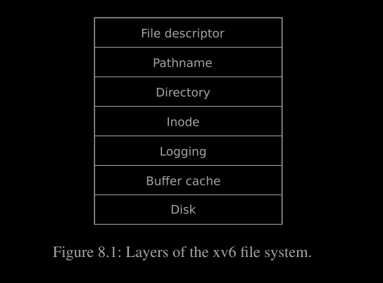

# File system

文件系统的目的在于组织和存储数据。文件系统通常支持用户和应用程序之间的数据共享，并且提供持久性，确保数据在重启后仍然可用。

xv6 文件系统提供了类似 Unix 的文件、目录和路径名（见第 1 章），并将其数据存储在 virtio 磁盘上以实现持久性。文件系统解决了几个挑战：

+ 文件系统需要在磁盘上设置数据结构，以表示命名目录和文件的树形结构，记录每个文件内容所在的块的标识，以及记录哪些磁盘区域是空闲的。
+ 文件系统必须支持崩溃恢复。也就是说，如果发生崩溃（例如，电源故障），文件系统在重启后仍然必须正常工作。风险在于崩溃可能会中断更新序列，并留下不一致的磁盘数据结构（例如，一个块既被用于文件中，又标记为空闲）。
+ 不同的进程可能同时操作文件系统，因此文件系统代码必须协调以维护不变性。
+ 访问磁盘的速度比访问内存慢几个数量级，因此文件系统必须保持一个内存缓存，以存储常用块。
本章的其余部分解释了 xv6 如何解决这些挑战。

## 8.1 Overview
xv6 文件系统的实现分为七个层次，如图 8.1 所示：



1. 磁盘层：负责在 virtio 硬盘上读取和写入数据块。
2. 缓存层：缓存磁盘块并同步对这些块的访问，确保同一时间只有一个内核进程可以修改特定块中的数据。
3. 日志层：允许更高层将对多个块的更新封装在一个事务中，确保这些块在面对崩溃时以原子方式更新（即，要么全部更新，要么全部不更新）。
4. i 节点层：提供单独的文件，每个文件由一个具有唯一 i-number 的 i 节点表示，并有一些块存储文件的数据。
5. 目录层：将每个目录实现为一种特殊类型的 i 节点，其内容是目录条目的序列，每个条目包含文件的名称和 i-number。
6. 路径名层：提供类似 /usr/rtm/xv6/fs.c 的层级路径名，并通过递归查找解析这些路径名。
7. 文件描述符层：使用文件系统接口抽象许多 Unix 资源（例如管道、设备、文件等），简化应用程序开发者的工作。

磁盘硬件传统上将磁盘上的数据呈现为编号的 512 字节块（也称为扇区）：扇区 0 是前 512 字节，扇区 1 是接下来的 512 字节，以此类推。操作系统用于其文件系统的块大小可能与磁盘使用的扇区大小不同，但通常块大小是扇区大小的倍数。xv6 在内存中以 `struct buf` 类型的对象保存读取的块副本（见 kernel/buf.h:1）。这个结构中存储的数据有时与磁盘不一致：它可能尚未从磁盘读取（即磁盘正在处理，但尚未返回扇区内容），或者它可能已被软件更新但尚未写入磁盘。


文件系统必须有一个计划来决定它在磁盘上存储 `inode` 和内容块的位置。为此，xv6 将磁盘划分为几个部分，如图 8.2 所示。文件系统不使用块 0（它包含引导扇区）。块 1 被称为超级块（superblock）；它包含关于文件系统的元数据（文件系统的大小（以块为单位）、数据块的数量、inode 的数量以及日志中的块数量）。从块 2 开始是日志区域。日志之后是 `inode`，每块包含多个 `inode`。接下来是位图块（bitmap blocks），用于跟踪哪些数据块正在使用。剩余的块是数据块；每个数据块要么在位图块中标记为空闲，要么存储文件或目录的内容。超级块由一个单独的程序（称为 mkfs）填充，该程序构建了一个初始的文件系统。

本章剩余部分讨论每一层，从缓冲区缓存（buffer cache）开始。注意低层良好抽象的情况如何简化高层的设计。

## 8.2 Buffer cache layer

缓冲区缓存（buffer cache）有两个主要职责：（1）同步对磁盘块的访问，以确保内存中只有一个块的副本，并且一次只有一个内核线程使用该副本；（2）缓存热门块，以避免从较慢的磁盘重新读取。相关代码位于 bio.c。

缓冲区缓存主要通过 `bread` 和 `bwrite` 这两个接口提供服务；`bread` 用于获取一个包含磁盘块副本的 `buf` 对象，可以在内存中读取或修改，`bwrite` 则将修改后的缓冲区写回磁盘上的相应块。内核线程在完成对缓冲区的操作后必须调用 `brelse` 释放该缓冲区。缓冲区缓存使用每个缓冲区的睡眠锁，以确保一次只有一个线程使用每个缓冲区（从而每个磁盘块）。`bread` 返回一个被锁定的缓冲区，`brelse` 则释放锁。

缓冲区缓存有固定数量的缓冲区用于存储磁盘块，这意味着如果文件系统请求一个不在缓存中的块，缓冲区缓存必须回收一个当前持有其他块的缓冲区。缓冲区缓存会回收最近最少使用的缓冲区来存放新块。假设是最近最少使用的缓冲区最不可能在短时间内再次被使用。

## 8.3 Code:Buffer cache

缓冲区缓存是一个双向链表，链表中的缓冲区由 `binit` 函数初始化，`binit` 在 `main` 函数中被调用（位于 kernel/main.c:27），它使用静态数组 `buf` 中的 `NBUF` 个缓冲区（kernel/bio.c:43-52）。所有对缓冲区缓存的访问都通过 `bcache.head` 访问链表，而不是直接访问 `buf` 数组。

每个缓冲区有两个状态字段。字段 `valid` 表示缓冲区包含了块的副本。字段 `disk` 表示缓冲区的内容已经传递给了磁盘，这可能会改变缓冲区的内容（例如，从磁盘写入数据到缓冲区）。

`bread` 函数（位于 kernel/bio.c:93）调用 `bget` 函数来获取给定扇区的缓冲区（kernel/bio.c:97）。如果缓冲区需要从磁盘读取，`bread` 在返回缓冲区之前会调用 `virtio_disk_rw` 来完成读取操作。

`bget` 函数（位于 kernel/bio.c:59）会扫描缓冲区链表，以寻找具有指定设备和扇区号的缓冲区（kernel/bio.c:65-73）。如果找到这样的缓冲区，`bget` 会获取该缓冲区的睡眠锁，然后返回锁定的缓冲区。

如果对于给定的扇区没有缓存的缓冲区，`bget` 必须创建一个新的缓冲区，可能会重用一个之前持有不同扇区的缓冲区。它会第二次扫描缓冲区链表，寻找一个未被使用的缓冲区（`b->refcnt = 0`）；任何这样的缓冲区都可以被使用。`bget` 会编辑缓冲区的元数据以记录新的设备和扇区号，并获取它的睡眠锁。需要注意的是，赋值 `b->valid = 0` 确保 `bread` 会从磁盘读取块数据，而不是错误地使用缓冲区的先前内容。

确保每个磁盘扇区至多有一个缓存的缓冲区是非常重要的，这样可以确保读者能看到写入的内容，同时因为文件系统使用缓冲区上的锁进行同步。`bget` 通过从第一个循环检查块是否被缓存开始，一直持有 `bcache.lock`，直到第二个循环中声明块现在已经被缓存（通过设置 dev、blockno 和 refcnt）来确保这一不变量。这使得检查块是否存在以及（如果不存在）指定一个缓冲区来持有该块的操作变得原子化。

`bget`在`bcache.lock`临界区之外获取缓冲区的睡眠锁是安全的，因为非零的`b->refcnt`防止了缓冲区被重用到另一个磁盘块上。睡眠锁保护了块的缓存内容的读写，而`bcache.lock` 保护了关于哪些块被缓存的信息。

如果所有的缓冲区都在使用中，则说明同时执行文件系统调用的进程过多；`bget` 会引发 `panic`。一个更优雅的响应方式可能是等待直到某个缓冲区变为空闲，但这可能会导致死锁的可能性。

一旦 `bread` 读取了磁盘（如果需要的话）并将缓冲区返回给调用者，调用者就拥有了该缓冲区的独占使用权，可以读取或写入数据字节。如果调用者修改了缓冲区，它必须在释放缓冲区之前调用 `bwrite` 将更改后的数据写入磁盘。`bwrite`（在 kernel/bio.c:107 中）调用 `virtio_disk_rw` 与磁盘硬件进行通信。

当调用者完成对缓冲区的操作时，必须调用 `brelse` 来释放它。`brelse`（在 kernel/bio.c:117 中）释放睡眠锁并将缓冲区移动到链表的前面（kernel/bio.c:128-133）。移动缓冲区使得列表按照缓冲区被使用的时间排序（即被释放的时间）：列表中的第一个缓冲区是最近使用的，最后一个是最久未使用的。`bget` 中的两个循环利用了这一点：在最坏情况下，扫描现有缓冲区必须处理整个列表，但首先检查最近使用的缓冲区（从 bcache.head 开始，并沿着 `next` 指针）会在引用局部性良好的情况下减少扫描时间。选择要重用的缓冲区时，通过扫描倒退（沿着 `prev` 指针）来选择最久未使用的缓冲区。


## 8.4 Logging layer

文件系统设计中最有趣的问题之一是崩溃恢复。这个问题的出现是因为许多文件系统操作涉及对磁盘的多个写入，而在写入的子集完成后发生崩溃可能会使磁盘上的文件系统处于不一致的状态。例如，假设在文件截断（将文件长度设置为零并释放其内容块）期间发生崩溃。根据磁盘写入的顺序，崩溃可能会导致一个 `inode` 保留对一个标记为已释放的内容块的引用，或者可能会留下一个已分配但未被引用的内容块。

后者相对无害，但一个引用已释放块的 inode 在重启后可能会引发严重问题。重启后，内核可能会将该块分配给另一个文件，这样就会出现两个不同的文件无意中指向同一个块的情况。如果 xv6 支持多用户，这种情况可能会成为一个安全问题，因为旧文件的所有者将能够读写新文件中的块，而新文件由不同的用户拥有。

Xv6 通过一种简单的日志记录形式解决了文件系统操作中的崩溃问题。xv6 的系统调用不会直接写入磁盘上的文件系统数据结构。相反，它将所有希望执行的磁盘写操作的描述放入磁盘上的日志中。一旦系统调用将所有写操作记录到日志中，它会向磁盘写入一个特殊的提交记录，表明日志包含了一个完整的操作。此时，系统调用将这些写操作复制到磁盘上的文件系统数据结构中。在这些写操作完成后，系统调用会清除磁盘上的日志。

如果系统崩溃并重启，文件系统代码在运行任何进程之前会按照以下步骤从崩溃中恢复：如果日志被标记为包含完整的操作，恢复代码会将这些写操作复制到磁盘上的正确位置。如果日志没有标记为包含完整的操作，恢复代码会忽略该日志。恢复代码最后会清除日志。

为什么xv6的日志能解决文件系统操作中的崩溃问题？如果崩溃发生在操作提交之前，则磁盘上的日志不会被标记为完整，恢复代码会忽略它，磁盘的状态就像操作根本没有开始一样。如果崩溃发生在操作提交之后，恢复过程会重放所有操作的写入，如果操作已经开始将数据写入磁盘数据结构，可能会重复这些写入。在这两种情况下，日志使得操作在崩溃方面具有原子性：恢复后，操作的所有写入要么全部出现在磁盘上，要么一个也没有出现。

## 8.5 Log design

日志位于一个已知的固定位置，该位置在超级块中指定。它由一个头块和一系列更新的块副本（即“日志块”）组成。头块包含一个扇区号数组，每个日志块对应一个扇区号，以及日志块的数量。磁盘上的头块中的计数值要么为零，表示日志中没有事务，要么为非零，表示日志包含一个完整提交的事务，并且有指示数量的日志块。xv6 在事务提交时写入头块，但在此之前不会写入，并且在将日志块复制到文件系统后，将计数值设置为零。因此，在事务进行中的崩溃将导致日志头块中的计数为零；在提交后的崩溃将导致计数为非零。

每个系统调用的代码指示了必须在崩溃时保持原子性的写入序列的开始和结束。为了允许不同进程的文件系统操作并发执行，日志系统可以将多个系统调用的写入累积到一个事务中。因此，一个单独的提交可能涉及多个完整的系统调用的写入。为了避免将一个系统调用拆分到多个事务中，日志系统仅在没有正在进行的文件系统系统调用时才进行提交。

将多个事务一起提交的想法称为“组提交”。组提交通过将提交的固定成本分摊到多个操作上，从而减少磁盘操作的次数。组提交还允许磁盘系统同时处理更多的并发写入，可能使磁盘在一次旋转中完成所有这些写入。虽然 x86 的 `virtio` 驱动程序不支持这种批处理，但 xv6 的文件系统设计允许这种操作。

xv6 在磁盘上专门分配了一定的空间来存储日志。系统调用在一个事务中写入的总块数必须适合这个空间。这有两个后果。首先，任何单个系统调用不能写入超过日志空间的块数。对于大多数系统调用而言，这不是问题，但有两个系统调用可能写入大量块：`write` 和 `unlink`。写入一个大文件可能会写入许多数据块和位图块，以及一个 `inode` 块；删除一个大文件可能会写入许多位图块和一个 `inode`。xv6 的 `write` 系统调用将大写操作拆分为多个较小的写入，以适应日志空间，而 `unlink` 不会造成问题，因为实际中 xv6 文件系统只使用一个位图块。有限日志空间的另一个后果是，日志系统不能允许系统调用开始，除非它确定系统调用的写入会适合日志中剩余的空间。

## 8.6 Code: logging

在系统调用中使用日志的典型方式如下：


`begin_op`（kernel/log.c:127）会等待，直到日志系统当前不在进行提交，并且有足够的未保留日志空间来容纳该调用的写入。`log.outstanding` 计数了已经保留日志空间的系统调用数量；总的保留空间是 `log.outstanding` 乘以 `MAXOPBLOCKS`。增加 `log.outstanding` 不仅保留空间，还防止在此系统调用期间发生提交。代码保守地假设每个系统调用可能写入多达 `MAXOPBLOCKS` 个不同的块。

>`log.lh.n + (log.outstanding+1)*MAXOPBLOCKS > LOGSIZE`
> log.lh.n: 当前日志中已使用的空间。
> log.outstanding: 当前有多少个未提交的操作在等待中
> MAXOPBLOCKS: 每个操作所需的最大块数
> (log.outstanding+1) * MAXOPBLOCKS: 加上当前正在等待提交的操作以及即将开始的新操作所需要的日志空间。如果这些操作都提交了，会占用 (log.outstanding+1)*MAXOPBLOCKS 大小的空间。

`log_write`（kernel/log.c:215）充当 `bwrite` 的代理。它在内存中记录块的扇区号，为其在磁盘上的日志中保留一个位置，并将缓冲区固定在块缓存中，以防止块缓存驱逐它。块必须保持在缓存中直到提交：在此之前，缓存的副本是唯一的修改记录；它在提交之后才能写入磁盘上的位置；同一事务中的其他读取必须看到这些修改。`log_write` 会注意到一个块在单个事务中被多次写入，并将该块分配到日志中的相同位置。这种优化通常称为吸收。比如，包含多个文件 `inode` 的磁盘块在事务中可能被多次写入。通过将多个磁盘写入合并为一个，文件系统可以节省日志空间，并且可以实现更好的性能，因为只需要将块的一个副本写入磁盘。

`end_op` 函数（位于 kernel/log.c:147）首先减少未完成系统调用的计数。如果计数减为零，它会通过调用 `commit()` 来提交当前事务。这个过程分为四个阶段：
`write_log()` (kernel/log.c:179): 将事务中修改过的每个块从缓冲区缓存复制到日志中的相应位置。
`write_head()` (kernel/log.c:103): 将头块写入磁盘。此操作标志着提交点，如果在写入后发生崩溃，恢复过程会从日志中重新执行事务的写操作。
`install_trans `(kernel/log.c:69): 从日志中读取每个块，并将其写入文件系统的适当位置。
`end_op:` 将日志头写入磁盘，设置计数为零。这一步必须在下一个事务开始写入日志块之前完成，以避免崩溃时恢复过程使用一个事务的头部与后续事务的日志块混合使用的情况。

  end_op():
   日志块的头块（log header block）主要用于保存事务的元数据和管理信息。
   hb->n : 记录当前事务涉及的日志块的数量。这告诉系统需要处理多少个日志块来完成事务恢复。
   hb->block[i]: 保存每个日志块的块编号。这些块编号指示了哪些数据块在当前事务中被修改，并记录在日志中;
   当系统崩溃后，日志头块提供了恢复当前事务所需的信息。通过读取日志头块，系统可以确定在日志中找到哪些数据块，并将这些数据块应用到实际的数据块中，从而恢复事务之前的状态。日志头块帮助系统保证事务的一致性和完整性。它记录了所有修改的块的标识，以确保在恢复时能够正确地应用所有修改。


`recover_from_log`（位于 kernel/log.c:117）在 `initlog`（位于 kernel/log.c:55）中被调用，而` initlog `又是在启动时在 `fsinit`（位于 kernel/fs.c:42）中被调用的，发生在第一个用户进程运行之前（kernel/proc.c:520）。`recover_from_log` 读取日志头部，如果头部指示日志包含一个已提交的事务，它将模拟 `end_op` 的操作。

日志的一个实际使用示例出现在 `filewrite`（位于 kernel/file.c:135）中。事务的过程如下：


这段代码被包裹在一个循环中，该循环将大写操作分解为每次仅涉及少量扇区的单独事务，以避免溢出日志。`writei` 调用在这个事务中写入许多块，包括文件的 `inode`、一个或多个位图块以及一些数据块。

## 8.7 Code: Block allocator

文件和目录内容存储在磁盘块中，这些块必须从一个空闲池中分配。Xv6 的块分配器在磁盘上维护一个空闲位图，每个块对应一个位。位为零表示相应的块是空闲的；位为一表示它正在使用中。程序 `mkfs` 设置了与引导扇区、超级块、日志块、inode 块和位图块对应的位。

块分配器提供了两个功能：`balloc` 分配一个新的磁盘块，`bfree` 释放一个块。`balloc` 的循环（在 kernel/fs.c:71 中）检查每一个块，从块 0 到 sb.size，即文件系统中的块总数。它寻找一个位图位为零的块，这表明该块是空闲的。如果 `balloc` 找到这样的块，它会更新位图并返回该块。为了提高效率，这个循环被分为两部分。外部循环读取每个位图块；内部循环检查单个位图块中的所有位（Bits-Per-Block, BPB）。两个进程同时尝试分配一个块时可能发生的竞争条件被避免了，因为缓冲区缓存只允许一个进程在任何时间使用一个位图块。

`bfree`（在 kernel/fs.c:90 中）找到正确的位图块并清除正确的位。再次地，`bread` 和 `brelse` 所隐含的独占使用避免了显式锁定的需要。

与本章其余部分描述的大多数代码一样，`balloc` 和 `bfree` 必须在事务内部调用。

## 8.8 Inode layer 

术语“inode”可以有两个相关的含义。它可能指的是包含文件大小和数据块编号列表的磁盘上的数据结构。或者，“inode”也可能指内存中的 inode，它包含磁盘上 inode 的副本以及内核内需要的额外信息。

>inode（索引节点）是文件系统中用于存储文件元数据的数据结构。每个文件或目录在文件系统中都有一个对应的 inode，它包含了关于该文件或目录的各种信息。
>数据块（data block）是文件系统中用于存储实际文件数据的单位。文件数据被分割成多个数据块，每个数据块通常具有固定的大小.文件系统使用数据块来存储文件的内容。
>Inode 和数据块的关系:
指针: inode 中包含指向数据块的指针，这些指针指向存储文件内容的实际数据块。
数据块存储: 文件的实际数据是分布在多个数据块中，而 inode 通过指针来引用这些数据块.
组织:inode 本身不代表一个数据块，而是一个结构体，包含了指向数据块的指针。文件的内容分散在多个数据块中，而 inode 提供了访问这些数据块的方式。

磁盘上的 `inodes` 被打包到一个称为 `inode` 块的连续磁盘区域中。每个 `inode` 大小相同，因此给定一个编号 `n`，很容易找到磁盘上的第 `n` 个 `inode`。实际上，这个编号 `n`，称为 `inode` 编号或 `i-number`，是在实现中识别 `inodes` 的方式。

磁盘上的 `inode` 由 `struct dinode`（在 kernel/fs.h:32 中定义）定义。`type` 字段区分文件、目录和特殊文件（设备）。一个值为零的 `type` 表示磁盘上的 `inode` 是空闲的。`nlink` 字段计算引用此 `inode` 的目录项数量，以便确定何时应该释放磁盘上的 `inode` 及其数据块。`size` 字段记录文件内容的字节数。`addrs` 数组记录保存文件内容的磁盘块的块编号。

内核将活动的 `inode` 集合保存在内存中的一个称为 `itable` 的表中；`struct inode`（在 kernel/file.h:17 中）是磁盘上 `struct dinode` 的内存副本。内核仅在存在 C 指针引用该 `inode` 时才将 `inode` 存储在内存中。`ref` 字段计算引用内存 `inode` 的 C 指针数量，如果引用计数降到零，内核会从内存中丢弃 `inode`。`iget` 和 `iput` 函数获取和释放对 `inode` 的指针，修改引用计数。对 `inode` 的指针可以来自文件描述符、当前工作目录以及临时内核代码（如 exec）。

>dinode 和 inode 是两个相关但不同的概念，它们的定义和意义如下：
>dinode:dinode（磁盘 inode）是文件系统中用于直接在磁盘上存储文件元数据的结构体。它是存储在磁盘上的原始数据格式，用于管理文件的属性和指针。
dinode 是文件系统与磁盘交互时所使用的结构。它包含了文件的基本信息，如文件大小、权限、指向数据块的指针等。
dinode 是在磁盘上物理存储的结构，因此它可能会有一些与内存中的 inode 不同的布局，以便优化磁盘的读取和写入操作
>inode:inode（索引节点）是文件系统在内存中的表示，用于管理文件的元数据。它通常是对磁盘上 dinode 的一个抽象，提供了一种在内存中高效管理文件的方式。
inode 提供了对磁盘上的 dinode 进行操作的接口。它在内存中以一种可能更易于操作的格式存在，并可以被文件系统的各种操作所使用。
在文件系统中，inode 负责管理文件的元数据，如文件的权限、大小、数据块指针等，并且提供对这些信息的快速访问。
>dinode:
位置: 存储在磁盘上。
作用: 直接与磁盘上的数据块进行交互，存储文件的原始元数据
inode:
位置: 存储在内存中。
作用: 提供对文件元数据的操作接口，管理文件系统中的文件，支持各种文件操作。


在 xv6 的 `inode` 代码中有四种锁定或类似锁定的机制。`itable.lock` 保护以下不变量：`inode` 在 `inode` 表中最多出现一次，以及内存中 `inode` 的 `ref` 字段计算指向该 `inode` 的内存指针数量。每个内存中的 `inode` 有一个包含 `sleep-lock` 的 `lock` 字段，确保对 `inode` 的字段（如文件长度）以及 `inode` 的文件或目录内容块的独占访问。一个 `inode` 的 ref 如果大于零，会导致系统将 `inode` 保留在表中，而不会将表项重新用于不同的 `inode`。最后，每个 `inode` 包含一个 `nlink` 字段（磁盘上以及如果在内存中也会被复制），计算引用文件的目录项数量；如果 `inode` 的链接计数大于零，xv6 不会释放 `inode`。

`iget() `返回的 `struct inode` 指针在相应的 `iput()` 调用之前是有效的；`inode` 不会被删除，指针所指向的内存也不会被重新用于不同的 `inode`。`iget()` 提供对 `inode` 的非独占访问，因此可以有多个指针指向同一个 `inode`。文件系统代码的许多部分依赖于 `iget()` 的这种行为，既用于持有对 `inode` 的长期引用（如打开的文件和当前目录），又用于在操作多个 `inode` 的代码中防止竞争条件，同时避免死锁（例如路径名查找）。

`iget` 返回的 `struct inode` 可能没有任何有用的内容。为了确保它持有磁盘上 `inode` 的副本，代码必须调用 `ilock`。这会锁定 `inode`（以便没有其他进程可以锁定它），并从磁盘读取 `inode`（如果尚未读取）。`iunlock` 释放 `inode` 上的锁。将 `inode` 指针的获取与锁定分开有助于避免在某些情况下的死锁，例如在目录查找期间。多个进程可以持有由 `iget` 返回的 `inode` 的 C 指针，但一次只能有一个进程锁定 `inode`。

`inode` 表仅存储内核代码或数据结构持有 C 指针的 `inodes`。它的主要工作是同步多个进程的访问。`inode` 表也偶尔会缓存频繁使用的 `inodes`，但缓存是次要的；如果一个 `inode` 被频繁使用，缓冲区缓存可能会将其保留在内存中。修改内存中 `inode` 的代码使用 `iupdate` 将其写入磁盘。

## 8.9 Code:inodes

为了分配一个新的 `inode`（例如，当创建一个文件时），xv6 调用 `ialloc`（在 kernel/fs.c:196）。`ialloc` 与 `balloc` 类似：它逐块检查磁盘上的 `inode` 结构，寻找标记为免费（free）的 `inode`。当它找到一个时，它通过将新类型写入磁盘来占用它，然后通过尾调用 `iget`（在 kernel/fs.c:210）返回 `inode` 表中的一个条目。`ialloc` 的正确操作依赖于以下事实：一次只有一个进程可以持有对 `bp` 的引用；`ialloc` 可以确保没有其他进程同时看到 `inode` 可用并尝试占用它。

`iget`（在 kernel/fs.c:243）在 `inode` 表中查找具有所需设备和 `inode` 编号的活动条目（ip->ref > 0）。如果找到，它返回对该 `inode` 的新引用（在 kernel/fs.c:252-256）。在扫描过程中，`iget` 记录第一个空槽的位置（在 kernel/fs.c:257-258），如果需要分配表条目时使用。

代码必须在读取或写入 `inode` 的元数据或内容之前使用 `ilock `锁定 `inode`。`ilock`（在 kernel/fs.c:289）为此使用 `sleep-lock`。一旦 `ilock` 获得对 `inode` 的独占访问权限，它会从磁盘（更可能是缓冲区缓存）中读取 `inode`（如果需要的话）。函数 `iunlock`（在 kernel/fs.c:317）释放 `sleep-lock`，这可能会唤醒任何正在等待的进程。

`iput`（在 kernel/fs.c:333）通过递减引用计数来释放对 `inode` 的 C 指针（在 kernel/fs.c:356）。如果这是最后一个引用，则 `inode` 表中的 `inode` 槽现在是空闲的，可以被重新用于不同的 `inode`。如果 `iput` 发现没有对 `inode` 的 C 指针引用，并且 `inode` 没有链接到它（即不在任何目录中），则 `inode` 及其数据块必须被释放。`iput` 调用 `itrunc` 将文件截断为零字节，释放数据块；将 `inode` 类型设置为 0（未分配）；并将 `inode` 写入磁盘（在 kernel/fs.c:338）。

在 `iput `中释放 `inode` 的锁定协议值得仔细查看。一个危险是并发线程可能正在 `ilock` 中等待使用该 `inode`（例如，读取文件或列出目录），并且不会准备好发现 `inode` 不再分配。这种情况不会发生，因为系统调用无法获得对没有链接到它的内存 `inode` 的指针，并且 `ip->ref` 是 1。那个唯一的引用是由调用 `iput` 的线程持有的。确实，`iput` 在 `itable.lock` 临界区之外检查引用计数是否为 1，但在此时链接计数已知为零，因此没有线程会尝试获取新的引用。另一个主要危险是并发调用 `ialloc` 可能选择与 `iput` 正在释放的 `inode` 相同的 `inode`。这种情况只会在 `iupdate` 将磁盘写入 `inode` 类型为零之后发生。这个竞争是无害的；分配线程会礼貌地等待获取 `inode` 的 `sleep-lock`，然后才会读取或写入 `inode`，此时 `iput` 已经完成对该 `inode` 的处理。

`iput()` 可以写入磁盘。这意味着任何使用文件系统的系统调用都可能写入磁盘，因为系统调用可能是对文件的最后一个引用。即使是像 `read()` 这样的只读调用，也可能最终调用 `iput()`。这反过来意味着即使是只读系统调用，如果它们使用文件系统，也必须包裹在事务中。`iput()` 和崩溃之间存在挑战性的交互。

`iput()` 不会立即截断文件，当文件的链接计数降到零时，因为某些进程可能仍持有对内存中 `inode` 的引用：一个进程可能仍在读取和写入文件，因为它成功地打开了文件。但是，如果崩溃发生在最后一个进程关闭文件描述符之前，那么文件将被标记为磁盘上已分配，但没有目录条目指向它。

文件系统处理这种情况的方式有两种。简单的解决方案是，在恢复后，系统启动时，文件系统扫描整个文件系统以查找标记为已分配但没有目录条目指向它们的文件。如果存在这样的文件，则可以释放这些文件。

第二种解决方案不需要扫描文件系统。在这种解决方案中，文件系统在磁盘上（例如，在超级块中）记录一个文件的 `inode` 编号，该文件的链接计数降到零但引用计数不为零。如果文件系统在引用计数降到零时删除文件，则更新磁盘上的列表，通过从列表中移除该 `inode`。在恢复时，文件系统释放列表中的任何文件。xv6 实现了这两种解决方案，这意味着 `inode` 可能在磁盘上标记为已分配，即使它们不再被使用。这意味着随着时间的推移，xv6 有可能耗尽磁盘空间。

## 8.10 Code:Inode content


磁盘上的 `inode` 结构 `struct dinode` 包含一个大小字段和一个块号数组（见图 8.3）。`inode` 数据存储在 `dinode` 的 `addrs` 数组列出的块中。前 `NDIRECT` 个数据块在数组的前 `NDIRECT` 个条目中列出，这些块称为直接块。接下来的 `NINDIRECT` 个数据块不在 `inode` 中列出，而是在一个称为间接块的数据块中列出。`addrs` 数组的最后一个条目给出了间接块的地址。因此，文件的前 12 KB（NDIRECT x BSIZE）字节可以从 `inode` 列出的块中加载，而接下来的 256 KB（NINDIRECT x BSIZE）字节只能在查阅间接块后加载。这种表示方法在磁盘上是有效的，但对客户端而言比较复杂。函数 `bmap` 管理这种表示，以便较高级的例程（例如 `readi` 和 `writei`，我们将很快看到）不需要处理这种复杂性。`bmap` 返回 `inode ip` 的第 `bn` 个数据块的磁盘块号。如果 `ip` 尚未有这样的块，`bmap` 会分配一个。

`bmap` 函数（kernel/fs.c:378）首先处理简单情况：前 `NDIRECT` 个块在 `inode` 本身中列出（kernel/fs.c:383-387）。接下来的 `NINDIRECT` 个块在间接块中列出，位于 `ip->addrs[NDIRECT]`。`bmap` 读取间接块（kernel/fs.c:394），然后从块的正确位置读取块号（kernel/fs.c:395）。如果块号超过 `NDIRECT + NINDIRECT`，`bmap` 会 `panic`；`writei` 包含防止这种情况发生的检查（kernel/fs.c:494）。

`bmap` 会根据需要分配块。`ip->addrs[]` 或间接条目的零值表示未分配任何块。当 `bmap` 遇到零时，会将其替换为新分配的块号（kernel/fs.c:384-385 和 kernel/fs.c:392-393）。

>bmap
>直接块，返回的是地址：ip->addrs[bn]  bn<12
>间接块返回：
先找到间接块的地址： addr = ip->addrs[NDIRECT]
读取地址，找到块地址存的位置：bp = bread(ip->dev, addr);a = (uint*)bp->data;
返回地址：addr = a[bn]
因为一个块大小1024字节，而地址是4字节，所以有1024/4=256个块

`itrunc` 释放文件的块，将 `inode` 的大小重置为零。`itrunc`（kernel/fs.c:410）首先释放直接块（kernel/fs.c:416-421），然后释放在间接块中列出的块（kernel/fs.c:426-429），最后释放间接块本身（kernel/fs.c:431-432）。

`bmap` 使得 `readi` 和 `writei` 可以轻松访问 `inode` 的数据。`readi`（kernel/fs.c:456）首先确保偏移量和计数不会超过文件末尾。超出文件末尾的读取会返回错误（kernel/fs.c:461-462），而在文件末尾开始或穿越的读取会返回比请求的字节数少的字节（kernel/fs.c:463-464）。主循环处理文件的每个块，将数据从缓冲区复制到 `dst`（kernel/fs.c:466-475）。`writei`（kernel/fs.c:487）与 `readi` 基本相同，有三个例外：以文件末尾开始或穿越的写入会扩展文件，直到最大文件大小（kernel/fs.c:494-495）；循环将数据复制到缓冲区中而不是从缓冲区中（kernel/fs.c:36）；如果写入扩展了文件，`writei` 必须更新其大小。

`readi` 和 `writei` 都开始检查 `ip->type == T_DEV`。此情况处理特殊设备，其数据不在文件系统中；我们将在文件描述符层中回到这个情况。

函数 `stati`（kernel/fs.c:442）将 `inode `元数据复制到 `stat `结构中，该结构通过 `stat` 系统调用暴露给用户程序。

## 8.11 Code:directory

目录的实现内部类似于文件。它的 `inode` 类型为 `T_DIR`，数据是目录项的序列。每个目录项是一个 `struct dirent`（kernel/fs.h:56），包含一个名称和一个 `inode `编号。名称最多为 `DIRSIZ`（14）个字符；如果更短，它会以一个 `NULL`（0）字节结束。`inode` 编号为零的目录项表示空闲。

函数 `dirlookup`（kernel/fs.c:530）在目录中搜索具有给定名称的目录项。如果找到，它会返回指向相应 `inode` 的指针，并解锁该 `inode`，同时设置 `*poff` 为目录项在目录中的字节偏移量，以便调用者可能需要编辑它。如果 `dirlookup` 找到具有正确名称的目录项，它会更新 `*poff `并返回通过 `iget `获取的解锁 `inode`。`dirlookup` 是 `iget` 返回解锁 `inode` 的原因。调用者已经锁定了 `dp`，因此如果查找的是 .，即当前目录的别名，尝试在返回之前锁定 `inode` 会尝试重新锁定 `dp` 并导致死锁。（还有更复杂的死锁场景涉及多个进程和 ..，即父目录的别名；. 不是唯一的问题。）调用者可以解锁 `dp`，然后锁定 `ip`，确保它一次只持有一个锁。

函数 `dirlink`（kernel/fs.c:557）将具有给定名称和 `inode` 编号的新目录项写入目录 `dp`。如果名称已经存在，`dirlink` 将返回错误（kernel/fs.c:563-567）。主要循环读取目录项，寻找未分配的目录项。当找到一个时，它会提前停止循环（kernel/fs.c:541-542），off 设置为可用目录项的偏移量。否则，循环结束时 `off` 设置为 `dp->size`。无论哪种情况，`dirlink` 都会在目录中添加一个新条目，写入偏移量 `off` 处（kernel/fs.c:577-580）。

## 8.12 Code:Path names

路径名查找涉及一系列对 `dirlookup` 的调用，每个路径组件对应一次调用。`namei`（kernel/fs.c:664）评估路径并返回相应的 `inode`。函数 `nameiparent` 是一个变体：它在最后一个元素之前停止，返回父目录的 inode 并将最后一个元素复制到 `name` 中。两者都调用通用函数 `namex` 来执行实际的工作。

`namex`（kernel/fs.c:629）首先决定路径评估的起点。如果路径以斜杠开始，评估从根目录开始；否则，从当前目录开始（kernel/fs.c:633-636）。然后它使用 `skipelem` 逐个考虑路径中的每个元素（kernel/fs.c:638）。每次循环迭代都必须在当前的 `inode ip` 中查找 `name`。迭代开始时会锁定 `ip` 并检查它是否为目录。如果不是，查找失败（kernel/fs.c:639-643）。(锁定 ip 并不是因为 `ip->type` 可能会在执行过程中改变——它不会改变——而是因为在 `ilock` 运行之前，`ip->type` 不一定已经从磁盘加载。) 如果调用是 `nameiparent `并且这是最后一个路径元素，循环会提前停止，按照 `nameiparent` 的定义；最后的路径元素已经被复制到 `name` 中，因此 `namex` 只需返回解锁的 `ip`（kernel/fs.c:644-648）。最后，循环使用 `dirlookup` 查找路径元素，并通过设置 `ip = next` 为下一次迭代做准备（kernel/fs.c:649-654）。当循环遍历完路径元素后，它返回 ip。

`namex` 可能需要很长时间才能完成：它可能涉及几个磁盘操作来读取路径名中遍历的目录的 `inode` 和目录块（如果它们不在缓冲区缓存中）。Xv6 被精心设计，以便如果一个内核线程在磁盘 I/O 上被阻塞，另一个内核线程查找不同的路径名可以并行进行。

`namex` 为路径中的每个目录分别加锁，以便不同目录中的查找可以并行进行。这种并发性带来了一些挑战。例如，当一个内核线程在查找路径名时，另一个内核线程可能通过解除链接操作改变目录树。一个潜在的风险是，查找可能正在搜索一个已经被另一个内核线程删除的目录，并且该目录的块已经被重用为另一个目录或文件。

Xv6 避免了这种竞争。例如，在 `namex` 执行` dirlookup` 时，查找线程持有目录的锁，并且 `dirlookup` 返回通过 `iget` 获取的 `inode`。`iget` 增加了 `inode` 的引用计数。只有在从 `dirlookup` 收到 `inode` 后，`namex` 才会释放对目录的锁。现在另一个线程可能会从目录中解除 `inode` 的链接，但 Xv6 不会立即删除 `inode`，因为 `inode` 的引用计数仍然大于零。

另一个风险是死锁。例如，在查找 . 时，`next` 指向与 `ip` 相同的 `inode`。如果在释放对 `ip` 的锁之前锁定 `next`，将导致死锁。为了避免这种死锁，`namex` 在获取对 `next` 的锁之前会解锁目录。这也再次说明了 `iget` 和 `ilock` 分离的重要性。

## 8.13 File descriptor layer

Unix 接口的一个有趣方面是，大多数 Unix 资源都表示为文件，包括设备，如控制台、管道，以及当然，实际文件。文件描述符层是实现这种统一性的层。Xv6 为每个进程提供了自己的打开文件表，或称文件描述符表，如我们在第 1 章中看到的。

每个打开的文件由一个 `struct file`（kernel/file.h:1）表示，它是一个包装器，围绕着一个 `inode` 或管道，以及一个 `I/O` 偏移量。每次调用 `open` 都会创建一个新的打开文件（一个新的 `struct file`）：如果多个进程独立地打开相同的文件，那么不同的实例将有不同的 I/O 偏移量。另一方面，单个打开的文件（相同的 struct file）可以在一个进程的文件表中多次出现，也可以在多个进程的文件表中出现。这种情况会发生在一个进程使用 `open` 打开文件，然后使用 `dup` 创建别名或通过 `fork` 与子进程共享文件时。引用计数跟踪对特定打开文件的引用数量。文件可以以读取、写入或两者模式打开。`readable` 和 `writable` 字段跟踪这一点。

系统中所有打开的文件都保存在一个全局文件表 `ftable` 中。文件表具有分配文件（filealloc）、创建重复引用（filedup）、释放引用（fileclose）、以及读取和写入数据（fileread 和 filewrite）的函数。前面三个函数遵循现在熟悉的形式。

`filealloc`（kernel/file.c:30）扫描文件表以查找未被引用的文件（f->ref == 0）并返回一个新的引用；`filedup`（kernel/file.c:48）增加引用计数；`fileclose`（kernel/file.c:60）则减少引用计数。当文件的引用计数达到零时，`fileclose` 根据类型释放底层的管道或 `inode`。

`filestat`、`fileread` 和 `filewrite` 函数实现对文件的 `stat`、`read `和 `write` 操作。filestat（kernel/file.c:88）仅允许在 inode 上调用，并且调用 stati。fileread 和 filewrite 检查操作是否被打开模式允许，然后将调用传递给管道或 inode 实现。如果文件代表一个 inode，fileread 和 filewrite 使用 I/O 偏移量作为操作的偏移量，然后将其前移（kernel/file.c:122-123）（kernel/file.c:153-154）。管道没有偏移量的概念。请记住，inode 函数要求调用者处理锁定（kernel/file.c:94-96）（kernel/file.c:121-124）（kernel/file.c:163-166）。inode 锁定具有一个方便的副作用，即读取和写入偏移量会原子地更新，因此对同一文件的多次写入不会相互覆盖，尽管它们的写入可能会交错

## 8.14 System calls

使用底层提供的函数，大多数系统调用的实现都很简单（参见 kernel/sysfile.c）。但是有几个调用值得更详细地查看。

`sys_link` 和 `sys_unlink` 函数编辑目录，创建或删除对 `inode` 的引用。这些是使用事务的另一种好例子。`sys_link`（kernel/sysfile.c:120）首先获取其参数，即两个字符串 `old` 和 `new`（kernel/sysfile.c:125）。假设 `old` 存在且不是目录（kernel/sysfile.c:129-132），`sys_link` 会增加 `ip->nlink` 计数。然后，`sys_link `调用 `nameiparent` 来查找 `new` 的父目录和最终路径元素（kernel/sysfile.c:145），并创建一个指向 `old` 的 `inode` 的新目录条目（kernel/sysfile.c:148）。新的父目录必须存在，并且必须与现有 `inode` 在同一设备上：`inode` 编号在单个磁盘上才有唯一含义。如果发生类似错误，`sys_link`必须回退并减少`ip->nlink`。


事务简化了实现，因为它涉及更新多个磁盘块，但我们不必担心更新的顺序。这些操作要么都成功，要么都不成功。例如，没有事务的话，在创建链接之前更新 `ip->nlink`，会使文件系统暂时处于不安全状态，期间发生崩溃可能会造成严重后果。有了事务，我们不必担心这个问题。

`sys_link `为现有的 `inode` 创建了一个新名称。`create` 函数（kernel/sysfile.c:242）为新 `inode` 创建了一个新名称。它是三个文件创建系统调用的概括：`open`带有`O_CREATE` 标志会创建一个新的普通文件，`mkdir` 创建一个新目录，`mkdev`创建一个新的设备文件。像`sys_link `一样，`create`开始时会调用`nameiparent`来获取父目录的 `inode`。然后它调用`dirlookup` 检查名称是否已经存在（kernel/sysfile.c:252）。如果名称已经存在，`create` 的行为取决于它用于哪个系统调用：`open`与`mkdir`和`mkdev`的语义不同。如果`create`是在`open（type == T_FILE）`的帮助下使用的，且存在的名称本身是常规文件，那么` opsen` 视为成功，`create` 也是如此（kernel/sysfile.c:256）。否则，就会出现错误（kernel/sysfile.c:257-258）。如果名称不存在，`create`现在使用`ialloc` 分配一个新的 `inode`（kernel/sysfile.c:261）。如果新 `inode` 是目录，`create`会用.和.. 条目初始化它。最后，在数据正确初始化后，`create` 可以将其链接到父目录中（kernel/sysfile.c:274）。`create`和`sys_link` 一样，同时持有两个 `inode` 锁：`ip`和`dp`。没有死锁的可能，因为 ip是新分配的：系统中没有其他进程会持有ip的锁然后试图锁定dp。

使用 `create`，实现 `sys_open`、`sys_mkdir`和`sys_mknod` 变得简单`.sys_open`（kernel/sysfile.c:287）是最复杂的，因为创建一个新文件只是它可以做的一小部分。如果 `open`被传递了`O_CREATE`标志，它会调用`create`（kernel/sysfile.c:301）。否则，它会调用 `namei`（kernel/sysfile.c:307）。`create`返回一个已锁定的 `inode`，但`namei`不返回，所以`sys_open` 必须自己锁定 inode。这提供了一个方便的地方来检查目录是否仅用于读取，而不是写入。假设 inode 通过某种方式获得，sys_open 会分配一个文件和文件描述符（kernel/sysfile.c:325），然后填充文件（kernel/sysfile.c:337-342）。注意，没有其他进程可以访问部分初始化的文件，因为它仅在当前进程的表中。

第 7 章在我们甚至没有文件系统之前就考察了管道的实现。sys_pipe` 函数通过提供创建管道对的方式将该实现连接到文件系统。它的参数是一个指向两个整数空间的指针，在这里它会记录两个新的文件描述符。然后它分配管道并安装文件描述符。

## 8.15 Real word

实际操作系统中的缓存机制比 xv6 的复杂得多，但它们服务于相同的两个目的：缓存和同步对磁盘的访问。xv6 的缓存机制像 V6 的一样，使用了简单的最近最少使用（LRU）淘汰策略；然而，还有许多更复杂的策略可以实现，每种策略对某些工作负载有效，对其他工作负载则效果不佳。一个更高效的 LRU 缓存会消除链表，转而使用哈希表进行查找，并使用堆来进行 LRU 淘汰。现代缓存系统通常与虚拟内存系统集成，以支持内存映射文件。

xv6 的日志系统效率低下。提交操作不能与文件系统调用并发进行。系统会记录整个块，即使块中只有几个字节发生变化。它执行同步日志写入，每次写入一个块，每次写入可能需要整个磁盘旋转时间。实际的日志系统解决了所有这些问题。日志并不是提供崩溃恢复的唯一方式。早期的文件系统在重启时使用清理程序（例如 UNIX 的 fsck 程序）来检查每个文件和目录及其块和 inode 空闲列表，寻找并解决不一致性。对于大型文件系统，清理可能需要几个小时，而且有些情况下可能无法以原始系统调用原子性的方式解决不一致性。从日志恢复要快得多，并且在崩溃面前保证系统调用的原子性。

xv6 使用了与早期 UNIX 相同的基本磁盘布局，包括 inode 和目录；这一方案多年来保持了惊人的一致性。BSD 的 UFS/FFS 和 Linux 的 ext2/ext3 本质上使用了相同的数据结构。文件系统布局中最低效的部分是目录，它在每次查找时需要对所有磁盘块进行线性扫描。当目录只有几个磁盘块时，这种做法是合理的，但对于包含许多文件的目录则很昂贵。微软 Windows 的 NTFS、macOS 的 HFS 和 Solaris 的 ZFS 只是其中几个例子，它们将目录实现为磁盘上的平衡树。虽然这比较复杂，但可以保证对目录的查找时间为对数级别。

xv6 对磁盘故障过于天真：如果磁盘操作失败，xv6 会 panic。是否合理取决于硬件：如果操作系统运行在使用冗余来掩盖磁盘故障的特殊硬件上，可能操作系统看到故障的频率非常低，这样 panic 可能是可以接受的。另一方面，使用普通磁盘的操作系统应该预期到故障，并更优雅地处理它们，以确保文件系统的其他部分不受一个文件丢失块的影响。xv6 要求文件系统能够适应单个磁盘设备，并且不会改变大小。随着大型数据库和多媒体文件对存储要求的不断提高，操作系统正在开发消除“每个文件系统一个磁盘”瓶颈的方法。基本的方法是将多个磁盘合并成一个逻辑磁盘。硬件解决方案如 RAID 仍然是最受欢迎的，但当前的趋势是尽可能将这些逻辑实现到软件中。这些软件实现通常允许丰富的功能，比如通过动态添加或移除磁盘来扩展或缩小逻辑设备。当然，一个可以动态扩展或缩小的存储层需要一个同样可以做到这一点的文件系统：xv6 使用的固定大小的 inode 块数组在这种环境下效果不好。将磁盘管理与文件系统分离可能是最干净的设计，但复杂的接口使得一些系统（如 Sun 的 ZFS）将二者结合在一起。xv6 的文件系统缺乏现代文件系统的许多其他特性；例如，它不支持快照和增量备份。现代 Unix 系统允许通过与磁盘存储相同的系统调用访问多种资源：命名管道、网络连接、远程访问的网络文件系统，以及如 /proc 这样的监控和控制接口。与 xv6 在 fileread 和 filewrite 中的 if 语句不同，这些系统通常为每个打开的文件提供一个函数指针表，每个操作一个，并调用函数指针以调用该 inode 的实现。网络文件系统和用户级文件系统提供将这些调用转换为网络 RPC 并等待响应的函数。


### 解释
>硬链接和软连接

**定义：**
硬连接（Hard Link）:
  硬连接是文件系统中一个文件的另一种名称或路径，它直接指向文件的 inode。
  硬连接和原始文件共享同一个 inode 号，因此它们是文件的不同名字，但指向同一个文件内容。

软连接（Symbolic Link）：
  软连接是一个特殊类型的文件，它包含了对另一个文件或目录路径的引用。
  软连接是一个独立的文件，它的内容是一个路径名，指向目标文件或目录。

**文件系统中的表现**
硬连接:
  在文件系统中，硬连接与原始文件没有区别。删除硬连接不会删除文件内容，只有当所有指向该 inode 的硬连接都被删除后，文件内容才会被删除。
  硬连接不能跨文件系统使用，不能用于目录。

软连接:
  软连接是一个独立的文件，具有自己的 inode 和文件名。它的内容是一个指向目标文件或目录的路径。
  软连接可以跨文件系统使用，也可以用于目录。
  如果目标文件被删除，软连接会变成一个悬挂链接（dangling link），指向一个不存在的文件。

**处理和管理**
硬连接:
  由于硬连接和原始文件指向同一个 inode，它们之间的关系非常紧密。对硬连接的修改（如编辑、删除等）会影响所有指向相同 inode 的硬连接。

软连接:
  软连接的路径可能指向一个不存在的文件或目录，因此它们相对独立于目标文件。对软连接的修改不会影响目标文件，只有对目标文件的操作才会影响目标文件本身。


硬连接 是文件系统中对一个文件的多重名字，它们共享相同的 inode 和文件内容，不能跨文件系统，也不能用于目录。
软连接 是一种路径引用，它指向目标文件或目录的路径，可以跨文件系统，且可以用于目录。如果目标文件被删除，软连接会变成悬挂链接。

>目录和文件的存储方式
相似：
  Inode（索引节点）:
  目录和文件都由 inode 结构体表示，inode 包含文件的元数据（如大小、类型、创建时间、修改时间等）以及指向数据块的指针。
  目录和文件的 inode 都有一个唯一的 inode 号，文件系统通过 inode 号来查找和操作具体的文件或目录。

  数据块（Data Blocks）:
  目录和文件的数据内容都存储在数据块中。文件的数据块包含文件的实际内容，而目录的数据块则包含目录项（entries），这些目录项映射到文件的 inode 号。

不同：
目录数据块的结构:
  目录的数据块结构通常与文件不同。目录的每个数据块包含多个目录项（struct dirent），每个目录项记录了一个文件或子目录的名称和其对应的 inode 号。
  目录项的格式和存储方式通常是文件系统设计的关键部分，它负责维护目录中条目的顺序和内容。

文件数据块的内容:
  文件的数据块直接包含文件的实际内容，如文本、图像、二进制数据等。文件的内容可以是任意数据。

数据块的分配和使用:
  对于目录，数据块的分配通常与目录的大小（即包含的目录项数量）有关。目录的大小可以动态增长，增加或减少目录项。
  对于文件，数据块的分配通常与文件的内容大小有关。文件的大小可以动态增长或减少，影响文件占用的数据块数量。

目录项的管理:
  在目录中，每个目录项包括文件或子目录的名称和 inode 号。这些目录项是目录内容的主要组成部分。
  文件系统中的目录项用于组织和查找文件。创建、删除和修改目录项通常涉及对目录数据块的读写操作。

操作和维护:
  对于文件，操作包括读取、写入、截断等，这些操作直接影响文件的数据块。
  对于目录，操作包括添加、删除和修改目录项，这些操作直接影响目录的数据块结构。

**关于存储：**
```cpp
struct dirent {
  ushort inum;        // 目录项对应的 inode 号码
  char name[DIRSIZ];  // 目录项的名字
};
```
ushort inum:
  表示目录项对应的 inode 号码。这个号码是文件系统内部用来唯一标识文件或目录的标识符。通过这个号码，可以在 inode 表中找到对应的 inode 结构体。
char name[DIRSIZ]:
  表示目录项的名字。DIRSIZ 是一个宏定义，通常是目录项名称的最大长度（包括 null 终止符）。它定义了一个足够大的字符数组来存储文件名。


目录项（struct dirent）通常只包含目录或文件的名称和对应的 inode 号码，并不直接包含文件的数据。目录项是用于将目录中的文件名映射到对应的 inode 上，而文件的实际数据存储在 inode 对应的磁盘块中。

1. 目录项 (struct dirent):目录项是目录文件中的记录，用于表示目录中的一个条目。每个目录项有一个名称和一个     inode 号码，inode 号码指向实际的文件或目录的 inode。

2. 文件和目录:
  文件的实际数据存储在 inode 指向的磁盘块中。目录本身也是一种特殊类型的文件，它的内容是其他文件和目录的目录项（struct dirent）。
  当你在目录中添加文件或子目录时，你实际上是在目录文件中添加一个新的目录项（struct dirent），这个目录项的 inum 指向新文件或子目录的 inode。

目录文件的内容
  目录文件的内容是一系列的目录项，每个目录项都对应于目录中的一个文件或子目录。这些目录项的 inum 指向了实际文件或子目录的 inode，而这些 inode 包含了文件或目录的详细信息（如数据块、大小、类型等）。

假设你有一个目录 /home/user，这个目录可能包含几个文件和子目录。在这个目录的 inode 的数据块中，会有若干个 struct dirent 结构体，每个结构体表示目录中的一个文件或子目录。每个目录项的 name 字段是文件或子目录的名字，而 inum 字段是指向文件或子目录的 inode。

**通过dirent怎么读取文件的内容**
1. 通过 struct dirent 获取文件的 inode:
2. 通过 inode 读取文件的内容:

步骤：
  1. 获取 inode，从 struct dirent 中提取文件的 inode 号码，并使用 iget 函数来获取 inode 结构体
     `struct inode *iget(uint dev, uint inum);`
  2. 锁定 inode,在操作 inode 之前，需要锁定 inode，以确保文件系统的一致性。`ilock(ip);`
  3. 读取文件内容
   一旦获取到 inode，你可以使用 readi 函数从 inode 中读取数据。readi 函数可以从 inode 的数据块中读取文件内容。
  4. 完成操作后，解锁并释放 inode。
   ```cpp
    iunlock(ip);
    iput(ip);
   ```
   ```cpp
    int read_file_from_dirent(struct inode *dp, char *filename) {
    int off;
    struct dirent de;
    struct inode *ip;

    // 查找目录项
    if (dirlookup(dp, filename, 0) == 0) {
        return -1; // 文件不存在
    }

    // 查找目录项的内容
    for (off = 0; off < dp->size; off += sizeof(de)) {
        if (readi(dp, 0, (uint64)&de, off, sizeof(de)) != sizeof(de)) {
        panic("read_file_from_dirent: read error");
        }
        if (de.inum != 0 && namecmp(filename, de.name) == 0) {
        // 找到文件，获取其 inode
        ip = iget(dp->dev, de.inum);
        ilock(ip);

        char buf[1024]; // 缓冲区
        int n;

        // 读取文件内容
        n = readi(ip, (uint64)buf, 0, 0, sizeof(buf));
        if (n > 0) {
            // 打印文件内容
            cprintf("File contents:\n");
            write(1, buf, n); // 将文件内容写入标准输出
        } else {
            cprintf("Failed to read file\n");
        }

        iunlock(ip);
        iput(ip);
        return 0;
        }
    }
    
    return -1; // 文件未找到
    }
   ```


