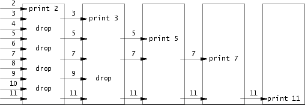

1. fork和exec
   `fork`:创建一个子进程，它是父进程的副本。子进程从 fork 返回的位置开始执行，并拥有与父进程几乎相同的执行   环境。
      子进程拥有父进程数据空间的副本，这使得子进程可以独立于父进程进行操作而不会影响父进程的状态。
      父进程可以创建多个子进程，以实现复杂的任务管理和负载平衡。
   `exec`:系列系统调用将当前进程的内存空间替换为一个新的程序。调用 exec 后，当前进程变成了新的程序，原有的   代码和数据都被替换。
      可以在当前进程中加载和执行一个完全不同的程序
      调用 exec 后，虽然进程的执行内容变了，但进程 ID (PID) 保持不变。这对于某些需要保持进程 ID 的应用场   景非常重要。
      有时候我们只需要替换当前进程的执行内容，而不需要创建一个新的进程。此时，使用 exec 系列函数可以避免不   必要的开销
   fork 和 exec 通常结合使用，以创建一个新进程并在其中执行一个新程序
   使用 fork 创建一个子进程，使得父进程可以继续执行，而子进程可以执行新的任务
2. 理解文件描述符的分配机制
   当你调用 open() 系统调用来打开一个文件时，操作系统会分配一个文件描述符给这个文件。操作系统确保分配的文件描述符是当前可用的最小整数值

   解释：
    1. 文件描述符表：每个进程都有一个**文件描述符表**，初始包含文件描述符 0（标准输入）、1（标准输出）和 2（标准错误）。当一个新文件被打开时，操作系统会在这个表中寻找第一个未被占用的最小整数值。
    2. 分配规则：确保分配的文件描述符是当前可用的最小整数值，目的是高效利用文件描述符表，并避免浪费文件描述符。
   
   举例说明：假设一个进程刚刚启动，文件描述符 0、1、2 被占用（分别是标准输入、标准输出、标准错误），此时它们的文件描述符表如下：
   ```rust
    文件描述符表：
    0 -> 标准输入
    1 -> 标准输出
    2 -> 标准错误
   ```
   第一次打开文件
   当调用 open() 打开一个新文件时，操作系统会分配文件描述符 3 给这个文件，因为 0、1、2 已经被占用。文件描述符表更新为：
    ```rust
    文件描述符表：
    0 -> 标准输入
    1 -> 标准输出
    2 -> 标准错误
    3 -> 新打开的文件
   ```
   第二次打开文件
   再次调用 open() 打开另一个新文件时，操作系统会分配文件描述符 4。文件描述符表更新为：
    ```rust
    文件描述符表：
    0 -> 标准输入
    1 -> 标准输出
    2 -> 标准错误
    3 -> 第一个文件
    4 -> 第二个文件
   ```
   关闭文件并再次打开新文件
   如果你关闭了文件描述符 3（第一个文件）：
    `close(3)`
    ```rust
    文件描述符表：
    0 -> 标准输入
    1 -> 标准输出
    2 -> 标准错误
    4 -> 第二个文件
    ```
    再次调用 open() 打开一个新文件时，操作系统会分配文件描述符 3，因为这是当前可用的最小整数值。文件描述符表更新为：
    ```rust
    文件描述符表：
    0 -> 标准输入
    1 -> 标准输出
    2 -> 标准错误
    3 -> 新打开的文件
    4 -> 第二个文件
    ```
    ```cpp
    #include <stdio.h>
    #include <fcntl.h>
    #include <unistd.h>
    int main() {
        // 打开一个文件
        int fd1 = open("file1.txt", O_CREAT | O_WRONLY, S_IRUSR | S_IWUSR);
        if (fd1 == -1) {
            perror("open file1.txt");
            return 1;
        }
        printf("file1.txt opened with file descriptor: %d\n", fd1); // 应输出 3

        // 打开另一个文件
        int fd2 = open("file2.txt", O_CREAT | O_WRONLY, S_IRUSR | S_IWUSR);
        if (fd2 == -1) {
            perror("open file2.txt");
            close(fd1);
            return 1;
        }
        printf("file2.txt opened with file descriptor: %d\n", fd2); // 应输出 4

        // 关闭第一个文件
        close(fd1);
        printf("file1.txt closed\n");

        // 再次打开一个文件
        int fd3 = open("file3.txt", O_CREAT | O_WRONLY, S_IRUSR | S_IWUSR);
        if (fd3 == -1) {
            perror("open file3.txt");
            close(fd2);
            return 1;
        }
        printf("file3.txt opened with file descriptor: %d\n", fd3); // 应输出 3，因为 3 是最小的可用值

        // 关闭文件描述符
        close(fd2);
        close(fd3);

        return 0;
        }
    ```
3. pipe 管道
   pipe 创建一个单向数据通道，允许一个进程向通道的一端写入数据，另一个进程从通道的另一端读取数据。
   概念：
     1. 单向通信：管道是单向的，即数据只能从一端流向另一端。如果需要双向通信，可以使用两个管道。
     2. 文件描述符：管道使用两个文件描述符来表示它的两个端点：一个用于读操作，另一个用于写操作。
   创建管道：
   ```cpp
   #include <stdio.h>
   #include <unistd.h>
   
   int pipe(int pipefd[2]);
   ```
   参数：pipefd 是一个包含两个整数的数组，用于存储管道的两个文件描述符。
   pipefd[0]：用于读取数据（读端）,而打开管道。
   pipefd[1]：用于写入数据（写端）。
   返回值：成功时返回 0，失败时返回 -1 并设置 errno。

   当读一个写端已被关闭的管道时，所有数据都被读取后，read返回0，表示文件结束；如果管道写入端还有进程，就不会产生文件的结束。

   读取阻塞(等待)：如果读取端尝试从管道中读取数据而管道中没有数据，且写入端还未关闭，读取操作将阻塞（等待），直到有数据可读或写入端关闭。

   EOF 标志：当写入端关闭且管道中没有数据时，读取操作将读取到 EOF（文件结束标志），这通常表现为 read 函数返回 0。
   ```cpp
   #include <stdio.h>
   #include <unistd.h>
   #include <string.h>
   
   int main() {
       int pipefd[2];
       pid_t cpid;
       char buf;
   
       // pipe系统调用创建管道,并在pipefd数组中返回两个文件描述
       //pipefd[0]用于读 pipdfd[1]用于写
       if (pipe(pipefd) == -1) {
           perror("pipe");
           return 1;
       }
   
       // 创建子进程
       cpid = fork();
       if (cpid == -1) {
           perror("fork");
           return 1;
       }
   
       if (cpid == 0) {    // 子进程
           close(pipefd[1]);  // 关闭写端
   
           // 从管道中读取数据
           while (read(pipefd[0], &buf, 1) > 0) {
               write(STDOUT_FILENO, &buf, 1); //读取的数据写入终端
           }
   
           write(STDOUT_FILENO, "\n", 1); //加换行符
           close(pipefd[0]);  // 关闭读端
       } else {            // 父进程
           close(pipefd[0]);  // 关闭读端
   
           // 向管道中写入数据
           const char *msg = "Hello from parent";
           write(pipefd[1], msg, strlen(msg));
           close(pipefd[1]);  // 关闭写端
   
           // 等待子进程完成
           wait(NULL);
       }
   
       return 0;
   }
   ```
4. dup 和 dup2
   dup 和 dup2 是 Unix 和类 Unix 操作系统中用于复制文件描述符的系统调用
   概念：
     dup：复制一个文件描述符，返回新的文件描述符，该描述符是当前进程中未使用的最小整数值。
     dup2：将一个文件描述符复制到指定的文件描述符，覆盖该指定描述符的内容。
    系统调用原型：
    ```cpp
    #include <unistd.h>

    // 复制文件描述符
    int dup(int oldfd);

    // 复制文件描述符到指定位置
    int dup2(int oldfd, int newfd);
    ```
    返回值：
    成功时：返回新的文件描述符。
    失败时：返回 -1，并设置 errno 以指示错误。
    dup:
    `int newfd = dup(oldfd);`
    oldfd 是要复制的文件描述符。
    newfd 是返回的新的文件描述符，它是当前进程中未使用的最小整数值。
    newfd 与 oldfd 共享相同的文件表项，因此它们指向同一个打开的文件，可以互换使用。
    ```cpp
    #include <stdio.h>
    #include <unistd.h>
    #include <fcntl.h>

    int main() {
        int fd = open("example.txt", O_WRONLY | O_CREAT | O_TRUNC, 0644);
        if (fd == -1) {
            perror("open");
            return 1;
        }

        int fd_copy = dup(fd);
        if (fd_copy == -1) {
            perror("dup");
            close(fd);
            return 1;
        }

        write(fd, "Hello ", 6);
        write(fd_copy, "World\n", 6);

        close(fd);
        close(fd_copy);

        return 0;
    }
    ```
    dup 复制了文件描述符 fd，返回一个新的文件描述符 fd_copy。两个文件描述符都指向同一个文件，因此写操作的结果是 example.txt 文件中包含了 Hello World。

    `dup2`
    `int result = dup2(oldfd, newfd);`
    oldfd 是要复制的文件描述符。
    newfd 是目标文件描述符。
    如果 newfd 已经打开，则会先关闭它。如果 newfd 与 oldfd 相同，则 dup2 什么也不做，只返回 newfd。
    dup2 返回 newfd，它与 oldfd 共享相同的文件表项。
    ```cpp
    #include <stdio.h>
    #include <unistd.h>
    #include <fcntl.h>

    int main() {
        int fd = open("example.txt", O_WRONLY | O_CREAT | O_TRUNC, 0644);
        if (fd == -1) {
            perror("open");
            return 1;
        }

        // 复制文件描述符到标准输出
        if (dup2(fd, STDOUT_FILENO) == -1) {
            perror("dup2");
            close(fd);
            return 1;
        }

        // 现在所有写到标准输出的内容都会写到 example.txt
        printf("Hello, World!\n");

        close(fd);

        return 0;
    }

    ```
    dup2 将文件描述符 fd 复制到标准输出文件描述符 STDOUT_FILENO。因此，后续所有写到标准输出的内容都会写到 example.txt 文件中。

5. `grep` 文本搜索工具，用于在文件或输入流中搜索指定的模式（字符串或正则表达式），并输出匹配的行。
    grep fork sh.c 这个命令在 Unix 或类 Unix 操作系统中用于搜索 sh.c 文件中包含字符串 fork 的所有行，并将这些行输出到终端。
    命令执行步骤
    grep 读取文件 sh.c 的每一行，并搜索包含字符串 fork 的行。
    对于每一行，如果发现包含 fork 字符串，则将该行输出到终端。
6. `wc` 是一个用于计算文件中行数、字数和字符数的命令行工具
    基本用法：
    `wc [OPTION]... [FILE]...`
    -l：打印行数。
    -w：打印单词数。
    -c：打印字节数。
    -m：打印字符数。
    -L：打印最长行的长度（以字符数表示）
    如果不带参数，则输出行数、单词书、字节数
    ```sh
    $ wc example.txt
    3  10 57 example.txt
    ```
    管道和wc
    可以将其他命令的输出通过管道传递给 wc，例如:统计 grep 输出的行数
    ```sh
    $ grep fork sh.c | wc -l
    5
    ```
7. `echo `是一个用于在终端输出文本或变量值的命令行工具
    基本用法：
    `echo [选项] [字符串...]`
    选项：
       -n：在输出文本后不自动换行。
       -e：启用反斜杠转义（解释特殊字符序列）。
       -E：禁用反斜杠转义（这是默认行为）。
    ```sh
    # 基本输出：
    $ echo "Hello, World!"
    Hello, World!

    # 输出多个字符串：
    $ echo Hello World!
    Hello World!

    #输出变量的值
    $ name="Alice"
    $ echo "Hello, $name!"
    Hello, Alice!
    ```
    重定向和`echo`
    echo 可以与重定向符号（>, >>）一起使用，将输出写入文件。
    ```sh
    # 覆盖文件内容
    $ echo "Hello, World!" > example.txt

    # 追加内容到文件
    $ echo "Hello again!" >> example.txt
    ```
8. 硬链接
    是 Unix 和类 Unix 文件系统中的一种文件链接类型，它允许多个文件名指向同一个文件数据块。
    特点：
       指向同一个数据块：硬链接是直接指向存储在硬盘上的相同数据块，所有指向该数据块的硬链接都视为同一个文件。
       共享相同的 inode：硬链接文件共享相同的 inode 号，因此它们是完全相同的文件，而不仅仅是指向同一个文件的数据。
       删除一个硬链接不会影响数据：只要有一个硬链接存在，文件数据就不会被删除。只有当所有指向该数据的硬链接都被删除后，文件数据才会被删除。
       无法跨文件系统：硬链接只能在同一个文件系统内创建，无法跨不同的文件系统。
       不可链接目录：出于安全和文件系统一致性的考虑，硬链接不能用于目录。
    创建硬链接：
    ```sh
    ln existing_file new_link
    ```
    实例：
    ```sh
    # 假设有一个文件 file1.txt：
    echo "This is a file." > file1.txt

    # 创建硬链接 file2.txt 指向 file1.txt：
    ln file1.txt file2.txt

    # 现在，file1.txt 和 file2.txt 都指向相同的数据块：
    $ ls -li
    total 8
    1234567 -rw-r--r-- 2 user group 20 Jun 13 12:00 file1.txt
    1234567 -rw-r--r-- 2 user group 20 Jun 13 12:00 file2.txt
    # 注意：这两个文件具有相同的 inode 号（1234567）和相同的文件大小。

    # 修改 file1.txt 或 file2.txt 中的内容，另一文件的内容也会随之改变，因为它们指向相同的数据块。

    echo "Adding more content." >> file1.txt

    cat file2.txt
    # Output will be:
    # This is a file.
    # Adding more content.
    ```
9. 软连接
    也称为符号链接，是 Unix 和类 Unix 操作系统中的一种特殊文件类型，用于创建指向另一个文件或目录的符号引用。软连接是通过文件名来指向目标文件或目录的路径名，而不是像硬链接一样直接指向文件系统中的数据块。
    特点和用途：
       1. 指向目标路径：
          软连接本身是一个特殊的文件，其中包含指向另一个文件或目录的路径名。
          它指向的是目标文件或目录的路径名，而不是文件系统中的实际数据块。
       2. 跨文件系统：
          软连接可以跨越不同的文件系统，因为它们只是路径名的引用，不依赖于文件系统的 inode。
        3. 权限和所有权：
            对软连接的读取和解析受软连接文件本身的权限限制，而非目标文件的权限。
            软连接的所有者不必拥有目标文件的权限。
        4. 大小和内容：
            软连接文件本身非常小，通常只有几个字节，因为它只包含了一个路径名。
            软连接的内容是其指向的目标文件或目录的路径。
        5. 目标删除影响：
            如果软连接指向的目标文件或目录被删除或移动，软连接仍然存在，但指向的目标是无效的（称为悬挂软连接）。
        6. 创建和删除：
            使用 ln -s 命令可以创建软连接，语法为 ln -s target link_name。
            使用 rm 命令可以删除软连接文件本身，而不影响目标文件或目录。
        `ln -s /path/to/target /path/to/link_name`
        这条命令会在 /path/to 目录下创建一个名为 link_name 的软连接，指向 /path/to/target。
10. chdir() 改变当前工作目录
    它允许进程在不同的目录之间切换
    ```cpp
    #include <unistd.h>

    int chdir(const char *path);
    ```
    path：要切换到的目标目录的路径名。
    成功：返回 0。
    失败：返回 -1，并设置 errno 来指示错误类型。
    path 可以是相对于当前工作目录的相对路径，也可以是绝对路径。
    每个进程都有自己的当前工作目录。chdir 调用只影响调用它的进程，不会影响其他进程
    getcwd：获取当前工作目录。
    mkdir：创建新目录。
    rmdir：删除空目录。
11. inode 索引节点
    是 Unix 和类 Unix 文件系统中的一种数据结构，用于存储文件的元数据（metadata）。每个文件和目录都在文件系统中有一个唯一的 inode，它包含除了文件名和实际数据之外的所有信息。

    inode 中包含的信息:
       文件类型：普通文件、目录、符号链接等。
       权限和模式：文件的读、写、执行权限。
       所有者信息：文件所有者的用户 ID（UID）和组 ID（GID）。
       文件大小：文件的字节数。
       时间戳：文件的创建时间（ctime）、最后修改时间（mtime）、最后访问时间（atime）。
       链接计数：指向该 inode 的硬链接数。
       指向数据块的指针：指向存储文件实际数据的数据块的指针。
       其他元数据：如文件系统标志等。
    inode 不包含的信息
       文件名：文件名存储在目录结构中，与 inode 关联。
    文件名与 inode 的关系:
       在 Unix 文件系统中，目录条目（directory entry）包含文件名和对应的 inode 号。文件名只是一个指向 inode 的引用，这意味着一个文件可以有多个文件名（即硬链接），但都指向同一个 inode。
    查看 inode 信息:
       `$ ls -i example.txt`
    inode 的作用:
       高效文件访问：通过 inode 号，可以快速找到文件的元数据和数据块位置。
      多文件名支持：硬链接允许多个文件名指向同一个 inode，从而实现数据共享。
       文件系统一致性：使用 inode 号可以帮助保持文件系统的一致性和完整性。
    一个典型的 inode 结构包含以下字段:
       文件模式：确定文件类型和权限。
       用户 ID：文件所有者的用户 ID。
       组 ID：文件所有者的组 ID。
       链接计数：指向该 inode 的硬链接数。
       文件大小：文件的字节数。
       时间戳：创建、修改和访问时间。
       指向数据块的指针：直接、间接、双重间接、三重间接指针，用于定位文件数据块。
12. state
   stat 是一个用于获取文件状态信息的系统调用。它可以检索有关文件或目录的详细信息，例如大小、权限、所有者、最后访问时间和修改时间等
13. 关于路径
    1. `open("path") 和 open("path/")`
      `open("path")`
        文件：如果 path 是一个文件，此调用会打开该文件并返回一个文件描述符。
        目录：如果 path 是一个目录，此调用会尝试打开该目录并返回一个目录的文件描述符。需要注意的是，某些文件系统可能不允许直接打开目录，除非指定 O_DIRECTORY 标志。
      `open("path/")`
        文件：如果 path 是一个文件，此调用会失败，并返回错误 ENOTDIR，因为路径末尾的斜杠指示目标应为目录，但实际是一个文件。
        目录：如果 path 是一个目录，此调用会成功打开该目录，并返回一个目录的文件描述符。路径末尾的斜杠明确表示目标应为目录。
    2. 绝对路径和相对路径
      绝对路径：绝对路径是从根目录开始的完整路径。
      以 `/` 开头。
      不依赖于当前工作目录。

      相对路径：相对路径是相对于当前工作目录的路径
      不以 `/ `开头。
      基于当前工作目录。
      `·`：当前目录。
      `.. `：父目录。
      `~ `表示当前用户的家目录
14. xargs
    把标准输入最为xargs 后命令的命令行参数
    
# 2.lab
## 1. sleep
根据传进来的参数`argv`，解析出时间参数，用函数`atoi()`函数，把字符转化为数子，然后调用系统调用`sleep(n)`即可实现;
注意：所有的返回都用`exit`退出，否则会报错；
```cpp
#include "kernel/types.h"
#include "kernel/stat.h"
#include "user/user.h"

int main(int argc, char* argv[])
{
    if(argc<2)
    {
        printf("error:miss argument\n");
        exit(-1);
    }
    int n=atoi(argv[1]);
    if(sleep(n)<0)
    {
        printf("sleep: error\n");
        exit(-1);
    }
    exit(0);
}
```
## 2. pingpong
编写一个程序，使用UNIX系统调用通过一对管道（每个方向一个管道）在两个进程之间“乒乓”传递一个字节。父进程应该向子进程发送一个字节；子进程应该输出“<pid>: received ping”，其中<pid>是它的进程ID，将管道上的字节写入父进程，然后退出；父进程应该从子进程读取字节，打印“<pid>: received pong”，然后退出。您的解决方案应该在user/pingpong.c文件中。


   注意管道的两个重要的特点：
   1. 单向通信：管道是单向的，即数据只能从一端流向另一端。如果需要双向通信，可以使用两个管道。

   2. 读取阻塞(等待)：如果读取端尝试从管道中读取数据而管道中没有数据，且写入端还未关闭，读取操作将阻塞（等待），直到有数据可读或写入端关闭。
   
   所以我们需要创建两个管道，一个用来父进程给子进程传递信息，另一个管道用来子进程给父进程传递信息；
    pipefd1管道：父进程传递写入信息给子进程，子进程读取这个管道的信息；
    pipefd2管道：子进程传递写入信息给子进程，父进程读取这个管道的信息；
    
    注意：当不使用管道端时，需要关闭管道端，为什么这样做？
       1. 避免死锁
            管道的读端和写端都有缓冲区。如果读端没有被关闭，而写端写入了大量的数据，可能会导致写端阻塞，因为缓冲区已满。同样，如果写端没有被关闭，读端可能会无限期地等待更多的数据到来，即使所有的数据都已经写入了。
       2. 资源管理
            每个进程都有有限的文件描述符。如果不关闭不必要的描述符，会浪费资源并可能导致文件描述符耗尽。
   ```cpp
    #include "kernel/types.h"
    #include "kernel/stat.h"
    #include "user/user.h"
    void parent(int pipefd1[],int pipefd2[]);
    void child(int pipefd1[],int pipefd2[]);
    int main(int argc, char* argv)
    {
        int pipefd1[2],pipefd2[2];
        int cpid;
        //创建两个管道
        pipe(pipefd1);
        pipe(pipefd2);

        cpid=fork();
        if(cpid==-1)
        {
            printf("fork error\n");
            exit(-1);
        }
        else if(cpid==0)
        {
            //子进程
            child(pipefd1,pipefd2);
        }
        else if(cpid>0)
        {
            //父进程
            parent(pipefd1,pipefd2);
        }
        exit(0);
    }
    void parent(int pipefd1[],int pipefd2[])
    {
        char c='p';
        //pipefd1 p写,pipefd2 读
        close(pipefd1[0]);
        close(pipefd2[1]);
        write(pipefd1[1],&c,sizeof(char));
        if(read(pipefd2[0],&c,sizeof(char))>0)
        {
            printf("%d: received pong\n",getpid());
        }
        else
        {
            printf("read error!\n");
            exit(-1);
        }
        close(pipefd1[1]);
        close(pipefd2[0]);
    }
    void child(int pipefd1[],int pipefd2[])
    {
        char c;
        //pipefd1 p写,pipefd2 读
        close(pipefd1[1]);
        close(pipefd2[0]);
        if(read(pipefd1[0],&c,sizeof(char))>0)
        {
            printf("%d: received ping\n",getpid());
        }
        else
        {
            printf("read error!\n");
            exit(-1);
        }
        write(pipefd2[1],&c,sizeof(char));
        close(pipefd1[0]);
        close(pipefd2[1]);
        exit(0);
    }
   ```
### 3. prime
编写一个使用管道的并发版本的prime筛。这个想法源于Unix管道的发明者Doug McIlroy。这页中间的图片和周围的文字解释了如何做到这一点。您的解决方案应该在user/prime .c文件中。

您的目标是使用pipe和fork来设置管道。第一个过程将数字2到35输入管道。对于每个素数，您将安排创建一个进程，该进程通过一个管道从其左侧邻居读取数据，并通过另一个管道向其右侧邻居写入数据。由于xv6的文件描述符和进程数量有限，第一个进程可以在35个时停止。



先要理解利用筛选法怎么求质数的：
    比如这里传入的是2-35，我们要做的就是一层一层的删除合数；
    首先2是质数，先输出2，然后再遍历2-35，如果遍历的数是2的倍数，那么这个数一定不是质数（2的倍数，可被2整除），那么这个数就不传递给下一层（这里就是不把这个数写入管道）；如果这个数不是2的倍数，那么就把这个数传递给下一层（写入管道）；
    然后下一层再筛选是不是3的倍数，依次进行，直到筛选完；
```cpp
#include "kernel/types.h"
#include "kernel/stat.h"
#include "user/user.h"
int
main(int argc, char* argv[])
{
    int pipefd1[2],pipefd2[2];
    int cpid;
    int pre;
    //生成第一个管道
    if(pipe(pipefd1)==-1)
    {
        printf("pipe error\n");
        exit(-1);
    }
    
    cpid = fork();
    if(cpid==-1)
    {
        printf("fork erroe\n");
        exit(-1);
    }
    if (cpid==0)
    {
        //第一个进程传递2-35
        close(pipefd1[0]);
        for(int i=2;i<=35;i++)
        {
            write(pipefd1[1],&i,sizeof(int));
        }
        close(pipefd1[1]);
        exit(0);
    }
    else if (cpid>0)
    {
        close(pipefd1[1]); //关闭写端
    }
    int read_fd = pipefd1[0]; //读端仍然开放
    while (read(read_fd,&pre,sizeof(int)))
    {
        printf("prime %d\n",pre);
        // 为进程创建管道
        if(pipe(pipefd2)==-1)
        {
            printf("pipe error\n");
            exit(-1);
        }

        if((cpid=fork())==0)
        {
            int num;
            close(pipefd2[0]); 
            while(read(read_fd,&num,sizeof(int))>0) //从上一层管道读取数据
            {
                if(num%pre!=0) //如果这个数，不是第一个数的倍数，传递给下一层
                {
                    if(write(pipefd2[1],&num,sizeof(int))==-1)
                    {
                        printf("write to pipe");
                        exit(-1);
                    }
                }
            }
            close(pipefd2[1]);
            close(read_fd);
            exit(0);
        }
        else if(cpid>0)
        {
            close(read_fd);
            close(pipefd2[1]);
            read_fd=pipefd2[0];
        }
        else
        {
            printf("fork errof\n");
            exit(-1);
        }
    }
    close(read_fd);
    while(wait(0)>0);
    exit(0);
}
```
### 4. find
   这个直接根据ls进行改下即可，注意`.`是当前文件夹
   ```cpp
    #include "kernel/types.h"
    #include "kernel/stat.h"
    #include "user/user.h"
    #include "kernel/fs.h"
    char*
    fmtname(char *path)
    {
    static char buf[DIRSIZ+1];
    char *p;

    // Find first character after last slash.
    for(p=path+strlen(path); p >= path && *p != '/'; p--)
        ;
    p++;

    // Return blank-padded name.
    if(strlen(p) >= DIRSIZ)
        return p;
    memmove(buf, p, strlen(p));
    memset(buf+strlen(p), ' ', DIRSIZ-strlen(p));
    buf[strlen(p)] = 0;
    return buf;
    }
    //递归
    //如果找到,则输出
    //如果文件是file，则退出
    void
    find(char *path, char *filename) {
    char buf[512], *p;
    int fd;
    struct dirent de;
    struct stat st;

    if ((fd = open(path, 0)) < 0) {
        fprintf(2, "find: cannot open %s\n", path);
        return;
    }

    if (fstat(fd, &st) < 0) {
        fprintf(2, "find: cannot stat %s\n", path);
        close(fd);
        return;
    }

    switch (st.type) {
        case T_FILE:
        if (strcmp(fmtname(path), filename) == 0) {
            printf("%s\n", path);
        }
        break;

        case T_DIR:
        if (strlen(path) + 1 + DIRSIZ + 1 > sizeof buf) {
            printf("find: path too long\n");
            break;
        }
        strcpy(buf, path);
        p = buf + strlen(buf);
        *p++ = '/';
        while (read(fd, &de, sizeof(de)) == sizeof(de)) {
            if (de.inum == 0)
            continue;
            memmove(p, de.name, DIRSIZ);
            p[DIRSIZ] = 0;
            if (stat(buf, &st) < 0) {
            printf("find: cannot stat %s\n", buf);
            continue;
            }
            if (st.type == T_DIR) {
            if (strcmp(de.name, ".") != 0 && strcmp(de.name, "..") != 0) {
                find(buf, filename);
            }
            } else if (st.type == T_FILE) {
            if (strcmp(fmtname(buf), filename) == 0) {
                printf("%s\n", buf);
            }
            }
        }
        break;
    }
    close(fd);
    }

    int main(int argc,char* argv[])
    {
        if(argc<3)
        {
            printf("missing parameters\n");
            exit(-1);
        }
        //argv[2]路径
        find(argv[1],argv[2]);

        exit(0);
    }
   ```
### 5. xargs
编写一个简单版本的UNIX xargs程序：从标准输入中读取行，并为每一行运行一个命令，将该行作为命令的参数提供。您的解决方案应该在user/xargs.c文件中。

   理解xargs的执行过程：xargs是把标准输出作为命令行参数；
   所以，我们要先读取标准输出，加入到argv中，然后调用可执行程序，运行即可
   ```cpp
    #include "kernel/types.h"
    #include "kernel/stat.h"
    #include "user/user.h"
    #include "kernel/fs.h"
    #include "kernel/param.h"
    #define MAX_LINE 1024
    int main(int argc,char* argv[])
    {
        if(argc<2)
        {
            printf("Usage: %s <command>\n", argv[0]);
            exit(-1);
        }
        char buf[MAX_LINE];

        //先复制xargc后面的命令 
        //exec(fliename,argv):filename：可执行文件，argv：参数列表，argv[0]是可执行文件名，后面是参数
        char *xargv[MAXARG];
        int xargc=0;
        int n;
        for (int i = 1; i < argc; i++)
        {
            xargv[xargc]=argv[i];
            xargc++;
        } 
        //从输入端读取
        while ((n=read(0,buf,MAX_LINE))>0)
        {
            if(fork()==0)
            {
                char* arg=(char*)malloc(sizeof(buf));
                int index=0;
                for(int i=0;i<n;++i)
                {
                    if(buf[i]==' ' || buf[i]=='\n')
                    {
                        arg[index]=0;
                        xargv[xargc++]=arg;
                        index=0;
                        arg=(char*)malloc(sizeof(buf));
                    }
                    else
                    {
                        arg[index++]=buf[i];
                    }
                }
                //argv必须以NULL结尾
                xargv[xargc]=0;
                exec(xargv[0],xargv);
            }
            else
                wait(0);
        }
        exit(0);
    }
   ```
  


