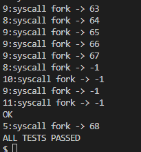

# trace

**perl语言是干什么的？为什么xv6会用perl？usys.pl是怎么起作用的?**
  1. Perl 语言介绍
      是一种通用的、解释型的编程语言，广泛用于文本处理、系统管理、网络编程、以及很多其他领域;
  2. Perl 在 xv6 中的使用
      在 xv6 操作系统中，Perl 主要用于编写构建工具和脚本，以自动化生成代码或配置文件。例如，`usys.pl` 脚本在构建过程中生成用户空间系统调用的汇编代码和头文件。这些脚本使得在构建过程中根据需要动态生成代码变得容易，而不是手动维护多个文件。
  3. `usys.pl` 的作用
      usys.pl 是 xv6 源代码中的一个 Perl 脚本，用于生成**系统调用的汇编代码和头文件**。这个脚本读取系统调用的定义，然后生成对应的汇编代码文件 usys.S 和头文件 usys.h，以便在构建过程中使用。
  4. usys.pl 如何起作用
      1. 读取系统调用定义：脚本从 syscall.h 或其他定义系统调用的文件中读取系统调用的名称和编号。
      2. 生成汇编代码：根据读取的系统调用信息，生成 `usys.S` 文件，其中包含调用系统调用的汇编指令。
      3. 生成头文件：生成 `usys.h` 文件，其中包含系统调用的函数原型
      usys.pl 脚本通过读取系统调用的名称，并为每个系统调用生成相应的汇编代码存根文件 usys.S。这些存根代码使得用户程序能够通过调用这些函数来发出系统调用请求。
   ```perl
    #!/usr/bin/perl -w  

    # Generate usys.S, the stubs for syscalls.

    print "# generated by usys.pl - do not edit\n"; # 提示文件是由 usys.pl 自动生成的

    print "#include \"kernel/syscall.h\"\n"; # 这行代码在生成的文件中包含 kernel/syscall.h，其中定义了所有的系统调用编号。
    
    # entry子程序用于生成每个系统调用的存根代码。它接收一个系统调用名称作为参数
    sub entry {
        my $name = shift;
        print ".global $name\n";
        print "${name}:\n";
        print " li a7, SYS_${name}\n";
        print " ecall\n";
        print " ret\n";
    }
    # 生成所有系统调用的存根代码
    entry("fork");
    entry("exit");
    entry("wait");
    entry("pipe");
    entry("read");
    entry("write");
    entry("close");
    entry("kill");
    entry("exec");
    entry("open");
    entry("mknod");
    entry("unlink");
    entry("fstat");
    entry("link");
    entry("mkdir");
    entry("chdir");
    entry("dup");
    entry("getpid");
    entry("sbrk");
    entry("sleep");
    entry("uptime");
    entry("trace");
   ```

所以，可以发现，通过`usys.pl`，隔离用户空间和内核空间；用户程序只能通过受控的系统调用接口与内核交互，而不能直接访问或修改内核代码或数据


**进程描述符**：结构体struct proc
   1. `trapframe`：
      struct trapframe 用于**保存陷入（trap）时处理器的寄存器状态**。这个结构体在 trampoline.S 中被用来保存当前进程的寄存器状态，以便在处理中断、异常或系统调用时能够正确恢复进程的状态

      用于保存陷入（trap）时处理器的寄存器状态，以便在处理中断、异常或系统调用时能够正确恢复进程的状态。

      保存处理器状态：当发生中断、异常或系统调用时，处理器的状态（所有的通用寄存器和一些特殊寄存器）会被保存到 trapframe 中。这确保了在处理完中断或异常后，处理器可以恢复到原来的状态并继续执行进程。

      恢复处理器状态：当从中断、异常或系统调用返回时，处理器的状态需要从 trapframe 中恢复。这确保了进程能够继续执行，而不会受到中断或异常处理的影响。

      用户程序向内核传递系统调用参数的方式是通过寄存器。前几个参数通过寄存器 a0 到 a7 传递。
      超过8个参数时，使用栈来传递。
      传递多个参数的具体方式：
      1. 系统调用的入口：
        当**用户程序调用系统调用时，它会触发一个陷入（trap）指令**，如 ecall，这将导致从用户态切换到内核态。
      2. 寄存器传递参数：
        系统调用的前 8 个参数通过寄存器 a0 到 a7 传递。
      3. 系统调用号：系统调用号通常也存储在寄存器中，通常是 a7 或 a0，这取决于具体的系统调用实现。
      4. 超过8个参数：如果系统调用需要超过8个参数，额外的参数将被压入栈中，内核在处理系统调用时会从栈中读取这些参数。

      `a0` 寄存器:
          1. 系统调用返回值：在系统调用的上下文中，a0 寄存器用于保存系统调用的返回值。在陷入处理之前，a0 寄存器可能会保存系统调用的第一个参数或中断、异常处理过程中的一些状态信息。
          2. 用户程序参数：在陷入（trap）之前，a0 寄存器可能保存用户程序传递给系统调用的参数值
       `a7`寄存器:
          3. 系统调用号：在系统调用的上下文中，a7 寄存器用于保存系统调用号。操作系统通过读取 a7 寄存器的值来确定用户程序请求的具体系统调用。
          4. 特定信息：在陷入（trap）之前，a7 寄存器通常保存用户程序请求的系统调用号，这样操作系统在处理系统调用时可以知道用户程序请求的是什么系统调用。
   2. `trampoline.S`
     是一个汇编文件，通常用于处理从用户模式到内核模式的转换（以及反过来的转换）。它的主要作用是设置陷入时的环境，并跳转到内核的陷入处理程序。在这些过程中，需要使用 trapframe 来保存和恢复处理器的状态。

     **trapframe 变量在 trampoline.S 中的作用**

     trapframe 变量通常被定义为一个指针，指向一个特定的内存区域，该区域用于存储陷入时的寄存器状态。

     在 trampoline.S 中，trapframe 变量的作用主要是：
        1. **保存处理器状态**：当发生中断、异常或系统调用时，处理器的状态（所有的通用寄存器和一些特殊寄存器）会被保存到 trapframe 中。这确保了在处理完中断或异常后，处理器可以恢复到原来的状态并继续执行进程。

        2. **恢复处理器状态**：当从中断、异常或系统调用返回时，处理器的状态需要从 trapframe 中恢复。这确保了进程能够继续执行，而不会受到中断或异常处理的影响。


## 解答：trace
在本作业中，您将添加一个系统调用跟踪功能，该功能可以帮助您调试以后的实验。您将创建一个新的跟踪系统调用来控制跟踪。它应该接受一个参数，一个整数“mask”，其位指定跟踪哪个系统调用。例如，为了跟踪fork系统调用，程序调用trace(1 << SYS_fork)，其中SYS_fork是来自kernel/ sycall .h的一个系统调用号。如果在掩码中设置了系统调用的编号，则必须修改xv6内核，以便在每个系统调用即将返回时打印一行。该行应该包含进程id、名称


1. 由上可知，为了使用户态可以调用内核态的`trace`，我们需要先把声明加到`user/usys.pl`和`user/user.h`,从而生成内核代码，为用户态调用。

2. 而`usys.pl`是根据`kernel/syscall.h`的声明生成内核函数，所以要在`kernel/syscall.h`中
加上`#define SYS_trace  22`,定义系统调用号；

1. 然后要定义函数在`kernel/syscall.c`,然而在`kernel/syscall.c`中使用了函数映射表，所以应在函数映射表中加上`[SYS_trace]   sys_trace,`和`extern uint64 sys_trace(void);`；
然后在`sysproc.c`中加上函数实现`uint64 sys_trace(void)`

1. 现在就是要实现这个函数了：
首先先确定这个`trace`系统调用要干什么?
   由提示可知:
   此函数是要跟踪系统调用功能，输入一个参数`mask`，这个`mask = 1 << SYS_fork`，其实就是用`mask`来表示系统调用。
   所以，我们就可以根据`mask`来判断，此时的系统调用是不是我们想要追踪的系统调用；

1. 另一个问题就是，我们怎么获取这个输入参数？这个参数是在用户态输入的，那么内核态怎么从用户态获得这个参数呢？
   这个问题答案，其实就保存在进程描述符中的`trapframe`，中的`a0`寄存器。那么我们就直接可以从此时的进程描述符中取出这个`mask`就行了；
   函数：`int argint(int n, int *ip)`就是取出`trapframe`中寄存器的值，可以调用此函数；
   ```cpp
    uint64
    sys_trace(void)
    {
        int mask;
        if(argint(0, &mask)<0)
            return -1;
        printf("sys_trace:%d\n",mask);
        return 0;
    }
   ```

2. 那么现在问题来了，获取得到`mask`后，我们怎么想要的输出呢？
   因为，trace 要跟踪进程，可以想到的是把此时的进程和`mask`相比较，如果相等，那么就跟踪此进程,怎么进行比较呢？
      我们知道mask是用来表示进程的，mask的二进制中每一位代表一个进程：比如mask=32=b10 0000=1<<5;而5对于的就是系统调用fork
      所以我们就可以把此时进程的num，`1 << num与mask`比较，如果mask位为1，则要跟踪：
   ```cpp
   if((1<<num) & p->mask)
   {
       printf("%d:syscall %s -> %d\n",
           p->pid, syscall_name[num-1], p->trapframe->a0);
   }
   ```

3. 现在又有一个问题，我们怎么获得此时进程的`num`呢？
   因为调用系统函数，我们都要使用`syscall(void)`函数，所以我们可以把这个判断放到这个函数里；

4. 那么此时又有一个问题，就是`syscall(void)`怎么获取这个`mask`呢？
   我们知道，每个进程都有一个进程描述符，所以我们可以通过进程描述符来传递`mask`，
   所以我们要在结构体：`struct proc {`中加入`int mask;`,这样我们就可以通过进程描述符来访问mask了；
   所以我们需要在`sys_trace(void)`把mask放到进程描述符中；
   ```cpp
   uint64
   sys_trace(void)
   {
       int mask;
       if(argint(0, &mask)<0)
           return -1;
       // printf("sys_trace:%d\n",mask);
       myproc()->mask=mask;
       return 0;
   }
   ```
   然后可以在`syscall(void)`中访问；

5. 我们知道，子进程会复制夫进程的进程描述符，所以我们还需要把父进程的mask复制到子进程中；
    在`fork(void)`中添加：`np->mask=p->mask;`

此时，这个trace系统调用就完成了！




## sysinfo
在本作业中，您将添加一个系统调用sysinfo，它收集有关正在运行的系统的信息。这个系统调用有一个参数：一个指向结构体sysinfo的指针（参见kernel/sysinfo.h）。内核应该填充这个结构体的字段：freemem字段应该设置为**空闲内存的字节数，nproc字段应该设置为状态不是UNUSED的进程数**。我们提供了一个测试程序sysinfotest；如果它输出“sysinfotest: OK”，那么你就通过了这个赋值。


1. 上面已经分析了，怎么加入各种声明到各个文件下及原因，就不详细写了
   1. 在`user/user.h`加入：`int sysinfo(struct sysinfo *);`
   2. 在`user/user.pl`加入：`entry("sysinfo")`
   3. 在`kernel/syscall.h`加：`#define SYS_sysinfo 23`
   4. 在`kernel/syscall.c`加：`extern uint64 sys_sysinfo(void);`和`[SYS_sysinfo] sys_sysinfo,`
   5. 在`kernel/syspro.c`加上函数定义
2. 现在就是要实现这个函数
   我们要明白这个函数要干嘛？
       大概就是，用户态调用`sysinfo`然后传入一个`sysinfo`结构指针，然后内核态把数据放到这个结构体中。例如：
       ```cpp
        struct sysinfo info;
        
        if (sysinfo(&info) < 0) {
            printf("FAIL: sysinfo failed\n");
            exit(1);}
       ```
   既然用户态传递一个地址，那我们内核态就要接受这个地址参数，和`trace`相似，我们调用`argaddr`函数从`a0`寄存器获取这个参数。
   
   然后我们就把数据填充到这个结构体中即可
   ```cpp
   uint64
    sys_sysinfo(void)
    {
        struct sysinfo sinfo;
        struct proc *p = myproc();
        //获取地址
        uint64 addr;
        if(argaddr(0,&addr)<0)
            return -1;
        //下面就是对这个结构体进行填充
        // uint64 freemem;   // amount of free memory (bytes)
        // uint64 nproc;     // number of process
        sinfo.freemem=sys_freemem();
        sinfo.nproc=sys_nproc();
        //返回给用户

        // printf("sys_sysinfo:add: info=%d\n",addr);
        return 0;
    }
   ```
3. 怎么获取到，空闲空间？

   首先分析`kalloc(void)`这个函数，因为这个函数是用来分配空闲内存的，与我们想要的相关：
   这个函数用到两个结构体：
   `struct run`：一个简单的链表节点结构体，用于表示空闲内存页。
        next：指向下一个空闲内存页。
    `kmem`：一个包含自旋锁和空闲内存页链表的结构体。
        kmem.lock：保护 freelist 链表的自旋锁。
        kmem.freelist：指向链表的第一个空闲页。
   ```cpp
    struct run {
    struct run *next;
    };

    struct {
    struct spinlock lock;
    struct run *freelist;
    } kmem;
   ```

   ```cpp
    // Allocate one 4096-byte page of physical memory.
    // Returns a pointer that the kernel can use.
    // Returns 0 if the memory cannot be allocated.
    void *
    kalloc(void)
    {
    struct run *r;

    acquire(&kmem.lock);  // 获取锁，确保对空闲内存链表的访问是原子操作。
    r = kmem.freelist;  // 获取链表中的第一个空闲页。
    if(r)  // 如果存在空闲页，
        kmem.freelist = r->next;  // 更新链表头，将第一个节点移除。
    release(&kmem.lock);  // 释放锁。

    if(r)  // 如果成功分配到了一个页，
        memset((char*)r, 5, PGSIZE); // fill with junk
    return (void*)r;
    }
   ```
   ok，现在我们知道了怎么获取空闲页了，`kmem.freelist`这个链表就存放着空闲页，那我们直接遍历这个空闲页，我们就可以知道有多少个空闲页了。
   一个空闲页有多少byte呢？
       `PGSIZE`这个宏定义了已经，其实上面那个函数注释里面已经说了。
    那么现在我们就知道该怎么写了：
   ```cpp
    uint64
    sys_freemem()
    {
        struct run *r;
        acquire(&kmem.lock);
        r = kmem.freelist;
        uint64 freemem=0;
        while(r)
        {
            freemem+=PGSIZE;
            r=r->next;
        }
        release(&kmem.lock);
        return freemem;
    }
   ```
   写完函数后记得在`defs.h`中声明函数！
4. 怎么获得进程数呢？
   其实从写上面获取空闲空间函数就可以发现，这个提示给的很好。我们写的函数就与上面一个函数相关，直接参考上面哪一个函数，就可以写出来了，这里也不意外。

   所以先分析`procdump(void)`这个函数,这个函数就是打印所有的进程，这样的话，肯定要遍历所有的进程，如果我们知道了怎么遍历所有的进程，那我们肯定能求出进程数了。
   ```cpp
    // Print a process listing to console.  For debugging.
    // Runs when user types ^P on console.
    // No lock to avoid wedging a stuck machine further.
    void
    procdump(void)
    {
    static char *states[] = {
    [UNUSED]    "unused",
    [SLEEPING]  "sleep ",
    [RUNNABLE]  "runble",
    [RUNNING]   "run   ",
    [ZOMBIE]    "zombie"
    };
    struct proc *p;
    char *state;

    printf("\n");
    for(p = proc; p < &proc[NPROC]; p++){ //这里就是遍历所有的进程
        if(p->state == UNUSED) //如果当前进程的状态为 UNUSED，跳过该进程。
        continue;
        if(p->state >= 0 && p->state < NELEM(states) && states[p->state])
        state = states[p->state];
        else
        state = "???";
        printf("%d %s %s", p->pid, state, p->name);
        printf("\n");
    }
    }
   ```
   照猫画虎，很好写出来
   ```cpp
    uint64
    sys_nproc(void)
    {
    static char *states[] = {
    [UNUSED]    "unused",
    [SLEEPING]  "sleep ",
    [RUNNABLE]  "runble",
    [RUNNING]   "run   ",
    [ZOMBIE]    "zombie"
    };
    struct proc *p;
    uint64 nproc=0;
    for(p = proc; p < &proc[NPROC]; p++){
        if(p->state == UNUSED)
        continue;
        if(p->state >= 0 && p->state < NELEM(states) && states[p->state])
        nproc++;
    }
    return nproc;
    }
   ```
6. 填充完结构体后，问题来了，我们怎么把这个内容，返回到用户态？
   这里就用到了`copyout`这个函数；根据提示，到`file.c`文件看下：
   ```cpp
   int
    filestat(struct file *f, uint64 addr)
    {
    struct proc *p = myproc();
    struct stat st;
    
    if(f->type == FD_INODE || f->type == FD_DEVICE){
        ilock(f->ip);
        stati(f->ip, &st);
        iunlock(f->ip);
        if(copyout(p->pagetable, addr, (char *)&st, sizeof(st)) < 0)
        return -1;
        return 0;
    }
    return -1;
    }
   ```
    从上，就可以得出来：
       p->pagetable：这是当前进程的页表，用于地址转换
       addr：这是用户空间的目标地址，数据需要复制到这个地址
       (char*)&st：这是内核空间中 st 结构体的地址，数据将从这个地址开始复制。
       sizeof(st)：这是要复制的数据的大小，以字节为单位。即 st 结构体的大小。
7. 最后，`sys_sysinfo(void)`如下：
```cpp
uint64
sys_sysinfo(void)
{
    struct sysinfo sinfo;
    struct proc *p = myproc();
    //获取地址
    uint64 addr;
    if(argaddr(0,&addr)<0)
        return -1;
    //下面就是对这个结构体进行填充
    // uint64 freemem;   // amount of free memory (bytes)
    // uint64 nproc;     // number of process
    sinfo.freemem=sys_freemem();
    sinfo.nproc=sys_nproc();
    //返回给用户
    if(copyout(p->pagetable, addr, (char *)&sinfo, sizeof(sinfo)) < 0)
      return -1;
    // printf("sys_sysinfo:add: info=%d\n",addr);
    return 0;
}
```
# 结束
这个实验，让我大致了解到，用户态调用系统调用的过程；也有个大致的印象对于用户态怎么与内核态实现隔离，虽然不知道具体怎么实现的。

也对进程的存储方式，进程描述符有了深入的理解；对`trapframe`也有个大致的理解；

## 内存分配
   在 xv6 操作系统中，每次内存分配并不是直接操作页表，而是通过管理一个空闲内存页链表来实现的。内存分配的单位通常是一个物理页（page），大小为 4KB
   **内存分配过程**
    
    1.  物理内存管理：在 xv6 中，物理内存是通过一个空闲内存页链表来管理的。每个空闲内存页（struct run）都链接在这个链表中。当需要分配内存时，系统会从这个链表中取出一个空闲页。
    
    2.  页表：页表用于将虚拟地址映射到物理地址。每个进程都有自己的页表，用于管理其虚拟地址空间。当需要为进程分配新的内存区域时，系统不仅需要在物理内存中找到一个空闲页，还需要更新该进程的页表，以确保正确的地址映射。
   
   前面讨论过的 kalloc 函数，是一个分配物理内存页的函数。它从空闲内存页链表中取出一个页，并返回它的地址：
   ```cpp
    void *
    kalloc(void)
    {
    struct run *r;

    acquire(&kmem.lock);
    r = kmem.freelist;
    if(r)
        kmem.freelist = r->next;
    release(&kmem.lock);

    if(r)
        memset((char*)r, 5, PGSIZE); // fill with junk
    return (void*)r;
    }
   ```
   虚拟内存分配
      虚拟内存的分配则更复杂，它需要更新进程的页表。以下是一个简化的例子，演示如何为进程分配虚拟内存并更新页表：

   虚拟内存分配函数
      假设我们有一个函数 allocuvm，用于为进程分配虚拟内存，并映射到物理内存页：
    

   **函数目的**
    allocuvm 函数的目的是根据给定的新的内存大小 (newsz)，为指定的页表 (pagetable) 分配足够的虚拟内存空间，并将这些空间映射到物理内存页上。
   **参数解释**
   `pagetable_t pagetable`：页表类型的参数，用于指定将要分配内存的进程的页表。
   `uint64 oldsz`：当前进程的旧内存大小，即已经分配了多少内存。
   `uint64 newsz`：新的内存大小，即需要分配的总内存大小。
   ```cpp
        int
        allocuvm(pagetable_t pagetable, uint64 oldsz, uint64 newsz)
        {
        char *mem;
        uint64 a;

        if(newsz >= PLIC) //如果新的内存大小超过了 PLIC 的值（可能是某种内存限制），则返回 0，表示分配失败
            return 0;

        if(newsz < oldsz) //如果新的内存大小小于当前内存大小 oldsz，则直接返回 oldsz，表示不需要额外的内存分配
            return oldsz;

        a = PGROUNDUP(oldsz); //将 oldsz 向上对齐到页面边界，确保从一个新的页面开始分配。
        for(; a < newsz; a += PGSIZE){//循环分配：从 a 开始，每次增加一个页面大小 (PGSIZE)，循环直到达到 newsz。
            mem = kalloc();   //使用 kalloc() 分配一个物理内存页 (mem)。
            if(mem == 0){    //如果分配失败 (mem == 0)，则调用 freeuvm() 释放之前分配的内存页并返回 0
            freeuvm(pagetable, a, oldsz);
            return 0;
            }
            memset(mem, 0, PGSIZE); //使用 memset() 将分配的内存页清零
            // 调用 mappages() 将分配的物理页映射到虚拟地址空间中，并设置合适的页表项权限 (PTE_W|PTE_X|PTE_R|PTE_U)
            if(mappages(pagetable, a, PGSIZE, (uint64)mem, PTE_W|PTE_X|PTE_R|PTE_U) != 0){ 
            freeuvm(pagetable, a, oldsz); //如果映射失败，则释放已分配的内存页并返回 0
            kfree(mem);
            return 0;
            }
        }
        return newsz;
        }
   ```

## 页面
页面在计算机系统中是虚拟内存管理的基本单位，负责管理内存的分配、映射和访问控制。通过页面，操作系统能够有效地管理进程的内存使用，提高内存利用率和系统性能

页面（Page）的基本含义
页面大小（Page Size）：

页面大小指的是操作系统管理内存的最小单位。常见的页面大小包括 4KB、8KB、16KB 等，具体的大小取决于硬件和操作系统的设计。
在现代计算机系统中，页面大小通常是硬件和操作系统的一个固定参数，例如，在 RISC-V 架构中，页面大小通常为 4KB。
虚拟内存中的页面：

虚拟内存系统将进程的地址空间划分为多个连续的虚拟页面（Virtual Pages），每个虚拟页面与一个物理页面相对应。
进程访问的内存地址是虚拟地址，虚拟地址通过页表映射到物理地址。页表的每一项（页表项）通常指示了一个虚拟页面到物理页面的映射关系。
物理内存中的页面：

物理内存实际存储数据和程序的页面，每个物理页面对应实际的物理内存区域。
操作系统使用页表来管理虚拟页面到物理页面的映射关系，以及处理页面的分配、释放和访问控制。


**start**分析
  1. mstatus 寄存器：
    用于保存处理器当前的状态和控制信息；
    MPP：位 [12:11]：指示处理器在上一个特权模式下的模式：00 = 用户模式(U-mode)。01 = 保留。10 = 超级模式 (S-mode)。11 = 机器模式 (M-mode)。
    SSP:位 8。表示在进入超级用户模式之前的特权模式。0 = 用户模式 (U-mode)。1 = 超级用户模式 (S-mode)。
    MPIE:位 7;表示在进入机器模式之前，是否启用了全局中断。当设置为 1 时，表示在进入机器模式之前，中断是启用的。
  2. mret
    是 RISC-V 指令集中的一条特权指令，全称是 "Machine-mode Return"（机器模式返回）。它用于从机器模式（M-mode）返回到之前保存的特权模式（例如超级用户模式 S-mode 或用户模式 U-mode），通常在处理中断或异常处理程序时使用。
    比如：恢复之前的特权模式；从 mstatus 寄存器中读取 MPP 字段的值，并将当前特权模式设置为该值。
  3. mepc：
    mepc 是机器模式异常程序计数器寄存器，保存了异常或中断发生时要返回的程序地址。
  4. satp
    satp 寄存器是超级用户地址翻译和保护寄存器，它控制地址转换和分页机制。
   这个 start 函数的主要任务是配置处理器状态，以便从 M-mode 切换到 S-mode。它通过以下步骤实现这一目标：
    设置 MPP 字段，以便 mret 指令将处理器切换到 S-mode。
    设置 mepc 寄存器，以便 mret 指令跳转到 main 函数。
    禁用分页机制。
    将所有异常和中断委派到 S-mode。
    启用 S-mode 的外部中断、定时器中断和软件中断。
    初始化定时器中断。
    将当前处理器核心的 hart ID 存储到 tp 寄存器。
    执行 mret 指令，切换到 S-mode 并跳转到 main 函数。

```cpp
void
start()
{
  // set M Previous Privilege mode to Supervisor, for mret.
  unsigned long x = r_mstatus(); //从mstatus寄存器读取信息:x=0
  x &= ~MSTATUS_MPP_MASK; // 与操作，清除MPP
  x |= MSTATUS_MPP_S; //设置为内核态 x=0b 1000 0000 0000
  w_mstatus(x); //将x写入到寄存器

    //上面代码将 mstatus 寄存器的 MPP 字段设置为超级用户模式（S-mode）。MPP 字段表示机器模式下的上一个特权级别，这样设置是为了确保在执行 mret 指令返回时，处理器切换到超级用户模式（S-mode），而不是机器模式

  // set M Exception Program Counter to main, for mret.
  // requires gcc -mcmodel=medany
  w_mepc((uint64)main); //设置机器模式异常程序计数器（MEPC）为 main 函数的地址，准备返回到 main 函数执行。

  // disable paging for now.
  w_satp(0); //禁用分页机制。通过将 satp 寄存器设置为 0，处理器将关闭地址转换，从而使用物理地址进行访问。

  // delegate all interrupts and exceptions to supervisor mode.
  w_medeleg(0xffff);
  w_mideleg(0xffff);
  w_sie(r_sie() | SIE_SEIE | SIE_STIE | SIE_SSIE);
//这三行代码配置了 RISC-V 的异常和中断处理机制：


  // ask for clock interrupts.
  timerinit(); //初始化定时器中断

  // keep each CPU's hartid in its tp register, for cpuid().
  int id = r_mhartid();
  w_tp(id); //获取当前处理器核心的 hart ID，并将其存储到线程指针（tp）寄存器中

  // switch to supervisor mode and jump to main().
  asm volatile("mret");
}
```


