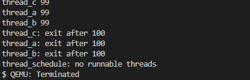
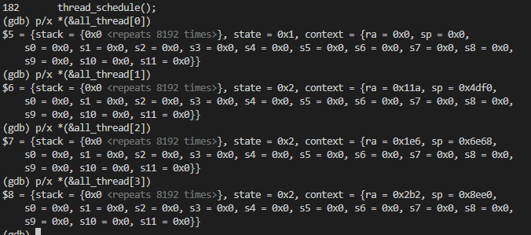

# Uthread: switching between threads (moderate)

在这个练习中，你将设计一个**用户级线程系统的上下文切换机制**，并实现它。为帮助你入门，你的 xv6 系统中有两个文件：user/uthread.c 和 user/uthread_switch.S，以及 Makefile 中一个构建 uthread 程序的规则。uthread.c 包含了大部分用户级线程包的代码，以及三个简单测试线程的代码。线程包缺少一些创建线程和在线程之间切换的代码。

>你的任务是制定一个计划来**创建线程以及保存/恢复寄存器以在线程之间进行切换**，并实现这个计划。当你完成后，使用 make grade 应该会显示你的解决方案通过了 uthread 测试。

这些输出来自三个测试线程，每个线程都有一个循环，打印一行文本，然后将 CPU 让给其他线程。

然而，此时没有上下文切换代码，你将不会看到任何输出。

你需要在 user/uthread.c 文件中的 thread_create() 和 thread_schedule() 函数中添加代码，以及在 user/uthread_switch.S 文件中的 thread_switch 函数中添加代码。
一个目标是确保当 thread_schedule() 第一次运行给定线程时，该线程能够在自己的栈上执行传递给 thread_create() 的函数。
另一个目标是确保 thread_switch 保存被切换线程的寄存器，恢复切换到的线程的寄存器，并返回到后者线程的指令中上次执行的位置。
你需要决定在哪里保存/恢复寄存器；修改 struct thread 来保存寄存器是一个好的计划。你需要在 thread_schedule 中添加一个对 thread_switch 的调用；你可以传递你需要的任何参数给 thread_switch，但其意图是从线程 t 切换到 next_thread。


## 解
`switch`只需要保存部分寄存器的值即可，因为其余的在函数调用的时候被保存到堆栈里了，这里直接参考内核的`switch`函数;

### `uthread.c`

这里先分析一下这个程序的流程：
  1. 在`main()`中,,首先调用`thread_init();`,可以发现这是把`main`放到线程池（数组）  中；
  2. 然后调用三次` thread_create();`，创造三个线程，返回放到线程池（数组）中；
  3. 然后调用`thread_schedule()`调度器，调用线程

可以看到这个流程很简单，就是先创建三个线程放到数组中，然后开启调度器调用线程；

1. 首先看`thread_schedule()`函数，先扫描线程池，如果有准备好的线程，则运行该线程，我们需要`switch`跳转到下一个线程中，在内核中是使用线程的context实现跳转的，这里模仿内核的方法写。
  1. 首先需要创建`context`,我们知道在跳转到下一个线程时，需要先保存当前进程的寄存器，然后加载下一个线程的寄存器。所以线程结构需要结构体`context`，当跳转到下一个进程时，把当前进程的寄存器保存到当前线程的`context`中。而不需要保存所有的寄存器内容，因为一部分寄存器的内容已经保存到进程的堆栈中了，这里参考内核的做法：
  **uthread.c**
  ```cpp
    struct context {
    uint64 ra;
    uint64 sp;

    // callee-saved
    uint64 s0;
    uint64 s1;
    uint64 s2;
    uint64 s3;
    uint64 s4;
    uint64 s5;
    uint64 s6;
    uint64 s7;
    uint64 s8;
    uint64 s9;
    uint64 s10;
    uint64 s11;
    };

    struct thread {
    char       stack[STACK_SIZE]; /* the thread's stack */
    int        state;             /* FREE, RUNNING, RUNNABLE */
    struct context context; 
    };
  ```
  **`uthread_switch.s`**
    ```cpp
    thread_switch:
        /* YOUR CODE HERE */
        sd ra, 0(a0)
        sd sp, 8(a0)
        sd s0, 16(a0)
        sd s1, 24(a0)
        sd s2, 32(a0)
        sd s3, 40(a0)
        sd s4, 48(a0)
        sd s5, 56(a0)
        sd s6, 64(a0)
        sd s7, 72(a0)
        sd s8, 80(a0)
        sd s9, 88(a0)
        sd s10, 96(a0)
        sd s11, 104(a0)

        ld ra, 0(a1)
        ld sp, 8(a1)
        ld s0, 16(a1)
        ld s1, 24(a1)
        ld s2, 32(a1)
        ld s3, 40(a1)
        ld s4, 48(a1)
        ld s5, 56(a1)
        ld s6, 64(a1)
        ld s7, 72(a1)
        ld s8, 80(a1)
        ld s9, 88(a1)
        ld s10, 96(a1)
        ld s11, 104(a1)
        
        ret    /* return to ra */
    ```
  2. 修改`thread_schedule()`函数
   已经知道，使用`thread_switch()`函数跳转到下一个进程，所以直接调用即可：
   ```cpp
    void 
    thread_schedule(void)
    {

    ......

    if (current_thread != next_thread) {         /* switch threads?  */
        next_thread->state = RUNNING;
        t = current_thread;
        current_thread = next_thread;
        /* YOUR CODE HERE
        * Invoke thread_switch to switch from t to next_thread:
        * thread_switch(??, ??);
        */
        thread_switch((uint64)&t->context,(uint64)&current_thread->context);
    } else
        next_thread = 0;
    }
   ```
2. `thread_create()`函数
  我们知道，流程时先创建线程，然后把线程放到线程数组中，然后由调度器调用，所以创建线程的时候，需要把线程的信息保存，以便可以调用该线程；
  可以发现，创建线程的时候，是扫描线程池，当发现有空的位置时，把该线程放入其中；
  而保存的信息是用来，调用线程时可以运行该函数，所以需要保存函数指针和栈顶；
  所以初始化如下：
  ```cpp
    void 
    thread_create(void (*func)())
    {
    struct thread *t;

    for (t = all_thread; t < all_thread + MAX_THREAD; t++) {
        if (t->state == FREE) break;
    }
    t->state = RUNNABLE;
    t->context.ra = (uint64)(*func);  //函数指针
    t->context.sp = (uint64)t->stack+STACK_SIZE;  //栈顶
    // YOUR CODE HERE
    }
  ```

## 结果



**跟踪一下这个运行过程：**
运行到`thread_schedule();`之前，线程池的保存内容：


可以看到，`context`内保持的`ra`和`sp`内容；

然后便开始调用`thread_schedule()`,在线程池中找到准备好的线程运行；
首先找到线程a，然后运行线程a的程序，
直到:`while(b_started == 0 || c_started == 0)`,然后停止运行；
找下一个线程，然后找到b，同理再运行到c；
这时候这三个线程都已经启动了，
然后c在`while(b_started == 0 || c_started == 0)`待用调度器，进入下一个线程a；
然后返回到a`while(b_started == 0 || c_started == 0)`位置，然后运行`for`;
然后就是交替执行；

其实最有趣的还是`switch`返回的位置。

# Using threads (moderate)
在这个作业中，你将通过使用哈希表来探索线程和锁的并行编程。你应该在一台具有多个核心的真实 Linux 或 MacOS 计算机上完成此作业（不是 xv6，不是 qemu）。大多数现代笔记本电脑都配备了多核心处理器。

这个作业使用了 UNIX 的 pthread 线程库。你可以通过手册页（使用 man pthreads）查找相关信息，也可以在网上查阅，例如在这里、这里和这里。

文件 notxv6/ph.c 包含一个简单的哈希表，如果只在单个线程中使用它是正确的，但在多个线程中使用时则是不正确的。在你的主 xv6 目录（可能是 ~/xv6-labs-2021）中，输入以下命令：

$ make ph
$ ./ph 1

请注意，为了构建 ph，Makefile 使用的是你的操作系统的 gcc，而不是 6.S081 的工具。ph 的参数指定执行 put 和 get 操作的线程数。在运行一段时间后，ph 1 会产生类似于以下的输出

    100000 puts, 3.991 seconds, 25056 puts/second
    0: 0 keys missing
    100000 gets, 3.981 seconds, 25118 gets/second


你看到的数字可能会与这个示例输出有所不同，可能差异在两倍或更多，具体取决于你的计算机的速度、是否有多个核心，以及它是否在忙于其他任务。

ph 运行两个基准测试。首先，它通过调用 put() 向哈希表中添加大量键，并打印每秒的 put 速率。然后，它通过 get() 从哈希表中获取键。它会打印出在 put 操作后应该在哈希表中存在但实际缺失的键的数量（在此情况下为零），并打印它每秒完成的 get 操作的数量。

你可以通过给 ph 传递一个大于一的参数来告诉它同时使用多个线程的哈希表。试试 ph 2：

    $ ./ph 2
    100000 puts, 1.885 seconds, 53044 puts/second
    1: 16579 keys missing
    0: 16579 keys missing
    200000 gets, 4.322 seconds, 46274 gets/second


ph 2 输出的第一行表明，当两个线程同时向哈希表中添加条目时，它们总共达到了每秒 53,044 次插入。这大约是运行 ph 1 时单线程的两倍。这是一个非常好的“并行加速”效果，接近理想中的两倍速度（即，核心数量翻倍导致单位时间内工作量翻倍）。

然而，接下来的两行显示 16,579 个缺失的键，表明有大量应该在哈希表中的键实际上并不存在。这意味着，put 操作本应将这些键添加到哈希表中，但发生了一些问题。请查看 notxv6/ph.c，特别是 put() 和 insert() 函数。

>为什么有2个线程，而不是1个线程丢失的键?用两个线程确定可能导致丢失密钥的事件序列。在answers-thread.txt中提交您的序列并附上简短的解释


>为了避免这种事件序列，请在notxv6/ph.c的put和get中插入lock和unlock语句，以便在两个线程中丢失的键数始终为0。相关的pthread调用是:
    pthread_mutex_t lock;            // declare a lock
    pthread_mutex_init(&lock, NULL); // initialize the lock
    pthread_mutex_lock(&lock);       // acquire lock
    pthread_mutex_unlock(&lock);     // release lock
当make grade表示您的代码通过ph_safe测试时，您就完成了，该测试要求两个线程中的零丢失键。此时，ph_fast测试失败也没关系。

不要忘记调用pthread_mutex_init()。先用一个线程测试你的代码，然后用两个线程测试。它是否正确(即你是否消除了丢失的键?)?相对于单线程版本，双线程版本是否实现了并行加速(即每单位时间内完成的总工作量更多)?

在某些情况下，并发put()操作在哈希表中读取或写入的内存没有重叠，因此不需要锁来相互保护。您可以更改ph.c以利用这种情况来获得一些put()s的并行加速吗?提示:每个哈希桶加一个锁怎么样?

>修改代码，使一些put操作在保持正确性的同时并行运行。当make grade表示代码通过了ph_safe和ph_fast测试时，就完成了。ph_fast测试要求两个线程每秒的put次数至少是一个线程的1.25倍。

**解**

这一题，主要是先搞清楚发生miss的原因在哪里？回答了这个问题就知道怎么写了
 
首先先看`ph.c`这个代码的执行逻辑；
就是现在哈希表中加入值，然后再取出，看有没有缺失的。

我们知道竞争是发生在对一块数据写操作的时候，所以我们只需要关系`put`逻辑就行了。数据缺失的原因如下：
  两个线程 A 和 B 都试图在同一位置插入相同的键，但由于缺乏适当的同步机制，它们的操作可能会相互干扰。线程 A 和 B 的插入操作没有正确地进行互斥，导致其中一个线程的插入操作被覆盖或丢失。
  **正确的顺序应该是：**
  1. 线程 A 执行 put(key) 并开始计算该键的哈希值
  2. 线程 B 同时执行 put(key) 并开始计算相同键的哈希值。
  3. 线程 A 计算出哈希值，并试图在哈希表中找到正确的位置。
  4. 线程 B 也计算出相同的哈希值，并试图在哈希表中找到正确的位置。
  5. 线程 A 在哈希表中找到位置并准备插入键。此时，哈希表的插入锁尚未被线程 B 占用。
  6. 线程 B 也找到位置并准备插入键。此时，哈希表的插入锁尚未被线程 A 占用。
  7. 线程 A 获取锁，线程 A 完成插入操作并释放锁
  8. 线程 B 获取锁，线程 B 完成插入操作并释放锁。

所以我们在对一块数据写的时候，加上锁即可：
可以在写入数据的时候只加上一个锁。为了加速，由于有5个键值，每个键值对应一个链表,所以可以对每个链表都加上锁，这样可以增加效率。
  加速的原因也很简单：只有一把锁的时候，每次最多只能有一个进程使用哈希表，因为持有锁，别的进程操作不了。而哈希表每个键值都有一把锁，所以每次最多可以有5个进程操作哈希表（操作5个键值对应的链表），所以加快了速度。
```cpp
pthread_mutex_t lock[NBUCKET]; //注意

static 
void put(int key, int value)
{
  int i = key % NBUCKET;

  // is the key already present?
  struct entry *e = 0;
  for (e = table[i]; e != 0; e = e->next) {
    if (e->key == key)
      break;
  }
pthread_mutex_lock(&lock[i]); //注意
  if(e){
    // update the existing key.
    e->value = value;
  } else {
    // the new is new.
    insert(key, value, &table[i], table[i]);
  }
pthread_mutex_unlock(&lock[i]);//注意
}
int main()
{
    for(int i=0;i<BUFSIZ;i++) //注意
        pthread_mutex_init(&lock[i], NULL);
    ......
}
```

# Barrier(moderate)

在这个作业中，你将实现一个屏障：这是一个应用程序中的点，所有参与的线程必须等待，直到所有其他参与的线程也到达这个点。你将使用 **pthread 条件变量**，这是一种类似于 xv6 的 sleep 和 wakeup 的序列协调技术。

你应该在一台真实的计算机上完成这个作业（不是 xv6，不是 qemu）。

文件 notxv6/barrier.c 包含一个有问题的屏障实现。

$ make barrier
$ ./barrier 2
barrier: notxv6/barrier.c:42: thread: Assertion `i == t' failed.

2 表示在屏障上进行同步的线程数量（barrier.c 中的 nthread）。每个线程执行一个循环。在每次循环迭代中，线程调用 barrier()，然后睡眠一段随机的微秒时间。断言触发是因为一个线程在另一个线程到达屏障之前就离开了屏障。期望的行为是，每个线程在 barrier() 中阻塞，直到所有的 nthreads 线程都调用了 barrier()。

>你的目标是实现期望的屏障行为。除了在 ph 任务中看到的锁原语之外，你还需要以下新的 pthread 原语；详细信息可以查看这里和这里。

pthread_cond_wait(&cond, &mutex);  // go to sleep on cond, releasing lock mutex, acquiring upon wake up
pthread_cond_broadcast(&cond);     // wake up every thread sleeping on cond

pthread_cond_wait 在调用时会释放互斥锁，并在返回之前重新获取该互斥锁。我们已经为你提供了 barrier_init()。你的任务是实现 barrier()，以避免出现 panic。我们已经为你定义了 struct barrier；它的字段供你使用

你的任务有两个问题需要处理：
  1. 处理屏障的多个调用： 每次调用屏障，我们称之为一轮（round）。bstate.round 记录当前的轮次。你应该在所有线程到达屏障时每次递增 bstate.round。

  2. 处理线程竞速问题： 需要处理一种情况，即一个线程在其他线程尚未离开屏障时绕圈子。在具体操作中，你需要从一个轮次到下一个轮次重新使用 bstate.nthread 变量。确保一个离开屏障并绕圈的线程不会在前一轮仍在使用 bstate.nthread 时增加其值。


**解**
其实这个比较简单，只是我踩了一个坑，就是在最后一个线程到来的时候，我不是进行归0，而是减一操作，如下：
```cpp
static void 
barrier()
{
  // YOUR CODE HERE
  //
  // Block until all threads have called barrier() and
  // then increment bstate.round.
  //
pthread_mutex_lock(&bstate.barrier_mutex);//线程来的时候，加1
bstate.nthread++;
printf("++ %d \n",bstate.nthread);

if(bstate.nthread!=nthread){ 
    pthread_cond_wait(&bstate.barrier_cond,&bstate.barrier_mutex);
}
else{
    pthread_cond_broadcast(&bstate.barrier_cond);
    bstate.round++;
}
bstate.nthread--;
pthread_mutex_unlock(&bstate.barrier_mutex);

}
```
这样就会产生一个问题，就是就是竞速问题，先走出`barrier`的线程进入下一个循环，使得`bstate.nthread++;`;
就会产生一种情况，当前循环刚刚走出一个线程，而这个线程已经又开始调用`bstate()`然后执行`nthread++`，从而又开始唤醒睡眠的进程，从而使得`bstate.round++;`产生错误。

**正解**
```cpp
static void 
barrier()
{
  // YOUR CODE HERE
  //
  // Block until all threads have called barrier() and
  // then increment bstate.round.
  //
pthread_mutex_lock(&bstate.barrier_mutex);//线程来的时候，加1
bstate.nthread++;
printf("++ %d \n",bstate.nthread);

if(bstate.nthread!=nthread){ 
    pthread_cond_wait(&bstate.barrier_cond,&bstate.barrier_mutex);
}
else{
    pthread_cond_broadcast(&bstate.barrier_cond);
    bstate.round++;
    bstate.nthread=0；
}
pthread_mutex_unlock(&bstate.barrier_mutex);
}
```
# 关于 pthread 标准库
1. 线程的创建和终止
创建线程：pthread_create() 函数用于创建一个新线程。

`int pthread_create(pthread_t *thread, const pthread_attr_t *attr, void *(*start_routine) (void *), void *arg);`
thread：指向线程标识符的指针。
attr：线程属性，通常传NULL使用默认属性。
start_routine：线程启动函数。
arg：传递给线程启动函数的参数。

终止线程：pthread_exit() 函数用于终止调用的线程，并可以返回一个值给其他线程。
`void pthread_exit(void *retval);`

2.  线程同步
互斥锁：用于保护临界区，以防多个线程同时访问共享资源。
```cpp
#include <pthread.h>

int pthread_mutex_init(pthread_mutex_t *mutex, const pthread_mutexattr_t *attr);
int pthread_mutex_lock(pthread_mutex_t *mutex);
int pthread_mutex_unlock(pthread_mutex_t *mutex);
int pthread_mutex_destroy(pthread_mutex_t *mutex);
```
条件变量：用于在特定条件下阻塞和唤醒线程。
```cpp
#include <pthread.h>

int pthread_cond_init(pthread_cond_t *cond, const pthread_condattr_t *attr);
int pthread_cond_wait(pthread_cond_t *cond, pthread_mutex_t *mutex);
int pthread_cond_signal(pthread_cond_t *cond);
int pthread_cond_broadcast(pthread_cond_t *cond);
int pthread_cond_destroy(pthread_cond_t *cond);

```
3. 线程属性
设置线程属性：pthread_attr_init() 和 pthread_attr_set*() 函数用于设置线程属性。

```cpp
#include <pthread.h>

int pthread_attr_init(pthread_attr_t *attr);
int pthread_attr_setdetachstate(pthread_attr_t *attr, int detachstate);
int pthread_attr_destroy(pthread_attr_t *attr);

```
