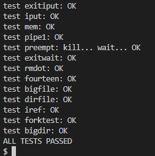

# Memory allocator (moderate)

程序 user/kalloctest 压力测试 xv6 的内存分配器：三个进程扩展和收缩它们的地址空间，导致对 kalloc 和 kfree 的多次调用。kalloc 和 kfree 会获取 kmem.lock 锁。kalloctest 会打印（作为“#fetch-and-add”）在尝试获取已经被其他核心持有的锁时，acquire 函数中的循环迭代次数，这些锁包括 kmem 锁和其他一些锁。acquire 中的循环迭代次数是锁争用的粗略度量。完成实验之前，kalloctest 的输出看起来类似于这个：

acquire 函数维护了每个锁的调用计数，以及 acquire 函数中尝试但未能设置锁的循环次数。kalloctest 调用一个系统调用，该调用使内核打印 kmem 和 bcache 锁的这些计数（这是本实验的重点）以及最具争用的 5 个锁的计数。如果存在锁争用，acquire 循环迭代次数会很大。系统调用返回 kmem 和 bcache 锁的循环迭代次数之和。

对于本实验，您必须使用一台专用的、没有其他负载的多核机器。如果您使用正在进行其他操作的机器，kalloctest 打印的计数将是毫无意义的。您可以使用专用的 Athena 工作站或自己的笔记本电脑，但不要使用拨号机。

kalloctest 中锁争用的根本原因是 kalloc() 使用了一个单独的空闲链表，并由一个锁保护。为了消除锁争用，您需要重新设计内存分配器，以避免使用单个锁和链表。基本的想法是**为每个 CPU 维护一个空闲链表，每个链表有其自己的锁**。不同 CPU 上的分配和释放可以并行进行，因为每个 CPU 将操作不同的链表。主要的挑战是处理一个 CPU 的空闲链表为空而另一个 CPU 的链表有空闲内存的情况；在这种情况下，一个 CPU 必须“偷”取另一个 CPU 的空闲链表的一部分。偷取可能会引入锁争用，但这种情况应该比较少见。

>你的任务是实现每个 CPU 的空闲链表，并在 CPU 的空闲链表为空时进行“偷取”。你必须为所有锁命名，且名称以“kmem”开头。也就是说，你应该为每个锁调用 initlock，并传递一个以“kmem”开头的名称。运行 kalloctest 来查看你的实现是否减少了锁争用。为了检查是否仍然可以分配所有内存，运行 usertests sbrkmuch。你的输出应该类似于下面显示的结果，kmem 锁的总体争用大大减少，尽管具体数字会有所不同。确保所有的 usertests 测试都通过。make grade 应该显示 kalloctests 通过。

提示：
  1. 你可以使用 kernel/param.h 中的常量 NCPU。
  2. 让 freerange 将所有空闲内存分配给正在运行 freerange 的 CPU。
  3. 函数 cpuid 返回当前的核心编号，但只有在中断关闭时调用它并使用其结果才是安  的。你应该使用 push_off() 和 pop_off() 来关闭和打开中断。
  4. 查看 kernel/sprintf.c 中的 snprintf 函数以获取字符串格式化的想法。虽然你  以将所有锁命名为“kmem”，但这也是可以的。


**解**

可以知道，kalloc原本的实现中，使用freelist链表，将空闲的物理链表放在一起，在分配的时候，将物理页从链表中移除，回收的时候将物理页放到链表中。

所以，不管是分配还是回收物理页都要操作链表，用于保护。这就会使得每次只能分配或者回收一次，**使得多线程无法并发申请内存。**

锁竞争优化一般有几个思路：
  + 只在必须共享的时候共享（对应为将资源从 CPU 共享拆分为每个 CPU 独立）
  + 必须共享时，尽量减少在关键区中停留的时间（对应“大锁化小锁”，降低锁的粒度）

而本实验的目的就是**为每个 CPU 分配独立的 freelist**，这样多个 CPU 并发分配物理页就不再会互相排斥了，提高了并行性。

但由于在一个 CPU freelist 中空闲页不足的情况下，仍需要从其他 CPU 的 freelist 中“偷”内存页，所以一个 CPU 的 freelist 并不是只会被其对应 CPU 访问，还可能在“偷”内存页的时候被其他 CPU 访问，故仍然需要使用单独的锁来保护每个 CPU 的 freelist。但一个 CPU freelist 中空闲页不足的情况相对来说是比较稀有的，所以总体性能依然比单独 kmem 大锁要快。在最佳情况下，也就是没有发生跨 CPU “偷”页的情况下，这些小锁不会发生任何锁竞争。

1. 为了保护数据，需要对每个链表创建一个锁，然后初始化：
```cpp
struct kmem{
  struct spinlock lock;
  struct run *freelist;
} ;

struct kmem cpu_freelists[NCPU];
void
kinit()
{
//   initlock(&kmem.lock, "kmem");
for(int i=0;i<NCPU;++i)
{
    initlock(&cpu_freelists[i].lock, "kmem_freelist");
}
  freerange(end, (void*)PHYSTOP);
}
```
2. 修改 kalloc 和 kfree 函数
kalloc 函数：尝试从当前 CPU 的空闲链表分配内存，如果链表为空，尝试从其他 CPU 的链表“偷”取空闲块。
```cpp
void *
kalloc(void)
{
    struct run *r;
  //获取当前cpu的空闲链表
push_off();
int c=cpuid();
pop_off();
struct kmem *f1=&cpu_freelists[c];

  acquire(&f1->lock);
  r = f1->freelist;
if(r)//当前链表不为空
{
    f1->freelist=r->next;
    release(&f1->lock);
    memset((char*)r, 5, PGSIZE);
    return (void*)r;
}
else //当前链表为空
{
    //如果当前链表为空，则从其他链表拿取
    for(int i=0;i<NCPU;++i)
    {
        if(i==c) continue; //跳过当前cpu

        struct kmem *other_f1=&cpu_freelists[i];
        acquire(&other_f1->lock);

        if(other_f1->freelist)
        {
            //从其他链表获取一个块
            struct run* block=other_f1->freelist;
            other_f1->freelist=block->next;
            release(&other_f1->lock);
            release(&f1->lock);
            memset((char*)block, 5, PGSIZE);
            return (void*)block;
        }
        release(&other_f1->lock);
    }
    // 如果所有链表都为空，释放锁并返回 0
    release(&f1->lock);
    return (void*)0;
}
}
```

```cpp
void
kfree(void *pa)
{
  struct run *r;
push_off();
int c=cpuid();
pop_off();
struct kmem *f1=&cpu_freelists[c];
  if(((uint64)pa % PGSIZE) != 0 || (char*)pa < end || (uint64)pa >= PHYSTOP)
    panic("kfree");

  // Fill with junk to catch dangling refs.
  memset(pa, 1, PGSIZE);

  r = (struct run*)pa;

  acquire(&f1->lock);
  r->next = f1->freelist;
  f1->freelist = r;
  release(&f1->lock);
}
```

**结果：**

这段代码有些不足，看了其他up写的，应该设置每次"偷"的页，我这里每次只拿取一个页，可以设置成**每次拿去64个页**,尽量使得“偷”页频率低。为了使代码简洁，更改一下结构，先偷取，在分配：
  ```cpp
void *
kalloc(void)
{
    struct run *r;
  //获取当前cpu的空闲链表
push_off();
int c=cpuid();
pop_off();
struct kmem *f1=&cpu_freelists[c];

  acquire(&f1->lock);
if(!r)//当前链表不为空
{
    int steal_left=64;
    //如果当前链表为空，则从其他链表拿取
    for(int i=0;i<NCPU;++i)
    {
        if(i==c) continue; //跳过当前cpu

        struct kmem *other_f1=&cpu_freelists[i];
        acquire(&other_f1->lock);

        while(other_f1->freelist && steal_left)
        {
            //从其他链表获取一个块
            struct run* block=other_f1->freelist;
            other_f1->freelist=block->next;

            block->next = f1->freelist;
            f1->freelist = block->next;
            steal_left--;
        }
        release(&other_f1->lock);
        if(steal_left == 0) break;
    }
    // 如果所有链表都为空，释放锁并返回 0
}
r = f1->freelist;
if(r)//当前链表不为空
    f1->freelist=r->next;
release(&f1->lock);
if(r)
    memset((char*)r, 5, PGSIZE);
return (void*)r;
}
  ```



捋一下流程：
 在开始的时候，`main`调用`kinit()`,初始化cpu的锁，然后调用`freerange()`按页释放内存，把空闲页加到各个cpu的链表上。


# Buffer cache (hard)

如果多个进程密集地使用文件系统，它们可能会争夺 bcache.lock，这个锁保护了位于 kernel/bio.c 的磁盘块缓存。bcachetest 创建了几个进程，这些进程会重复读取不同的文件，以生成对 bcache.lock 的争用；它的输出在你完成这部分实验之前看起来像这样：

你可能会看到不同的输出，但 bcache 锁的获取循环迭代次数会很高。如果你查看 kernel/bio.c 中的代码，你会发现 bcache.lock 保护了缓存块缓冲区的列表、每个块缓冲区中的引用计数（b->refcnt），以及缓存块的标识（b->dev 和 b->blockno）。

>修改块缓存，以确保在运行 bcachetest 时所有锁的获取循环迭代次数接近于零。理想情况下，所有涉及块缓存的锁的计数总和应为零，但如果总和少于 500 也是可以的。修改 bget 和 brelse 以确保不同块的并发查找和释放不容易在锁上发生冲突（例如，不必都等待 bcache.lock）。你必须保持每个块最多只有一个副本被缓存的约束。完成后，你的输出应类似于下面显示的内容（虽然不完全相同）。确保 usertests 仍然通过。完成时，make grade 应通过所有测试。

请将所有锁的名称都以 "bcache" 开头。例如，你应该对每个锁调用 initlock 并传递一个以 "bcache" 开头的名称。

减少块缓存中的争用比减少 kalloc 中的争用更复杂，因为 bcache 缓冲区真正地在进程（以及 CPU）之间共享。对于 kalloc，可以通过为每个 CPU 提供自己的分配器来消除大部分争用，但这在块缓存中不适用。我们建议你使用哈希表来查找缓存中的块号，每个哈希桶有一个锁。


在以下情况下，即使你的解决方案存在锁冲突也是可以接受的：
  + 当两个进程同时使用相同的块号。bcachetest test0 不会出现这种情况。
  + 当两个进程同时在缓存中未命中，并需要找到一个未使用的块进行替换。bcachetest test0 不会出现这种情况。
  + 当两个进程同时使用在你用于分区块和锁的方案中存在冲突的块。例如，如果两个进程使用的块号在哈希表中映射到相同的槽位。bcachetest test0 可能会出现这种情况，具体取决于你的设计，但你应该尝试调整你的方案细节以避免冲突（例如，改变哈希表的大小）。

bcachetest 的 test1 使用了比缓冲区更多的不同块，并且测试了大量的文件系统代码路径。

提示：
  + 阅读 xv6 书中关于块缓存的描述：查看第8.1-8.3节。
  + 固定桶的数量：使用固定数量的桶而不是动态调整哈希表的大小是可以的。选择一个质数作为桶  的数量（例如13），可以减少哈希冲突的可能性。
  + 哈希表操作需原子性：在哈希表中查找缓冲区以及当缓冲区未找到时分配条目必须是原子的。
  + 移除缓冲区列表：移除所有缓冲区的列表（如 bcache.head 等），改为使用最后一次使用的时  间戳（例如，使用 kernel/trap.c 中的 ticks）。通过这种方式，brelse 不需要获取   bcache 锁，而 bget 可以根据时间戳选择最久未使用的块。
  + 在 bget 中序列化淘汰：在 bget 中序列化淘汰（即，当查找在缓存中未命中时，选择一个缓冲  区进行重用的部分）是可以的。
  + 可能需要持有两个锁：在某些情况下，例如在淘汰过程中，你可能需要同时持有 bcache 锁和每个桶的锁。确保避免死锁。
  + 块替换时的特殊情况：在替换一个块时，你可能会将一个 struct buf 从一个桶移动到另一个桶，因为新块哈希到不同的桶。可能会出现棘手的情况：新块可能哈希到与旧块相同的桶。确保在这种情况下避免死锁。
  + 调试提示：
  实现桶锁，但在 bget 的开始和结束处保留全局 bcache.lock 的获取/释放以序列化代码。
  一旦确保代码在没有竞争条件的情况下正确运行，再移除全局锁并处理并发问题。
  你也可以通过运行 make CPUS=1 qemu 来测试单核环境。
  


知识点：
  acquiresleep(&b->lock):
  这个函数尝试获取一个锁。如果锁已经被其他线程持有，acquiresleep 通常会使调用线程进入睡眠状态，直到锁被释放并可以成功获取。这个函数保证了线程会在锁可用时自动被唤醒，并继续执行。
  这个函数常用于确保线程在需要资源时能够获取锁，并且在锁不可用时不会忙等待，而是进入休眠状态以节省CPU资源。

  holdingsleep(&b->lock):
  这个函数用来检查一个线程是否持有了特定的锁。它会检查指定的锁是否已经被当前线程持有。如果持有，它返回真；否则返回假。
  这个函数可以用于调试或验证锁的状态，确保锁的获取和释放过程符合预期，避免死锁或其他同步问题。

**解**

可以看到，多个进程同时使用文件系统时，bcache.lock上会发生锁竞争。bcache.lock 锁用于保护磁盘区块缓存，在原本的设计中，由于该锁的存在，多个进程不能同时操作（申请、释放）磁盘缓存。

在kalloc中一个物理页分配后就只会被单个进程使用，而bcache中的块缓存会被多个进程共享。所以我们不能为每个cpu单独分为一部分页。

锁竞争优化一般有几个思路：
  + 只在必须共享的时候共享（对应为将资源从 CPU 共享拆分为每个 CPU 独立）
  + 必须共享时，尽量减少在关键区中停留的时间（对应“大锁化小锁”，降低锁的粒度）

所以，只能使用第二种方法，降低锁的颗粒度；

实验中指导书的思路：
  替换缓存块列表: 当前实现使用了一个全局链表来存储缓存块。为了减少锁争用，可以改用哈希表。每个哈希桶应有一个独立的锁。

  固定桶数量: 使用固定数量的桶（如13个质数桶）可以减少哈希冲突，提升性能。这样设计的好处是桶数量固定，避免了动态调整带来的复杂性。

  这样的话，只有当两个进程同时访问到一个桶的时候，才会发生锁竞争；

所以整体的思路就是：
  将原本管理缓存块的双向链表删除，采用哈希表来管理，这样每个桶有一个锁，以便减少锁的竞争；
  每个桶中管理一些buf，当访问某个缓存区时的时候，先扫描桶中是否包含，如果有，直接返回；
  如果没有，就需要申请一个空闲的buf，然后把磁盘的内容写入其中，这个过程我们得先看一下是否已经申请完了，如果已经申请完了，则需要


### binit()函数

```cpp

#define NUM_BUCKETS 13

struct {
  struct spinlock lock;
  struct buf buf[NBUF];
  int size;
  // Linked list of all buffers, through prev/next.
  // Sorted by how recently the buffer was used.
  // head.next is most recent, head.prev is least.
  struct buf buckets[NUM_BUCKETS];
  struct spinlock locks[NUM_BUCKETS];
  struct spinlock hashlock;
}bcache;

void
binit(void)
{
struct buf *b;

bcache.size=0;
initlock(&bcache.lock, "bcache");
initlock(&bcache.hashlock, "bcache_hash");
for(int i=0;i<NUM_BUCKETS;i++)
    initlock(&bcache.locks[i], "bcache_buckets");


for(b = bcache.buf; b < bcache.buf+NBUF; b++){
    b->timestamp=0;
    b->refcnt = 0;
    initsleeplock(&b->lock, "buffer");

}

}
```


### brelse() 函数

该函数用于释放缓存块。原本，当计数为0时，放到头节点的前面，以便在bget()中，找到空闲的buf；
但是现在要求使用时间戳来找最久未使用的块,所以只需要把这个块的时间戳改为当前的时间即可；

```cpp
extern uint ticks;
void
brelse(struct buf *b)
{
  if(!holdingsleep(&b->lock))
    panic("brelse");

  releasesleep(&b->lock);

int idx = hash(b->dev,b->blockno);

  acquire(&bcache.locks[idx]);
  b->refcnt--;
  if (b->refcnt == 0) {
    // no one is waiting for it.
    b->timestamp=ticks;
  }
  
  release(&bcache.locks[idx]);
}
```

###  bpin() 和 bunpin()

```cpp
void
bpin(struct buf *b) {
int idx = hash(b->dev,b->blockno);
acquire(&bcache.locks[idx]);
  b->refcnt++;
release(&bcache.locks[idx]);
}

void
bunpin(struct buf *b) {
int idx = hash(b->dev,b->blockno);
acquire(&bcache.locks[idx]);
  b->refcnt--;
release(&bcache.locks[idx]);
}
```

### bget()函数

```cpp
static struct buf*
bget(uint dev, uint blockno)
{
    int idx=hash(dev,blockno);
    struct buf *b;
    struct buf *pre, *minb=0, *minpre;
    uint mintimestamp;
    int i;

    acquire(&bcache.locks[idx]);
  // Is the block already cached?
  // 假如指定设备和扇区号的缓冲区在链表中，则返回
  for(b = bcache.buckets[idx].next; b; b=b->next){
    if(b->dev == dev && b->blockno == blockno){
      b->refcnt++;

      release(&bcache.locks[idx]);
      acquiresleep(&b->lock);
      return b;
    }
  }

  // Not cached.
  // 如果有空闲的，则使用
  //如果buf没有分配完，则从buf中拿去一个，添加到链表中，然后返回
  acquire(&bcache.lock);
  if(bcache.size < NBUF)
  {
    b = &bcache.buf[bcache.size++];
    release(&bcache.lock);
    b->dev = dev;
    b->blockno = blockno;
    b->valid = 0;
    b->refcnt = 1;
    b->next = bcache.buckets[idx].next;
    bcache.buckets[idx].next = b;
    release(&bcache.locks[idx]);
    acquiresleep(&b->lock);
    return b; 
  }
  release(&bcache.lock);
  release(&bcache.locks[idx]);

// 假如，buf没有空闲的了，那么就需要选择一个缓冲区进行重用的部分
//遍历所有的桶，找到一个最久未使用buf，如果该buf不在当前桶中，把该buf放到当前桶中，替换掉该buf，返回；
//如果在当前桶中，只需清空，返回；
//遍历所有的桶时，需要获取每个桶的锁，以查找该桶中最久未使用的buf,所有前面必须释放buckets_locks[idx]，避免死锁;
//假如两个进程都尝试查找一个许久使用的buf，那么显然也会陷入死锁，所以需要保证每次只有一个进程查找
//但是这时会产生另一种情况，前面的进程已经找到了并分配了，这时候第二个进程就不用重新分配了，
//使用前面分配好的就行了，所以我们应该从当前桶开始查找，如果找到已经分配的了，则直接使用

//这里能否直接使用bcache.lock?
//显然不能，如果这里仍然使用的话，就会出现死锁
    acquire(&bcache.hashlock);
    for(i=0;i<NUM_BUCKETS;++i) //相当于计数 idx->idx+1...->NUM_BUCKETSt-1 ->0->...->idx-1
    {
        mintimestamp = -1; //最大值
        //先访问当前桶
        acquire(&bcache.locks[idx]);
        for(pre = &bcache.buckets[idx],b = pre->next; b; pre=b,b=b->next)
        {
            if(idx == hash(dev,blockno) && b->dev == dev && b->blockno == blockno)
            {
                b->refcnt++;
                release(&bcache.locks[idx]);
                release(&bcache.hashlock);
                acquiresleep(&b->lock);
                return b;
            }
            if(b->refcnt == 0 && b->timestamp < mintimestamp)
            {
                minb = b;
                minpre = pre;
                mintimestamp = b->timestamp;
            }
        }
        if(minb) //如果在其他桶找到了
        {
            minb->dev = dev;
            minb->blockno = blockno;
            minb->valid = 0;
            minb->refcnt = 1;
            if(idx != hash(dev,blockno))
            {
                minpre->next = minb->next;
                release(&bcache.locks[idx]);
                idx = hash(dev,blockno);
                acquire(&bcache.locks[idx]);
                minb->next = bcache.buckets[idx].next;
                bcache.buckets[idx].next = minb;
            }
            release(&bcache.locks[idx]);
            release(&bcache.hashlock);
            acquiresleep(&minb->lock);
            return minb;
        }
        release(&bcache.locks[idx]);
        if(++idx == NUM_BUCKETS)
            idx = 0;
    }  
  panic("bget: no buffers");
}
```


