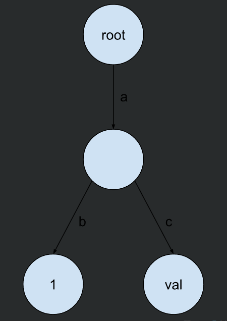
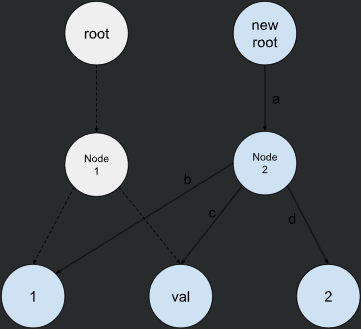
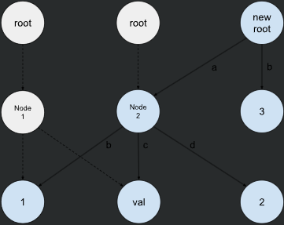
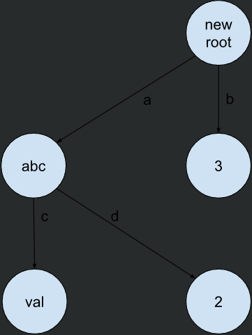
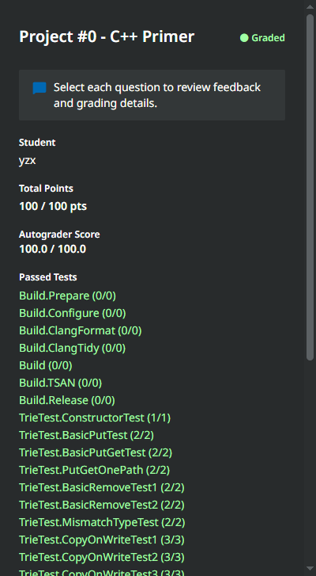

# project0

## 项目描述
在这个项目中，您将实现一个基于写时复制 trie 的键值存储。Tries 是一种高效的有序树数据结构，用于根据给定的键检索值。为了简化说明，我们假设键是可变长度的字符串，但在实际应用中，它们可以是任何任意类型。

trie 中的每个节点可以有多个子节点，表示不同的可能下一个字符。

您将实现的键值存储可以存储映射到任何类型值的字符串键。一个键的值存储在表示该键最后一个字符的节点中（即终端节点）。例如，考虑将 kv 对 ("ab", 1) 和 ("ac", "val") 插入 trie。

这两个键共享相同的父节点。对应键 "ab" 的值 1 存储在左子节点中，而对应键 "ac" 的值 "val" 存储在右节点中。



### Task #1 - Copy-On-Write Trie
在这个任务中，您需要修改 trie.h 和 trie.cpp 来实现一个写时复制的 trie。在写时复制的 trie 中，操作不会直接修改原始 trie 的节点。相反，会为修改的数据创建新的节点，并返回新的根节点以表示新修改的 trie。写时复制使我们能够在每次操作后以最低的开销随时访问 trie。考虑在上面的例子中插入 ("ad", 2)。我们通过重用原始树的两个子节点来创建一个新的 Node2，并创建一个新的值节点 2。（见下图）



如果我们随后插入 ("b", 3)，我们将创建一个新根节点、新节点，并重用先前的节点。通过这种方式，我们可以在每次插入操作之前和之后获取 trie 的内容。只要我们拥有根对象（Trie 类），就可以访问当时 trie 中的数据。（见下图）



再举一个例子：如果我们随后插入 ("a", "abc") 并移除 ("ab", 1)，我们可以得到下面的 trie。请注意，父节点可以具有值，并且您需要在移除后清除所有不必要的节点。一个空的 trie 用 nullptr 表示。



您的 trie 必须支持三种操作：
 + Get(key)：获取与键对应的值。
 + Put(key, value)：将对应的值设置为键。如果键已经存在，则覆盖现有值。请注意，值的类型可能是不可复制的（例如，std::unique_ptr<int>）。该方法返回一个新的 trie。
 + Delete(key)：删除键的值。该方法返回一个新的 trie。

这些操作不应直接在 trie 本身上执行。您应尽可能创建新的 trie 节点并重用现有节点。

要创建一个完全新的节点（即没有子节点的新叶节点），您可以简单地使用 TrieNodeWithValue 构造函数构造对象，然后将其转换为智能指针。
要进行写时复制并创建一个新节点，您应在 TrieNode 类上使用 Clone 函数。要在新的 trie 中重用现有节点，您可以复制 std::shared_ptr<TrieNode>：复制共享指针不会复制底层数据。您不应在此项目中手动分配内存，也不应使用 new 和 delete。当没有引用指向底层对象时，std::shared_ptr 将自动释放对象。

有关这些操作的完整规范，请参考起始代码中的注释。您的实现应像上述示例那样存储数据。请勿在 trie 中存储 C 字符串终止符 \0。还请避免从类定义中删除任何 const，或使用 mutable / const_cast 绕过 const 检查。

#### 解

写时拷贝字典树可以支持单人写和多人读，每个人读取的都是当前版本的字典树。当前写的操作不影响之前读取的操作。

如何做到当前写的操作不影响之前读的操作呢？这里是通过写的时候创建一颗新的字典树，这样自然不会影响之前读取的操作。

##### **Get**
数据保存结构：
  ```cpp
  // Trie中
  std::shared_ptr<const TrieNode> root_{nullptr};  //这里的rott_ 是const
  //TrieNode
  std::map < char, std::shared_ptr <const TrieNode>> children_; //children_ 存的也是const
  bool is_value_node_{false};
  ```

可以发现，root_保存的const类型节点，也就是const TrieNode。所以在遍历root_时不能使用 []，只能使用 .at()。因为：std::map 的 operator[] 只能用于非 const 的 std::map 实例，因为它会在需要时插入新的元素。

注意： dynamic_cast 传递原始指针
 + dynamic_cast 传递原始指针，而不能是智能指针。
 + dynamic_cast 是为了安全地将基类指针转换为派生类指针。如果直接将 std::shared_ptr 传递给 dynamic_cast，会导致编译错误，因为它期望的是原始指针。

```cpp
template <class T>
auto Trie::Get(std::string_view key) const -> const T * {
  //throw NotImplementedException("Trie::Get is not implemented.");

  auto node = root_;
  for(const char& ch : key){
    if(node == nullptr || node->children_.find(ch)==node->children_.end())
        return nullptr;
    node = node->children_.at(ch);
  }

  if(node != nullptr && node->is_value_node_){
    const TrieNodeWithValue<T> *res = dynamic_cast<const TrieNodeWithValue<T>*>(node.get());
    if(res)
        return res->value_.get(); // 返回指向值的原始指针
  }
    return nullptr;
}
```

##### **Put**

map 存的节点也是 const 类型，那么在使用 `cur->children_[ch] = std::make_shared<TrieNode>() ` 就会发生隐式转换，这样的话，后面就不能修改了。
下一步： cur = cur->children_[ch]; 就会报错，因为cur是非const类型；
比如下面是我刚开始写的，就会报错：
```cpp
std::shared_ptr<TrieNode> newroot = std::shared_ptr<TrieNode>(root_->Clone()); // 克隆根节点
auto cur = newroot; // 当前节点
auto parent = newroot; // 父节点，初始化为根节点

for (const char& ch : key) {
    auto it = cur->children_.find(ch);
    
    if (it == cur->children_.end()) {
        // 如果 children_ 不包含该字符，则创建新的节点
        cur->children_[ch] = std::make_shared<TrieNode>();
    } else {
        // 如果 children_ 已经包含，则克隆现有子节点
        cur->children_[ch] = std::shared_ptr<TrieNode>(it->second->Clone());
    }
    
    parent = cur; // 更新父节点为当前节点
    cur = cur->children_[ch]; // 更新当前节点为子节点
}

......
```

需要注意的是，调用Trie的默认构造函数时，会调用Trie() = default;此时 root_等于默认值nullptr，这个时候是不能访问root_->children_,所以刚开始需要判断root_是否为nullptr;

再定义一个指针 child,用来当作中介才行：
下面编译成功：
```cpp
template <class T>
auto Trie::Put(std::string_view key, T value) const -> Trie {
  // Note that `T` might be a non-copyable type. Always use `std::move` when creating `shared_ptr` on that value.
  //throw NotImplementedException("Trie::Put is not implemented.");

  std::shared_ptr<TrieNode> newroot;
  if(!root_){
    newroot = std::make_shared<TrieNode>();
  }else{
    newroot = std::shared_ptr<TrieNode>(root_->Clone()); //非const
  }
  auto cur = newroot;
  auto parent = newroot;
  auto child = newroot; // 如果直接cur->children_[ch] = std::make_shared<TrieNode>();会隐式转化为 const

  // 如果key是空的，就在原地修该
  if(key.empty()){
    auto newValueNode = std::make_shared<TrieNodeWithValue<T>>(cur->children_, std::make_shared<T>(std::move(value)));
    return Trie(newValueNode);
  }

  for(const char& ch : key){
    
    auto it = cur->children_.find(ch);
    // child全部为 非const类型
    if(it == cur->children_.end()){
        // children_不包含，创建节点
        child = std::make_shared<TrieNode>();
    }else{
        //children_已经包含，则clone
        child = std::shared_ptr<TrieNode>(it->second->Clone());
    }
    parent = cur;
    cur->children_[ch] = child;
    cur = child;
  }

  //此时 cur指向最后一个节点,需要给这个节点赋值 value
  // 当前的cur可能是clone 也可能是 新建
  if(cur->children_.empty()){
    // 直接修改
    auto newValueNode = std::make_shared<TrieNodeWithValue<T>>(std::make_shared<T>(std::move(value)));
    parent->children_[key.back()] = newValueNode;
  }else{
    auto newValueNode = std::make_shared<TrieNodeWithValue<T>>(cur->children_, std::make_shared<T>(std::move(value)));
    parent->children_[key.back()] = newValueNode;
  }

  return Trie(newroot); // 隐式转化为 std::shared_ptr<const TrieNode>
  // You should walk through the trie and create new nodes if necessary. If the node corresponding to the key already
  // exists, you should create a new `TrieNodeWithValue`.
}
```

##### **Remove**
注意：如果规定节点的父节点只有这一子节点并且自己不是一个值节点，那么我们也需要顺带把它清理掉。
  
因为要删除中间点，所以不能像Put方法那样，用一个中间节点，因为你不知道中间有多少个节点是 ‘可以删除的节点’，所以只能用递归自底向上遍历删除。

思路：因为后面要回溯删除路径上的节点，所以定义一个返回类型为 bool的递归函数。
  如果当前节点的子节点被删除，返回true。此时，表示当前节点也需要被删除。如果此节点不连接其他节点且不是value节点，那么直接删除此节点即可。如果此节点还连接着其他节点，那么就需要把此节点改为非value节点。
  如果当前节点的字节点没有被删除，返回false。表示没有移除任何键值

```cpp
auto Trie::Remove(std::string_view key) const -> Trie {
  //throw NotImplementedException("Trie::Remove is not implemented.");
    if(!this->root_){
        return *this;
    }
    // 如果键值为空，直接修改root_
    if(key.empty()){
        //如果root_有value
        if(root_->is_value_node_){
            if(root_->children_.empty()){
                return Trie(nullptr);
            }else{
                // 如果根节点有子节点
                auto newroot = std::make_shared<TrieNode>(root_->children_);
                return Trie(newroot);
            }
        }
        //如果没有，直接返回
        return *this;
    }

  // 定义递归函数,删除路径节点
  //如果删除成功则返回true，否则false
  std::function<bool(const std::shared_ptr<TrieNode>&, std::string_view)> RemoveCycle;
  RemoveCycle = [&](const std::shared_ptr<TrieNode> &new_roottry, std::string_view key) -> bool {
        auto it = new_roottry->children_.find(key.at(0));
        if(it!=new_roottry->children_.end()){
            // 如果当前路径存在
            if(key.size()==1){
                // 当前是最后一个节点路径位置，此时it指向最后一个节点
                if(!it->second->is_value_node_){
                    // 如果最后一个节点不是数值节点
                    return false;
                }
                // 如果最后一个节点是数值节点，判断 其后面是否还有连接
                // 如果没有连接，则此 it可直接删除；否则
                if(it->second->children_.empty()){
                    // 如果children为空 直接删除
                    new_roottry->children_.erase(it->first);
                }else{
                    // 否则，把此节点转化为 TrieNode
                    it->second = std::make_shared<TrieNode>(it->second->children_);
                }
                return true;
            }

            // 不是最后一个节点
            std::shared_ptr<TrieNode> ptr = std::shared_ptr<TrieNode>(it->second->Clone());
            
            bool flag = RemoveCycle(ptr, key.substr(1, key.size() - 1));
            // 自底向上修正路径
            if(!flag){
                // 如果子节点没删除
                return false;
            }
            // 如果删除成功，那么此时就要检查当前节点的 children_
            // 如果children_是空的 并且 不是数值节点，则继续删除
            if(ptr->children_.empty() && !ptr->is_value_node_){
                new_roottry->children_.erase(it->first);
            }else{
                it->second = std::shared_ptr<const TrieNode>(ptr);
            }
            return true;
        }
        // 如果不存在路径
        return false;

    };

  // 创建一个当前根节点的副本作为新的根节点
  std::shared_ptr<TrieNode> newroot = std::shared_ptr<TrieNode>(root_->Clone());
  // 删除根节点下面的路径
  bool flag = RemoveCycle(newroot, key);
  if(!flag){
    return *this;
  }
    // 如果删除成功，那么此时就要检查当前节点的 children_
    // 如果children_是空的 并且 不是数值节点，则继续删除
    if(newroot->children_.empty() && !newroot->is_value_node_){
        newroot = nullptr;
    }

  return Trie(std::move(newroot));

  // You should walk through the trie and remove nodes if necessary. If the node doesn't contain a value any more,
  // you should convert it to `TrieNode`. If a node doesn't have children any more, you should remove it.
}

```

### Task #2 - Concurrent Key-Value Store
在你实现了一个适用于单线程环境的写时复制 Trie 之后，接下来需要为多线程环境实现一个并发键值存储。在这个任务中，你需要修改 trie_store.h 和 trie_store.cpp。这个键值存储支持三种操作：

+ Get(key) 返回对应的值。
+ Put(key, value)。没有返回值。
+ Delete(key)。没有返回值。

对于原始的 Trie 类，每次我们修改 Trie 时，需要获取新的根节点以访问新的内容。但对于并发键值存储，put 和 delete 方法没有返回值。这要求你使用并发原语来同步读取和写入，以确保在这个过程中没有数据丢失。

你的并发键值存储应该能够同时服务多个读者和一个写者。也就是说，当有人在修改 Trie 时，仍然可以对旧根节点执行读取操作。当有人在读取时，也可以执行写入操作，而不需要等待读取完成。

此外，如果我们从 Trie 中获取了对某个值的引用，无论如何修改 Trie，我们都应该能够访问该值。Trie 的 Get 函数只返回一个指针。如果存储此值的 Trie 节点已被移除，则该指针将成为悬空指针。因此，在 TrieStore 中，我们返回一个 ValueGuard，它同时存储对值的引用和与 Trie 结构根节点对应的 TrieNode，以便在存储 ValueGuard 时可以访问该值。

为了实现这一点，我们在 trie_store.cpp 中为 TrieStore::Get 提供了伪代码。请仔细阅读，并思考如何实现 TrieStore::Put 和 TrieStore::Remove。

#### 解
这个比较简单，根据伪代码写就行了;

这里的Get为什么要加锁？
  为了保证时效性，假如先： 1.Get, 2.Write, 3.Get
  假如不加锁：完全可以假设命令3最先完成，随后是命令2，最后是命令1。这样我们后下达的命令反而得到了旧的结果，先下达的命令得到了新的结果。

```cpp
template <class T>
auto TrieStore::Get(std::string_view key) -> std::optional<ValueGuard<T>> {
  // Pseudo-code:
  // (1) Take the root lock, get the root, and release the root lock. Don't lookup the value in the
  //     trie while holding the root lock.
  // (2) Lookup the value in the trie.
  // (3) If the value is found, return a ValueGuard object that holds a reference to the value and the
  //     root. Otherwise, return std::nullopt.
  Trie newroot;
  {
    std::lock_guard guard(root_lock_);
    newroot = root_;
  }

  const T *val = newroot.Get<T>(key);
  if(val){
    return ValueGuard<T>(newroot, *val);
  }
    return std::nullopt;
}

/* ********************* */
template <class T>
void TrieStore::Put(std::string_view key, T value) {
  std::lock_guard<std::mutex>wlock(write_lock_);

  Trie newroot = root_.Put<T>(key, std::move(value));
  std::lock_guard<std::mutex> root_lock(root_lock_);
  root_ = newroot;
}

/* ********************* */
void TrieStore::Remove(std::string_view key) {
  std::lock_guard<std::mutex>wlock(write_lock_);

  Trie newroot = root_.Remove(key);

  std::lock_guard<std::mutex> rlock(root_lock_);
  root_ = newroot;
}
```

### Task #3 - Debugging

在这个任务中，你将学习基本的调试技巧。你可以选择任何你喜欢的调试方式，包括但不限于：使用 cout 和 printf、使用 CLion / VSCode 调试器、使用 gdb 等。

请参考 trie_debug_test.cpp 中的说明。你需要在 Trie 结构生成后设置一个断点，并回答几个问题。你需要在 trie_answer.h 中填写答案。

#### 解
注意：调试的时候要 make trie_debug_test 一下
然后打印一下就行了： std::cout<<*trie.Get<uint32_t>("969");
```cpp
const uint32_t CASE_1_YOUR_ANSWER = 10;
const uint32_t CASE_2_YOUR_ANSWER = 1;
const uint32_t CASE_3_YOUR_ANSWER = 25;
```

### Task #4 - SQL String Functions
现在是时候深入研究 BusTub 了！你需要实现 upper 和 lower SQL 函数。这可以分为两个步骤：（1）在 string_expression.h 中实现函数逻辑；（2）在 BusTub 中注册该函数，以便当用户执行 SQL 时，SQL 框架可以调用你的函数，具体在 plan_func_call.cpp 中。

要测试你的实现，你可以使用 bustub-shell：
```sh
cd build
make -j`nproc` shell
./bin/bustub-shell
bustub> select upper('AbCd'), lower('AbCd');
ABCD abcd
```
你的实现应该通过所有 3 个 sqllogictest 测试用例。

```sh
cd build
make -j`nproc` sqllogictest
./bin/bustub-sqllogictest ../test/sql/p0.01-lower-upper.slt --verbose
./bin/bustub-sqllogictest ../test/sql/p0.02-function-error.slt --verbose
./bin/bustub-sqllogictest ../test/sql/p0.03-string-scan.slt --verbose
```
注意：如果在运行 sqllogictest 时看到“BufferPoolManager is not implemented yet.”的消息，这是正常的，你可以在项目 0 中安全地忽略此警告。

####  解
```cpp
  auto Compute(const std::string &val) const -> std::string {
    // TODO(student): implement upper / lower.
    std::string res;
    switch (expr_type_) {
        case StringExpressionType::Lower:
            res.resize(val.size());  // 分配空间
            std::transform(val.begin(), val.end(), res.begin(), [](char c) { return std::tolower(c); }); 
            break;
        case StringExpressionType::Upper:
            res.resize(val.size());  // 分配空间
            std::transform(val.begin(), val.end(), res.begin(), [](char c) { return std::toupper(c); }); 
            break;
        default:
            break;
    }
    return res; 
  }
```
```cpp
auto Planner::GetFuncCallFromFactory(const std::string &func_name, std::vector<AbstractExpressionRef> args)
    -> AbstractExpressionRef {
  // 1. check if the parsed function name is "lower" or "upper".
  // 2. verify the number of args (should be 1), refer to the test cases for when you should throw an `Exception`.
  // 3. return a `StringExpression` std::shared_ptr.
  if ((func_name == "lower" || func_name == "upper") && args.size() == 1) {
    return static_cast<std::shared_ptr<StringExpression>>(std::make_shared<StringExpression>(
        args[0], func_name == "lower" ? StringExpressionType::Lower : StringExpressionType::Upper));
  }
  throw Exception(fmt::format("func call {} not supported in planner yet", func_name));
}
```

### 格式-结果
上面格式不是很标准，根据make check-clang-tidy-p0，调整



## 总结
1. 学到了 [shared_ptr](../../C++语法/使用到的库/7.memory.md) 的使用、[dynamic_cast](../../C++语法/语法/16.static_cast.md)的使用、[optional](../../C++语法/语法/11.optional.md)

2. 知道 在实现类模板函数时，把函数实现放到 .cpp中
  通常人们会在头文件中编写模板类和函数的实现。但是，为了更清楚，我们将实现分离到.cpp文件中。为了让编译器知道模板函数的实现，我们需要在这里**显式实例化它们**，以便链接器可以拾取它们。

  **显式实例化格式**
  要显式实例化一个模板类，你可以使用以下格式：

  显式实例化模板函数:用于生成特定类型的模板函数的实例，以便在编译时生成该函数的代码。这在你希望将模板函数的实现放在 .cpp 文件中时特别有用。

  显式实例化模板类: 用于生成特定类型的模板类的实例，以便在编译时生成该类型的代码。这在你希望将模板类的实现放在 .cpp 文件中时特别有用。

  ```cpp
  // 要显式实例化一个模板类，你可以使用以下格式：
  template class ClassName<Type>;

  //要显式实例化一个模板函数，你可以使用以下格式： 
  template ReturnType FunctionName<TemplateParameters>(FunctionParameters);
  ```


  在 .h 头文件中,声明模板函数：
  ```cpp
  // Trie.h
  template <typename T>
  class Trie {
  public:
      void Put(std::string_view key, T value);
  };
  ```

  在 .cpp 文件中，定义模板函数的实现
  ```cpp
  // Trie.cpp
  #include "Trie.h"
  
  template <typename T>
  void Trie<T>::Put(std::string_view key, T value) {
      // 函数实现
  }
  ```

  在 .cpp 文件的末尾，显式实例化你需要的模板类型
  ```cpp
  // 显式实例化
  template class Trie<int>;      // 实例化 Trie<int>
  template class Trie<double>;   // 实例化 Trie<double>
  ```

  完整的示例：
  ```cpp
  // .h
  #ifndef TRIE_H
  #define TRIE_H
  
  #include <map>
  #include <memory>
  #include <string_view>
  
  template <typename T>
  class Trie {
  public:
      void Put(std::string_view key, T value);
  };
  
  #endif // TRIE_H
  // *********************************
  // .cpp
  #include "Trie.h"
  
  template <typename T>
  void Trie<T>::Put(std::string_view key, T value) {
      // 函数实现
  }
  
  // 显式实例化
  template class Trie<int>;      // 实例化 Trie<int>
  template class Trie<double>;   // 实例化 Trie<double>
  ```


