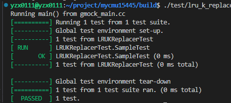
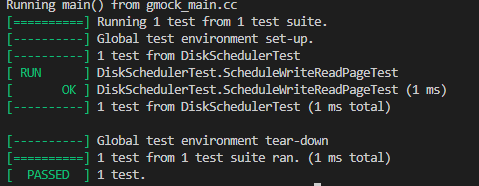
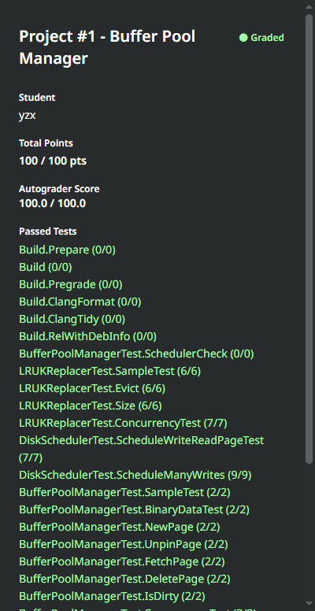

# project1

## Overview
将**为 BusTub 数据库管理系统构建一个面向磁盘的存储管理器**。在这样的存储管理器中，数据库的主要存储位置在磁盘上。

第一个编程项目是**实现一个缓冲池**。缓冲池负责将物理页面在主**内存和磁盘**之间来回移动。它使数据库管理系统能够支持比系统可用内存更大的数据库。缓冲池的操作对系统的其他部分是透明的。例如，系统通过唯一标识符（page_id_t）向缓冲池请求页面，而无需知道该页面是否已在内存中，或者系统是否需要从磁盘检索它。

你的实现需要是线程安全的。多个线程将同时访问内部数据结构，并必须确保其关键区域受到锁的保护（在操作系统中称为“锁”）。

你必须实现以下存储管理器组件：

+ LRU-K 替换策略
+ 磁盘调度程序
+ 缓冲池管理器

## Task #1 - LRU-K Replacement Policy
该组件负责跟踪缓冲池中的页面使用情况。您将实现一个名为 LRUKReplacer 的新类，位于 src/include/buffer/lru_k_replacer.h，以及其对应的实现文件 src/buffer/lru_k_replacer.cpp。请注意，LRUKReplacer 是一个独立的类，与其他替换类无关。您只需实现 LRU-K **替换策略**，无需实现 LRU 或时钟替换策略，即使有相应的文件。

LRU-K 算法**驱逐向后 k 距离最大的帧**。向后 k 距离计算为 当前时间戳与第 k 次之前访问的时间戳之间的差。对于历史访问少于 k 次的帧，其向后 k 距离为 +inf。当多个帧的向后 k 距离为 +inf 时，替换器将驱逐整体时间戳最早的帧（即记录访问时间最久的帧）。

LRUKReplacer 的最大大小与缓冲池的大小相同，因为它包含 BufferPoolManager 中所有帧的占位符。然而，在任何给定时刻，并非所有帧都被视为可驱逐的。LRUKReplacer 的大小由可驱逐帧的数量表示。LRUKReplacer 初始化时没有帧。只有当某帧被标记为可驱逐时，替换器的大小才会增加。

您需要实现本课程讨论的 LRU-K 策略。您需要按照头文件（src/include/buffer/lru_k_replacer.h）和源文件（src/buffer/lru_k_replacer.cpp）中定义的方法实现以下内容：

 + Evict(frame_id_t* frame_id)：驱逐与替换器中所有其他可驱逐帧相比，向后 k 距离最大的帧。将帧 ID 存储在输出参数中并返回 True。如果没有可驱逐的帧，返回 False。
  
 + RecordAccess(frame_id_t frame_id)：记录给定帧 ID 在当前时间戳下被访问。此方法应在页面在 BufferPoolManager 中被固定后调用。

 + Remove(frame_id_t frame_id)：清除与帧相关的所有访问历史。此方法应仅在页面在 BufferPoolManager 中被删除时调用。

 + SetEvictable(frame_id_t frame_id, bool set_evictable)：此方法控制帧是否可驱逐，同时控制 LRUKReplacer's 大小。当页面的固定计数达到 0 时，相应的帧被标记为可驱逐，并且替换器的大小增加时，您将知道何时调用此函数。
  
 + Size()：此方法返回当前在 LRUKReplacer 中的可驱逐帧数量。


### 解

驱逐方法：
  + K-Distance 指导我们驱逐页，只要有 K-Distance 为无穷大的页，我们都优先驱逐。没有，再考虑对 K-Distance 有限的页进行驱逐。很合理：我们要尽可能保留出现次数多的页，优先驱逐出现次数少的。
 
那多个页的 K-Distance 都为无穷大，我们先驱逐哪一个呢？ 如果多个页的 K-Distance 均为无穷大，我们使用 FIFO 进行驱逐。
 代码注释中有写：If multiple frames have inf backward k-distance, then evict frame with earliest timestamp based on LRU. 即 FIFO
 所以：
 **对于不满足k次的具体方法：**
  每次通过头插法加入新的页面，如果要在这里面驱逐一个页面，采用reverse_iterator反向迭代器从后往前遍历，查找允许被驱逐的页面。
 
 如果没有无穷大的了，我们就考虑对K-Distance 有限的页进行驱逐。方法是，我们驱逐 K-Distance 最小的页，这很好理解，K-Distance最小代表它的倒数第 K 次出现最遥远，时间局部性更弱。 注意：我们驱逐页的时候要判断该页是否可以驱逐。
 **对于满足k次的具体方法：**
  这个链表是按照时间戳从小到大排列的（按照history）。也就是说，越前面的页它的k-distance越大，也就是前面的要被删除。
  history_保存k_distance。维护history_每次从尾部插入，那么头部就是k_distance;

这里有个疑问要不要设置两个链表来分别保存？
  其实是可以不要的，但是这是复杂度将会是 o(2N),因为要遍历两次node_store_。如果分开的话，只要O(N)

为了维护 LRUKNode ，定义更新时间函数;
为了便于操作，这里我全部改为public，也可以继续使用private，只不过要定义一些函数来获取和修改；

```cpp
class LRUKNode {
    // 维护每个页面的访问历史
 public:
  explicit LRUKNode(frame_id_t fid, size_t k, bool is_evictable=false) : fid_(fid), k_(k),  is_evictable_(is_evictable){}
  
  void RecordAccess(size_t timestamp) {
    // 维护history, 头代表刚插入的，尾部为k-distance
    if (history_.size() >= k_) {
      history_.pop_front();
    }
    history_.push_back(timestamp); 
  }
 //private: 这里改为pubulic，后面看能不能通过
  /** History of last seen K timestamps of this page. Least recent timestamp stored in front. */
  // Remove maybe_unused if you start using them. Feel free to change the member variables as you want.
   std::list<size_t> history_; 
   frame_id_t fid_ {};
   size_t k_ {};  // 当前节点访问的次数
   bool is_evictable_{false}; // 初始全为false，后面由SetEvictable更改
   std::list<frame_id_t>::iterator pos_ {}; // 代表位置，用于删除
};
```

LRUKReplacer维护两个链表:
```cpp
 private:
  // TODO(student): implement me! You can replace these member variables as you like.
  // Remove maybe_unused if you start using them.
  std::unordered_map<frame_id_t, LRUKNode> node_store_; // 所有的缓存索引   
  
  std::list<frame_id_t> node_less_k_; //少于k的缓存队列
  std::list<frame_id_t> node_more_k_; //大于等于k的缓存队列

  size_t current_timestamp_{0}; //当前时间戳
  size_t curr_size_{0}; // 可驱逐帧的大小     

  size_t replacer_size_; // LRUReplacer需要存储的最大帧数
  size_t k_; // k     
  std::mutex latch_;
```

1. Evict

代码注释：
  找出出向后k距离最大的帧，并将其逐出。只有标记为“可驱逐”的框架才有可能被驱逐。
  对于少于k个历史参考的帧，给出它的向后k距离+inf。如果多个帧具有反向k-distance，则根据LRU剔除时间戳最早的帧。
  成功删除一个帧应该减少替换的大小，并删除帧的访问历史

主要逻辑就是优先删除 k-distance为无穷大的，然后再删除 大于等于k的缓存队列
```cpp
namespace bustub {

LRUKReplacer::LRUKReplacer(size_t num_frames, size_t k) : replacer_size_(num_frames), k_(k) {}

auto LRUKReplacer::Evict(frame_id_t *frame_id) -> bool { 
    std::lock_guard<std::mutex>lock(latch_);

    if(curr_size_ == 0){
        return false;
    }
    /* 首先检查少于k的缓存队列,如果可以被删除，则删除 */
    for(auto it = node_less_k_.rbegin(); it != node_less_k_.rend(); ++it ){
        LRUKNode cur_node = node_store_.at(*it);
        if(cur_node.is_evictable_){
            node_store_.erase(cur_node.fid_);
            node_less_k_.erase(cur_node.pos_);
            curr_size_--;
            *frame_id = cur_node.fid_;
            return true;
        }
    }
    /* 在检查大于等于k的缓存队列，如果可以被删除，则删除 */
    for(auto it = node_more_k_.begin(); it != node_more_k_.end(); ++it){
        LRUKNode cur_node = node_store_.at(*it);;
        if(cur_node.is_evictable_){
            node_store_.erase(cur_node.fid_);
            node_more_k_.erase(cur_node.pos_);
            curr_size_--;
            *frame_id = cur_node.fid_;
            return true;
        }
    }
    return false; 
}
```

2. RecordAccess 
  记录在当前时间戳访问给定帧id的事件。如果以前没有看到过帧id，则为访问历史创建一个新条目。
  如果帧id无效(即。大于replacer_size_)，抛出异常。如果帧id无效，还可以使用BUSTUB_ASSERT中止进程。
   * @param frame_id id of frame that received a new access.
   * @param access_type type of access that was received. This parameter is only needed for
  
注意：replacer_size_其实就是缓冲池中可存放的最大值，也就是说这里传递的参数 frame_id必然不能大于 replacer_size_（其实也就是缓冲池Page数组的下标）。
那么这里有另外一个问题：如果以前没有看到过帧frame_id，这个时候要添加到队列中，要不要考虑此时的容量是否已经满了？
  我认为是不要考虑的，刚开始写这个函数的时候不是很清楚这个 frame_id 是什么，所以当时就想会涉及到 Evict，开两个锁。今天当上传到网站测试的时候报错，所以回来检查一下，发现了这个问题。
  当做 task3的时候就知道，这里的 frame_id 其实就是维护的 0~replacer_size_ 的一组下标而已，当页表中不包含frame_id时，那么此时一定不是满的，所以根本不需要检查是否满了，因为一定是不满的，所以也用不到 Evict。

而且发现写的有问题：
  怎么判断当前节点在哪一个链表中？
  有两种方法，先不更新 node_store_.at(frame_id).RecordAccess(current_timestamp_);，通过history.size()判断;
  或者直接判断 pos >= lst.begin() && pos < lst.end();（时间复杂度是常数）
  这两种方法，我之前写错了；
```cpp
void LRUKReplacer::RecordAccess(frame_id_t frame_id, [[maybe_unused]] AccessType access_type) {
  std::lock_guard<std::mutex> lock(latch_);
  if (frame_id > static_cast<frame_id_t>(replacer_size_)) {
    throw std::out_of_range("Invalid frame id.");
  }
  current_timestamp_++;
  if (node_store_.find(frame_id) == node_store_.end()) {
    // 如果之前没有，则需要添加；这里不需要考虑是否已经满了，因为一定不满
    node_less_k_.push_front(frame_id);
    // node_store_.at(frame_id) = LRUKNode(frame_id, k_, true);
    node_store_.insert({frame_id, LRUKNode(frame_id, k_, true)});
    node_store_.at(frame_id).pos_ = node_less_k_.begin();
    // 更新访问时间
    node_store_.at(frame_id).RecordAccess(current_timestamp_);
    curr_size_++;
  } else {
    // 如果之前已经存在了
    if (node_store_.at(frame_id).history_.size() == k_ - 1) {
      // 说明此时 frame_id 在node_less_k_，下一步要换到node_more_k_中
      node_store_.at(frame_id).RecordAccess(current_timestamp_);
      node_less_k_.erase(node_store_.at(frame_id).pos_);
      // 找到第一个大于的位置,不是大于等于，因为此时的时间是最新的
      auto it = std::upper_bound(node_more_k_.begin(), node_more_k_.end(), frame_id,
                                 [&](const frame_id_t &val, const frame_id_t &a) -> bool {
                                   return node_store_.at(a).history_.front() > node_store_.at(val).history_.front();
                                 });
      it = node_more_k_.insert(it, frame_id);
      node_store_.at(frame_id).pos_ = it;
    } else if (node_store_.at(frame_id).history_.size() >= k_) {
      // 之前已经在node_more_k_中，更改位置
      node_store_.at(frame_id).RecordAccess(current_timestamp_);
      node_more_k_.erase(node_store_.at(frame_id).pos_);
      auto it = std::upper_bound(node_more_k_.begin(), node_more_k_.end(), frame_id,
                                 [&](const frame_id_t &val, const frame_id_t &a) -> bool {
                                   return node_store_.at(a).history_.front() > node_store_.at(val).history_.front();
                                 });
      it = node_more_k_.insert(it, frame_id);
      node_store_.at(frame_id).pos_ = it;
    } else {
      // 如果 node_store_.at(frame_id).history_.size() < k_-1，只需更新时间
      node_store_.at(frame_id).RecordAccess(current_timestamp_);
    }
  }
}
```


>**下面全是错误的（刚开始写的时候想法）**
>  这里涉及到要调用 Evict，所以如果只是用一个互斥锁latch_，那么就会产生死锁；
>  如果定义只定义 std::unique_lock<std::mutex> lock(latch_);，在使用 Evict前释放，使用完后加锁。这里我感觉不太可行，假如在使用 Evict前释放锁，那么可能另外一个等待调用RecordAcess的线程可能会抢占到锁，如果这个线程也是 >传递相同的 frame_id，那么此时就会再次调用Evict，就会删除两次或者更多。
>  所以在这里我又定义一个互斥锁，来保护 RecordAccess是原子性的，一次只有一个线程可以访问。
>
>```cpp
>void LRUKReplacer::RecordAccess(frame_id_t frame_id, [[maybe_unused]] AccessType access_type) {
>    std::lock_guard<std::mutex>lockp(p);
>    std::unique_lock<std::mutex> lock(latch_);
>
>    if(frame_id > static_cast<frame_id_t>(replacer_size_)){
>        throw std::out_of_range("Invalid frame id.");
>    }
>    current_timestamp_++;
>
>    if(node_store_.find(frame_id) == node_store_.end()){
>        // 之前没有添加
>        if(curr_size_ >= replacer_size_){
>            lock.unlock();
>            frame_id_t frame;
>            Evict(&frame);
>            lock.lock();
>        }
>        node_less_k_.push_front(frame_id);
>
>        // node_store_.at(frame_id) = LRUKNode(frame_id, k_, true);
>        node_store_.insert({frame_id, LRUKNode(frame_id, k_, true)});
>        node_store_.at(frame_id).pos_ = node_less_k_.begin();
>        //更新访问时间
>        node_store_.at(frame_id).RecordAccess(current_timestamp_);
>        curr_size_++;     
>    }else{
>        //更新访问时间
>        node_store_.at(frame_id).RecordAccess(current_timestamp_);
>
>        if(node_store_.at(frame_id).history_.size()==k_){
>        // 需要换位置
>            node_less_k_.erase(node_store_.at(frame_id).pos_);
>            auto it = std::upper_bound(node_more_k_.begin(),node_more_k_.end(),frame_id,
>            [&](const frame_id_t& val,const frame_id_t& a)->bool {
>                return node_store_.at(a).history_.front() > node_store_.at(val).history_.front();
>            });
>            it = node_more_k_.insert(it, frame_id);
>            node_store_.at(frame_id).pos_ = it;
>        }else if(node_store_.at(frame_id).history_.size()>k_){
>            node_more_k_.erase(node_store_.at(frame_id).pos_);
>            auto it = std::upper_bound(node_more_k_.begin(),node_more_k_.end(),frame_id,
>            [&](const frame_id_t& val,const frame_id_t& a)->bool {
>                return node_store_.at(a).history_.front() > node_store_.at(val).history_.front();
>            });
>            it = node_more_k_.insert(it, frame_id);  
>            node_store_.at(frame_id).pos_ = it;         
>        }
>    }
>}
>```

3. SetEvictable
根据注释写就行：
  切换帧是可驱逐还是不可驱逐。这个函数还控制替换器的大小。请注意，大小等于可驱逐条目的数量。
  如果一个帧之前是可驱逐的，并且将被设置为不可驱逐的，那么大小应该减量。
  如果一个帧之前是不可驱逐的，将被设置为可驱逐的，然后大小应该增加。
  如果帧id无效，则抛出异常或中止该进程。
  对于其他场景，该函数应该在不修改任何内容的情况下终止。

```cpp
void LRUKReplacer::SetEvictable(frame_id_t frame_id, bool set_evictable) {
    std::lock_guard<std::mutex> lock(latch_);
    if(frame_id > static_cast<frame_id_t>(replacer_size_)){
        throw std::out_of_range("Invalid frame id.");
    }    
    if(node_store_.find(frame_id)==node_store_.end()){
        return;
    }

    auto& node = node_store_.at(frame_id);

    auto status = node.is_evictable_;
    node.is_evictable_ = set_evictable;

    if(status&&!set_evictable){
        curr_size_--;
    }
    if(!status&&set_evictable){
        curr_size_++;
    }
}
```

4. Remove
根据注释写就行：
  从替换程序中删除一个可驱逐的框架，以及它的访问历史记录。如果移除成功，这个函数也应该减少替换器的大小。
  请注意，这与驱逐帧不同，后者总是删除该帧具有最大的向后k距离。这个函数移除指定的帧id，不管它的反向k距离是多少。
  如果在不可驱逐的帧上调用Remove，则抛出异常或中止该进程。
  如果指定的帧没有找到，直接从这个函数返回。
```cpp
void LRUKReplacer::Remove(frame_id_t frame_id) {
    std::lock_guard<std::mutex> lock(latch_);  
    if(node_store_.find(frame_id)==node_store_.end()){
        return;
    }
    auto node = node_store_.at(frame_id);
    if(!node.is_evictable_){
        throw std::exception();
    }
    node_store_.erase(frame_id);
    curr_size_--;
    if(node.history_.size() < k_){
        node_less_k_.erase(node.at(frame_id).pos_);
    }else{
        node_more_k_.erase(node.at(frame_id).pos_);
    }
}

auto LRUKReplacer::Size() -> size_t { 
    return curr_size_; 
}

}  // namespace bustub
```



**遇到的错误**
注意：
  在使用 operator[] 时，如果键不存在，编译器会尝试使用默认构造函数来创建 LRUKNode 对象
  为了避免在 std::unordered_map 中使用 operator[] 时触发默认构造函数，可以使用以下几种方法之一：
   + 使用 insert 方法：确保在插入键值对时明确指定值。
   + 使用 at 方法：确保键存在后再访问。
   + 使用 find 方法：确保键存在后再访问。

  在使用insert时，插入后，it 本身并不会自动更新为指向新插入的元素。迭代器 it 仍然指向插入位置的原始位置。
  可以通过 std::next(it) 来获取新插入元素的迭代器。
  也可以直接使用返回值；
  `it = node_more_k_.insert(it, frame_id); // 这个调用会返回新插入元素的迭代器`

## Task #2 - Disk Scheduler
**这个组件负责在 DiskManager 上调度读写操作**。你将实现一个名为 DiskScheduler 的新类，文件位于 src/include/storage/disk/disk_scheduler.h，其对应的实现文件在 src/storage/disk/disk_scheduler.cpp。

磁盘调度器可以被其他组件（在这种情况下是任务 #3 中的 BufferPoolManager）使用，以队列磁盘请求，这些请求由 DiskRequest 结构体表示（已经在 src/include/storage/disk/disk_scheduler.h 中定义）。磁盘调度器将维护一个后台工作线程，负责处理调度的请求。

磁盘调度器将利用一个**共享队列**来**调度和处理 DiskRequest**。一个线程将向队列添加请求，而磁盘调度器的后台工作线程将处理排队的请求。我们在 src/include/common/channel.h 中提供了一个 Channel 类，以便在**线程之间安全地共享数据**，但如果你认为有必要，可以使用自己的实现。

DiskScheduler 的构造函数和析构函数已经实现，负责创建和加入后台工作线程。你只需实现以下方法，这些方法在头文件（src/include/storage/disk/disk_scheduler.h）和源文件（src/storage/disk/disk_scheduler.cpp）中定义：

 + Schedule(DiskRequest r)：调度请求以供 DiskManager 执行。DiskRequest 结构体指定请求是用于读取/写入，数据应从哪里写入/写出，以及操作的页面 ID。DiskRequest 还包含一个 std::promise，其值应在请求处理后设置为 **true**。

 + StartWorkerThread()：处理调度请求的后台工作线程的启动方法。工作线程在 DiskScheduler 构造函数中创建并调用此方法。此方法负责获取排队的请求并将其分派给 DiskManager。请记得在 DiskRequest 的回调上设置值，以通知请求发起者请求已完成。此方法在 DiskScheduler 的析构函数被调用之前不应返回。

最后，DiskRequest 的一个字段是 std::promise。如果你对 C++ 的 promises 和 futures 不熟悉，可以查看它们的文档。在本项目中，它们本质上为线程提供了一个回调机制，以知道其调度的请求何时完成。要查看它们可能如何使用的示例，请查看 disk_scheduler_test.cpp。

同样，具体的实现细节由你决定，但你必须确保你的实现是线程安全的。

磁盘管理器类(src/include/storage/ Disk /disk_manager.h)从磁盘读写页面数据。磁盘调度器在处理读或写请求时将使用DiskManager::ReadPage()和DiskManager::WritePage()。

### 解

channel.h 实现了一个简单的[消息队列](../../C++语法/模式/消息队列.md)，之前在写webserve的时候已经接触过了。只不过这里用到 `cv_.wait(lk, [&]() { return !q_.empty(); });`挺简便的。

这里的整个过程很像之前webserve中的日志函数，维护一个阻塞队列，这里就是channel,然后用一个异步线程单独处理日志，这里用一个异步线程单独处理请求队列。这里的 StartWorkerThread来完成这个任务。

[std::promise](../../C++语法/锁/4.future.md)的用法，[optional](../../C++语法/语法/11.optional.md)的用法。

```cpp
namespace bustub {

DiskScheduler::DiskScheduler(DiskManager *disk_manager) : disk_manager_(disk_manager) {
  background_thread_.emplace([&] { StartWorkerThread(); });
}

DiskScheduler::~DiskScheduler() {
  // Put a `std::nullopt` in the queue to signal to exit the loop
  request_queue_.Put(std::nullopt);
  if (background_thread_.has_value()) {
    background_thread_->join();
  }
}

void DiskScheduler::Schedule(DiskRequest r) {
    request_queue_.Put(std::make_optional<DiskRequest>(std::move(r)));
}

void DiskScheduler::StartWorkerThread() {
    std::optional<DiskRequest> request;
    while((request = request_queue_.Get(), request.has_value())){
        if(request->is_write_){
            disk_manager_->WritePage(request->page_id_, request->data_);
        }else{
            disk_manager_->ReadPage(request->page_id_, request->data_);
        }
        request->callback_.set_value(true);
    }
}
}  // namespace bustub
```



## Task #3 - Buffer Pool Manager

接下来，实现缓冲池管理器（BufferPoolManager）。缓冲池管理器负责通过 DiskScheduler 从磁盘获取数据库页面并将其存储在内存中。**当被显式指示或者需要驱逐页面以为新页面腾出空间时，缓冲池管理器也可以调度脏页面的写入操作**。

为了确保您的实现与系统的其余部分正确协同工作，我们将提供一些已经填写好的函数。您也不需要实现实际读取和写入磁盘数据的代码（在我们的实现中称为 DiskManager）。我们会提供该功能。然而，您需要实现 DiskScheduler 来处理磁盘请求并将其分派给 DiskManager（这是任务 #2）。

系统中的所有内存页面由 Page 对象表示。缓冲池管理器不需要理解这些页面的内容。但作为系统开发者，您需要了解 Page 对象只是缓冲池中内存的容器，因此并不特定于某一唯一页面。也就是说，每个 Page 对象包含一块内存，DiskManager 将使用该内存位置来复制从磁盘读取的物理页面的内容。缓冲池管理器会重用相同的 Page 对象来存储数据，因为它在磁盘与内存之间来回移动。这意味着同一个 Page 对象在系统生命周期内可能包含不同的物理页面。Page 对象的标识符（page_id）用于跟踪其包含的物理页面；如果 Page 对象不包含物理页面，则其 page_id 必须设置为 INVALID_PAGE_ID。

每个 Page 对象还维护一个计数器，记录有多少线程“固定”了该页面。您的缓冲池管理器不允许释放已固定的 Page。每个 Page 对象还跟踪其是否为脏页面。您需要记录页面在被解除固定之前是否被修改。您的缓冲池管理器必须在可以重用该对象之前，将脏页面的内容写回磁盘。

您的缓冲池管理器实现将使用您在本作业的前面步骤中创建的 LRUKReplacer 和 DiskScheduler 类。LRUKReplacer 将跟踪 Page 对象的访问情况，以便在必须释放一个帧以为从磁盘复制新物理页面腾出空间时，**决定驱逐哪个页面**。在缓冲池管理器中将 page_id 映射到 frame_id 时，请注意 STL 容器不是线程安全的。DiskScheduler 将调度对 DiskManager 的**写入和读取操作**。

您需要实现以下在头文件（src/include/buffer/buffer_pool_manager.h）和源文件（src/buffer/buffer_pool_manager.cpp）中定义的函数：

 + FetchPage(page_id_t page_id)
 + UnpinPage(page_id_t page_id, bool is_dirty)
 + FlushPage(page_id_t page_id)
 + NewPage(page_id_t* page_id)
 + DeletePage(page_id_t page_id)
 + FlushAllPages()

对于 FetchPage，如果自由列表中没有可用页面且所有其他页面都被固定，则应返回 nullptr。FlushPage 应该无论页面的固定状态如何都能刷新页面。

对于 UnpinPage，is_dirty 参数用于跟踪页面在被固定期间是否被修改。

AllocatePage 私有方法在您希望在 NewPage() 中创建新页面时为缓冲池管理器提供唯一的新页面 ID。另一方面，DeallocatePage() 方法是一个无操作的模拟，模仿在磁盘上释放页面，您应该在 DeletePage() 实现中调用它。

您不需要使缓冲池管理器超级高效——在每个公开的缓冲池管理器函数开始到结束持有缓冲池管理器锁应该足够。然而，您需要确保您的缓冲池管理器具有合理的性能，否则在未来的项目中会出现问题。您可以将您的基准结果（QPS.1 和 QPS.2）与其他学生进行比较，看看您的实现是否太慢。

请参考头文件（lru_k_replacer.h、disk_scheduler.h、buffer_pool_manager.h）以获取更详细的规格和文档。

### 解

#### 分析
page.h
页这个数据结构，在操作系统中的印象就是，一块大小 4096 字节的连续内存。
这里的定义：
  [读写锁](../../C++语法/使用到的库/35.shared_mutex.md) `ReaderWriterLatch rwlatch_`;
  char* data_ : 存储数据的指针
  page_id_ : 物理页号
  pin_count_ :有多少线程“固定”了该页面
  is_dirty_ : 是否为脏页面
  相当于一个控制块，各个的作用题目中已经讲了；

DiskManager:
  task2中实现的调度器，当缓存池需要读取或者写入一个页面的时候，通过创建一个DiskRequest请求对象，然后由DisManager来实现这个去读操作。

BfuuerPoolManger:
  Page* pages_;Page数组，也就是页框。一个page保存一个页面信息。
  std::unordered_map<page_id_t, frame_id_t> page_table_;用于跟踪缓冲池页面的页表。
    page_table_页表这个东西就是存储 page_id_t<->frame_id_t的映射，因为 pages_是一个数组，这个数组的index就是这里的frame_id_t。我们知道pages_中存放的每一个元素保存的都是一个页的信息，一个页有唯一的page_id_t标识，当我们把页存放到缓冲池中，也就是这里的pages_中，pages_的下标显然不可能是page_id_t，所以我们需要一个映射来知道一个页(page_id)存放在pages_(indx==frame_id_t)中哪个位置。所以当我们想要一个page信息的时候我们应该先从page_table_中拿到pages_的下标，然后通过下标再从pages_中拿到这个页的信息。
  std::list<frame_id_t> free_list_; 空页，里面维护的信息就是 frame_id_t。通过构造函数也可以知道他们之间的关系。

#### 解
1. FetchPage
注释：
 从缓冲池中获取请求的页面。如果page_id需要从磁盘中获取， 但所有帧当前都在使用中并且不可驱逐(换句话说，固定)，则返回nullptr。
 首先在缓冲池中搜索page_id。如果没有找到，从空闲列表或替换器中选择一个替换帧(总是先从空闲列表中找到)，通过使用disk_scheduler_->Schedule()调度读DiskRequest从磁盘读取该页，然后替换该帧中的旧页。与NewPage()类似，如果旧页面是脏的，则需要将其写回磁盘并更新新页面的元数据
 此外，请记住禁用驱逐并记录帧的访问历史，就像对NewPage()所做的那样。
   * @param page_id id of page to be fetched
   * @param access_type type of access to the page, only needed for leaderboard tests.
   * @return nullptr if page_id cannot be fetched, otherwise pointer to the requested page
```cpp
auto BufferPoolManager::FetchPage(page_id_t page_id, [[maybe_unused]] AccessType access_type) -> Page * {
  if(page_id == INVALID_PAGE_ID){
    return nullptr;
  }
  std::scoped_lock lock(latch_);
  //假如当前缓冲池有这个页
  if(page_table_.find(page_id) != page_table_.end()){
    frame_id_t frame_id = page_table_[page_id];
    Page* page = pages_ + frame_id;
    replacer_->RecordAccess(frame_id);
    replacer_->SetEvictable(frame_id, false);
    page->pin_count_++;
    return page;
  }
  // 这个时候就需要从内存中读取了
  Page* page;
  frame_id_t frame_id = -1;
  if(!free_list_.empty()){
    // 如果有空的
    frame_id = free_list_.front();
    free_list_.pop_front();
    page = pages_ + frame_id;
  }else{
    // 这个时候就需要剔除了
    if(!replacer_->Evict(&frame_id)){
        return nullptr;
    }
    page = pages_ + frame_id;
  }
  // 成功拿到页后，就需要读取和替换帧
  // 首先要检查，拿到的这个页是否是脏的，如果是就要先写到磁盘中，然后再替换
  if(page->IsDirty()){
    // 参考test的写法
    auto promise = disk_scheduler_->CreatePromise();
    auto future = promise.get_future();
    disk_scheduler_->Schedule({true, page->GetData(), page->GetPageId(), std::move(promise)});
    if(!future.get()){
        throw std::runtime_error("Future returned false.");
    }
    page->is_dirty_ = false;
  }
  page_table_.erase(page->GetPageId());
  page_table_.emplace(page_id, frame_id);
  // 这里是友元类，所以可以直接修改数据
  page->page_id_ = page_id;
  page->pin_count_ = 1;
  page->ResetMemory();
  replacer_->RecordAccess(frame_id);
  replacer_->SetEvictable(frame_id, false);
  // 读取数据
  auto promise = disk_scheduler_->CreatePromise();
  auto future = promise.get_future();
  disk_scheduler_->Schedule({false, page->GetData(), page->GetPageId(), std::move(promise)});
  if(!future.get()){
    throw std::runtime_error("Future returned false.");
  }  
  return page;
}
```


2. UnpinPage
注释：
  从缓冲池中解除目标页的锁定。如果page_id不在缓冲池中或其引脚计数已经为0，则返回false。

  减少一个页面的引脚计数。如果引脚数达到0，则该帧应被替换器移除。
  另外，在页面上设置脏标志，以指示页面是否被修改。
   * @param page_id id of page to be unpinned
   * @param is_dirty true if the page should be marked as dirty, false otherwise
   * @param access_type type of access to the page, only needed for leaderboard tests.
   * @return false if the page is not in the page table or its pin count is <= 0 before this call, true otherwise
```cpp
auto BufferPoolManager::UnpinPage(page_id_t page_id, bool is_dirty, [[maybe_unused]] AccessType access_type) -> bool {
  if(page_id == INVALID_PAGE_ID){
    return false;
  }
  std::scoped_lock lock(latch_);
  if(page_table_.find(page_id)==page_table_.end()){
    return false;
  }
  auto frame_id = page_table_[page_id];
  auto page = pages_ + frame_id;
  // 设置脏位,如果原本是脏的或传进的is_dirty是脏的，最终就是脏的
  page->is_dirty_ = is_dirty || page->is_dirty_;
  // 引脚计数已经为0，则返回false
  if(page->GetPinCount==0){
    return false;
  }
  // 减少一个页面的引脚计数。如果引脚数达到0，则该帧应被替换器移除。
  page->pin_count_--;
  if(page->GetPinCount()==0){
    replacer_->SetEvictable(frame_id, true);
  }
  return true;
}
```

3. FlushPage
注释：
  将目标页刷新到磁盘。
  使用DiskManager::WritePage()方法将页刷新到磁盘，而不考虑脏标志。
  清除冲洗后页面的脏标志。
  @param page_id id of page to be flushed, cannot be INVALID_PAGE_ID
  @return false if the page could not be found in the page table, true otherwise
```cpp
auto BufferPoolManager::FlushPage(page_id_t page_id) -> bool { 
  if(page_id == INVALID_PAGE_ID){
    return false;
  }
  std::scoped_lock lock(latch_);
  if(page_table_.find(page_id)==page_table_.end()){
    return false;
  }
  auto page = pages_ + page_table_[page_id];
  //刷新到磁盘
  auto promise = disk_scheduler_->CreatePromise();
  auto future = promise.get_future();
  disk_scheduler_->Schedule({true, page->GetData(), page->GetPageId(), std::move(promise)});
  if(!future.get()){
    throw std::runtime_error("Future returned false.");
  }  
  page->is_dirty_ = false;
  return true;
}
```

4. NewPage
注释：
  在缓冲池中创建一个新页面。将page_id设置为新页面的id，如果所有帧当前都在使用并且不可驱逐(换句话说，固定)，则将其设置为nullptr。

  您应该从空闲列表或替换器中选择替换框架(总是先从空闲列表中找到)，然后调用AllocatePage()方法来获取新的页面id。如果替换框架有脏页，您应该首先将其写回磁盘。您还需要为新页面重置内存和元数据。

  记住通过调用replacer来“固定”框架。SetEvictable(frame_id, false)，以便替换器在缓冲池管理器“Unpin”之前不会将帧驱逐。此外，要记住在替换器中记录帧的访问历史，以便使lru-k算法工作。
   * @param[out] page_id id of created page
   * @return nullptr if no new pages could be created, otherwise pointer to new page

```cpp
auto BufferPoolManager::NewPage(page_id_t *page_id) -> Page * { 
  // 在缓冲池中创建一个新页面。
  // 这个时候就需要从内存中读取了
  Page* page;
  frame_id_t frame_id = -1;
  std::scoped_lock lock(latch_);
  if(!free_list_.empty()){
    // 如果有空的
    frame_id = free_list_.front();
    free_list_.pop_front();
    page = pages_ + frame_id;
  }else{
    // 这个时候就需要剔除了，找到要剔除的帧和page
    if(!replacer_->Evict(&frame_id)){
        return nullptr;
    }
    page = pages_ + frame_id;
  }
  // 成功拿到页后，就需要读取和替换帧
  // 首先要检查，拿到的这个页是否是脏的，如果是就要先写到磁盘中，然后再替换
  if(page->IsDirty()){
    // 参考test的写法
    auto promise = disk_scheduler_->CreatePromise();
    auto future = promise.get_future();
    disk_scheduler_->Schedule({true, page->GetData(), page->GetPageId(), std::move(promise)});
    if(!future.get()){
        throw std::runtime_error("Future returned false.");
    }
    page->is_dirty_ = false;
  }
  *page_id = AllocatePage();
  page_table_.erase(page->GetPageId());
  page_table_.emplace(page_id, frame_id);
  // 这里是友元类，所以可以直接修改数据
  page->page_id_ = page_id;
  page->pin_count_ = 1;
  page->ResetMemory();
  // 重新记录
  replacer_->RecordAccess(frame_id);
  replacer_->SetEvictable(frame_id, false);
  return page;
}
```

5. DeletePage
注释：
 从缓冲区池中删除一个页面。如果页面ID不在缓冲区池中，则不做任何操作并返回true。如果页面被固定且无法删除，则立即返回false。
 在从页面表中删除页面后，停止在替换器中跟踪该帧，并将帧添加回空闲列表。同时，重置页面的内存和元数据。最后，调用DeallocatePage()来模仿在磁盘上释放页面。
```cpp
auto BufferPoolManager::DeletePage(page_id_t page_id) -> bool { 
  // 从缓冲区池中删除一个页面
  if(page_id == INVALID_PAGE_ID){
    return true;
  }
  std::scoped_lock lock(latch_);
  if(page_table_.find(page_id)==page_table_.end()){
    return true;
  }
  // 缓冲池保存了此页
  auto frame_id = page_table_[page_id];
  auto page = pages_ + frame_id;
  // 如果页面被固定且无法删除，则立即返回false。
  if(page->GetPinCount > 0){
      return false;
  }
  // 删除,停止在替换器中跟踪该帧，并将帧添加回空闲列表
  page_table_.erase(page_id);
  free_list_.push_back(frame_id);
  replacer_->Remove(frame_id);
  // 重置页面的内存和元数据
  page->ResetMemory();
  page->page_id_ = INVALID_PAGE_ID;
  page->is_dirty_ = false;
  page->pin_count_ = 0;
  DeallocatePage(page_id);
  return true; 
}
```

6. FlushAllPages
注释：
  @brief Flush all the pages in the buffer pool to disk.
```cpp
auto BufferPoolManager::DeletePage(page_id_t page_id) -> bool { 
  // 从缓冲区池中删除一个页面
  if(page_id == INVALID_PAGE_ID){
    return true;
  }
  std::scoped_lock lock(latch_);
  if(page_table_.find(page_id)==page_table_.end()){
    return true;
  }
  // 缓冲池保存了此页
  auto frame_id = page_table_[page_id];
  auto page = pages_ + frame_id;
  // 如果页面被固定且无法删除，则立即返回false。
  if(page->GetPinCount > 0){
      return false;
  }
  // 删除,停止在替换器中跟踪该帧，并将帧添加回空闲列表
  page_table_.erase(page_id);
  free_list_.push_back(frame_id);
  replacer_->Remove(frame_id);
  // 重置页面的内存和元数据
  page->ResetMemory();
  page->page_id_ = INVALID_PAGE_ID;
  page->is_dirty_ = false;
  page->pin_count_ = 0;
  DeallocatePage(page_id);
  return true; 
}
```


#### 调试
本地能通过，但是网站不能通过，调试：
1. 就是关于RecordAccess函数的实现，有问题
这个改动较大（已经更新到上面）：
  replacer_size_其实就是缓冲池中可存放的最大值，也就是说这里传递的参数 frame_id必然不能大于 replacer_size_（其实也就是缓冲池Page数组的下标）。
  那么这里有另外一个问题：如果以前没有看到过帧frame_id，这个时候要添加到队列中，要不要考虑此时的容量是否已经满了？
  我认为是不要考虑的，刚开始写这个函数的时候不是很清楚这个 frame_id 是什么，所以当时就想会涉及到 Evict，开两个锁。今天当上传到网站测试的时候报错，所以回来检查一下，发现了这个问题。
  当做 task3的时候就知道，这里的 frame_id 其实就是维护的 0~replacer_size_ 的一组下标而已，当页表中不包含frame_id时，那么此时一定不是满的，所以根本不需要检查是否满了，因为一定是不满的，所以也用不到 Evict。

2. Remove实现有问题，这个很傻，node_store_已经删除了，后来又再次调用了
```cpp
void LRUKReplacer::Remove(frame_id_t frame_id) {
  std::lock_guard<std::mutex> lock(latch_);
  if (node_store_.find(frame_id) == node_store_.end()) {
    return;
  }
  auto node = node_store_.at(frame_id);
  if (!node.is_evictable_) {
    throw std::exception();
  }
  node_store_.erase(frame_id);
  curr_size_--;
  if (node.history_.size() < k_) {
    // 原来的 node_less_k_.erase(node_store_.at(frame_id).pos_);
    node_less_k_.erase(node.pos_);
  } else {
    // 原来的 node_more_k_.erase(node_store_.at(frame_id).pos_);
    node_more_k_.erase(node.pos_);
  }
}
```

可优化的点：看到知乎有大佬，在实现LRU-K是使用 set管理的；

排名 159/600，很垃


# 总结：
这个项目实现一个缓冲池。[缓冲池](../../Mysql/mysql_BufferPool.md)负责将物理页面在主内存和磁盘之间来回移动。它使数据库管理系统能够支持比系统可用内存更大的数据库。

主要包含三个组件：
  + LRU-K 替换策略
  + 磁盘调度程序
  + 缓冲池管理器

LRU-K 替换策略：LRU-K 算法驱逐向后 k 距离最大的帧。向后 k 距离计算为 当前时间戳与第 k 次之前访问的时间戳之间的差。对于历史访问少于 k 次的帧，其向后 k 距离为 +inf。当多个帧的向后 k 距离为 +inf 时，替换器将驱逐整体时间戳最早的帧（即记录访问时间最久的帧）。

磁盘调度器：磁盘调度器将维护一个后台工作线程，负责处理调度的请求。磁盘调度器将利用一个共享队列来**调度和处理 DiskRequest**。一个线程将向队列添加请求，而磁盘调度器的后台工作线程将处理排队的请求。

缓冲池管理器：缓冲池管理器负责通过 磁盘调度器 从磁盘获取数据库页面并将其存储在内存中。当被显式指示或者需要驱逐页面以为新页面腾出空间时，缓冲池管理器也可以调度脏页面的写入操作。

参考：
  https://zhuanlan.zhihu.com/p/629006919
  https://blog.csdn.net/qq_40878302/article/details/137194104?spm=1001.2014.3001.5502


