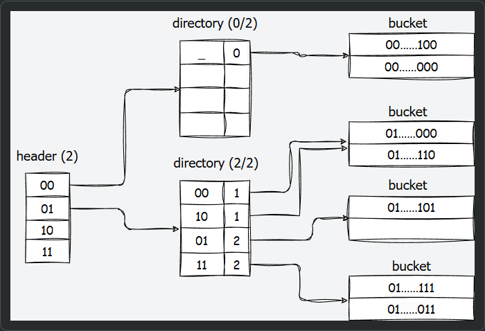
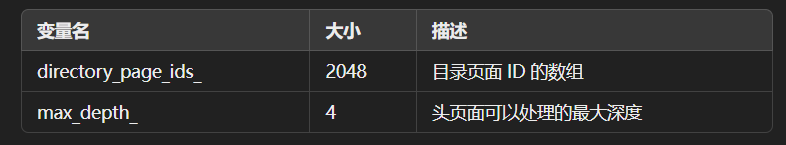
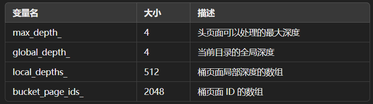
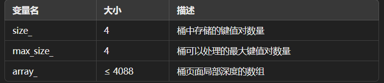
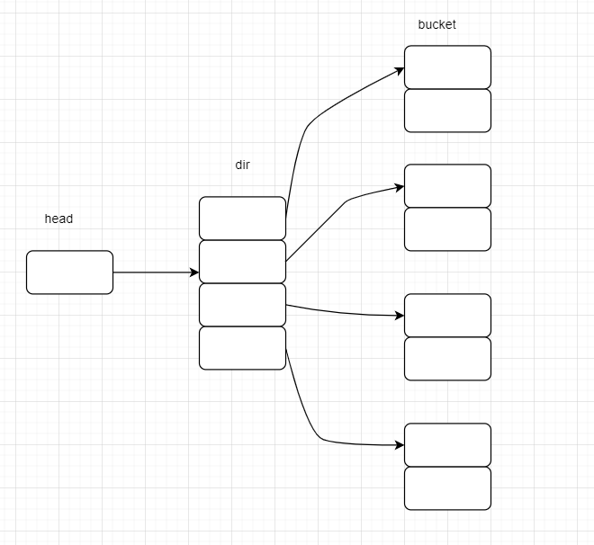
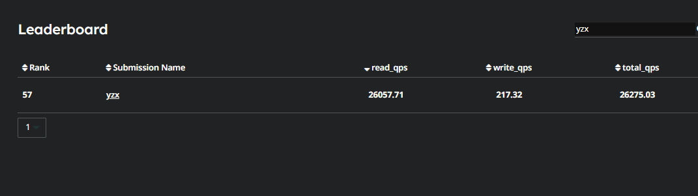

# project 2  Hash Index
（b+ 树 待看）
## 概述

在这个编程项目中，你将实现一个**基于磁盘的哈希索引**在你的数据库系统中。你将使用**一种可扩展哈希的变体**作为哈希方案。与课堂上教授的两级方案不同，我们在目录页面之上添加了一个不可调整大小的头页面，以便哈希表可以容纳更多值，并有可能实现更好的多线程性能。

以下图示展示了一个最大深度为2的可扩展哈希表，具有最大深度为2的目录页面和最多可容纳两个条目的桶页面。值被省略，而桶页面中显示的是键的哈希值，而不是键本身。



该索引提供快速的数据检索，无需在数据库表中搜索每一行，从而实现快速随机查找。你的实现应支持线程安全的搜索、插入和删除（包括扩展/收缩目录以及拆分/合并桶）。

你必须实现以下任务：
+ 读/写页面保护
+ 可扩展哈希表页面
+ 可扩展哈希实现
+ 并发控制

你的工作依赖于你在项目1中实现的缓冲池。如果你的项目1解决方案不正确，必须修复它以成功完成此项目。我们将不提供先前编程项目的解决方案。

## Task #1 - Read/Write Page Guards
**缓冲池管理器中的页保护机制**
在缓冲池管理器中，FetchPage 和 NewPage 函数返回的都是已经被固定（pinned）的页的指针。固定机制确保这些页在没有更多的读写操作之前不会被驱逐出缓冲池。为了表示某个页在内存中不再需要，程序员必须手动调用 UnpinPage。

另一方面，如果程序员忘记调用 UnpinPage，该页将永远不会从缓冲池中被驱逐。由于缓冲池实际上操作的帧数量变少，页面在磁盘与缓冲池之间的交换会增加。这不仅会影响性能，还会使得该错误难以被发现。

**实现 BasicPageGuard**
你将实现 BasicPageGuard，它存储指向 BufferPoolManager 和 Page 对象的指针。页保护器确保在 BasicPageGuard 对象超出作用域时，自动调用对应 Page 对象的 UnpinPage。需要注意的是，BasicPageGuard 仍应提供一个方法，允许程序员手动取消固定页。

由于 BasicPageGuard 隐藏了底层的 Page 指针，它还可以提供只读/写数据的 API，这些 API 提供编译时检查，以确保 is_dirty 标志在每种使用情况下都被正确设置

**并发控制**
在本项目及未来的项目中，多个线程将同时读取和写入相同的页，因此需要使用**读写锁**（reader-writer latches）来确保数据的正确性。请注意，在 Page 类中，已经有相关的锁定方法用于此目的。类似于取消固定页，程序员可能会忘记在使用后解锁页。为了解决这个问题，你将实现 ReadPageGuard 和 WritePageGuard，它们会在超出作用域时自动解锁页。

**要实现的函数**
你需要为所有的 BasicPageGuard、ReadPageGuard 和 WritePageGuard 实现以下函数：
+ PageGuard(PageGuard &&that);移动构造函数
+ operator=(PageGuard &&that);移动赋值运算符：
+ Drop(); // 取消固定和/或解锁
+ ~PageGuard();析构函数：

你还需要为 BasicPageGuard 实现以下升级函数。这些函数需要确保在升级过程中，受保护的页不会被缓冲池驱逐。
+ UpgradeRead(); // 升级为 ReadPageGuard
+ UpgradeWrite(); // 升级为 WritePageGuard

利用新的页保护器，在 BufferPoolManager 中实现以下封装函数：
+ FetchPageBasic(page_id_t page_id)
+ FetchPageRead(page_id_t page_id)
+ FetchPageWrite(page_id_t page_id)
+ NewPageGuarded(page_id_t *page_id)

请参考头文件（buffer_pool_manager.h 和 page_guard.h）以获取更详细的规格说明和文档。

### 解

其实就是实现 [RALL](../../C++语法/模式/RALL.md) 机制，像智能指针那样。然后完成 [移动构造函数](../../C++语法/侯捷课程/04新特性.md/12.移动构造函数.md) 和 移动赋值;

1. 移动构造函数：

+ 在移动构造函数中，我们将 that 的资源转移到新对象，并将 that 的成员变量设置为 nullptr 或默认值。
这样做可以确保 that 在移动后不会持有已转移的资源，从而避免资源泄露或后续使用时的错误。

```cpp
BasicPageGuard::BasicPageGuard(BasicPageGuard &&that) noexcept
    : bpm_(that.bpm_), page_(that.page_), is_dirty_(that.is_dirty_) {
    // 传递的右值引用，移动构造
    that.bpm_ = nullptr;
    that.page_ = nullptr;
    that.is_dirty_ = false;
}
```

2. 移动赋值运算符：

+ 在移动赋值运算符中，我们首先检查是否为自赋值（this != &that），如果不是自赋值，则释放当前对象持有的资源，并将 that 的资源转移到当前对象。之后，将 that 的成员变量设置为安全值，确保 that 在移动后处于安全状态。

```cpp
auto BasicPageGuard::operator=(BasicPageGuard &&that) noexcept -> BasicPageGuard & { 
    // 移动赋值,注意形参总是左值
    if(this != &that){
        Drop();
        bpm_ = that.bpm_;
        page_ = that.page_;
        is_dirty_ = that.is_dirty_;

        that.bpm_ = nullptr;
        that.page_ = nullptr;
        that.is_dirty_ = false;
    }
    return *this; 
}
```

3. 取消固定和析构

注释：

+ 删除页面保护应该清除所有内容(这样页面保护就不再有用了)，它应该告诉BPM我们已经完成了这个页面的使用，按照编写的规范。

```cpp
void BasicPageGuard::Drop() {
    if(!bpm_ && !page_){
        bpm_->UnpinPage(page_->GetPageId, is_dirty_);
    } 
    bpm_ = nullptr;
    page_ = nullptr;
}
BasicPageGuard::~BasicPageGuard(){
    Drop();
};  // NOLINT
```

4. BasicPageGuard 转换

之前分析 Page 这个类的时候，就已经知道里面用 shared_mutex 实现了一个读写锁配置，并且已经封装好了，这边直接调用即可。

注释：

+ 在升级过程中，受保护页面不会从缓冲池中被驱逐;调用此函数后，基本页面保护将失效。
所以转换后不能调用 Drop();

调用页面的读写锁，调用构造函数构造;

```cpp
auto BasicPageGuard::UpgradeRead() -> ReadPageGuard{
    // 读
    if(page_){
        page_->RLatch();
    }
    auto res = ReadPageGuard(bpm_, page_);
    bpm_ = nullptr;
    page_ = nullptr;
    return res;
}
auto BasicPageGuard::UpgradeWrite() -> WritePageGuard{
    // 写
    if(page_){
        page_->WLatch();
    }
    auto res = WritePageGuard(bpm_, page_);
    bpm_ = nullptr;
    page_ = nullptr;
    return res;   
}
```

5. ReadPageGuard 和 WritePageGuard

```cpp
ReadPageGuard::ReadPageGuard(ReadPageGuard &&that) noexcept {
    guard_ = std::move(that.guard_);
}

auto ReadPageGuard::operator=(ReadPageGuard &&that) noexcept -> ReadPageGuard & { 
    Drop();
    guard_ = std::move(that.guard_);
    return *this;
}

void ReadPageGuard::Drop() {
 // 这里要先释放锁，因为锁是由 page_维护的
 if (guard_.page_ != nullptr) {
    guard_.page_->RUnlatch();
  }
  guard_.Drop();
}

ReadPageGuard::~ReadPageGuard() {
    Drop();
}  // NOLINT


WritePageGuard::WritePageGuard(WritePageGuard &&that) noexcept {
    guard_ = std::move(that.guard_);
}

auto WritePageGuard::operator=(WritePageGuard &&that) noexcept -> WritePageGuard & { 
    Drop();
    guard_ = std::move(that.guard_);
    return *this;  
}

void WritePageGuard::Drop() {
 if (guard_.page_ != nullptr) {
    guard_.page_->WUnlatch();
  }
  guard_.is_dirty_ = true;
  guard_.Drop();
}

WritePageGuard::~WritePageGuard() {
    Drop();
}  // NOLINT
```

6. BufferPoolManager

NewPageGuarded
注释：
  功能应该与NewPage相同，除了返回指向页面的指针，而是返回一个BasicPageGuard结构。

```cpp
auto BufferPoolManager::NewPageGuarded(page_id_t *page_id) -> BasicPageGuard { 
    auto page = NewPage(page_id);
    return {this, page}; 
}
```

注释：
    功能应该与FetchPage相同，除了根据调用的函数返回一个守卫。如果调用FetchPageRead或FetchPageWrite，则期望
    返回的页已经分别有一个读锁存或写锁存。

```cpp
auto BufferPoolManager::FetchPageBasic(page_id_t page_id) -> BasicPageGuard { 
    auto page = FetchPage(page_id);
    return {this, page}; 
}

auto BufferPoolManager::FetchPageRead(page_id_t page_id) -> ReadPageGuard {
    auto page = FetchPage(page_id);
    if(page){
        page->RLatch();
    }
    return {this, page}; 
}

auto BufferPoolManager::FetchPageWrite(page_id_t page_id) -> WritePageGuard { 
    auto page = FetchPage(page_id);
    if(page){
        page->WLatch();
    }
    return {this, page}; 
}
```

## Task #2 - Extendible Hash Table Pages

注意：这里只需要实现各个层本身的功能即可，桶的分裂/合并和目录的增长/缩小，在task3完成！

你必须实现三个页面类来存储可扩展哈希表的数据。

**哈希表头页面**

哈希表头页面位于基于磁盘的可扩展哈希表的第一层，每个哈希表只有一个头页面的逻辑子指针（作。它存储指向目录页面为页面 ID）。可以将其视为一个静态的第一层目录页面。头页面具有以下字段：



请注意，虽然物理上页面的大小是有限制的，但应使用 max_depth_ 来确定 directory_page_ids 数组大小的上限。

你必须通过修改头文件（src/include/storage/page/extendible_htable_header_page.h）和相应的源文件（src/storage/page/extendible_htable_header_page.cpp）来实现可扩展哈希表的头页面。

**哈希表目录页面**

目录页面位于基于磁盘的可扩展哈希表的第二层。每个目录页面存储指向桶页面的逻辑子指针（作为页面 ID），以及处理桶映射和动态目录扩展与收缩的元数据。目录页面具有以下字段：



请注意，虽然物理上页面的大小是有限制的，但应使用 max_depth_ 来确定 bucket_page_ids_ 数组大小的上限。

你必须通过修改头文件（src/include/storage/page/extendible_htable_directory_page.h）和相应的源文件（src/storage/page/extendible_htable_directory_page.cpp）来实现可扩展哈希表的目录页面。

**哈希表桶页面**

桶页面位于基于磁盘的可扩展哈希表的第三层。它们实际存储键值对。桶页面具有以下字段：



请注意，虽然物理上页面的大小是有限制的，但应使用 max_size_ 来确定 array_ 键值对数组大小的上限。

你必须通过修改头文件（src/include/storage/page/extendible_htable_bucket_page.h）和相应的源文件（src/storage/page/extendible_htable_bucket_page.cpp）来实现可扩展哈希表的桶页面。

每个可扩展哈希表头/目录/桶页面对应于通过缓冲池获取的内存页面的内容（即 data_ 部分）。每次读取或写入页面时，必须先从缓冲池中获取页面（使用其唯一的 page_id），将其重新解释为相应类型，并在读取或写入后取消固定页面。我们强烈建议你利用在任务 #1 中实现的 PageGuard API 来实现这一点。

### 解
这里很像操作系统中的 二级页表。
真正存储的在第三层；

哈希表头页面: 
  page_id_t directory_page_ids_[HTABLE_HEADER_ARRAY_SIZE];
  uint32_t max_depth_;

参考第一张图，这个directory_page_ids_的元素指向第二层的一个 directory 页表，使用哈希值的最高有效 max_depth_ 位进行索引。如位深度为2，32位哈希值为0x5f129982，最高有效位前2位为01，则会被索引到01对应的DirectoryPage上。

```cpp
void ExtendibleHTableHeaderPage::Init(uint32_t max_depth) {
  //   throw NotImplementedException("ExtendibleHTableHeaderPage is not implemented");
  // 初始化
  max_depth_ = max_depth;
  std::fill(directory_page_ids_, directory_page_ids_ + HTABLE_HEADER_ARRAY_SIZE, INVALID_PAGE_ID);
}

auto ExtendibleHTableHeaderPage::HashToDirectoryIndex(uint32_t hash) const -> uint32_t {
  // 获取索引，根据 hash的最高max_depth_位进行索引。

  if (max_depth_ == 0) {
    return 0;  // 如果 max_depth_ 为 0，直接返回 hash
  }
  return hash >> (sizeof(uint32_t) * 8 - max_depth_);  // 否则进行位移操作
}

auto ExtendibleHTableHeaderPage::GetDirectoryPageId(uint32_t directory_idx) const -> uint32_t {
  // 获取directory，不能超过最大范围
  // [0, MaxSize())都是可以访问的
  if (directory_idx >= MaxSize()) {
    return INVALID_PAGE_ID;
  }
  return directory_page_ids_[directory_idx];
}

void ExtendibleHTableHeaderPage::SetDirectoryPageId(uint32_t directory_idx, page_id_t directory_page_id) {
  // 设置索引
  if (directory_idx >= MaxSize()) {
    throw std::out_of_range("Head index out of range");
  }
  directory_page_ids_[directory_idx] = directory_page_id;
}

auto ExtendibleHTableHeaderPage::MaxSize() const -> uint32_t { return 1 << max_depth_; }
```

哈希表目录页面：
  uint32_t max_depth_;
  uint32_t global_depth_;
  uint8_t local_depths_[HTABLE_DIRECTORY_ARRAY_SIZE];
  page_id_t bucket_page_ids_[HTABLE_DIRECTORY_ARRAY_SIZE];

这里的 bucket_page_ids_ 指向桶的位置；
还维护一个local_depths_数组，表示每一个桶的局部深度；
+ Global Depth：假设global depth为n，那么当前的directory必定有 2^n
 个entry。例如，当前n=2，那么就有4个entry，n=3就有8个entry。同时，给定一个key，需要用global depth取出这个key的低n位的二进制值。例如，一个key的二进制是10111，如果global depth是3，通过IndexOf(key)函数，得到返回值的二进制值是111，即为7。这个值用来索引directory[111]位置的bucket。
+ Local Depth：local depth指的是（假设local depth为n），在当前的bucket之下，每个元素的key的低n位都是相同的。比如当前bucket的local=1，global=2， bucket_page_ids_中 00 和 01都指向这个桶


```cpp
void ExtendibleHTableDirectoryPage::Init(uint32_t max_depth) {
  //   throw NotImplementedException("ExtendibleHTableDirectoryPage is not implemented");
  max_depth_ = max_depth;
  global_depth_ = 0;
  std::fill(local_depths_, local_depths_ + HTABLE_DIRECTORY_ARRAY_SIZE, 0);
  std::fill(bucket_page_ids_, bucket_page_ids_ + HTABLE_DIRECTORY_ARRAY_SIZE, INVALID_PAGE_ID);
}

auto ExtendibleHTableDirectoryPage::HashToBucketIndex(uint32_t hash) const -> uint32_t {
  // 注意，这里使用的是最低 global_depth_位
  // uint32_t mask = (1u << global_depth_) - 1;
  return hash & GetGlobalDepthMask();
}

auto ExtendibleHTableDirectoryPage::GetBucketPageId(uint32_t bucket_idx) const -> page_id_t {
  if (bucket_idx >= Size()) {
    throw std::out_of_range("Bucket index out of range");
  }
  return bucket_page_ids_[bucket_idx];
}

void ExtendibleHTableDirectoryPage::SetBucketPageId(uint32_t bucket_idx, page_id_t bucket_page_id) {
  // throw NotImplementedException("ExtendibleHTableDirectoryPage is not implemented");
  if (bucket_idx >= Size()) {
    throw std::out_of_range("Bucket index out of range");
  }
  bucket_page_ids_[bucket_idx] = bucket_page_id;
}

auto ExtendibleHTableDirectoryPage::GetSplitImageIndex(uint32_t bucket_idx) const -> uint32_t {
  // 获取某个 bucket_idx 所对应的下一个可分裂 bucket_idx
  // 假如需要分裂桶，那么此时 global_depth_先加1，然后获取当前桶应对应的索引；
  // 00 -> 100, 000;一个是前面加上0，所以指向不变；另一个前面加1，变成 100，返回就是这个值
  return bucket_idx + (1 << (global_depth_ - 1));
}

auto ExtendibleHTableDirectoryPage::GetGlobalDepthMask() const -> uint32_t { return (1U << global_depth_) - 1; }

auto ExtendibleHTableDirectoryPage::GetLocalDepthMask(uint32_t bucket_idx) const -> uint32_t {
  if (bucket_idx >= Size()) {
    throw std::out_of_range("Bucket index out of range");
  }
  auto depth = local_depths_[bucket_idx];
  return (1U << depth) - 1;
}

auto ExtendibleHTableDirectoryPage::GetGlobalDepth() const -> uint32_t { return global_depth_; }

auto ExtendibleHTableDirectoryPage::GetMaxDepth() const -> uint32_t { return max_depth_; }

void ExtendibleHTableDirectoryPage::IncrGlobalDepth() {
  for (uint32_t i = 0; i < Size(); ++i) {
    local_depths_[i + (1U << global_depth_)] = local_depths_[i];
    bucket_page_ids_[i + (1U << global_depth_)] = bucket_page_ids_[i];
  }
  global_depth_++;
}

void ExtendibleHTableDirectoryPage::DecrGlobalDepth() {
  //  global_depth减一，不需要做改变，因为不能访问超出 Size()
  if (global_depth_ <= 0) {
    return;
  }
  global_depth_--;
}

auto ExtendibleHTableDirectoryPage::CanShrink() -> bool {
  if (global_depth_ <= 0) {
    return false;
  }
  // global_depth_不能小于local_depths_，否则则会出现同一索引指向两个桶
  for (uint32_t i = 0; i < Size(); ++i) {
    if (local_depths_[i] == global_depth_) {
      return false;
    }
  }
  return true;
}

auto ExtendibleHTableDirectoryPage::Size() const -> uint32_t { return 1 << global_depth_; }

auto ExtendibleHTableDirectoryPage::MaxSize() const -> uint32_t { return 1 << max_depth_; }

auto ExtendibleHTableDirectoryPage::GetLocalDepth(uint32_t bucket_idx) const -> uint32_t {
  return local_depths_[bucket_idx];
}

void ExtendibleHTableDirectoryPage::SetLocalDepth(uint32_t bucket_idx, uint8_t local_depth) {
  local_depths_[bucket_idx] = local_depth;
}

void ExtendibleHTableDirectoryPage::IncrLocalDepth(uint32_t bucket_idx) {
  if (local_depths_[bucket_idx] < global_depth_) {
    ++local_depths_[bucket_idx];
  }
}

void ExtendibleHTableDirectoryPage::DecrLocalDepth(uint32_t bucket_idx) {
  if (local_depths_[bucket_idx] > 0) {
    --local_depths_[bucket_idx];
  }
}
```

哈希表桶页面
  // 已经存储的数量
  uint32_t size_;
  // 最大存储个数
  uint32_t max_size_;
  // key-val
  MappingType array_[HTableBucketArraySize(sizeof(MappingType))];

关于插入，当桶满的时候，那么这个桶就需要分成两个桶，
比如当前桶的local=2，桶的索引为10,当前桶已经满了，当我们想要插入hash(c)=10100时，这个时候就需要把当前桶分裂，
当前：10 ->101 100两个桶，此时两个桶的local=3；

```cpp
void ExtendibleHTableBucketPage<K, V, KC>::Init(uint32_t max_size) {
  // throw NotImplementedException("ExtendibleHTableBucketPage not implemented");
  max_size_ = max_size;
  size_ = 0;
}

template <typename K, typename V, typename KC>
auto ExtendibleHTableBucketPage<K, V, KC>::Lookup(const K &key, V &value, const KC &cmp) const -> bool {
  for (uint32_t i = 0; i < Size(); ++i) {
    if (cmp(array_[i].first, key) == 0) {
      value = array_[i].second;
      return true;
    }
  }
  return false;
}

template <typename K, typename V, typename KC>
auto ExtendibleHTableBucketPage<K, V, KC>::Insert(const K &key, const V &value, const KC &cmp) -> bool {
  if (IsFull()) {
    return false;
  }
  for (uint32_t i = 0; i < size_; ++i) {
    if (cmp(array_[i].first, key) == 0) {
      return false;
    }
  }
  array_[size_++] = std::make_pair(key, value);
  return true;
}

template <typename K, typename V, typename KC>
auto ExtendibleHTableBucketPage<K, V, KC>::Remove(const K &key, const KC &cmp) -> bool {
  if (IsEmpty()) {
    return false;
  }
  for (uint32_t i = 0; i < size_; ++i) {
    if (cmp(array_[i].first, key) == 0) {
      for (uint32_t j = i + 1; j < size_; ++j) {
        array_[j - 1] = array_[j];
      }
      size_--;
      return true;
    }
  }
  return false;
}

template <typename K, typename V, typename KC>
void ExtendibleHTableBucketPage<K, V, KC>::RemoveAt(uint32_t bucket_idx) {
  // throw NotImplementedException("ExtendibleHTableBucketPage not implemented");
  for (uint32_t i = bucket_idx; i <= size_; ++i) {
    array_[i] = array_[i + 1];
  }
  size_--;
}

template <typename K, typename V, typename KC>
auto ExtendibleHTableBucketPage<K, V, KC>::KeyAt(uint32_t bucket_idx) const -> K {
  return array_[bucket_idx].first;
}

template <typename K, typename V, typename KC>
auto ExtendibleHTableBucketPage<K, V, KC>::ValueAt(uint32_t bucket_idx) const -> V {
  return array_[bucket_idx].second;
}

template <typename K, typename V, typename KC>
auto ExtendibleHTableBucketPage<K, V, KC>::EntryAt(uint32_t bucket_idx) const -> const std::pair<K, V> & {
  return array_[bucket_idx];
}

template <typename K, typename V, typename KC>
auto ExtendibleHTableBucketPage<K, V, KC>::Size() const -> uint32_t {
  return size_;
}

template <typename K, typename V, typename KC>
auto ExtendibleHTableBucketPage<K, V, KC>::IsFull() const -> bool {
  return size_ == max_size_;
}

template <typename K, typename V, typename KC>
auto ExtendibleHTableBucketPage<K, V, KC>::IsEmpty() const -> bool {
  return size_ == 0;
}
```

## Task #3 - Extendible Hashing Implementation 可扩展哈希表的实现
你的实现需要支持插入、单点查找和删除操作。可扩展哈希表的头文件和cpp文件中已经实现了或记录了许多辅助函数。你唯一严格的API要求是遵循Insert、GetValue和Remove函数。你也必须保留VerifyIntegrity函数不变。请自由设计并实现你认为合适的其他附加函数。

在本学期中，哈希表只支持唯一键。这意味着如果用户尝试插入重复的键，则哈希表应返回false

注意：你应该使用你在任务#2中实现的页面类来存储键值对以及维护哈希表的元数据（页面ID，全局/局部深度）。例如，你不应该使用内存中的数据结构如std::unordered_map来模拟哈希表。

可扩展哈希表参数化了任意的键类型、值类型和键比较器类型。

模板声明如下：

```cpp
template <typename KeyType,
          typename ValueType,
          typename KeyComparator>
```
类型参数为：

KeyType: 指定索引中每个键的类型。实际上这将是一个GenericKey。一个GenericKey的实际大小会有所不同，并且取决于索引属性的类型而由其自己的模板参数指定。
ValueType: 指定索引中每个值的类型。实际上，这将是一个64位的RID。
KeyComparator: 用于比较两个KeyType实例是否小于、大于或等于对方的类。这些将在KeyType实现文件中包含。

注意：我们的哈希表函数也接受一个Transaction*类型的参数，默认值为nullptr。这是为了项目4如果你想要实现在并发控制中的并发索引查询准备的。通常在这个项目中你不需要使用它。

你必须通过修改其头文件（src/include/container/disk/hash/disk_extendible_hash_table.h）和对应的源文件（src/container/disk/hash/disk_extendible_hash_table.cpp）来实现可扩展哈希表的桶页面。

这个项目要求你实现桶的分裂/合并和目录的增长/缩小。以下子节提供了关于实现细节的规范。

**空表**
当你第一次创建一个空的哈希表时，它应该只包含（唯一的）头部页面。目录页面和桶页面应该按需创建。

**头部索引**
你需要使用最显著的比特位来进行头部页面的directory_page_ids_数组的索引。这包括获取键的哈希值，并与头部页面的深度进行位操作。头部页面的深度不会改变。

**目录索引**
你需要使用最不显著的比特位来进行目录页面的bucket_page_ids_数组的索引。这包括获取键的哈希值，并与当前目录页面的深度进行位操作。

**桶分裂**
如果桶没有空间进行插入，则必须进行分裂。理论上来说，一旦桶满了就可以立即分裂，如果你觉得这样更容易的话。然而，参考解决方案**仅在插入会导致页面溢出的情况下才进行分裂**。因此，你可能会发现提供的API更适合这种方法。一如既往，你可以根据需要调整自己的内部API。

**桶合并**
**当桶变为空时必须尝试合并**。可以通过检查桶及其分裂图像的占用情况来更积极地合并，但是这些昂贵的检查和额外的合并可能会增加冲突。

为了保持相对简单，我们提供以下合并规则：

+ 只有空桶可以合并。
+ **桶只能与其分裂图像合并**，如果它们的分裂图像具有相同的局部深度。
+ 如果合并后的桶的新分裂图像是空的，**你应该递归地继续合并。**

如果你对“分裂图像”感到困惑，请回顾算法和代码文档。这个概念自然而然就会出现。

**目录增长**
对于哈希表的这一部分没有花哨的规则。你要么增长目录，要么不增长。

**目录缩小**
只有当每个桶的局部深度严格小于目录的全局深度时，才能缩小目录。

### 解
通过task2的测试可以知道，不管是header还是directory和bucket，都是用页来保存数据的，首先创建一个新页，然后把页的数据(page->data)转化成header_page等，然后就可以对这个数操作了。其实就是把页中的data拿出来重新指向，然后处理。

1. 构造函数
刚开始只分配一个头部页面，然后初始化即可
```cpp
template <typename K, typename V, typename KC>
DiskExtendibleHashTable<K, V, KC>::DiskExtendibleHashTable(const std::string &name, BufferPoolManager *bpm,
                                                           const KC &cmp, const HashFunction<K> &hash_fn,
                                                           uint32_t header_max_depth, uint32_t directory_max_depth,
                                                           uint32_t bucket_max_size)
    : bpm_(bpm),
      cmp_(cmp),
      hash_fn_(std::move(hash_fn)),
      header_max_depth_(header_max_depth),
      directory_max_depth_(directory_max_depth),
      bucket_max_size_(bucket_max_size) {
  // 获取一个头部页面,初始化
  index_name_ = name;
  BasicPageGuard header_guard = bpm->NewPageGuarded(&header_page_id_);
  auto header_page = header_guard.AsMut<ExtendibleHTableHeaderPage>();
  header_page->Init(header_max_depth);
  // auto directory_page = directory_guard.AsMut<ExtendibleHTableHeaderPage>();
}
```

2. GetValue
我们知道这个可扩展哈希表有三层，所以我们要一层一层的刨析，而且只是读取；
```cpp
template <typename K, typename V, typename KC>
auto DiskExtendibleHashTable<K, V, KC>::GetValue(const K &key, std::vector<V> *result, Transaction *transaction) const
    -> bool {
  // 得到对应的哈希值
  auto hash = Hash(key);
  // 拿到这个header页,从header页中拿到directory页面id
  auto header_guard = bpm_->FetchPageRead(header_page_id_);
  auto header_page = header_guard.As<ExtendibleHTableHeaderPage>();
  auto directory_index = header_page->HashToDirectoryIndex(hash);
  page_id_t directory_page_id = header_page->GetDirectoryPageId(directory_index);
  if (directory_page_id == INVALID_PAGE_ID) {  // 如果没有找到说明不存在
    return false;
  }
  // 从directory中 拿到bucket  page id
  auto directory_guard = bpm_->FetchPageRead(directory_page_id);
  auto directory_page = directory_guard.As<ExtendibleHTableDirectoryPage>();
  auto bucket_index = directory_page->HashToBucketIndex(hash);
  page_id_t bucket_page_id = directory_page->GetBucketPageId(bucket_index);
  if (bucket_page_id == INVALID_PAGE_ID) {
    return false;
  }
  // 读取bucket 页面
  ReadPageGuard bucket_guard = bpm_->FetchPageRead(bucket_page_id);
  auto bucket_page = bucket_guard.As<ExtendibleHTableBucketPage<K, V, KC>>();

  V value;
  if (bucket_page->Lookup(key, value, cmp_)) {
    result->emplace_back(value);
    return true;
  }
  return false;
}
```

3. Insert
关于插入：
  1. 如果当前桶不满，直接插入
  2. 如果当前桶已满：
   + 如果当前桶的深度小于globel深度，则分裂桶，桶的depth+1，并把原来桶的数据重新分配到两个桶中，最后插入pair
   + 如果当前桶的深度等于globel深度，则需要增加目录globel，然后分裂桶，重新映射

注意，不能在insert中递归调用，每次获取的页都是写页，递归的时候会尝试再次调用，这样就会产生死锁。索引在调用前，记得释放锁。

如果headr页中没有我们要插入对应的 directory,我们就调用辅助函数 InsertToNewDirectory 实现
```cpp
template <typename K, typename V, typename KC>
auto DiskExtendibleHashTable<K, V, KC>::InsertToNewDirectory(ExtendibleHTableHeaderPage *header, uint32_t directory_idx,
                                                             uint32_t hash, const K &key, const V &value) -> bool {
  // 在header中directory_idx 插入一个新的Directory page
  page_id_t directory_page_id = INVALID_PAGE_ID;
  auto directory_guard = bpm_->NewPageGuarded(&directory_page_id).UpgradeWrite();
  auto directory_page = directory_guard.AsMut<ExtendibleHTableDirectoryPage>();
  directory_page->Init(directory_max_depth_);
  header->SetDirectoryPageId(directory_idx, directory_page_id);
  // 更新桶
  auto bucket_index = directory_page->HashToBucketIndex(hash);
  return InsertToNewBucket(directory_page, bucket_index, key, value);
}
```
```CPP
template <typename K, typename V, typename KC>
auto DiskExtendibleHashTable<K, V, KC>::InsertToNewBucket(ExtendibleHTableDirectoryPage *directory, uint32_t bucket_idx,
                                                          const K &key, const V &value) -> bool {
  // 在Directory中bucket_idx 插入一个pair(key,value)
  page_id_t bucket_page_id = INVALID_PAGE_ID;
  // 用写保护锁
  auto bucket_guard = bpm_->NewPageGuarded(&bucket_page_id).UpgradeWrite();
  auto bucket_page = bucket_guard.AsMut<ExtendibleHTableBucketPage<K, V, KC>>();
  bucket_page->Init(bucket_max_size_);  // 初始化
  directory->SetBucketPageId(bucket_idx, bucket_page_id);
  // 设置bucket,这里一定会成功，因为是此时bucket是空的

  return bucket_page->Insert(key, value, cmp_);
}
```
+ 1. 如果当前桶的深度小于globel深度，则分裂桶，桶的depth+1，并把原来桶的数据重新分配到两个桶中，最后插入pair
+ 2. 如果当前桶的深度等于globel深度，则需要增加目录globel，然后分裂桶，重新映射
当桶满的时候，2增加globel后，就转化为1的情况了，后面只需分裂桶然后重新指向就行了。
```cpp
template <typename K, typename V, typename KC>
auto DiskExtendibleHashTable<K, V, KC>::Insert(const K &key, const V &value, Transaction *transaction) -> bool {
  // 插入 pair到bucket中
  auto hash = Hash(key);
  // 拿到这个header页,从header页中拿到directory页面id
  auto header_guard = bpm_->FetchPageWrite(header_page_id_);
  auto header_page = header_guard.AsMut<ExtendibleHTableHeaderPage>();
  uint32_t directory_index = header_page->HashToDirectoryIndex(hash);
  page_id_t directory_page_id = header_page->GetDirectoryPageId(directory_index);

  if (directory_page_id == INVALID_PAGE_ID) {
    // 如果没有此dir，则插入一个新的dir
    return InsertToNewDirectory(header_page, directory_index, hash, key, value);
  }
  // 如果此时有dir,拿到bucket  page id
  header_guard.Drop();
  auto directory_guard = bpm_->FetchPageWrite(directory_page_id);
  auto directory_page = directory_guard.AsMut<ExtendibleHTableDirectoryPage>();
  auto bucket_index = directory_page->HashToBucketIndex(hash);

  page_id_t bucket_page_id = directory_page->GetBucketPageId(bucket_index);
  if (bucket_page_id == INVALID_PAGE_ID) {
    // 如果此时没有这个桶，则插入
    return InsertToNewBucket(directory_page, bucket_index, key, value);
  }
  // 如果找到桶了，读取bucket 页面
  auto bucket_guard = bpm_->FetchPageWrite(bucket_page_id);
  auto bucket_page = bucket_guard.AsMut<ExtendibleHTableBucketPage<K, V, KC>>();
  // 插入会有以下情况
  // 1. 已经存在这个键值，则不能插入此时需要返回false
  // 2. 桶已经满了，不能插入，此时需要增长目录
  V val;
  // 1. 如果原来就已经存在这个键值了，就不能插入了
  if (bucket_page->Lookup(key, val, cmp_)) {
    return false;
  }
  // 2.如果不满则插入
  if (!bucket_page->IsFull()) {
    return bucket_page->Insert(key, value, cmp_);
  }

  // ************

  // 此时说明桶已经满了,这时有两种情况
  // 1. local_depths<global_depth,这个时候两个dir指向一个桶，比如： 00(1),10(1)->bucket(0)
  // 此时，需要新建一个bucket然后使第二个指向这个桶
  // 2. local_depths==global_depth，此时就需要增加目录了
  if (directory_page->GetLocalDepth(bucket_index) == directory_page->GetGlobalDepth()) {
    // 情况2，先增加global
    if (directory_page->GetGlobalDepth() >= directory_page->GetMaxDepth()) {
      return false;
    }
    directory_page->IncrGlobalDepth();  // 此时已经更新了depth和page
  }
  // 此时两个桶都指向一个桶，需要进行分离

  // 分裂桶，桶的depth+1，并把原来桶的数据重新分配到两个桶中，最后插入pair
  // 创建一个新桶
  page_id_t split_bucket_page_id;
  auto split_bucket_guard = bpm_->NewPageGuarded(&split_bucket_page_id).UpgradeWrite();
  if (split_bucket_page_id == INVALID_PAGE_ID) {
    return false;
  }
  auto split_bucket_page = split_bucket_guard.AsMut<ExtendibleHTableBucketPage<K, V, KC>>();
  split_bucket_page->Init(bucket_max_size_);
  // 当前桶分裂的索引指向新的桶,分配索引，并更新depth
  uint32_t split_bucket_index = directory_page->GetSplitImageIndex(bucket_index);
  uint8_t new_local_depth = directory_page->GetLocalDepth(bucket_index) + 1;  // 深度都加1
  directory_page->SetLocalDepth(split_bucket_index, new_local_depth);
  directory_page->SetLocalDepth(bucket_index, new_local_depth);
  directory_page->SetBucketPageId(split_bucket_index, split_bucket_page_id);
  // 此时，局部深度已经增加，且split_bucket_index对应新桶的索引，进行目录更新
  // 将原来桶的数据重新分配到两个桶中,
  // 把原始桶中的数据全部copy到entries中
  int size = bucket_page->Size();
  std::list<std::pair<K, V>> entries;
  for (int i = 0; i < size; ++i) {
    entries.emplace_back(bucket_page->EntryAt(i));
  }
  // 原来的桶，重新初始化
  bucket_page->Init(bucket_max_size_);
  for (const auto &entry : entries) {
    uint32_t index = directory_page->HashToBucketIndex(Hash(entry.first));
    page_id_t page_id = directory_page->GetBucketPageId(index);
    if (page_id == bucket_page_id) {
      bucket_page->Insert(entry.first, entry.second, cmp_);
    } else {
      split_bucket_page->Insert(entry.first, entry.second, cmp_);
    }
  }
  // 此时就有位置了，最后插入pair
  
  directory_guard.Drop();
  split_bucket_guard.Drop();
  bucket_guard.Drop();
  return Insert(key, value, transaction);
}
```

```cpp
template <typename K, typename V, typename KC>
auto DiskExtendibleHashTable<K, V, KC>::Remove(const K &key, Transaction *transaction) -> bool {
  uint32_t hash = Hash(key);
  WritePageGuard header_guard = bpm_->FetchPageWrite(header_page_id_);
  auto header_page = header_guard.AsMut<ExtendibleHTableHeaderPage>();
  uint32_t directory_index = header_page->HashToDirectoryIndex(hash);
  page_id_t directory_page_id = header_page->GetDirectoryPageId(directory_index);
  if (directory_page_id == INVALID_PAGE_ID) {
    return false;
  }
  header_guard.Drop();

  WritePageGuard directory_guard = bpm_->FetchPageWrite(directory_page_id);
  auto directory_page = directory_guard.AsMut<ExtendibleHTableDirectoryPage>();
  uint32_t bucket_index = directory_page->HashToBucketIndex(hash);
  page_id_t bucket_page_id = directory_page->GetBucketPageId(bucket_index);
  if (bucket_page_id == INVALID_PAGE_ID) {
    return false;
  }

  WritePageGuard bucket_guard = bpm_->FetchPageWrite(bucket_page_id);
  auto bucket_page = bucket_guard.AsMut<ExtendibleHTableBucketPage<K, V, KC>>();
  bool res = bucket_page->Remove(key, cmp_);
  bucket_guard.Drop();
  if (!res) {
    return false;
  }
  // 检查是否要合并
  auto check_page_id = bucket_page_id;
  ReadPageGuard check_guard = bpm_->FetchPageRead(check_page_id);
  auto check_page = check_guard.As<ExtendibleHTableBucketPage<K, V, KC>>();
  uint32_t local_depth = directory_page->GetLocalDepth(bucket_index);
  uint32_t global_depth = directory_page->GetGlobalDepth();
  // 有可能多次合并
  while (local_depth > 0) {
    // 获取要合并的桶的索引,最高位取反即可
    uint32_t convert_mask = 1 << (local_depth - 1);
    uint32_t merge_bucket_index = bucket_index ^ convert_mask;
    // 分裂桶的深度
    uint32_t merge_local_depth = directory_page->GetLocalDepth(merge_bucket_index);
    page_id_t merge_page_id = directory_page->GetBucketPageId(merge_bucket_index);
    ReadPageGuard merge_guard = bpm_->FetchPageRead(merge_page_id);
    auto merge_page = merge_guard.As<ExtendibleHTableBucketPage<K, V, KC>>();
    if (merge_local_depth != local_depth || (!check_page->IsEmpty() && !merge_page->IsEmpty())) {
      break;
    }
    if (check_page->IsEmpty()) {
      bpm_->DeletePage(check_page_id);
      check_page = merge_page;
      check_page_id = merge_page_id;
      check_guard = std::move(merge_guard);
    } else {
      bpm_->DeletePage(merge_page_id);
    }
    // 重新指向
    directory_page->DecrLocalDepth(bucket_index);
    local_depth = directory_page->GetLocalDepth(bucket_index);
    
    uint32_t local_depth_mask = directory_page->GetLocalDepthMask(bucket_index);
    uint32_t mask_idx = bucket_index & local_depth_mask;
    uint32_t update_count = 1 << (global_depth - local_depth);
    for (uint32_t i = 0; i < update_count; ++i) {
      uint32_t tmp_idx = (i << local_depth) + mask_idx;
      UpdateDirectoryMapping(directory_page, tmp_idx, check_page_id, local_depth, 0);
    }
  }
  while (directory_page->CanShrink()) {
    directory_page->DecrGlobalDepth();
  }
  return true;
}

```

## Task #4 - Concurrency Control 并发控制
最后，修改你的可扩展哈希表实现，使其能够安全地支持多线程并发操作。遍历索引的线程应根据需要获取哈希表页面上的锁以确保安全的并发操作，并应在确定释放父页面上的锁是安全的情况下尽快释放锁。

我们建议你通过使用FetchPageWrite或FetchPageRead缓冲池API来完成此任务，具体取决于你是想以读取还是写入权限访问页面。然后，修改你的实现，在必要时获取和释放读取和写入锁，以实现锁蟹步算法（Latch Crabbing Algorithm）。

注意：在一个线程中不应两次获取相同的读锁。这可能导致死锁。

注意：你应该仔细设计锁机制。在整个哈希表上始终持有全局锁可能不是一个好主意。助教们将会手动审查你的实现，不良的锁设计会导致扣分。

# 调试修改

1. 注意：移位
对于 uint32_t 类型，当位移的数量超过其位宽时，实际上会取模。具体来说，对于 32 位的无符号整数，位移的位数会通过 位移量 % 32 来确定实际的位移量。所以实际上 1 >> 32 等效于 1 >> (32 % 32) = 1 >> 0，即没有进行位移，结果还是 1。
在task3测试中，创建一个(0,2,2)可以容纳8个pair的表,如下：


```cpp
auto ExtendibleHTableHeaderPage::HashToDirectoryIndex(uint32_t hash) const -> uint32_t {
  // 获取索引，根据 hash的最高max_depth_位进行索引。
  if (max_depth_ == 0) {
    return 0;  // 如果 max_depth_ 为 0，直接返回 hash
  }
  return hash >> (sizeof(uint32_t) * 8 - max_depth_);  // 否则进行位移操作
}
```

2. 在GrowShrinkTest中这个的缓冲池容量只有3

在 Insert 和 Remove 过程中，如果一个 PageGuard 已经不需要再使用了，可以提前手动 Drop 而不是等离开作用域再进行析构。

还有好多，记不太清楚了，人都做麻了，就这样了。



