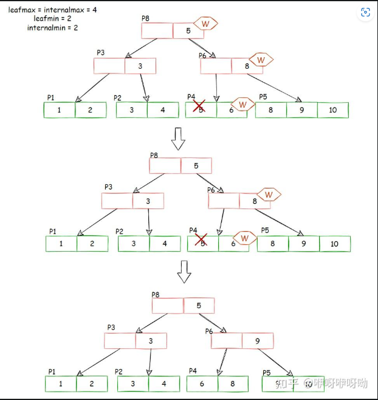

补充 b+树
https://zhuanlan.zhihu.com/p/580014163
## 概述
第二个编程项目是实现在你的数据库系统中的索引。索引负责快速检索数据，而无需遍历数据库表中的每一行记录，为快速随机查找和有序记录的有效访问提供了基础。

你需要实现B+树动态索引结构。它是一种平衡树，其中内部页指导搜索，而叶子页包含实际的数据条目。由于树结构会动态增长和缩小，因此你需要处理分裂和合并的逻辑。该项目包括以下任务，并设有两个检查点。

在开始此项目之前，请确保已从公共BusTub仓库拉取最新代码。你可以通过以下命令来完成：

```
git pull public master
```


任务 #1 - B+树页面
任务 #2 - B+树数据结构（插入、删除、点查询）


任务 #3 - 索引迭代器
任务 #4 - 并发索引

## 项目规范
与第一个项目一样，我们将为你提供包含你需要实现的API的骨架类。你不应该修改这些类中预定义函数的签名。如果你这样做了，将会破坏我们将用来评估你作业的测试代码，最终导致你无法获得项目的学分。如果某个类已经包含某些成员变量，你不应移除它们。但是，为了正确实现功能，你可以向这些类添加函数/成员变量。

B+树索引的正确性依赖于你对缓冲池实现的正确性，我们不会为之前的编程项目提供解决方案。由于第一个检查点与第二个检查点密切相关，在第二个检查点中你将在现有的B+树索引内实现索引抓取，因此我们传递了一个默认值为nullptr的参数transaction。对于检查点#1，你可以安全地忽略该参数；直到任务#4，你都不需要更改或调用与该参数相关的任何函数。

## Task #1 - B+Tree Pages

你需要实现三个Page类来存储B+树的数据。

+ B+Tree Parent Page
+ B+Tree Internal Page
+ B+Tree Leaf Page

#### B+树父级页面
这是内部页面和叶页面继承的父类。父级页面仅包含两个子类共享的信息。父级页面被划分为几个字段，如下表所示。

**B+树父级页面内容**
| 变量名 | 大小 | 描述 |
| --- | --- | --- |
| `page_type_` | 4 | 页面类型（内部或叶） |
| `lsn_` | 4 | 日志序列号（用于第四个项目） |
| `size_` | 4 | 页面中的键值对数量 |
| `max_size_` | 4 | 页面中键值对的最大数量 |
| `parent_page_id_` | 4 | 父页面ID |
| `page_id_` | 4 | 自身页面ID |

你必须在指定的文件中实现你的父级页面。只允许修改头文件（`src/include/storage/page/b_plus_tree_page.h`）及其对应的源文件（`src/storage/page/b_plus_tree_page.cpp`）。

### B+树内部页面
#### B+树内部页面
内部页面不存储任何真实数据，而是存储有序的**m个键条目和m+1个子指针**（即页面ID）。由于指针的数量不等于键的数量，第一个键被设置为无效，查找方法应该总是从第二个键开始。任何时候，每个内部页面**至少要有一半是满的**。在删除过程中，两个半满的页面可以合并成一个合法的页面，或者重新分配以避免合并；而在插入过程中，一个满的页面可以被拆分成两个。这是你在实现B+树时将做出的许多设计选择之一。

你必须在指定的文件中实现你的内部页面。只允许修改头文件（`src/include/storage/page/b_plus_tree_internal_page.h`）及其对应的源文件（`src/storage/page/b_plus_tree_internal_page.cpp`）。


> * Internal page format (keys are stored in increasing order):
> * | HEADER | KEY(1) + PAGE_ID(1) | KEY(2) + PAGE_ID(2) | ... | KEY(n) >+ PAGE_ID(n) |
> * 

### B+树叶页面
#### B+树叶页面
叶页面存储有序的m个键条目和m个值条目。在你的实现中，值应该是仅用于定位实际元组存储位置的64位记录ID，参见在`src/include/common/rid.h`下定义的RID类。叶页面对键值对数量有与内部页面相同的限制，并且应当遵循相同的合并、重新分配和拆分操作。

你必须在指定的文件中实现你的叶页面。只允许修改头文件（`src/include/storage/page/b_plus_tree_leaf_page.h`）及其对应的源文件（`src/storage/page/b_plus_tree_leaf_page.cpp`）。

**重要提示**：尽管叶页面和内部页面包含相同类型的键，它们可能有不同的值类型，因此叶页面和内部页面的最大容量可能会有所不同。

每个B+树的叶页面或内部页面对应于由缓冲池获取的内存页面的内容（即`data_`部分）。因此，每次尝试读取或写入叶页面或内部页面时，都需要首先使用其唯一的页面ID从缓冲池中获取页面，然后将其重新解释为叶页面或内部页面，并在任何读写操作后解除页面锁定。

### 解

#### 关于页的解释

抄自：https://zhuanlan.zhihu.com/p/580014163


其中，data_ 是实际存放 page 数据的地方，大小为 BUSTUB_PAGE_SIZE，为 4KB。其他的成员是 page 的 metadata。

B+树中的 tree oage 数据均存放在 page 的 data 成员中。

b_plus_tree_page 是另外两个 page 的父类，即 B+树中 tree page 的抽象。

```cpp
IndexPageType page_type_;   // leaf or internal. 4 Byte
lsn_t lsn_  // temporarily unused. 4 Byte
int size_;  // tree page data size(not in byte, in count). 4 Byte
int max_size_;  // tree page data max size(not in byte, in count). 4 Byte
page_id_t parent_page_id_; // 4 Byte
page_id_t page_id_; // 4 Byte
// 24 Byte in total
```

以上数据组成了 tree page 的 header。


对应 B+ 树中的内部节点。

> MappingType array_[1];

internal page 中没有新的 metadata，header 大小仍为 24B。它唯一的成员是这个怪怪的大小为 1 的数组。大小为 1 显然不合理，代表只能存放一个 KV 对。但又没法改变它的大小，难道要用 undefined behavior 来越界访问其后的地址？实际上差不多就是这个意思。但这不是 undefined behavior，是一种特殊的写法，叫做 flexible array。我也不知道怎么翻译。

简单来说就是，当你有一个类，这个类中有一个成员为数组。在用这个类初始化一个对象时，你不能确定该将这个数组的大小设置为多少，但知道这整个对象的大小是多少 byte，你就可以用到 flexible array。flexible array 必须是类中的最后一个成员，并且仅能有一个。在为对象分配内存时，flexible array 会自动填充，占用未被其他变量使用的内存。这样就可以确定自己的长度了。

例如有一个类 C：

```cpp
class C {
    int a; // 4 byte
    int array[1]; // unknown size
};
```

现在初始化一个 C 的对象，并为其分配了 24 byte 的内存。a 占了 4 byte 内存，那么 array 会尝试填充剩下的内存，大小变为 5。

实际上这就是 C++ 对象内存布局的一个简单的例子。因此 flexible array 为什么只能有一个且必须放在最后一个就很明显了，因为需要向后尝试填充。

此外，虽然成员在内存中的先后顺序和声明的顺序一致，但需要注意可能存在的内存对齐的问题。header 中的数据大小都为 4 byte，没有对齐问题。

到这里，这个大小为 1 的数组的作用就比较清楚了。利用 flexible array 的特性来自动填充 page data 4KB 减掉 header 24byte 后剩余的内存。剩下的这些内存用来存放 KV 对。


internal page 中，KV 对的 K 是能够比较大小的索引，V 是 page id，用来指向下一层的节点。Project 中要求，第一个 Key 为空。主要是因为在 internal page 中，n 个 key 可以将数轴划分为 n+1 个区域，也就对应着 n+1 个 value。实际上你也可以把最后一个 key 当作是空的，只要后续的处理自洽就可以了。


通过比较 key 的大小选中下一层的节点。实际上等号的位置也可以改变，总之，只要是合法的 B+ 树，即节点大小需要满足最大最小值的限制，各种实现细节都是自由的。

另外需要注意的是，internal page 中的 key 并不代表实际上的索引值，仅仅是作为一个向导，引导需要插入/删除/查询的 key 找到这个 key 真正所在的 leaf page。

B_PLUS_TREE_LEAF_PAGE

leaf page 和 internal page 的内存布局基本一样，只是 leaf page 多了一个成员变量 next_page_id，指向下一个 leaf page（用于 range scan）。因此 leaf page 的 header 大小为 28 Byte。

leaf page 的 KV 对中，K 是实际的索引，V 是 record id。record id 用于识别表中的某一条数据。leaf page 的 KV 对是一一对应的，不像 internal page 的 value 多一个。这里也可以看出来 Bustub 所有的 B+ 树索引，无论是主键索引还是二级索引都是非聚簇索引。

> 这里简单介绍一下聚簇索引、非聚簇索引，主键索引、二级索引（非主键索引）的区别。 在聚簇索引里，leaf page 的 value 为表中一条数据的某几个字段或所有字段，一定包含主键字段。而非聚簇索引 leaf page 的 value 是 record id，即指向一条数据的指针。 在使用聚簇索引时，主键索引的 leaf page 包含所有字段，二级索引的 leaf page 包含主键和索引字段。当使用主键查询时，查询到 leaf page 即可获得整条数据。当使用二级索引查询时，若查询字段包含在索引内，可以直接得到结果，但如果查询字段不包含在索引内，则需使用得到的主键字段在主键索引中再次查询，以得到所有的字段，进而得到需要查询的字段，这就是回表的过程。 在使用非聚簇索引时，无论是使用主键查询还是二级索引查询，最终得到的结果都是 record id，需要使用 record id 去查询真正对应的整条记录。 聚簇索引的优点是，整条记录直接存放在 leaf page，无需二次查询，且缓存命中率高，在使用主键查询时性能比较好。缺点则是二级索引可能需要回表，且由于整条数据存放在 leaf page，更新索引的代价很高，页分裂、合并等情况开销比较大。 非聚簇索引的优点是，由于 leaf page 仅存放 record id，更新的代价较低，二级索引的性能和主键索引几乎相同。缺点是查询时均需使用 record id 进行二次查询。


## Task #2 - B+Tree Data Structure

你的B+树索引应该只支持唯一的键。也就是说，当你试图将具有重复键的键值对插入索引时，不应该执行插入操作并返回false。你的B+树索引在删除导致某页面占用率低于阈值时，也必须正确执行合并或重新分配（教科书中称为‘合并’）。

对于检查点#1，你的B+树索引仅需支持插入（`Insert()`）、点查询（`GetValue()`）和删除（`Delete()`）。如果插入触发了拆分条件（插入后的键值对数量等于叶节点的`max_size`，或插入前的子节点数量等于内部节点的`max_size`），你应该正确执行拆分。

由于任何写操作都可能导致B+树索引的`root_page_id`发生变化，因此更新头部页面（`src/include/storage/page/header_page.h`）中的`root_page_id`是你的责任。这是为了确保索引可以在磁盘上持久化。在`BPlusTree`类中，我们已经为你实现了一个名为`UpdateRootPageId`的函数；每当B+树索引的`root_page_id`发生变化时，你只需调用此函数即可。

你的B+树实现必须隐藏键值类型及其关联比较器的细节，如下所示：

```cpp
template <typename KeyType,
          typename ValueType,
          typename KeyComparator>
class BPlusTree {
   // ---
};
```

这些类已经为你实现了：

- `KeyType`：索引中每个键的类型。这只会是`GenericKey`，`GenericKey`的实际大小由模板参数指定并在实例化时确定，取决于索引属性的数据类型。
- `ValueType`：索引中每个值的类型。这只会是64位的`RID`。
- `KeyComparator`：用于比较两个`KeyType`实例是否小于或大于彼此的类。这些将在`KeyType`的实现文件中包含。

### 解

插入：
1，如果结点不存在，则新生成一个结点，作为B+树的根结点，结束。

2，如果结点存在，则查找当前数值应该插入的位置，定位到需要插入到叶子结点，然后插入到叶子结点。

3，插入的结点如果未达到最大数量，结束。如果达到最大数量，则把当前叶子结点对半分裂：[m/2]个放入左结点，剩余放入右结点。

4，将分裂后到右结点的第一个值提升到父结点中。若父结点元素个数未达到最大，结束。若父结点元素个数达到最大，分裂父结点：[m/2]个元素分裂为左结点，m-[m/2]-1个分裂为右结点，第[m/2]+1个结点提升为父结点。

#### 1. search

先从最简单的 Point Search 开始。B+ 树的结构应该都比较熟悉了，节点分为 internal page 和 leaf page，每个 page 上的 key 有序排列。当拿到一个 key 需要查找对应的 value 时，首先需要经由 internal page 递归地向下查找，最终找到 key 所在的 leaf page。这个过程可以简化为一个函数 Findleaf()。

Findleaf() 从 root page 开始查找。在查找到 leaf page 时直接返回，否则根据 key 在当前 internal page 中找到对应的 child page id，递归调用 Findleaf。根据 key 查找对应 child id 时，由于 key 是有序的，可以直接进行二分搜索。15-445 Lecture 中也介绍了一些其他的方法，比如用 SIMD 并行比较，插值法等等。在这里二分搜索就可以了。

internal page 中储存 key 和 child page id，那么在拿到 page id 后如何获得对应的 page 指针？用 Project 1 中实现的 buffer pool。

Page *page = buffer_pool_manager_->FetchPage(page_id);
同样地，假如我们需要新建一个 page，也是调用 buffer pool 的 NewPage()。

在获取到一个 page 后，如何使用这个 page 来存储数据？之前已经提到过，page 的 data_ 字段是实际用于存储数据的 4KB 大小的字节数组。通过 reinterpret_cast 将这个字节数组强制转换为我们要使用的类型，例如 leaf page：

auto leaf_page = reinterpret_cast<B_PLUS_TREE_LEAF_PAGE_TYPE *>(page->GetData())
reinterpret_cast 用于无关类型的强制转换，转换方法很简单，原始 bits 不变，只是对这些 bits 用新类型进行了重新的解读。可想而知这种转换非常不安全，需要确保转换后的内存布局仍是合法的。在这里原类型是 byte 数组，新类型是我们需要使用的 tree page。

找到 leaf page 后，同样是二分查找 key，找到对应的 record id。

查找的过程比较简单。但还有一个比较重要且复杂的细节，就是 page unpin 的问题。

我们在拿到 page id 后，调用 buffer pool 的 FetchPage() 函数来获取对应的 page 指针。要注意的是，在使用完 page 之后，需要将 page unpin 掉，否则最终会导致 buffer pool 中的所有 page 都被 pin 住，无法从 disk 读取其他的 page。

比较合适的做法是，在本次操作中，找出 page 最后一次被使用的地方，并在最后一次使用后 unpin。

```cpp


INDEX_TEMPLATE_ARGUMENTS
auto BPLUSTREE_TYPE::GetValue(const KeyType &key, std::vector<ValueType> *result, Transaction *transaction) -> bool {
  root_page_id_latch_.RLock();
  auto leaf_page = FindLeaf(key, Operation::SEARCH, transaction);
  auto *node = reinterpret_cast<LeafPage *>(leaf_page->GetData());

  ValueType v;
  auto existed = node->Lookup(key, &v, comparator_);

  leaf_page->RUnlatch();
  buffer_pool_manager_->UnpinPage(leaf_page->GetPageId(), false);

  if (!existed) {
    return false;
  }

  result->push_back(v);
  return true;
}


// 找到key的叶子page,三种
INDEX_TEMPLATE_ARGUMENTS
auto BPLUSTREE_TYPE::FindLeaf(const KeyType &key, Operation operation, Transaction *transaction, bool leftMost,
bool rightMost) -> Page * {
  
  assert(operation == Operation::SEARCH ? !(leftMost && rightMost) : transaction != nullptr);
  assert(root_page_id_ != INVALID_PAGE_ID);

// 拿到root 页
  auto page = buffer_pool_manager_->FetchPage(root_page_id_);
// 转化类型
  auto *node = reinterpret_cast<BPlusTreePage *>(page->GetData());

  if (operation == Operation::SEARCH) {
    // 如果是读，释放祖先，对当前上锁
    root_page_id_latch_.RUnlock();
    page->RLatch();
  }else{
    // 上读锁
    page->WLatch();
    if (operation == Operation::DELETE && node->GetSize() > 2) {
      ReleaseLatchFromQueue(transaction);
    }
    // 插入如果当前是安全的，则释放所有祖先节点上的锁
    if (operation == Operation::INSERT && node->IsLeafPage() && node->GetSize() < node->GetMaxSize() - 1) {
      ReleaseLatchFromQueue(transaction);
    }
    if (operation == Operation::INSERT && !node->IsLeafPage() && node->GetSize() < node->GetMaxSize()) {
      ReleaseLatchFromQueue(transaction);
    }
  }

 // 如果当前不是叶子节点 ， 查找路径找到叶子节点
 while (!node->IsLeafPage()) {
  // 转化为中介节点页
    auto *i_node = reinterpret_cast<InternalPage *>(node);
    // 找到下一个page_id
    page_id_t child_node_page_id;
    if (leftMost) {
      child_node_page_id = i_node->ValueAt(0);
    } else if (rightMost) {
      child_node_page_id = i_node->ValueAt(i_node->GetSize() - 1);
    } else {
      child_node_page_id = i_node->Lookup(key, comparator_);
    }
    assert(child_node_page_id > 0);

    auto child_page = buffer_pool_manager_->FetchPage(child_node_page_id);
    auto child_node = reinterpret_cast<BPlusTreePage *>(child_page->GetData());

    if (operation == Operation::SEARCH) {
      child_page->RLatch();
      page->RUnlatch();
      buffer_pool_manager_->UnpinPage(page->GetPageId(), false);
    } else if (operation == Operation::INSERT) {
      child_page->WLatch();
      transaction->AddIntoPageSet(page);

      // child node 是安全的，则全部释放
      if (child_node->IsLeafPage() && child_node->GetSize() < child_node->GetMaxSize() - 1) {
        ReleaseLatchFromQueue(transaction);
      }
      if (!child_node->IsLeafPage() && child_node->GetSize() < child_node->GetMaxSize()) {
        ReleaseLatchFromQueue(transaction);
      }
    } else if (operation == Operation::DELETE) {
      child_page->WLatch();
      transaction->AddIntoPageSet(page);

      // child node is safe, release all locks on ancestors
      if (child_node->GetSize() > child_node->GetMinSize()) {
        ReleaseLatchFromQueue(transaction);
      }
    }
  // 接着找
    page = child_page;
    node = child_node;
  }

// 当前已经是叶子节点，返回
  return page;
}
```

#### 2， insert

与 Search 相同，第一步是根据 key 找到需要插入的 leaf page。同样是调用 Findleaf()。得到 leaf page 后，将 key 插入 leaf page。要注意的是，插入时仍需保证 key 的有序性。同样可以二分搜索找到合适的位置插入。

在插入后，需要检查当前 leaf page size 是否等于 max size。若相等，则要进行一次 leaf page 分裂操作。具体步骤为：

1. 新建一个空的 page，
2. 将原 page 的一半转移到新 page 中，（假如选择将新 page 放在原 page 右侧，则转移原 page 的右半部分）
3. 更新原 page 和新 page 的 next page id，
4. 获取 parent page，
5. 将用于区分原 page 和新 page 的 key 插入 parent page 中，
6. 更新 parent page 所有 child page 的父节点指针。

这些步骤都比较好理解。需要给 parent page 插入一个新 key 的原因是，多了一个子节点，自然需要多一个 key 来区分。其中第 4 步是重点。获取 parent page 并不是简单地通过当前 page 的 parent id 来获取，因为 parent page 也可能发生分裂。


第 4 步具体操作如下： 1. 根据 parent page id 拿到 parent page， 2. 判断 parent page size 是否等于 max size，（插入前检查） 3. 若小于，直接返回 parent page， 4. 否则，分裂当前 internal page。并根据此后需要插入的 key 选择分裂后的两个 page 之一作为 parent page 返回。

分裂 internal page 的步骤为： 1. 新建一个空的 page， 2. 将原 page 的一半转移到新 page 中，需要注意原 page 和新 page 的第一个 key 都是无效的， 3. 更新新 page 所有 child page 的父节点指针，指向新 page， 4. 获取 parent page， 5. 将用于区分原 page 和新 page 的 key 插入 parent page 中， 6. 更新 parent page 所有 child page 的父节点指针。

可以发现，第 4 步同样是需要重复上述步骤。这里就发生了向上的递归，直到遇到安全的父节点或者遇到根节点。在遇到根节点时，若根节点也需要分裂，则除了需要新建一个节点用来容纳原根节点一半的 KV 对，还需要新建一个新的根节点。

另外需要注意一个细节，在 leaf page 分裂时，向父节点插入 key 时是复制后插入，而 internal page 分裂时，向父节点插入 key 是删除后插入，有点像把 key 上推。

#### 3. delete

同样地，先找到 leaf page。删除 leaf page 中 key 对应的 KV 对后，检查 size 是否小于 min size。如果小于的话，首先尝试从两侧的兄弟节点中偷一个 KV 对。注意只能从兄弟节点，即父节点相同的节点中选取。假如存在一侧节点有富余的 KV 对，则成功偷取，结束操作。若两侧都没有富余的 KV 对，则选择一侧节点与其合并。

偷取的过程比较简单，从左侧节点偷取时，把左侧节点最后一个 KV 对转移至当前节点第一个 KV 对，从右侧节点偷取时，把右侧节点的 KV 对转移至当前节点最后一个 KV 对。leaf page 和 internal page 的偷取过程基本相同，仅需注意 internal page 偷取后更新子节点的父节点指针。

稍难的是合并的过程。同样，任选左右侧一兄弟节点进行合并。将一个节点的所有 KV 对转移至另一节点。若合并的是 leaf page，记得更新 next page id。若合并的是 internal page，记得更新合并后 page 的子节点的父节点指针。然后，删除 parent 节点中对应的 key。删除后，再次检查 size 是否小于 min size，形成向上递归。

当合并 leaf page 后，删除父节点中对应的 key 比较简单，直接删除即可。


合并 internal page 后，并不是简单地删除父节点中对应 key，而是有一个父节点 key 下推的过程：


需要注意的是，root page 并不受 min size 的限制。但如果 root page 被删到 size 只剩 1，即只有一个 child page 的时候，应将此 child page 设置为新的 root page。

另外，在合并时，两个 page 合并成一个 page，另一个 page 应该删除，释放资源。删除 page 时，仍是调用 buffer pool 的 DeletePage() 函数。

和 Insert 类似，Delete 过程也是先向下递归查询 leaf page，不满足 min size 后先尝试偷取，无法偷取则合并，并向上递归地检查是否满足 min size。

## Task #3 - Index Iterator

你将构建一个通用的**索引迭代器**，以高效地检索所有叶页面。基本思路是将它们组织成一个单链表，然后按特定方向遍历B+树叶页面中存储的所有键值对。你的索引迭代器应遵循C++17中定义的迭代器的功能，包括使用一组运算符和for-each循环（至少包括递增、解引用、相等和不相等运算符）来遍历元素范围的能力。请注意，为了支持你索引的for-each循环功能，你的`BPlusTree`应该正确实现`begin()`和`end()`方法。

你必须在指定的文件中实现你的索引迭代器。只允许修改头文件（`src/include/storage/index/index_iterator.h`）及其对应的源文件（`src/storage/index/index_iterator.cpp`）。你不需要修改任何其他文件。你必须在这些文件中的`IndexIterator`类中实现以下函数。在索引迭代器的实现中，你可以添加任何辅助方法，只要下面这三个方法得以实现即可。

- `isEnd()`: 返回此迭代器是否指向最后一个键值对。
- `operator++()`: 移动到下一个键值对。
- `operator*()`: 返回此迭代器当前指向的键值对。
- `operator==()`: 返回两个迭代器是否相等。
- `operator!=()`: 返回两个迭代器是否不相等。


## Task #4 - Concurrent Index

在这个部分，你需要更新你原本的单线程B+树索引，使其能够支持并发操作。我们将使用课堂上和教科书中描述的锁爬行（latch crabbing）技术。遍历索引的线程将获取并释放B+树页面上的锁。线程只有在其子页面被认为是“安全”的情况下才能释放父页面上的锁。请注意，“安全”的定义可以根据线程执行的操作类型而变化：

- **搜索**：从根页面开始，获取子页面的读（R）锁。一旦到达子页面，就可以立即释放父页面上的锁。
- **插入**：从根页面开始，获取子页面的写（W）锁。一旦子页面被锁定，检查它是否安全，即在这种情况下，不是满的。如果子页面是安全的，释放所有祖先节点上的锁。
- **删除**：从根页面开始，获取子页面的写（W）锁。一旦子页面被锁定，检查它是否安全，即在这种情况下，至少有一半是满的。（注意：对于根页面，我们需要使用不同的标准进行检查）如果子页面是安全的，释放所有祖先节点上的锁。

**重要提示**：本文档仅描述了锁爬行背后的基本概念，在开始你的实现之前，请参考课堂讲义和教科书第15.10章。

###  解

latch crabing : 顾名思义，就像螃蟹一样，移动一只脚，放下，移动另一只脚，再放下。基本思想是： 1. 先锁住 parent page， 2. 再锁住 child page， 3. 假设 child page 是安全的，则释放 parent page 的锁。安全指当前 page 在当前操作下一定不会发生 split/steal/merge。同时，安全对不同操作的定义是不同的，Search 时，任何节点都安全；Insert 时，判断 max size；Delete 时，判断 min size。

#### 1. search

Search 时，从 root page 开始，先给 parent 上读锁，再给 child page 上读锁，然后释放 parent page 的锁。如此向下递归。


#### 2. insert

Insert 时，从 root page 开始，先给 parent 上写锁，再给 child page 上写锁。假如 child page 安全，则释放所有祖先的锁；否则不释放锁，继续向下递归。


在 child page 不安全时，需要持续持有祖先的写锁。并在出现安全的 child page 后，释放所有祖先写锁。如何记录哪些 page 当前持有锁？这里就要用到在 Checkpoint1 里一直没有提到的一个参数，transaction。

transaction 就是 Bustub 里的事务。在 Project2 中，可以暂时不用理解事务是什么，而是将其看作当前在对 B+ 树进行操作的线程。调用 transaction 的 AddIntoPageSet() 方法，来跟踪当前线程获取的 page 锁。在发现一个安全的 child page 后，将 transaction 中记录的 page 锁全部释放掉。按理来说，释放锁的顺序可以从上到下也可以从下到上，但由于上层节点的竞争一般更加激烈，所以最好是从上到下地释放锁。

在完成整个 Insert 操作后，释放所有锁。

#### 3. delete

和 Insert 基本一样。仅是判断是否安全的方法不同（检测 min size）。需要另外注意的是，当需要 steal/merge sibling 时，也需要对 sibling 加锁。并在完成 steal/merge 后马上释放。这里是为了避免其他线程正在对 sibling 进行 Search/Insert 操作，从而发生 data race。这里的加锁就不需要在 transaction 里记录了，只是临时使用。

Implementation

可以发现，latch crabbing 是在 Find Leaf 的过程中进行的，因此需要修改 Checkpoint1 中的 FindLeaf()，根据操作的不同沿途加锁。

When should we unlatch and unpin pages?
在这里，我还想提一提 unpin page 的问题。在前面我只是简单地说了一句在最后一次使用的地方 unpin。但实际上，这个问题在整个 Project2 中时时困扰着我。特别是在 Checkpoint2 中引入 page 锁之后。到底该如何优雅地释放我们获得的 page？

首先，为什么要 unpin page？这个应该比较清楚了，避免对 buffer pool 一直占用。可以理解为一种资源的泄露。

说到资源泄露，可以自然地想到 RAII。RAII 的主要思想是，在初始化时获取资源，在析构时释放资源。这样就避免了程序中途退出，或抛出异常后，资源没有被成功释放。常常用在 open socket、acquire mutex 等操作中。其实我们在 Project1 中已经遇到了 RAII 的用法：

一开始，我也想过用这种方法来管理 page。例如编写一个类 PageManager，在初始化时，fetch page & latch page，在析构时，unlatch page & unpin page。这个想法好像还行，但是遇到了一个明显的问题：page 会在不同函数间互相传递，以及存在离开作用域后仍需持有 page 资源的情况，比如 latch crabbing 时可能需要跨函数持锁。或许可以通过传递 PageManager 指针的方式来处理，但这样似乎更加复杂了。

此外，还有一个问题。比如 Insert 操作时，假如需要分裂，会向下递归沿途持锁，然后向上递归进行分裂。在分裂时，需要重新从 buffer pool 获取 page。要注意的是，这里获取 page 时不能够对 page 加锁，因为此前向下递归时 page 已经加过锁了，同一个线程再加锁会抛异常。

Insert

先向下递归，可能会持有多个 parent page 的锁。获取 page 的路径从 root 到 leaf 也是一条线，区别是，到达 leaf 时，还可能持有其祖先的资源。再向上递归。向上递归的路径与向下递归的完全重合，仅是方向相反。因此，向上递归时不需要重复获取 page 资源，可以直接从 transaction 里拿到 page 指针，绕过对 buffer pool 的访问。在分裂时，新建的 page 由于还未连接到树中，不可能被其他线程访问到，因此也不需要上锁，仅需 unpin。


Delete

向下递归的情况与 Insert 相同，路径为一条线。到达 leaf page 后，情况有所不同。由于可能需要对 sibling 进行 steal/merge，还需获取 sibling 的资源。因此，在向上递归时，主要路径也与向下递归的重合，但除了这条线，还会沿途获取 sibling 的资源，sibling 需要加锁，而 parent page 无需再次加锁。sibling 只是暂时使用，使用完之后可以直接释放。而向下递归路径上的锁在整个 Delete 操作完成之后再释放


经过上面的讨论，可以得出我们释放资源的时机：向下递归路径上的 page 需要全程持有（除非节点安全，提前释放），在整个操作完成后统一释放。其余 page 要么是重复获取，要么是暂时获取。重复获取无需加锁，使用完后直接 unpin。暂时获取（steal/merge sibling）需要加锁，使用完后 unlatch & unpin。

Deadlock？
可以看出，需要持多个锁时，都是从上到下地获取锁，获取锁的方向是相同的。在对 sibling 上锁时，一定持有其 parent page 的锁，因此不可能存在另一个既持有 sibling 锁又持有 parent page 锁的线程来造成循环等待。因此，死锁是不存在的。

但如果把 Index Iterator 也纳入讨论，就有可能产生死锁了。Index Iterator 是从左到右地获取 leaf page 的锁，假如存在一个需要 steal/merge 的 page 尝试获取其 left sibling 的锁，则一个从左到右，一个从右到左，可能会造成循环等待，也就是死锁。因此在 Index Iterator 无法获取锁时，应放弃获取。

Optimization
对于 latch crabbing，存在一种比较简单的优化。在普通的 latch crabbing 中，Insert/Delete 均需对节点上写锁，而越上层的节点被访问的可能性越大，锁竞争也越激烈，频繁对上层节点上互斥的写锁对性能影响较大。因此可以做出如下优化：

Search 操作不变，在 Insert/Delete 操作中，我们可以先乐观地认为不会发生 split/steal/merge，对沿途的节点上读锁，并及时释放，对 leaf page 上写锁。当发现操作对 leaf page 确实不会造成 split/steal/merge 时，可以直接完成操作。当发现操作会使 leaf page split/steal/merge 时，则放弃所有持有的锁，从 root page 开始重新悲观地进行这次操作，即沿途上写锁。

这个优化实现起来比较简单，修改一下 FindLeaf() 即可。


线程在遍历时，只有当子节点被认为是安全时，才释放父节点的锁。
而**安全的定义是**：节点在进行操作后，不会触发分裂或合并，影响父节点的指针。
对插入操作，leafpage和internalpage的安全性应该分情况考虑，因为它们分裂的时机不同。对删除操作，节点要比最小的minsize大。

#### 锁
链接： https://zhuanlan.zhihu.com/p/593214033
##### 1. 对根节点加锁

在b_plus_tree类中，有一个成员变量root_page_id，它记录了B+树根节点的page id。任何一个线程在对B+树进行任何操作前，都需要读取root_page_id；插入和删除时，有些情况下需要修改root_page_id。因此这个变量需要用锁保护。

1. 两个线程都获取了根节点的指针。
2. t1先加了写锁，t2阻塞在上写锁。
3. t1 完成插入操作后，解锁。
4. t2获取了写锁，误以为P1还是根节点，插入4，导致树的逻辑结构错误。


##### 2. 要给sibling加锁

发生borrow/merge 时，要先对兄弟节点加写锁，可能疑惑，父节点不是锁住了，会有线程拿到兄弟节点的锁吗？为什么还要加写锁? 考虑如下情况。


线程t1删除20，线程t2删除5

1. t1先获取根节点的锁，发现P3是安全的，释放根节点锁，然后对P3加写锁。此时t2阻塞会在加P3加写锁阶段。
2. t1到达P2后，发现P2的删除是安全的，释放P3的写锁，开始删除操作。
3. 同时，t2获取P3写锁，到达P1后，发现P1不安全，不释放P3写锁。
4. t2删除5后，触发合并P1与P2的合并。此时t1删除可能还没有完成，所以合并必须加写锁等待t1完成删除操作。

borrow时，兄弟节点的锁要在操作完成后立刻释放并且unpin。

##### 3. 给sibling加锁会死锁吗

不会，同一个父节点下，不可能有两个子节点同时发生不安全的删除。

##### 4. 修改子页的父指针要加锁吗

internal page borrow/merge后，修改子结点父节点的指针要不要加写锁？不需要，会发生死锁。

考虑如下情况，某线程要删除11，一路对P7/14/17加写锁，并且不释放。删除11后，P17与P19合并。

合并完成后，触发父节点P3与P14合并。

P3与P14合并后，P17要更新parent_id，如果再对P17再加写锁，就会发生死锁。


##### 5. 可优化的提前解锁场景

优化，删除的一般场景下，所持有的锁会在删除完成后统一解锁，在发生borrow的情况下，可以提前解锁祖先增加并发。考虑此场景，删除5时，P8/6/4依次上锁且不释放，删除5后，P4与P5要发生重分布，P4与P5的重分布会改变P6的数据，但P6节点是安全的，可以提前解锁P6祖先，但P6不能解锁。



##### 6. 如何为parent解锁

如何释放父节点的锁呢，这里要用的tansaction事务。txn是前面没有用到的一个参数，它有眼花缭乱的很多方法，大多数是P4锁管理器采用到的。这一节我们只需要事务的 PageSet、DeletedPageSet相关方法。其中PageSet是一个双端队列，DeletedPageSet是一个map。

具体做法是，对某个节点加锁后，再把它的父节点加入PageSet，然后根据情况选择是不释放PageSet中祖先们的锁，如果父节点的锁能释放全局的root锁也一定是能释放掉的，仔细想想为什么。

在节点插入删除过程中，保证节点的PageSet末尾一定是该节点的父节点，这样能给编程带来很多便利，可以直接从PageSet末尾中获取父节点指针。并且不需要再手动去fetch，unpin了，insert/delet操作完成后统一在PageSet中统一的unlock,unpin。在需要刷脏的时候，手动原地fetch unpin置脏，最后解锁时统一不刷脏。

##### 7. 向上递归过程中不要给parent加锁

插入/删除在向上递归时，不需要在对父节点加锁，父节点已经在PageSet中加过锁了。

##### 8. Unlock / Unpin顺序
先Unlock再Unpin

先Unpin再Unlock，这个Page指针很可能已经无效了，即已经在bufferpool被置换出去，全乱啦。

##### 9. 删除节点的时机

在删除过程中，会碰到要把节点删除的情况，这个节点很可能同时也在pageset中，所以要加入DeletedPageSet，等到最后删除完成时，统一的unlock , unpin, delete。

##### 总结 解锁的时机
最后总结一下，插入/删除过程中三个解锁时机：

+ find_leaf_page过程中，发现节点是安全的，释放所有祖先的锁。
+ 删除时节点和兄弟节点发生重分布，不影响父节点大小，提前释放父节点所有祖先的锁。
+ 插入/删除完成后，统一释放所有持有的锁。

##### 乐观锁

乐观锁采用一种乐观思想，假设大部分写操作不会修改树结构。

实现比较简单，修改find_leaf_page的逻辑，一路加读锁，最后对leafpage加写锁即可。可以设计两个函数比如 Insert()、InsertPessimistic()。Insert()采用乐观的方式，如果发现对leafpage的操作会影响b+树结构时，放弃获取的所有锁，返回InsertPessimistic()，重启插入悲观地获取锁。

如果 B+ 树已经有好几层，每一个叶节点可以容纳大量键值对信息，在写操作下不会那么容易发生合并分裂操作，乐观锁可以显著提升性能。但是如果树只有几个节点，频繁发生分裂合并，性能就比较差了。


#### insert
分裂时，新建一个右节点，将需要分裂的节点的后一半移动到新建的右节点中，剩下的一半保持不动。这样与新建一个左节点相比，减少了将剩下一半前移的开销。


思路：
1. 上跟锁
2. 把当前的锁信息保存到当前事务中
3. 如果当前b+树是空的
   1. 创建一个页作为root，此时页类型是叶子节点；然后插入当前节点到该页中
   2. 释放当前事务上的锁，在事务中会保存对以前上的写锁页号；
   3. 返回true
4. 插入到b+树中
   1. 变量b+树找到该叶子节点
      1. 因为当前类型是插入操作，所有会对页上写锁；检查当前节点是否安全，也就是说插入时会不会发生分裂；如果不会发生分裂，则释放之前上的写锁；否则则保持以前的锁；
      2. 如果当前节点是中间节点则继续寻找，知道找到叶子节点；
        + 找到大于等于key的下一个节点，然后上面写锁；
        + 检查是否安全，如果安全则释放以前的锁；
        + 循环运行上面的步骤，直到找到叶子节点
      3. 然会叶子节点 page
   2. 插入key，value到叶子节点中；
      1. 查找当前页是否有这个key，用lower_bound；如果没有找到，则插入；
      2. 如果找到，说明插入重复值
      3. 插入的位置在 it前面，利用move_backward函数进行移动；
      4. 返回叶子节点的存储的key的大小
   3. 如果返回的大小等于原来的大小，说明插入重复值，是否所有的锁，返回 false；
   4. 如果返回的大小小于 leaf_max_size_，则不需要分裂；释放锁，返回true；
   5. 否则，则需要分裂叶子节点；
      1. 对当前叶子节点进行分裂；拿一个新的页作为分裂页；
      2. 把当前叶子节点的键值数量改为最小值，把剩余的键值移动到新的叶子节点中；
      3. 返回叶子节点
   6. 设置新叶子节点的parentid和当前叶子节点的next
   7. 把新叶子节点的键值最小值拿出来，上移到父节点中；
      1. 如果当前叶子节点是root节点；
         1. 新创建一个节点，类型为内部节点；
         2. 设置其键值对；
         3. 释放所有锁，返回
   8. 释放当前叶子节点的写锁


#### getvalue()
1. 上读根锁
2. 查找key的叶子节点
   1. 因为是查询，只需r锁；释放根锁上页锁r；
   2. 变量查找知道找到叶子节点；到一个节点就上当前节点的锁，然后释放父节点锁
   3. 返回page
3. 如果存在则返回；

#### remove（）
合并时，默认将右节点合并到左节点。这样与将左节点合并到右节点相比，减少了将右节点全部节点后移的开销。

1. 上根锁，记录其父节点到PageSet中
2. 找到叶子节点
3. 删除key值
   + 如果没有键值，是否锁返回
4. 合并或重新分配
   1. 如果是跟节点：
      1. 根节点是叶子节点且键值大小为1，则把子节点提升为根节点
      2. 如果根节点是叶子节点且键值大小为0，则根节点直接设置为null
   2. 如果当前节点键值大小大于最小值，不需要合并
   3. 合并：
      1. 拿到当前页在父节点中的索引，如果索引大于0
         + 如果左边节点大小大于最小数量，把左边一个移动到右边
         + 否则合并，把右边的合并到左边
      2. 索引等于0
         + 从右边拿去，否则合并
5. 删除delete中的锁


## 路线图
构建B+树索引的方法有多种。本路线图仅作为构建B+树的大致概念指南。本路线图基于教科书中概述的算法。你可以选择忽略路线图的部分内容，仍然可以得到一个语义正确的B+树并通过我们所有的测试。选择权完全在于你自己。

- **简单插入**：给定一个键值对KV和一个非满节点N，将KV插入N中。自我检查：有哪些不同类型的节点，所有节点都可以插入键值对吗？
- **树遍历**：给定一个键K，定义一种遍历机制来确定键的存在。自我检查：键是否可以存在于多个节点中，这些键是否都是相同的？
- **简单拆分**：给定一个键K和一个目标叶节点L，该节点已满，将键插入树中，同时保持树的一致性。自我检查：何时选择拆分节点，如何定义拆分？
- **多重拆分**：定义在一个已满的叶节点L上插入键K的情况，其父节点M也是满的。自我检查：当M的父节点也满时会发生什么？
- **简单删除**：给定一个键K和一个至少半满的目标叶节点L，从L中删除K。自我检查：叶节点L是唯一包含键K的节点吗？
- **简单合并**：定义在一个删除操作后少于半满的叶节点L上的删除操作。自我检查：当L少于半满时，合并是否是强制性的，如何选择与哪个节点合并？
- **不太简单的合并**：定义在一个没有合适节点可合并的节点L上的删除操作。自我检查：合并行为是否因节点类型而异？这应该带你走到检查点1。
- **索引迭代器**：任务3部分详细描述了B+树迭代器的实现。
- **并发索引**：任务4部分详细描述了引入并发支持的锁爬行技术的实现。

### 要求和提示
- 不允许使用全局作用域的锁来保护你的数据结构。换句话说，你不能锁定整个索引，只有在操作完成后才解锁。我们会语法和手动检查以确保你正确地实现了锁爬行。
- 我们提供了读写锁的实现（`src/include/common/rwlatch.h`），并且已经在页面头文件中添加了获取和释放锁的辅助函数（`src/include/storage/page/page.h`）。
- 我们不会在B+树索引中添加任何强制接口。你可以添加任何函数到你的实现中，只要保持所有原始公共接口不变以便测试即可。
- 不要使用`malloc`/`new`为你的树分配大块内存。如果你需要为你的树创建一个新节点或需要某个操作的缓冲区，你应该使用缓冲池。
- 对于此任务，你需要使用传入的名为`transaction`的指针参数（`src/include/concurrency/transaction.h`）。它提供了在遍历B+树时存储已获取锁的页面的方法，以及在删除操作期间存储已删除页面的方法。我们的建议是仔细查看B+树内的`FindLeafPage`方法，你可能需要修改你之前的实现（注意你可能需要更改此方法的返回值），然后在此特定方法中添加锁爬行的逻辑。
- 缓冲池管理器中的`FetchPage()`方法的返回值是指向`Page`实例的指针（`src/include/storage/page/page.h`）。你可以在`Page`上获取锁，但不能在B+树节点（无论是内部节点还是叶节点）上获取锁。

常见陷阱
在这个项目中，你不会被测试线程安全扫描（不会有并发迭代器操作的测试）。然而，一个正确的实现要求当叶页面无法获取其兄弟页面上的锁时，应抛出一个`std::exception`以避免潜在的死锁。

仔细思考缓冲池管理器类中的`UnpinPage(page_id, is_dirty)`方法与页面类中的`UnLock()`方法之间的顺序和关系。在你从缓冲池中解除同一页面的锁定之前，你必须先释放对该页面的锁。

如果你正确地实现了并发B+树索引，那么每个线程总是从根到叶地获取锁。当你释放锁时，确保按照相同的顺序（即从根到叶）进行。

一个边缘情况是在插入和删除时，成员变量`root_page_id`（位于`src/include/storage/index/b_plus_tree.h`）也会被更新。防止这个共享变量的并发更新是你自己的责任（提示：在B+树索引中添加一个抽象层，可以使用`std::mutex`来保护这个变量）。

指示
- 在实现并发B+树索引时，确保每个线程总是从根节点向下获取锁，并且在释放锁时遵循同样的顺序，即从根节点向下释放。
- 当无法获取兄弟节点的锁时，叶节点应抛出异常，以避免潜在的死锁。
- 注意`UnpinPage`和`UnLock`方法的调用顺序，确保在解除页面的缓冲池锁定之前先释放页面上的锁。
- 针对`root_page_id`的并发更新，考虑使用互斥锁（如`std::mutex`）来保护这一共享变量，确保其线程安全性。

