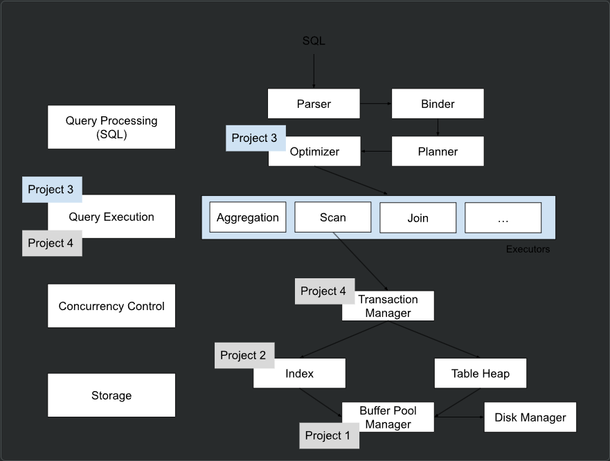
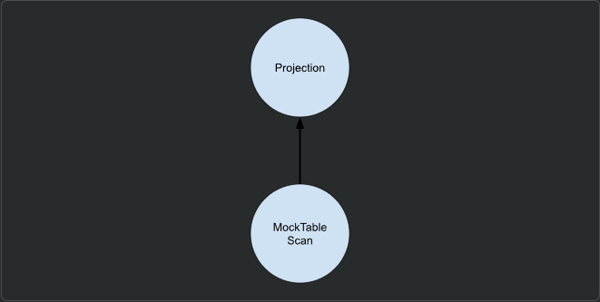
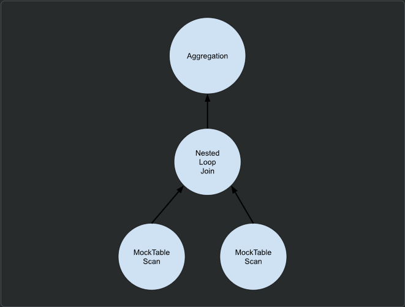
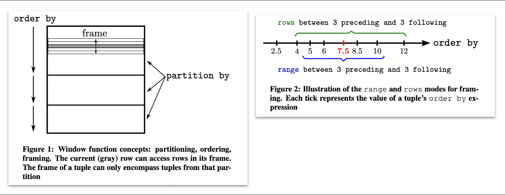
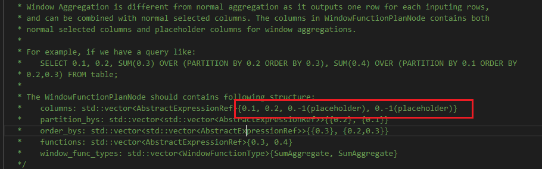
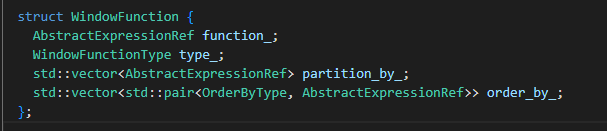
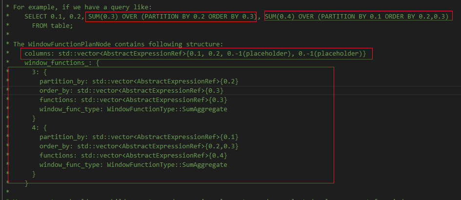
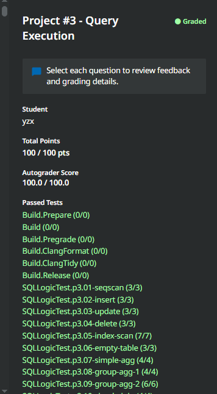

# project 3 Query Execution
## 概述

在学期的这一阶段，你已经实现了数据库管理系统的许多内部组件。在项目1中，你实现了缓冲池管理器(内存管理)；在项目2中，你实现了哈希表索引（存储引擎）。在这个项目中，你将实现使BusTub能够执行查询的组件。你将创建执行SQL查询的**操作符执行器**，并实现优化器规则以转换查询计划。

本项目包含以下几个任务：

+ 任务1：访问方法执行器
+ 任务2：聚合和连接执行器
+ 任务3：哈希连接执行器和优化
+ 任务4：排序 + 限制执行器 + 窗口函数 + Top-N优化
+ 可选任务：排行榜任务
本项目必须独立完成（即不允许组队）。在开始之前，运行git pull public master以从公共的BusTub仓库拉取最新代码。

## 背景：查询处理
请仔细阅读本节内容，因为你需要构建自己的SQL查询来测试执行器的实现。

BusTub的架构如下：
在公共的BusTub仓库中，我们提供了完整的查询处理层。你可以使用BusTub shell来执行SQL查询，类似于其他数据库系统。使用以下命令来编译并运行BusTub shell：



```sh
cd build && make -j$(nproc) shell
./bin/bustub-shell
```

在 Shell 内，你可以使用 \dt 命令来查看所有表。默认情况下，BusTub Shell 会自动创建三个预先填充了数据的表。这样做是为了方便你，使得每次重建解决方案时不需要重新加载数据。这些表中的更改在重启数据库管理系统（DBMS）时不会被持久化。
```sql
bustub> \dt
+-----+----------------+------------------------------+
| oid | name           | cols                         |
+-----+----------------+------------------------------+
| 0   | __mock_table_1 | (colA:INTEGER, colB:INTEGER) |
| 1   | __mock_table_2 | (colC:VARCHAR, colD:VARCHAR) |
| 2   | __mock_table_3 | (colE:INTEGER, colF:VARCHAR) |
| ... | ...            | ...                          |
+-----+----------------+------------------------------+
```
你可以使用 SELECT 语句来查看表中的所有数据：
```sql
bustub> SELECT * FROM __mock_table_1;
+---------------------+---------------------+
| __mock_table_1.colA | __mock_table_1.colB |
+---------------------+---------------------+
| 0                   | 0                   |
| 1                   | 100                 |
| 2                   | 200                 |
| 3                   | 300                 |
| 4                   | 400                 |
| 5                   | 500                 |
| ...                 | ...                 |
+---------------------+---------------------+
```

请注意：
+ BusTub 只支持 SQL 的一小部分。如果某些 SQL 查询无法工作，请不要惊讶。有关 BusTub 支持的所有 SQL 查询，请参阅测试目录下的 SQLLogicTest 文件。
+ 如果你正在使用 CLion 运行 BusTub Shell，请在 Shell 参数中加上 --disable-tty，以便它能够在 CLion 终端中正确运行。
请始终在语句末尾加上 ;（除了内部命令）。
+ BusTub 只支持 INT 和 VARCHAR(n) 类型。另外，你应该使用单引号来包裹字符串，例如，INSERT INTO table VALUES ('a')。

## 检查 SQL 查询计划
BusTub 支持 EXPLAIN 命令来打印查询的执行计划。你可以在任何查询之前加上 EXPLAIN。例如：
```sql
bustub> EXPLAIN SELECT * FROM __mock_table_1;
=== BINDER ===
BoundSelect {
  table=BoundBaseTableRef { table=__mock_table_1, oid=0 },
  columns=[__mock_table_1.colA, __mock_table_1.colB],
  groupBy=[],
  having=,
  where=,
  limit=,
  offset=,
  order_by=[],
  is_distinct=false,
}
=== PLANNER ===
Projection { exprs=[#0.0, #0.1] } | (__mock_table_1.colA:INTEGER, __mock_table_1.colB:INTEGER)
MockScan { table=__mock_table_1 } | (__mock_table_1.colA:INTEGER, __mock_table_1.colB:INTEGER)
=== OPTIMIZER ===
MockScan { table=__mock_table_1 } | (__mock_table_1.colA:INTEGER, __mock_table_1.colB:INTEGER)
```

EXPLAIN 的结果提供了查询处理层内转换过程的概览。语句首先由解析器和绑定器处理，生成代表查询的抽象语法树（AST）。在这个例子中，查询由 BoundSelect 表示，它将在 __mock_table_1 上检索两列（colA 和 colB）。需要注意的是，绑定器会自动将原始 SQL 查询中的 * 字符扩展成表中的实际列。

接下来，绑定器生成的 AST 会被规划器处理，生成合适的查询计划。在这种情况下，查询计划是由两个节点组成的树，数据从叶节点流向根节点：


在此之后，优化器会对查询计划进行优化。在这个例子中，它去除了冗余的投影。

让我们考虑一个更复杂的例子：
```sql
bustub> EXPLAIN (o) SELECT colA, MAX(colB) FROM
  (SELECT * FROM __mock_table_1, __mock_table_3 WHERE colA = colE) GROUP BY colA;
=== OPTIMIZER ===
Agg { types=[max], aggregates=[#0.1], group_by=[#0.0] }
  NestedLoopJoin { type=Inner, predicate=(#0.0=#1.0) }
    MockScan { table=__mock_table_1 }
    MockScan { table=__mock_table_3 }
```
对于这个例子，优化后的查询计划是：


在这个项目中，你需要构建 SQL 查询来测试每个执行器的实现。EXPLAIN 对你来说非常有用，可以帮助你知道某个 SQL 查询是否使用了特定的执行器。

## 样本执行器
在 BusTub 公共仓库中，我们提供了几个样本执行器实现。

### 投影（Projection）
投影节点可以表示对其输入的各种计算。它总是恰好有一个子节点。在 BusTub Shell 中，检查以下查询的查询计划：
```sql
EXPLAIN SELECT 1 + 2;
EXPLAIN SELECT colA FROM __mock_table_1;
EXPLAIN SELECT colA + colB AS a, 1 + 2 AS b FROM __mock_table_1;
```
一个投影计划节点由一个或多个表达式组成，这些表达式代表了一种计算：
+ ColumnValueExpression：直接将子执行器的一列放置到输出中。语法 #0.0 意味着第一个子节点的第一列。在连接的计划中，你会看到类似 #0.0 = #1.0 的表达式。
+ ConstantExpression：表示一个常量值（例如，1）。
+ ArithmeticExpression：一个表示算术计算的树。例如，1 + 2 将由一个具有两个 ConstantExpression 子节点（1 和 2）的 ArithmeticExpression 表示。

### 过滤（Filter）
过滤计划节点用于根据谓词过滤子节点的输出。例如：
```sql
EXPLAIN SELECT * FROM __mock_table_1 WHERE colA > 1;
```
过滤节点恰好有一个子节点，并包含一个谓词。

### 值（Values）
值计划节点用于直接产生值：
```sql
EXPLAIN values (1, 2, 'a'), (3, 4, 'b');
CREATE TABLE table1(v1 INT, v2 INT, v3 VARCHAR(128));
EXPLAIN INSERT INTO table1 VALUES (1, 2, 'a'), (3, 4, 'b');
```
值计划节点在将用户提供的值插入表中时非常有用。

## 查询计划语法
如你可能已经注意到的那样，EXPLAIN 会在每个计划节点后生成一串列描述。这是节点的输出模式。考虑这个示例输出：
```sql
Projection { exprs=[#0.0, #0.1] } | (__mock_table_1.colA:INTEGER, __mock_table_1.colB:INTEGER)
```
这表明表示此计划节点的执行器将生成两个整数类型的列。输出模式是在规划器内部推断出来的。对于这个项目，你的执行器实现必须生成完全符合计划节点中指定模式的元组，否则它们将无法通过我们的单元测试。

### 项目规范
在这个项目中，你将向 BusTub 添加新的操作执行器和查询优化。BusTub 使用迭代器模型（即火山模型）进行查询处理，在这种模型中，每个执行器实现了一个 Next 函数来获取下一个元组结果。当 DBMS 调用执行器的 Next 函数时，执行器会返回 (1) 单个元组 或者 (2) 没有更多的元组的指示。通过这种方法，每个执行器实现了一个循环，持续调用其子节点的 Next 函数来逐个检索和处理元组。

在 BusTub 的迭代器模型实现中，每个执行器的 Next 函数除了返回一个元组外，还会返回一个记录标识符（Record Identifier，简称 RID）。记录标识符作为元组的唯一标识符。

执行器是从 executor_factory.cpp 中的执行计划创建的。

本项目中的所有测试用例都是用一种特殊的文件格式编写的，称为 SQLLogicTest（源自 SQLite）。你可以在这个页面的末尾找到如何使用它。

简而言之，你的任务包括：

+ 实现新的操作执行器。
+ 实现查询优化。
+ 确保执行器遵循迭代器模型，其中 Next 函数用于逐个处理元组。
+ 处理记录标识符（RID），作为元组的唯一标识。
+ 确保所有实现通过 SQLLogicTest 格式的测试用例。

## Task #1 - Access Method Executors
在背景部分中，我们了解到 BusTub 已经能够在 SELECT 查询中从模拟表中检索数据。这是通过使用 MockScan 执行器来实现的，它使用预定义的算法始终生成相同的元组，而不是使用真实的表。这就是为什么你不能更新这些表的原因。

在这个任务中，你将实现从存储系统中的表读取和写入的执行器。你将在以下文件中完成实现：

+ src/include/execution/seq_scan_executor.h
+ src/execution/seq_scan_executor.cpp

+ src/include/execution/insert_executor.h
+ src/execution/insert_executor.cpp

+ src/include/execution/update_executor.h
+ src/execution/update_executor.cpp

+ src/include/execution/delete_executor.h
+ src/execution/delete_executor.cpp

+ src/include/execution/index_scan_executor.h
+ src/execution/index_scan_executor.cpp

+ src/optimizer/seqscan_as_indexscan.cpp

每个执行器的功能描述如下：

**SeqScan**

SeqScanPlanNode 可以通过 SELECT * FROM table 语句来规划。
```sql
bustub> CREATE TABLE t1(v1 INT, v2 VARCHAR(100));
Table created with id = 15

bustub> EXPLAIN (o,s) SELECT * FROM t1;
=== OPTIMIZER ===
SeqScan { table=t1 } | (t1.v1:INTEGER, t1.v2:VARCHAR)
```

SeqScanExecutor 遍历一张表并一次返回一个元组。

提示：
+ 确保理解前缀增量（++iter）和后缀增量（iter++）操作符的区别，当你使用 TableIterator 对象时。混淆 ++iter 和 iter++ 可能会导致奇怪的输出。
+ 不要发出已被删除的 TableHeap 中的元组。检查每个元组对应的 TupleMeta 的 is_deleted_ 字段。
+ 顺序扫描的输出是每个匹配元组的一个副本及其原始记录标识符（RID）。
注意：BusTub 不支持 DROP TABLE 或 DROP INDEX。你可以通过重启 Shell 来重置数据库。

**Insert**
InsertPlanNode 可以通过 INSERT 语句来规划。注意，你需要使用单引号来指定 VARCHAR 值。
```sql
bustub> EXPLAIN (o,s) INSERT INTO t1 VALUES (1, 'a'), (2, 'b');
=== OPTIMIZER ===
Insert { table_oid=15 } | (__bustub_internal.insert_rows:INTEGER)
  Values { rows=2 } | (__values#0.0:INTEGER, __values#0.1:VARCHAR)
```
InsertExecutor 向表中插入元组并更新受影响的索引。它只有一个子节点，产生要插入到表中的值。规划器将确保值与表具有相同的模式。执行器将产生一个整数类型的单个元组作为输出，指示有多少行被插入到表中。记住在插入时更新索引，如果表有关联的索引的话。

提示：

+ 查看下面的系统目录部分以了解有关系统目录的信息。初始化此执行器时，你需要查找有关插入表的信息。
+ 查看下面的索引更新部分以了解更多关于更新表索引的细节。
+ 你需要使用 TableHeap 类来执行表修改。
+ 在创建或修改 TupleMeta 时只需要改变 is_delete_ 字段。对于 insertion_txn_ 和 deletion_txn_ 字段，将其设置为 INVALID_TXN_ID。这些字段旨在用于未来学期，那时我们可能会切换到 MVCC 存储。

**Update**
UpdatePlanNode 可以通过 UPDATE 语句来规划。它只有一个子节点，包含要更新的表中的记录。

```sql
bustub> explain (o,s) update test_1 set colB = 15445;
=== OPTIMIZER ===
Update { table_oid=20, target_exprs=[#0.0, 15445, #0.2, #0.3] } | (__bustub_internal.update_rows:INTEGER)
  SeqScan { table=test_1 } | (test_1.colA:INTEGER, test_1.colB:INTEGER, test_1.colC:INTEGER, test_1.colD:INTEGER)
```
UpdateExecutor 修改指定表中的现有元组。执行器将产生一个整数类型的单个元组作为输出，指示有多少行被更新。记住更新因更新而受影响的索引。

提示：

+ 为了实现更新，**先删除受影响的元组，然后再插入一个新的元组**。除非你在实现项目 4 的排行榜优化，否则不要使用 TableHeap UpdateTupleInplaceUnsafe 函数。

**Delete**
DeletePlanNode 可以通过 DELETE 语句来规划。它只有一个子节点，包含要从表中删除的记录。你的删除执行器应该产生一个表示从表中删除了多少行的整数输出。它还需要更新受影响的索引。
```sql
bustub> EXPLAIN (o,s) DELETE FROM t1;
=== OPTIMIZER ===
Delete { table_oid=15 } | (__bustub_internal.delete_rows:INTEGER)
  Filter { predicate=true } | (t1.v1:INTEGER, t1.v2:VARCHAR)
    SeqScan { table=t1 } | (t1.v1:INTEGER, t1.v2:VARCHAR)

bustub> EXPLAIN (o,s) DELETE FROM t1 where v1 = 1;
=== OPTIMIZER ===
Delete { table_oid=15 } | (__bustub_internal.delete_rows:INTEGER)
  Filter { predicate=#0.0=1 } | (t1.v1:INTEGER, t1.v2:VARCHAR)
    SeqScan { table=t1 } | (t1.v1:INTEGER, t1.v2:VARCHAR)
```
你可以假设 DeleteExecutor 总是出现在它出现的查询计划的根部。DeleteExecutor 不应修改其结果集。

提示：

+ 为了删除一个元组，你需要从子执行器获取一个 RID 并更新相应 TupleMeta 的 is_deleted_ 字段。

**IndexScan**
IndexScanExecutor 使用哈希索引来执行点查找，以检索元组的 RID。然后，该操作符使用这些 RID 从相应的表中检索其元组。然后一次发出这些元组。

你可以通过 SELECT FROM <table> WHERE <index column> = <val> 测试你的索引扫描执行器。你将在下一节中实现将 SeqScan 转换成 IndexScan 的优化规则。

```sql
bustub> CREATE TABLE t1(v1 int, v2 int);
Table created with id = 22

bustub> CREATE INDEX t1v1 ON t1(v1);
Index created with id = 0

bustub> EXPLAIN (o,s) SELECT * FROM t1 WHERE v1 = 1;
=== OPTIMIZER ===
IndexScan { index_oid=0, filter=(#0.0=1) } | (t1.v1:INTEGER, t1.v2:INTEGER)
```
在本项目中，计划中的索引对象类型始终是 HashTableIndexForTwoIntegerColumn。你可以安全地将其转换并存储在执行器对象中：

```sql
htable_ = dynamic_cast<HashTableIndexForTwoIntegerColumn *>(index_info_->index_.get());
```
然后你可以使用哈希索引进行点查找，从表堆中查找元组，并根据谓词发出符合条件的元组。BusTub 只支持具有单个唯一整数列的索引。我们的测试用例不会包含重复的键。因此，如果存在的话，点查找只会返回一个元组。

你需要在下一节中完成将 SeqScan 转换成 IndexScan 的优化规则。

提示：
+ 我们永远不会向带有索引的表中插入重复行。
+ 如上所述，不要发出已被删除的元组。

**优化 SeqScan 成 IndexScan**
正如我们在讲座中学到的那样，当我们查询索引列时，使用 IndexScan 将显著提升查找性能。为此，我们需要将过滤器推送到扫描器，以便我们知道要在索引中查找的键。然后我们可以直接通过索引检索值，而不是执行全表扫描或索引扫描。

你需要修改优化器，以便在可能的情况下将 SeqScanPlanNode 转换成 IndexScanPlanNode。

考虑以下示例：
```sql
bustub> EXPLAIN (o) SELECT * FROM t1 WHERE v1 = 1;
```

在应用 MergeFilterScan 和 SeqScan as IndexScan 优化规则之前，计划可能如下所示：
```sql
Filter { predicate=(#0.0=1) } | (t1.v1:INTEGER, t1.v2:INTEGER, t1.v3:INTEGER)
  SeqScan { table=t1 } | (t1.v1:INTEGER, t1.v2:INTEGER, t1.v3:INTEGER)
```

在应用 MergeFilterScan 和 SeqScan as IndexScan 优化规则之后，我们可以直接执行快速索引查找而不是遍历整个表。结果计划如下所示：

```sql
IndexScan { index_oid=0, filter=(#0.0=1) } | (t1.v1:INTEGER, t1.v2:INTEGER, t1.v3:INTEGER)
```

实现此优化规则的简要步骤如下：

1. 启用 SeqScan 中的**谓词下推**：我们可以在 SeqScanExecutor 中实现一个谓词过滤器，以便后来的索引扫描节点具有谓词。我们已经在优化器规则 merge_filter_scan.cpp 中为你启用了 MergeFilterScan 优化规则。
2. 使用索引：你可以检查谓词中的过滤列。如果恰好存在索引，则创建一个 IndexScanPlanNode。注意，为了获得满分，你只需要支持在谓词中有单一等值测试的情况（例如 WHERE v1 = 1）。查询 SELECT * FROM t1 WHERE v1 = 1 AND v2 = 2 应该仍然使用顺序扫描，因此你不需要分割谓词。

请查阅优化器规则实现指南以了解实现优化器规则的详细信息。

现在你已经实现了所有与存储相关的执行器。在接下来的任务中，你可以创建表并插入一些值来测试自己的执行器实现！此时，你也应该通过了 SQLLogicTests #1 至 6。

提示：

+ 你可能会发现实用工具 ExtendibleHashTableIndex::ScanKey 函数很有帮助。
+ 再次强调，你只需要支持索引列上的单一等值谓词的优化。

### 解

#### 分析

首先每个执行器的执行如下：
```cpp
// Construct the executor for the abstract plan node
auto executor = ExecutorFactory::CreateExecutor(exec_ctx, plan);
executor->Init();
// PollExecutor
RID rid{};
Tuple tuple{};
while (executor->Next(&tuple, &rid)) {
    if (result_set != nullptr) {
    result_set->push_back(tuple);
    }
}
```

给了我们3个例子，分别是 projection filter values,看一下这个是怎么写的。
1. projection
+ 可以看到一个执行器有一个抽象 abstract_executor 基类，主要保存了 ExecutorContext 执行程序上下文，这里最重要的就是这个目录 catalog_;
一个执行器还包含一个节点，即要对这个节点进行操作。比如这里的 projection，它的节点就是 ProjectionPlanNode。
+ 可以看到一个节点也有一个抽象 abstract_plan基类，主要保存了 输出类型 output_schema 和 子节点 AbstractPlanNodeRef。
对于ProjectionPlanNode，这个主要是用来映射的，所以我本身需要一组表达式去控制输出 expressions_。
2. filter
在 filter主要进行过滤，这里可以看到 当拿到一个 value后，需要进行判断此 value是否有效，如果没有效则重新拿
```cpp
auto filter_expr = plan_->GetPredicate();
  while (true) {
    // Get the next tuple
    const auto status = child_executor_->Next(tuple, rid);

    if (!status) {
      return false;
    }

    auto value = filter_expr->Evaluate(tuple, child_executor_->GetOutputSchema());
    if (!value.IsNull() && value.GetAs<bool>()) {
      return true;
    }
  }
```
3. values
这个ValuesPlanNode代表一行数据，比如`INSERT INTO table VALUES ((0, 1), (1, 2))`, where we will have `(0, 1)` and `(1, 2)` as the output of this executor.所以plan 维护一组表达式`  std::vector<std::vector<AbstractExpressionRef>> values_;`，每一行代表一个 value
```cpp
auto ValuesExecutor::Next(Tuple *tuple, RID *rid) -> bool {
  if (cursor_ >= plan_->GetValues().size()) {
    return false;
  }

  std::vector<Value> values{};
  values.reserve(GetOutputSchema().GetColumnCount());

  const auto &row_expr = plan_->GetValues()[cursor_];
  for (const auto &col : row_expr) {
    values.push_back(col->Evaluate(nullptr, dummy_schema_));
  }

  *tuple = Tuple{values, &GetOutputSchema()};
  cursor_ += 1;

  return true;
}
```
#### 解

1. SeqScanExecutor
提示：
SeqScanExecutor 遍历一张表并一次返回一个元组。
提示：
+ 确保理解前缀增量（++iter）和后缀增量（iter++）操作符的区别，当你使用 TableIterator 对象时。混淆 ++iter 和 iter++ 可能会导致奇怪的输出。
+ 不要发出已被删除的 TableHeap 中的元组。检查每个元组对应的 TupleMeta 的 is_deleted_ 字段。
+ 顺序扫描的输出是每个匹配元组的一个副本及其原始记录标识符（RID）。
注意：BusTub 不支持 DROP TABLE 或 DROP INDEX。你可以通过重启 Shell 来重置数据库。

注意：table_iterator 没有拷贝方法，所以迭代器只能在构造函数中构造。这里完全可以参考 filter_executor
```cpp
SeqScanExecutor::SeqScanExecutor(ExecutorContext *exec_ctx, const SeqScanPlanNode *plan) : 
    AbstractExecutor(exec_ctx), 
    plan_(plan), 
    table_heap_(GetExecutorContext()->GetCatalog()->GetTable(plan_->GetTableOid())->table_.get()),
    table_iterator_(table_heap_->MakeIterator()) {}

void SeqScanExecutor::Init() {}

auto SeqScanExecutor::Next(Tuple *tuple, RID *rid) -> bool { 
    TupleMeta meta;
    while(true){
        if(table_iterator_.IsEnd()){
            return false;
        }
        meta = table_iterator_.GetTuple().first;
        if(!meta.is_deleted_){
            *tuple = table_iterator_.GetTuple().second;
            *rid = table_iterator_.GetRID();
        }
        ++table_iterator_;
        // 不能输出(1)被删除的tuple, (2)如果有过滤条件，不符合filter的tuple。
        if(!meta.is_deleted_ && (plan_->filter_predicate_ == nullptr ||
        plan_->filter_predicate_->Evaluate(tuple, GetExecutorContext()->GetCatalog()->GetTable(plan_->GetTableOid())->schema_).GetAs<bool>())){
            return true;
        }
    }
}

 private:
  /** The sequential scan plan node to be executed */
  const SeqScanPlanNode *plan_;

  TableHeap* table_heap_ ;
  TableIterator table_iterator_ ;
  
```

2. InsertExecutor
InsertExecutor 向表中插入元组并更新受影响的索引。它只有一个子节点，产生要插入到表中的值。规划器将确保值与表具有相同的模式。执行器将产生一个整数类型的单个元组作为输出，指示有多少行被插入到表中。记住在插入时更新索引，如果表有关联的索引的话。

提示：
+ 查看下面的系统目录部分以了解有关系统目录的信息。初始化此执行器时，你需要查找有关插入表的信息。
+ 查看下面的索引更新部分以了解更多关于更新表索引的细节。
+ 你需要使用 TableHeap 类来执行表修改。
+ 在创建或修改 TupleMeta 时只需要改变 is_delete_ 字段。对于 insertion_txn_ 和 deletion_txn_ 字段，将其设置为 INVALID_TXN_ID。这些字段旨在用于未来学期，那时我们可能会切换到 MVCC 存储。
```cpp
InsertExecutor::InsertExecutor(ExecutorContext *exec_ctx, const InsertPlanNode *plan,
                               std::unique_ptr<AbstractExecutor> &&child_executor)
    : AbstractExecutor(exec_ctx), plan_(plan), child_executor_(std::move(child_executor)), has_insert_(false){}

void InsertExecutor::Init() { 
    child_executor_->Init();
}

auto InsertExecutor::Next([[maybe_unused]] Tuple *tuple, RID *rid) -> bool { 
  if(has_insert_){
    return false;
  }
  has_insert_ = true;
  // 拿到待插入的表 和 indexes
  auto table_info = exec_ctx_->GetCatalog()->GetTable(plan_->GetTableOid());
  auto schema = table_info->schema_;
  auto indexes= exec_ctx_->GetCatalog()->GetTableIndexes(table_info->name_);

  int count = 0;
  while( child_executor_->Next(tuple, rid) ){
    count++;
    auto insert_rid = table_info->table_->InsertTuple(TupleMeta{0,false}, *tuple);
    RID new_rid = insert_rid.value();
    // 更新索引
    for(auto& index_info : indexes){
        // 从元组中拿到索引,注意KeyFromTuple（基类schema，索引schema,attrs）
        auto key = tuple->KeyFromTuple(schema, index_info->key_schema_, index_info->index_->GetKeyAttrs());
        index_info->index_->InsertEntry(key, new_rid, exec_ctx_->GetTransaction());
    }
  }
  std::vector<Value> res = {Value(INTEGER, count)};
  *tuple = Tuple(res, &GetOutputSchema());
  return true;
}
 private:
  /** The insert plan node to be executed*/
  const InsertPlanNode *plan_;

  /** The child executor from which tuples are obtained */
  std::unique_ptr<AbstractExecutor> child_executor_;

    bool has_insert_ {false};
```

3. UpdateExecutor
UpdatePlanNode 可以通过 UPDATE 语句来规划。它只有一个子节点，包含要更新的表中的记录。
UpdateExecutor 修改指定表中的现有元组。执行器将产生一个整数类型的单个元组作为输出，指示有多少行被更新。记住更新因更新而受影响的索引。
提示：
+ 为了实现更新，先删除受影响的元组，然后再插入一个新的元组。除非你在实现项目 4 的排行榜优化，否则不要使用 TableHeap UpdateTupleInplaceUnsafe 函数。
```cpp
UpdateExecutor::UpdateExecutor(ExecutorContext *exec_ctx, const UpdatePlanNode *plan,
                               std::unique_ptr<AbstractExecutor> &&child_executor)
    : AbstractExecutor(exec_ctx), 
    table_info_(exec_ctx_->GetCatalog()->GetTable(plan_->GetTableOid())),
    plan_(plan), 
    child_executor_(std::move(child_executor)), 
    has_update_(false) {
  // As of Fall 2022, you DON'T need to implement update executor to have perfect score in project 3 / project 4.
}

void UpdateExecutor::Init() { 
    // throw NotImplementedException("UpdateExecutor is not implemented"); 
    child_executor_->Init();
}

auto UpdateExecutor::Next([[maybe_unused]] Tuple *tuple, RID *rid) -> bool { 
    if(has_update_){
        return false;
    }
    has_update_ = true;
    auto schema = table_info_->schema_;
    auto indexes= exec_ctx_->GetCatalog()->GetTableIndexes(table_info_->name_);

    Tuple child_tuple{};
    RID child_rid{};
    int count = 0;
    std::unordered_set<RID> have_updated;
    // 拿到待更新的值
    while( child_executor_->Next(&child_tuple, &child_rid) ){
        if(have_updated.find(child_rid) != have_updated.end()){
            continue;
        }
        ++count;
        have_updated.insert(child_rid);
        // 先删除受影响的元组,其实就是标记出来
        table_info_->table_->UpdateTupleMeta(TupleMeta{0, true}, child_rid);
        // 拿到要插入的数
        std::vector<Value> values{};
        values.reserve(plan_->target_expressions_.size());
        for( const auto &col : plan_->target_expressions_){
            values.push_back(col->Evaluate( &child_tuple, child_executor_->GetOutputSchema()));
        }
        auto new_tuple = Tuple{values, &schema};
        // 插入
        auto insert_rid = table_info_->table_->InsertTuple(TupleMeta{0,false}, new_tuple);
        RID new_rid = insert_rid.value();
        // 更新索引，先删后插
        for(auto& index_info : indexes){
            auto old_key = child_tuple.KeyFromTuple(schema, index_info->key_schema_, index_info->index_->GetKeyAttrs());
            auto new_key = new_tuple.KeyFromTuple(schema, index_info->key_schema_, index_info->index_->GetKeyAttrs());
            index_info->index_->DeleteEntry(old_key, child_rid, exec_ctx_->GetTransaction());
            index_info->index_->InsertEntry(new_key, new_rid, exec_ctx_->GetTransaction());
        }
    }

  std::vector<Value> res = {Value(INTEGER, count)};
  *tuple = Tuple(res, &GetOutputSchema());
  return true;
}
```
4. delete
```cpp
DeleteExecutor::DeleteExecutor(ExecutorContext *exec_ctx, const DeletePlanNode *plan,
                               std::unique_ptr<AbstractExecutor> &&child_executor)
    : AbstractExecutor(exec_ctx), plan_(plan), child_executor_(std::move(child_executor)), has_delete_(false) {}

void DeleteExecutor::Init() { 
    child_executor_->Init();
}

auto DeleteExecutor::Next([[maybe_unused]] Tuple *tuple, RID *rid) -> bool { 
    if(has_delete_){
        return false;
    }
    has_delete_ = true;

    auto table_info = exec_ctx_->GetCatalog()->GetTable(plan_->GetTableOid());
    auto indexes = exec_ctx_->GetCatalog()->GetTableIndexes(table_info->name_);
    auto schema = table_info->schema_;
    Tuple childe_tuple{};
    RID childe_rid{};
    int count = 0;
    while(child_executor_->Next(&childe_tuple, &childe_rid)){
        ++count;
        table_info->table_->UpdateTupleMeta(TupleMeta{0, true}, childe_rid);
        // 更新索引
        for(auto& index_info : indexes){
            auto key = childe_tuple.KeyFromTuple(schema, index_info->key_schema_, index_info->index_->GetKeyAttrs());
            index_info->index_->DeleteEntry(key, childe_rid, exec_ctx_->GetTransaction());
        }
    }
    std::vector<Value> res = {Value(INTEGER, count)};
    *tuple = Tuple(res, &GetOutputSchema());
    return true;
}
```

5. index
```cpp
IndexScanExecutor::IndexScanExecutor(ExecutorContext *exec_ctx, const IndexScanPlanNode *plan)
    : AbstractExecutor(exec_ctx), 
    plan_(plan), 
    has_scan_(false) {}

void IndexScanExecutor::Init() {
    // 根据一个键值拿到，我们想要的键值
    auto table_info = exec_ctx_->GetCatalog()->GetTable(plan_->table_oid_);
    table_heap_ = table_info->table_.get();
    // 拿到想要的索引
    auto index_info = exec_ctx_->GetCatalog()->GetIndex(plan_->index_oid_);
    // 转化为 哈希索引 ExtendibleHashTableIndex<IntegerKeyType, IntegerValueType, IntegerComparatorType>;
    htable_ = dynamic_cast<HashTableIndexForTwoIntegerColumn*>(index_info->index_.get());
    // 拿到此索引的 clo
    auto table_schema = index_info->key_schema_;
    auto key = plan_->pred_key_;
    auto value = key->val_;
    std::vector<Value> values{value};
    Tuple index_key(values, &table_schema);

    result_rids_.clear();
    htable_->ScanKey(index_key, &result_rids_, exec_ctx_->GetTransaction());
    iter_ = result_rids_.begin();
}

auto IndexScanExecutor::Next(Tuple *tuple, RID *rid) -> bool { 
    // 根据扫描到的 rid 返回结构
    while(true){
        if(has_scan_){
            return false;
        }
        if(iter_ == result_rids_.end()){
            has_scan_ = true;
            return false;
        }
        auto meta = table_heap_->GetTuple(*iter_).first;
        if(!meta.is_deleted_){
            *tuple = table_heap_->GetTuple(*iter_).second;
            *rid = *result_rids_.begin();
        }
        ++iter_;
        // 不能输出(1)被删除的tuple,
        if(!meta.is_deleted_){
            return true;
        }
    }
}
```

6. Optimizing SeqScan to IndexScan

优化规则：PlanNode具有Expression，其类型为比较表达式。且Expression的一个子表达式类型为列值表达式，另一个子表达式的类型为常量表达式，且列值表达式所表示的列上具有索引。此时SeqScan可以被转换成IndexScan。似乎Expression自描述的功能，其TypeId成员用来表示返回值类型，而不是表达式类型，那么我们要怎么判断表达式类型呢？

获取的表达式类型为AbstractExpressRef, 是一个智能指针，其get()方法可以获取原生指针。我们可以利用C++的dynamic_cast将指针的类型转换成子类的指针类型，这是dynamic_cast的一个很重要的使用：多态类型之间的安全转换。

比如一个父类类型的指针，它能指向子类A，也能指向子类B。假设该指针指向了子类A，那么我们可以将其dynamic_cast成子类A类型的指针，但是不能将其dynamic_cast成子类B类型的指针，这将导致转换失败返回nullptr值。

根据这个性质，我们可以通过dynamic_cast的返回值，判断转换是否成功，同时也能判断该指针指向的数据类型。
使用更安全的 std::dynamic_pointer_cast 专门用于指针

那么我们要怎么判断列值表达式的列，是否具有索引呢？ ColumnValueExpression具有col_idx_成员，其表示ColumnValueExpression的列为table的第col_idx列(从0开始)。而Index的GetKeyAttrs()方法可以获取一个数组，该数组表示索引列的下标。我们只需要判断GetKeyAttrs()数组中是否有元素和col_idx相等即可。

注意：在优化前，我们需要调用OptimizeMergeFilterScan()进行谓词下推。

所以可以参考： Optimizer::OptimizeMergeFilterScan的实现
```cpp
auto Optimizer::OptimizeSeqScanAsIndexScan(const bustub::AbstractPlanNodeRef &plan) -> AbstractPlanNodeRef {
  std::vector<bustub::AbstractPlanNodeRef> optimized_children;
  for (const auto &child : plan->GetChildren()) {
    optimized_children.emplace_back(OptimizeSeqScanAsIndexScan(child));
  }

  auto optimized_plan = plan->CloneWithChildren(std::move(optimized_children));
  if (optimized_plan->GetType() == PlanType::SeqScan) {
    const auto &seq_plan = dynamic_cast<const bustub::SeqScanPlanNode &>(*optimized_plan);
    auto predicate = seq_plan.filter_predicate_;
    if (predicate != nullptr) {
      auto table_name = seq_plan.table_name_;
      auto table_idx = catalog_.GetTableIndexes(table_name);
      auto logic_expr = std::dynamic_pointer_cast<LogicExpression>(predicate);
      // 沒有索引或者有多个谓词条件,返回顺序扫描
      if (!table_idx.empty() && !logic_expr) {
        auto equal_expr = std::dynamic_pointer_cast<ComparisonExpression>(predicate);
        if (equal_expr) {
          auto com_type = equal_expr->comp_type_;
          if (com_type == ComparisonType::Equal) {
            auto table_oid = seq_plan.table_oid_;
            auto column_expr = dynamic_cast<const ColumnValueExpression &>(*equal_expr->GetChildAt(0));
            auto column_index = column_expr.GetColIdx();
            auto col_name = this->catalog_.GetTable(table_oid)->schema_.GetColumn(column_index).GetName();
            // 如果存在相关索引，获取表索引info
            for (auto *index : table_idx) {
              const auto &columns = index->index_->GetKeyAttrs();
              std::vector<uint32_t> column_ids;
              column_ids.push_back(column_index);
              if (columns == column_ids) {
                // 获取pred-key
                auto pred_key = std::dynamic_pointer_cast<ConstantValueExpression>(equal_expr->GetChildAt(1));
                // 从智能指针中获取裸指针
                ConstantValueExpression *raw_pred_key = pred_key ? pred_key.get() : nullptr;
                return std::make_shared<IndexScanPlanNode>(seq_plan.output_schema_, table_oid, index->index_oid_,
                                                           predicate, raw_pred_key);
              }
            }
          }
        }
      }
    }
  }
  return optimized_plan;
}
```

## Task #2 - Aggregation & Join Executors

**AggregationPlanNode 用于支持如下查询：**
```sql
EXPLAIN SELECT colA, MIN(colB) FROM __mock_table_1 GROUP BY colA;
EXPLAIN SELECT COUNT(colA), min(colB) FROM __mock_table_1;
EXPLAIN SELECT colA, MIN(colB) FROM __mock_table_1 GROUP BY colA HAVING MAX(colB) > 10;
EXPLAIN SELECT DISTINCT colA, colB FROM __mock_table_1;
```
聚合执行器为每组输入计算聚合函数。它恰好有一个子节点。输出模式由分组列后跟聚合列组成。

如课堂上讨论的那样，实现聚合的一个常见策略是使用哈希表，其中分组列为键。在这个项目中，你可以**假设聚合哈希表可以完全放入内存中。这意味着你不需要实现多阶段、基于分区的策略，并且哈希表也不需要由缓冲池页面支持**。

我们提供了一个 SimpleAggregationHashTable 数据结构，它暴露了一个内存中的哈希表（std::unordered_map），但接口设计用于计算聚合。这个类还暴露了一个 SimpleAggregationHashTable::Iterator 类型，可用于遍历哈希表。你需要完成**这个类中的 CombineAggregateValues 函数。**

聚合执行器本身不需要处理 HAVING 子句。规划器将把带有 HAVING 子句的聚合计划为 AggregationPlanNode 后跟一个 FilterPlanNode。

提示：在查询计划的上下文中，聚合是流水线的中断点。这可能会影响你在实现中使用 AggregationExecutor::Init() 和 AggregationExecutor::Next() 函数的方式。仔细决定聚合的构建阶段是在 AggregationExecutor::Init() 中还是在 AggregationExecutor::Next() 中执行。

提示：你必须处理聚合函数输入中的 NULL 值（即，元组可能在其用于聚合函数的属性上有 NULL 值）。参见测试用例以了解预期的行为。分组列永远不会是 NULL。

提示：当对空表执行聚合时，CountStarAggregate 应**返回零**，所有其他聚合类型应**返回 integer_null**。这就是为什么 GenerateInitialAggregateValue 初始化大多数聚合值为 NULL 的原因。

**嵌套循环连接（NestedLoopJoin）**
DBMS 默认使用 NestedLoopJoinPlanNode 来处理所有连接操作。考虑以下示例查询：
```sql
EXPLAIN SELECT * FROM __mock_table_1, __mock_table_3 WHERE colA = colE;
EXPLAIN SELECT * FROM __mock_table_1 INNER JOIN __mock_table_3 ON colA = colE;
EXPLAIN SELECT * FROM __mock_table_1 LEFT OUTER JOIN __mock_table_3 ON colA = colE;
```
你需要使用课堂上讲的**简单嵌套循环连接算法**来实现 NestedLoopJoinExecutor 的内连接和左连接。该运算符的**输出模式是从左表的所有列后跟右表的所有列。对于外层表中的每个元组**，考虑内层表中的每个元组，并在满足连接谓词时发出输出元组。

我们将在 Gradescope 上提供所有测试用例。我们不会测试涉及 NULL 的奇怪边缘情况（例如分组子句或索引中的 NULL）。此时，你应该通过 SQLLogicTests 的第 7 到第 12 项测试。

提示：你应该使用 NestedLoopJoinPlanNode 中的谓词。参见 AbstractExpression::EvaluateJoin，它处理左元组和右元组及其各自的模式。注意，这返回一个 Value，可能是 false、true 或 NULL。参见 FilterExecutor 了解如何在元组上应用谓词。

### task2 解

#### 1. AggregationPlanNode
我们常用hash解决aggregation问题，一般情况下，aggregation都有group by子句。这意味着我们需要**将tuple分组**，如何通过hash分组tuple呢？假设现在需要根据colA列分组，显而易见的是：colA列值相同的tuple将会分在一组。相同的列值经过hash得到的hash值一定也是相同的，所以我们只需要以group-by的列为key，对group-by的列值做hash，就能将tuple分组。

说完group-by后，再来看aggregation。我们为什么要具有相同group-by列值的tuple分到一起呢？为了统计某些信息，如：成绩的最高分(max)，身高的平均值(avg)。对具有相同group-by列值的tuple的某些列做aggregate, aggregate的类型有：
`enum class AggregationType { CountStarAggregate, CountAggregate, SumAggregate, MinAggregate, MaxAggregate };`

+ CountStarAggregate: COUNT(*) 计算给定表中的所有行的数量，包括那些含有 NULL 值的行。
+ CountAggregate: COUNT(column) 计算给定表中某列非 NULL 值的数量。只有那些在指定列中具有非 NULL 值的行才会被计入总数。

因此，我们不需要将具有相同group-by列值的tuple分到一组，只需要将tuple的某些列分到一组，接着做aggregate即可。在代码实现中，BusTub则是边对tuple分组，边对列值做aggregate. 因此，官方要求我们完成hash table的CombineAggregateValues函数

回到代码实现中，我们需要用SimpleAggregationHashTable完成hash分组任务，PlanNode提供了GetGroupBys与GetAggregates方法，它们会返回一些表达式，用于获取group-by或是aggregate列值。而Executor提供了MakeAggregateKey和MakeAggregateValue方法，它们分别会调用GetGroupBys与GetAggregates方法，将group-by与aggregate的列值保存在AggregateKey与AggregateValue中，这两个结构都是对std::vector<Value>的封装。为什么不是对Value的封装呢？可能存在多个group-by与aggregate对象嘛，比如 SELECT max(colA), min(colB) FROM test_2 group by colA, colB，只有colA与colB都相同的tuple才会分到一组，并且对colA和colB两列做aggregate.

由于我们需要用AggregateKey作为std::unordered_map的key，那么AggregateKey必须支持一个hash函数，用于将复杂类型转换成一个hash值(整数)，因此官方特化了hash模板;

同时，重载了AggregateKey的==，用于hash冲突时，进行key值的比较;

关于Executor返回的Tuple和RID: AggregationExecutor作为pipeline breaker. 我们需要遍历SimpleAggregationHashTable以构造Tuple，而RID则是无效输出。

Init:
+ 调用子执行器的Next获取Tuple
+ 通过MakeAggregateKey和MakeAggregateValue获取tuple的k-v
+ 调用SimpleAggregationHashTable的InsertCombine

Next: 遍历SimpleAggregationHashTable, 构造聚合结果即可。

你需要注意的是：Executor输出的Tuple的Schema. 根据文档，它应该是所有group-by列+所有aggregate列。所以构造Tuple时，你需要先保存key的所有Value再保存value的所有Value.

以及：如果SimpleAggregationHashTable为空，且group-by为空，需要输出一个默认值(GenerateInitialAggregateValue())。而如果SimpleAggregationHashTable为空，且group-by不为空，则直接返回false. 

一个问题：
```cpp
// 在 init()中，假如像下面这样构造
    auto agg_exprs = plan_->GetAggregates();
    auto agg_types = plan_->GetAggregateTypes();
std::cout<< "agg_types:"<<agg_types.size()<<std::endl;
    // 创建哈希表
    aht_ = std::make_unique<SimpleAggregationHashTable>(agg_exprs, agg_types);
std::cout<<"init:";
aht_->psize();

// 在next中
auto AggregationExecutor::Next(Tuple *tuple, RID *rid) -> bool { 
    // 如果分组了，即有 group by
    //Executor输出的Tuple的Schema. 根据文档，它应该是所有group-by列+所有aggregate列。
std::cout<<"s_next:";
aht_->psize();
...
}
```
**会出现一个问题：**不知道什么原因？
```sql
<main>:48
select count(*), min(v1+v2-3), max(2+v2-v1), count(v1+v2+v2), sum(v1-v2+v2), sum(1), max(233), min(1), count(2) from t2;
agg_types:9
init:agg_types:9
s_next:agg_types:0
s_next:agg_types:9
```
这是什么鬼？为什么第一次调用 next的时候 agg_types.size()==0?明明是先调用init 后再 next，但是第一次为什么是0？第二次就正常了？
改成下面这样就好了？我去。
```cpp
aht_ = std::make_unique<SimpleAggregationHashTable>(plan_->GetAggregates(), plan_->GetAggregateTypes());
```

```cpp
void CombineAggregateValues(AggregateValue *result, const AggregateValue &input) {
    // 就是在 result中插入 input
    // result代表每个聚合函数的值
    for (uint32_t i = 0; i < agg_exprs_.size(); i++) {
      // 聚合函数 agg_exprs_, 聚合类型： agg_types_
      auto& result_value = result->aggregates_[i];
      auto& input_value = input.aggregates_[i];
      switch (agg_types_[i]) {
        // 注意 如果是 null 也要计数
        case AggregationType::CountStarAggregate:
            result_value = result_value.Add(Value(TypeId::INTEGER, 1));
            break;
        case AggregationType::CountAggregate:
            if(!input_value.IsNull()){
                if(result_value.IsNull()){
                    result_value = ValueFactory::GetIntegerValue(0);
                }
                result_value = result_value.Add(Value(TypeId::INTEGER, 1));
            }
            break;
        case AggregationType::SumAggregate:
            if(!input_value.IsNull()){
                if(result_value.IsNull()){
                    result_value = input_value;
                }else{
                    result_value = result_value.Add(input_value);
                }
            }
            break;
        case AggregationType::MinAggregate:
            if(!input_value.IsNull()){
                if(result_value.IsNull()){
                    result_value = input_value;
                }else{
                    result_value = result_value.CompareLessThan(input_value) == CmpBool::CmpTrue ? result_value : input_value;
                }
            }
            break;
        case AggregationType::MaxAggregate:
            if(!input_value.IsNull()){
                if(result_value.IsNull()){
                    result_value = input_value;
                }else{
                    result_value = result_value.CompareGreaterThan(input_value) == CmpBool::CmpTrue ? result_value : input_value;
                }
            }
            break;
      }
    }
  }

AggregationExecutor::AggregationExecutor(ExecutorContext *exec_ctx, const AggregationPlanNode *plan,
                                         std::unique_ptr<AbstractExecutor> &&child_executor)
    : AbstractExecutor(exec_ctx),
    plan_(plan),
    child_executor_(std::move(child_executor)),
    has_agg_(false) {}

void AggregationExecutor::Init() {
    child_executor_->Init();   
    // 拿到聚合表达式和类型 
//     auto agg_exprs = plan_->GetAggregates();
//     auto agg_types = plan_->GetAggregateTypes();
// std::cout<< "agg_types:"<<agg_types.size()<<std::endl;
    // 创建哈希表
    aht_ = std::make_unique<SimpleAggregationHashTable>(plan_->GetAggregates(), plan_->GetAggregateTypes());
std::cout<<"init:";
aht_->psize();
    Tuple child_tuple{};
    // Aggregation 算子会打破 iteration model 的规则,
    // 在 Aggregation 的 Init() 函数中，我们就要将所有结果全部计算出来
    // SELECT t.x, max(t.y) FROM t GROUP BY t.x;
    RID rid{};
    while(child_executor_->Next(&child_tuple, &rid)){
        auto agg_key = MakeAggregateKey(&child_tuple);
        auto agg_val = MakeAggregateValue(&child_tuple);
        aht_->InsertCombine(agg_key, agg_val);
    }
    aht_iterator_ = std::make_unique<SimpleAggregationHashTable::Iterator>(aht_->Begin());
}

auto AggregationExecutor::Next(Tuple *tuple, RID *rid) -> bool { 
    // 如果分组了，即有 group by
    //Executor输出的Tuple的Schema. 根据文档，它应该是所有group-by列+所有aggregate列。
// std::cout<<"s_next:";
// aht_->psize();
    if(aht_->Begin() != aht_->End()){
        if(*aht_iterator_ == aht_->End()){
            return false;
        }
        auto agg_key = aht_iterator_->Key();
        auto agg_val = aht_iterator_->Val();
        std::vector<Value> values{};
        values.reserve(GetOutputSchema().GetColumnCount());
        for(auto& group_val : agg_key.group_bys_){
            values.push_back(group_val);
        }
        for(auto& agg_val : agg_val.aggregates_){
            values.push_back(agg_val);
        }
        *tuple = Tuple(values, &GetOutputSchema());
        ++*aht_iterator_;
        return true;
    }

    // 分组是空的，即 aht是空的，此时有两种情况
    // 1. group不是空的 : 我分组了，但是我分组的结果是空的,即调用了 group by(a)
    // create table t1(v1 int, v2 int, v3 int, v4 int, v5 int, v6 varchar(128));
    // select v5, min(v1), sum(v2), count(*) from t1 group by v5; -- no groups, no output
    // 2. group是空的 ：我没有分组，即没有调用了 group by(a),返回全部的值；但是如果aht是空的，也就是没有值，则返回初始化
    if(has_agg_){
        return false;
    }
    has_agg_ = true;
    // 即没有调用 group by(a)
    if(plan_->GetGroupBys().empty()){
        std::vector<Value> values;
        values.reserve(GetOutputSchema().GetColumnCount());
// std::cout<<"next:";
// aht_->psize();
// std::cout<< aht_->GenerateInitialAggregateValue().aggregates_.size()<<std::endl;
        for(auto& agg_value : aht_->GenerateInitialAggregateValue().aggregates_){
            values.push_back(agg_value);
        }
// std::cout<<  "size:" << values.size() << ":" << GetOutputSchema().GetColumnCount()<<std::endl;
        *tuple = Tuple(values, &GetOutputSchema());
        return true;
    }
    // 调用了 group by(a)
    return false; 
}

 private:
  /** The aggregation plan node */
  const AggregationPlanNode *plan_;

  /** The child executor that produces tuples over which the aggregation is computed */
  std::unique_ptr<AbstractExecutor> child_executor_;

  /** Simple aggregation hash table */
  std::unique_ptr<SimpleAggregationHashTable> aht_;

  /** Simple aggregation hash table iterator */
  std::unique_ptr<SimpleAggregationHashTable::Iterator> aht_iterator_;
  bool has_agg_ {false};
```


#### 2. NestedLoopJoin
直接参考 十一大佬的思路: https://zhuanlan.zhihu.com/p/587566135

需要注意，每次拿到一个 left_tuple 都要 右执行器初始化一下,有检查：
```cpp
      BUSTUB_ASSERT(casted_right_executor->GetInitCount() + 1 >= casted_left_executor->GetNextCount(),
                    "nlj check failed, are you initialising the right executor every time when there is a left tuple? "
                    "(off-by-one is okay)");
```


```CPP
NestedLoopJoinExecutor::NestedLoopJoinExecutor(ExecutorContext *exec_ctx, const NestedLoopJoinPlanNode *plan,
                                               std::unique_ptr<AbstractExecutor> &&left_executor,
                                               std::unique_ptr<AbstractExecutor> &&right_executor)
    : AbstractExecutor(exec_ctx),
    plan_(plan),
    left_executor_(std::move(left_executor)),
    right_executor_(std::move(right_executor)),
    has_join_{false},
    left_previous_tuple_(Tuple::Empty()) {
  if (!(plan->GetJoinType() == JoinType::LEFT || plan->GetJoinType() == JoinType::INNER)) {
    // Note for 2023 Fall: You ONLY need to implement left join and inner join.
    throw bustub::NotImplementedException(fmt::format("join type {} not supported", plan->GetJoinType()));
  }
}

void NestedLoopJoinExecutor::Init() { 
    // throw NotImplementedException("NestedLoopJoinExecutor is not implemented"); 
    left_executor_->Init();
    right_executor_->Init();
    // 拿到右边所有数据
    Tuple tuple;
    RID rid;
std::cout<<"调用init()"<<std::endl;
    while(right_executor_->Next(&tuple, &rid)){
        right_tuples_.emplace_back(tuple);
    }
}

auto NestedLoopJoinExecutor::Next(Tuple *tuple, RID *rid) -> bool { 
std::cout<<"调用next()"<<std::endl;
    // 内连接和左连接
    Tuple left_tuple;
    RID left_rid;
    auto predicate = plan_->Predicate();
        if(has_join_){
            left_tuple = left_previous_tuple_;
            for(uint32_t i=right_previous_index_+1;i<right_tuples_.size(); ++i){
                auto& right_tuple = right_tuples_[i];
                // 判断是否满足链接条件，如果满足条件则输出
                auto join_res = predicate->EvaluateJoin(&left_tuple, left_executor_->GetOutputSchema(),
                                                        &right_tuple, right_executor_->GetOutputSchema());
                if(join_res.GetAs<bool>()){
                    // 可以链接， 把左表和右表所有的列加在一起
                    std::vector<Value> values;
                    for(uint32_t i=0;i<left_executor_->GetOutputSchema().GetColumnCount();++i){
                        values.emplace_back(left_tuple.GetValue(&this->left_executor_->GetOutputSchema(),i));
                    }
                    for(uint32_t i=0;i<right_executor_->GetOutputSchema().GetColumnCount();++i){
                        values.emplace_back(right_tuple.GetValue(&this->right_executor_->GetOutputSchema(),i));
                    }
                    // 记录此时的位置
                    left_previous_tuple_ = left_tuple;
                    right_previous_index_ = i;
                    // 已经匹配标签
                    has_join_ = true;
                    *tuple = Tuple{values, &GetOutputSchema()};
                    return true;
                }
            }
            // 如果把右表已经匹配完了，重置标志位，然后拿去下一个left_tuple
            has_join_ = false;
        }

    if(plan_->GetJoinType() == JoinType::LEFT){
std::cout<<"left"<<std::endl;
        // 左连接
        // 如果之前有暂存的 left_tuple，则继续匹配下一个
        while (left_executor_->Next(&left_tuple, &left_rid))
        {
            right_executor_->Init();
            for(uint32_t i=0; i<right_tuples_.size(); ++i){
                auto& right_tuple = right_tuples_[i];
                // 判断是否满足链接条件，如果满足条件则输出
                auto join_res = predicate->EvaluateJoin(&left_tuple, left_executor_->GetOutputSchema(),
                                                        &right_tuple, right_executor_->GetOutputSchema());
                if(join_res.GetAs<bool>()){
                    // 可以链接， 把左表和右表所有的列加在一起
                    std::vector<Value> values;
                    for(uint32_t i=0;i<left_executor_->GetOutputSchema().GetColumnCount();++i){
                        values.emplace_back(left_tuple.GetValue(&this->left_executor_->GetOutputSchema(),i));
                    }
                    for(uint32_t i=0;i<right_executor_->GetOutputSchema().GetColumnCount();++i){
                        values.emplace_back(right_tuple.GetValue(&this->right_executor_->GetOutputSchema(),i));
                    }
                    // 记录此时的位置
                    left_previous_tuple_ = left_tuple;
                    right_previous_index_ = i;
                    // 已经匹配标签
                    has_join_ = true;
                    *tuple = Tuple{values, &GetOutputSchema()};
                    return true;
                }
            }

            // 如果右表没有匹配的项，则右表列全为 null，has_join_设置为false，直接拿去下一个 left_tuple
            if(!has_join_){
                std::vector<Value> values;
                for(uint32_t i=0;i<left_executor_->GetOutputSchema().GetColumnCount();++i){
                    values.emplace_back(left_tuple.GetValue(&this->left_executor_->GetOutputSchema(),i));
                }
                for(uint32_t i=0;i<right_executor_->GetOutputSchema().GetColumnCount();++i){
                    values.emplace_back(
                        ValueFactory::GetNullValueByType(this->right_executor_->GetOutputSchema().GetColumn(i).GetType())
                        );
                }
                *tuple = Tuple{values, &GetOutputSchema()};
                return true;
            }

        }
        return false;
    }

    if(plan_->GetJoinType() == JoinType::INNER){
std::cout<<"inner"<<std::endl;
        // 内连接,只有当左表和右表匹配时 才输出
        // 如果之前有暂存的 left_tuple，则继续匹配下一个
        while (left_executor_->Next(&left_tuple, &left_rid))
        {
            right_executor_->Init();
std::cout<<"while"<<std::endl;
            for(uint32_t i=0; i<right_tuples_.size(); ++i){
                auto& right_tuple = right_tuples_[i];
                // 判断是否满足链接条件，如果满足条件则输出
                auto join_res = predicate->EvaluateJoin(&left_tuple, left_executor_->GetOutputSchema(),
                                                        &right_tuple, right_executor_->GetOutputSchema());
                if(join_res.GetAs<bool>()){
                    // 可以链接， 把左表和右表所有的列加在一起
                    std::vector<Value> values;
                    for(uint32_t i=0;i<left_executor_->GetOutputSchema().GetColumnCount();++i){
                        values.emplace_back(left_tuple.GetValue(&this->left_executor_->GetOutputSchema(),i));
                    }
                    for(uint32_t i=0;i<right_executor_->GetOutputSchema().GetColumnCount();++i){
                        values.emplace_back(right_tuple.GetValue(&this->right_executor_->GetOutputSchema(),i));
                    }
                    // 记录此时的位置
                    left_previous_tuple_ = left_tuple;
                    right_previous_index_ = i;
                    // 已经匹配标签
                    has_join_ = true;
                    *tuple = Tuple{values, &GetOutputSchema()};
                    return true;
                }
            }
        }
        return false;
    }
std::cout<<"no left no inner"<<std::endl;
    return false; 
}

 private:
  /** The NestedLoopJoin plan node to be executed. */
  const NestedLoopJoinPlanNode *plan_;

    std::unique_ptr<AbstractExecutor> left_executor_;
    std::unique_ptr<AbstractExecutor> right_executor_;
    // 表示上一个tuple 是否已经输出
    bool has_join_ {false};
    // 记录右侧所有的数据
    std::vector<Tuple> right_tuples_;
    // 记录左侧上一个匹配的tuple
    Tuple left_previous_tuple_ ;
    // 记录右侧上一个位置
    uint32_t right_previous_index_ {0};
```


## Task #3 - HashJoin Executor and Optimization
你将在以下文件中完成你的实现：

+ src/include/execution/hash_join_executor.h
+ src/execution/hash_join_executor.cpp
+ src/optimizer/nlj_as_hash_join.cpp
在开始此任务之前，你需要在任务 #2 中实现 NestedLoopJoinExecutor。

哈希连接（Hash Join）
当查询包含多个等值连接条件（等值条件由 AND 分隔）时，数据库管理系统（DBMS）可以使用 HashJoinPlanNode。考虑以下示例查询：

```sql
EXPLAIN SELECT * FROM __mock_table_1, __mock_table_3 WHERE colA = colE;
EXPLAIN SELECT * FROM __mock_table_1 INNER JOIN __mock_table_3 ON colA = colE;
EXPLAIN SELECT * FROM __mock_table_1 LEFT OUTER JOIN __mock_table_3 ON colA = colE;
EXPLAIN SELECT * FROM test_1 t1, test_2 t2 WHERE t1.colA = t2.colA AND t1.colB = t2.colC;
EXPLAIN SELECT * FROM test_1 t1 INNER JOIN test_2 t2 ON t1.colA = t2.colA AND t2.colC = t1.colB;
EXPLAIN SELECT * FROM test_1 t1 LEFT OUTER JOIN test_2 t2 ON t2.colA = t1.colA AND t2.colC = t1.colB;
```

你需要使用课堂上介绍的哈希连接算法来实现 HashJoinExecutor 的内连接（INNER JOIN）和左连接（LEFT JOIN）。此操作符的输出模式是左侧表的所有列后跟右侧表的所有列。与聚合一样，你可以假设连接使用的**哈希表完全适合内存**。

你的实现应该正确处理**多行元组在连接任一侧产生哈希冲突**的情况。你将需要使用 HashJoinPlanNode 中的 GetLeftJoinKey() 和 GetRightJoinKey() 函数来分别为连接的左右两侧构造连接键。

提示
+ 你需要找到一种方法来对**具有多个属性的元组进行哈希运算**，以构造唯一的键。作为起点，可以参考 AggregationExecutor 中 SimpleAggregationHashTable 如何实现此功能。
+ 与聚合一样，哈希连接的构建阶段会中断管道。你应该考虑哈希连接的构建阶段是在 HashJoinExecutor::Init() 还是在 HashJoinExecutor::Next() 中执行。

将嵌套循环连接优化为哈希连接
哈希连接通常比嵌套循环连接提供更好的性能。你应该修改优化器，当可以使用哈希连接时，将 NestedLoopJoinPlanNode 转换为 HashJoinPlanNode。具体来说，**当连接谓词是由多个等值条件构成的合取时，可以使用哈希连接算法**。对于此项目，你应该能够处理由 AND 连接的任意数量的等值条件

考虑以下示例：
```sql
bustub> EXPLAIN (o) SELECT * FROM test_1 t1, test_2 t2 WHERE t1.colA = t2.colA AND t1.colB = t2.colC;
```

不应用 NLJAsHashJoin 优化规则时，计划可能如下所示：
```sql
NestedLoopJoin { type=Inner, predicate=((#0.0=#1.0) AND (#0.1=#1.2)) } 
  SeqScan { table=test_1 }                                           
  SeqScan { table=test_2 }
```

应用 NLJAsHashJoin 优化规则后，嵌套循环连接计划节点中的单个连接谓词将提取出左右连接键表达式。最终计划将如下所示：
```sql
HashJoin { type=Inner, left_key=[#0.0, #0.1], right_key=[#0.0, #0.2] } 
  SeqScan { table=test_1 }                                             
  SeqScan { table=test_2 }
```
请参阅优化器规则实现指南部分以了解如何实现优化器规则。此时，你应该通过 SQLLogicTests 的测试 #14 至 #15。

提示
+ 确保检查每个等值条件一侧的列所属的表。有可能**外层表的列位于等值条件的右侧**。你可能会发现 ColumnValueExpression::GetTupleIdx 很有用。
+ 应用优化器规则的顺序很重要。例如，你想在过滤器和嵌套循环连接合并之后，将嵌套循环连接优化为哈希连接。
+ 当处理多个等值条件时，尝试**递归地提取键**，而不是用多层的 if 语句来匹配连接条件。

### 解
这里的哈希连接和aggregation中的一样，把相同的值映射到一个键值保存，只不过这里不用聚合函数聚合了，直接用一个数组`std::vector<Tuple>`保存每一行就行了。然后映射就行了。
1. 先映射R,然后遍历S
2. 先映射S，然后遍历R  
用1的话，如果是左连接的话，有点麻烦，因为还要确定左表的哪条tuple没有被Join过，也就是还需要用一个数据记录已经访问过哪些 key值。如果用2的话，就不需要了。已经假设内存够用。所以直接使用2.

#### 1. hash_join_executor
```cpp
{
/** HashJoinKey represents a key in an aggregation operation */
struct HashJoinKey {
  /** The group-by values */
  std::vector<Value> group_bys_;

  /**
   * Compares two aggregate keys for equality.
   * @param other the other aggregate key to be compared with
   * @return `true` if both aggregate keys have equivalent group-by expressions, `false` otherwise
   */
  auto operator==(const HashJoinKey &other) const -> bool {
    for (uint32_t i = 0; i < other.group_bys_.size(); i++) {
      if (group_bys_[i].CompareEquals(other.group_bys_[i]) != CmpBool::CmpTrue) {
        return false;
      }
    }
    return true;
  }
};

}  // namespace bustub

namespace std {

/** Implements std::hash on HashJoinKey */
template <>
struct hash<bustub::HashJoinKey> {
  auto operator()(const bustub::HashJoinKey &agg_key) const -> std::size_t {
    size_t curr_hash = 0;
    for (const auto &key : agg_key.group_bys_) {
      if (!key.IsNull()) {
        curr_hash = bustub::HashUtil::CombineHashes(curr_hash, bustub::HashUtil::HashValue(&key));
      }
    }
    return curr_hash;
  }
};
}  // namespace bustub

//.................

HashJoinExecutor::HashJoinExecutor(ExecutorContext *exec_ctx, const HashJoinPlanNode *plan,
                                   std::unique_ptr<AbstractExecutor> &&left_child,
                                   std::unique_ptr<AbstractExecutor> &&right_child)
    : AbstractExecutor(exec_ctx),
    plan_(plan),
    left_child_(std::move(left_child)),
    right_child_(std::move(right_child)),
    left_previous_tuple_(Tuple::Empty()),
    has_hashjoin_(false) {
  if (!(plan->GetJoinType() == JoinType::LEFT || plan->GetJoinType() == JoinType::INNER)) {
    // Note for 2023 Fall: You ONLY need to implement left join and inner join.
    throw bustub::NotImplementedException(fmt::format("join type {} not supported", plan->GetJoinType()));
  }
}

void HashJoinExecutor::Init() { 
    // throw NotImplementedException("HashJoinExecutor is not implemented"); 
    left_child_->Init();
    right_child_->Init();
    // 映射右表
    jht_ = std::make_unique<SimpleHashJoinHashTable>();
    Tuple right_tuple{};
    RID right_rid{};
    while(right_child_->Next(&right_tuple, &right_rid)){
        jht_->Insert(MakeRightJoinKey(&right_tuple), right_tuple);
    }
}

auto HashJoinExecutor::Next(Tuple *tuple, RID *rid) -> bool { 
    Tuple left_tuple;
    RID left_rid;
    // 如果之前有暂存的 left_tuple，则继续匹配下一个
    if(has_hashjoin_){
        left_tuple = left_previous_tuple_;
        if(++right_tuples_iterator_ != right_tuples_->end()){
                std::vector<Value> values;
                for(uint32_t i=0;i<left_child_->GetOutputSchema().GetColumnCount();++i){
                    values.emplace_back(left_tuple.GetValue(&this->left_child_->GetOutputSchema(),i));
                }
                auto& right_tuple = *right_tuples_iterator_;
                for (uint32_t i = 0; i < this->right_child_->GetOutputSchema().GetColumnCount(); ++i) {
                    values.emplace_back(right_tuple.GetValue(&this->right_child_->GetOutputSchema(), i));
                }
                // // 记录此时的位置
                // left_previous_tuple_ = left_tuple;
                // // 已经匹配标签
                // has_hashjoin_ = true;
                *tuple = Tuple{values, &GetOutputSchema()};
                return true;
        }
        // 如果把右表已经匹配完了，重置标志位，然后拿去下一个left_tuple
        has_hashjoin_ = false;
    }
    if(plan_->GetJoinType() == JoinType::LEFT){
        // 左连接
        while(left_child_->Next(&left_tuple, &left_rid)){
            // 拿到一个左行
            auto left_key = MakeLeftJoinKey(&left_tuple);
            // 从hash表 拿到右边匹配的tuple组
            right_tuples_ = jht_->GetValue(left_key);
            if(right_tuples_!=nullptr){
                // 右表有匹配的数组
                right_tuples_iterator_ = right_tuples_->begin();
                std::vector<Value> values;
                for(uint32_t i=0;i<left_child_->GetOutputSchema().GetColumnCount();++i){
                    values.emplace_back(left_tuple.GetValue(&this->left_child_->GetOutputSchema(),i));
                }
                auto& right_tuple = *right_tuples_iterator_;
                for (uint32_t i = 0; i < this->right_child_->GetOutputSchema().GetColumnCount(); ++i) {
                    values.emplace_back(right_tuple.GetValue(&this->right_child_->GetOutputSchema(), i));
                }
                // 记录此时的位置
                left_previous_tuple_ = left_tuple;
                // 已经匹配标签
                has_hashjoin_ = true;
                *tuple = Tuple{values, &GetOutputSchema()};
                return true;
            }
            // 右表没有匹配项
            std::vector<Value> values;
            for(uint32_t i=0;i<left_child_->GetOutputSchema().GetColumnCount();++i){
                values.emplace_back(left_tuple.GetValue(&this->left_child_->GetOutputSchema(),i));
            }
            for(uint32_t i=0;i<right_child_->GetOutputSchema().GetColumnCount();++i){
                values.emplace_back(
                    ValueFactory::GetNullValueByType(this->right_child_->GetOutputSchema().GetColumn(i).GetType()));
            }
            *tuple = Tuple{values, &GetOutputSchema()};
            return true;
        }
        return false;
    }

    if(plan_->GetJoinType() == JoinType::INNER){
        // 内连接
        while(left_child_->Next(&left_tuple, &left_rid)){
            // 拿到一个左行
            auto left_key = MakeLeftJoinKey(&left_tuple);
            // 从hash表 拿到右边匹配的tuple组
            right_tuples_ = jht_->GetValue(left_key);
            if(right_tuples_!=nullptr){
                // 右表有匹配的数组
                right_tuples_iterator_ = right_tuples_->begin();
                std::vector<Value> values;
                for(uint32_t i=0;i<left_child_->GetOutputSchema().GetColumnCount();++i){
                    values.emplace_back(left_tuple.GetValue(&this->left_child_->GetOutputSchema(),i));
                }
                auto& right_tuple = *right_tuples_iterator_;
                for (uint32_t i = 0; i < this->right_child_->GetOutputSchema().GetColumnCount(); ++i) {
                    values.emplace_back(right_tuple.GetValue(&this->right_child_->GetOutputSchema(), i));
                }
                // 记录此时的位置
                left_previous_tuple_ = left_tuple;
                // 已经匹配标签
                has_hashjoin_ = true;
                *tuple = Tuple{values, &GetOutputSchema()};
                return true;
            }
        }
        return false;
    }
    return false; 
}

 private:
  auto MakeLeftJoinKey(const Tuple* tuple) -> HashJoinKey{
    std::vector<Value> values;
    for (const auto &expr : plan_->LeftJoinKeyExpressions()) {
      values.emplace_back(expr->Evaluate(tuple, left_child_->GetOutputSchema()));
    }
    return {values};
  }
  auto MakeRightJoinKey(const Tuple* tuple) -> HashJoinKey{
    std::vector<Value> values;
    for (const auto &expr : plan_->RightJoinKeyExpressions()) {
      values.emplace_back(expr->Evaluate(tuple, left_child_->GetOutputSchema()));
    }
    return {values};
  }

  /** The HashJoin plan node to be executed. */
  const HashJoinPlanNode *plan_;
  std::unique_ptr<AbstractExecutor> left_child_;
  std::unique_ptr<AbstractExecutor> right_child_;

  std::unique_ptr<SimpleHashJoinHashTable> jht_;

  // 记录左侧上一个匹配的tuple
  Tuple left_previous_tuple_ ;
  // 记录右侧上一个访问的位置
  std::vector<Tuple>::iterator right_tuples_iterator_ {nullptr};
  // 右侧数组
  std::vector<Tuple> *right_tuples_{nullptr};
  // 表示上一个tuple 是否已经输出
  bool has_hashjoin_ {false};
```

#### 2. nlj_as_hash_join.cpp


```cpp
void ParseAndExpression(const AbstractExpressionRef& predicate,
                        std::vector<AbstractExpressionRef>* left_key_expressions,
                        std::vector<AbstractExpressionRef>* right_key_expressions){
  auto logic_expr = std::dynamic_pointer_cast<LogicExpression>(predicate);
  if(logic_expr){
    // 如果可以转换为逻辑表达式，说明有多个表达式，继续分解
    ParseAndExpression(logic_expr->GetChildAt(0),left_key_expressions,right_key_expressions);
    ParseAndExpression(logic_expr->GetChildAt(1),left_key_expressions,right_key_expressions);
  }
  // 如果此时不是逻辑表达式，看看是不是比较表达式
  auto comparision_expr = std::dynamic_pointer_cast<const ComparisonExpression>(predicate);
  if(comparision_expr){
    // 如果是逻辑表达式，看看是不是等值表达式
    auto com_type = comparision_expr->comp_type_;
    // 只能是等值表达式
    if(com_type == ComparisonType::Equal){
        // 拿到左 column value
        auto column_value_1 = std::dynamic_pointer_cast<const ColumnValueExpression>(comparision_expr->GetChildAt(0));
        if(column_value_1->GetTupleIdx() == 0){
            // tuple index 0 = left side of join, tuple index 1 = right side of join
            left_key_expressions->emplace_back(comparision_expr->GetChildAt(0));
            right_key_expressions->emplace_back(comparision_expr->GetChildAt(1));
        }else{
            left_key_expressions->emplace_back(comparision_expr->GetChildAt(1));
            right_key_expressions->emplace_back(comparision_expr->GetChildAt(0));    
        }
    }
  }
}


auto Optimizer::OptimizeNLJAsHashJoin(const AbstractPlanNodeRef &plan) -> AbstractPlanNodeRef {
  // TODO(student): implement NestedLoopJoin -> HashJoin optimizer rule
  // Note for 2023 Fall: You should support join keys of any number of conjunction of equi-condistions:
  // E.g. <column expr> = <column expr> AND <column expr> = <column expr> AND ...
  std::vector<AbstractPlanNodeRef> optimized_children;
  for (const auto &child : plan->GetChildren()) {
    optimized_children.emplace_back(OptimizeNLJAsHashJoin(child));
  }
  auto optimized_plan = plan->CloneWithChildren(std::move(optimized_children));
  if(optimized_plan->GetType() == PlanType::NestedLoopJoin){
    const auto&join_plan = dynamic_cast<const NestedLoopJoinPlanNode&>(*optimized_plan);
    // 拿到谓词
    auto predicate = join_plan.Predicate();
    // 查看改谓词两侧是不是等值表达式，解析表达式
    std::vector<AbstractExpressionRef> left_key_expressions;
    std::vector<AbstractExpressionRef> right_key_expressions;
    ParseAndExpression(predicate, &left_key_expressions, &right_key_expressions);
    return std::make_shared<HashJoinPlanNode>(join_plan.output_schema_, join_plan.GetLeftPlan(),
                                            join_plan.GetRightPlan(), left_key_expressions, right_key_expressions,
                                            join_plan.GetJoinType());
  }
  return optimized_plan;
}
```

## Task #4: Sort + Limit Executors + Window Functions + Top-N Optimization
你将在以下文件中完成实现：
```txt
src/include/execution/sort_executor.h
src/execution/sort_executor.cpp

src/include/execution/limit_executor.h
src/execution/limit_executor.cpp

src/include/execution/topn_executor.h
src/execution/topn_executor.cpp

src/include/execution/window_function_executor.h
src/execution/window_function_executor.cpp

src/optimizer/sort_limit_as_topn.cpp
```
你需要在开始本任务之前实现 IndexScanExecutor（任务 #1）。如果有索引覆盖表，则查询处理层会自动选择索引来排序。在其他情况下，你需要一个专门的排序执行器来完成这项工作。

对于所有 ORDER BY 子句，我们假设每个排序键只会出现一次。你不需要担心排序中的重复项。

**排序**
除了 ORDER BY 属性与索引键相匹配的情况外，BusTub 将使用 SortPlanNode 来处理所有的 ORDER BY 操作符
```cpp
EXPLAIN SELECT * FROM __mock_table_1 ORDER BY colA ASC, colB DESC;
```
此计划节点不会改变模式（即，输出模式与输入模式相同）。你可以从 **order_bys 中提取排序键**，然后使用带有自定义比较器的 std::sort 来对来自子节点的所有元组进行排序。你可以假定表中的**所有条目都能放入内存**。

如果查询中未在 ORDER BY 子句中指定排序方向（即 ASC 或 DESC），则默认排序模式为升序（ASC）。

**限制**
LimitPlanNode 指定了查询将生成的元组数量。考虑以下例子：
```cpp
EXPLAIN SELECT * FROM __mock_table_1 LIMIT 10;
```
LimitExecutor **限制其子执行器输出的元组数量**。如果其子执行器产生的元组数量少于计划节点中指定的限制，则此执行器无效并将传递所有接收到的元组。

此计划节点不会改变模式（即，输出模式与输入模式相同）。你不需要支持偏移量。

**Top-N 优化规则**
于最后的任务，你需要修改 BusTub 的优化器以支持转换 Top-N 查询。考虑以下查询：
```cpp
EXPLAIN SELECT * FROM __mock_table_1 ORDER BY colA LIMIT 10;
```
默认情况下，BusTub 将通过以下方式执行此查询：（1）对表中的所有数据进行排序；（2）获取前 10 个元素。这显然是低效的，因为查询只需要最小的值。一种更聪明的方法是动态跟踪目前为止最小的 10 个元素。这就是 BusTub 的 TopNExecutor 所做的。

你需要修改优化器以支持将带有 ORDER BY 和 LIMIT 子句的查询转换为使用 TopNExecutor。更多信息请参见 OptimizeSortLimitAsTopN。

以下是该查询的优化计划示例：
```cpp
TopN { n=10, order_bys=[(Default, #0.0)]} | (__mock_table_1.colA:INTEGER, __mock_table_1.colB:INTEGER)
MockScan { table=__mock_table_1 } | (__mock_table_1.colA:INTEGER, __mock_table_1.colB:INTEGER)
```
请查阅《优化器规则实现指南》以了解如何实现优化器规则。此时，你的实现应该能够通过 SQLLogicTests #16 至 #19。集成测试 #2 要求使用发布模式运行。

提示：思考一下什么数据结构可以用来跟踪前 N 个元素（Andy 在讲座中提到过）。该结构应最多持有 K 个元素（K 是 LIMIT 子句中指定的数量）。

**窗口函数** Window Functions
一般来说，窗口函数有三个部分：**按分区(partition by)、按顺序(order by)和窗口帧(window frames)**。这三个都是可选的，因此它们的不同组合使得窗口函数一开始看起来很复杂。然而，窗口函数的概念模型有助于理解。
概念模型如下：
* 根据 PARTITION BY 子句中的条件拆分数据。
* 然后，在每个分区中按 ORDER BY 子句排序。
* 然后，在每个分区（现已排序）中逐行迭代。
* 对于每一行，计算该行的窗口边界条件。每个窗口都有一个开始和结束（由窗口帧子句(window frame clause)指定）。窗口函数在每个窗口中的元组上计算，并输出在每个窗口中计算的结果。

[窗口函数介绍](../../Mysql/使用/2.窗口函数.md)

下图显示了窗口函数的一般执行模型。



让我们通过几个例子深入了解：
```sql
CREATE TABLE t (user_name VARCHAR(1), dept_name VARCHAR(16), salary INT);
INSERT INTO t VALUES ('a', 'dept1', 100);
INSERT INTO t VALUES ('b', 'dept1', 200);
INSERT INTO t VALUES ('c', 'dept1', 300);

INSERT INTO t VALUES ('e', 'dept2', 100);
INSERT INTO t VALUES ('d', 'dept2', 50);
INSERT INTO t VALUES ('f', 'dept2', 60);
```

示例 #1
以下示例计算每个部门中薪资的移动平均值。你可以将其视为首先按名字对每个分区的行进行排序，然后计算当前行前后的行与当前行的平均值。
```sql
bustub> SELECT user_name, dept_name, AVG(salary) OVER \
  (PARTITION BY dept_name ORDER BY user_name ROWS BETWEEN 1 PRECEDING AND 1 FOLLOWING) \
  FROM t;
```
```txt
| user_name | dept_name | salary |
|-----------+-----------+-----------------------------|
| a         | dept1     | 150                         |
| b         | dept1     | 200                         |
| c         | dept1     | 250                         |
| d         | dept2     | 75                          |
| e         | dept2     | 70                          |
| f         | dept2     | 80                          |
```

示例 #2
以下查询计算每个部门中薪资的移动平均值。与前一个示例不同，当省略窗口帧且 ORDER BY 子句不被省略时，它计算**从每个分区的第一行到当前行的平均值。**
```sql
bustub> SELECT user_name, dept_name, AVG(salary) OVER (PARTITION BY dept_name ORDER BY user_name) FROM t;
```
```txt
| user_name | dept_name | salary |
|-----------+-----------+-----------------------------|
| a         | dept1     | 100                         |
| b         | dept1     | 150                         |
| c         | dept1     | 200                         |
| d         | dept2     | 50                          |
| e         | dept2     | 75                          |
| f         | dept2     | 70                          |
```
示例 #3
此查询显示了当 ORDER BY 和窗口帧都被省略时，它**计算每个分区从第一行到最后一行的平均值**，这意味着分区内的结果应该是相同的。
```sql
bustub> SELECT user_name, dept_name, AVG(salary) OVER (PARTITION BY dept_name) FROM t;
```
```txt
| user_name | dept_name | salary |
|-----------+-----------+-----------------------------|
| a         | dept1     | 200                         |
| b         | dept1     | 200                         |
| c         | dept1     | 200                         |
| e         | dept2     | 70                          |
| d         | dept2     | 70                          |
| f         | dept2     | 70                          |
```
```sql
bustub> SELECT user_name, dept_name, AVG(salary) OVER () FROM t;
```
```txt
| user_name | dept_name | salary |
|-----------+-----------+-----------------------------|
| a         | dept1     | 135                         |
| b         | dept1     | 135                         |
| c         | dept1     | 135                         |
| e         | dept2     | 135                         |
| d         | dept2     | 135                         |
| f         | dept2     | 135                         |
```

对于本任务，你不需要处理窗口帧。正如上述示例所示，你只需要实现 PARTITION BY 和 ORDER BY 子句。你可能会注意到 ORDER BY 子句也改变了非窗口函数列的顺序。这不是必要的，因为输出顺序不受保证并且取决于实现。为了简化，**BusTub 确保查询中的所有窗口函数具有相同的** ORDER BY 子句。这意味着以下查询在 BusTub 中不受支持，并且你的实现不需要处理它们：
```sql
SELECT SUM(v1) OVER (ORDER BY v1), SUM(v1) OVER (ORDER BY v2) FROM t1;
SELECT SUM(v1) OVER (ORDER BY v1), SUM(v2) OVER () FROM t1;
```
测试用例不会检查输出行的顺序，只要每行内的列匹配即可。因此，当存在 ORDER BY 子句时，你可以先对元组进行排序，然后再进行计算；当不存在排序子句时，不改变来自子执行器的元组顺序。

你可以按照以下步骤实现执行器：

1. 按照 ORDER BY 中指示的顺序对元组进行排序。
2. 为每个分区生成初始值。
3. 结合每个分区的值并记录每行的值。

你可以复用排序执行器中的代码来完成第一步，并复用聚合执行器中的代码来完成第二步和第三步。

除了在前面任务中实现的聚合函数外，你还需实现 RANK。BusTub 规划器确保如果存在 RANK 窗口函数，则 ORDER BY 子句不为空。请注意，可能存在重复项，请参考测试用例以了解预期的行为。

### 解
1. sort
不需要实现外部排序，将表加载到内存中，用常规的排序算法即可。而排序也不应该修改原表，所以我们不需要把结果写回磁盘。

+ 将表的所有tuple加载到std::vector<Tuple>
+ 重载Tuple的比较器，调用std::sort即可

如何重载Tuple的比较器？定义一个类，如TupleCompare，实现方法operator()，该方法需要比较两个Tuple，满足<=时返回true，否则返回false即可。调用std::sort()时，将该类的匿名对象作为参数传入即可。不过比较器还考虑order by的类型，以上比较方法为升序，这是默认的比较方法。如果order by desc，我们需要在满足>=时返回true，否则返回false.

列值，可以看看PlanNode的order_bys_参数，调用Expression的Evaluate()即可。通过order_bys_也能获取order-by的类型。

```cpp
class Comparator {
 public:
  Comparator() : schema_(nullptr) {}
  Comparator(const Schema *schema, std::vector<std::pair<OrderByType, AbstractExpressionRef>> order_bys)
      : schema_(schema), order_bys_(std::move(order_bys)) {}

  auto operator()(const Tuple &t1, const Tuple &t2) -> bool {
    for (auto const &order_by : this->order_bys_) {
      const auto order_type = order_by.first;
      AbstractExpressionRef expr = order_by.second;
      Value v1 = expr->Evaluate(&t1, *schema_);
      Value v2 = expr->Evaluate(&t2, *schema_);
      if (v1.CompareEquals(v2) == CmpBool::CmpTrue) {
        continue;
      }
      // 如果是升序（ASC 或 DEFAULT），比较 v1 是否小于 v2（CompareLessThan），最大堆 <
      if (order_type == OrderByType::ASC || order_type == OrderByType::DEFAULT) {
        return v1.CompareLessThan(v2) == CmpBool::CmpTrue;  // v1 < v2
      }
      // 如果是降序（DESC），比较 v1 是否大于 v2（CompareGreaterThan），最小堆 >
      return v1.CompareGreaterThan(v2) == CmpBool::CmpTrue;  // v1 > v2
    }
    // 两个元组所有键都相等
    return false;
  }

 private:
  const Schema *schema_;
  // 两个参数：升序还是降序，用那个键的值
  std::vector<std::pair<OrderByType, AbstractExpressionRef>> order_bys_;
};

 private:
  /** The sort plan node to be executed */
  const SortPlanNode *plan_;
  std::unique_ptr<AbstractExecutor> child_executor_;

  std::vector<Tuple> tuples_;
  std::vector<Tuple>::iterator iter_{nullptr};

void SortExecutor::Init() {
  // throw NotImplementedException("SortExecutor is not implemented");
  child_executor_->Init();
  Tuple tuple{};
  RID rid{};
  while (child_executor_->Next(&tuple, &rid)) {
    tuples_.emplace_back(tuple);
  }
  auto order_by = plan_->GetOrderBy();
  std::sort(tuples_.begin(), tuples_.end(), Comparator(&this->GetOutputSchema(), order_by));

  iter_ = tuples_.begin();
}

auto SortExecutor::Next(Tuple *tuple, RID *rid) -> bool {
  if (iter_ != tuples_.end()) {
    *tuple = *iter_;
    ++iter_;
    return true;
  }
  return false;
}
```

2. 限制
LimitPlanNode 中存放着 limit的大小，然后记录调用子执行器的次数cnt，当cnt达到limit或者子执行器返回false时，返回false.

```cpp
#include "execution/executors/limit_executor.h"

namespace bustub {

LimitExecutor::LimitExecutor(ExecutorContext *exec_ctx, const LimitPlanNode *plan,
                             std::unique_ptr<AbstractExecutor> &&child_executor)
    : AbstractExecutor(exec_ctx), plan_(plan), child_executor_(std::move(child_executor)) {}

void LimitExecutor::Init() {
  // throw NotImplementedException("LimitExecutor is not implemented");
  child_executor_->Init();
  Tuple tuple{};
  RID rid{};
  std::size_t limit = plan_->GetLimit();
  std::size_t count = 0;
  while (count < limit && child_executor_->Next(&tuple, &rid)) {
    count++;
    tuples_.emplace_back(tuple);
  }
  iter_ = tuples_.begin();
}

auto LimitExecutor::Next(Tuple *tuple, RID *rid) -> bool {
  if (!tuples_.empty() && iter_ != tuples_.end()) {
    *tuple = *iter_;
    ++iter_;
    return true;
  }
  return false;
}

}  // namespace bustub

```

3. Top-N 优化规则
为什么要将order-by+limit优化成Top-N呢？考虑时空复杂度：Top-N的时间复杂度为 O(NlogK), 空间复杂度为O(K). 而order-by的时间复杂度为(NlogN), 空间复杂度为O(N)
. 无论在时间还是空间上，Top-N都是更好的选择。

关于优化规则：当前执行计划为Limit且子执行计划为Sort时，优化。

关于Top-N Executor的实现：我们需要利用std::priority_queue, 这是标准库为我们提供的堆，默认情况下是一个大堆，比较器在<=时返回true. 而我们需要实现Tuple的比较方法，这个在实现Sort时已经完成了。limit和order_by 全部在 plan中。

order-by为降序时，需要输出**前k个最大**值，此时应该建大堆还是小堆？
我们需要建小堆，可能有些反直觉。在遍历table时，我们将tuple push进小堆，如果堆满了，我们需要比较当前tuple和堆顶tuple的大小关系：
+ 堆顶tuple是k个tuple中最小的，如果当前tuple比堆顶tuple还小，它一定不是前k个最大tuple
+ 如果当前tuple比堆顶tuple大，它可能是前k个最大tuple，将堆顶tuple删除，push当前tuple进堆

根据以上规则，遍历完table, 我们就能维护出k个最大tuple, 不过堆顶的tuple是k个tuple中最小中，我们需要将所有tuple pop到vector中，并反转tuple(也可以在Next函数中倒着遍历vector).

总之，order-by为asc时，我们需要建大堆，使比较器在满足<=时返回true. order-by为desc时，我们需要建小堆，使比较器在满足>=时返回true. 这个规则和之前实现TupleCompare一致，所以直接拿来就行。

```cpp
class TopNExecutor : public AbstractExecutor {

 private:
  /** The TopN plan node to be executed */
  const TopNPlanNode *plan_;
  /** The child executor from which tuples are obtained */
  std::unique_ptr<AbstractExecutor> child_executor_;

  std::priority_queue<Tuple, std::vector<Tuple>, Comparator> heap_;
  std::stack<Tuple> top_entries_;
};
```

```cpp
TopNExecutor::TopNExecutor(ExecutorContext *exec_ctx, const TopNPlanNode *plan,
                           std::unique_ptr<AbstractExecutor> &&child_executor)
    : AbstractExecutor(exec_ctx), plan_(plan), child_executor_(std::move(child_executor)) {
  // heap_ = std::priority_queue<Tuple, std::vector<Tuple>, Comparator>(Comparator(&this->GetOutputSchema(),
  // plan_->GetOrderBy()));
}
// 升序使用最大堆，因为要保留最小值，所以每次 pop最大值
// 降序使用最小堆，因为要保留最大值，所以每次 pop最小值
void TopNExecutor::Init() {
  heap_ = std::priority_queue<Tuple, std::vector<Tuple>, Comparator>(
      Comparator(&this->GetOutputSchema(), plan_->GetOrderBy()));
  // throw NotImplementedException("TopNExecutor is not implemented");
  child_executor_->Init();
  Tuple tuple{};
  RID rid{};
  while (child_executor_->Next(&tuple, &rid)) {
    heap_.push(tuple);
    if (heap_.size() > plan_->GetN()) {
      heap_.pop();
    }
  }
  // 假如是升序，此时堆中保存着k个最小值，此时堆顶是k个中最大的，所以需要倒叙一遍
  while (!heap_.empty()) {
    top_entries_.push(heap_.top());
    heap_.pop();
  }
}

auto TopNExecutor::Next(Tuple *tuple, RID *rid) -> bool {
  if (top_entries_.empty()) {
    return false;
  }
  *tuple = top_entries_.top();
  top_entries_.pop();
  return true;
}
auto TopNExecutor::GetNumInHeap() -> size_t { return heap_.size(); };

```


4. 窗口函数

窗口函数，和aggregate类似，将对分组中的tuple进行aggregate. 与之不同的是：窗口函数输出的tuple数量和原表相同，**在不改变原schema的基础上，添加一个聚合列**。就想给房子开窗一样，在原有的基础上进行添加。

因此，如果查询含有窗口函数，那么PlanNode的列将用占位符替代，因为这是原表中不存在的列。如下所示：



也就是说，注释符的数量等于窗口函数的数量。

窗口函数有三个参数：order-by, parition-by(group-by), frame. 每个参数都是可选的，因此在不同的排列下，我们能组合出非常多种执行情况。在具体实现中，非常容易写成一堆条件的嵌套，使代码难以维护，所以官方不要求我们实现frame参数.

再看PlanNode，其封装了WindowFunction，用来描述窗口函数：


+ function_: over之前的表达式，如官方注释中的：sum(0,3) over. function_用来获取某列的值
+ type_: 窗口类型，如：Rank, Sum, Avg. 聚合类型是窗口类型的子集
+ partition_by_: 一些表达式，用于获取分组的列值。因为分组的列可能有多个，所以用了std::vector
+ order_by_: 一些表达式+排序类型，用于获取排序的列值。因为排序的列可能有多个，所以用了std::vector

显然，我们需要对原tuple执行以上表达式的Evaluate().

值得注意的是：查询语句中可能有多个窗口函数，如果这些窗口函数的order-by不同，我们需要不停地对中间结果进行排序。而官方向我们保证，**如果存在多个order-by，那么它们一定是相同的**，所以我们最多只需进行一次排序。

再看PlanNode的成员：std::unordered_map<uint32_t, WindowFunction> window_functions_，为什么key为uint32_t? 这表示了窗口函数在output schema中位于的列下标

那么，我们要怎么获取非窗口函数列的列值？PlanNode还有一个成员：std::vector<AbstractExpressionRef> columns_.显然这是当前schema的所有列值的表达式，如果是窗口函数列，表达式和WindowFunciton.function_相同。

官方给的这个例子很好


知道了执行过程中必须的数据从何而来，我们再来看看要怎么处理这些数据？先不考虑Rank类型的窗口函数。与之前实现的AggregateExecutor类似，我们需要**以parition-by对象为key, aggregate对象为value**. 由于可能存在多个parition-by对象，我们可以用AggregateKey对多个Value进行封装。而窗口函数的aggregate只有一个aggregate对象，所以只有一个Value. 你需要通过WindowFunction.partition_by_获取parition-by对象，通过WindowFunction.function_获取aggregate对象。之后就是将k-v插入到hash table中，你可以利用之前修改过的SimpleAggregationHashTable，也可以自己写一个类似的hash table.

哈希表此时 根据PARTITION BY把数据分成的组，然后存放每个组的Value.也就是对应一个窗口函数。
但是有可能表达式有多个窗口函数，所以我们需要定义一个 哈希表数组，用来存放每一个窗口函数。

以及：当order-by存在且parition-by存在时，aggregate应该从分组的第一个数据aggregate到当前数据。当order-by不存在，aggregate应该从分组的第一个数据aggregate到分组最后一条数据，如果aggregate不存在，可以将整张表视为一组。 

所以你需要根据order-by是否存在，进行不同的aggregate. order-by存在时，你需要保存每一次的aggregate结果。不存在时，你只需要保存最后一次aggregate结果，像AggregationExecutor的InsertCombine一样。

而如果aggregate类型为Rank，你需要注意当前order key等于前一个order key时，Rank值应该与前者相同。但是不影响后续Rank, 比如可能存在这样一个Rank序列：1, 2, 2, 4, 但不可能存在这样的Rank序列：1, 2, 2, 3. 因为相同Rank不应该影响后续的Rank.

注意：rank():
如果有多行具有相同的排序键值，它们将获得相同的排名。
下一个排名将会跳过相应的数值。例如，如果有两行都是第1名，则下一行为第3名，而不是第2名。

# 总结
太痛苦了，做这个lab。
由于在做前面两个lab的时候没有看视频，硬着头皮做的。
到了这里完全蒙蔽了，再加上之前完全没有接触过 sql，就导致啥也看不懂，人家写的博客我也看不懂，然后没办法只能通过调试看怎么运行的，就这样前两天一直在调试看怎么运行。
到后面也不懂什么是 tuple、schema，tuple怎么存储了，什么是算子，算子怎么计算的，算法树又是啥 等等问题。受不了了，然后去看视频，果然恍然大悟。
不得不说这个课程的视频讲的真好，清晰的很 然后就每天看视频，到今天已经是第10天了，做这个project 3 花了10天！



参考：
https://zhuanlan.zhihu.com/p/587566135 （十一）
https://zhuanlan.zhihu.com/p/712684811
https://blog.csdn.net/qq_40878302/article/details/138709575?spm=1001.2014.3001.5502
https://ericfu.me/sql-window-function/