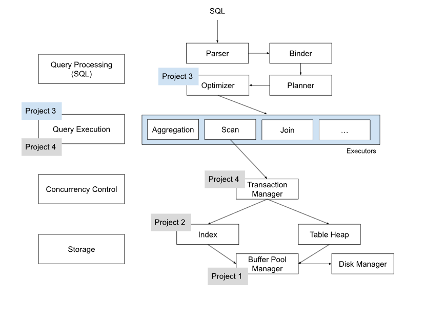
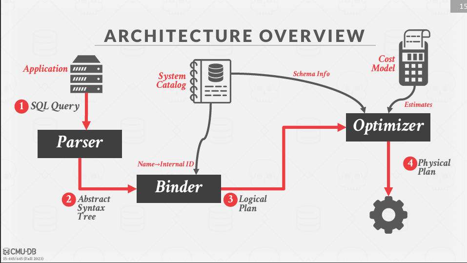
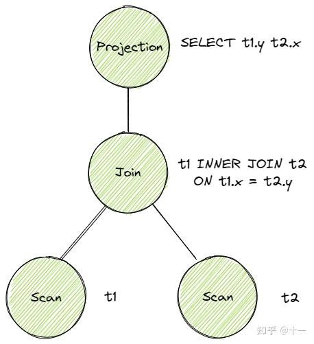
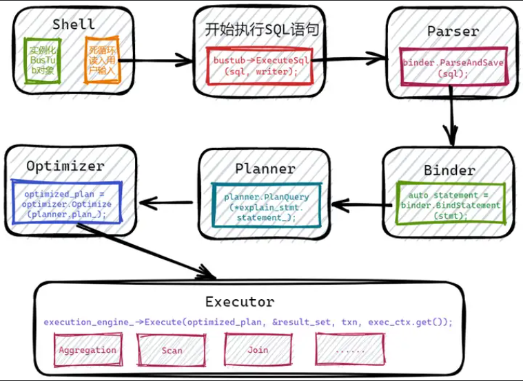
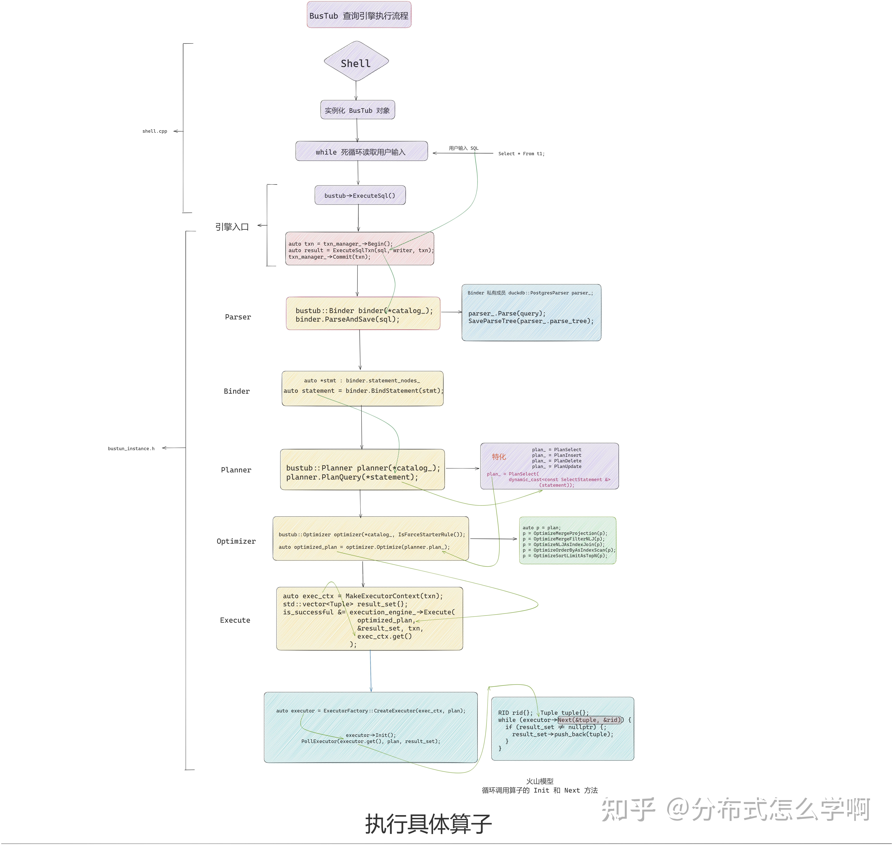
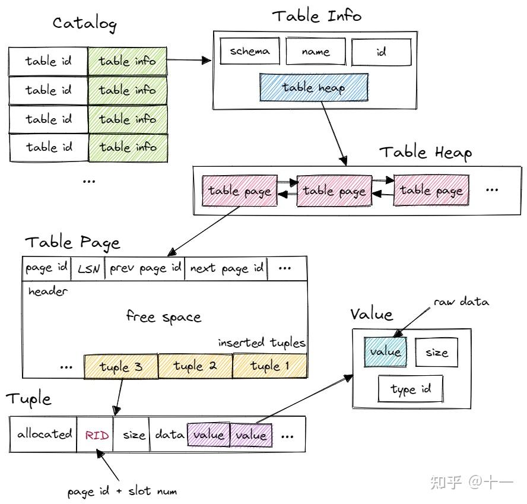
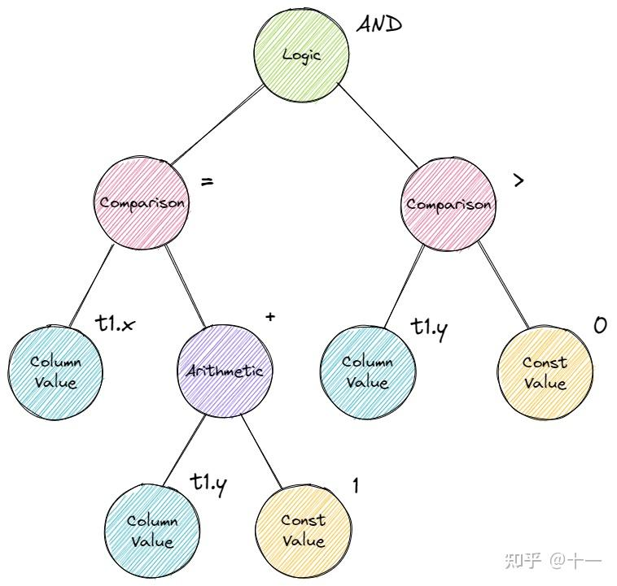

内容来自于：
十一大佬：https://zhuanlan.zhihu.com/p/587566135
迟先生： https://zhuanlan.zhihu.com/p/570917775

# 数据库到底是如何执行 sql 语句




SQL->Parser->Binder->Planner->Optimizer->Executors->....

**Parser:**

一条 sql 语句，首先经过 Parser 生成一棵抽象语法树 AST。此过程类似编译原理进行语法分析、词法分析等操作， 在 BusTub SQL 模块。Parser 利用第三方库 libpg_query 将 sql 语句 parse 为 AST。

**Binder**
在得到 AST 后，还需要将这些词语绑定到数据库实体上，这就是 Binder 的工作。例如有这样一条 sql：
```sql
SELECT colA FROM table1;
```
其中 SELECT 和 FROM 是关键字，colA 和 table1 是标识符。Binder 遍历 AST，将这些词语绑定到相应的实体上。实体是 Bustub 可以理解的各种 c++ 类。绑定完成后，得到的结果是一棵 Bustub 可以直接理解的树。把它叫做 Bustub AST。


通过 libpg_query 产生 Postgres AST 后，Binder 将会把这个 AST 改写成 BusTub 可以理解的一个更高级的 AST。在这个过程中，我们会将所有 identifier 解析成没有歧义的实体。我们以最简单的 select * 为例：
```sql
bustub> explain (binder) select * from __mock_table_1;
=== BINDER ===
BoundSelect {
  table=BoundBaseTableRef { table=__mock_table_1, oid=0 },
  columns=[__mock_table_1.colA, __mock_table_1.colB],
  groupBy=[],
  having=,
  where=,
  limit=,
  offset=,
  order_by=[],
  is_distinct=false,
}
```
Binder 会在 catalog 里面查 __mock_table_1 的信息，将 __mock_table_1 绑定到具体的实体表上 (table_oid=0)。与此同时，将 select * 中的 * 展开成可以查到的所有列。这就完成了整个 binding 的过程。

一个更复杂的例子：
```sql
bustub> explain (binder) select colC from (select * from __mock_table_2, __mock_table_3);
=== BINDER ===
BoundSelect {
  table=BoundSubqueryRef {
    alias=__subquery#0,
    subquery=BoundSelect {
      table=BoundCrossProductRef { left=BoundBaseTableRef { table=__mock_table_2, oid=1 }, right=BoundBaseTableRef { table=__mock_table_3, oid=2 } },
      columns=[__mock_table_2.colC, __mock_table_2.colD, __mock_table_3.colE, __mock_table_3.colF],
      groupBy=[],
      having=,
      where=,
      limit=,
      offset=,
      order_by=[],
      is_distinct=false,
    },
    columns=["__mock_table_2.colC", "__mock_table_2.colD", "__mock_table_3.colE", "__mock_table_3.colF"],
  },
  columns=[__subquery#0.__mock_table_2.colC],
  groupBy=[],
  having=,
  where=,
  limit=,
  offset=,
  order_by=[],
  is_distinct=false,
}
```
from 子句里面的 cross join 被绑定到了 BoundCrossProductRef 上，里面包含两个表。subquery 中的 * 被展开成了完整的列名 __mock_table_2.colC, __mock_table_2.colD, __mock_table_3.colE, __mock_table_3.colF。最外层的 colC 被解析成了 __subquery#0.__mock_table_2.colC。整个过程结束后，产生了一个没有歧义的 BusTub AST。这就是 binder 做的事情。

```md
这里的 BoundSelect 结构解释：
在这里，BoundSelect 表示经过绑定后的 SELECT 语句的信息。
解释输出的结构
外层 BoundSelect

外层 BoundSelect 描述了最外层的 SELECT 语句的信息：
+ table: 表示查询的目标表，这里是一个 BoundSubqueryRef，即子查询的结果集。
+ columns: 列表中的列名，这里是 ["__subquery#0.__mock_table_2.colC"]，表示选择了子查询结果集中名为 __mock_table_2.colC 的列。
+ groupBy, having, where, limit, offset, order_by, is_distinct: 这些字段分别表示 GROUP BY 子句、HAVING 子句、WHERE 子句、LIMIT 子句、OFFSET 子句、ORDER BY 子句以及是否为 DISTINCT 查询。

子查询 BoundSubqueryRef
+ alias: 子查询的别名，这里是 __subquery#0。
+ subquery: 子查询的详细信息，它本身也是一个 BoundSelect 对象。

子查询内的 BoundSelect

子查询内的 BoundSelect 描述了子查询的具体细节：
+ table: 表示查询的目标表，这里是一个 BoundCrossProductRef，表示两个表的笛卡尔积（交叉联接）。
+ columns: 列表中的列名，这里是 [__mock_table_2.colC, __mock_table_2.colD, __mock_table_3.colE, __mock_table_3.colF]，表示选择了所有列。
+ groupBy, having, where, limit, offset, order_by, is_distinct: 同上。

交叉联接 BoundCrossProductRef
+ left: 左侧的基表引用，这里是 BoundBaseTableRef { table=__mock_table_2, oid=1 }。
+ right: 右侧的基表引用，这里是 BoundBaseTableRef { table=__mock_table_3, oid=2 }。

总结
整个查询的过程是这样的：
1. 先进行一个子查询，该子查询将 __mock_table_2 和 __mock_table_3 交叉联接，并选择所有的列。
2. 然后，从这个子查询的结果集中选择 __mock_table_2.colC 列。
```

**Planner**
得到 Bustub AST 后，Planner 遍历这棵树，生成初步的查询计划。查询计划也是一棵树的形式。例如这条 sql：
```sql
ELECT t1.y, t2.x FROM t1 INNER JOIN t2 ON t1.x = t2.y;
```
对应的原始的查询计划是


查询计划规定了数据的流向。数据从树叶流向树根，自底向上地流动，在根节点输出结果。

关于BusTub的设计点：
+ 在 planner 和 binder 中使用两套表达式表示。两者表达式表示的最大区别是在引用列的方式上。Binder 中的表达式如果需要用一列，必须使用完整的列名。比如 __subquery#0.__mock_table_2.colC。Planner 中的表达式只能使用列的位置，比如 #0.1，也就是第 0 个孩子的第 1 列。RisingLight 里面最头大的一点就是把这两种表示混在了一起，导致 planning 时的代码容易出错。BusTub 的设计很好的解决了这个问题。
+ 不分 logical plan node 和 physical plan node。BusTub 的 SQL 层里面有 planner 和 optimizer。通常在这种设计中，planner 生成 logical plan node，然后通过 optimizer 框架做很多步优化产生 physical plan node。但是 BusTub 只是个教学项目，所以我们只有 physical plan node。Planner 会直接把 join plan 成 NestedLoopJoin，在 optimizer 里面改写成 HashJoin 或者 NestedIndexJoin。
  
**Optimizer**
由 Planner 得到初步的查询计划后，再将查询计划交给 Optimizer 进行修改优化，生成优化过后的最终查询计划。Optimizer 主要有两种实现方式：

1. Rule-based. Optimizer 遍历初步查询计划，根据已经定义好的一系列规则，对 PlanNode 进行一系列的修改、聚合等操作。例如我们在 Task 3 中将要实现的，将 Limit + Sort 合并为 TopN。这种 Optimizer 不需要知道数据的具体内容，仅是根据预先定义好的规则修改 Plan Node
2. Cost-based. 这种 Optimizer 首先需要读取数据，利用统计学模型来预测不同形式但结果等价的查询计划的 cost。最终选出 cost 最小的查询计划作为最终的查询计划。

BusTub optimizer 是一个 Rule-based 优化器。我们将不同的 Rule 按顺序应用到当前的执行计划上，产生最终的执行计划。比如下图利用谓词下推优化执行计划：

另外值得一提的是，一般来说，Planner 生成的是 Logical Plan Node，代表抽象的 Plan。Optimizer 则生成 Physical Plan Node，代表具体执行的 Plan。一个比较典型的例子是 Join。在 Planner 生成的查询计划中，Join 就是 Join。在 Optimizer 生成的查询计划中，Join 会被优化成具体的 HashJoin 或 NestedIndexJoin 等等。在 Bustub 中，并不区分 Logical Plan Node 和 Physical Plan Node。Planner 会直接生成 Physical Plan Node。

**Executor**
在拿到 Optimizer 生成的具体的查询计划后，就可以生成真正执行查询计划的一系列算子了。算子也是我们在 Project 3 中需要实现的主要内容。生成算子的步骤很简单，遍历查询计划树，将树上的 PlanNode 替换成对应的 Executor。算子的执行模型也大致分为三种

1. Iterator Model，或 Pipeline Model，或火山模型。每个算子都有 Init() 和 Next() 两个方法。Init() 对算子进行初始化工作。Next() 则是向下层算子请求下一条数据。当 Next() 返回 false 时，则代表下层算子已经没有剩余数据，迭代结束。可以看到，火山模型一次调用请求一条数据，占用内存较小，但函数调用开销大，特别是虚函数调用造成 cache miss 等问题。
2. Materialization Model. 所有算子立即计算出所有结果并返回。和 Iterator Model 相反。这种模型的弊端显而易见，当数据量较大时，内存占用很高。但减少了函数调用的开销。比较适合查询数据量较小的 OLTP workloads。
3. Vectorization Model. 对上面两种模型的中和，一次调用返回一批数据。利于 SIMD 加速。目前比较先进的 OLAP 数据库都采用这种模型。

Bustub 采用的是 Iterator Model。

此外，算子的执行方向也有两种：
1. Top-to-Bottom. 从根节点算子开始，不断地 pull 下层算子的数据。
2. Bottom-to-Top. 从叶子节点算子开始，向上层算子 push 自己的数据。

Bustub 采用 Top-to-Bottom。

在根节点算子处，就得到了我们想要查询的数据，一条 sql 语句完成了它的使命。

另外，我们在 Project 1 中实现的 Buffer Pool 和在 Project 2 中实现的 B+Tree Index 在哪里？实际上就在一系列算子下。例如 SeqScan 算子，需要遍历 table，首先通过数据库的 catalog 找到对应的 table，一个 table 由许多 page 组成，在访问 page 时，就用到了 Buffer Pool。在 Optimizer 中，假如发现 Sort 算子在对 indexed attribute 排序，会将 Sort 算子优化为 IndexScan 算子，这样就用到了 B+Tree Index。

**BusTub 查询引擎**
在实验三，测试数据的输入和输出都是以SQL的形式，在实验前还需要实际的观察下 BusTub 是如何接受一条 SQL 语句，并最终返回结果的。在讲义上提到我们可以实际的使用 BusTub shell 执行 SQL 语句，类似 Linux 中 bash 接受终端的一条语句运行。





可以看到调用：
```cpp
executor->Init();
PollExecutor(executor.get(), plan, result_set);
// 到下面        
    while (executor->Next(&tuple, &rid)) {
      if (result_set != nullptr) {
        result_set->push_back(tuple);
      }
    }
```
循环调用算子的Init和 Next

**TableInfo**
```cpp
/**
 * The TableInfo class maintains metadata about a table.
 */
struct TableInfo {
  /** The table schema */
  Schema schema_;
  /** The table name */
  const std::string name_;
  /** An owning pointer to the table heap */
  std::unique_ptr<TableHeap> table_;
  /** The table OID */
  const table_oid_t oid_;
};
```

schema就是数据库对象的集合，这个集合包含了各种对象如：表、视图、存储过程、索引等。

数据库中的数据是以表的形式存储的，对于每一个表都有其存储数据的格式，而 schema 就是规定一张表是如何存储数据的，如上图。而对于一个 tuple 而言，也就是每张表中的每一行数据实际上是由 value + schema组成的。总的来说，schema 指明了一个 tuple 中的 value 部分存储的是什么数据。更具体点，数据库输出了一个数字100，我需要直到100是什么意思，是100元呢？还是100分？这部分是由 schema 规定的。
其实就是列。schema则存了一串column，表示这张表有哪些列，column是列的名字（抬头）

table heap 是管理 table 数据的结构，包含 InsertTuple()、MarkDelete() 一系列 table 相关操作。table heap 本身并不直接存储 tuple 数据，tuple 数据都存放在 table page 中。table heap 可能由多个 table page 组成，仅保存其第一个 table page 的 page id。需要访问某个 table page 时，通过 page id 经由 buffer pool 访问。

table page 是实际存储 table 数据的结构，父类是 page。相较于 page，table page 多了一些新的方法。table page 在 data 的开头存放了 next page id、prev page id 等信息，将多个 table page 连成一个双向链表，便于整张 table 的遍历操作。当需要新增 tuple 时，table heap 会找到当前属于自己的最后一张 table page，尝试插入，若最后一张 table page 已满，则新建一张 table page 插入 tuple。table page 低地址存放 header，tuple 从高地址也就是 table page 尾部开始插入。

tuple 对应数据表中的一行数据。每个 tuple 都由 RID 唯一标识。RID 由 page id + slot num 构成。tuple 由 value 组成，value 的个数和类型由 table info 中的 schema 指定.

value 则是某个字段具体的值，value 本身还保存了类型信息。

需要注意的是，executor 本身并不保存查询计划的信息，应该通过 executor 的成员 plan 来得知该如何进行本次计算，例如 SeqScanExecutor 需要向 SeqScanPlanNode 询问自己该扫描哪张表。

所有要用到的系统资源，例如 Catalog，Buffer Pool 等，都由 ExecutorContext 提供。

**IndexInfo**
```cpp
/**
 * The IndexInfo class maintains metadata about a index.
 */
struct IndexInfo {
  /** The schema for the index key */
  Schema key_schema_;
  /** The name of the index */
  std::string name_;
  /** An owning pointer to the index */
  std::unique_ptr<Index> index_;
  /** The unique OID for the index */
  index_oid_t index_oid_;
  /** The name of the table on which the index is created */
  std::string table_name_;
  /** The size of the index key, in bytes */
  const size_t key_size_;
};
```
类似的IndexInfo 维护的是一个索引表的所有元数据（Metadata），比如该索引 key 所在表的名称，索引名称、索引唯一表示 id 等信息。

**catalog类**
```cpp
class Catalog{
  private:
  [[maybe_unused]] BufferPoolManager *bpm_;
  [[maybe_unused]] LockManager *lock_manager_;
  [[maybe_unused]] LogManager *log_manager_;
  /**
   * Map table identifier -> table metadata.
   *
   * NOTE: `tables_` owns all table metadata.
   */
  std::unordered_map<table_oid_t, std::unique_ptr<TableInfo>> tables_;
  /** Map table name -> table identifiers. */
  std::unordered_map<std::string, table_oid_t> table_names_;
  /** The next table identifier to be used. */
  std::atomic<table_oid_t> next_table_oid_{0};
  /**
   * Map index identifier -> index metadata.
   *
   * NOTE: that `indexes_` owns all index metadata.
   */
  std::unordered_map<index_oid_t, std::unique_ptr<IndexInfo>> indexes_;
  /** Map table name -> index names -> index identifiers. */
  std::unordered_map<std::string, std::unordered_map<std::string, index_oid_t>> index_names_;
  /** The next index identifier to be used. */
  std::atomic<index_oid_t> next_index_oid_{0};
};
```
Catalog 提供了一系列 API，例如 CreateTable()、GetTable() 等等。Catalog 维护了几张 hashmap，保存了 table id 和 table name 到 table info 的映射关系。table id 由 Catalog 在新建 table 时自动分配，table name 则由用户指定。系统的其他部分想要访问一张 table 时，先使用 name 或 id 从 Catalog 得到 table info，再访问 table info 中的 table heap。




## 阅读 官方为我们提供三个实现好的Executor
回答下面两个问题：
算子(executor)如何获取数据，BusTub如何描述算子？

BusTub以AbstractExecutor为抽象类，对于不同executor实现了不同了Executor类。Executor需要通过Catalog和PlanNode获取执行时需要的数据，而Executor通常具有Expression，用于进一步处理获取的数据。

BusTub如何存储表的数据，描述表的结构？

我们需要通过Catalog->TableInfo->TableHeap访问表的数据，实际的数据将存储在TablePage中。而BusTub用Schema描述表的结构，Schema由多个Column的组成。每张表存储了多个Tuple，Tuple的列值则被描述为Value


## Expresions

AbstractExpression 抽象了 sql 中的各种表达式，包括 ArithmeticExpression、ColumnValueExpression、ComparisonExpression、ConstantValueExpression 和 LogicExpression。这都是什么？看下面这条 sql：
```sql
SELECT * FROM t1 WHERE t1.x = t1.y + 1 AND t1.y > 0;
```
重点关注 WHERE 后的表达式 t1.x = t1.y + 1 AND t1.y > 0。看这下面这张图：



其实就是一颗表达式树。AbstractExpression 就是表达式树的节点。sql 中的所有表达式都会被 parse 为表达式树，在 Binder 中进行绑定。上面的 JOIN 中也存在表达式 t1.x = t2.x。

AbstractExpression 里最重要的方法就是 Evaluate()，返回值是 value。调用 Evaluate()，参数为 tuple 和 tuple 对应的 schema，返回从这个 tuple 中提取数据后代入表达式计算得到的结果。


