# Project #4 - Concurrency Control
## Overview

在这个项目中，你将通过实现乐观多版本并发控制（MVOCC）为 BusTub 添加事务支持。该项目包括四个任务、两个可选的加分任务和一个排行榜基准测试。

任务 #1 - 时间戳
任务 #2 - 存储格式和顺序扫描
任务 #3 - 多版本并发控制执行器
任务 #4 - 主键索引
★加分任务 #1 - 回滚★
★加分任务 #2 - 串行化验证★

该项目必须个人独立完成（即不允许组队）。在开始之前，请运行 git pull public master 并重新运行 cmake 以重新配置 Makefile。

## 项目规范
与之前的项目类似，我们提供了一些定义你必须实现的 API 的类。除非另有指示，否则不要修改这些类中预定义的函数签名或删除预定义的成员变量；否则，我们的测试代码将无法运行，你将不会获得项目的分数。你可以根据需要在这些类中添加私有辅助函数和成员变量。

该项目的正确性取决于你对项目 #1 和项目 #2 的实现。即使没有完全实现项目 #3，你也可以在这个项目中获得满分，因为我们将基于 MVCC 存储重写大多数访问方法执行器。完成任务 4.2 需要一个有效的顺序扫描到索引扫描优化规则。完成该项目的排行榜测试需要项目 #3 中的有效聚合执行器。我们不提供前几个项目的解决方案，除了在项目 #2 中提供的哈希表索引包装器。

在该项目中，你将在 BusTub 中实现多版本并发控制。相同的协议已在多个行业/学术系统中使用（[1], [2]）。存储模型类似于讲座中的增量表。我们在每个事务的私有空间（称为撤消日志缓冲区）中存储撤消日志增量。表堆中的元组及其对应的撤消日志形成一个单链表，称为版本链。

至少你需要实现事务的 **SNAPSHOT ISOLATION 隔离级别**。可选扩展是支持在加分任务 #2 中实现 SERIALIZABLE 隔离级别。一个测试用例中的所有事务将在同一隔离级别下运行。所有并发测试用例都是公开的，所有隐藏测试用例都在单线程中运行。在 Gradescope 上，你会找到每个测试用例的描述。

该项目有两个评分边界。

+ 如果你正确实现了 MVCC 协议，你将获得总计 80 分。在 80 分的评分边界内，只有一个并发测试用例。
+ 要进一步获得总计 100 分，你可能需要花费同样多的时间完成 80 分评分边界内的所有任务。
+ 要进一步获得 20 分的加分，你可能需要花费同样多的时间完成所有必需的任务。
+ 如果你还有一些延期天数，可以用于加分任务，但延期天数不适用于排行榜测试。


## Task #1 - Timestamps

在 BusTub 中，每个事务将被分配两个时间戳：读取时间戳和提交时间戳。在本任务中，我们将介绍时间戳是如何分配的，你需要实现事务管理器以正确地为事务分配时间戳。

### 1.1 时间戳分配
当一个事务开始时，它将被分配一个读取时间戳，该时间戳是**最新提交事务的提交时间戳**。在事务**提交时**，它将被分配一个**单调递增的提交时间戳**。读取时间戳决定了事务可以读取哪些数据，而提交时间戳决定了事务的序列化顺序。

我们将通过以下示例来解释读取时间戳。假设我们在表堆中有 4 个元组。

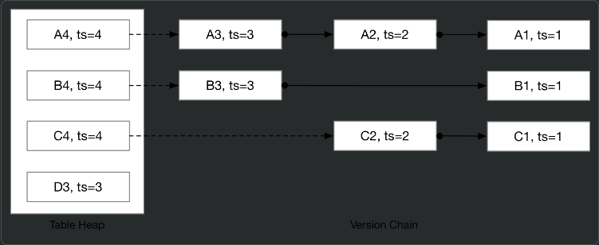

**读取时间戳**决定了当前事务可以看到的版本。例如，如果一个事务的读取时间戳为 3，它将看到 A3、B3、C2 和 D3。如果读取时间戳为 2，它将看到 A2、B1 和 C2。当一个事务开始时，**读取时间戳将是最新提交事务的时间戳**，这样事务就能看到在其开始之前提交的所有内容。

**提交时间戳**是事务提交的时间。它是一个 逻辑计数器 ，每次事务提交时增加 1。数据库管理系统（DBMS）在修改数据库中的元组时将使用事务的提交时间戳。例如，D3 元组是由提交时间戳为 3 的事务写入的。

在本任务中，你需要为事务分配正确的读取时间戳和提交时间戳。请参阅 TransactionManager::Begin 和 TransactionManager::Commit 以获取更多信息。我们已经提供了 TransactionManager::Abort 的起始代码，为了在任务 #1 中获得满分，你无需更改 Abort 中的任何内容。

### 1.2 Watermark 水印
水印是所有正在进行的事务中最低的读取时间戳。计算水印的最简单方法是遍历事务映射中的所有事务，找到所有正在进行的事务中的**最小读取时间戳**。然而，这种简单策略效率不高。在本任务中，你需要实现一个至少具有 O(log N) 时间复杂度的算法来计算系统中的读取时间戳水印。请参阅 watermark.h 和 watermark.cpp 以获取更多信息。**当事务开始、提交或回滚时**，你也需要调用 Watermark::AddTxn 和 Watermark::RemoveTxn。

有许多方法可以实现这一点：使用堆或使用 std::map。参考解决方案使用哈希表实现了一个均摊 O(1) 的算法。

你应该通过 TxnTimestampTest 测试套件中的所有测试用例。

### 解
#### 1.1 Timestamp Allocation

我们需要为事务赋予两个时间戳(ts)，分别是：read ts与commit ts.

理解了read ts和commit ts的关系后，你需要阅读src/include/concurrency/transaction_manager.h并修改src/concurrency/transaction_manager.cpp中的Being()和Commit(). 其中，你会用到last_commit_ts_成员，唯一需要注意的是：我们需要先获取last_commit_ts_ + 1作为当前txn的commit ts, 当前txn完成了对tuple ts更新后，再更新last_commit_ts_.

需要注意： atomic的使用，更新数据用 .store()

#### 1.2 Watermark

Watermark用来追踪所有处于RUNNING状态的最小txn read ts, 这将为Task3的GC提供支持。

我们需要实现
的算法，更新最小read ts.

事务提交后，应该从Watermark中移除read ts（RemoveTxn）
事务开启后，应该向Watermark中添加read ts（AddTxn）
关于Watermark的成员std::unordered_map<timestamp_t, int> current_reads_: 其表示RUNNING状态的txn read ts, 由于read ts为last commit ts，所以可能存在多个read ts. 因此current_reads_的value为read ts的数量。

你可能对Watermark.commit_ts_感到疑惑，该成员用来表示上一个提交的txn commit ts, 当没有read ts时，将返回commit_ts_. 此外还有一个验证逻辑的用处，我们将在begin txn时，调用AddTxn()，因此read ts一定>= commit_ts_, 否则就是系统的逻辑出现了问题。

你可以使用有序集合set维护最小read ts:

--current_reads_[read_ts] = 0时删除read ts到集合中
++current_reads_[read_ts] = 1时添加read ts到集合中

需要注意：当减为0时，记得清空
```cpp
  if(--current_reads_[read_ts] == 0){
    current_reads_.erase(read_ts);
    current_min_reads_.erase(read_ts);
  }
```

## Task #2 - Storage Format and Sequential Scan
BusTub 在三个地方存储事务数据：表堆、事务管理器和每个事务内部。表堆始终包含**最新的数据**，事务管理器的“页面版本信息”**存储指向下一个修改的指针**，而在每个事务内部，我们以称为**撤消日志的格式存储事务修改的元组**。要检索给定读取时间戳的元组，你需要 (1) 获取所有在给定时间戳之后发生的修改（即撤消日志），并 (2) 将这些修改（“撤消”撤消日志）应用于元组的最新版本，以恢复元组的过去版本。

这类似于我们在讲座中讨论的增量表存储模型，不同之处在于没有物理的“增量表”来存储增量记录。相反，这些记录存储在**每个事务的私有空间**中，不持久化到磁盘上，以简化实现并提高效率。

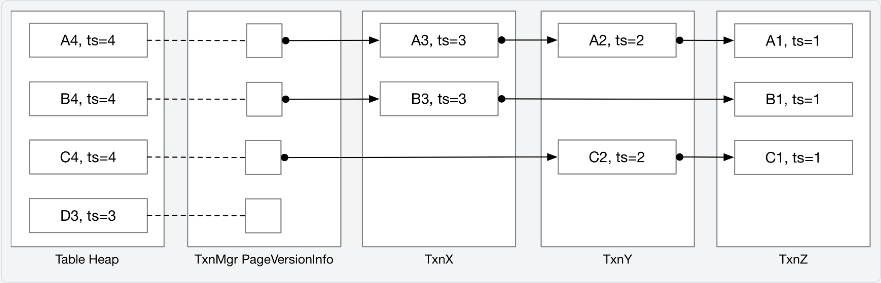

### 2.1 Tuple Reconstruction

在本任务中，你需要实现**元组重建算法**。你需要实现 ReconstructTuple 函数。该函数定义在 execution_common.cpp 文件中。在整个项目中，你会发现某些功能可以由系统中的不同组件共享，你可以将这些功能定义在 execution_common.cpp 中。

ReconstructTuple 函数接受存储在表堆中的**基元组和基元数据**，以及按添加到系统的时间降序排列的撤消日志列表。下面是一个重建元组的示例。

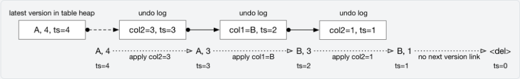

基元组始终包含完整数据。然而，撤消日志仅包含被操作修改的列。你还需要通过检查表堆和撤消日志中的 `is_delete` 标志来处理元组被删除的情况。

ReconstructTuple 函数将始终应用提供给该函数的所有修改，而不查看元数据或撤消日志中的时间戳。它不需要访问函数参数列表之外的数据。

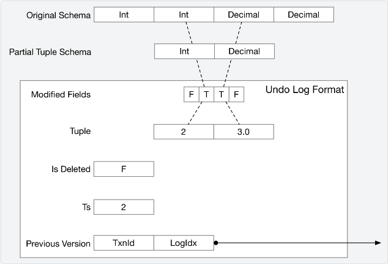

撤消日志包含部分更新。`modified_fields` 是一个布尔值向量，其长度与表模式相同。如果其中一个字段被设置为 `true`，则表示该字段已更新。`tuple` 字段包含部分元组。要从元组中检索值，你可能需要根据表模式和已修改的字段构建元组的部分模式。时间戳是此撤消日志对应的读取时间戳。我们还存储了指向下一个撤消日志的链接，如果这是链中的最后一个撤消日志，`TxnId` 将被设置为 `INVALID_TXN`。再次强调，你在 `ReconstructTuple` 中**不需要检查时间戳字段和前一个版本字段**。     

### 2.2 Sequential Scan / Tuple Retrieval

在本任务中，你需要重写你在项目 Project#3 中编写的顺序扫描执行器，以便根据事务的读取时间戳支持**从过去检索数据**。

顺序扫描执行器扫描表堆，**检索到事务读取时间戳为止的撤消日志**，然后重构将作为执行器输出的原始元组。在 MVCC 顺序扫描执行器中，你需要处理以下三种情况：

1. **表堆中的元组是最新的数据**：
   - 你可以通过比较表堆元组元数据中的时间戳和事务的读取时间戳来判断这一点。在这种情况下，顺序扫描执行器可以直接返回元组，或者如果元组已被删除，则跳过该元组。

2. **表堆中的元组被当前事务修改**：
   - 在 BusTub 中，**有效的提交时间戳范围**是从 0 到 `TXN_START_ID - 1`。如果表堆中的时间戳的最高位被设置为 1，这意味着该元组被某个事务修改，且该事务尚未提交。我们称这种时间戳为“事务临时时间戳”，它通过 `TXN_START_ID + txn_human_readable_id = txn_id` 计算得出。BusTub 中的第一个事务 ID 是 `TXN_START_ID`。这是一个非常大的数字，难以解读，因此我们可以通过去掉最高位来生成一个易读的 ID。在以下示例中，我们将使用 `txnX`，其中 `X` 是易读的 ID。**撤消日志中永远不会包含事务临时时间戳**（我们将在后续部分解释）。例如，如果当前事务的易读 ID 是 3，并且它扫描到一个时间戳为 `TXN_START_ID + 3` 的基元组，那么这个元组**被当前事务修改，应直接返回给用户**。否则，事务应恢复该元组的过去版本并返回给用户。

3. **表堆中的元组被另一个未提交的事务修改，或者比事务的读取时间戳更新**：
   - 在这种情况下，你需要遍历版本链，收集所有在读取时间戳之后的撤消日志，并恢复元组的过去版本。

为了使我们的说明更易于理解，下面示例中的 `TXN_START_ID` 将设置为 1000。因此，1009 表示元组包含 `txn9` 的未提交更新。

接下来，让我们看看以下示例，其中我们遍历版本链以收集撤消日志并构造用户请求的元组。

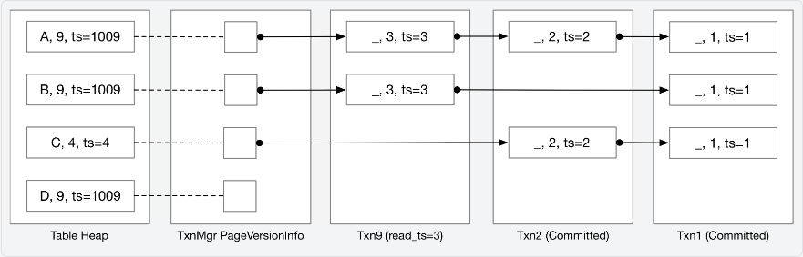

事务 9 尚未提交，读取时间戳为 3。事务 9 对表进行顺序扫描的结果将是：(A, 9)，(B, 9)，(C, 2)，(D, 9)。对于 (A, 9)，因为表堆中包含事务 9 的未提交更新，我们可以直接将其发送给父执行器。对于 (C, 2)，因为读取时间戳为 3，我们知道表堆中包含一个较新的更新，因此需要遍历版本链以恢复一个较旧的版本。

考虑另一个读取时间戳为 4 的事务。该事务的顺序扫描结果将是：(A, 3)，(B, 3)，(C, 4)。对于 (A, 3) 和 (B, 3)，表堆中包含一个待处理的更新，因此需要遍历版本链以获取时间戳 4 之前的最后一次更新。因为第一个撤消日志的时间戳为 3，这表明时间戳 4 之前的最后一次更新是在时间戳 3，所以我们只需要检索那一条。对于 (C, 4)，这是读取时间戳 4 时的最新更新。(D, 9) 是另一个事务的待处理更新，还没有版本链，因此不需要将其返回给用户。

要从表堆中获取到第一个撤消日志的链接，可以使用事务管理器中的 `GetUndoLink` 函数。还有一个名为 `GetVersionLink` 的函数，它返回更多关于版本链的信息，从任务 4.2 开始将会有用。

与测试用例相比，这个例子过于简化。在实现顺序扫描执行器时，你还需要考虑**空数据和其他数据类型**（不仅仅是整数）。

我们的测试用例将手动设置一些事务和表堆内容，因此你不需要实现插入执行器来测试你的顺序扫描实现。此时，你应该通过 `TxnScanTest` 中的所有测试用例。


### 解
#### 2.1 Tuple Reconstruction
根据undo log的bool数组，得到tuple的schema, 以获取Value. 用这些Value替换原tuple中的Value就能得到tuple的上一版本。

值得注意的是：你需要根据undo log的is_delete_以及TupleMeta的is_delete_判断此时重建是否成功。成功重建的情况有：
+ undo_logs为空但tuple没有被删除
+ undo_logs不为空且最后一个undo_log没有被删除(无需考虑tuple是否被删除)

在遍历undo logs时，你也无需考虑undo_log是否被删除，只需应用修改。
```cpp
auto ReconstructTuple(const Schema *schema, const Tuple &base_tuple, const TupleMeta &base_meta,
                      const std::vector<UndoLog> &undo_logs) -> std::optional<Tuple> {
  //   UNIMPLEMENTED("not implemented");
  // 元组重建算法,
  // 拿到原始数据
  std::vector<Value> values;
  for (uint32_t i = 0; i < schema->GetColumnCount(); ++i) {
    values.push_back(base_tuple.GetValue(schema, i));
  }
  for (auto &undo_log : undo_logs) {
    // 拿到当前 schema
    std::vector<uint32_t> clos;
    for (uint32_t i = 0; i < undo_log.modified_fields_.size(); ++i) {
      if (undo_log.modified_fields_[i]) {
        clos.push_back(i);
      }
    }
    Schema undo_schema = Schema::CopySchema(schema, clos);
    // 更新 schema位置的value
    for (uint32_t j = 0; j < undo_schema.GetColumnCount(); ++j) {
      values[clos[j]] = undo_log.tuple_.GetValue(&undo_schema, j);
    }
  }
  auto tuple = Tuple(values, schema);
  tuple.SetRid(base_tuple.GetRid());
  if ((undo_logs.empty() && !base_meta.is_deleted_) || (!undo_logs.empty() && !undo_logs.rbegin()->is_deleted_)) {
    return tuple;
  }
  return std::nullopt;
}
```
#### 2.2 Sequential Scan / Tuple Retrieval

修改project3中实现的 seqscan 算子，根据当前事务的 read_ts 和对应 tuple 的版本链，获取 undo_logs，对 table heap 中最新的 tuple 进行重构。

1. 首先判定 TableHeap 中的 tuple 是否可以直接使用，满足下面两个条件之一：
 + tuple的时间戳与当前事务临时时间戳相等
 + tuple的时间戳 <= 当前事务的读时间戳
2. 若不能直接使用，则需要从 UndoLogs 中重构Reconstruct​
 + 先获取对应 tuple 到第一个 undo log 的 undo link，如果 undo link 为空说明当前事务读不到该 tuple
 + 如果不为空则获取所有满足ts > read_ts的undo_log，以及一个满足ts <= read_ts的undo_log​
 + 如果不存在最后一个满足ts <= read_ts的undo_log，则说明读不到这个tuple，跳过
 + 调用上一个任务实现的ReconstructTuple​进行重构

需要注意的时，仍需要用expression检查 tuple；此时需要不判断 tuple的delete了，在 ReconstructTuple 会进行判断。

观察函数：
```cpp
void TxnMgrDbg(const std::string &info, TransactionManager *txn_mgr, const TableInfo *table_info, TableHeap *table_heap) {
  // always use stderr for printing logs...
  fmt::println(stderr, "debug_hook: {}", info);
   auto tuple_iter = table_heap->MakeIterator();
  while (!tuple_iter.IsEnd()) {
    const auto rid = tuple_iter.GetRID();
    auto tuple_pair = tuple_iter.GetTuple();
    const auto tuple = tuple_pair.second;
    const auto tuple_meta = tuple_pair.first;
    ++tuple_iter;
    // 先打印table_heap中的元组信息
    auto ts = tuple_meta.ts_;
    std::string ts_string;
    if (ts > TXN_START_ID) {
      ts = ts - TXN_START_ID;
      ts_string = fmt::format("txn{}", ts);
    } else {
      ts_string = fmt::format("{}", ts);
    }
    
    if (tuple_meta.is_deleted_) {
      fmt::println(stderr, "RID={}/{} ts={} <del marker> tuple={}", rid.GetPageId(), rid.GetSlotNum(), ts_string,
                   tuple.ToString(&table_info->schema_));
    } else {
      fmt::println(stderr, "RID={}/{} ts={} tuple={}", rid.GetPageId(), rid.GetSlotNum(), ts_string,
                   tuple.ToString(&table_info->schema_));
    }
    // 打印version chain
    // auto version_link = txn_mgr->GetVersionLink(rid);
    auto undo_link = txn_mgr->GetUndoLink(rid);
    if (undo_link.has_value()) {
      auto link = undo_link.value();
      while (link.IsValid()) {
        // 有可能事务被GC
        auto undo_log_opt = txn_mgr->GetUndoLogOptional(link);
        if (!undo_log_opt.has_value()) {
          break;
        }
        auto undo_log = undo_log_opt.value();
        auto txn_id = link.prev_txn_;
        if (txn_id > TXN_START_ID) {
          txn_id = txn_id - TXN_START_ID;
        }
        if (undo_log.is_deleted_) {
          fmt::print(stderr, "  txn{}@{} <del> ts={}\n", txn_id, link.prev_log_idx_, undo_log.ts_);
        } else {
          // 构建Undolog的tuple schema
          std::vector<uint32_t> modified_cols;
          for (uint32_t i = 0; i < undo_log.modified_fields_.size(); ++i) {
            if (undo_log.modified_fields_[i]) {
              modified_cols.push_back(i);
            }
          }
          Schema undo_schema = Schema::CopySchema(&table_info->schema_, modified_cols);
          fmt::print(stderr, "  txn{}@{} {} ts={}\n", txn_id, link.prev_log_idx_,
                     undo_log.tuple_.ToString(&undo_schema), undo_log.ts_);
        }
        link = undo_log.prev_version_;
      }
    }
  }
}
```

## Task #3 - MVCC Executors MVCC 执行器

在这一部分，你需要实现数据修改执行器，包括插入执行器、删除执行器和更新执行器。从这个任务开始，你的实现将不再兼容项目 3，因为我们只支持固定大小数据类型的模式。

### 3.1 插入执行器 Insert Executor

在这个项目的这个阶段，你的插入执行器实现应该与项目 #3 中的实现几乎相同。你可以简单地在表堆中创建一个新的元组。你需要正确设置元组的元数据。表堆中的**时间戳应设置为事务的临时时间戳**，如任务 2.2 所述。你不需要修改版本链接，该元组的下一个版本链接应为 nullopt，表示该元组没有先前的版本。你还应将 RID 添加到写集合中。下图展示了事务 txn9 向表中插入 (D, 3) 的过程。

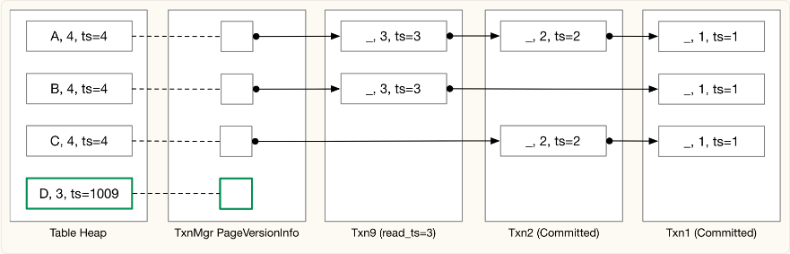

在启动代码中，我们提供了 UpdateTupleInPlace 和 UpdateUndoLink / UpdateVersionLink 函数，分别用于更新**表堆中的元组和版本链接**。这些函数将执行原子比较和更新操作，你需要提供一个检查函数。这两个函数的伪代码如下：
```cpp
UpdateVersionLink(rid, new_version_link, check_function) {
  获取表堆锁 / 版本链接锁
  从表堆 / 版本链接中检索数据
  调用用户提供的检查函数，如果检查失败，返回 false
  更新数据并返回 true
}
```
目前所有的测试用例都是单线程的，因此你可以在这里传递 nullptr 作为检查参数以跳过检查。从任务 4.2 开始，你可能需要实现检查逻辑，以检测在多个线程并发更新元组及其元数据 / 版本链接时的写-写冲突。

### 3.2 提交 Commit

一次只能有一个事务进入 Commit 函数，你应该使用 commit_mutex_ 在事务管理器中确保这一点。在这个任务中，你需要扩展事务管理器中的 Commit 实现，添加提交逻辑。你应该：

1. 获取提交互斥锁。
2. 获取一个提交时间戳（但不要增加最后提交的时间戳，因为提交时间戳的内容直到提交完成才会稳定）。
3. 遍历此事务更改的所有元组（使用写集合），将基础元组的时间戳设置为提交时间戳。你需要在所有修改执行器（插入、更新、删除）中维护写集合。
4. 将事务设置为已提交状态，并更新事务的提交时间戳。
5. 更新 last_committed_ts。

你应该已经在任务 1 中实现了上述大部分逻辑，现在需要添加遍历表的逻辑。

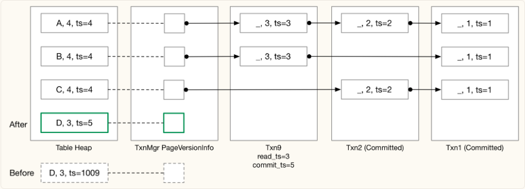

我们建议你实现一个调试函数 TxnMgrDbg，用于打印表堆内容和版本链。我们的测试用例将在每次重要操作后调用你的调试函数，你可以打印任何你想要检查版本链的内容。

交互式测试
你可以使用 BusTub shell 测试你的实现。

```sh
make -j`nproc` shell && ./bin/bustub-shell
bustub> CREATE TABLE t1(v1 int, v2 int);
bustub> INSERT INTO t1 VALUES (1, 1), (2, 2), (3, 3);
bustub> \dbgmvcc t1 -- 调用你的 `TxnMgrDbg` 函数以转储版本链
bustub> BEGIN;
txn?> INSERT INTO t1 VALUES (4, 4);
txn?> \txn -1
bustub> SELECT * FROM t1; -- 新插入的行对其他事务不可见
bustub> \txn ? -- 使用你之前看到的 ID
txn?> COMMIT;
```
你还可以使用 BusTub Netcat shell 启动一个带事务的交互式会话。为此，你需要安装 nc（netcat）。

```sh
make -j`nproc` nc-shell && ./bin/bustub-nc-shell
bustub> CREATE TABLE t1(v1 int, v2 int);
bustub> INSERT INTO t1 VALUES (1, 1), (2, 2), (3, 3);
bustub> \dbgmvcc t1 -- 调用你的 `TxnMgrDbg` 函数以转储版本链
# 在另一个终端
nc 127.0.0.1 23333
bustub> INSERT INTO t1 VALUES (4, 4);
# 在另一个终端
nc 127.0.0.1 23333
bustub> SELECT * FROM t1; -- 新插入的行对这个事务不可见
bustub> COMMIT;
```

我们还提供了一个参考解决方案，你可以在浏览器中运行它，访问 BusTub Web Shell。

从这个任务开始，所有测试用例都用 SQL 编写。只要你的 SQL 查询结果与参考输出匹配，你就能获得该测试用例的全部分数。我们不会检查你的版本链的确切内容，但会检查撤消日志的数量和表堆元组的数量，以确保你正确维护了版本链。

### 3.3 更新和删除执行器 Update and Delete Executor

在这个任务中，你需要实现生成撤消日志和更新表堆元组的逻辑。更新和删除执行器基本上是相同的（你可以在 execution_common.cpp 中实现共享部分），其中**更新执行器将元组的新版本放入表堆，而删除执行器在表堆中设置 is_delete 标志**。

在更新或删除元组之前，你需要**检查写-写冲突**。如果一个元组正在被未提交的事务修改，其他事务不允许修改它，如果它们这样做，就会发生写-写冲突，与前一个事务冲突的事务应被中止。另一种写-写冲突的情况是，事务 A 删除一个元组并提交，而另一个在 A 之前开始的事务 B 删除同一个元组（写入的时间戳大于读取时间戳）。当检测到写-写冲突时，事务状态应设置为 **TAINTED**，并且你需要抛出 ExecutionException 以标记 SQL 语句执行失败（ExecuteSqlTxn 返回 false 如果有执行异常）。目前，我们不要求你实现实际的中止逻辑。此任务的测试用例不会调用 Abort 函数。

你的更新执行器应实现为**管道中断器**：它应首先扫描子执行器中的所有元组到本地缓冲区，然后再写入任何更新。之后，它应从本地缓冲区拉取元组，计算更新后的元组，然后在表堆上执行更新。

目前所有的测试用例都是单线程的，因此你不需要过多考虑在更新 / 删除过程中可能出现的竞争条件。检测写-写冲突的**唯一条件**是检查基础元组元数据的时间戳。

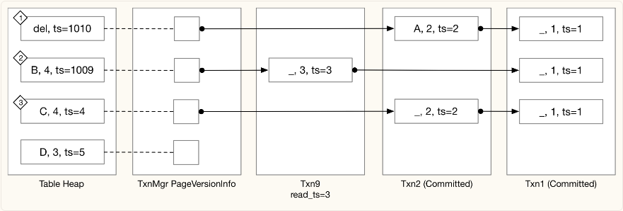


让我们通过上面的例子来说明。
在情况 (1) 中，事务 txn10 删除了 (A, 2) 元组但尚未提交。事务 txn9 仍然可以读取旧版本的元组 (A, 2)，因为读取时间戳是 3。在这种情况下，如果事务 txn9 需要更新 / 删除该元组，它应因写-写冲突而被中止。
在情况 (2) 中，如果其他事务尝试更新 / 删除该元组，它们将被中止。
在情况 (3) 中，另一个事务将 (C, 2) 更新为 (C, 4)，并设置了提交时间戳 4。事务 txn9 可以读取旧版本的元组 (C, 2)，但在更新 / 删除 (C, 4) 元组时应被中止，因为有一个在事务读取时间戳之后的新更新。

在检查写-写冲突后，你可以继续实现更新 / 删除逻辑。

1. 为修改创建撤消日志。对于删除，生成一个包含原始元组完整数据的撤消日志。对于更新，生成一个仅包含修改列的撤消日志。将撤消日志存储在当前事务中。如果当前事务已经修改了元组并有该元组的撤消日志，应更新现有撤消日志而不是创建新的。
2. 更新元组的下一个版本链接，使其指向新的撤消日志。
3. 更新表堆中的基础元组和基础元数据。

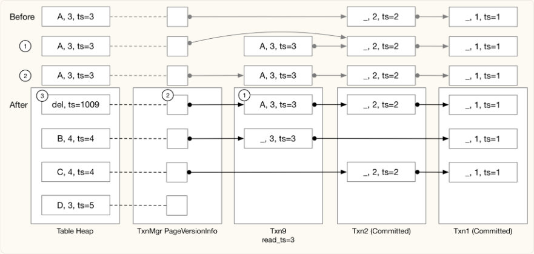
上图展示了删除操作的过程。

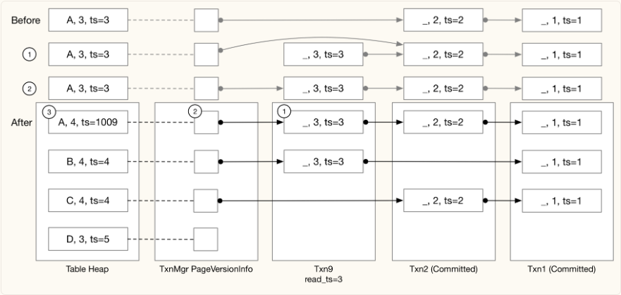
上图展示了更新操作的过程。

你的实现还需要考虑自修改，这应在检查写-写冲突之前完成。如果一个元组已经被当前事务修改，它可以由自身更新 / 删除，不应将其视为写-写冲突。如果元组是新插入的，不需要创建撤消日志。否则，一个事务最多为每个 RID 持有一个撤消日志。因此，如果一个事务两次更新同一个元组，你需要更新之前的撤消日志 / 仅更新表堆。

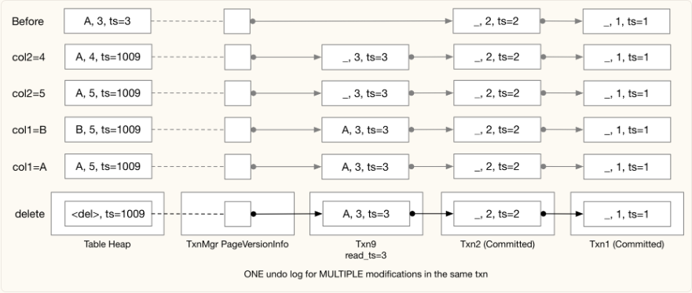

在这个例子中，事务 txn9 首先将元组更新为 (A, 4)，然后更新为 (A, 5)，接着更新为 (B, 5)，再次更新为 (A, 5)，最后删除它。在整个过程中，事务 txn9 为该条目始终保留一个撤消日志。注意，当我们从 (B, 5) 更新为 (A, 5) 时，尽管我们可以将撤消日志回退到部分更新 (_, 5)，但我们要求你保持撤消日志不变——只向撤消日志中添加更多数据而不移除数据，以便更容易处理并发问题。

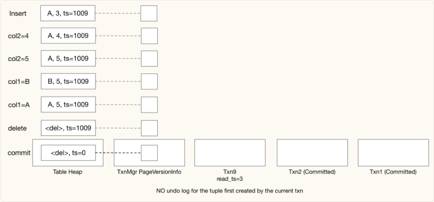

在上面的例子中，事务 txn9 插入了一个元组，进行了几次修改，然后删除了它。在这种情况下，你可以直接修改表堆中的元组，而无需生成任何撤消日志。

注意，我们在最后将时间戳设置为 0，因为这个元组是由 txn9 插入并由 txn9 删除的，这意味着它从未真正存在过。如果版本链中包含撤消日志，应将其设置为提交时间戳，以便具有较低读取时间戳的事务可以访问这些撤消日志。你也可以按照常规的提交逻辑将时间戳设置为提交时间戳。只要你在每个时间戳上都能读取正确的数据，这一点在奖励任务 #2 之前并不重要。

在生成撤消日志时，你会发现 Tuple::IsTupleContentEqual 和 Value::CompareExactlyEquals 非常有用。

在这个项目中，我们始终使用固定大小的类型，因此 UpdateTupleInPlace 应该总是成功，而不会抛出异常。

由于我们目前没有索引，所有元组仅通过 RID 进行标识，版本链的头部（在表堆中）只会有一个删除标记。撤消日志中不会有删除标记，因为一个元组在删除后不会在同一位置重新创建。因此，生成撤消日志时可以跳过许多情况。

综合起来，对于更新和删除操作，你应该：

1. 从子执行器获取 RID。
2. 生成更新后的元组（对于更新操作）。
3. 对于自修改：
    + 更新表堆中的元组。
    + 如果当前事务中已有撤消日志，则可选地更新该撤消日志。
4. 否则，生成撤消日志，并将它们链接在一起。

在这个阶段，你应该能够通过 TxnExecutorTest 测试，除了垃圾回收测试用例外。

### 3.4 “停止世界”垃圾回收  Stop-the-world Garbage Collection
在起始代码中，一旦我们将事务添加到事务映射中，就永远不会删除它，因为具有较低读取时间戳的事务可能需要读取先前已提交或已中止事务中存储的撤销日志。在这个任务中，你需要实现一个简单的垃圾回收策略来移除未使用的事务。

当调用GarbageCollection时，手动触发垃圾回收。测试用例**仅在所有事务暂停**时调用此函数。因此，在进行垃圾回收时，你不必过于担心竞争条件。在任务1中，我们已经实现了一个计算水位线（系统中的最低读取时间戳）的算法。在这个任务中，你需要移除所有不包含任何对具有最低读取时间戳（水位线）的事务可见的撤销日志的事务。

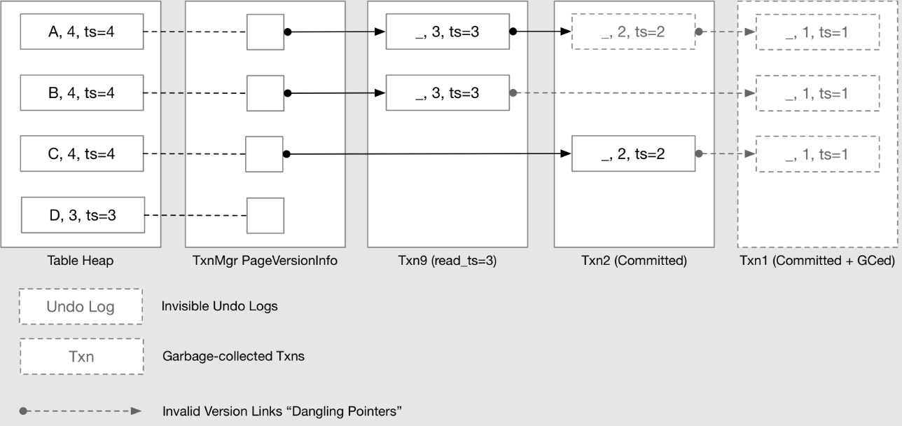

你需要遍历表堆和版本链，以确定仍可由任何正在进行的事务访问的撤销日志。如果一个事务已提交/中止，并且不包含对正在进行的事务可见的任何撤销日志，你可以直接从事务映射中移除它。

上述示例说明了水位线时间戳为3的情况，我们有txn1、txn2、txn9已提交。txn1的撤销日志不再可访问，因此我们可以直接移除它。txn2对于元组(A, 2)的撤销日志不可访问，但是元组(C, 2)仍然可访问，所以现在不能移除它。移除txn1后，将会有指向已移除撤销日志缓冲区的悬空指针，如虚线所示。你不需要更新之前的撤销日志来修改悬空指针并使其成为一个无效指针，让它保持原样是没问题的。如果你的实现一切正确，你的顺序扫描执行器将永远不会尝试追踪这些低于水位线的悬空指针。然而，我们仍然建议你在代码中添加一些断言，以确保这种情况永远不会发生。

此时，你应该能够通过TxnExecutorTest测试。

### 解

#### 3.1 插入执行器 Insert Executor
插入表堆，时间戳是当前事务的 txn_id,此时没有undo_log；

这一部分同样是修改 p3 实现的插入算子，不过需要增加的内容很少。
  1. 调用 table heap 的插入接口时带上事务临时时间戳作为Tuple的元数据
  2. 此时没有 undo log，设置 version link 为 null
  3. 将 rid 加入事务的 write set（在 Commit 阶段有用）

```cpp
  if (has_insert_) {
    return false;
  }
  has_insert_ = true;
  // 拿到待插入的表 和 indexes
  auto table_info = exec_ctx_->GetCatalog()->GetTable(plan_->GetTableOid());
  auto schema = table_info->schema_;
  auto indexes = exec_ctx_->GetCatalog()->GetTableIndexes(table_info->name_);

  int count = 0;
  while (child_executor_->Next(tuple, rid)) {
    count++;
    auto ts = exec_ctx_->GetTransaction()->GetTransactionId();
    // 插入并返回 rid
    auto insert_rid = table_info->table_->InsertTuple(TupleMeta{ts, false}, *tuple);
    if(!insert_rid.has_value()){
        continue;
    }
    RID new_rid = insert_rid.value();
    // 下一个 链表索引 为null
    this->exec_ctx_->GetTransactionManager()->UpdateVersionLink(new_rid, std::nullopt, nullptr);
    this->exec_ctx_->GetTransaction()->AppendWriteSet(plan_->GetTableOid(), new_rid);
    
    // 更新索引
    for (auto &index_info : indexes) {
      // 从元组中拿到索引,注意KeyFromTuple（基类schema，索引schema,attrs）
      auto key = tuple->KeyFromTuple(schema, index_info->key_schema_, index_info->index_->GetKeyAttrs());
      index_info->index_->InsertEntry(key, new_rid, exec_ctx_->GetTransaction());
    }
  }
  std::vector<Value> res = {Value(INTEGER, count)};
  *tuple = Tuple(res, &GetOutputSchema());
  return true;
```

#### 3.2 提交 Commit
在insert中，我们更新事务的write_set,就是将基础元组加进去；

BusTub 框架已经帮我们实现了绝大部分代码，我们实际上只需实现第三步即可

1. 获取提交互斥锁。
2. 获取一个提交时间戳（但不要增加最后提交的时间戳，因为提交时间戳的内容直到提交完成才会稳定）。
3. 遍历此事务更改的所有元组（使用写集合），将**基础元组的时间戳**设置为提交时间戳。你需要在所有修改执行器（插入、更新、删除）中维护写集合。
4. 将事务设置为已提交状态，并更新事务的提交时间戳。
5. 更新 last_committed_ts。

遍历txn的write_set_, 根据RID更新TupleMeta: 将表示txn id的ts设置为commit ts.

需要注意的是：你不应该修改TupleMeta的is_delete_状态


#### 3.3 更新和删除执行器 Update and Delete Executor

ts判断其是否正在被其他事务修改`(tuple ts >= TXN_START_ID && tuple ts != txn id)`，或是已经被未来的事务修改(`read ts < tuple ts < TXN_START_ID`)。如果满足了以上条件，则发生了写写冲突，我们需要终止当前事务(throw ExecutionException)。相当于： `tuple ts != txn id && read ts < tuple ts`

思路：
目前我们的 Inser t算子并没有考虑主键索引，table heap 中当原 Tuple 被删除后就一直保留着，插入操作每次都会写入一个新的位置，因此 Update 操作不会遇到当前 tuple 已被删除以及版本链中有删除日志（is_deleted​字段为 true）的情况，所以要考虑的情况不怎么复杂。

在获取 update_tuple （更新后的 Tuple）后，执行步骤为：

1. 检测写写冲突：heap_tuple_ts > txn_read_ts && heap_tuple_ts != txn_id​
    + 当前tuple最新时间戳大于事务读时间戳（当前事务读不到最新数据）并且不等于当前事务时间戳（不是self modification）
    + 检测出冲突后，直接将事务设置为Tainted​，并抛出异常

2. 如果不是self modification（heap_tuple_ts != txn_id​）
    + 生成新的undo log，特别注意这个 undo log 包含的数据都是当前 heap_tuple 中被更新的字段数据（即旧数据），并且时间戳也是​heap_tuple_ts​，而不是当前事务id（要加深对于 undo log 和重构过程的理解）
    + 将 new undo log 的 prev version 指向当前头部的 undo link
    + 将 undo link 指向 new undo log
    + 更新 table heap
  
3. 如果是 self modification，则要分情况讨论：

    + 如果 Undo link 不为空，说明不是本事务新插入的，但是本事务已经做了修改，已经生成了一个 undo log，但本次 update 可能又更新了几个新字段，此时原来的 undo log 不再适用，要把新字段的旧数据加入进来（undo log 中原有的数据保留不变）
    + 如果Undo link为空，说明是本事务新插入的，只需要修改 table_heap 即可

4. 将目标tuple的rid加入write set

因为updata和delete代码重复率很高，而且代码很长，所以尽量分块写成函数，然后放到 `execution_common`中；

这里要求实现 管道中断器，即在 Init就把所有的tuple拿到,在拿tuple的过程中就可以判断写写冲突了：
```cpp
  while (child_executor_->Next(&child_tuple, &child_rid)) {
    auto meta = table_info_->table_->GetTupleMeta(child_rid);
    auto heap_tuple_ts = meta.ts_;
    auto txn_read_ts = exec_ctx_->GetTransaction()->GetReadTs();
    auto txn_id = exec_ctx_->GetTransaction()->GetTransactionTempTs();
    /* 检查写写冲突：
    1.  正在被其他事务修改
    2.  已经被未来的事务修改*/
    if((heap_tuple_ts >= TXN_START_ID && heap_tuple_ts != txn_id) ||
    (txn_read_ts < heap_tuple_ts && heap_tuple_ts < TXN_START_ID)){
        exec_ctx_->GetTransaction()->SetTainted();
        throw ExecutionException("Write-write conflict detected");
    }
    buffer_.emplace_back(child_tuple, child_rid);
  }
```

Next就要判断是不是自我修改了：
如果是：不是本事务新插入的，但是本事务已经做了修改，此时需要重新生成一个 undolog：
```cpp
  for (unsigned column_idx = 0; column_idx < schema->GetColumnCount(); column_idx++) {
    if (old_log.modified_fields_[column_idx]) {
      // 原始修改过这个列则报保存
      modified_fields.push_back(true);
      Schema log_tuple_schema = GetSchemaFromModifiedFields(old_log.modified_fields_, schema);
      modified_values.push_back(old_log.tuple_.GetValue(&log_tuple_schema, log_tuple_column_id++));
      schema_copy_attrs.push_back(column_idx);
    } else if (!old_tuple.GetValue(schema, column_idx).CompareExactlyEquals(new_tuple.GetValue(schema, column_idx))) {
      // 新修改了列，需要添加进来
      modified_fields.push_back(true);
      modified_values.push_back(old_tuple.GetValue(schema, column_idx));
      schema_copy_attrs.push_back(column_idx);
    } else {
      modified_fields.push_back(false);
    }
  }
  Schema modified_tuple_schema = Schema::CopySchema(schema, schema_copy_attrs);
```

如果：不是self modification，生成新的undo log
```cpp
 for (unsigned column_idx = 0; column_idx < schema->GetColumnCount(); column_idx++) {
    if (!old_tuple.GetValue(schema, column_idx).CompareExactlyEquals(new_tuple.GetValue(schema, column_idx))) {
      modified_fields.push_back(true);
      modified_values.push_back(old_tuple.GetValue(schema, column_idx));
      schema_copy_attrs.push_back(column_idx);
    } else {
      modified_fields.push_back(false);
    }
  }
  Schema modified_tuple_schema = Schema::CopySchema(schema, schema_copy_attrs);
```

> Delete 算子逻辑是类似的，需要注意的是，delete 操作生成的 undo log 要包含旧数据的所有字段。

#### 3.4 “停止世界”垃圾回收  Stop-the-world Garbage Collection
思路：
  + 当所有的事务停止时，将自动触发GC垃圾收集。我们需要根据Task1实现的Watermark获取最小read ts. 接着遍历table heap, 获取tuple的RID. 通过RID获取tuple的VersionLink(GetUndoLink()), 你需要遍历tuple的undo log, 如果undo log ts < watermark, 将undo log的is_delete置为true.

  + 最后通过txn_map_遍历所有txn，如果txn的所有undo log被删除，则将txn从txn_map_中移除. 但是你不能删除未提交(COMMITTED)的txn

  + 值得注意的是：移除txn将导致UndoLink指向不存在的undo log, 即产生悬空指针。你应该调用GetUndoLogOptional()，通过返回值是否有效来判断是否产生了悬空指针。

参考上面的思路，并记住：如果一个事务已提交/中止，并且不包含对正在进行的事务可见的任何撤销日志，你可以直接从事务映射中移除它。

## Task #4 - Primary Key Index 主键索引
BusTub 支持主键索引，可以以下述方式创建：

```sql
CREATE TABLE t1(v1 int PRIMARY KEY);
CREATE TABLE t1(v1 int, v2 int, PRIMARY KEY(v1, v2));
```
当在创建表时指定了主键，BusTub 将自动创建一个其 is_primary_key 属性设置为 true 的索引。一个表最多有一个主键索引。主键索引确保了主键的唯一性。在这个任务中，你需要处理执行器中的主键索引。测试用例不会使用 CREATE INDEX 创建次级索引，因此在这个任务中你不需要维护次级索引

### 4.0 Index Scan 索引扫描

目前你不需要实现 MVCC 索引扫描执行器。这是针对任务 4.2 及以上的内容。我们的测试用例将使用范围查询而非等值查询以避免顺序扫描到索引扫描规则被触发，这样当你实现任务 4.1 时，顺序扫描不会被转换成索引扫描。

### 4.1 Inserts 插入
你需要修改你的插入执行器以**正确处理主键索引**。同时，你也需要考虑多个事务在多个线程中插入相同主键的情况。带索引的插入可以通过以下步骤完成：

1. 首先，检查元组是否已存在于索引中。如果存在，则终止事务。
    + 这仅适用于任务 4.1。如果你打算实现任务 4.2，那么索引可能指向一个已被删除的元组，在这种情况下，你不应终止事务。
    + 在任务 4 中，你只需要将事务状态设置为 TAINTED。TAINTED 意味着事务即将被终止，但数据尚未清理。你不需要实现实际的终止过程。被标记为 TAINTED 的事务将在表堆中留下一些元组，而你无需清理它们。**当另一个事务尝试插入同一个位置并检测到写-写冲突时，由于元组尚未被清理，它仍然应该被视为冲突**。在将事务设置为 TAINTED 状态后，你还需抛出一个 ExecutionException 以便 ExecuteSql 返回 false，从而使测试用例知道事务/SQL 被终止。
2. 然后，在表堆上使用**事务临时时间戳**创建一个元组。
3. 之后，将元组插入索引。如果你的哈希索引违反了唯一键约束，应该返回 false。在步骤 (1) 和 (3) 之间，可能存在其他事务正在做同样的事情，并且在当前事务能够创建索引项之前，新的条目已经被创建在索引中。在这种情况下，你需要终止事务，并且表堆中将存在一个未被任何索引条目指向的元组。

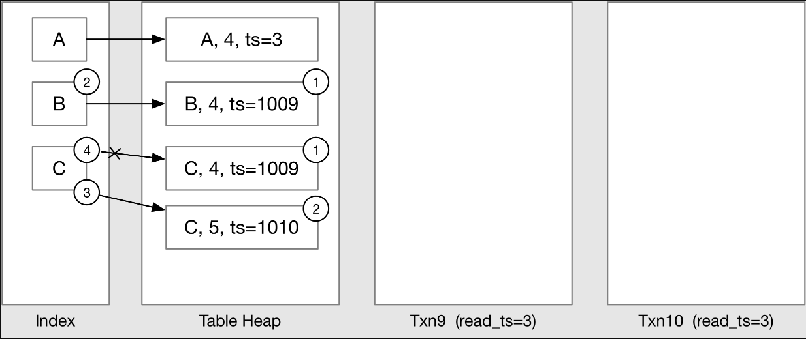

在这个例子中，让我们分别通过事务 txn9 插入 A、B、C。假设元组的第一列是主键。从这个例子开始，我们将不再显示图中的版本页信息结构。

+ 插入 A：键已经存在于索引中，违反了主键的唯一性要求，因此终止事务。
+ 插入 B：由于索引中没有冲突，首先在表堆中创建一个元组，然后将新创建的元组的 RID 插入索引。
+ 插入 C：假设还有另一个事务 10 正在做同样的事情。Txn9 首先在索引中检测到没有冲突，并在表堆中创建了一个元组。然后，在后台，Txn10 完成了 (2) 和 (3)，即创建了一个元组并更新了索引。当 txn9 在步骤 (4) 尝试将数据插入索引时，将发生冲突，因此 txn9 应该进入 TAINTED 状态。

此时，我们将在本项目中进行第一次并发测试用例，测试你的实现是否能够在多个线程插入相同键时正确工作。

> 此时，你应该已经获得了 80 分。只有在 80 分边界有一个并发测试用例和一个隐藏测试用例。在回来争取 100 分之前，你应该关注生活中的其他重要事情。接下来的 20 分可能会花费与所有先前分数相同的时间，因为有更多的并发测试用例和隐藏测试用例。

#### 解
根据文档的步骤，重构insert：
```cpp
   std::vector<RID> result;

    if (primary_key_index_ != nullptr) {
      primary_key_index_->index_->ScanKey(
          child_tuple.KeyFromTuple(table_info_->schema_, primary_key_index_->key_schema_,
                                   primary_key_index_->index_->GetKeyAttrs()),
          &result, exec_ctx_->GetTransaction());
      if (!result.empty()) {
        exec_ctx_->GetTransaction()->SetTainted();
        throw ExecutionException("insert: tuple already in index");
      }
    }
    // 没有索引冲突，直接插入
    TupleMeta tuple_meta;
    tuple_meta.ts_ = exec_ctx_->GetTransaction()->GetTransactionTempTs();
    tuple_meta.is_deleted_ = false;

    auto temp_rid = table_info_->table_->InsertTuple(tuple_meta, child_tuple);
    if (temp_rid.has_value()) {
      if (primary_key_index_ != nullptr) {
        auto insert_key_success = primary_key_index_->index_->InsertEntry(
            child_tuple.KeyFromTuple(table_info_->schema_, primary_key_index_->key_schema_,
                                     primary_key_index_->index_->GetKeyAttrs()),
            child_rid, exec_ctx_->GetTransaction());
        // 插入索引，如果失败
        if (!insert_key_success) {
          table_info_->table_->UpdateTupleMeta({tuple_meta.ts_, true}, temp_rid.value());
          exec_ctx_->GetTransaction()->SetTainted();
          throw ExecutionException("insert: inserting key fails");
        }
      }
      // 插入成功
      exec_ctx_->GetTransactionManager()->UpdateUndoLink(temp_rid.value(), UndoLink{}, nullptr);
      exec_ctx_->GetTransaction()->AppendWriteSet(table_info_->oid_, temp_rid.value());
      status = child_executor_->Next(&child_tuple, &child_rid);
      count_++;
```

写到这里已经拿到 80 分了，4.2和4.3暂时不做了，后面再补
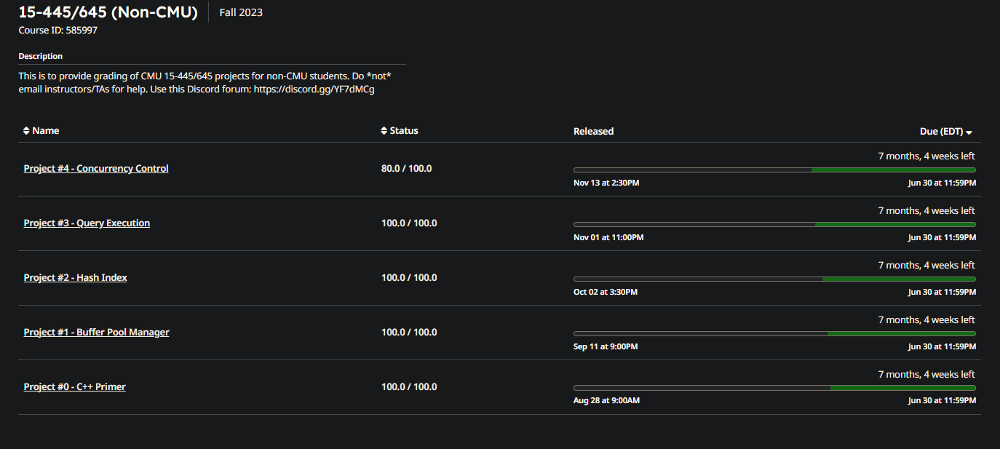


### 4.2 Index Scan, Deletes and Updates 索引扫描、删除和更新
在这个任务中，你需要为删除和更新执行器添加索引支持。你首先需要实现**多版本索引扫描执行器**，然后为**插入、更新和删除**执行器实现更新和删除的支持。

一旦索引中创建了一个条目，它将始终指向相同的RID，并且即使元组被标记为已删除也不会被移除，这样早期的事务仍然可以使用索引扫描执行器访问历史记录。此时，你也需要重新审视你的插入执行器。考虑插入执行器向已被删除执行器移除的元组插入的情况。你的实现应当更新被删除的元组而不是创建一个新的条目，因为一旦创建，索引条目总是指向相同的RID。你需要正确地处理写-写冲突检测和唯一性约束检测。

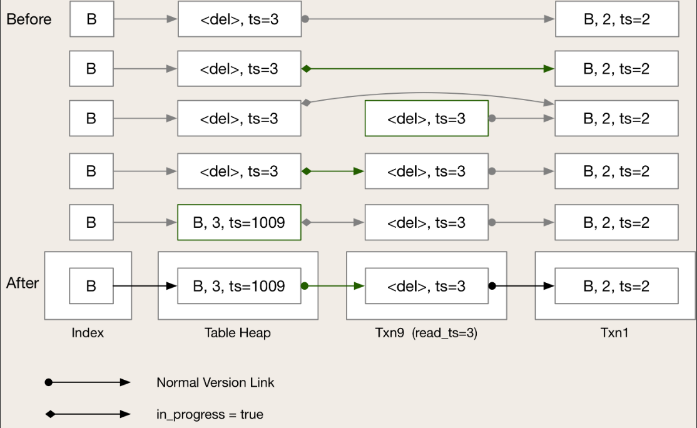

在这个例子中，元组 (B, 2) 已经被事务 txn1 删除。当一个元组被删除时，我们并不会从索引中移除条目，因此索引可能指向一个删除标记，并且一旦存在就会始终指向相同的RID。当事务 txn9 使用插入执行器将 (B, 3) 插入表中时，它不应该创建一个新的元组。相反，它应该更新删除标记到插入的元组，就像这是一个更新操作一样。

此时，你也需要考虑其他竞争条件。例如，如果多个事务同时更新版本链接。你应该正确地中止其中的一些事务，并让其中一个事务继续进行而不丢失任何数据。在版本信息页面中，我们有一个 in_progress 字段，指示是否有正在进行的事务处理该元组。从这个任务开始，你需要使用这个字段来避免竞争条件。另外，你会注意到，在上述示例的第二次更改中，有一小段时间表堆中包含一个与第一个撤销日志具有相同时间戳的元组。在实现了更新和删除之后，你的顺序扫描执行器也应当能够正确处理这种情况。


### 4.3 Primary Key Updates

使用索引更新的一个边缘情况是当主键被更新时。在这种情况下，更新应该作为对原始键的删除和对新键的插入来实现。

让我们来看一个例子，我们执行 UPDATE table SET col1 = col1 + 1，其中 col1 是主键。在进行实际更新之前，事务 txn9 首先将 (2, B) 插入表中，如下所示。

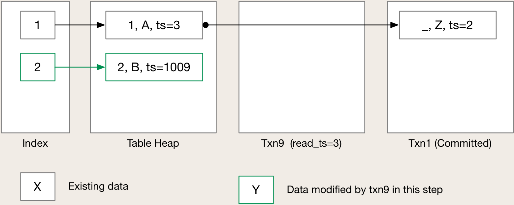

现在我们开始更新表，设置 col1 = col1 + 1，这里我们首先删除所有将要被更新且主键发生变化的元组。

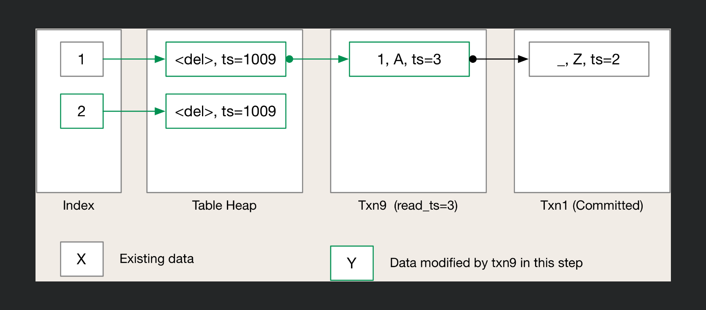

接下来，我们将更新后的元组重新插入表中。
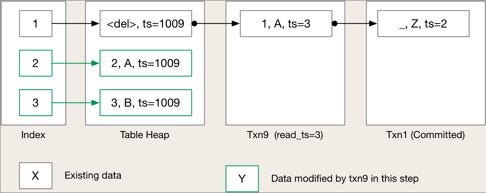

最后，提交更改。
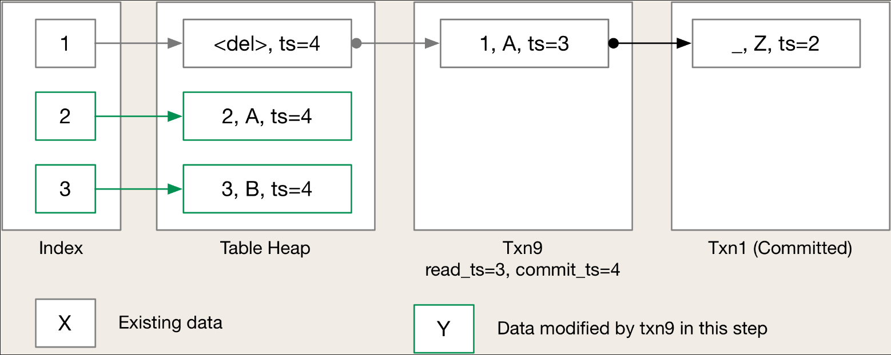

在这个项目的这一点上，你应该在 Gradescope 测试中获得 100 分。这是一个重要的成就，你可能想要在回来争取额外分数之前处理生活中的其他事情。接下来的 20 分将会非常难以获得正确，因为我们不会再像以前那样引导你经历所有可能的情况（你需要自己思考），并且大多数测试用例都是并发的。你已经被警告过了。


