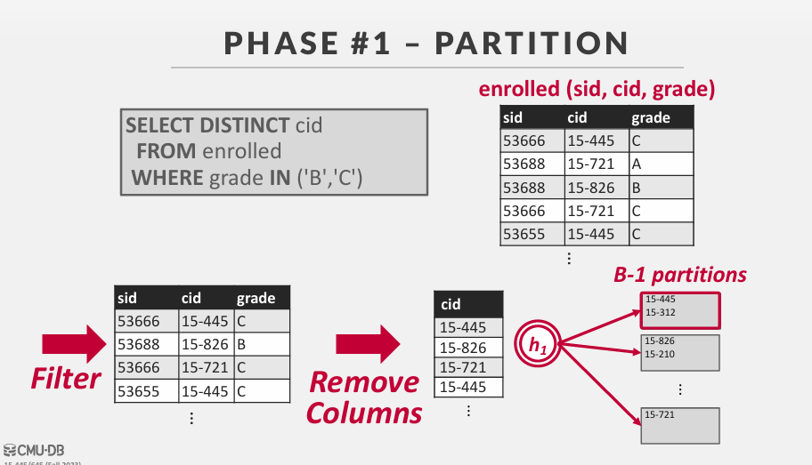

对应ppt ： 10-sorting

Top-N Heap Sort
External Merge Sort
Aggregations

## 1. top-N heap sort
```sql
SELECT * FROM enrolled
ORDER BY sid
FETCH FIRST 4 ROWS
WITH TIES
```
FETCH FIRST 4 ROWS WITH TIES：
+ 选择排序后的前 4 行，并且包括与第 4 行具有相同 sid 值的行。

上面这个sql语句，选择根据 sid 排序后的前4小的 tuple；如果不加 WITH TIES 则只是取单独的前4个 tuple。

这里的实现就是用一种 堆排序，取前四个小的 tuple，当有相同的sid时则加入堆，如果堆满了，则扩充堆容量。


## 2. external merge sort

当数据量远超内存容量时，如何进行排序呢？

这种算法被称为 外部存储器算法，基本思想就是分治。

分治算法，将数据分成单独的运行，单独排序，然后将它们组合成更长的排序运行。

阶段#1 -排序
→对适合内存的数据块进行排序，然后将排序后的数据块写回磁盘上的文件。
阶段#2 -合并
→将已排序的运行合并成更大的块。

存储的结构: key/valie pairs,我们知道索引结构存储的是(key, rid)

假如：我们有N个页，缓冲池的大小为B，N远大于B；现在需要对页进行排序
过程如下：
pass #0
+ 读取每一个页到内存中；
+ 然后对页的内容进行排序，然后写回磁盘
+ 重复此操作，知道整个 表都已经被排序完成
pass #1,2,3...
+ 递归地将成对的运行合并为两倍长的运行
+ 至少需要3个缓冲页（2个用于输入，1个用于输出）


用上面这种图来解释一下：此时 N=7(表有7个页的大小) B=3(缓冲池大小3个页)；
pass #0: 讲每一页内容加入到内存，进行排序，排序完后写回磁盘；此时所有的页内部都已经排序完成
pass #1：读取两个页到缓冲池，此时缓冲池还剩余一个空闲页，而这个页就是用来输出的。用两个指针分别指向页1和页2的开始，即最小值。比较两个值的大小，较小的填入到另外一个空闲页，当空闲页满的时候，就写入到磁盘。然后继续比较，填入到页中，再写入磁盘。这个时候就完成了两个页的排序。然后依次对剩余的页进行此过程。此时每两个页的内容都是排序好的。分成4块区域
pass #2：分别读取两块区域的一个页到缓冲池中，然后比较这两个页，然后输出。当一个页比较完了，继续读取下一个页，知道两个区域的页全部读取完。这个时候每4个页之间都已经排序完成。
pass #3: 后面的过程都和上面一样。每次比较两个区域，然后输出。

假如我们缓冲池有很多页：
+ 在pass 0 我们可以一次加载B个页排序
+ 然后一次合并 B-1个页，一个页用来输出。


**double buffering**
上面讲的合并排序，我们知道是顺序执行的。即磁盘读page，然后cpu进行排序。即每个时刻 磁盘和cpu只有一个是运行的。
而双缓冲池可以使得 每一时刻 磁盘和cpu都是运行的。

我们把缓冲池分为两部分，即当某一时候 第一部分缓冲池 cpu进行着排序的时候，而第二部分缓冲池则从磁盘中读取数据，当第一部分缓冲池执行完毕，cpu来执行第二部分，然后第一部在从磁盘读取数据。

虽然这个过程减少了每一次排序的B，但是也减少了相应时间。


**comparison ooptimazations**
比较器优化：
方法1：代码专门化
不提供比较函数作为指向排序算法的指针，而是创建一个特定于键类型的sort的硬编码版本。
比如说c++中的 模板，对于特定的key类型，编写特定的 comparison 实例版本

方法2：后缀截断
首先比较长VARCHAR键的二进制前缀，而不是较慢的字符串比较。如果前缀相等，则退回到较慢的版本。
假如 键值是一个字符串，如果比较字符串大小是要循环的，此时可以利用这种方法。

## 3. AGGREGATIONS 聚合

聚合（Aggregation）是指对数据集执行数学运算以获得单个值的过程。聚合通常用于汇总数据，以便了解数据集的整体特征。聚合操作可以用于计算诸如计数（COUNT）、总和（SUM）、平均值（AVG）、最大值（MAX）、最小值（MIN）等统计数据。


将多个元组中的单个属性的值折叠为单个标量值。
DBMS需要一种方法来快速查找具有相同区分属性的元组
分组。
两种实现选择：
→排序
→哈希

1. 排序：


2. 哈希
如果我们不需要对数据进行排序怎么办？
→在GROUP BY中形成组（无排序）
→在DISTINCT中删除重复项（无顺序）
在这种情况下，散列是一个更好的选择。
→只需要移除重复项，无需排序。
→在计算上比排序更简便。

过程如下：
阶段#1 -分区
+ 根据哈希键将元组划分为桶
+ 当它们满了的时候，把它们写到磁盘上


阶段#2 -重新哈希
+ 为每个分区构建内存哈希表并计算聚合

phase #1: partition 
使用散列函数h1将元组拆分为磁盘上的多个分区。
+ 一个分区是一个或多个包含具有相同哈希值的键集的页面。
+ 分区通过输出缓冲区“溢出”到磁盘

假设我们有B个缓冲区。
我们将为分区使用B-1缓冲区，为输入数据使用1个缓冲区



对于无法一次性装入内存的大型文件，需要将其分割成若干小部分，以便每个小部分都能在内存中进行处理。
比如上图，remove colums后的表是很大的，我们不能一次性加入到内存，所以此时我们用一个页面用来读取表作为输入，然后使用 h1进行映射到B-1 个分区页面上，一个页面代表一类。此时就能保证同一类在一个分区了。

phase #2: rehash
对于磁盘上的每个分区：
+ 将它读入内存，并基于第二个哈希函数h2构建一个内存哈希表。
+ 然后遍历这个哈希表的每个桶，将匹配的元组放在一起。
这假设每个分区都适合内存。


**HASHING SUMMARIZATION**
在重散列阶段，存储形式为（GroupKey→RunningVal）的对;

当我们想要在哈希表中插入一个新的元组时：
→如果我们找到一个匹配的GroupKey，只需更新RunningVal适当
→否则插入新的GroupKey→RunningVal

当有聚合函数时，我们hash存储的时一个 pair，对于每一种聚合函数，value存储的数据是不同的，但是都是可以通过这个value可以计算得到我们想要的结果。


所以可以知道整个 aggregation的过程就是，先通过 hash进行分组，每个组中保持 key/value，然后通过 value计算。
# 总结

我们已经讨论了排序的优化：
→将I/O分成大块以分摊成本
→双缓冲重叠CPU和I/O


