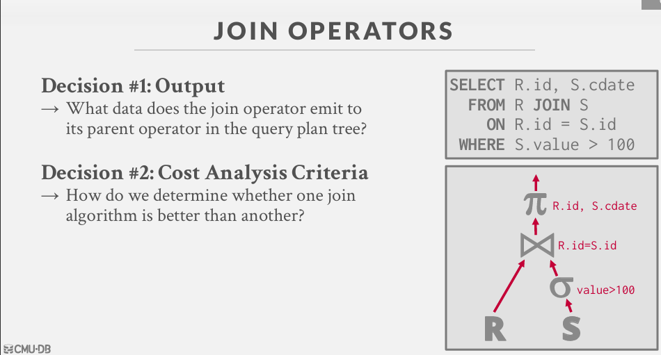
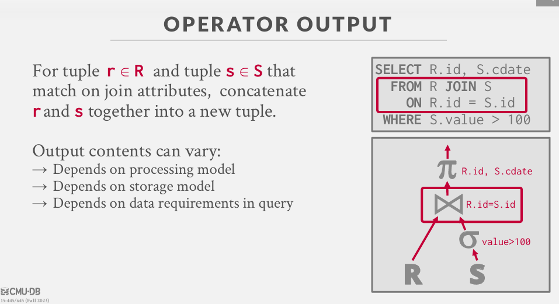
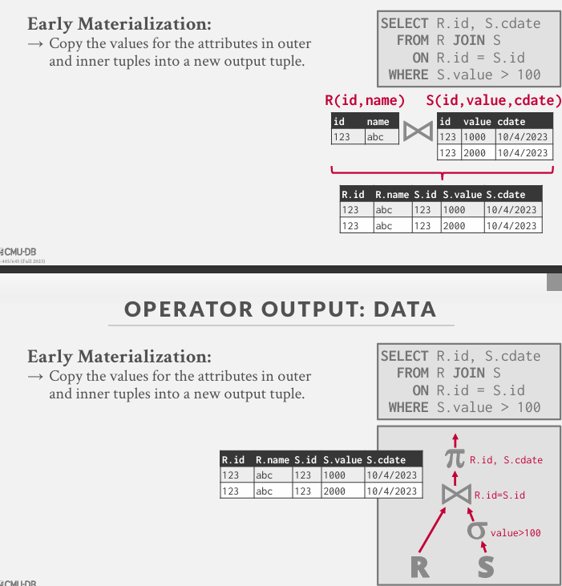
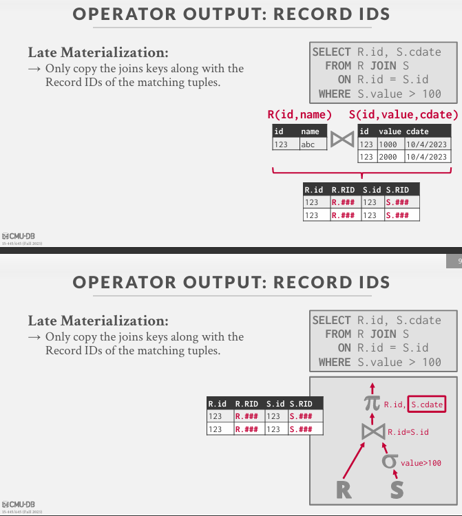
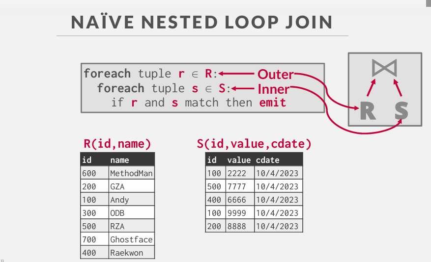
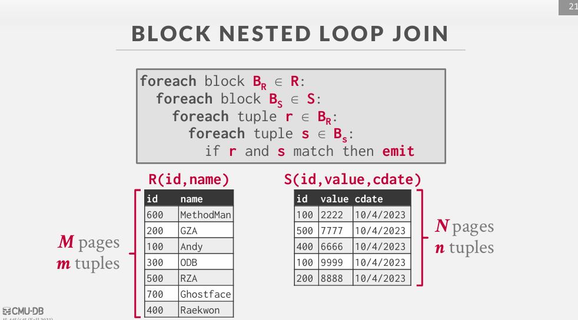
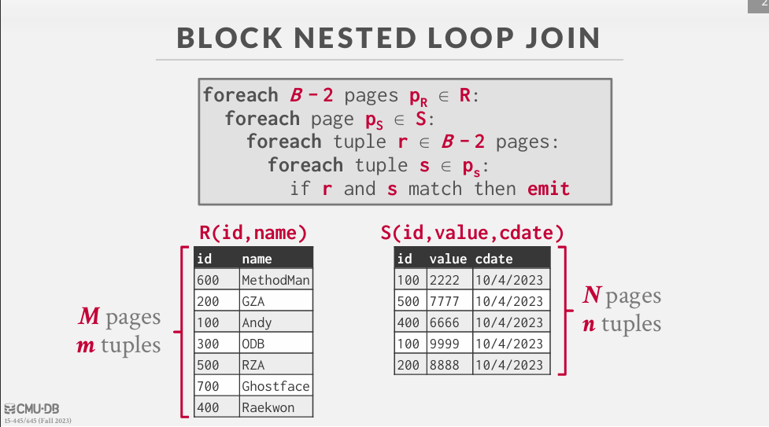
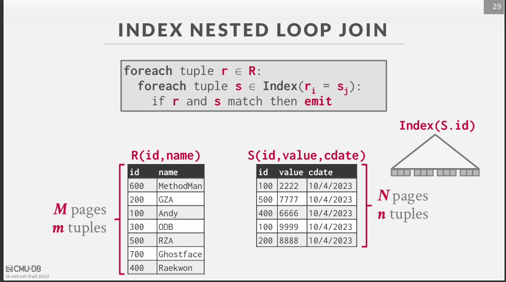
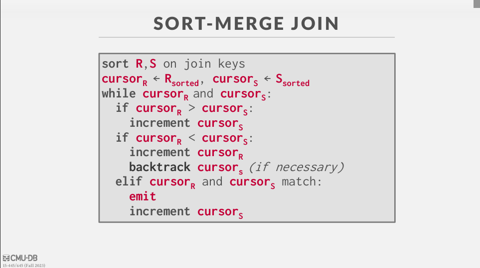
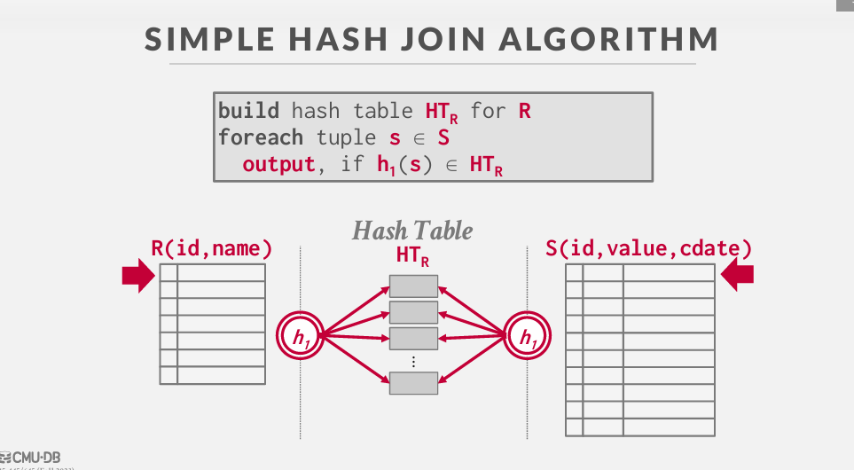

# join algorithms

ppt: 11-join

选用较小的表作为外表即left；

SQL JOIN 子句用于把来自两个或多个表的行结合起来，基于这些表之间的共同字段。
INNER JOIN：如果表中有至少一个匹配，则返回行
LEFT JOIN：即使右表中没有匹配，也从左表返回所有的行
RIGHT JOIN：即使左表中没有匹配，也从右表返回所有的行
FULL JOIN：只要其中一个表中存在匹配，则返回行

##  JOIN OPERATORS

join 的输出：

join 的输出数据：
1. Early Materialization:
+ 将外部元组和内部元组中的属性值全部复制到一个新的输出元组中
查询计划中的后续操作符不需要返回基表以获取更多数据

2. Late Materialization:
+ 只复制连接键和匹配元组的Record id。
非常适合列存储，因为DBMS不会复制查询不需要的数据

## JOIN ALGORITHMS 
 Nested Loop Join 嵌套循环连接
 →Naïve
 →Block
 →Index
 Sort-Merge Join  排序合并连接
 Hash Join  哈希连接
 →Simple
 →GRACE (Externally Partitioned)
 →Hybrid

### 1. Nested Loop Join 嵌套循环连接
#### 1. 传统的嵌套循环连接（Nested Loop Join）
针对每个外部表（通常是较小的表）的元组遍历整个内部表（通常是较大的表）。即先拿一个tuple然后去遍历整个内部表。

Assume:
 →M pages in table R, m tuples in R
 →N pages in table S, n tuples in S
 Cost Metric:  # of I/Os to compute join
为什么是：Cost: M + (m ∙ N)

嵌套循环连接的基本步骤
1. 读取表 R 的一页：
首先，我们需要读取表 R 的一页。这一步的成本是读取 R 的所有页，总共 M 页。
因此，这部分的成本为 M 个 I/O 操作。
1. 对于 R 的每一行，遍历表 S 的所有页：
对于表 R 中的每一个元组，我们需要遍历表 S 的所有页。
表 R 有 m 个元组，每个元组都需要遍历表 S 的所有 N 页。
因此，这部分的成本为m×N 个 I/O 操作。
所以：Cost: M + (m ∙ N)

#### 2. Block Nested Loop Join（块嵌套循环连接）
不在针对关系R中的每个单独的tuple及进行迭代，也不再逐一遍历整个关系S，而是仅对R中的每一页。
传统的嵌套循环连接（Nested Loop Join）通常涉及大量的 I/O 操作，因为它需要针对每个外部表（通常是较小的表）的元组遍历整个内部表（通常是较大的表）。Block Nested Loop Join 通过对数据进行分块处理来优化这一点。

详细步骤：
1. 读取外部表的一个块：
+ 从外部表（通常是较小的表）中读取一个数据块到内存中。
+ 这个块通常包含多个元组。
2. 遍历内部表的全部块：
+ 遍历内部表（通常是较大的表）的所有数据块，寻找与外部表块中的元组相匹配的元组。
+ 对于每个外部表块中的元组，遍历内部表的所有块，找到匹配的元组并进行连接操作。
3. 处理外部表的所有块：
+ 重复上述步骤，直到外部表的所有块都被处理完毕。

假如我们缓冲池大小为B：
+ 对外部表的每个块使用B-2缓冲区。
+ 一个缓冲区用于内部表，一个缓冲区用于输出。

Cost: M + ([M / (B-2)]∙ N)
读取R的每一页：M
对于每一块需要遍历一次内表：[M / (B-2)]∙ N

#### 3. Index Nested Loop Join（索引嵌套循环连接
Index Nested Loop Join（索引嵌套循环连接）是嵌套循环连接的一种改进版本，通过利用索引来提高连接操作的效率。这种算法特别适用于连接条件能够利用索引的情况，从而减少 I/O 操作次数和提高执行速度。

详细步骤
1. 读取 R 的第一行：
+ 从表 R 中读取第一行。
2. 利用索引查找 S 的匹配行：
+ 使用连接条件 R.id = S.id，在表 S 的索引中查找与 R 的这一行匹配的行。
+ 索引可以快速定位符合条件的行，从而减少 I/O 操作次数。
3. 生成连接结果：
+ 如果找到匹配的行，则生成连接结果行。
4. 读取 R 的下一行：
+ 读取表 R 的下一行。
5. 重复步骤 2 和 3：
+ 重复上述步骤，直到表 R 的所有行都处理完毕

cost: M+(m*C) : C是查找第 i 行匹配行的成本

### 2. SORT-MERGE JOIN 排序合并连接

第一阶段：排序
+ 对两个表按照连接键进行排序。
+ 可以使用任何适当的排序算法。
+ 这些阶段不同于上节课讲的外部合并排序中的排序/合并阶段。

第二阶段：合并
+ 使用游标遍历两个已排序的表，并发出匹配的元组。
+ 根据连接类型，可能需要回溯。

cost: M+N

排序合并连接什么时候有用？
一个或两个表已经按连接键排序。
输出必须按连接键排序。
输入关系可以通过显式排序操作符排序，也可以使用连接键上的索引扫描关系。

### 3. Hash Join  哈希连接
哈希连接是一种基于哈希表的连接技术，它利用哈希函数将连接键映射到有限的哈希桶中，从而快速定位和查找匹配的记录。哈希连接特别适用于等值连接条件（Equi-Join Conditions），即连接条件中的键值相等的情况。

第一阶段：构建
→ 扫描外部关系，并使用散列函数 h1对连接属性填充一个散列表。
→ 我们可以使用之前讨论过的任何散列表，但在实践中线性探测效果最好。

第二阶段：探测
→ 扫描内部关系，并使用 h1对每个元组跳转到散列表中的位置，找到匹配的元组。

**HASH TABLE CONTENTS**
关键字：查询进行连接的属性（键）
+ 散列表需要存储这个键，以便在发生散列冲突时验证我们是否有正确的匹配。

值：因数据库管理系统（DBMS）而异
+ 取决于后续的查询操作符将如何处理连接的输出。
+ 早期物化（Early Materialization）与晚期物化（Late Materialization）。

**OPTIMIZATION: PROBE FILTER**探测过滤
在构建阶段创建一个探测过滤器（例如布隆过滤器），如果连接键很可能不在内部关系中存在：
+ 在探测哈希表之前检查过滤器。
+ 因为过滤器可以装入 CPU 缓存中，所以速度很快。
+ 有时被称为横向信息传递（Sideways Information Passing）。

如果我们没有足够的内存来容纳整个哈希表，会发生什么？
我们不想让缓冲池管理器随机交换散列表页。

**哈希连接当表无法完全装入内存时**
分区阶段：根据连接属性将两个表哈希分成多个分区。
探测阶段：比较每个表中相应分区内的元组。
有时被称为 GRACE 哈希连接。
命名来源于：20 世纪 80 年代日本的 GRACE 机器数据库。

