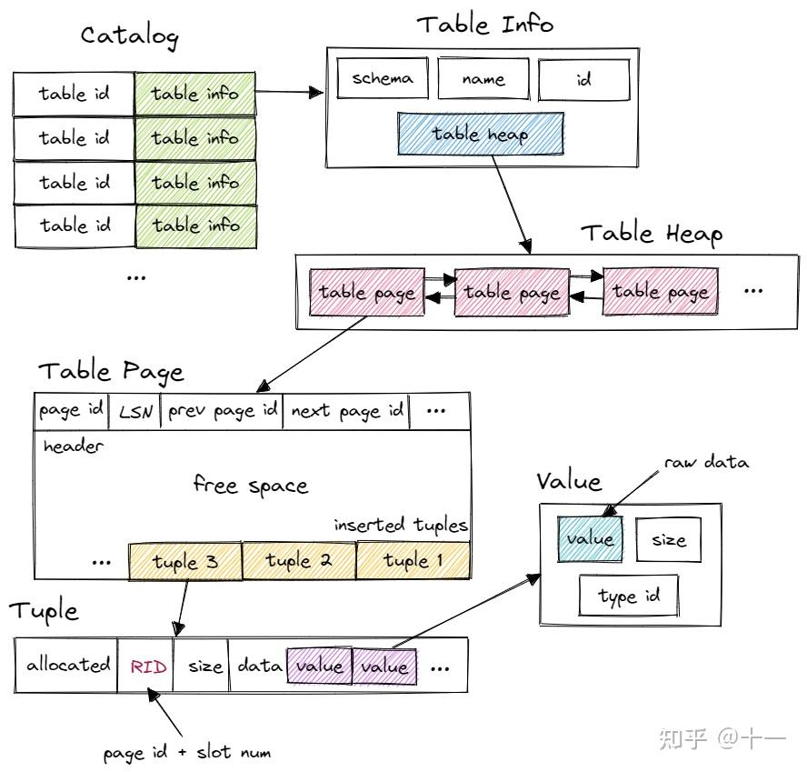

# ppt: 12

Processing Models  算子的执行模型
Access Methods  访问数据的方法
Modification Queries  修改查询
Expression Evaluation  表达式求值

## 1. processing model(算子的执行模型)
DBMS的处理模型定义了系统如何执行查询计划。
+ 针对不同的工作负载进行不同的权衡。

方法1：迭代器模型
方法2：物质化模型
方法3：矢量化/批处理模型

### 1. 迭代器模型

每个查询计划操作符实现一个Next（）函数。
+ 每次调用时，操作符返回单个元组，如果没有元组，则返回eof标记。
+ 操作符实现了一个循环，该循环调用Next（）来检索其子元组，然后处理它们。
每个操作符实现也有Open（）和Close（）函数。
类似于构造函数和析构函数，但适用于操作符。
也称为火山模型或管道模型。

可以看到，火山模型一次调用请求一条数据，占用内存较小，但函数调用开销大，特别是虚函数调用造成 cache miss 等问题。

每一个执行器都包含 next() 和 init()如下：
```cpp
executor->Init();
//....
    RID rid{};
    Tuple tuple{};
    while (executor->Next(&tuple, &rid)) {
      if (result_set != nullptr) {
        result_set->push_back(tuple);
      }
    }
```

下面这个图是整个执行过程，从上调用 next(),next将从下一个节点获取到输入；然后下一个节点将调用它字节的 next()，然后再向下执行。
而且每一个next()，每次只读取一个 tuple，所以要循环读取，直到读取完，也就是这里的 while()


这在今天的大多数dbms中使用。允许元组流水线。
许多操作符必须阻塞，直到其子操作符发出所有元组。
→连接，聚合，子查询，按输出排序控制很容易使用这种方法。

Bustub 采用的是 Iterator Model。

### 2. materialization model (物质化模型)

每个操作符一次处理所有输入，然后一次发出所有输出。
+ 运算符将其输出“物化”为单个结果。
+ DBMS可以下推提示（例如，LIMIT）以避免扫描过多的元组。
+ 可以发送一个实体化的行或单个列。
输出可以是整个元组（NSM）或列的子集（DSM）。

所有算子立即计算出所有结果并返回。和 Iterator Model 相反。这种模型的弊端显而易见，当数据量较大时，内存占用很高。但减少了函数调用的开销。比较适合查询数据量较小的 OLTP workloads。减少函数调用的次数


### 3. vectorzation model  矢量化/批处理模型

对上面两种模型的中和，一次调用返回一批数据。利于 SIMD 加速。目前比较先进的 OLAP 数据库都采用这种模型。

就像Iterator模型一样，每个操作符都实现了Next（）函数，但是…
每个操作符发出一批元组，而不是单个元组。
+ 操作符的内部循环一次处理多个元组。
+ 批处理的大小可以根据硬件或查询属性而变化。


Bustub 采用的是 Iterator Model。

此外，算子的执行方向也有两种：

1. Top-to-Bottom. 
   + 从根节点算子开始，不断地 pull 下层算子的数据。
   + 元组总是随函数调用一起传递。
2. Bottom-to-Top. 
   + 从叶子节点算子开始，向上层算子 push 自己的数据。
   + 允许更严格地控制管道中的缓存/寄存器。
   + 更适合动态查询重新优化。

Bustub 采用 Top-to-Bottom。

## 2. 访问的方法

访问方法是DBMS访问存储在表中的数据的方式。
在关系代数中没有定义。
三种基本方法：
+ 顺序扫描。
+ 索引扫描（许多变体）。
+ 多索引扫描

### 1. sequential scan 顺序扫描

对于表格中的每一页：
+ 从缓冲池中检索。
+ 遍历每个元组并检查是否包含它。
DBMS维护一个内部游标，跟踪它检查的最后一个页面/槽。就是 RID,我们存储的 key / value,的 value其实就是一个 rid；

首先通过数据库的 catalog 找到对应的 table，一个 table 由许多 page 组成，在访问 page 时，就用到了 Buffer Pool,从缓冲池中读取这一页，然后从这一页中读取到 tuple。

就像下面这个图一样。


这几乎总是DBMS在执行查询时所能做的最糟糕的事情，但它可能是唯一可用的选择。
顺序扫描优化：
+ Prefetching ：lecture 6
+ Buffer Pool Bypass：lecture 6
+ Parallelization：lecture 13
+ Heap Clustering：lecture 8
+ Late Materialization：lecture 11
+ Data Skipping

### 2. index scan 索引扫描

DBMS选择一个索引来查找查询所需的元组:
使用哪个索引取决于：
+ 索引包含哪些属性
+ 查询引用什么属性
+ 属性的值域
+ 谓词成分  Predicate composition
+ 索引是否有唯一键或非唯一键

比如下面这张图：

现在需要选择符合条件的学生，次数有两个索引，该使用哪一个呢？
当使用索引时，优化器通常试图决定何时使用索引，使用哪个索引。这一部分功能由优化器来完成。
当然首先应该使用最具选择性的索引，因为这将减少了剩余谓词的选择。

**MULTI-INDEX SCAN**
假如一次使用一个索引，那么就需要确定哪个索引更具有选择性。如果使用multi-index，就不需要担心这种情况了。

如果DBMS可以在一个查询中使用多个索引：
+ 使用每个匹配索引计算记录id集。
+ 根据查询的谓词组合这些集合（union vs. intersect）。
+ 检索记录并应用任何剩余的谓词。


## 3. Modification Queries 修改查询

修改数据库的操作符（INSERT、UPDATE、DELETE）负责修改目标表及其索引。
+ 约束检查可以在操作符内部立即进行，也可以延迟到查询/事务中进行。
这些操作符的输出可以是Record id或元组数据（即RETURNING）。

UPDATE/DELETE:
+ 子操作符传递目标元组的Record id。
+ 必须跟踪以前看到的元组。
INSERT:
+ 选择#1：在操作符内部实现元组。
+ 选择#2：操作符插入从子操作符传入的任何元组

```sql
# UPDATE
UPDATE table_name
SET column1 = value1, column2 = value2, ...
WHERE condition; 
# DELETE
DELETE FROM table_name
WHERE condition;
# INSERT
INSERT INTO table_name
VALUES (value1,value2,value3,...);
```

**UPDATE QUERY PROBLEM**
更新操作原始的做法如下：
+ 拿到数据后，先删除这个 tuple
+ 然后更新这个 tuple
+ 最后再插入到 index中
假如采用的是迭代器模型;
这时就会产生一个问题"HALLOWEEN PROBLEM"，假如 获取的一个 tuple此时 salary=800，在进行更新和插入后此时 salary=900.但是这个时候插入的位置可能是后面，也就是还未扫描到的区域。这就会导致，后面会再次获取到这个 tuple，然会就会再次 +100;


解决方案：每个查询跟踪修改的记录id。就是记录所有已经修改过数据的 id，当获取到新的 tuple时进行判断是否是已经更新过的？如果已经更新过了就不更新了。

## 4. Expression Evaluation  表达式求值

DBMS将WHERE子句表示为表达式树。
树中的节点代表不同的表达式类型：
→比较（=,<,>,!=）
→合取（AND），析取（OR）
→算术运算符（+,-,*,/,%）
→常量值
→元组属性引用


## conclusion
同一个查询计划可以以多种不同的方式执行。
（大多数）dbms都希望尽可能多地使用索引扫描。
表达式树很灵活，但速度很慢。
JIT编译（有时）可以加快它们的速度


