# ppt: 13

Process Models : 流程模型
Execution Parallelism : 执行并行性
I/O Parallelism : I / O并行性

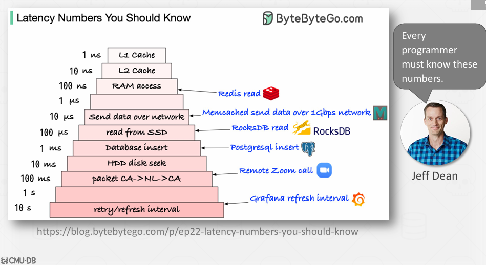
分布式通过网络传输，可以看到比从磁盘读取快一个量级
假如按地理分布的，可以看到传输将是100ms
**WHY CARE ABOUT PARALLEL EXECUTION?**
> 需要很好地使用（并行）硬件
> + 更高的吞吐量
> + 更低的延迟（对于人在循环场景尤其重要）
> 潜在地降低总拥有成本（TCO）
> + 更少的机器意味着更少的零件/物理足迹/能源消耗。

**PARALLEL / DISTRIBUTED 并行/分布式**
相同点：
数据库分布在多个资源上
+ 处理不适合单个机器/节点的大型数据集
+ 更高的性能
+ 冗余和容错
  
应用程序显示为单个逻辑数据库实例，而不管物理组织如何。
+ 单一资源DBMS的SQL查询应该在并行或分布式DBMS上生成相同的结果

两者的共同点在于，不在让数据库系统仅存在一台服务器、一个节点上运行，而是拥有一组这样的节点。
两者的共性在于，两者都旨在利用一组机器工作，并向用户呈现一种错觉，即存在一台比每台单独机器都要快。

并行计算（Parallel Computing）
> 并行计算是指同时使用多个处理器（CPU核心）来执行任务，以加快计算速度。并行计算通常在同一台机器上运行，利用多核处理器或多台连接在一起的机器（如集群）来协同工作。
> 1. 共享资源：
> + 并行系统中的处理器通常共享内存和其他资源。
> + 多个处理器可以访问相同的内存空间。
> 2. 同步性：
> + 并行程序通常需要高度的同步机制，因为多个处理器可能会同时访问相同的资源。
> + 使用锁、信号量、原子操作等来保证数据的一致性。
> 3. 负载均衡：
> + 并行系统需要合理分配任务，以避免某些处理器过载而其他处理器空闲的情况。
> + 任务分割和调度策略对于性能至关重要。
> 4. 通信开销较低：
> + 由于处理器之间通常共享内存，因此通信开销相对较小。

分布式计算（Distributed Computing）
分布式计算是指使用多个相互连接的计算机来完成一项任务。这些计算机（节点）通常是通过网络连接起来的，每台计算机都有自己的本地内存和资源。
> 1. 独立资源：
> + 每个节点都有自己的本地内存和其他资源。
> + 节点之间不共享内存，但可以通过网络进行通信。
> 2. 异步性：
> + 分布式系统通常采用异步通信模式，节点之间的交互通过消息传递进行。
> + 消息传递可能涉及网络延迟和可靠性问题。
> 3. 容错性：
> + 分布式系统需要考虑容错机制，因为节点可能会出现故障。
> + 使用冗余、心跳检测等技术来提高系统的可用性和可靠性。
> 4. 负载均衡：
> + 分布式系统也需要合理分配任务，但负载均衡策略可能更加复杂，需要考虑网络带宽等因素。
> 5. 通信开销较高：
> + 节点之间的通信通常通过网络进行，可能会有较高的延迟和带宽限制。

**PARALLEL VS. DISTRIBUTED**
不同点：
并行计算dbms
+ 资源在物理上彼此靠近。
+ 资源通过高速互联互通。
+ 人们认为通讯既便宜又可靠。
分布式dbms
+ 资源之间可能相距很远。
+ 资源通信使用慢（er）互连。
+ 沟通成本和问题不容忽视

## 1. Process Models 进程模式

一个数据库管理系统（DBMS）的进程模型定义了系统是如何架构以支持并发请求/查询的。

工作者（worker）是 DBMS 中负责代表客户端执行任务并返回结果的组件。

PROCESS MODEL
+ Approach #1: Process per DBMS Worker
+ Approach #2: Thread per DBMS Worker
+ Approach #3: Embedded DBMS

### 1. Process per DBMS Worker
每个工作者都是一个独立的操作系统进程。
+ 依赖于操作系统调度器。
+ 使用共享内存来存储全局数据结构。
+ 一个进程崩溃不会导致整个系统瘫痪。
+ 示例：IBM DB2、PostgreSQL、Oracle
对每一个节点分配一个进程来执行。

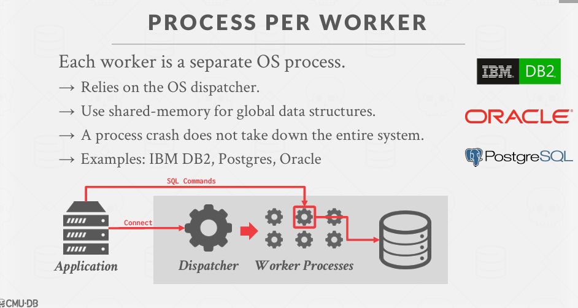

### 2. Thread per DBMS Worker

单个进程内含有多个工作者线程。
+ DBMS（主要）管理自身的调度。
+ 可能使用或不使用调度线程。
+ 线程崩溃（可能）导致整个系统崩溃。
+ 示例：MSSQL、MySQL、DB2、Oracle（2014年版）
几乎每一个在过去20年内创建的DBMS。

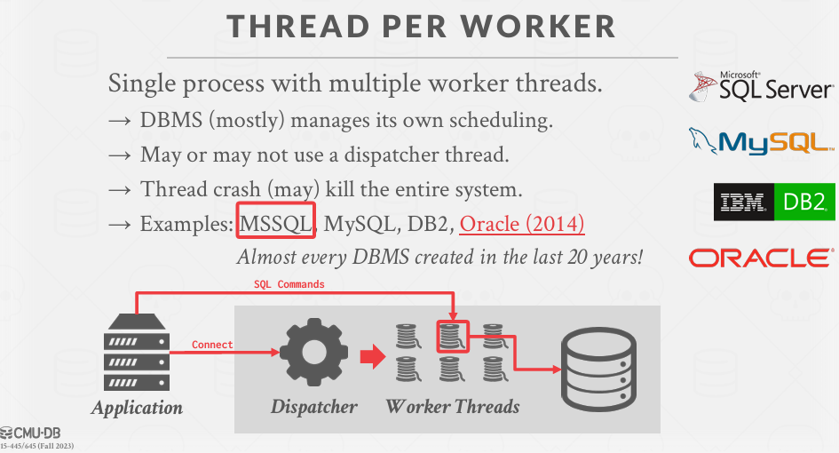

**SCHEDULING**
对于每个查询计划，DBMS 决定在哪里、何时以及如何执行它。
+ 应该使用多少个任务？
+ 应该使用多少个CPU核心？
+ 任务应该在哪个CPU核心上执行？
+ 任务应该在哪里存储其输出？

DBMS 几乎总是比操作系统知道得更多。

SQLOS 是一个用户级别的操作系统层，它在 DBMS 内部运行并管理分配的硬件资源。
→ 确定哪些任务被调度到哪些线程上。
→ 它还管理 I/O 调度和更高层次的概念，如逻辑数据库锁。
通过仪器化的 DBMS 代码实现非抢占式的线程调度。

SQLOS 的时间量子是 4 毫秒，但调度器无法强制执行这一点。
DBMS 开发人员必须在源代码的各个位置添加显式的 yield（放弃执行权）调用。
如下：
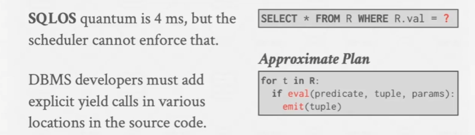

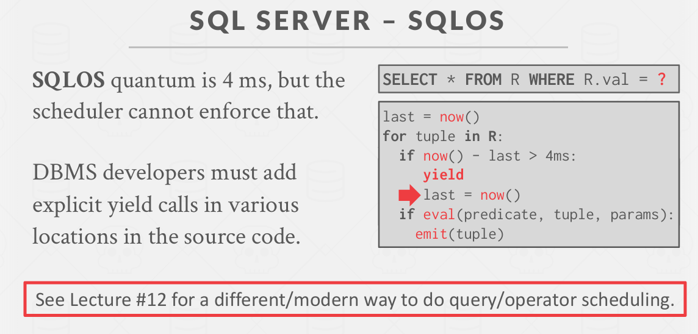

### 3. EMBEDDED DBMS
可以将数据库想象一个一库的形式编写的实体。本质上，数据库引擎运行于你的应用程序代码内部。

DBMS 在与应用程序相同的地址空间内运行。应用程序（主要是）负责线程和调度。
应用程序可能支持外部连接。
+ 示例：BerkeleyDB、SQLite、RocksDB、LevelDB

**PROCESS MODELS**
多线程架构的优势：
→ 每次上下文切换的开销较小。
→ 不必管理共享内存。
每个工作者一个线程的模型并不意味着 DBMS 支持查询内部的并行处理。
过去15年中的DBMS通常使用原生操作系统线程，除非它们是 Redis 或 PostgreSQL 的分支。

## 2. Execution Parallelism : 执行并行性

**查询间的并行处理（Inter-Query Parallelism）与查询内的并行处理（Intra-Query Parallelism）**

查询间的并行处理（Inter-Query）：如果我有多个查询发送到我的系统，我是否使用对各工作进程来处理这些查询
+ 同时执行多个不同的查询。
+ 提高吞吐量并减少延迟。

查询内的并行处理（Intra-Query）：对于一个给定的查询，我们是否使用多个工作进程来完成它的工作
+ 并行执行单个查询中的操作。
+ 减少长时间运行查询的延迟，特别是对于OLAP查询。

**查询内的并行处理（Intra-Query Parallelism）**
Approach #1: Intra-Operator (Horizontal)
Approach #2: Inter-Operator (Vertical)
Approach #3: Bushy

方法 #1：操作符内部（横向）并行处理  Intra-Operator (Horizontal)

→ 将操作符分解为独立的片段，这些片段在数据的不同子集上执行相同的功能。
DBMS 在查询计划中插入一个 exchange 操作符，以合并/拆分来自多个子操作符/父操作符的结果。
→ PostgreSQL（Postgres）称此为“gather”。

比如说下面这个查询计划，假如我们有很多个 page 且有3个工作进程。
我们对每一个进程分配一个任务，去查询一个page，查询的输出将输入到 exchange中，然后继续查询下一个page，在exchange这里将合并每个进程的输出结果，从而传递给上层节点。
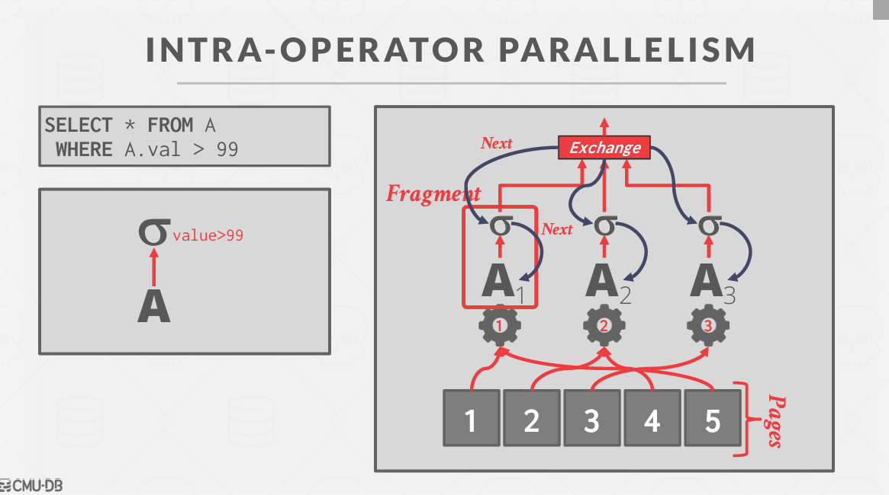

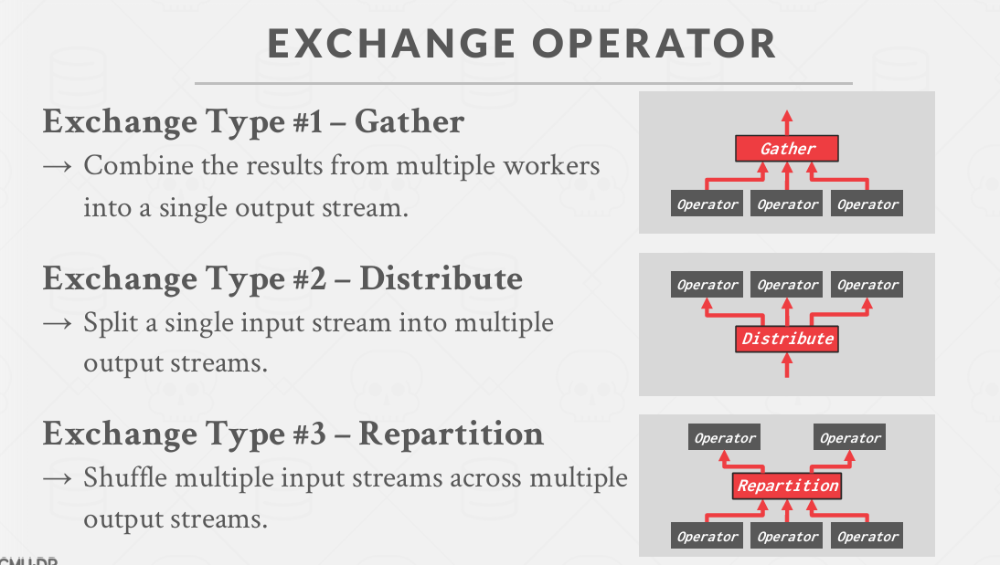

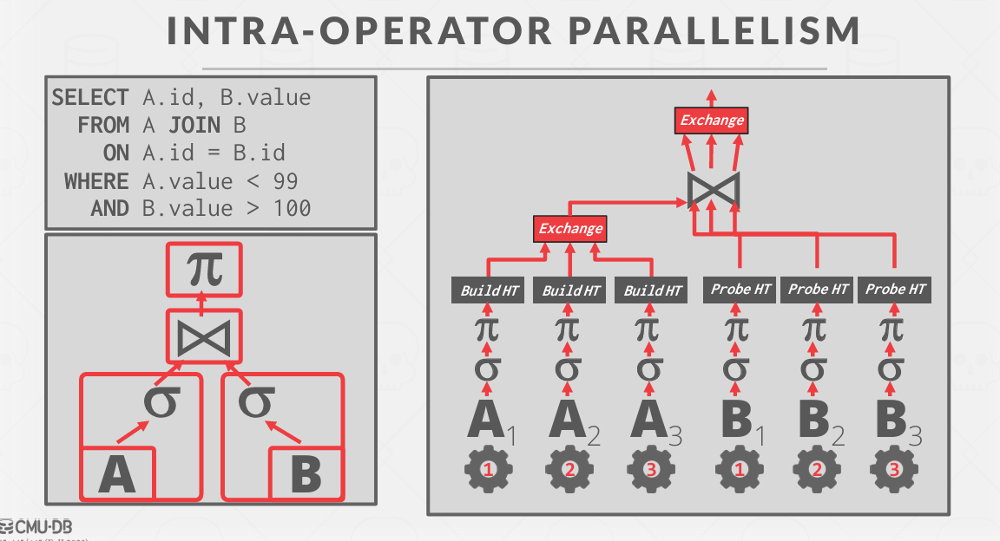

方法 #2：操作符间（垂直）并行处理

→ 操作重叠，以便在不进行物化（中间结果存储）的情况下将数据从一个阶段传送到下一个阶段。
→ 工作者同时执行查询计划中不同部分的操作符。
→ 在流系统（连续查询）中更为常见。
也称为管道并行处理（pipeline parallelism）。

就像进程之间的通信一样，通过管道传输数据。不需要等待一个进程完成后才进行下一步，这个操作树就相当一个流动的数据流
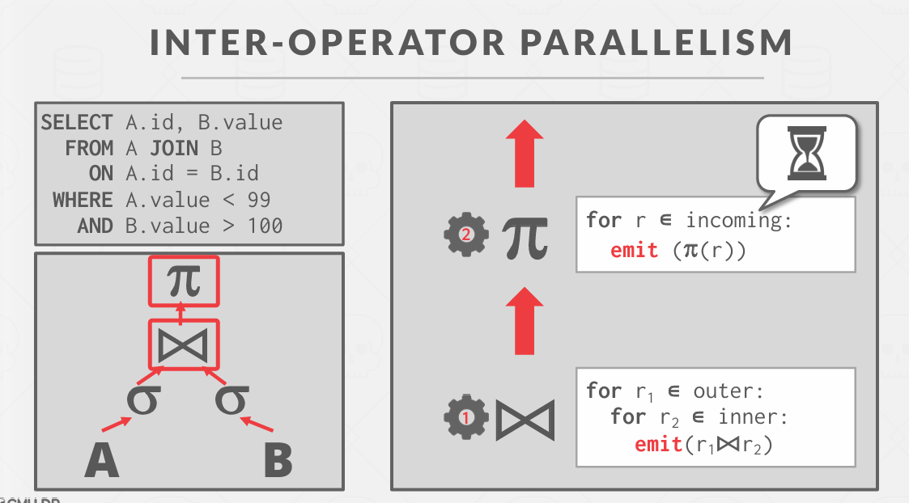

方法 #3：树状并行处理（Bushy Parallelism）

→ 这是操作符内部和操作符间并行处理的混合形式，其中工作者同时执行查询计划中不同部分的多个操作符。
→ 仍然需要交换操作符来合并各部分产生的中间结果。

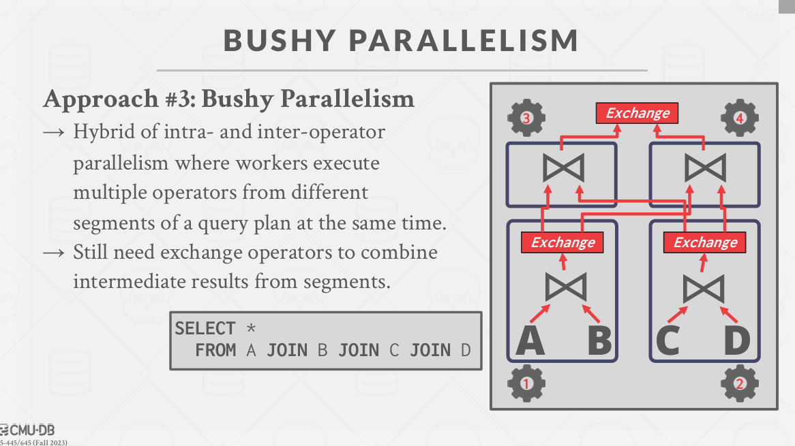

## 3. I/O Parallelism : I / O并行性
当需要想一个 IO 子系统发送请求集时，这个IO 子系统往往是一个复杂的系统，可能包含多个磁盘。这就涉及到 I/O 的并发性了

将 DBMS 分布在多个存储设备上来提高磁盘带宽和降低延迟。
有许多不同的选项，各有权衡：
→ 每个数据库使用多个磁盘
→ 每个磁盘存储一个数据库
→ 每个磁盘存储一个关系（表）
→ 将关系（表）拆分到多个磁盘上

一些 DBMS 本机支持这一点。其他 DBMS 则需要管理员在 DBMS 外部进行配置。

**多磁盘并行处理（Multi-Disk Parallelism）**

磁盘上的数据可能会损坏（位腐烂），或者整个磁盘可能会失效。
从磁盘阵列中获得更高的性能。

基于硬件的方法：一个硬件控制器管理多个设备，例如 RAID。

基于软件的方法：在文件/对象级别使用校验码。这种方法更快且更灵活。
这对 DBMS 是透明的。

在服务器环境中，不会只有一个磁盘，而是一族磁盘，他们共同构成一个IO子系统。
Performance：高性能。如果有四个磁盘，并且打算对其进行一次调用，能否在一次扫描中获取这四个磁盘的集体性能？
Durability：磁盘上的数据可能会损坏（位腐烂），或者整个磁盘可能会失效。复制一个副本用来恢复
Capacity：尽可能利用磁盘集体的存储容量

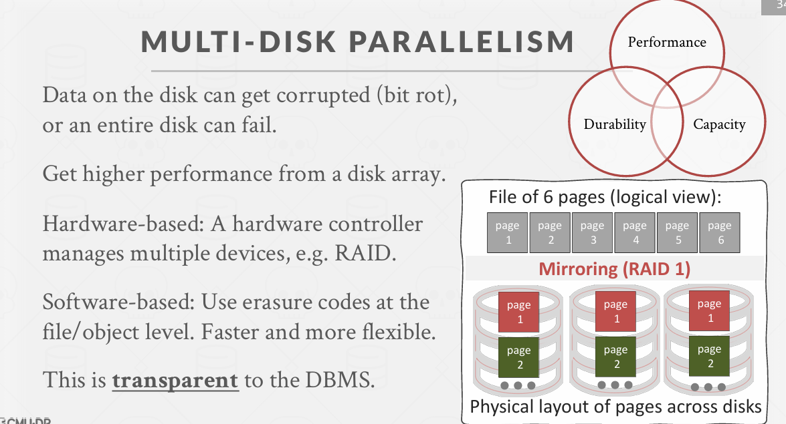

