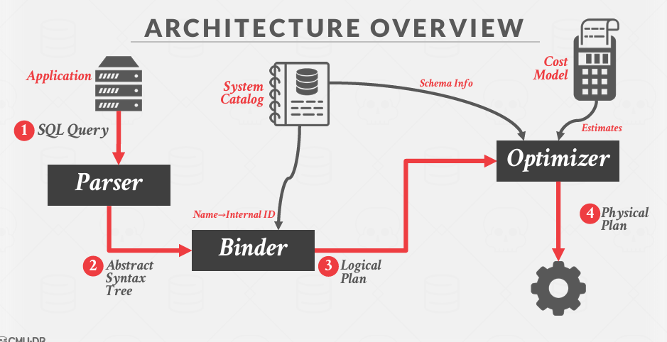

# ppt: 14 optimization

查询优化

1. 比如下面这个这个查询，先读取数据，左表每一条和右表都进行所有匹配，笛卡尔积，然后再匹配：
+ cost1：读取左表50个page+左表每一个page都要和右表匹配 50 * 1000+匹配好的数据写入：10000*500/5=1000000
+ cost2:读取1000000+10000/5; 这里10000/5，因为 EMP有10000条数据，所以要输出这么多，然后每一页5个tuple
+ cost3: 读取2000+2000/500；假设有匹配概率1/500


2. 刚开始读数据时，就进行过滤，即采用页嵌套循环。其实就是把上面的条件拿下来
cost: 50+50000+2000
前两项是块嵌套循环的成本


3. 假如将链接算法切换为排序合并
如果采用流水线进行操作，那么所有的读写过程都将被消除。不需要计算当前的节点的所有输出结果作为下一个节点的输入，减少写入和读取磁盘的过程


4. 调整连接和选择的操作的顺序，也就是下推操作
这里就是把 dname="Toy"选择下推，对其进行索引，假如这个哈希索引是两层结构，那么就需要读取3次；
即 cost = 3r+1w;
然后进行嵌套索引


### **Query Optimization 查询优化**
+ 识别候选等价树（逻辑）：这是一个 NP 难问题，因此解空间非常大。
+ 对每个候选树，找到执行计划树（物理）：我们需要估算每个计划的成本。
+ 选择最佳的整体（物理）计划：实际上：从所有可能的计划的一个子集中选择。

### **LOGICAL VS. PHYSICAL PLANS**
优化器生成一个逻辑代数表达式到最优等价物理代数表达式的映射。

物理操作符定义了一种特定的执行策略，使用访问路径。

它们可以依赖于它们处理的数据的物理格式（例如，排序、压缩）。
逻辑操作符与物理操作符之间并不总是存在一对一的映射。

一般来说，Planner 生成的是 Logical Plan Node，代表抽象的 Plan。Optimizer 则生成 Physical Plan Node，代表具体执行的 Plan。一个比较典型的例子是 Join。在 Planner 生成的查询计划中，Join 就是 Join。在 Optimizer 生成的查询计划中，Join 会被优化成具体的 HashJoin 或 NestedIndexJoin 等等。在 Bustub 中，并不区分 Logical Plan Node 和 Physical Plan Node。Planner 会直接生成 Physical Plan Node。

逻辑计划节点（Logical Plan Node）
逻辑计划节点是查询的高级抽象表示，描述了查询的逻辑操作和关系代数表达式。逻辑计划节点不涉及具体的执行策略或数据访问方法，而是关注查询的逻辑结构和操作。

特点
+ 逻辑操作：描述了查询的基本操作，如选择（Selection）、投影（Projection）、连接（Join）、聚合（Aggregation）等。
+ 独立于物理实现：不依赖于具体的存储结构或访问路径。
+ 高层次抽象：提供了查询的高层次视图，便于理解和优化。

假设有一个查询 SELECT name, age FROM students WHERE age > 20，其逻辑计划可能如下：
```txt
Projection (name, age)
|
Filter (age > 20)
|
TableScan (students)
```

物理计划节点（Physical Plan Node）
物理计划节点是逻辑计划的具体实现，描述了查询的执行策略和实际操作。物理计划节点涉及具体的执行策略、数据访问方法和优化技术。

特点
+ 具体执行策略：描述了如何实际执行查询操作，如使用哪种扫描方法（顺序扫描、索引扫描）、如何进行连接（嵌套循环连接、哈希连接、排序合并连接）等。
+ 依赖于物理实现：依赖于具体的存储结构、索引类型和访问路径。
+ 低层次实现：提供了查询的低层次视图，详细描述了每一步的实际操作。

继续上面的查询 SELECT name, age FROM students WHERE age > 20，其物理计划可能如下：
```txt
Projection (name, age)
|
IndexScan (students, index on age, where age > 20)
```


### **QUERY OPTIMIZATION**
1. Rule-based. Optimizer 遍历初步查询计划，根据已经定义好的一系列规则，对 PlanNode 进行一系列的修改、聚合等操作。例如我们在 Task 3 中将要实现的，将 Limit + Sort 合并为 TopN。这种 Optimizer 不需要知道数据的具体内容，仅是根据预先定义好的规则修改 Plan Node
2. Cost-based. 这种 Optimizer 首先需要读取数据，利用统计学模型来预测不同形式但结果等价的查询计划的 cost。最终选出 cost 最小的查询计划作为最终的查询计划。

### Rule-based
**Predicate Pushdown**谓词下推


**Replace Cartesian Product**代替笛卡尔积
用join代替笛卡尔


**Projection Pushdown**投影下移
因为我们只需要 did,所以我们只拿取这一个列，剩余的列不要,这样就可以减少内存的使用


**ARCHITECTURE OVERVIEW**
可以看到 Binder生成一个 Logical Plan，然后经过Optimizer生成一个 Physical Plan



### Cost-based
Cost-based. 这种 Optimizer 首先需要读取数据，利用统计学模型来预测不同形式但结果等价的查询计划的 cost。最终选出 cost 最小的查询计划作为最终的查询计划。

**COST-BASED QUERY OPTIMIZATION**
让我们从某种特定的查询优化（QO）风格开始：基于成本的、自底向上的查询优化（经典的 System-R 优化器方法）。

方法：枚举查询的不同计划并估计它们的成本。
+ 单个关系。
+ 多个关系。
+ 嵌套子查询。
它在穷尽所有计划或达到某个超时时间后，选择查询的最佳计划。

**SINGLE-RELATION QUERY PLANNING 单关系查询规划**
选择最佳的访问方法。
+ 顺序扫描
+ 二分查找（聚簇索引）
+ 索引扫描
谓词评估顺序。
简单的启发式方法通常足以应对这种情况。

### **SYSTEM R OPTIMIZER**系统优化器
对于每个逻辑操作符，生成一组实现它的物理操作符。
包括所有连接算法和访问路径的组合。 生成一棵左深树。 然后，迭代构建一棵“左深”连接树，以最小化执行计划的估计工作量。

1. 将查询拆分为块并生成每个块的逻辑操作符：
将查询分解成多个块，并为每个块生成逻辑操作符。
2. 对于每个逻辑操作符，生成一组实现它的物理操作符：
为每个逻辑操作符生成一组物理操作符，这些物理操作符实现了逻辑操作符的功能。
包括所有连接算法和访问路径的组合。
3. 生成一棵左深树：
生成一棵左深树（left-deep tree），这是一种树结构，其中每个内部节点的左子树都是一个叶子节点或另一个左深树。
4. 然后，迭代构建一棵“左深”连接树，以最小化执行计划的估计工作量：
然后，通过迭代的方式构建一棵“左深”连接树，目标是最小化执行计划的估计工作量。

### **TOP-DOWN OPTIMIZATION**自顶向下优化
自顶向下优化，我们从逻辑计划的根节点开始，逐步将逻辑操作符转换为物理操作符，并使用分支定界搜索方法探索不同的物理计划。在搜索过程中，持续跟踪并记录当前找到的全局最佳计划，最终选择成本最低的物理计划作为最终的执行计划。

1. 从我们希望查询实现的逻辑计划开始：从一个描述查询逻辑的逻辑计划开始
2. 执行分支定界搜索：使用分支定界搜索方法来遍历计划树。通过将逻辑操作符转换为物理操作符来进行搜索。
3. 在搜索过程中记录全局最佳计划：在搜索过程中，持续跟踪并记录当前找到的全局最佳计划。
4. 在规划过程中将数据的物理属性视为一级实体：在规划过程中，将数据的物理属性（如排序、压缩、索引等）视为一级实体，即这些属性在优化过程中具有重要的地位和影响


这个过程是一个键值的过程，当发现此节点cost太大，直接剪掉。换下一个物理节点

再举个例子：
假设我们有一个查询：
```sql
SELECT name, age FROM students WHERE age > 20 AND city = 'New York';
```

首先，生成查询的逻辑计划：
```txt
Projection (name, age)
|
Filter (age > 20 AND city = 'New York')
|
TableScan (students)
```
自顶向下优化过程
1. 从逻辑计划的根节点开始：
逻辑计划的根节点是 Projection 操作符。
2. 将逻辑操作符转换为物理操作符：
从 Projection 开始，考虑将其转换为物理操作符。
3. 分支定界搜索：
使用分支定界搜索方法，探索不同的物理操作符组合。


详细步骤
1. 从 Projection 开始
+ 逻辑操作符：Projection (name, age)
+ 物理操作符：可以选择直接投影，也可以考虑其他优化策略（如延迟投影）。
2. 下游操作符 Filter
+ 逻辑操作符：Filter (age > 20 AND city = 'New York')
+ 物理操作符：
 + 索引扫描：如果有索引覆盖 age 和 city，可以使用索引扫描。
 + 全表扫描：如果没有索引，可以使用全表扫描。
 + 复合索引扫描：如果有复合索引覆盖 age 和 city，可以使用复合索引扫描。
3. 最下游操作符 TableScan
+ 逻辑操作符：TableScan (students)
+ 物理操作符：全表扫描。

构建物理计划树
1. 生成初始物理计划：
  + 从 Projection 开始，选择一个物理操作符（例如，直接投影）。
  + 对 Filter 选择一个物理操作符（例如，索引扫描）。
  + 对 TableScan 选择一个物理操作符（例如，全表扫描）。
2. 评估成本：
  + 估算每个物理计划的成本，包括 I/O 成本、CPU 成本、内存使用等。
3. 记录全局最佳计划：
  + 在搜索过程中，持续跟踪并记录当前找到的全局最佳计划。

假设我们有以下索引：
+ students(age)
+ students(city)

物理计划 1：使用 age 索引
```txt
Projection (name, age)
|
IndexScan (students, index on age, where age > 20)
|
Filter (city = 'New York')
```

物理计划 2：使用 city 索引
```txt
Projection (name, age)
|
IndexScan (students, index on city, where city = 'New York')
|
Filter (age > 20)
```

物理计划 3：使用全表扫描
```txt
Projection (name, age)
|
Filter (age > 20 AND city = 'New York')
|
TableScan (students)
```
选择最佳计划
1. 评估成本：
 + 计算每个物理计划的成本。
+ 例如，假设 age 索引扫描的成本为 100，city 索引扫描的成本为 150，全表扫描的成本为 200。
2. 选择最佳计划：
+ 选择成本最低的物理计划作为最佳计划。
+ 在这个例子中，age 索引扫描的成本最低，因此选择物理计划 1 作为最佳计划。


通常，我们会遇到嵌套查询。
+ 我们可以使用已讨论的方法优化每个块。
+ 然而，这样做可能效率低下，因为我们是单独优化每个块，而没有全局的方法。 如果我们能够将嵌套查询展平为一个单一的块并进行优化呢？
+ 然后，应用单块查询优化方法。
+ 即使不能展平为一个单一的块，展平为更少的块仍然有益。

**什么是嵌套查询？**
嵌套查询（Nested Query），也称为子查询（Subquery），是在 SQL 查询中包含另一个查询的一种方式。嵌套查询可以出现在 SELECT、INSERT、UPDATE 或 DELETE 语句的各个部分，但最常见的是出现在 WHERE 子句中。嵌套查询可以分为相关子查询（Correlated Subquery）和非相关子查询（Uncorrelated Subquery）。

1. 非相关子查询（Uncorrelated Subquery）：
+ 非相关子查询是一个独立的查询，其结果不依赖于外部查询的行。
+ 通常用于返回一个单一的值或一个值集
```sql
SELECT name, age
FROM students
WHERE age > (SELECT AVG(age) FROM students);
```
2. 相关子查询（Correlated Subquery）：
相关子查询依赖于外部查询的行，每次外部查询的行改变时，子查询都会重新执行。
通常用于逐行比较或过滤。
```sql
SELECT name, age
FROM students s1
WHERE age > (SELECT AVG(age) FROM students s2 WHERE s2.city = s1.city);
```


**NESTED SUB-QUERIES**
数据库管理系统（DBMS）将 WHERE 子句中的嵌套子查询视为接受参数并返回单个值或值集的函数。
两种方法：
+ 重写以去相关和/或展平它们。
+ 分解嵌套查询并将结果存储在临时表中。


