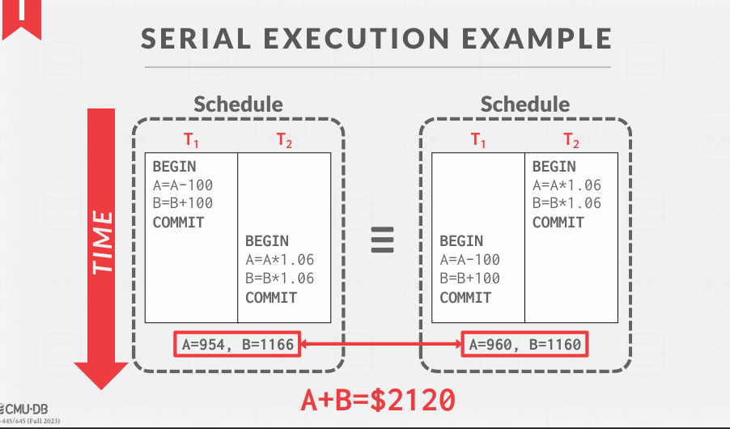

ppt 15

# TRANSACTION MANAGEMENT 事务管理

事务管理是数据库管理系统（DBMS）中的一个核心功能，**负责确保事务的正确执行和数据的一致性**。事务是一组数据库操作，这些操作被视为一个单一的逻辑单元，**必须全部成功完成或全部失败**。事务管理的主要目标是确保事务满足 **ACID **属性：

1. **原子性（Atomicity）**：
   - 事务中的所有操作必须作为一个不可分割的单元执行。如果事务中的任何一部分失败，整个事务将被回滚，数据库状态回到事务开始前的状态。

2. **一致性（Consistency）**：
   - 事务执行前后，数据库必须保持一致状态。事务不能破坏数据库的完整性约束。

3. **隔离性（Isolation）**：
   - 事务的执行应该是独立的，即一个事务的中间状态不应被其他事务看到。事务之间应该相互隔离，以防止并发操作导致的数据不一致。

4. **持久性（Durability）**：
   - 一旦事务提交，其对数据库的更改必须是永久的，即使在系统故障的情况下也是如此。

### 事务管理的关键组件

1. **事务控制**：
   - **开始事务**：使用 `BEGIN TRANSACTION` 或 `START TRANSACTION` 命令启动一个事务。
   - **提交事务**：使用 `COMMIT` 命令提交事务，将所有更改永久保存到数据库。
   - **回滚事务**：使用 `ROLLBACK` 命令回滚事务，撤销所有未提交的更改。

2. **并发控制**：
   - **锁定机制**：使用锁来防止多个事务同时访问和修改同一数据。常见的锁类型包括共享锁（S 锁）和排他锁（X 锁）。
   - **多版本并发控制（MVCC）**：通过维护数据的多个版本来允许多个事务并发执行，而无需长时间持有锁。

3. **恢复管理**：
   - **日志记录**：记录事务的所有操作，以便在系统故障后可以恢复数据库到一致状态。
   - **检查点**：定期创建数据库的稳定状态快照，减少恢复时间。
   - **恢复过程**：在系统故障后，使用日志和检查点恢复数据库到一致状态。

### 事务管理的工作流程

1. **事务开始**：
   - 用户或应用程序发出 `BEGIN TRANSACTION` 命令，事务管理器记录事务的开始。

2. **事务执行**：
   - 事务管理器协调事务中的各个操作，确保每个操作的原子性和一致性。
   - 使用并发控制机制（如锁或 MVCC）来管理多个事务之间的隔离性。

3. **事务提交**：
   - 用户或应用程序发出 `COMMIT` 命令，事务管理器开始提交过程。
   - 记录事务的提交日志。
   - 确保所有更改被永久保存到数据库。

4. **事务回滚**：
   - 如果事务中的任何一个操作失败，或用户发出 `ROLLBACK` 命令，事务管理器将回滚事务。
   - 撤销所有未提交的更改，恢复数据库到事务开始前 的状态。

5. **恢复**：
   - 在系统故障后，事务管理器使用日志和检查点恢复数据库到一致状态。
   - 重新执行未完成的事务，确保数据的一致性和持久性。

出现问题的可能
1. 比如说下面这个例子，假如执行到 Pay 25后断电了，此时没有完成 Write操作，就会从产生错误。
我们希望数据得到保护

2. 另外一中情况就是并发情况，如下：

解决方法：
1. 逐个执行每个事务（即，按序列顺序）当它们到达 DBMS 时。
+ 在 DBMS 中同时只能运行一个事务。
2. 在事务开始之前，将整个数据库复制到一个新文件，并对那个文件进行所有更改。
+ 如果事务成功完成，用新文件覆盖原始文件。
+ 如果事务失败，只需删除脏副本。

上面这两种方法都是缓慢的。

问题陈述：
一个（可能）更好的方法是允许独立事务的并发执行。
为什么我们要这样做？
→ 更好的利用率/吞吐量
→ 提高用户的响应时间
但我们同时也希望：
→ 正确性
→ 公平性（即所有的事务都有相同的可能来进行）

任意操作的交错执行可能导致：
→ 临时不一致（可以接受，不可避免）
→ 永久不一致（不好！）
我们需要正式的正确性标准来确定交错执行是否有效。

## 定义
事务可能对从数据库检索的数据执行许多操作。
DBMS 只关心从数据库读取和写入的数据。
→ 对“外部世界”的更改超出了 DBMS 的范围。

## 正式定义
数据库：一组固定命名的数据对象（例如，A, B, C, …）。
→ 我们现在不需要定义这些对象的具体内容。
→ 我们将在下周讨论如何处理插入和删除操作。
事务：一系列读取和写入操作（R(A), W(B), …）。
→ 这是 DBMS 对用户程序的抽象视图。

## SQL 中的事务
新事务以 BEGIN 命令开始。
事务以 COMMIT 或 ABORT 结束： 
→ 如果提交，DBMS 要么保存事务的所有更改，要么中止事务。 
→ 如果中止，所有更改将被撤销，就像事务从未执行过一样。
中止可以是自我触发的，也可以是由 DBMS 引起的。

 
## ATOMICITY OF TRANSACTIONS 事务的原子性
执行事务的两种可能结果：
→ 在完成所有操作后提交。
→ 在执行了一些操作后中止（或被 DBMS 中止）。

DBMS 保证事务的原子性。
→ 从用户的角度来看：事务总是要么执行所有操作，要么根本不执行任何操作。

**场景 #1：**
→ 我们从一个账户中取出 100 美元，但随后 DBMS 在转账之前中止了事务。

**场景 #2：**
→ 我们从一个账户中取出 100 美元，但随后在转账之前发生了电力故障。
在这两个事务中止后，账户的正确状态应该是怎样的？

方法 #1：日志记录 Logging
→ DBMS 记录所有操作，以便它可以撤销中止事务的操作。
→ 在内存和磁盘上维护撤消记录。
→ 这类似于飞机上的黑匣子……
几乎所有的 DBMS 都使用日志记录。
→ 审计追踪
→ 效率原因
 
方法 #2：影子分页  Shadow Paging
→ DBMS 制作页面的副本，事务对这些副本进行修改。只有当事务提交时，页面才会对其他人可见。
→ 最初来自 IBM System R。
少数系统采用这种方法：
→ CouchDB
→ Tokyo Cabinet
→ LMDB (OpenLDAP)

**一致性**
数据库准确地反映现实世界。
→ SQL 提供了指定完整性约束的方法（例如，键定义、CHECK 和 ADD CONSTRAINT），DBMS 将强制执行这些约束。
→ 定义这些约束的责任在于应用程序。
→ DBMS 确保在事务开始前和结束后所有完整性约束都为真。

关于最终一致性的一点说明：
→ 已提交的事务可能会看到不一致的结果；例如，可能看不到较早提交事务的更新。
→ 这种语义对应用程序开发人员来说很难理解。
→ 趋势是远离这样的模型。

一致性是指在事务开始之前和事务结束以后，数据库的完整性约束没有被破坏。这是说数据库事务不能破坏关系数据的完整性以及业务逻辑上的一致性。
如A给B转账，不论转账的事务操作是否成功，其两者的存款总额不变（这是业务逻辑的一致性，至于数据库关系约束的完整性就更好理解了）。

#### 场景：银行转账系统

假设我们有一个简单的银行转账系统，有两个账户：Account A 和 Account B。初始状态下，Account A 有 1000 美元，Account B 有 500 美元。

**初始状态：**
- Account A: 1000 美元
- Account B: 500 美元

### 一致性要求

1. **总金额不变**：转账前后，两个账户的总金额应该是 1500 美元。
2. **非负余额**：任何账户的余额不能为负。

### 事务示例

#### 事务 1：从 Account A 转 200 美元到 Account B

**步骤：**
1. 从 Account A 中扣除 200 美元。
2. 向 Account B 中增加 200 美元。

**期望结果：**
- Account A: 800 美元
- Account B: 700 美元

**一致性检查：**
- 总金额：800 + 700 = 1500 美元（满足总金额不变的要求）
- 非负余额：800 和 700 都是非负数（满足非负余额的要求）

### 最终一致性示例

假设我们使用一个最终一致性的分布式系统，其中事务 1 和事务 2 同时进行，但事务 2 在事务 1 之后提交。

#### 事务 2：从 Account B 转 100 美元到 Account A

**步骤：**
1. 从 Account B 中扣除 100 美元。
2. 向 Account A 中增加 100 美元。

**期望结果：**
- Account A: 900 美元
- Account B: 600 美元

**最终一致性问题：**
- **事务 1 完成后**：
  - Account A: 800 美元
  - Account B: 700 美元
- **事务 2 完成后**：
  - Account A: 900 美元
  - Account B: 600 美元

**问题**：
- 如果事务 2 在事务 1 之后提交，但事务 1 的结果还没有完全传播到所有节点，事务 2 可能会看到不一致的状态：
  - 事务 2 可能看到 Account A 仍然是 1000 美元，Account B 仍然是 500 美元。
  - 事务 2 执行后，Account A 变为 1100 美元，Account B 变为 400 美元。

**最终结果**：
- 经过一段时间后，所有节点最终会达成一致状态：
  - Account A: 900 美元
  - Account B: 600 美元

通过这个例子，我们可以看到一致性的重要性，以及最终一致性模型的复杂性和挑战。强一致性模型通过确保事务的立即一致性，简化了应用程序的开发和维护。

### 事务的隔离性

用户提交事务，每个事务的执行就像它是单独运行的一样。
→ 这使得编程模型更容易理解和推理。
但是，DBMS 通过交错事务的操作（读取和写入数据库对象）来实现并发。
我们需要一种方法来**交错事务**，但仍使其看起来像是按顺序一个接一个地运行。

**确保隔离性的机制**
并发控制协议是 DBMS 决定多个事务操作的适当交错方式的方法。
并发控制协议分为两类：
→ 悲观型：防止问题一开始就发生。
→ 乐观型：假设冲突很少发生；在冲突发生后处理它们。

**两类并发控制协议**：

   - **悲观型协议**：
     - **定义**：悲观型协议假设冲突经常发生，因此采取预防措施，防止问题一开始就发生。
     - **方法**：通常使用锁机制来防止多个事务同时访问和修改同一数据。例如，两阶段锁协议（Two-Phase Locking, 2PL）是一种典型的悲观型协议。（16）
     - **优点**：能够有效防止冲突，确保事务的隔离性。
     - **缺点**：可能导致较高的锁开销和较低的并发度。

   - **乐观型协议**：
     - **定义**：乐观型协议假设冲突很少发生，因此允许事务自由执行，只有在检测到冲突时才进行处理。
     - **方法**：通常使用版本控制和冲突检测机制。例如，多版本并发控制（Multi-Version Concurrency Control, MVCC）是一种典型的乐观型协议。
     - **优点**：能够提高并发度，减少锁开销。
     - **缺点**：需要额外的机制来检测和解决冲突，可能会增加系统复杂性。
    乐观锁是实现乐观型协议的一种具体方法，而乐观型协议是一种更广泛的并发控制策略。

通过这两种不同的并发控制协议，DBMS 能够在确保事务隔离性的同时，平衡系统的性能和资源利用率。

一个例子：

结果取决于T1是否先于T2执行，反之亦然

**交错事务**

我们交错事务以最大化并发性。
→ 慢速的磁盘/网络 I/O。
→ 多核 CPU。
当一个事务因资源（例如，页面故障）而停滞时，另一个事务可以继续执行并取得进展。

下面是交错执行的可能，可以看到有可能执行错也有可能执行对：

我们如何判断一个时间表是否正确？
如果调度相当于某个串行执行

#### 调度的形式属性
不会导致冲突的调度：

串行调度
→ 不交错不同事务操作的调度。

等效调度
→ 对于任何数据库状态，执行第一个调度的效果与执行第二个调度的效果相同。

#### 调度的形式属性

可串行化调度
→ 与某些事务的串行执行等效的调度。
→ 如果每个事务都保持一致性，那么每一个可串行化调度也会保持一致性。
可串行化是一个比事务启动时间或提交顺序更不直观的正确性概念，但它为 DBMS 在调度操作时提供了更多的灵活性。
→ 更多的灵活性意味着更好的并行性。

#### 冲突操作

我们需要一个基于“冲突”操作概念的正式等效性定义，以便能够高效地实现。
两个操作冲突，如果：
→ 它们属于不同的事务，
→ 它们作用于同一个对象且其中一个操作是写操作。

交错执行异常
→ 读-写冲突（R-W）
→ 写-读冲突（W-R）
→ 写-写冲突（W-W）

1. 脏读，在事件1中读但是事件2修改了数据，使得事件1前后读取不一样

2. 写-读，事件1在写，此时事件2也是写读，但是事件1 abort

3. 写-写

鉴于这些冲突，我们现在可以理解**调度可串行化的含义**。
→ 这是为了检查调度是否正确。
→ 这并不是如何生成正确的调度。
可串行化有不同的层次：
→ 冲突可串行化  Conflict Serializability
→ 视图可串行化  View Serializability

#### 冲突可串行化  Conflict Serializability

两个调度是冲突等价的，当且仅当：
→ 它们涉及相同的事务的相同操作。
→ 每一对冲突操作的顺序相同。

调度 S 是冲突可串行化的，如果：
→ S 与某个串行调度冲突等价。
→ 直觉：你可以通过交换不同事务的连续非冲突操作，将 S 转换为一个串行调度。

怎么证明一个调度是否冲突呢？
对每个事务定义一个节点，当事务中出现冲突，则会在事务中产生一条线，当出现闭环时，则发生冲突：

在调度执行的过程中，Dependency Graph被画出来。

## 事务的持久性

所有已提交事务的更改应该是持久的。
→ 没有部分更新。
→ 没有来自失败事务的更改。
DBMS 可以使用日志记录或影子分页来确保所有更改都是持久的。

在实践中，冲突可串行化是系统支持的，因为它可以高效地强制执行。
为了允许更高的并发性，一些特殊情况在应用层单独处理。

当两个事务 T1 和 T2 中的读写操作进行交错执行，并且调度器的执行顺序产生了冲突时，下一步的处理取决于所使用的并发控制机制。以下是几种常见的处理方法：

1. 冲突检测和回滚
方法：检测到冲突后，回滚其中一个事务，然后重新执行

步骤：
  + 检测冲突：在事务提交时，检测是否存在冲突操作。例如，检查是否有读-写、写-读或写-写冲突。
  + 回滚事务：如果检测到冲突，选择一个事务进行回滚。通常，选择最近提交的事务或根据某种策略（如优先级）选择事务进行回滚。
  + 重新执行：回滚的事务在稍后的时间重新执行

2. 冲突避免
方法：在执行过程中避免冲突操作的发生。

步骤：
 + 加锁：在事务开始时或操作执行前，对相关数据对象加锁。
 + 等待：如果某个事务需要访问已被其他事务锁定的数据对象，该事务将等待锁释放。

3. 多版本并发控制（MVCC）
方法：通过维护数据的多个版本来避免冲突。

步骤：
 + 版本管理：为每个数据对象维护多个版本，每个版本对应一个特定的时间点或事务。
 + 读操作：读操作可以看到数据的历史版本，不会阻塞写操作。
 + 写操作：写操作创建新的版本，不会阻塞读操作。
 + 冲突检测：在事务提交时，检查是否有冲突。如果有冲突，回滚或重新执行事务。

