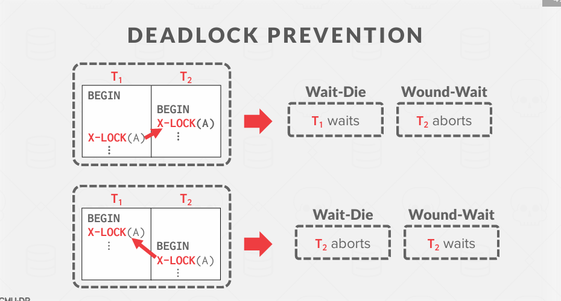

ppt 16

串行调度的定义：如果有两个事务T1和T2，可以有有一个调度执行T1然后T2，或者反过来，会得到一个特定的结果。

何时判断，是否有一种机制来确定如何使用一切是安全的。

# OBSERVATION
我们需要一种方法来保证所有执行调度的正确性（即，可串行化），而无需提前知道整个调度。
解决方案：使用锁来保护数据库对象。

我们知道，判断是否可串行化 可以画事务执行图，如果有循环，则有冲突。什么时候画这个循环呢？
如果在调度执行完后，再画太晚了。解决方案：使用锁（是悲观的，，防止问题一开始就发生）

**本节内容就是基于锁的悲观并发控制机制**

有一个 Lock Manager管理锁,来管理锁。
如下，这个调度器的执行。
刚开始T1执行，然后获取A的锁，R(A)后，T2开始执行，此时获取A的锁，发现已经被使用，则等待，此时T1执行后面的操作，直到释放锁，然后T2才开始执行。

**TODAY'S AGENDA**
锁类型：
 + 两阶段锁（Two-Phase Locking）
 + 死锁检测与预防（Deadlock Detection + Prevention）
 + 层次锁（Hierarchical Locking）

1. **两阶段锁（Two-Phase Locking, 2PL）**：
   - **定义**：两阶段锁是一种并发控制协议，确保事务的可串行化。
   - **阶段**：
     - **增长阶段（Growing Phase）**：事务可以获取锁，但不能释放锁。
     - **收缩阶段（Shrinking Phase）**：事务可以释放锁，但不能获取新的锁。
   - **特点**：
     - 确保事务的可串行化。
     - 防止事务在释放锁后又重新获取锁，从而避免某些类型的死锁。

2. **死锁检测与预防（Deadlock Detection + Prevention）**：
   - **死锁检测**：
     - **定义**：通过定期检查系统状态，检测是否存在死锁。
     - **方法**：使用图论算法（如等待图）来检测死锁。
     - **处理**：一旦检测到死锁，可以通过回滚一个或多个事务来解除死锁。
   - **死锁预防**：
     - **定义**：通过限制事务的行为，防止死锁的发生。
     - **方法**：
       - **加锁顺序**：要求事务按照固定的顺序获取锁。
       - **超时**：设置事务的超时时间，超过时间后自动回滚。
       - **等待-死锁检测**：结合等待图和超时机制，定期检测死锁并采取措施。

3. **层次锁（Hierarchical Locking）**：
   - **定义**：层次锁是一种锁机制，通过将数据对象组织成层次结构，减少锁的竞争。
   - **特点**：
     - **层次结构**：数据对象被组织成树状结构，每个节点可以有自己的锁。
     - **锁粒度**：可以根据需要选择不同层次的锁，从粗粒度到细粒度。
     - **优势**：通过层次结构，可以减少锁的竞争，提高并发性能。

## 使用锁执行
事务请求锁（或升级锁）。
锁管理器授予或阻止请求。
事务释放锁。
锁管理器更新其内部锁表。
→ 它跟踪哪些事务持有哪些锁，以及哪些事务正在等待获取锁。

仅仅是对每个操作上锁的机制是不够的，如下：虽然保证了每一步的执行，但是执行图是循环的，也就是会产生冲突，并不能保证 冲突可串行化

**并发控制协议**

两阶段锁（2PL）是一种并发控制协议，用于在运行时确定事务是否可以访问数据库中的对象。
该协议无需提前知道事务将要执行的所有查询。

**阶段 #1：增长阶段**
→ 每个事务从 DBMS 的锁管理器请求所需的锁。
→ 锁管理器授予或拒绝锁请求。

**阶段 #2：收缩阶段**
→ 事务只允许释放或降级之前获取的锁。它不能获取新的锁。

1. **两阶段锁（2PL）**：
   - **定义**：两阶段锁（2PL）是一种并发控制协议，确保事务的可串行化。2PL 将事务的执行过程分为两个阶段：增长阶段和收缩阶段。

2. **阶段 #1：增长阶段**：
   - **定义**：在增长阶段，事务从 DBMS 的锁管理器请求所需的锁。
   - **步骤**：
     - **请求锁**：每个事务根据需要请求共享锁（读锁）或排他锁（写锁）。
     - **授予或拒绝**：锁管理器根据当前的锁状态和请求的类型，决定是否授予或拒绝锁请求。
   - **特点**：在增长阶段，事务可以获取新的锁，但不能释放已获取的锁。

3. **阶段 #2：收缩阶段**：
   - **定义**：在收缩阶段，事务只能释放或降级之前获取的锁，不能获取新的锁。
   - **步骤**：
     - **释放锁**：事务在完成对数据的访问或修改后，释放持有的锁。
     - **降级锁**：事务可以将排他锁降级为共享锁，但不能获取新的锁。
   - **特点**：在收缩阶段，事务不能再获取新的锁，只能释放或降级已有的锁。

通过这两个阶段，2PL 协议确保了事务的可串行化，防止了数据冲突和不一致。这种机制在运行时动态地管理和控制事务的并发访问，确保数据的一致性和隔离性。

为什么说这是个悲观锁呢？
如下：当执行T2是，需要获取 LOCK(A)，这个时候是不允许的，虽然此时获取LOCK(A)并不会造成冲突，也就是阻止了执行依赖图从T1到T2;

**TWO-PHASE LOCKING** 级联问题
2PL 本身足以保证冲突可串行化，因为它生成的调度的优先级图是无环的。
但它是容易出现级联中止的。

示例：假设事务 T1 和 T2 之间存在依赖关系，T1 持有某些锁，T2 需要这些锁。如果 T1 因为某些原因中止，T2 也会因为无法获取所需锁而被迫中止。这种中止可能会进一步影响其他依赖 T2 的事务，形成级联效应。

**2PL 观察**
存在一些可串行化的潜在调度，但由于锁限制了并发性，2PL 不允许这些调度。
→ 大多数 DBMS 优先考虑正确性而非性能。
仍可能存在“脏读”。
→ 解决方案：强严格 2PL（又称严格 2PL）  Strong Strict 2PL (aka Rigorous 2PL)
可能导致死锁。
→ 解决方案：检测或预防

## 2PL DEADLOCKS
但是使用 Strong Strict 2PL 仍会产生死锁的问题，如下：

死锁是一个事务循环等待其他事务释放锁的情况。
处理死锁的两种方法：
→ 方法 #1：死锁检测  Deadlock Detection
→ 方法 #2：死锁预防  Deadlock Prevention

### 死锁检测  Deadlock Detection
DBMS 创建一个等待图(waits-for graph) 来跟踪每个事务正在等待获取的锁：
→ 节点是事务
→ 如果事务 Ti 正在等待事务 Tj 释放锁，则从 Ti 到 Tj 有一条边。
系统定期检查等待图中的循环，然后决定如何打破循环

### 死锁处理 DEADLOCK HANDLING
当 DBMS 检测到死锁时，它会选择一个“受害者”事务进行回滚以打破循环。

受害者事务将根据其调用方式决定是重启还是中止（更常见的是中止）。

在检查死锁的频率和事务在死锁被打破前的等待时间之间存在权衡。

**死锁处理：受害者选择**  VICTIM SELECTION
选择合适的受害者取决于许多不同的变量……

→ 按年龄（最年轻的事务，即时间戳最小）
→ 按进度（已完成最少或最多“工作”的事务）
→ 按已锁定的项目数量
→ 按需要与其一起回滚的事务数量
我们还应该考虑事务在过去被重启的次数，以防止饥饿现象。

**死锁处理：回滚长度**  ROLLBACK LENGTH

在选择了一个受害者事务进行中止后，DBMS 还可以决定回滚该事务的更改范围。
方法 #1：完全回滚
→ 完全回滚整个事务，并告知应用程序事务已被中止。
方法 #2：部分回滚（保存点）
→ DBMS 回滚事务的一部分（以打破死锁），然后尝试重新执行被撤销的查询。

### 死锁预防  Deadlock Prevention
死锁预防
当一个事务试图获取另一个事务持有的锁时，DBMS 会杀死其中一个事务以防止死锁。
这种方法不需要等待图或检测算法。

时间戳：时间戳是一个唯一的数字，通常表示事务的开始时间或顺序。它可以是一个实际的时间值（如 Unix 时间戳），也可以是一个单调递增的序列号。

基于时间戳分配优先级：
→ 较旧的时间戳 = 较高的优先级（例如，T1 > T2）
如果事务 T1 的时间戳为 10，事务 T2 的时间戳为 20，则 T1 的优先级高于 T2（T1 > T2）。

Wait-Die (“Old Waits for Young”)）
→ 如果请求事务的优先级高于持有锁的事务，则请求事务等待持有锁的事务。
→ 否则，请求事务中止。

Wound-Wait (“Young Waits for Old”)
→ 如果请求事务的优先级高于持有锁的事务，则持有锁的事务中止并释放锁。
→ 否则，请求事务等待。

**DEADLOCK PREVENTION**
为什么这些方案能保证没有死锁？
 + 只允许一种“类型”的方向在等待锁时存在。
当事务重启时，它的（新）优先级是什么？
 + 它的原始时间戳，以防止其因资源不足而饥饿。

**观察**
所有这些例子都是一对一地将数据库对象映射到锁。
如果一个事务想要更新十亿个元组，那么它必须获取十亿个锁。
获取锁是一个比获取闩锁（latch）更昂贵的操作，即使该锁是可用的。

**锁粒度** LOCK GRANULARITIES
当事务想要获取“锁”时，DBMS 可以决定该锁的粒度（即，范围）。
→ 属性？元组？页面？表？

DBMS 应**尽可能获取事务所需的最少数量的锁**。

在并行性和开销之间进行权衡。
→ 更少的锁，更大的粒度 vs. 更多的锁，更小的粒度。

### 意向锁  INTENTION LOCKS

意向锁允许在共享模式或独占模式下锁定高层节点，而无需检查所有子节点。

如果一个节点被意向锁锁定，那么某个事务正在树的较低层级进行显式锁定。

**意向锁**
意向共享锁（IS）  Intention-Shared (IS)
→ 表示在较低层级上使用共享锁（S 锁）进行**显式锁定**。 
→ 打算在更细粒度的层级上获取共享锁（S 锁）。

意向独占锁（IX）   Intention-Exclusive (IX)
→ 表示在较低层级上使用独占锁（X 锁）进行**显式锁定**。 
→ 打算在更细粒度的层级上获取独占锁（X 锁）。

共享+意向独占锁（SIX）   Shared+Intention-Exclusive (SIX)
→ 以该节点为根的子树在共享模式（S 模式）下被**显式锁定**，并且在较低层级上使用独占锁（X 锁）进行**显式锁定**。

共享锁和独占锁是不相容的

**锁协议**
每个事务在数据库层次结构的最高级别获取适当的锁。

要在一个节点上获取 S 锁或 IS 锁，事务必须在其父节点上至少持有 IS 锁。

要在一个节点上获取 X 锁、IX 锁或 SIX 锁，事务必须在其父节点上至少持有 IX 锁。

**锁升级**
当一个事务获取了太多低级别的锁时，数据库管理系统（DBMS）可以自动切换到更粗粒度的锁。

这减少了锁管理器必须处理的请求数量。

**实际中的锁**
应用程序通常不会手动获取事务的锁（即，显式的 SQL 命令）。
有时你需要向 DBMS 提供提示，以帮助它提高并发性。
→ 在读取元组后更新它。
在对数据库进行重大更改时，显式锁也很有用。

