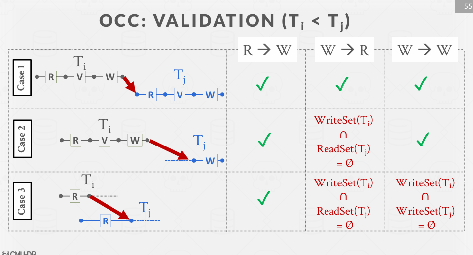
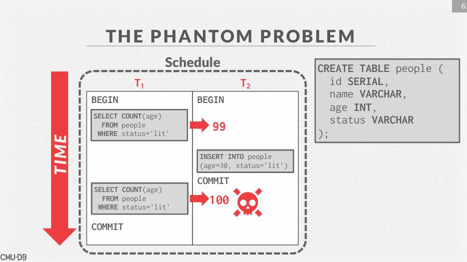
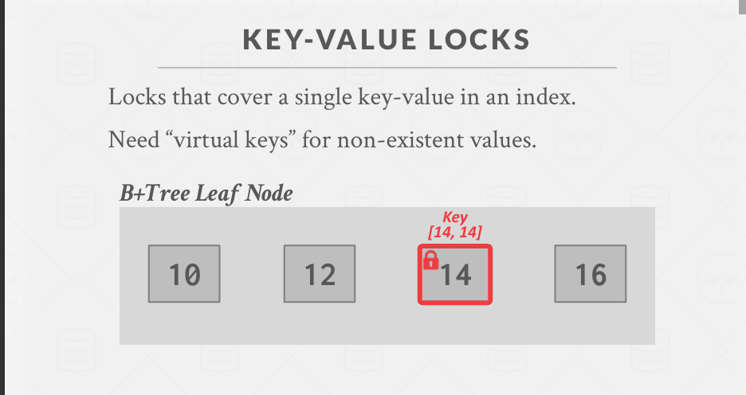
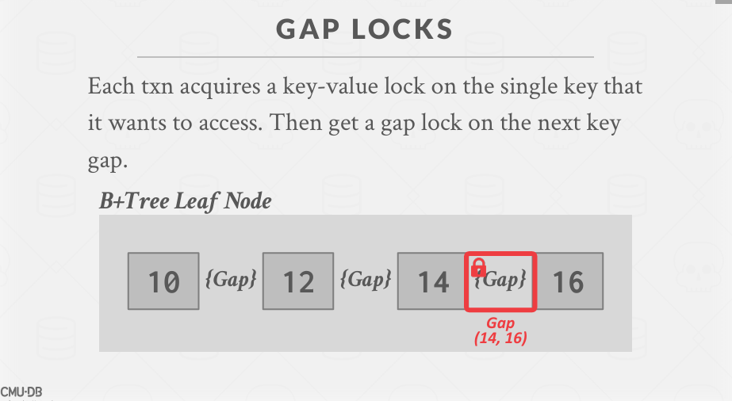
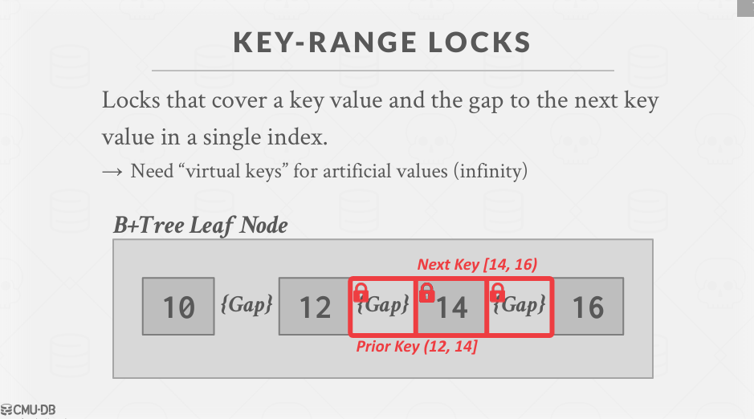
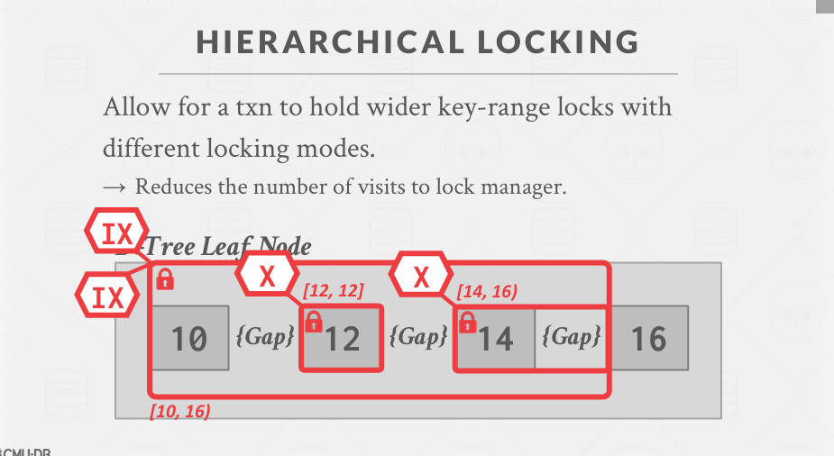

Pessimistic
两阶段锁（2PL）
→ 在事务执行过程中确定冲突操作的可串行化顺序。
时间戳排序
→ 使用时间戳的串行化机制。(无需使用锁)

Optimistic
乐观并发控制
→ 先运行，然后检查是否存在串行化违规。

## 时间戳并发控制（T/O 并发控制）
使用时间戳来确定事务的可串行化顺序。
如果 TS(Ti) < TS(Tj)，则 DBMS 必须确保执行调度等同于 Ti 在 Tj 之前的串行调度。

**时间戳分配**
每个事务 Ti 被分配一个唯一的固定时间戳，该时间戳是单调递增的。
→ 让 TS(Ti) 表示分配给事务 Ti 的时间戳。
→ 不同的方案在事务的不同时间点分配时间戳。
多种实现策略：
→ 系统/墙上时钟。
→ 逻辑计数器。
→ 混合方法。

**AGENDA**
 Basic Timestamp Ordering (T/O) Protocol
 Optimistic Concurrency Control
 Isolation Level

## BASIC T/O
事务无锁读写对象。
每个对象 X 都带有最后一个**成功读取或写入该对象的事务的时间戳**：
→ W-TS(X) – X 的写时间戳
→ R-TS(X) – X 的读时间戳
检查每个操作的时间戳：
→ 如果事务尝试访问“来自未来”的对象，它将中止并重新启动。

**基本时间戳排序 – 读操作** 不能读取未来的数据
动作：事务 Ti 想要**读取**对象 X。
如果 TS(Ti) < W-TS(X)，这违反了 Ti 相对于 X 的写入者的时序顺序。
→ 中止 Ti 并用新的时间戳重新启动。
否则：
→ 允许 Ti 读取 X。
→ 更新 R-TS(X) 为 max(R-TS(X), TS(Ti))。
→ 创建 X 的本地副本，以确保 Ti 的可重复读取。

**基本时间戳排序 – 写操作** 如果未来的事务已对该对象进行读写，则无法写入。（WR WW）

动作：事务 Ti 想要写入对象 X。
如果 TS(Ti) < R-TS(X) 或 TS(Ti) < W-TS(X)
→ 中止并重新启动 Ti。
否则：
→ 允许 Ti 写入 X 并更新 W-TS(X)。
→ 同时，创建 X 的本地副本以确保可重复读取。

**托马斯写规则（Thomas Write Rule）**
如果 TS(Ti) < R-TS(X)：
→ 中止并重新启动 Ti。
如果 TS(Ti) < W-TS(X)：
→ 托马斯写规则：忽略写操作，允许事务继续执行而不中止。
→ 这违反了 Ti 的时间戳顺序。
否则：
→ 允许 Ti 写入 X 并更新 W-TS(X)

**基本时间戳排序（Basic T/O）**

生成一个冲突可串行化的调度，如果你不使用托马斯写规则。
→ 没有死锁，因为没有任何事务会等待。
→ 如果短事务不断引起冲突，长事务可能会发生饥饿。
没有已知的 DBMS 使用这里描述的基本 T/O 协议。
→ 它为乐观并发控制（OCC）和多版本并发控制（MVCC）提供了构建块。

**基本时间戳排序（Basic T/O）– 性能问题**

从将数据复制到事务的工作区以及更新时间戳中产生高开销。
→ 每次读取都需要事务写入数据库。

长事务可能会发生饥饿。
→ 事务读取来自更新事务的数据的可能性增加。

## 观察
如果你假设事务之间的冲突很少发生，并且大多数事务都是短命的，那么强制事务获取锁或更新时间戳会增加不必要的开销。
更好的方法是优化无冲突的情况。

**OPTIMISTIC CONCURRENCY CONTROL**乐观并发控制
数据库管理系统为每个事务创建一个私有工作区。
→ 任何读取的对象都会被复制到工作区。
→ 修改会被应用到工作区。
当事务提交时，数据库管理系统会比较工作区的写集，以查看是否与其他事务冲突。
如果没有冲突，写集会被安装到“全局”数据库中。

**乐观并发控制（OCC）阶段**
读取阶段： 
→ 跟踪事务的读集和写集，并将它们的写操作存储在私有工作区中。
验证阶段： 
→ 当事务提交时，检查它是否与其他事务冲突。
写入阶段： 
→ 如果验证成功，将私有更改应用到数据库。否则，中止并重新启动事务。

只包含写时间戳。

**乐观并发控制（OCC）– 读取阶段**

跟踪事务的读集和写集，并将它们的写操作存储在私有工作区中。
数据库管理系统将事务访问的每个元组从共享数据库复制到其工作区，以确保可重复读取。
→ 目前可以忽略事务通过索引读取或写入元组的情况。

**OCC: THREE PHASES**
读取阶段：读取和写入对象，制作本地副本。
验证阶段：检查与可串行化调度相关的异常。
写入阶段：这是安全的。写入本地对象，使其永久化。

**OCC: VALIDATION (Ti < Tj)**

**乐观并发控制（OCC）– 写入阶段**

将事务写集中的更改传播到数据库，使其对其他事务可见。
串行提交：
→ 使用全局锁来限制每次只有一个事务处于验证/写入阶段。
并行提交：
→ 使用细粒度的写锁来支持并行的验证/写入阶段。
→ 事务按主键顺序获取锁以避免死锁。

**乐观并发控制（OCC）– 观察**

当冲突数量较低时，OCC 表现良好：
→ 所有事务都是只读的（理想情况）。
→ 事务访问的数据子集是互不相交的。
如果数据库很大且工作负载不偏斜，那么冲突的概率较低，因此锁是浪费的。

**乐观并发控制（OCC）– 性能问题**

将数据本地复制的高开销。
验证/写入阶段的瓶颈。
中止比在两阶段锁（2PL）中更浪费，因为它们只在事务已经执行后发生。

**乐观并发控制（OCC）– 性能问题**

将数据本地复制的高开销。
验证/写入阶段的瓶颈。
中止比在两阶段锁（2PL）中更浪费，因为它们只在事务已经执行后发生。

1. **将数据本地复制的高开销**：
   - **定义**：在 OCC 中，事务需要将读取的数据复制到本地工作区，这会增加额外的开销。
   - **原因**：
     - **数据复制**：每次读取操作不仅需要读取数据，还需要将其复制到本地工作区。
     - **内存使用**：本地工作区需要额外的内存来存储复制的数据。
   - **影响**：这会增加读取操作的复杂性和时间开销，尤其是在数据量较大的情况下。

2. **验证/写入阶段的瓶颈**：
   - **定义**：在验证和写入阶段，系统需要检查事务的写集是否与其他事务冲突，并将更改应用到全局数据库。
   - **原因**：
     - **串行提交**：如果使用全局锁进行串行提交，每次只有一个事务可以进行验证和写入操作，这会导致瓶颈。
     - **并行提交**：即使使用细粒度的写锁进行并行提交，锁的管理和协调仍然会增加开销。
   - **影响**：验证和写入阶段的瓶颈会降低系统的并发性能，尤其是在高负载情况下。

3. **中止比在两阶段锁（2PL）中更浪费**：
   - **定义**：在 OCC 中，事务的中止发生在事务已经执行之后，这比在两阶段锁（2PL）中更浪费。
   - **原因**：
     - **执行后再中止**：在 OCC 中，事务在提交前已经执行了所有操作，如果在验证阶段检测到冲突，事务需要中止并重新启动。
     - **资源浪费**：中止和重新启动会浪费已经执行的操作所消耗的资源，包括 CPU 时间和内存。
   - **对比**：
     - **2PL**：在 2PL 中，事务在获取锁时会检测冲突，如果无法获取锁，事务会立即中止，不会执行不必要的操作。
   - **影响**：OCC 中的中止比 2PL 更浪费，因为已经执行的操作需要重新执行，增加了系统的开销。

**动态数据库**

回顾一下，到目前为止，我们只处理了读取和更新数据库中现有对象的事务。
但现在，如果事务执行插入、更新和删除操作，我们会遇到新的问题……

出问题了:
这是怎么发生的？
→ 因为 T1 只锁定了现有的记录，而没有锁定正在进行的记录！
对单个项目的读取和写入的冲突可串行化仅在对象集合固定时才能保证可串行化。

**幽灵问题（Phantom Problem）**
1. **幽灵问题（Phantom Problem）**：
   - **定义**：幽灵问题是数据库中的一种现象，当事务在两次相同的查询之间，由于其他事务插入或删除了数据，导致第二次查询的结果与第一次不同。
   - **示例**：假设事务 T1 在两次查询之间，事务 T2 插入了一条满足 T1 查询条件的新记录，导致 T1 的第二次查询结果与第一次不同。

2. **方法 #1：重新执行扫描**：
   - **定义**：在事务提交时，重新执行查询，以检查它们是否产生了不同的结果，从而识别遗漏的更改。
   - **操作**：
     - **重新运行查询**：在事务提交之前，重新运行所有查询。
     - **比较结果**：将重新运行的查询结果与初始查询结果进行比较。
     - **识别更改**：如果结果不同，说明有遗漏的更改，事务需要中止并重新启动。
   - **优点**：简单易实现。
   - **缺点**：增加了额外的开销，因为需要重新执行查询。

3. **方法 #2：谓词锁定**：
   - **定义**：在查询开始运行之前，逻辑上确定谓词的重叠，并对这些重叠部分进行锁定。
   - **操作**：
     - **确定谓词**：分析查询的谓词条件，确定可能影响查询结果的数据范围。
     - **逻辑锁定**：对这些数据范围进行逻辑锁定，防止其他事务在这段时间内插入或删除数据。
   - **优点**：可以有效防止幽灵问题，同时减少不必要的开销。
   - **缺点**：实现复杂，需要对查询谓词进行详细的分析。

4. **方法 #3：索引锁定**：
   - **定义**：使用索引中的键来保护数据范围，防止其他事务在这段时间内插入或删除数据。
   - **操作**：
     - **使用索引键**：根据查询条件，使用索引中的键来确定需要保护的数据范围。
     - **范围锁定**：对这些数据范围进行锁定，防止其他事务在这段时间内插入或删除数据。
   - **优点**：利用索引结构，可以高效地保护数据范围。
   - **缺点**：需要维护索引，增加了索引的管理开销。

### 示例

1. **重新执行扫描**：
   - **事务 T1**：
     - 第一次查询：`SELECT * FROM table WHERE condition;`
     - 事务 T2 插入了一条满足条件的新记录。
     - 提交时，重新运行查询 `SELECT * FROM table WHERE condition;`
     - 比较结果，发现有新的记录，事务 T1 中止并重新启动。

2. **谓词锁定**：
   - **事务 T1**：
     - 分析查询 `SELECT * FROM table WHERE condition;`，确定数据范围。
     - 对数据范围进行逻辑锁定。
     - 执行查询，确保没有其他事务在这段时间内插入或删除数据。

3. **索引锁定**：
   - **事务 T1**：
     - 根据查询条件 `SELECT * FROM table WHERE condition;`，使用索引中的键确定需要保护的数据范围。
     - 对这些数据范围进行锁定。
     - 执行查询，确保没有其他事务在这段时间内插入或删除数据。

#### 重新执行扫描
数据库管理系统跟踪事务执行的所有查询的 WHERE 子句。
→ 保留事务中每个范围查询的扫描集。
在提交时，重新执行每个查询的扫描部分，并检查它是否生成相同的结果。
→ 示例：运行 UPDATE 查询的扫描部分，但不修改匹配的元组。

#### System R 提出的锁定方案。
→ 在 SELECT 查询的 WHERE 子句中的谓词上使用共享锁。
→ 在任何 UPDATE、INSERT 或 DELETE 查询的 WHERE 子句中的谓词上使用排他锁。
这种锁定方案在系统中很少实现；一个使用它的系统示例是 HyPer（精确锁定）。

#### 索引锁定方案
**索引锁定方案**
- **键值锁（Key-Value Locks）**
- **间隙锁（Gap Locks）**
- **键范围锁（Key-Range Locks）**
- **层次锁定（Hierarchical Locking）**

### 详细解释

1. **键值锁（Key-Value Locks）**：
   - **定义**：键值锁是在索引中的特定键值上加锁。
   - **操作**：
     - **锁定键值**：在执行插入、更新或删除操作时，锁定具体的键值。
     - **目的**：防止其他事务在同一键值上进行冲突操作。
   - **示例**：
     - **事务 T1**：
       - 执行 `UPDATE table SET column = value WHERE id = 1;`
       - 在键值 `id = 1` 上加锁。
     - **事务 T2**：
       - 尝试执行 `UPDATE table SET column = value WHERE id = 1;`
       - 由于 T1 持有锁，T2 需要等待 T1 释放锁。

2. **间隙锁（Gap Locks）**：
   - **定义**：间隙锁是在索引中的键值之间的空隙上加锁。
   - **操作**：
     - **锁定间隙**：在执行插入操作时，锁定特定键值之间的空隙。
     - **目的**：防止其他事务在该间隙中插入新的键值。
   - **示例**：
     - **事务 T1**：
       - 执行 `INSERT INTO table (id, column) VALUES (3, 'value');`
       - 在键值 `2` 和 `4` 之间的间隙上加锁。
     - **事务 T2**：
       - 尝试执行 `INSERT INTO table (id, column) VALUES (3, 'value');`
       - 由于 T1 持有间隙锁，T2 需要等待 T1 释放锁。

3. **键范围锁（Key-Range Locks）**：
   - **定义**：键范围锁是在索引中的一个键值范围上加锁。
   - **操作**：
     - **锁定范围**：在执行范围查询时，锁定特定的键值范围。
     - **目的**：防止其他事务在该范围内进行插入、更新或删除操作。
   - **示例**：
     - **事务 T1**：
       - 执行 `SELECT * FROM table WHERE id BETWEEN 1 AND 5;`
       - 在键值范围 `1` 到 `5` 上加锁。
     - **事务 T2**：
       - 尝试执行 `INSERT INTO table (id, column) VALUES (3, 'value');`
       - 由于 T1 持有键范围锁，T2 需要等待 T1 释放锁。

4. **层次锁定（Hierarchical Locking）**：
   - **定义**：层次锁定是在索引的多个层级上加锁，通常用于树形结构的索引。
   - **操作**：
     - **锁定层级**：在执行插入、更新或删除操作时，锁定索引的多个层级。
     - **目的**：防止其他事务在这些层级上进行冲突操作。
   - **示例**：
     - **事务 T1**：
       - 执行 `UPDATE table SET column = value WHERE id = 10;`
       - 在索引的多个层级上加锁，例如，锁定根节点、中间节点和叶节点。
     - **事务 T2**：
       - 尝试执行 `UPDATE table SET column = value WHERE id = 10;`
       - 由于 T1 持有多个层级的锁，T2 需要等待 T1 释放锁。

### 示例总结

1. **键值锁**：
   - **事务 T1**：`UPDATE table SET column = value WHERE id = 1;` （锁定 `id = 1`）
   - **事务 T2**：`UPDATE table SET column = value WHERE id = 1;` （等待 T1 释放锁）

2. **间隙锁**：
   - **事务 T1**：`INSERT INTO table (id, column) VALUES (3, 'value');` （锁定 `2` 和 `4` 之间的间隙）
   - **事务 T2**：`INSERT INTO table (id, column) VALUES (3, 'value');` （等待 T1 释放锁）

3. **键范围锁**：
   - **事务 T1**：`SELECT * FROM table WHERE id BETWEEN 1 AND 5;` （锁定 `1` 到 `5` 的范围）
   - **事务 T2**：`INSERT INTO table (id, column) VALUES (3, 'value');` （等待 T1 释放锁）

4. **层次锁定**：
   - **事务 T1**：`UPDATE table SET column = value WHERE id = 10;` （锁定多个层级）
   - **事务 T2**：`UPDATE table SET column = value WHERE id = 10;` （等待 T1 释放锁）

通过这些索引锁定方案，可以有效地解决幽灵问题和其他并发控制问题，确保事务的可串行化性和数据的一致性。

