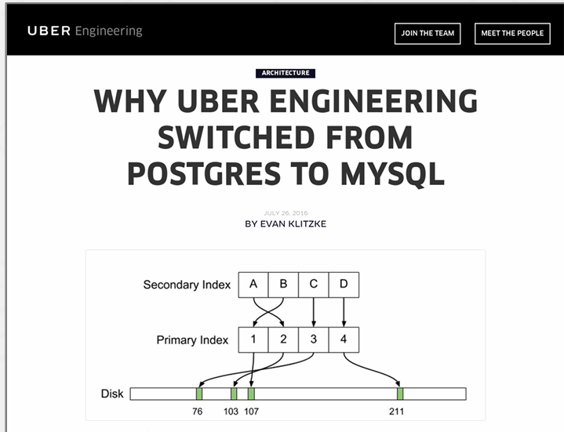

# 多版本并发控制（Multi-Version Concurrency Control, MVCC）
数据库管理系统在数据库中维护单个逻辑对象的多个物理版本：
→ 当事务写入对象时，数据库管理系统创建该对象的新版本。
→ 当事务读取对象时，它读取事务开始时存在的最新版本。

一方面是关于如何管理版本，即MV；另一方面，cc部分则涉及类似2PL和OCC

**多版本并发控制（Multi-Version Concurrency Control, MVCC）**

- 写入者不会阻塞读取者。
- 读取者不会阻塞写入者。
- 只读事务可以在不获取锁的情况下读取一致的快照。
  → 使用时间戳来确定可见性。
- 轻松支持时间旅行查询。

版本链：每个版本通常包含指向其前一个版本的指针，形成一个版本链

**详细解释**
1. **写入者不会阻塞读取者**：
   - **定义**：在 MVCC 中，写入操作不会阻塞读取操作。
   - **操作**：
     - **写操作**：事务对对象的修改会创建一个新的版本，而不是直接修改现有版本。
     - **读操作**：事务读取的是其开始时存在的最新版本，不会被写入操作阻塞。
   - **目的**：提高系统的并发性能，确保读取操作不会因写入操作而延迟。

2. **读取者不会阻塞写入者**：
   - **定义**：在 MVCC 中，读取操作不会阻塞写入操作。
   - **操作**：
     - **读操作**：事务读取的是其开始时存在的最新版本，不会影响其他事务的写入操作。
     - **写操作**：事务对对象的修改会创建新的版本，不会被读取操作阻塞。
   - **目的**：进一步提高系统的并发性能，确保写入操作不会因读取操作而延迟。

3. **只读事务可以在不获取锁的情况下读取一致的快照**：
   - **定义**：只读事务可以在不获取锁的情况下读取事务开始时的一致数据快照。
   - **操作**：
     - **读操作**：事务读取的是其开始时存在的最新版本，不需要获取锁。
     - **时间戳**：每个事务有一个开始时间戳，用于确定读取哪个版本。
   - **目的**：减少锁的使用，提高系统的并发性能，确保只读事务的一致性。

4. **使用时间戳来确定可见性**：
   - **定义**：使用时间戳来确定事务读取的数据版本的可见性。
   - **操作**：
     - **时间戳**：每个事务有一个开始时间戳，每个数据版本也有一个创建时间戳。
     - **可见性**：事务读取的是其开始时间戳之前创建的最新版本。
   - **目的**：确保事务读取的数据是一致的，不会受到其他事务的写操作的影响。

需要一个事务管理器，来保存事务。并且再数据中创建多个版本，比如这里的A1和A2，每个版本都有自己的起始和终止时间戳，可以告诉这个值的有效范围,这就是 mvcc的作用，将会生成这些不同的版本，然后 reader 进入系统，选择适合工作的版本即可。

## 快照隔离（Snapshot Isolation, SI）

当事务开始时，它看到的是事务开始时数据库的一致快照。
→ 不会出现活动事务的不完整写操作。
→ 如果两个事务更新同一个对象，则先写者胜出。
快照隔离容易受到写偏斜异常的影响。
 
## 多版本并发控制（MVCC）设计决策
+ 并发控制协议   Concurrency Control Protocol
+ 版本存储   Version Storage
+ 垃圾收集  Garbage Collection
+ 索引管理   Index Management
+ 删除操作  Deletes

### 1. 并发控制协议   Concurrency Control Protocol
方法 #1：时间戳排序
→ 为事务分配时间戳，以确定串行顺序。
方法 #2：乐观并发控制
→ 上节课讲的三阶段协议。
→ 使用私有工作区来创建新版本。
方法 #3：两阶段锁
→ 事务在读取或写入逻辑元组之前，必须获取相应物理版本的锁。

乐观并发控制和两阶段锁等这些协议 与MVCC有何关联呢？

理解MVCC的最佳方式就是将其视为一种机制，它告诉你如何维护多个版本，你仍然需要通过并发控制协议来保护该机制。
**MVCC的基本原理**是创建一个不同版本的链表，在某些时刻，可能会有写入者在进行写入操作，并创建新的版本，所以必须防范两个人试图同时写入并创建新值的操作。比如说一个单链表，那么同一时间只有一个人能够向该链表中添加元素。因此，需要引入一个并发控制机制。
这个版本控制机制的好处在于，如果作为一个事务，正在读取某些数据，且我的时间戳允许我这么做，那么就能读取一个较旧的版本，而读者可以绕过写入者继续进行。如果读者持有正确的时间戳或具备设当的串行化顺序，使得它们能够通行，那么写者旧不会阻塞读者。
在两阶段锁中，若我获取了写锁，则仅存在一个版本，不管是读还是写都将继续等待，然后通过意向锁的方式放款了限制，但是即便如此，在两阶段锁定的情况下，写入着最终仍会祖寺读取者。

### 2. 版本存储

数据库管理系统使用元组的指针字段为**每个逻辑元组创建一个版本链**。
→ 这使得数据库管理系统能够在运行时找到对特定事务可见的版本。
→ 索引始终指向链的“头部”。
不同的存储方案决定了每个版本的存储位置和内容。

方法 #1：追加存储 Append-Only Storage
→ 新版本被追加到同一表空间。
方法 #2：时间旅行存储 Time-Travel Storage
→ 旧版本被复制到单独的表空间。
方法 #3：增量存储  Delta Storage
→ 修改属性的原始值被复制到单独的增量记录空间。

#### 1. 追加存储 Append-Only Storage
所有逻辑元组的物理版本都存储在同一个表空间中。
版本是混合在一起的。
每次更新时，在表中的空闲空间追加一个新版本的元组。

版本链：每个新版本包含一个指针，指向其前一个版本

#### 2. 时间旅行存储 Time-Travel Storage
单独建立一个额外的表用于存储历史数据，主表（Main Table）存储的就是当前最新的数据，历史数据在单独的Time-Travel Table（历史表）里。当事务对数据进行更新时，也就是产生新版本时，DBMS会把旧版本的对象拷贝至历史表中，并且在历史表中维护好串联起多个旧版本的链表，之后在主表里写入新版本的数据，覆盖旧版本，然后再修改主表中相应的tuple的指针，令其指向历史表里最新的历史版本

#### 3. 增量存储  Delta Storage
修改属性的原始值被复制到单独的增量记录空间。
增量记录：每次写操作创建的新版本只记录修改的属性及其原始值，这些增量记录被存储在单独的空间中。
版本重建：读取时，通过合并增量记录和当前版本来重建完整的数据。

### 3. 垃圾收集  Garbage Collection
数据库管理系统需要随时间移除可回收的物理版本。
→ 没有活跃的事务可以看到该版本（快照隔离）。
→ 该版本是由已中止的事务创建的。
这就是MVCC里的垃圾回收，它的两个宗旨如下：
+ 如果任何active状态的事务都看不到某个历史版本（比如说现在的事务的时间戳都是10以上的，但这个历史版本的时间戳/版本号是1），那么这个古老的历史版本就再也用不上了，就可以把它删除
+ 如果某个事务创建了某个历史版本，但这个事务后来回滚了，那么这个历史版本也是无用的，可以删除

两个额外的设计决策：
→ 如何查找过期的版本？
→ 如何决定何时安全地回收内存？

**MVCC中的垃圾回收有如下两个实现思路**
方法 #1：元组级  Tuple-level
→ 通过直接检查元组来查找旧版本。
→ 后台真空清理 vs. 协同清理
方法 #2：事务级 Transaction-level
→ 事务跟踪它们的旧版本，因此数据库管理系统不必扫描元组来确定可见性。

####  TUPLE-LEVEL GC
+ 后台清理
后台会有一个单独的线程每隔一段时间就扫描历史表（或同类的其他表），然后结合当前active的事务的时间戳去分析表中哪一个版本是无用的。

后台清理也有一个优化手段：后台的GC线程没必要扫描整张表，对每一个历史版本进行判断。DBMS可以维护一个dirty block bitmap，去跟踪自从上次垃圾回收至今表里有哪些页被事务修改过，因此下一次垃圾回收的时候，只需要扫描自从上次GC以来被修改过的页面

合作清理
事务执行SQL查询语句时需要通过索引来访问相应的tuple及其历史版本，在这个过程中可以顺便扫描tuple，把无用的历史版本删除。这样的话就不需要额外的GC线程来完成垃圾回收，而是各个事务在执行的时候都会做一点垃圾回收的工作。

#### 事务级 Transaction-level

DBMS对每个事务会记下来它读/写了哪些东西，除此之外还会记录因为这个事务所进行的更新所导致的历史版本（what will be the versions that invalidated by the update of this transaction），基于此，DBMS便可以在一个事务过期了（out of scope）之后把这些东西都删除。

ppt有详细的步骤

### 4.索引管理   Index Management

主键索引指向版本链的**头部**。
→ 数据库管理系统必须更新主键索引的频率取决于系统在更新元组时是否创建新版本。
→ 如果事务更新元组的主键属性，则这被视为先删除再插入。
次级索引更加复杂……

一般情况下，主键索引相对比较好处理，因为主键索引会指向版本链表的头部，而且是通过物理地址（在哪个页的哪个slot）来定位的（如下图）。在新的版本产生后，主键索引可能要更新它所指向的物理地址。如果想修改某个tuple的主键，那么就要完成一个先删除再插入的操作。

**SECONDARY INDEXES** 二级索引
方法 #1：逻辑指针
→ 为每个元组使用一个固定的标识符，该标识符不会改变。
→ 需要一个额外的间接层。
→ 主键与元组ID的区别

方法 #2：物理指针
→ 使用指向版本链头的物理地址。

DBMS做辅助索引有两个流派，如上图所示。无论是哪个流派，索引的Key就是表里对应的那一列的attribute的数据，这两个流派的不同之处就是索引里的Value不同。

Logical Pointers策略中索引的Value是逻辑地址，比如说主键/行id的值，这个策略的缺点是如果想拿到完整的tuple就需要再通过主索引找到相应的tuple；

Physical Pointers策略就是对这一缺点进行的优化，它和主键索引一样，索引结构中最后记录的是物理地址，可以直接通过物理地址定位到完整的tuple，因此好处就是不用回表。但是这也有一定的问题：一个表通常有不止一个辅助索引，如果这些辅助索引都采用Physical Pointers策略，指向某个物理地址，那么在加入了新版本之后，不止是要修改/维护主键索引里的指针，还要修改所有的辅助索引里的指针。

与之相对的是，在Logical Pointers策略中，辅助索引最终只会指向相应的主键，然后再走主键索引，这样的话，在插入新版本之后只需要更新与维护主键索引里的指针，维护的开销大大降低

### MVCC INDEXES
多版本并发控制（MVCC）数据库管理系统的索引（通常）不存储元组的版本信息。
→ 例外：索引组织表（例如，MySQL）
每个索引必须支持来自不同快照的重复键：
→ 相同的键在不同的快照中可能指向不同的逻辑元组。

每个索引的底层数据结构必须支持非唯一键的存储。
使用额外的执行逻辑来为 primary key（主键）/ unique（唯一）索引执行条件插入。
→ 原子地检查键是否存在，然后插入。
工作线程在单次获取时可能会返回多个条目。然后它们必须跟随指针找到正确的物理版本。

### 5. 删除操作  Deletes
数据库管理系统仅在逻辑删除的元组的所有版本都不可见时，才物理删除该元组。
→ 如果一个元组被删除，则在其最新版本之后不能有该元组的新版本。
→ 不存在写-写冲突 / 先写者胜出
我们需要一种方法来表示某个元组在某个时间点已被逻辑删除。

方法 #1：删除标志
→ 维护一个标志，指示逻辑元组在最新物理版本之后已被删除。
→ 可以在元组头中或单独的列中维护该标志。
方法 #2：墓碑元组
→ 创建一个空的物理版本，指示逻辑元组已被删除。
→ 使用一个单独的池来存储墓碑元组，仅在版本链指针中包含特殊的位模式，以减少存储开销。

