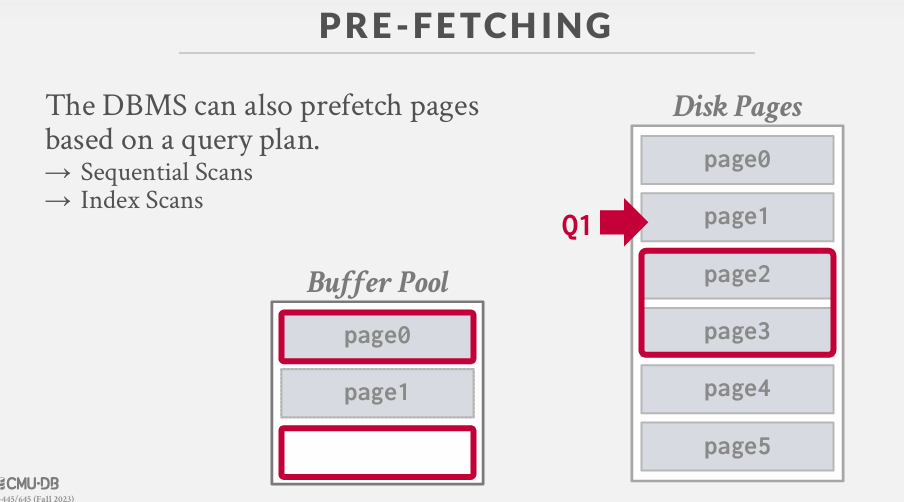

Problem #1:DBMS如何在磁盘上的文件中表示数据库

Problem #2:DBMS如何管理其内存并从磁盘来回移动数据。

## 数据库存储
空间控制：
→决定页面在磁盘上的写入位置。
→目标是将经常一起使用的页面尽可能物理上靠近地存放在磁盘上。

时间控制：
→决定何时将页面读入内存，以及何时将它们写回磁盘。
→目标是最小化因从磁盘读取数据而导致的停滞次数。

## TODAY'S AGENDA
Buffer Pool Manager
Disk I/O Scheduling
Replacement Policies
Other Memory Pools

### 1.  BUFFER POOL ORGANIZATION
内存区域被组织成一个固定大小的页数组。

数组条目被称为帧。

当数据库管理系统请求一个页面时，会将一个精确的副本放入这些帧中的一个。
脏页会被缓冲，不会立即写入磁盘。
→写回缓存

**BUFFER POOL META-DATA**
页面表
用于跟踪当前在内存中的页面。
→通常是一个固定大小的哈希表，通过锁保护以确保线程安全访问。

每个页面的附加元数据：
→脏标志
→固定/引用计数器
→访问跟踪信息

怎么理解 frame 和 页表？
因为每一个 page 都有一个 page_id，当我们从磁盘中拿到一个页放到 缓冲池中，是存放在一个数组中，由于每个page的差距可能很大，所以显然不能把page_id作为索引来插入到数据中。为什么不用一个map呢？而是用数组。因为缓冲池是一个固定大小，所以我们还需要维护驱逐的动作，该驱逐哪一个页呢？难道每次驱逐要遍历map吗？显然不合理。 所以我们用一个数组来保存页，这个数组的索引称为 帧（frame），而驱逐动作就是来根据这个frame来跟踪驱逐的。

而且我们修改完数据不是立即写入到磁盘中的，而是当缓冲池满了要驱逐页的时候再写回磁盘。

**PAGE TABLE VS. PAGE DIRECTORY**
页面目录
是**页面ID到数据库文件中页面位置的映射**。
→所有更改都必须记录在磁盘上，以便在重新启动时数据库管理系统可以找到它们。

页面表
是页面ID到缓冲池帧中页面副本的映射。
→这是一个内存数据结构，**不需要存储在磁盘上**。

**ALLOCATION POLICIES**
全局策略：
→为所有活动查询做决策。
局部策略：
→将帧分配给特定查询，不考虑并发查询的行为。
→仍需支持页面共享。

**缓冲池优化**
Multiple Buffer Pools  多个缓冲池
Pre-Fetching  预取
Scan Sharing  扫描共享
Buffer Pool Bypass  缓冲池绕过
 
1. Multiple Buffer Pools  多个缓冲池

数据库管理系统并不总是为整个系统使用单一的缓冲池。
→多个缓冲池实例
→每个数据库一个缓冲池
→每种页面类型一个缓冲池
将内存分区到多个池中有助于减少锁争用并提高局部性。

方法一：对象ID
→将对象标识符嵌入记录ID中，然后维护从对象到特定缓冲池的映射。

方法二：哈希
→通过对页面ID进行哈希来选择要访问的缓冲池。

2. 预取

数据库管理系统还可以根据查询计划预先读取页面。
→顺序扫描
→索引扫描

也就是当我从磁盘中拿到 page1是，我可以先预测将会拿去下一个连续的page，此时把page加入到内存：

### 3. 缓冲替换策略
当数据库管理系统需要释放一个帧以腾出空间给新页面时，它必须决定从缓冲池中驱逐哪个页面。
目标：
→正确性
→准确性
→速度
→元数据开销

**最近最少使用（LRU）**
维护每个页面上次访问的单个时间戳。当数据库管理系统需要驱逐一个页面时，选择时间戳最旧的那个。
→保持页面按排序顺序，以减少驱逐时的搜索时间。

RU + CLOCK替换策略**容易受到顺序扫描**的影响。
→一个查询执行顺序扫描，读取每个页面。
→这会污染缓冲池，使只读一次然后不再读取的页面占据空间。
→在OLAP工作负载中，最近使用的页面通常是最佳的驱逐页面。
LRU + CLOCK**仅跟踪页面最后一次访问的时间，但不记录访问频率**

**更好的策略：LRU-K**
跟踪每个页面**最后K次引用的历史作为时间戳**，并计算连续访问之间的间隔。
+ 可以通过区分引用类型来增加复杂性

数据库管理系统使用这个历史来估算页面下次被访问的时间。
+ 驱逐预期间隔最长的页面。
+ 为最近驱逐的页面维护一个临时内存缓存，以防止它们总是被驱逐。

引发的另一个问题：当我获取一个页面时，我尚未对其进行两次访问，他将会被驱逐。假设这个页未来会被访问很多次，我们应该保存该页。
解决方法：维护一个内存中的哈希表，记录以下信息：这时我最近从磁盘置换出去的页和被访问的时间戳。

**MYSQL APPROXIMATE LRU-K**
单链表LRU，但有两个入口点（“旧”和“年轻”）。
→新页面总是插入到旧列表的头部。
→如果旧列表中的页面再次被访问，则插入到年轻列表的头部。

**更好的策略：局部化**
数据库管理系统基于每个查询选择要驱逐的页面。这最大限度地减少了每个查询对缓冲池的污染。
→跟踪查询访问过的页面。
例如：PostgreSQL维护一个私有于查询的小型环形缓冲区。

**脏页面**
快速路径：如果缓冲池中的页面不是脏的，则数据库管理系统可以简单地“丢弃”它。
慢速路径：如果页面是脏的，则数据库管理系统必须回写到磁盘以确保其更改被持久化。
在快速驱逐与未来不会再读取的脏页面写入之间的权衡。

**后台写入**
数据库管理系统可以定期遍历页面表，并将脏页面写入磁盘。
当一个脏页面被安全地写入后，数据库管理系统可以选择驱逐该页面或仅取消设置脏标志。
需要小心的是，系统不能在日志记录被写入之前就写入脏页面……

**观察**
操作系统/硬件试图通过重新排序和批处理I/O请求来最大化磁盘带宽。
但它们并不知道哪些I/O请求比其他的更重要。
许多数据库管理系统建议将Linux切换到使用deadline或noop（FIFO）调度器。
→例如：Oracle、Vertica、MySQL

### 磁盘I/O调度
数据库管理系统维护内部队列来跟踪整个系统的页面读写请求。
基于几个因素计算优先级：
→顺序与随机I/O
→关键路径任务与后台任务
→表、索引、日志与临时数据
→事务信息
→基于用户的SLA（服务等级协议）
操作系统不知道这些，会妨碍工作……

大多数磁盘操作通过操作系统API进行。除非数据库管理系统指示不使用，否则操作系统会维护自己的文件系统缓存（也称为页面缓存、缓冲区缓存）。

大多数数据库管理系统使用直接I/O（O_DIRECT）来绕过操作系统的缓存。
→冗余的页面副本。
→不同的驱逐策略。
→失去对文件I/O的控制。

