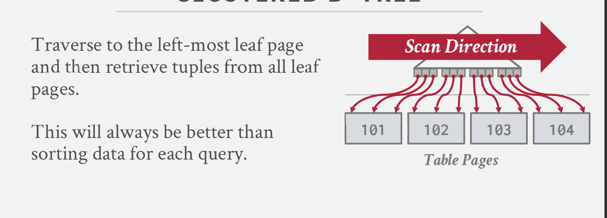

B+树与常规B树相比，其 + 特性的具体含义：

B+树是一种自平衡的有序树数据结构，它允许以O(log n)的时间复杂度进行搜索、顺序访问、插入和删除操作。
→它是二叉搜索树的一种泛化形式，因为一个节点可以拥有两个以上的子节点。
→B+树针对读写大量数据块的系统进行了优化。

完美平衡的，树结构中的每个节点都将具有相同的深度；

B连接树，每一层都是链接的；

## 节点
每个B+树节点由一个键值对数组组成。

键是从索引所基于的属性（或属性组合）派生出来的。
值会根据节点是被分类为内部节点还是叶节点而有所不同。 这些数组通常保持按键排序。 所有NULL键存储在最前面或最后面的叶节点中。

## 叶子节点

叶子节点的值：

方法#1：记录ID
- 指向与索引条目对应的元组位置的指针。

方法#2：元组数据
- 也称为索引组织存储。
- 叶节点存储元组的实际内容。
- 辅助索引必须将记录ID作为它们的值存储。

## b tree 和 b+ tree

b树：
更加空间高效，因为每个键在树中只出现一次。

因为在b+树中，比如删除记录key=35，它会从叶子节点中移除，但可能仍会保留在某个索引节点中；因为非叶子节点的作用是用来指定方向的；

B+树仅在叶节点中存储值，内部节点仅用于指导搜索过程。

b+树相较于b树的优势在于，获得更佳的并发访问性能；
为什么需要兄弟节点？
因为在进行分割和合并操作时，可能需要借助其与邻近节点合并；

## B+树 - 重复键
方法 #1: 追加记录ID
→将元组的唯一记录ID作为键的一部分添加，以确保所有键都是唯一的。
→数据库管理系统仍然可以使用部分键来查找元组。

也就是说这个键值包括 位置信息，这样的话就保证唯一性：

方法 #2: 溢出叶节点
→允许叶节点溢出到包含重复键的溢出节点中。
→这更复杂，维护和修改起来也更困难。

## 聚集索引

表按照主键指定的排序顺序存储。
→可以是堆组织存储或索引组织存储。
一些数据库管理系统总是使用聚集索引。
→如果表不包含主键，数据库管理系统将自动创建一个隐藏的主键。
其他数据库管理系统则完全不能使用它们。

## 非聚簇索引

## 闩锁抓取/耦合
查找：从根节点开始向下遍历树：
→获取子节点的R闩锁，
→然后释放父节点的闩锁。
→重复此过程直到到达叶节点。

插入/删除：从根节点开始向下，根据需要获取W闩锁。一旦子节点被锁定，检查是否安全：
→如果子节点安全，释放所有祖先节点上的闩锁。

## 性能
所以当更新的时候会首先获取根锁；
所以会造成性能不好；

## 乐观锁
对B+树的大多数修改都不需要进行分裂或合并。
不要假设会发生分裂或合并，而是乐观地使用读闩锁遍历树。
如果你的猜测错误，使用悲观算法重新遍历。

搜索：与之前相同。

插入/删除：
→像搜索一样设置闩锁，到达叶节点，并在叶节点上设置W闩锁。
→如果叶节点不安全，释放所有闩锁，并使用之前的带有写闩锁的插入/删除协议**重新启动线程**。

这种方法乐观地假设只有叶节点会被修改；如果不是这样，第一次到达叶节点时设置的R闩锁就是浪费的。

## 移动叶子节点
到目前为止，所有示例中的线程都是以“自顶向下”的方式获取闩锁的。
→线程只能从其当前节点之下的节点获取闩锁。
→如果所需的闩锁不可用，线程必须等待直到它变得可用。
但如果线程想要从一个叶节点移动到另一个叶节点呢？

读操作是r锁，所以可以共享，不影响；
如果一个线程读一个线程写就会发生碰撞：

因为每个线程只对自己的情况知道，不知道外面的所有情况，也就是说不知道c这个w锁会持续多久，这个w锁会不会像自己移动等，所以最好的方式是**终结自己**。

叶节点扫描
闩锁不支持死锁检测或避免。我们处理这个问题的唯一方法是通过编码纪律。
叶节点兄弟节点闩锁获取协议必须支持“不等待”模式。
数据库管理系统的数据访问代码必须设计得当，以防止因闩锁引起的死锁问题。

