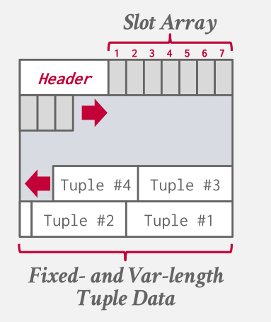
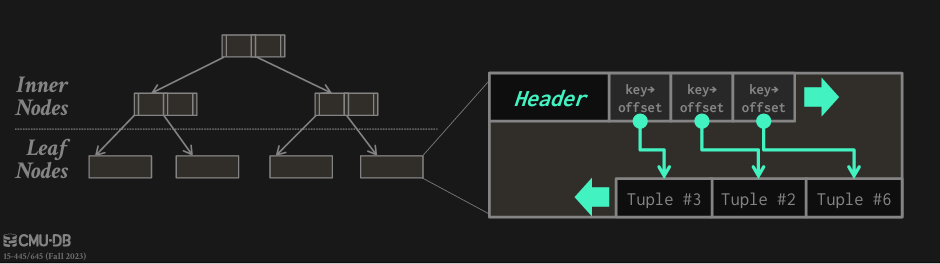
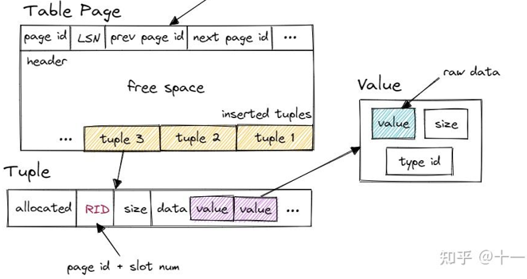
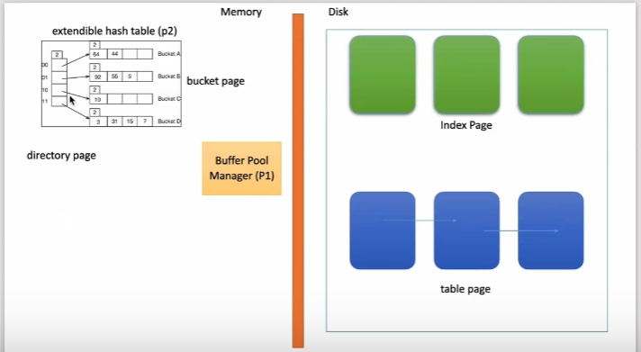

Value
Tuple
Column
Table
Schema
Index
catalog

## ppt 
DBMS假定数据库的主存储位置在非易失性磁盘上。
DBMS的组件管理数据在非易失性和易失性存储之间的移动。

对非易失性存储的随机访问几乎总是比顺序访问慢得多。
DBMS希望最大化顺序访问。
→算法试图减少对随机页面的写次数，以便将数据存储在连续的块中。
→同时分配多个页面称为区段


### Page Layout
每一个页都有一个头元数据，包含这个页的信息。
假设每个页只保存 tuple.



从上图看出，每个页的组织结构，header，slot_array和Tuple；
每个slot_array都指向一个Tuple，Tuple是从页尾开始添加的。而且整个元组都是存储在一个页面中。

看一下pagetable的信息：
```cpp
private:
using TupleInfo = std::tuple<uint16_t, uint16_t, TupleMeta>;
char page_start_[0]; // 存储整页的数据
page_id_t next_page_id_; 
uint16_t num_tuples_; // 当前页面上tuple的数量
uint16_t num_deleted_tuples_; // 表示当前页面上已被删除但空间未被释放的记录数量
TupleInfo tuple_info_[0]; // slot_array 维护每个tuple的信息
```

在Tuple类中每个 Tuple都维护一个 RID 和 data_，
这个RID维护两个变量,即当前tuple所在的页和所对应缺槽的索引：
```cpp
  page_id_t page_id_{INVALID_PAGE_ID}; // 存储的页
  uint32_t slot_num_{0};  // 槽的位置
```

这个slot_array的内容,其实存储在TablePage中的变量tuple_info_ :
TupleInfo tuple_info_[0]; TupleInfo = [offset, size, meta];

>假如我们想要获取页中的 tuple,只需传入RID即可，通过获取其槽的位置，就可以获取到Tupel了。
```cpp
auto TablePage::GetTuple(const RID &rid) const -> std::pair<TupleMeta, Tuple> {
  auto tuple_id = rid.GetSlotNum();
  if (tuple_id >= num_tuples_) {       
    throw bustub::Exception("Tuple ID out of range");
  }
  auto &[offset, size, meta] = tuple_info_[tuple_id];
  Tuple tuple;
  tuple.data_.resize(size);
  memmove(tuple.data_.data(), page_start_ + offset, size);
  tuple.rid_ = rid;
  return std::make_pair(meta, std::move(tuple));
}
```

可以看到这个 tuple_info_ 维护每一个 tuple 的偏移量，大小和元数据信息。

>假如我们现在要添加一个元组，我们需要传入两个信息：TupleMeta，Tuple。然后在页中找到要插入此元组的偏移量，然后把数据夫复制到 page_start+offset处即可：
```cpp
auto TablePage::InsertTuple(const TupleMeta &meta, const Tuple &tuple) -> std::optional<uint16_t> {
  auto tuple_offset = GetNextTupleOffset(meta, tuple);
  if (tuple_offset == std::nullopt) {
    return std::nullopt;
  }
  auto tuple_id = num_tuples_;
  tuple_info_[tuple_id] = std::make_tuple(*tuple_offset, tuple.GetLength(), meta);
  num_tuples_++;
  memcpy(page_start_ + *tuple_offset, tuple.data_.data(), tuple.GetLength());
  return tuple_id;
}
```

当我们添加 tupel 时，可以看到，tuple是从后向前增长的，slot是从前向后增张的

假如现在要删除 tuple3,可以看到并不影响其他 tuple的插入。当插入tuple4时，slot仍然指向他本身。


DBMS为每个逻辑元组分配一个唯一的记录标识符，表示其在数据库中的物理位置。
→File Id, Page Id， Slot #
→大多数dbms不以元组的形式存储Id。
→SQLite使用ROWID作为真正的主键，并将它们存储为隐藏属性。
应用程序永远不应该依赖这些id来表示任何东西。

比如这里的RID,每个Tuple维护一个RID，其内有 page_id_和 slot_num_；

缺点：
1. 页没有被充分的利用，当剩余的空间不足以容纳一个tuple时，那么这个空间将剩余
2. 假如每次更新一个tuple时，将会加载整个页面，这将会导致无用的数据加入到内存
3. 更新多个元组时最糟糕的情况是每个元组都在单独的页面上。

在页面架构中的问题将可能在  Log-Structured Storage 中得到解决

页面架构的缺点：
1. 页没有被充分的利用，当剩余的空间不足以容纳一个tuple时，那么这个空间将剩余
2. 假如每次更新一个tuple时，将会加载整个页面，这将会导致无用的数据加入到内存
3. 更新多个元组时最糟糕的情况是每个元组都在单独的页面上。

DBMS不是将元组存储在页面中，而是维护记录元组更改的日志。
→每个日志条目代表一个元组PUT/DELETE操作。
1996年最初提出为日志结构合并树（LSM trees）。
DBMS将新的日志条目附加到内存缓冲区中，然后将更改顺序写入磁盘。

日志存储的基本思想是，不存储单独的元组，而是维护这些元组变更的日志记录。

DBMS存储包含对元组（PUT， DELETE）更改的日志记录。
→每个日志记录必须包含元组的唯一标识符。
→Put记录包含元组内容。
→delete将元组标记为已删除。
当应用程序对数据库进行更改时，DBMS将日志记录追加到文件的末尾，而不检查以前的日志记录。

#### Tuple Layout
元组本质上是一个字节序列。
DBMS的工作是将这些字节解释为属性类型和值。

每个元组都有一个前缀，其中包含关于它的元数据。
→可见性信息（并发控制）
→NULL值的位图。
我们不需要存储关于模式的元数据。

这里分析一下 Tuple这个类：
首先是 struct TupleMeta：主要用于存储元组（Tuple）的元数据（metadata），即与元组相关的辅助信息。这些元数据用于记录元组的一些重要属性，如事务版本号（timestamp）和删除标记等。这些信息对于数据库的事务处理、并发控制和垃圾回收等功能非常重要。

Tuple 维护两个变量:
```cpp
  auto GetDataPtr(const Schema *schema, uint32_t column_idx) const -> const char *;
  RID rid_{};  // if pointing to the table heap, the rid is valid
  std::vector<char> data_;
```
主要了解
```cpp
  // constructor for creating a new tuple based on input value
  Tuple(std::vector<Value> values, const Schema *schema);

    // Get the value of a specified column (const)
  // checks the schema to see how to return the Value.
  auto GetValue(const Schema *schema, uint32_t column_idx) const -> Value;
```
这里涉及到 Value 和 Schema，需要了解这两个东西；

1. Value
//值是一个抽象类，表示存储在SQL数据库中的视图
//某种物化状态。所有的值都有类型和比较函数，但是
//子类实现其他特定于类型的功能。
```cpp
union Val value_;
union size_;
TypeId type_id_;
```
value 则是某个字段具体的值，value 本身还保存了类型信息。


2. schema
模式。每列都有一个表头（名字），shema就是一组表头的集合，拿来指明这张表有哪些列或者某个executer需要处理哪些列。
```cpp
  /** 固定长度的列大小，即一个元组使用的字节数。 */
  uint32_t length_;
  /** All the columns in the schema, inlined and uninlined. */
  std::vector<Column> columns_;

  /** True if all the columns are inlined, false otherwise. */
  bool tuple_is_inlined_{true};
  /** Indices of all uninlined columns. */
  std::vector<uint32_t> uninlined_columns_;
```
从Schema的构造函数可知，传递参数： const std::vector<Column> &columns，即一组列；
我们知道每个 column都有一个column_offset_，即在tuple中的偏移量。当我们构建Schema时就可以知道这个值了；
| column1 | column2 | column3 | column4 |大概是这样

3. column
相当于一列的名字（表头），也能调用其expression完成对应的操作（前面在AbstractExpression中有说）
```cpp
  /** Column name. */
  std::string column_name_;
  /** Column value's type. */
  TypeId column_type_;
  /** 对于非内联列，这是指针的大小。否则，大小为定长列. */
  uint32_t fixed_length_;
  /** 对于内联列，为0。否则，为变长列的长度。 */
  uint32_t variable_length_{0};

  /** Column offset in the tuple. */
  uint32_t column_offset_{0};
```

在数据库系统中，非内联列（non-inlined columns）和内联列（inlined columns）的区别主要在于它们在内存或磁盘上的存储方式。这两种存储方式的设计目的是为了优化存储效率和查询性能。

内联列（Inlined Columns）
内联列指的是那些在数据行中直接存储的列。这些列通常具有固定大小或者较短的长度。内联列的优点是可以直接访问，无需额外的间接寻址，因此查询性能较好。

特点：
1. 固定大小：通常用于存储固定大小的数据类型，如整数、浮点数等。
2. 直接存储：列的数据直接存储在数据行的固定位置。
3. 易于访问：可以直接通过偏移量访问，无需间接寻址。
4. 节省空间：对于固定大小的数据类型，可以紧凑地存储，减少存储开销。

非内联列（Non-Inlined Columns）
非内联列指的是那些不直接存储在数据行中的列。这些列通常具有可变长度，或者存储的数据较大。非内联列的数据通常存储在一个单独的区域，并通过**一个指针或偏移量**来引用实际的数据位置。

特点：
1. 可变长度：通常用于存储可变长度的数据类型，如字符串、Blob 等。
2. 间接存储：列的数据存储在一个单独的区域，数据行中仅存储一个指针或偏移量指向实际数据。
3. 额外寻址：访问非内联列的数据时，需要先通过偏移量或指针找到实际的数据位置。
4. 节省空间：对于可变长度的数据类型，可以避免因数据长度变化导致的数据行大小变化，从而减少存储开销。

假设 id 列是内联列，直接存储在数据行中。假设 name 和 address 列是非内联列，仅存储偏移量，实际数据存储在另一个区域。
```plaintext
| id (fixed-size) | name_offset | address_offset |
```
实际数据存储在另一个区域：
```
| name_data | address_data |
```

### Index
到目前为止，我们讨论的两种表存储方法都依赖于索引来查找单个元组。
→这样的索引是必要的，因为表本身是无序的。
但是，如果DBMS可以使用索引自动对元组进行排序呢?

我们知道页中存储的每个tuple是无序的，为了获取哪个提供页码和槽号的记录ID，需要一种数据结构或索引，指向每一个tuple。也就是需要一个索引，能够找到我们想要的数据。

DBMS将表的元组存储为索引数据结构的值。
→仍然使用看起来像开槽页面的页面布局。
元组通常根据键在页面中排序
(mysql 的 innob引擎就是这样)



元组本质上是一个字节序列。
DBMS的工作是将这些字节解释为属性类型和值。
DBMS的目录包含系统使用的表的模式信息
找出元组的布局

**Index这个抽象类**
class Index -不同类型的派生索引的基类

索引结构主要维护底层表的 schema (模式信息)以及索引键和元组键之间的映射关系，并为外部世界提供一种抽象的方式来与底层索引实现交互，而不暴露实际实现的接口。

除了简单的插入、删除、谓词插入、点查询和全索引扫描之外，索引对象还处理谓词扫描。谓词扫描仅支持连接，根据谓词内表达式的类型可能会或可能不会进行优化。
index 成员：
```cpp
 private:
  /** The Index structure owns its metadata */
  std::unique_ptr<IndexMetadata> metadata_;
```

类IndexMetadata -保存索引对象的元数据。
元数据对象维护索引的 schema (元组模式)和键属性，因为外部调用者不知道索引键的实际结构，所以维护这种映射关系并进行元组键和索引键之间的转换是索引的责任
IndexMetadata类成员：
```cpp
 private:
  /** The name of the index */
  std::string name_;
  /** The name of the table on which the index is created */
  std::string table_name_;
  /** The mapping relation between key schema and tuple schema */
  const std::vector<uint32_t> key_attrs_; // 存储索引键在基表中的列索引，便于数据库系统快速定位到基表中的对应列。
  /** The schema of the indexed key */
  std::shared_ptr<Schema> key_schema_; // 描述索引键的结构,就是key_attrs_对应基表的columns
  /** Is primary key? */
  bool is_primary_key_; 
```
构造函数
```cpp
IndexMetadata(std::string index_name, std::string table_name, const Schema *tuple_schema,
              std::vector<uint32_t> key_attrs, bool is_primary_key)
```
参数：
+ index_name：索引的名称。
+ table_name：创建索引的表的名称。
+ tuple_schema：基表的模式。
+ key_attrs：索引键与基表列之间的映射关系。
+ is_primary_key：是否为主键索引。

用一个例子串起来：
假设我们有一个名为 students 的表，包含 id, name, age 等字段，并且我们创建了一个基于 name 字段的索引：
```sql
CREATE TABLE students (
    id INT PRIMARY KEY,
    name VARCHAR(255),
    age INT
);

-- 创建基于 name 字段的索引
CREATE INDEX idx_students_name ON students(name);
```
我们可以使用 IndexMetadata 类来存储这个索引的元数据：
```cpp
int main() {
  // 假设这是表的模式
  Schema tuple_schema({
      {"id", TypeId::INTEGER},
      {"name", TypeId::VARCHAR},
      {"age", TypeId::INTEGER}
  });

  // 创建索引元数据
  std::vector<uint32_t> key_attrs = {1};  // name 字段的索引为 1
  IndexMetadata metadata("idx_students_name", "students", &tuple_schema, key_attrs, false);

  // 获取索引信息
  std::cout << "Index Name: " << metadata.GetName() << std::endl;
  std::cout << "Table Name: " << metadata.GetTableName() << std::endl;
  std::cout << "Key Schema: " << metadata.GetKeySchema()->ToString() << std::endl;
  std::cout << "Index Column Count: " << metadata.GetIndexColumnCount() << std::endl;
  std::cout << "Key Attrs: ";
  for (auto attr : metadata.GetKeyAttrs()) {
    std::cout << attr << " ";
  }
  std::cout << std::endl;
  std::cout << "Is Primary Key: " << metadata.IsPrimaryKey() << std::endl;

  return 0;
}
```

上面是一个index的抽象，下面看一下ExtendibleHashTableIndex:
成员变量：
```cpp
 protected:
  // comparator for key
  KeyComparator comparator_;
  // container
  DiskExtendibleHashTable<KeyType, ValueType, KeyComparator> container_;
```
可以看到这里的 container_ 正是我们在project2中的实现可扩展哈希表： DiskExtendibleHashTable<KeyType, ValueType, KeyComparator>

我们知道 DiskExtendibleHashTable的构造函数必须需要传入：
   * @param name
   * @param bpm buffer pool manager to be used
   * @param cmp comparator for keys
   * @param hash_fn the hash function

看一下ExtendibleHashTableIndex的构造函数：
```cpp
template <typename KeyType, typename ValueType, typename KeyComparator>
HASH_TABLE_INDEX_TYPE::ExtendibleHashTableIndex(std::unique_ptr<IndexMetadata> &&metadata,
                                                BufferPoolManager *buffer_pool_manager,
                                                const HashFunction<KeyType> &hash_fn)
    : Index(std::move(metadata)),
      comparator_(GetMetadata()->GetKeySchema()),
      container_(GetMetadata()->GetName(), buffer_pool_manager, comparator_, hash_fn) {}
```
这里主要是  comparator_(GetMetadata()->GetKeySchema())，拿到 Schema 作为比较器，我们知道这里的Schema是索引键的结构。我们知道此时的类型是KeyComparator，看一下这个的源头是什么，是：class GenericComparator，里面维护一个变量key_schema_,也就是此时的 >GetKeySchema()返回值：
```cpp
 private:
  Schema *key_schema_;
```

看一下怎么比较的：
```cpp
 inline auto operator()(const GenericKey<KeySize> &lhs, const GenericKey<KeySize> &rhs) const -> int {
    uint32_t column_count = key_schema_->GetColumnCount();

    for (uint32_t i = 0; i < column_count; i++) {
      Value lhs_value = (lhs.ToValue(key_schema_, i));
      Value rhs_value = (rhs.ToValue(key_schema_, i));

      if (lhs_value.CompareLessThan(rhs_value) == CmpBool::CmpTrue) {
        return -1;
      }
      if (lhs_value.CompareGreaterThan(rhs_value) == CmpBool::CmpTrue) {
        return 1;
      }
    }
    // equals
    return 0;
  }
```
我们知道，在桶插入等操作的时候会用到cmp_,比如：cmp(array_[i].first, key) 类型是KEY;

这里的 GenericKey<KeySize>：
  通用键用于索引不透明的数据。
  这个键类型使用一个固定长度的数组来保存用于索引的数据，其实际大小是通过模板参数指定和实例化的。
看一下  GenericKey类里的函数：
```cpp
inline void SetFromKey(const Tuple &tuple);
inline void SetFromInteger(int64_t key);
inline auto ToValue(Schema *schema, uint32_t column_idx) const -> Value{};

// actual location of data, extends past the end.
char data_[KeySize];
```
此时我们也知道了这个 key_schema_怎么用来比较的了。

此时我们返回来看一下 插入和删除：
比如插入：
```cpp
template <typename KeyType, typename ValueType, typename KeyComparator>
auto HASH_TABLE_INDEX_TYPE::InsertEntry(const Tuple &key, RID rid, Transaction *transaction) -> bool {
  // construct insert index key
  KeyType index_key;
  index_key.SetFromKey(key);

  return container_.Insert(index_key, rid, transaction);
}
```
注意一下这里的 Tuple key，假如我们设置的索引为一个 column,那么这里的tuple就是一个value一个可以，比如：
`CREATE INDEX idx_students_name ON students(name);`，那么此时tuple就是 name:value。

可以看到插入到桶中的数据解释 pair(KeyType(Tuple), RID),也就是桶中的数据就是 RID，保存的是当前Tuple的页pid和槽位置。这个键值key是通过.SetFromKey(key)转换而来的

这个 index_key 类型是 GenericKey，而SetFromKey就是把 tuple里的数据放到 data_中，而 hase 通过index_key生成一个 uint32的hash值。此时再看一下 ToValue 这个函数，便可以知道怎么拿到一个 Value 了。
因为已经把 Tuple的数据保存到 data_中了，那value时，只要知道当前 schema在tuple中的偏移量，便可以通过这个偏移量拿到数据：
```cpp
  inline auto ToValue(Schema *schema, uint32_t column_idx) const -> Value {
    const char *data_ptr;
    const auto &col = schema->GetColumn(column_idx);
    const TypeId column_type = col.GetType();
    const bool is_inlined = col.IsInlined();
    if (is_inlined) {
      data_ptr = (data_ + col.GetOffset());
    } else {
      int32_t offset = *reinterpret_cast<int32_t *>(const_cast<char *>(data_ + col.GetOffset()));
      data_ptr = (data_ + offset);
    }
    return Value::DeserializeFrom(data_ptr, column_type);
  }
```

下面这两个图也终于可以理解了,也知道了这个索引的键值是什么了：






### catalog 
下面根据这个流程进行分析 catalog 


catalog 维护一系列表的TableInfo，而一个 TableInfo 维护了一个表的信息：Schema,name_,TableHeap,table_oid_t;
table heap 是管理 table 数据的结构,表示磁盘上的物理表。他是一个双向链表。

假如想得到一个 tuple，只需传入这个 tuple的RID即可;
```CPP
auto TableHeap::GetTuple(RID rid) -> std::pair<TupleMeta, Tuple> {
  auto page_guard = bpm_->FetchPageRead(rid.GetPageId());
  auto page = page_guard.As<TablePage>();
  auto [meta, tuple] = page->GetTuple(rid);
  tuple.rid_ = rid;
  return std::make_pair(meta, std::move(tuple));
}
```

可以看到这里用到了 TablePage，table heap 本身并不直接存储 tuple 数据，tuple 数据都存放在 table page 中。table heap 可能由多个 table page 组成，仅保存其第一个 table page 的 page id。需要访问某个 table page 时，通过 page id 经由 buffer pool 访问。

table page 是实际存储 table 数据的结构，父类是 page。相较于 page，table page 多了一些新的方法。table page 在 data 的开头存放了 next page id、prev page id 等信息，将多个 table page 连成一个双向链表，便于整张 table 的遍历操作。当需要新增 tuple 时，table heap 会找到当前属于自己的最后一张 table page，尝试插入，若最后一张 table page 已满，则新建一张 table page 插入 tuple。table page 低地址存放 header，tuple 从高地址也就是 table page 尾部开始插入。

看一下**TableIterator**
在TableHeap 中有两个函数
```cpp
auto MakeIterator() -> TableIterator;
auto MakeEagerIterator() -> TableIterator;
```

现在看一下 TableIterator这个类：
```cpp
 private:
  TableHeap *table_heap_;
  RID rid_;
//当创建表迭代器时，我们将记录应该扫描的最大RID。
//否则在扫描时更新会出现死循环。（在项目4中，更新应该以删除+插入的方式实现。）
  RID stop_at_rid_;
```
通过  TableIterator::operator++()，我们可以知道，通过这个迭代器可以访问每一个 tuple；每一次获取下一个槽的位置，
`auto next_tuple_id = rid_.GetSlotNum() + 1;`来找下一个 tuple；


## BusTub 查询引擎

在实验前还需要实际的观察下 BusTub 是如何接受一条 SQL 语句，并最终返回结果的。在讲义上提到我们可以实际的使用 BusTub shell 执行 SQL 语句，类似 Linux 中 bash 接受终端的一条语句运行。


可以知道，我们通过 ExecutorContext 和 AbstractPlanNodeRef来构造一个 AbstractExecutor执行器；
```cpp
    // Construct the executor for the abstract plan node
    auto executor = ExecutorFactory::CreateExecutor(exec_ctx, plan);
```

### AbstractExecutor
AbstractExecutor实现了Volcano一次元迭代器模型。这是BustTub中所有执行器执行的基类。引擎继承，并定义所有执行器支持的最小接口。 

```cpp
// 每个执行器需要初始化的东西都不一样，一般是初始化指向表头的迭代器指针，或者自己定义的一些辅助循环的值
// 拿seq_scan来说，就需要在这里将迭代器指针指向表头。
virtual void Init() = 0;

// 需要做到调用一次next就输出且只输出一组tuple的功能，输出是通过赋值*tuple参数，并return true
// 如果没有能输出的了，return false
virtual auto Next(Tuple *tuple, RID *rid) -> bool = 0;

// Schema相当于存储了表的表头名字，OutputSchema用来指出此节点需要输出哪些列（哪些表头需要考虑在内）
virtual const Schema *GetOutputSchema() = 0;

//* 执行程序在其中运行的执行程序上下文
ExecutorContext *exec_ctx_;
```

### ExecutorContext
（AbstractExecutor构造函数的参数之一）
上下文信息，也就是说这次执行所用到的一些关键信息
```cpp
// 这个Catalog至关重要，存储了一个数据库的全部表格信息的索引，提供了对表格的操作。
// 只有这个Catalog是我们可能会用到的，比如在seq_scan中需要利用它获取目标表
Catalog *catalog_;
```

### AbstractPlanNode
（AbstractExecutor构造函数参数之二）

用于存储节点有关的信息，**AbstractExecutor**利用用里面的信息来完成任务

AbstractPlanNode表示系统中所有可能的计划节点类型。计划节点建模为树，因此每个计划节点可以有可变数量的子节点。
包含:输出模式 和 子节点

```cpp
AbstractPlanNode(SchemaRef output_schema, std::vector<AbstractPlanNodeRef> children)
    : output_schema_(std::move(output_schema)), children_(std::move(children)) {}
/**
 * The schema for the output of this plan node. In the volcano model, every plan node will spit out tuples,
 * and this tells you what schema this plan node's tuples will have.
 */
SchemaRef output_schema_;  //输出模式 using SchemaRef = std::shared_ptr<const Schema>;

/** The children of this plan node.子节点集合 */
std::vector<AbstractPlanNodeRef> children_;
```
AbstractPlanNode 类定义了查询计划节点的基本接口和行为，它是所有具体查询计划节点的基类。通过继承 AbstractPlanNode，具体的查询计划节点可以实现自己的逻辑，并且可以方便地与其他节点组合形成查询计划树。

看一下 SeqScanPlanNode：`class SeqScanPlanNode : public AbstractPlanNode`
这个节点的作用是 扫描 表，所以维护：表的索引 和 表名，然后还有一个过滤器（谓词表达式）。
AbstractExecutor可以在这里获取TableOid和Predicate:
```cpp
  /**
   * Construct a new SeqScanPlanNode instance.
   * @param output The output schema of this sequential scan plan node
   * @param table_oid The identifier of table to be scanned
   */
  SeqScanPlanNode(SchemaRef output, table_oid_t table_oid, std::string table_name,
                  AbstractExpressionRef filter_predicate = nullptr)
      : AbstractPlanNode(std::move(output), {}),
        table_oid_{table_oid},
        table_name_(std::move(table_name)),
        filter_predicate_(std::move(filter_predicate)) {} 

  table_oid_t table_oid_;
  std::string table_name_;
  AbstractExpressionRef filter_predicate_; 

  /** @return The type of the plan node */
  auto GetType() const -> PlanType override { return PlanType::SeqScan; }
  /** @return The identifier of the table that should be scanned */
  auto GetTableOid() const -> table_oid_t { return table_oid_; }

  // 谓词，返回值全是真值的表达式，AbstractExpression就是一颗表达式树。
    AbstractExpressionRef filter_predicate_; //  using AbstractExpressionRef = std::shared_ptr<AbstractExpression>;
```
filter_predicate_：类型：AbstractExpressionRef（是一个 std::shared_ptr<AbstractExpression> 类型）
含义：表示用于过滤的谓词表达式。
用途：用于在顺序扫描过程中过滤不符合条件的记录。

看一下 **AbstractExpression**：
表达式类，一颗表达式树中的节点，比如比较，聚合，或者常量，column元素。其中column表达式也作为了column类的成员之一。

AbstractExpression是系统中所有表达式的基类。表达式建模为树，即每个表达式可以有一个可变数量的子表达式。
```cpp
    /**
   * Create a new AbstractExpression with the given children and return type.
   * @param children 子表达式的向量。
   * @param ret_type 表达式求值后的返回类型。
   */
  AbstractExpression(std::vector<AbstractExpressionRef> children, TypeId ret_type)
      : children_{std::move(children)}, ret_type_{ret_type} {}

  /** The children of this expression. Note that the order of appearance of children may matter. */
  std::vector<AbstractExpressionRef> children_;

 private:
  /** The return type of this expression. */
  TypeId ret_type_;
```

+ ComparisonExpression：用于比较，实例化后做为predicate_谓词（下面例子中的predicate就是此类的实例化），或者having（在aggregation中会用到）。

返回的是一个装载Value类中的bool值，需要用value.GetAs<bool>()得到这个值，用于判断是否满足比较的条件（比较的细节：比如是>还是<，就不用我们关心了，交给Evaluate函数就行）

`Value value = plan_->GetPredicate()->Evaluate(tuple, schema)`

+ ColumnValueExpression：列元素的表达值，有一个很大的作用，它的Evaluate函数能返回当前tuple中哪一个value是对应这个column的。

+ ConstantValueExpression：常数表达式，返回值永远是一个常数

+ AggregateValueExpression：在AggregateExecutor中用到，作用和ColumnValueExpression类似，用于找出属于当前column的这个值。


