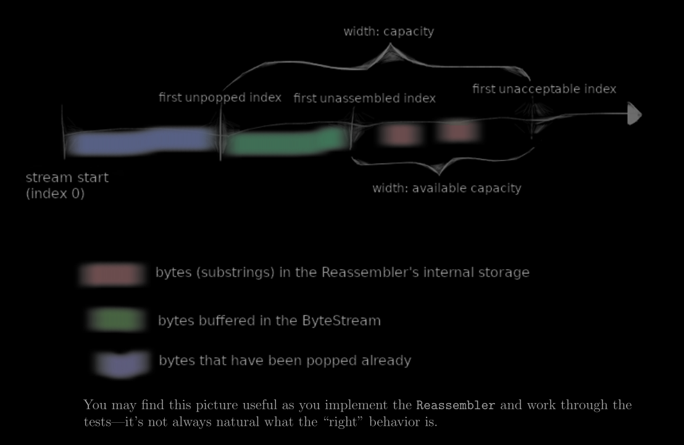
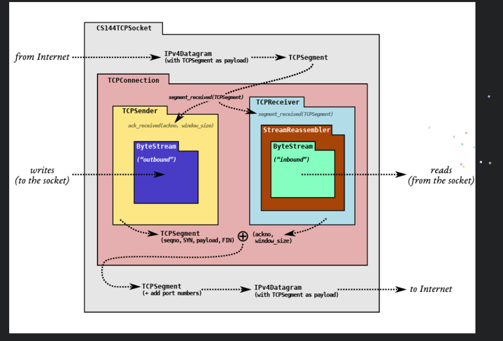

# 任务1  Putting substrings in sequence
# 翻译
在 Checkpoint 0 中，你使用了互联网流套接字（Internet stream socket）从一个网站获取信息并发送电子邮件消息，使用了 Linux 内置的传输控制协议（TCP）实现。这个 TCP 实现成功地创建了一对可靠的、按顺序传输的字节流（一个从你到服务器，另一个相反方向），即使底层网络只能提供“尽力而为”的数据报传递。所谓“尽力而为”是指：网络可能会丢失、乱序、修改或重复发送短数据包。你还自己在一台计算机的内存中实现了字节流抽象。在接下来的几周内，你将亲自实现 TCP，以便在一对通过不可靠数据报网络连接的计算机之间提供字节流抽象。

>为什么我要做这个？ 在一个不太可靠的服务之上提供一个服务或抽象，这构成了网络中的许多有趣问题。在过去的 40 年里，研究人员和从业者们已经想出了如何通过互联网传输各种事物的方法——消息和电子邮件、超链接文档、搜索引擎、音频和视频、虚拟世界、协作文件共享、数字货币等等。TCP 本身的角色是使用不可靠的数据报提供一对可靠的字节流，这是其中的经典例子之一。合理的看法认为，TCP 实现可以算作全球最广泛使用的复杂计算机程序之一。

实验任务将要求你以模块化方式构建 TCP 实现。还记得你在 Checkpoint 0 中实现的 ByteStream 吗？在接下来的实验中，你将把其中的两个通过网络传输：一个“出站” ByteStream，用于本地应用程序写入到套接字的数据，并由你的 TCP 发送给对等方；另一个“入站” ByteStream 用于从对等方接收的数据，并由本地应用程序读取。

2. Putting substrings in sequence
作为实验任务的一部分，你将实现一个 **TCP 接收器**：该模块接收数据报，并将其转换为可靠的字节流，以供应用程序从套接字中读取——就像你在 Checkpoint 0 中使用 webget 程序从 Web 服务器读取字节流一样。

**TCP 发送器**将其字节流划分为短段（每个子串不超过约 1,460 字节），使其能够适合于一个数据报。但网络可能会对这些数据报进行重新排序，或者丢弃它们，或者多次传递它们。**接收器必须将这些段重新组合**成它们最初的连续字节流。

在本次实验中，你将编写负责重新组装的的数据结构：Reassembler。它将接收子串，这些**子串由一串字节和该字符串在更大流中的第一个字节的索引组成**。流中的每个字节都有自己唯一的索引，从零开始并向上计数。一旦 Reassembler 知道流中的下一个字节，它将把该字节写入 ByteStream 的 Writer 端——这正是你在 Checkpoint 0 中实现的 ByteStream。Reassembler 的“客户”可以从相同 ByteStream 的 Reader 端读取数据。

以下是接口的样子：
```cpp
// 插入一个新子串以重新组装到 ByteStream 中。
void insert( uint64_t first_index, std::string data, bool is_last_substring );

// Reassembler 本身存储了多少字节？
uint64_t bytes_pending() const;

// 访问输出流的 reader
Reader& reader();

```
为什么我要做这个？ TCP 对乱序和重复的稳健性来自于其将任意摘取的字节流片段重新拼接成原始流的能力。在一个离散的可测试模块中实现这一点，将使处理传入段更容易。

Reassembler 类的完整（公共）接口在 reassembler.hh 头文件中描述。你的任务是实现这个类。你可以向 Reassembler 类中添加任何私有成员和成员函数，但不能更改其公共接口。

2.1  What should the Reassembler store internally?
insert 方法告知重新组合器有关 ByteStream 的新片段，以及它在整个流中的位置（子字符串开始的索引）。因此，重新组合器需要处理以下三类数据：

  1. **流中下一个字节的数据**：重新组合器应该在这些字节被确认后，立即将它们推送到流中（使用 output.writer()）。
  2. 符合流可用容量但尚不能写入的字节：这些字节由于前面的字节尚未确定，暂时无法写入流中，应在重新组合器内部存储。
  3. 超出流可用容量的字节：这些字节应该被**丢弃**。重新组合器不会存储无法立即推送到 ByteStream 的字节，或无法在前面的字节确认后立即推送的字节。

这种行为的目标是限制重新组合器和 ByteStream 使用的内存量，不管传入的子字符串是如何到达的。我们在下图中对此进行了说明。“容量”是以下两个方面的上限：
  1. 重新组装的 ByteStream 中缓冲的字节数（绿色部分）。
  2. 未组装的子字符串占用的字节数（红色部分）




**后面要做的内容**
  ```txt
  实验任务要求你以模块化的方式构建一个TCP实现。回想一下你在Lab 0中刚刚实现的ByteStream吗？在接下来  的四个实验中，你将通过网络传输两个ByteStream：一个是出站ByteStream，用于本地应用程序写入套接字并  由你的TCP发送到对等方，另一个是入站ByteStream，用于来自对等方的数据，将由本地应用程序读取。下图展  示了这些部分如何组合在一起。
  
  1. 在Lab 1中，你将实现一个流重组器，这是一个模块，用于将字节流的小片段（称为子字符串或段）重新拼接  成正确顺序的连续字节流。
      
  2. 在Lab 2中，你将实现TCP处理入站字节流的部分：TCPReceiver。这涉及思考TCP如何表示字节流中每个字  节的位置，称为序列号。TCPReceiver负责告诉发送方：（a）它已成功组装了多少入站字节流（这称为确  认），以及（b）发送方现在允许发送多少字节（流量控制）。
      
  3. 在Lab 3中，你将实现TCP处理出站字节流的部分：TCPSender。当发送方怀疑它发送的一个段在传输过程中  丢失，从未到达接收方时，发送方应该如何反应？什么时候应该尝试重新传输丢失的段？
      
  4. 在Lab 4中，你将结合前两个实验的工作，创建一个工作的TCP实现：一个包含TCPSender和TCPReceiver的  TCPConnection。你将使用这个TCPConnection与世界各地的真实服务器进行通信。
  ```


# 解 
首先要明确要做什么？
  TCP发送方将其字节流分成短段(每个子字符串不超过约1,460字节)，以便每个子字符串都能放入数据报中。但是网络可能会对这些数据报重新排序，或者丢弃它们，或者多次发送它们。接收方必须将这些段重新组装成它们开始时的连续字节流。现在要做的就是重组这个过程。
  
  怎么重组呢？怎么判断每个数据原始的位置呢？
  给每个数据传递其索引，即在原始数据的位置，那么我们就可以根据这个索引找到其原始的位置了。
  它将接收由字节串组成的子字符串，以及该字符串在较大流中的第一个字节的索引。流的每个字节都有自己的唯一索引，从0开始，向上计数。一旦Reassembler知道了流的下一个字节，它就会将其写入字节流的Writer端——与您在检查点0中实现的字节流相同。重组程序的“客户”可以从同一字节流的Reader端读取数

还要理解下面这个图,知道重新组合器（Reassembler）在内部存储什么内容？文档已经说了
  这个capacity其实就是 lab0 中 byte_stream 的 capacity;
  也就是说，在reassembler保持的数据长度+bytestream实际保持数据的长度=capacity;
  只不过在bytestream中的数据，连续已经排序好的数据，此时正在等待上层的调用，发送；
  而在reassembler保持的则是：不连续的数据；
  比如：bytestream：[0,1,2,3]
        reassembler: [6,7,8,9]...


你可能会问，那我的数据报发多了会怎么样呢？超过了capacity的值了。这个答案我们在后续实验中就会明白，TCP为了保证稳定传输，同时还维护了这个能够传输的最大值，也叫窗口大小。？？目前还不知道： lab2中已填坑
 
>其实这个图还是有点抽象的，我们分析一下，当我们接收到乱序数据报的时候，我们应该做什么呢？没错，我们要将他重组，但是在何时何地重组呢？这就是我在理解这部分的时候出现的问题。仔细研究后就会发现，这个图已经给出了答案。
我们可以很容易脑补出，我们的重组行为是发生在接收端的行为，当然，在很上面那个传输图中已经体现出来了。我们可以看到，在发送的时候，发送端维护了一个发送流，接收的时候，接收端维护了一个接收流。最开始我在做lab1的时候，认为这个重组肯定是在某个特殊的位置吧，但是不然，我们可以看到reassembler的方框是包含inbound stream的，同时在上面三色图中，我们可以看到capacity是已经重组和未重组的数据报的总和（分析一下可以发现，红色是发进来但是没被重组的数据报，绿色是已经被重组但是没被上层读取的数据报，蓝色是已经被读取的部分。）我们可以发现，我们的重组工作其实就是在流里面，我们需要维护的就是这个窗口。



上游的流程：在仔细看上面这个图，在接收端,TCPReceiver接收数据，而此时的数据是混乱的，然后使用StreamRessember重新组装这些数据，排序好的数据就推入ByteStream中，然后就可以从这个ByteStream读取正确的数据了。

```cpp
#pragma once

#include "byte_stream.hh"
#include <list>
#include <tuple>
using namespace std;
class Reassembler
{
public:
  // Construct Reassembler to write into given ByteStream.
  explicit Reassembler( ByteStream&& output ) : output_( std::move( output ) ) {}


  void push_to_output(std::string data);
  void buffer_push(uint64_t first_index,uint64_t end_index,std::string data);
  void buffer_pop();

  void insert( uint64_t first_index, std::string data, bool is_last_substring );

  // How many bytes are stored in the Reassembler itself?
  uint64_t bytes_pending() const;

  // Access output stream reader
  Reader& reader() { return output_.reader(); }
  const Reader& reader() const { return output_.reader(); }

  // Access output stream writer, but const-only (can't write from outside)
  const Writer& writer() const { return output_.writer(); }

private:
  bool had_last_ {}; //最后一个位置
  uint64_t buffer_size_ { 0 }; //buffer中的字节
  uint64_t next_index_ { 0 }; //下一个要读的下标
  list<std::tuple<uint64_t,uint64_t,std::string>>buffer_ {}; //存储[first,end]字符串，之间没有交集，start递增；但是first!=next_index_
  ByteStream output_; // the Reassembler writes to this ByteStream
};

```
```cpp
#include "reassembler.hh"
#include <algorithm>
#include <ranges>
using namespace std;

void Reassembler::insert( uint64_t first_index, string data, bool is_last_substring )
{
  // Your code here.
//   (void)first_index;
//   (void)data;
//   (void)is_last_substring;
  //插入data
  if(data.empty()){
    if(is_last_substring)
        output_.writer().close();
    return;
  }
  uint64_t end_index = first_index + data.size(); // data: [first_index,end_index)
  uint64_t last_index = next_index_ + output_.writer().available_capacity(); // 可用的范围[next_index_,last_index)
  // 如果data的范围不在[next_index_,last_index)，不添加,直接返回
  if(end_index <= next_index_ || first_index >= last_index){
    return;
  }
  // 如果data的范围与[next_index_,last_index)有重叠，则修剪
  if(end_index > last_index){
    data.resize(last_index-first_index);
    end_index = last_index; 
    is_last_substring = false;
  }
  if(first_index < next_index_){
    data = data.substr(next_index_-first_index);
    first_index = next_index_;
  }


  // 把data放到buffer中
  buffer_push(first_index,end_index-1,data);
  had_last_ |= is_last_substring; //查看是否到结尾
  //推送buffer
  buffer_pop();

}

uint64_t Reassembler::bytes_pending() const
{
  // Your code here.
  return buffer_size_;
}

void Reassembler::push_to_output(std::string data)
{
  next_index_+=data.size();
  output_.writer().push(move(data));
}
void Reassembler::buffer_push(uint64_t first_index,uint64_t end_index,std::string data)
{
  //leetcode 59
  // data[first_index,end_index]插入到buffer中

  auto l = first_index, r = end_index;
  auto beg = buffer_.begin();
  auto end = buffer_.end();
  auto lef = lower_bound(beg, end, l, [](auto& a,auto& b){return get<1>(a)<b;});
  auto rig = upper_bound(lef, end, r, [](auto& b,auto& a){return b < get<0>(a);});
  if(lef != end)
    l = min(l,get<0>(*lef));
  if(rig != beg)
    r = max(r,get<1>(*prev(rig)));
  
  //如果data已经被包含,不需要加入
  if(lef != end && get<0>(*lef) == l && get<1>(*lef) == r){
    return;
  }

  //如果data不和任何相交
  buffer_size_ += r - l + 1;
  if(data.size() == r-l+1 && lef==rig){
    buffer_.emplace(rig,l,r,move(data));
    return;
  }

  //如果有相交的，则合并，并且减去buffer_中相交部分的大小
  string s(r-l+1,0);
  auto it = lef;
  while(it!=rig){
    auto& [a,b,c] = *it;
    buffer_size_ -= c.size();
    ranges::copy(c,s.begin()+a-l);
    ++it;
  }
  ranges::copy(data, s.begin() + first_index - l);
  buffer_.emplace( buffer_.erase( lef, rig ), l, r, move( s ) );
}
void Reassembler::buffer_pop()
{
    while(!buffer_.empty() && get<0>(buffer_.front())==next_index_){
        auto& [a,b,c] = buffer_.front(); 
        buffer_size_ -= c.size();
        push_to_output(move(c));
        buffer_.pop_front();
    }
    if(had_last_ && buffer_.empty()){
        output_.writer().close();
    }
}


```

// 下面也是参考一位大佬的
```cpp
#pragma once

#include "byte_stream.hh"
#include <list>
#include <tuple>
using namespace std;
class Reassembler
{
public:
  // Construct Reassembler to write into given ByteStream.
  explicit Reassembler( ByteStream&& output ) : output_( std::move( output ) ) {}
  void push_to_output(std::string data);
  void buffer_push(uint64_t first_index,uint64_t end_index,std::string data);
  void buffer_pop();

  void insert( uint64_t first_index, std::string data, bool is_last_substring );

  // How many bytes are stored in the Reassembler itself?
  uint64_t bytes_pending() const;

  // Access output stream reader
  Reader& reader() { return output_.reader(); }
  const Reader& reader() const { return output_.reader(); }

  // Access output stream writer, but const-only (can't write from outside)
  const Writer& writer() const { return output_.writer(); }

private:
  bool had_last_ {};
  uint64_t buffer_size_ { 0 }; //buffer中的字节
  uint64_t next_index_ { 0 }; //下一个要读的下标
  list<std::tuple<uint64_t,uint64_t,std::string>>buffer_ {}; //存储[first,end]字符串，之间没有交集，start递增；但是first!=next_index_
  ByteStream output_; // the Reassembler writes to this ByteStream
};
```
```cpp
#include "reassembler.hh"
#include <algorithm>
#include <ranges>
using namespace std;

void Reassembler::insert( uint64_t first_index, string data, bool is_last_substring )
{
  // Your code here.
//   (void)first_index;
//   (void)data;
//   (void)is_last_substring;
  if(data.empty()){
    if(is_last_substring){
        output_.writer().close();
    }
    return;
  }
  uint64_t end_index = first_index + data.size();  //当前字符串范围：[first_index,end_index）
  uint64_t last_index = next_index_ + output_.writer().available_capacity(); //stream目前可存的最大范围 [next_inedx_,last_index）
  if(first_index >= last_index || end_index <= next_index_){  //范围不符合
    return;
  }
  
  //把data的范围控制在[next_inedx_,last_index）内
  if( last_index < end_index){ //超出的部分是未接收的，
    end_index = last_index;
    data.resize(end_index-first_index);
    is_last_substring = false;
  }
  if(first_index < next_index_){
    //从next_index_ 开始截取
    data = data.substr(next_index_-first_index);
    first_index = next_index_;
  }
  //上面已经控制了data的范围在[first_index,end_index）
  //此时按first_index讨论： 
  //1）如果first_index!=next_index_,这个时候就只能把放到缓存中，不能放入流中
  //2)如果first_index==next_index_：这个时候还要讨论
  //0. 当buffer_是空的，没有重叠，直接push；
  //1. 如果end_index-1 > buffer.front.end,也就是说data的范围已经包含buffer中的第一个字符串了，而且还多出buffer中不包含的数据
  //这个时候,就不推送data，而是先合并到buffer中，然后再推送buffer

  //2. 如果end_index-1 <= buffer.front.end,也就是说，此时data并不比buffer.front多包涵数据，此时就传递data和buffer.front
  //中不重叠的部分，然后再传递buffer即可
  //综上，只有当first_index == next_index_ && end_index-1 <= buffer.front.end时，才放入到流中

  if( first_index == next_index_ && (buffer_.empty() || (end_index <= get<1>(buffer_.front())+1))){
    if(!buffer_.empty()){
        data.resize(min(end_index,get<0>(buffer_.front()))-first_index); //取[first_index,min{end,first})
    }
    push_to_output(data);
  }else{ //合并到buffer
    buffer_push(first_index,end_index-1,data);
  }

  had_last_ |= is_last_substring;
  buffer_pop();
}

uint64_t Reassembler::bytes_pending() const
{
  // Your code here.
  return buffer_size_;
}

void Reassembler::push_to_output(std::string data)
{
  next_index_ += data.size();
  output_.writer().push(move(data));
}
void Reassembler::buffer_push(uint64_t first_index,uint64_t end_index,std::string data)
{
 //把data [first_index,end_index],放入到 buffer中；也就是leetcode 59题
  auto l = first_index, r = end_index;
  auto beg = buffer_.begin(),end=buffer_.end();
  auto lef = lower_bound(beg,end,l,[](auto& a,auto& b){return get<1>(a) < b;});
  auto rig = upper_bound(lef,end,r,[](auto& b,auto& a){return get<0>(a) > b;});
  if (lef != end) 
    l = std::min(l, get<0>(*lef));
  if(rig != beg)
    r = std::max(r, get<1>(*prev(rig)));
  // 当data已经被buffer_包含
  if(lef != end && get<0>(*lef) == l && get<1>(*lef)==r){
    return;
  }
  //当data位于buffer前面
  buffer_size_ += 1+r-l;
  if(data.size() == 1+r-l && lef == rig){
    buffer_.emplace(rig,l,r,move(data));
    return;
  }
  //有重叠需要合并
  //因为前面已经把总长度加入到buffer_size中，所以这个时候，只要合并，然后再减去buffer的size
  string s(1+r-l,0);
  auto it = lef;
  while(it != rig){
	auto& [a, b, c] = *it;
	buffer_size_ -= c.size();
    ranges::copy(c, s.begin() + a - l);
    ++it;
  }
  ranges::copy(data, s.begin() + first_index - l);
  buffer_.emplace( buffer_.erase( lef, rig ), l, r, move( s ) );
//   for(auto&& it : views::iota(lef ,rig)){
//     auto& [a,b,c] = *it;
//     buffer_size_ -= c.size();
//     ranges::copy(c, s.begin() + a -l);
//   }
//  ranges::copy(data, s.begin() + first_index - l);
//  buffer_.emplace( buffer_.erase( lef, rig ), l, r, move( s ) );
}
void Reassembler::buffer_pop()
{
  while(!buffer_.empty() && get<0>(buffer_.front())==next_index_){
    auto& [a,b,c] = buffer_.front();
    buffer_size_ -=c.size();
    push_to_output(move(c));
    buffer_.pop_front();
  }
  if(had_last_ && buffer_.empty()){
    output_.writer().close();
  }
}
```


# 总结
看大佬的代码，知道了
lower_bound
upper_bound
tuple
ranges::copy
等的用法

受益匪浅，同时也认识到自己的代码实力太弱了，新特性都不知道，只看了prime还是不行
