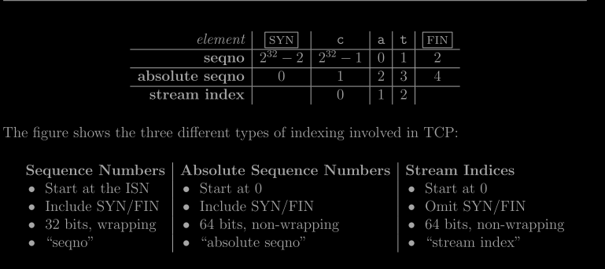
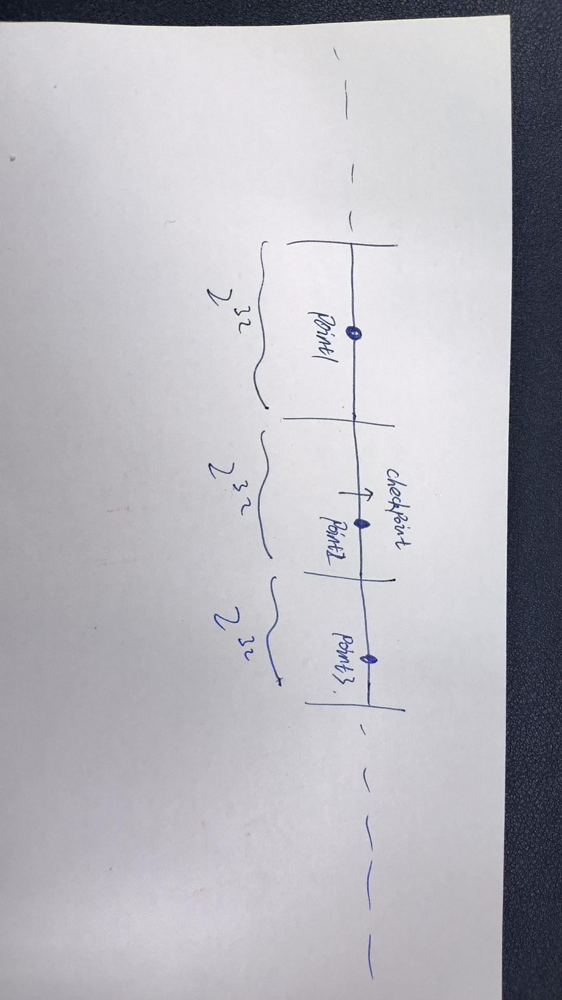

# 任务

## 翻译

### 0. Overview
建议：在实现之前，先通读整个实验文档。

在 Checkpoint 0 中，你实现了一个流控制字节流的抽象（ByteStream）。在 Checkpoint 1 中，你创建了一个 Re.

这些模块在你的 TCP 实现中将非常有用，但其中没有任何部分是特定于传输控制协议（TCP）的细节。这一点在 Checkpoint 2 中将发生变化。在这个检查点中，你将**实现 TCPReceive**r，这是 TCP 实现中处理传入字节流的部分。

TCPReceiver 从对等端的发送方接收消息（通过 receive() 方法），并将它们转化为对 Reassembler 的调用，Reassembler 最终会写入传入的 ByteStream。应用程序会从这个 ByteStream 中读取数据，就像你在 Lab 0 中通过读取 TCPSocket 所做的一样。

同时，TCPReceiver 还会生成返回给对等发送方的消息，通过 send() 方法发送。这些“接收者消息”负责告知发送方以下内容：

1. “第一个未组装的”字节的索引，称为“确认号”或“ackno”。这是接收方需要从发送方接收的第一个字节。
2. 输出 ByteStream 的可用容量，这称为“窗口大小”。

ackno 和窗口大小共同描述了接收方的窗口：TCP 发送方被允许发送的索引范围。**通过使用窗口，接收方可以控制传入数据的流量，使发送方在接收方准备好之前限制发送量**。我们有时将 ackno 称为窗口的“左边缘”（TCPReceiver 感兴趣的最小索引），而将 ackno 加上窗口大小称为“右边缘”（超出 TCPReceiver 感兴趣的最大索引）。

当你编写 Reassembler 和 ByteStream 时，你已经完成了实现 TCPReceiver 所涉及的大部分算法工作；本实验的目的是将这些通用类与 TCP 的细节连接起来。最难的部分是考虑 TCP 如何表示流中每个字节的位置——即所谓的“序列号”。

### 2. Checkpoint 2: The TCP Receiver

TCP 是一种协议，它**通过不可靠的数据报在两个方向上可靠地传输一对流控制字节流**。两个参与 TCP 连接的方，即“对等方”，每一方同时充当“发送方”（发送自己的输出字节流）和“接收方”（接收传入的字节流）。

本周，你将实现 TCP 的“接收方”部分，负责接收来自发送方的消息，重新组装字节流（包括字节流的结束部分），并确定应该发送回发送方的消息，以进行确认和流控制。

>为什么我要这样做？这些信号对于 TCP 提供流控制和可靠字节流服务至关重要，即使在不可靠的数据报网络上也是如此。在 TCP 中，确认意味着“接收方下一步需要哪个字节的索引，以便它可以进一步重新组装 ByteStream？” 这告诉发送方需要发送或重新发送哪些字节。流控制则意味着“接收方感兴趣并愿意接收的索引范围是多少？”（取决于接收方的可用容量）。这告诉发送方它被允许发送多少数据。

#### 2.1 Translating between 64-bit indexes and 32-bit seqnos

作为热身，我们需要实现** TCP 表示索引的方式**。上周，你创建了一个 Reassembler，用于重新组装子字符串，其中每个字节都有一个 64 位的流索引，并且流中的第一个字节始终具有索引零。64 位索引足够大，因此我们可以将其视为永不过载的。然而，在 TCP 头部中，空间是宝贵的，每个字节在流中的索引不是用 64 位索引表示的，而是**用 32 位的“序列号”或“seqno”表示**。这增加了三个复杂性：

1. 你的实现需要考虑 32 位整数回绕的问题。在 TCP 中，流的长度可以是任意的——ByteStream 可以通过 TCP 发送的数据长度没有限制。然而，2^32 字节仅为 4 GiB，这并不算大。一旦 32 位序列号计数到 2^32 − 1，流中的下一个字节将具有序列号 0。

2. TCP 序列号从一个随机值开始：为了提高鲁棒性并避免被属于同一端点之间的早期连接的旧段混淆，TCP 尽量确保序列号不可预测并且不太可能重复。因此，流的序列号不会从零开始。**流中的第一个序列号是一个随机的 32 位数字，称为初始序列号（ISN）**。这是表示“零点”或 SYN（流的开始）的序列号。之后，其余的序列号将正常递增：第一个数据字节的序列号将是 ISN+1（模 2^32），第二个字节的序列号将是 ISN+2（模 2^32），依此类推。

3. **逻辑开始和结束各占用一个序列号**：除了确保接收到所有数据字节外，TCP 还确保流的开始和结束被可靠接收。因此，在 TCP 中，SYN（流的开始）和 FIN（流的结束）控制标志被分配了序列号。**每个标志各占用一个序列号**。（SYN 标志占用的序列号即为 ISN。）流中的每个数据字节也占用一个序列号。请记住，**SYN 和 FIN 并不是流本身的一部分**，也不是“字节”——它们表示的是字节流本身的开始和结束。
   
这些序列号（seqno）会在每个 TCP 段的头部中传输。（再提醒一次，TCP 有两个方向的流，每个流都有单独的序列号和不同的随机 ISN。）有时讨论“绝对序列号”的概念也很有帮助（该序列号始终从零开始且不会回绕），以及“流索引”（你已经在 Reassembler 中使用的：流中每个字节的索引，从零开始）。

为了使这些区分具体化，考虑包含仅三个字母的字符串“cat”的字节流。如果 SYN 恰好具有 seqno 2^32 − 2，那么每个字节的 seqno、绝对 seqno 和流索引将是：



在绝对序列号和流索引之间转换相对简单——只需加减一即可。不幸的是，在序列号和绝对序列号之间进行转换要困难一些，混淆这两者可能会导致复杂的错误。为了系统地防止这些错误，我们将使用自定义类型 Wrap32 来表示序列号，并编写它与绝对序列号（用 uint64_t 表示）之间的转换。Wrap32 是一种包装类型的示例：它包含一个内部类型（在本例中为 uint32_t），但提供了一组不同的函数/操作符。

我们已经为你定义了该类型，并提供了一些辅助函数（参见 wrapping_integers.hh），但你需要在 wrapping_integers.cc 中实现这些转换：

1. static Wrap32 Wrap32::wrap(uint64_t n, Wrap32 zero_point)
将绝对序列号转换为序列号。给定一个绝对序列号 (n) 和一个初始序列号 (zero_point)，生成 n 对应的（相对）序列号。

2. uint64_t unwrap(Wrap32 zero_point, uint64_t checkpoint) const
将序列号转换为绝对序列号。给定一个序列号（Wrap32 类型）、初始序列号 (zero_point) 和一个绝对检查点序列号，找到与该检查点最近的相应绝对序列号。

注意：由于任何给定的序列号 (seqno) 对应多个绝对序列号，因此需要一个**检查点**。例如，在 ISN 为零的情况下，序列号 "17" 对应的绝对序列号可能是 17，但也可能是 2^32 + 17，或者 2*2^32 + 17，等等。检查点帮助解决这种歧义：**它是用户已知的“接近正确答案”的绝对序列号**。在你的 TCP 实现中，你会使用第一个未组装的索引作为检查点。

提示：最简洁/最简单的实现将使用 wrapping_integers.hh 中提供的辅助函数。wrap/unwrap 操作应保持偏移量一致——两个相差 17 的序列号应对应两个相差 17 的绝对序列号。

提示 #2：wrap 函数预计只需要一行代码，unwrap 函数则不超过 10 行代码。如果你发现自己写了更多代码，可能需要退一步，考虑一种不同的策略。

You can test your implementation by running the tests: cmake --build build --target check2 .

#### 2.2 Implementing the TCP receiver

接下来的实验中，你将实现 TCPReceiver。它将（1）接收来自对等方发送方的消息，并使用 Reassembler 重新组装 ByteStream，（2）并向对等方发送方发送包含确认号（ackno）和窗口大小的消息。我们预计这将总共需要大约 15 行代码。

首先，让我们回顾一下 TCP “发送消息”的格式，这些消息包含有关 ByteStream 的信息。这些消息是从 TCPSender 发送到其对等方的 TCPReceiver 的

```cpp
/*
 * The TCPSenderMessage structure contains the information sent from a TCP sender to its receiver.
 * TCPSenderMessage 结构体包含从 TCP 发送方发送到接收方的信息。
 * It contains five fields:
 *
 * 1) The sequence number (seqno) of the beginning of the segment. If the SYN flag is set, this is the
 *    sequence number of the SYN flag. Otherwise, it's the sequence number of the beginning of the payload.
 *   段开始的序列号（seqno）。如果设置了 SYN 标志，则这是 SYN 标志的序列号。否则，它是有效负载开始的序列号。
 * 2) The SYN flag. If set, this segment is the beginning of the byte stream, and the seqno field
 *    contains the Initial Sequence Number (ISN) -- the zero point.
 *   SYN 标志。如果设置了该标志，则该段表示字节流的开始，并且 seqno 字段包含初始序列号（ISN）——零点。
 * 3) The payload: a substring (possibly empty) of the byte stream.
 *  有效负载：字节流的一个子串（可能为空）
 * 4) The FIN flag. If set, the payload represents the ending of the byte stream.
 *  FIN 标志。如果设置了该标志，则有效负载表示字节流的结束。
 * 5) The RST (reset) flag. If set, the stream has suffered an error and the connection should be aborted.
 * RST（重置）标志。如果设置了该标志，则表示流发生了错误，连接应该被中断。
 */  

struct TCPSenderMessage
{
  Wrap32 seqno { 0 };

  bool SYN {};
  std::string payload {};
  bool FIN {};

  bool RST {};

  // How many sequence numbers does this segment use?
  size_t sequence_length() const { return SYN + payload.size() + FIN; }
};
```
The TCPReceiver generates its own messages back to the peer’s TCPSender:
```cpp
/*
 * The TCPReceiverMessage structure contains the information sent from a TCP receiver to its sender.
 *
 * It contains three fields:
 *
 * 1) The acknowledgment number (ackno): the *next* sequence number needed by the TCP Receiver.
 *    This is an optional field that is empty if the TCPReceiver hasn't yet received the Initial Sequence Number.
 *确认号（ackno）：TCP 接收方需要的*下一个*序列号。这个字段是可选的，如果 TCPReceiver 尚未收到初始序列号，则为空。
 * 2) The window size. This is the number of sequence numbers that the TCP receiver is interested
 *    to receive, starting from the ackno if present. The maximum value is 65,535 (UINT16_MAX from
 *    the <cstdint> header).
 *窗口大小。这是 TCP 接收方感兴趣的序列号的数量，从 ackno 开始（如果存在）。最大值为 65,535（来自 <cstdint> 头文件的 UINT16_MAX）。
 * 3) The RST (reset) flag. If set, the stream has suffered an error and the connection should be aborted.
 * RST（重置）标志。如果设置了该标志，则表示流发生了错误，连接应该被中断。
 */

struct TCPReceiverMessage
{
  std::optional<Wrap32> ackno {};
  uint16_t window_size {};
  bool RST {};
};
```
您的tcreceiver的工作是接收其中一种消息并发送另一种消息

##### 2.2.1 receive()
此方法将在每次从对等方发送方接收到新段时被调用。这个方法需要：

 + 如果必要，设置初始序列号。第一个到达的、具有设置了 SYN 标志的段的序列号就是初始序列号。你需要跟踪这个序列号，以便在 32 位包装的 seqnos/acknos 和它们的绝对等价物之间进行转换。（请注意，SYN 标志只是头部中的一个标志。相同的消息还可能携带数据或设置了 FIN 标志。）

 + 将任何数据推送到 Reassembler。如果 TCPSegment 的头部设置了 FIN 标志，则表示有效负载的最后一个字节是整个流的最后一个字节。请记住，**Reassembler 期望流索引从零开始**；你需要解包 seqnos 以生成这些索引。


# 解
## 1. 第一个任务
第一个任务比较简单，实现：`wrapping_integers.cc`

wrap:把绝对序列转化为相对序列
只需先把 n 放到 0~2^32 范围内，然后加上偏移量，然后还要再取模一次
最后：
```cpp
Wrap32 Wrap32::wrap( uint64_t n, Wrap32 zero_point )
{
  return Wrap32 { static_cast<uint32_t>((n + zero_point.raw_value_) % (1ULL << 32))};
}
```

unwrap:把相对序列转化为绝对序列
转化后的结果，需要距离 chekpoint 最近；
可以想一下，把 0~2^64-1 分成一段段 0~2^32-1 的小区间，这时 point 转化的可能点就只有三种可能，如下：



然后就是找出这三个点距离 checkpoint 最近的那个点就行了；
```cpp
uint64_t Wrap32::unwrap( Wrap32 zero_point, uint64_t checkpoint ) const
{
    uint64_t base = checkpoint & 0xFFFFFFFF00000000ULL;  // 获取 checkpoint 的高 32 位
    uint64_t value = raw_value_ - zero_point.raw_value_;
    uint64_t wrapped_value = base | value;
    // 如果 wrapped_value 比 checkpoint 小，并且它加上 2^32 比 checkpoint 更接近
    if (wrapped_value < checkpoint && checkpoint - wrapped_value > (1ULL << 31)) {
        return wrapped_value + (1ULL << 32);
    }
    // 如果 wrapped_value 比 checkpoint 大，并且它减去 2^32 比 checkpoint 更接近
    if(wrapped_value > checkpoint && wrapped_value > UINT32_MAX &&  wrapped_value - checkpoint > (1ULL << 31)){
        return wrapped_value - (1ULL << 32);
    }
    return wrapped_value;
}
```

## 2. 第二个任务

1. receive:
通过 TCPSenderMessage message ，解析数据传递给 streamReassembler;
message 有syn,fin,rst,payload,seqno
分别处理这些信号，然后把字符串传递给  streamReassembler

1) rst: 
   1. 如果有rst：那么需要断开连接，直接调用set_error；
   2. 如果没有rst：检测之前 message 有没有error，如果有直接返回

2) syn: 
   1. 如果传入的message有syn
      如果之前的message没有设置syn，那么当前的syn就是初始序列，初始化
      如果之前的message已经设置syn，那么当前的这个就不是初始序列，直接返回
   2. 如果传入的messae没有syn
      如果之前的message没有设置syn，那么返回
      如果之前的message已经设置syn，当前的message为有效数据，传递

3) fin:
    fin是用来控制当前message是不是最后一个，那么直接作为 is_last_substring

4) payload: 字符串
     获取当前字符串的 first_index，然后传递；checkpoint是下一个未传送的seqno，其实就是 byres_push
     注意：byte with invalid stream index should be ignored，有个测试 先传递 2345 syn,然后 2345 a,这个a不合法，所以如果字符串的 absolute seqno=0，则为不合法的，直接返回
5) ackon_: 下一个的seqno
      下一个的ackon，就是当前已经push数据的下一个seqno；
      seqno=zero_point + 是否有syn + 已经传递的字符串长度 + 是否到fin
      注意这个 “是否到fin” 并不是当前的fin，而是bytresstream 是否传递完，也就是 is_close

```cpp
void TCPReceiver::receive( TCPSenderMessage message )
{
  // Your code here.
  //(void)message;
  // 将任何数据推送到 Reassembler
  uint64_t first_index; //当前接收的字符串索引，后面传入 reassembler
  bool is_last_substring = false;

  // 处理 RST
  if(message.RST){
    reassembler_.reader().set_error();
    return;
  }else if(reassembler_.reader().has_error()){
    return;
  }
  // 处理 SYN
  if(message.SYN){
    if(!Synflag_){
        Synflag_ = true;
        zero_point = message.seqno;
        message.seqno = message.seqno + 1; //如果 只有一个syn， 那么将传递 ""
    }else { //如果之前已经有 syn了，则还是用原来的哪个,应该不会出现这种情况，因为下一个是基于send发送的
        return;
    }
  }

  if(!Synflag_){ //如果一直没有 syn 返回
    return;
  }
// 此时，已经有syn了,并且全部指向字符串
  first_index = message.seqno.unwrap(zero_point, reassembler_.writer().bytes_pushed());  //转化为ab seqno
  if(first_index == 0){ //byte with invalid stream index should be ignored，有个测试 先传递 2345 syn,然后 2345 a,这个a不合法
    return;
  }else{
    first_index--; //转化为 stream index
  }

  is_last_substring = message.FIN;
  reassembler_.insert(first_index, move(message.payload), is_last_substring);

  ackon_ = zero_point + Synflag_+ reassembler_.writer().bytes_pushed() + reassembler_.writer().is_closed();
}
```


1. send: 填充 TCPReceiverMessage
这里有三个 ackno,window_size,rst

rst: 直接返回reassembler_.reader().has_error();即可
ackon_: 检测是否设置syn,如果有则返回
window_size: 返回要检测范围的大小
  填坑 lab1中：
  你可能会问，那我的数据报发多了会怎么样呢？超过了capacity的值了。这个答案我们在后续实验中就会明白，TCP为了保证稳定传输，同时还维护了这个能够传输的最大值，也叫窗口大小。？？目前还不知道

```cpp
TCPReceiverMessage TCPReceiver::send() const
{
  // Your code here.
  TCPReceiverMessage ReceiverMessage;
  
  ReceiverMessage.RST = reassembler_.reader().has_error();
  if(Synflag_){
    ReceiverMessage.ackno = ackon_;
  }

  
  if ( reassembler_.writer().available_capacity() > UINT16_MAX ) {
    ReceiverMessage.window_size = UINT16_MAX;
  } else {
    ReceiverMessage.window_size = reassembler_.writer().available_capacity();
  }

  return ReceiverMessage;
}
```


## 优化
一个优化就是使用 std::optional<Wrap32> zero_point { }; 代替之前的Wrap32 zero_point { 0 };bool Synflag_ { false }; 

少用一个标志位；
```cpp
void TCPReceiver::receive( TCPSenderMessage message )
{
  // Your code here.
  //(void)message;
  // 将任何数据推送到 Reassembler
  uint64_t first_index; //当前接收的字符串索引，后面传入 reassembler
  bool is_last_substring = false;

  // 处理 RST
  if(message.RST){
    reassembler_.reader().set_error();
    return;
  }else if(reassembler_.reader().has_error()){
    return;
  }
  // 处理 SYN
  if(message.SYN){
    if(!zero_point.has_value()){
        zero_point = message.seqno;
        message.seqno = message.seqno + 1; //如果 只有一个syn， 那么将传递 ""
    }else { //如果之前已经有 syn了，则还是用原来的哪个,应该不会出现这种情况，因为下一个是基于send发送的
        return;
    }
  }

  if(!zero_point.has_value()){ //如果一直没有 syn 返回
    return;
  }
// 此时，已经有syn了,并且全部指向字符串
  first_index = message.seqno.unwrap(zero_point.value(), reassembler_.writer().bytes_pushed());  //转化为ab seqno
  if(first_index == 0){ //byte with invalid stream index should be ignored，有个测试 先传递 2345 syn,然后 2345 a,这个a不合法
    return;
  }else{
    first_index--; //转化为 stream index
  }

  is_last_substring = message.FIN;
  reassembler_.insert(first_index, move(message.payload), is_last_substring);

  ackon_ = zero_point.value() + zero_point.has_value()+ reassembler_.writer().bytes_pushed() + reassembler_.writer().is_closed();

}

TCPReceiverMessage TCPReceiver::send() const
{
  // Your code here.
  TCPReceiverMessage ReceiverMessage;
  
  ReceiverMessage.RST = reassembler_.reader().has_error();
  if(zero_point.has_value()){
    ReceiverMessage.ackno = ackon_;
  }

  
  if ( reassembler_.writer().available_capacity() > UINT16_MAX ) {
    ReceiverMessage.window_size = UINT16_MAX;
  } else {
    ReceiverMessage.window_size = reassembler_.writer().available_capacity();
  }

  return ReceiverMessage;
}
```
      
