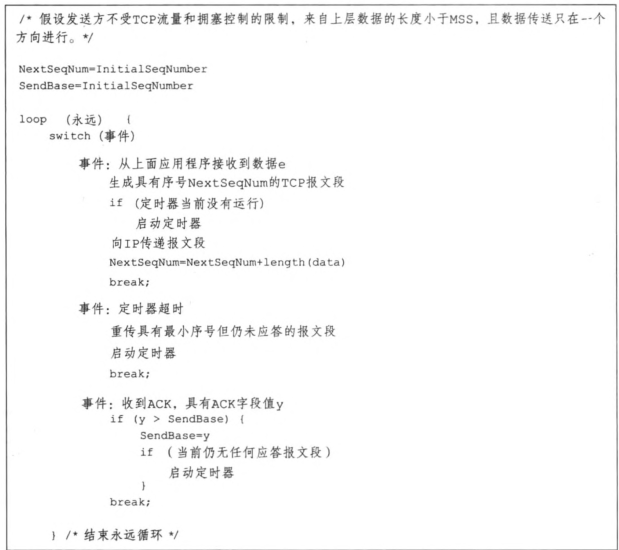

# 翻译

在第0个检查点中，你实现了流控字节流(ByteStream)的抽象。在第1和第2个检查点中，你实现了将包含在不可靠数据报中的段转换为传入字节流的工具：Reassembler和TCPReceiver。

现在，在第3个检查点中，你将实现连接的另一端。TCPSender 是一种工具，它将一个**出站字节流转换为将成为不可靠数据报负载的段**。最后，在第4个检查点中，你将结合之前实验的工作，创建一个完整的TCP实现：包含TCPSender和TCPReceiver的TCPPeer。你将使用它与同学以及互联网上的对等设备进行通信——与实际的TCP服务器对话。

## 2. Checkpoint 3: The TCP Sender

TCP 是一种协议，通过不可靠的数据报可靠地传输一对流控字节流（每个方向各一个）。两个参与方在 TCP 连接中互为对等方，每个对等方同时充当“发送方”（发送自己的出站字节流）和“接收方”（接收传入的字节流）。

本周，你将实现 TCP 的“发送方”部分，负责从一个 ByteStream（由某些发送方应用创建和写入）中读取数据，并将这些数据流转换为一系列出站 TCP 段。在远端，TCP 接收方将这些段（到达的段，可能并不是所有的都能到达）转换回原始字节流，并向发送方发送确认和窗口广告。

你的 TCPSender 需要完成以下任务：

 + **追踪接收方的窗口**（接收带有 acknos 和窗口大小的 TCPReceiverMessages）
 + 在可能的情况下填充窗口，通过从 ByteStream 中读取数据，创建新的 TCP 段（如果需要，包括 SYN 和 FIN 标志），并将其发送出去。发送方应持续发送段，直到窗口满了或出站 ByteStream 没有更多数据可发送。
 + **追踪已经发送但尚未被接收方确认的段**——我们称这些为“未确认”段
 + 如果经过足够的时间后这些段仍未被确认，则**重新发送这些未确认的段**

>为什么要这么做？基本原则是发送接收方允许我们发送的任何数据（填充窗口），并不断重传直到接收方确认每个段。这被称为“自动重传请求”（ARQ）。发送方将字节流划分为段并发送，尽可能多地发送，直到接收方的窗口允许为止。由于你上周的工作，我们知道远程 TCP 接收方只要至少收到每个索引标记的字节一次（无论顺序如何），就可以重构字节流。发送方的任务是确保接收方至少收到每个字节一次。

重要的是要记住，接收方可以是任何有效的 TCP 接收方实现——不一定是你自己的 TCPReceiver。互联网标准的一个重要价值在于，它们为可能行为非常不同的端点之间建立了共同的语言。

### 2.1 How does the TCPSender know if a segment was lost?

你的 TCPSender 将发送一系列 TCPSenderMessages。每个消息将包含一个（可能为空的）出站 ByteStream 的子串，**用序列号标记以指示它在流中的位置**，并在流的开始处标记有 SYN 标志，在流的结束处标记有 FIN 标志。

除了发送这些段之外，TCPSender 还需要**跟踪其未确认的段**，直到它们占用的序列号全部得到确认。定期，TCPSender 的所有者将调用 TCPSender 的 tick 方法，以指示时间的流逝。TCPSender 负责检查其未确认的 TCPSenderMessages 集合，并决定最早发送的段是否已经因为未得到确认（即其所有序列号未被确认）而存在太长时间。如果是这样，则需要重新传输（再次发送）。

以下是“存在太长时间”的规则。你将实现这些逻辑，虽然这些规则有点详细，但我们不希望你担心隐藏的测试用例或将其视为 SAT 上的文字题。我们将为你提供一些合理的单元测试，并在你完成整个 TCP 实现后在 Lab 4 提供更全面的集成测试。只要你 100% 通过这些测试，并且你的实现合理，你就会没问题。

>为什么要这样做？总体目标是**让发送方能够及时检测到段丢失并需要重新发送**。等待重新发送的时间量很重要：你不希望发送方等待太久才重新发送段（因为那会延迟字节流向接收应用程序），但你也不希望它重新发送一个如果稍等一会儿就会被确认的段——那会浪费互联网的宝贵带宽。

1. 每隔几毫秒，TCPSender 的 tick 方法将被调用一次，并传递一个参数，告诉它自上次调用该方法以来经过了多少毫秒。利用这一点来维护 TCPSender 已经存活的总毫秒数。请不要尝试调用操作系统或 CPU 的任何“时间”或“时钟”函数——tick 方法是你唯一能获取时间流逝的途径。这使得测试保持确定性和可测试性。

2. 当 TCPSender 被构造时，会给它一个参数，告诉它“重传超时（RTO）的初始值”。RTO 是在重新发送一个未确认的 TCP 段之前要**等待的毫秒数**。RTO 的值会随着时间变化，但“初始值”保持不变。启动代码将 RTO 的“初始值”保存在一个名为 initial_RTO_ms 的成员变量中。

3. 你将实现重传计时器：一个可以在特定时间启动的警报，**计时器在 RTO 经过后触发**（或“过期”）。我们强调，这种时间流逝的概念来自于 tick 方法的调用，而不是通过获取实际的时间。

4. 每当发送一个包含数据（在序列空间中长度非零）的段时（无论是第一次发送还是重传），如果计时器没有运行，则启动它，使其在 **RTO 毫秒后过期**（以当前的 RTO 值为准）。所谓“过期”是指时间将在未来的某个时间点耗尽。

5. 当所有未确认的数据都被确认时，停止重传计时器。

6. 如果 tick 被调用并且重传计时器已经过期： 
   (a) **重新传输最早**（序列号最小）的段，该段尚未被 TCP 接收方完全确认。你需要在某些内部数据结构中存储未确认的段，以便能够执行此操作。 
   (b) 如果窗口大小非零： 
        i. 追踪连续重传的次数，并增加计数，因为你刚刚重新传输了某些内容。你的 TCP 连接将使用这些信息来决定连接是否绝望（连续重传次数过多）并需要中止。 
        ii. 将 RTO 的值翻倍。这称为“指数回退”——在糟糕的网络上减慢重传速度，以避免进一步堵塞。 
   (c) 重置重传计时器并启动，使其在 RTO 毫秒后过期（考虑到你可能刚刚将 RTO 的值翻倍！）。

7. 当接收方给发送方一个 ackno，确认成功接收了新数据（ackno 反映了比任何先前的 ackno 更大的绝对序列号）时：      
   (a) 将 RTO 设置回“初始值”。 
   (b) 如果发送方有任何未确认的数据，重新启动重传计时器，使其在 RTO 毫秒后过期（以当前的 RTO 值为准）。 
   (c) 将“连续重传次数”计数重置为零。

你可以选择在一个单独的类中实现重传计时器的功能，但这取决于你。如果你这样做，请将其添加到现有文件（tcp_sender.hh 和 tcp_sender.cc）中。

### 2.2 Implementing the TCP sender

好的！我们已经讨论了TCP发送方的基本概念（即：**接收一个输出的字节流，将其拆分为段，发送给接收方，并且如果这些段没有被及时确认，则继续重发**）。我们还讨论了**如何判断一个待确认的段是否丢失并需要重发**。

现在是时候具体实现你的 TCPSender 提供的接口了。以下是它需要处理的四个重要事件：

1. `void push(const TransmitFunction& transmit);`
TCPSender 被要求从输出的字节流中填充窗口：它从流中读取数据，并发送尽可能多的 TCPSenderMessages，只要有新的字节可读和窗口中有可用空间。它通过调用提供的 transmit() 函数来发送这些消息。你需要确保每个 TCPSenderMessage 完全符合接收方的窗口大小。使每个单独的消息尽可能大，但不要超过 TCPConfig::MAX_PAYLOAD_SIZE（1452 字节）的值。你可以使用 TCPSenderMessage::sequence_length() 方法来计算段所占的序列号总数。记住，SYN 和 FIN 标志也各占用一个序列号，这意味着它们在窗口中也占用空间。

>**窗口大小为零时该怎么做**？ 如果接收方宣布的窗口大小为零，push 方法应假装窗口大小为一。发送方可能会发送一个单字节的数据，该字节可能会被接收方拒绝（未被确认），但这也可能促使接收方发送一个新的确认段，表明窗口中有更多的可用空间。否则，发送方将无法知道它被允许重新开始发送。这是你实现中唯一需要处理的零大小窗口的特殊情况。TCPSender 不应实际记住一个虚假的窗口大小为1。这种特殊情况仅在 push 方法中处理。另外，即使窗口大小为一（或20，或200），窗口可能仍然是满的。一个“满”的窗口与一个“零大小”的窗口是不同的。

2. `void receive(const TCPReceiverMessage& msg);`

收到来自接收方的消息，传递新的左边缘（即 ackno）和右边缘（即 ackno + window size）。TCPSender 应该检查其待确认的段集合，并移除那些现在已被完全确认的段（即 ackno 大于段中的所有序列号）。

3. `void tick(uint64_t ms_since_last_tick, const TransmitFunction& transmit);`

时间已经过去——自上次调用此方法以来的毫秒数。发送方可能需要重发一个待确认的段；它可以调用 transmit() 函数来执行重发。（提醒：请不要尝试在代码中使用实际的“时钟”或“gettimeofday”函数；时间的唯一参考来自 ms_since_last_tick 参数。）

4. `TCPSenderMessage make_empty_message() const`

TCPSender 应该生成并发送一个长度为零的消息，序列号设置正确。如果对等方需要发送一个 TCPReceiverMessage（例如，因为它需要确认来自对等方发送方的某些内容），并且需要生成一个 TCPSenderMessage 来配合它，这将很有用。注意：像这样的段，虽然它不占用任何序列号，但不需要作为“待确认”段来跟踪，并且不会被重发。

为了完成 Checkpoint 3，请查看 src/tcp_sender.hh 中的完整接口，实现 tcp_sender.hh 和 tcp_sender.cc 文件中的 TCPSender 公共接口。我们期望你会添加私有方法和成员变量，并可能需要一个辅助类。

### 2.3 FAQs and special cases

以下是关于 TCPSender 实现的一些注意事项和解答：

1. 在 receive 方法通知之前，TCPSender 应该假设接收方的窗口大小是多少？

1。

2. 如果确认只部分确认了某些待确认的段，我该怎么办？是否应该尝试剪掉已确认的字节？

TCP 发送方可以这样做，但在本课程中，没有必要这么复杂。将每个段视为完全待确认，直到它被完全确认——即其占用的所有序列号都小于 ackno。

3. 如果我发送了三个包含“a”，“b”和“c”的独立段，它们都没有被确认，我可以稍后将它们重新发送为一个包含“abc”的大段吗？还是必须逐个重发每个段？

同样：TCP 发送方可以这样做，但在本课程中，没有必要这么复杂。只需单独跟踪每个待确认的段，当重传定时器过期时，再次发送最早的待确认段即可。

4. 我应该在“待确认”数据结构中存储空段，并在必要时重新传输它们吗？

不应该。只有传输了一些数据（即占用了一些序列号空间）的段才应该被跟踪为待确认，并可能进行重传。占用零序列号的段（没有 SYN、负载或 FIN）不需要记住或重传。


# 解
## 1. 关于计时器：参考书上的图和下面的文档

> 5.管理RTO计时器
> 
> 对于一个重传计时器，必须满足不能过早地重传这个要求，也就是不能在小于一个RTO时间内进行重传。
> 以下是管理重传计时器的推荐算法：
> 
>  5.1 每次发送包含数据的数据包时（这里的发送包括重传），如果计时器没有启动，则启动计时器。这样计时器才有可能在一个RTO时间后过期（指的是当>前的RTO）
>  
>  5.2 如果收到了所有“已发送但未被确认”数据的ACK报文后，关闭重传计时器
>  
>  5.3 每次收到对新数据的ACK报文时，重启重传计时器，使其可以在一个RTO后过期（指的是当前的RTO）
>  
>  当重传计时器过期后，执行如下操作
>  5.4 重传最早的”已发送但未被确认”的TCP段
>  
>  5.5 主机（注，这里指TCP发送端）必须将新的RTO设置为当前RTO值的两倍。（RTO的上界在本RFC 2.5节中讨论了）
>  
>  5.6 启动重传计时器，使其可以在一个RTO后过期（指的是当前的RTO）
>  
>  5.7 如果在等待SYN-ACK这个TCP报文时候，重传计时器过期了，并且这个计时器的RTO小于3秒，则当数据传输开始的时候（即，三次握手完成后），RTO必须重新初始化为3秒
  


所以定时器，应该包含：
  超时；
  重启；
  停止；为了重启
```cpp
class RetransTimer{
private:
    uint64_t RTO_ {0};
    uint64_t time_ {0}; //运行时间
    bool is_running_ {false};  //是否运行
public:
    RetransTimer() {}
    RetransTimer(uint64_t rto) : RTO_(rto){}
    bool is_expired() const {return time_ >= RTO_ && is_running_;}
    bool is_running() const {return is_running_;}
    //计时
    void tick_to_retrans_timer(uint64_t ms_since_last_tick){
        if(!is_running_){
            return;
        }
        time_ += ms_since_last_tick;
    }
    // 重启
    void start_new(){
        time_ = 0;
        is_running_ = true;
    }
    //停止
    void stop_retrans(){
        is_running_ = false;
    }
    void backoff(){
        this->RTO_ *= 2;
    }
    void load_rto(uint64_t rto){
        this->RTO_ = rto;
    }
};
```

## 2. sender.h 

.png)

.jpg)

注意：实验使用的是回退N步(GBN)；

根据这个图我们可以定义一些变量：
```cpp
RetransTimer timer_ {}; // 定时器
std::queue<TCPSenderMessage> buffer_ {}; //窗口，维护 发送还未确认，可用还未发送的 seqno
uint64_t window_size_ {1}; //窗口大小
uint64_t send_base_ {0};  // 最早未被确定的的 seqno，发送还未确认
uint64_t nextseqno_ {0}; //下一个序号，可用还未发送
uint64_t outstanding_num_ {0}; //当前有多少序列号未确认 这个完全可以用 nextseqno_ - send_base_ 代替
uint64_t retransmissions_num_ {0}; // 重传次数
bool syn_flag_ {false};
bool fin_flag_ {false};
```


## 3. sender.cc
功能全部参考一位up的思路                   
原文链接：https://blog.csdn.net/Kovnt/article/details/136042125

1. push

  1. 在第一次调用该方法时，发送一个 1 字节长度的连接请求报文（因为此时 TCPSender 假定接收方窗口大小为 1），并将这个字节计入“未完成的字节数量”中（也就是没有收到确认的字  节数量）；
  2. 不断的组装报文，并始终保持以下任意一个条件为真：
    + 每个报文的负载 payload 长度不大于 TCPConfig::MAX_PAYLOAD_SIZE 的值；
    + 没有收到确认的字节数量不能超过接收方告知的窗口大小。
  3. 将已发送、且没有收到确认的以下字节计入“未完成的字节数”中：
    + 第一个 SYN 字节、最后一个 FIN 字节、以及所有 payload 中的字节数。
  4. 每次从 ByteStream 中读取字节后都要检查读端是否已经结束，并把存在流中的 EOF 字符丢弃（还记得 Lab1 的要求吗？），再视情况决定是否发送 FIN 字节；
  5. 当 FIN 已发出、或者 ByteStream 中没有数据、亦或者发出的数据已经填满了滑动窗口，拒绝发出任何报文；
  6. 如果有发出一个非零长报文，且超时计时器没有启动，那么就启动计时器（实际上 push() 方法不会发出非零长报文，这里只需要认为“只要有报文发出就启动计时器”）。
```cpp
void TCPSender::push( const TransmitFunction& transmit )
{
  // Your code here.
  //(void)transmit;

  // 当 FIN 已发出、或者 ByteStream 中没有数据、亦或者发出的数据已经填满了滑动窗口，拒绝发出任何报文；
  while(((window_size_ > 0 ? window_size_ : 1) > (nextseqno_ - send_base_)) && !fin_flag_){

    TCPSenderMessage message = make_empty_message();
    if(!syn_flag_){ // 第一次调用
        message.SYN = true;
        syn_flag_ =true;
    }
    
    uint64_t sz = (window_size_ > 0 ? window_size_ : 1) - (nextseqno_ - send_base_);// 可用空间
    uint64_t len = min(TCPConfig::MAX_PAYLOAD_SIZE, sz); // 读取字符串最大不超过 MAX_PAYLOAD_SIZE
    read(input_.reader(), len, message.payload);
    
    //如果input stream 可被读取完
    if(!fin_flag_ && sz > message.sequence_length() && input_.reader().is_finished()){
        message.FIN = true;
        fin_flag_ = true;
    } 

    if(message.sequence_length() == 0){
        break;
    }
    //传输
    transmit(message);
    //启动定时器
    if(!timer_.is_running()){
        timer_.load_rto(initial_RTO_ms_);
        timer_.start_new();
    }
    // 更新数据
    nextseqno_ += message.sequence_length();
    outstanding_num_ += message.sequence_length();

    buffer_.emplace(move(message));
  }

}
```
2. receive()
  1. 拒绝 ackno 的值是不存在的、或者是超过了当前已发出的最后一个字节序号的值的报文；
  2. 根据报文信息更新当前记录的窗口大小；
  3. 报文中的 ackno 不大于缓冲区队首的首字节序号 seqno + payload.size() 的值时，跳过更新缓冲区；
  4. 在不满足上条条件时，将缓冲区队首的报文弹出，并在缓冲区非空的前提下检查下一个队首元素；
  5. 检查 SYN 连接请求是否被确认，并根据检查结果设置以后发出的报文中 SYN 的值（也就是说允许后续发出的报文中 SYN 为 false 的情况）；
  6. 如果缓冲区被清空，停止计时器，否则只重置计时器；
  7. 只要缓冲区有报文被弹出，就将重传计数器置零。

```cpp
void TCPSender::receive( const TCPReceiverMessage& msg )
{
  // Your code here.
  //(void)msg;

  //注意采用累计重传
  if(input_.has_error()){
    return;
  }
  if(msg.RST){
    input_.set_error();
    return;
  }

  // 拒绝 ackno 的值是不存在的、或者是超过了当前已发出的最后一个字节序号的值的报文；
  window_size_ = msg.window_size;
  
  if(!msg.ackno.has_value()){
    return;
  }
  uint64_t rcv_base = msg.ackno.value().unwrap(isn_, nextseqno_);
  if(rcv_base > nextseqno_){
    return;
  }

  bool is_ack = false;
  while(!buffer_.empty()){
    auto message = buffer_.front();    
    // 报文中的 ackno 不大于缓冲区队首的首字节序号 seqno + payload.size() 的值时
    if(send_base_ + message.sequence_length() > rcv_base){
        break;
    }
    is_ack = true;
    send_base_ += message.sequence_length();
    outstanding_num_ -= message.sequence_length();
    buffer_.pop();
  }

  if(is_ack){
    retransmissions_num_ = 0;
    timer_.load_rto(initial_RTO_ms_);
    buffer_.empty() ? timer_.stop_retrans() : timer_.start_new();
  }

}
```

3. tick()
  1. 将 ms_since_last_tick 的值加到计时器上；
  2. 在更新计时器后，检查计时器是否已经过期；
    + 如果过期，重传缓冲区队首元素，递增重传计数器，并将计时器的 RTO 增加为原来的两倍；
    + 否则退出函数。
```cpp
void TCPSender::tick( uint64_t ms_since_last_tick, const TransmitFunction& transmit )
{
  // Your code here.
//   (void)ms_since_last_tick;
//   (void)transmit;
//   (void)initial_RTO_ms_;

  timer_.tick_to_retrans_timer(ms_since_last_tick);
  if(timer_.is_expired()){

    if(buffer_.empty()){
        return;
    }
    transmit(buffer_.front());
    if(window_size_ != 0){
        retransmissions_num_++;
        timer_.backoff();
    }
    timer_.start_new();
  }
}
```


## 调试发现的错误：
只记录了其中一部分
1. 在 receive 中访问错误
这个错误是因为：
```cpp
  uint64_t rcv_base = msg.ackno.value().unwrap(isn_, nextseqno_);
  if(!msg.ackno.has_value() || rcv_base > nextseqno_){
    return;
  }
```
当 ackno 没有值的时候，则 `rcv_base = msg.ackno.value().unwrap(isn_, nextseqno_);`出错
更改：
```cpp
  if(!msg.ackno.has_value()){
    return;
  }
  uint64_t rcv_base = msg.ackno.value().unwrap(isn_, nextseqno_);
  if(rcv_base > nextseqno_){
    return;
  }
```

2. 在 receive 中 window_size 的更新时刻，如果接收端和发送端没有断开连接，那么当接收到 TCPReceiverMessage 立马更新 window_size
即
`window_size_ = msg.window_size;` 放到前面的位置

3. 在 push 中，窗口判断
我用减号判断 > 0;是不对的，当为负值时，变为最大值
```cpp
 //while((sz = (window_size_ > 0 ? window_size_ : 1) - (nextseqno_ - send_base_)) > 0 && !fin_flag_){
while(((window_size_ > 0 ? window_size_ : 1) > (nextseqno_ - send_base_)) && !fin_flag_){}
```
4. tick 问题
当 buffer 为空的时候，不重发；
其实文档已经说的很清楚了，只是我没有仔细看；
根据：
  6. 如果 tick 被调用并且重传计时器已经过期： 
   (a) 重新传输最早（序列号最小）的段，该段尚未被 TCP 接收方完全确认。你需要在某些内部数据结构中存储未确认的段，以便能够执行此操作。 
   (b) 如果窗口大小非零： 
        i. 追踪连续重传的次数，并增加计数，因为你刚刚重新传输了某些内容。你的 TCP 连接将使用这些信息来决定连接是否绝望（连续重传次数过多）并需要中止。 
        ii. 将 RTO 的值翻倍。这称为“指数回退”——在糟糕的网络上减慢重传速度，以避免进一步堵塞。 
   (c) 重置重传计时器并启动，使其在 RTO 毫秒后过期（考虑到你可能刚刚将 RTO 的值翻倍！）。
增加 window_size ！= 0；当窗口为 0 时，只需重新计时；
所以还要更改 window_size 的初始化不能为0，改为1；

5. 更改 make_empty_message()
当 input_ 有 RST 时，应带有 RST
```cpp
TCPSenderMessage TCPSender::make_empty_message() const
{
  // Your code here.
  TCPSenderMessage sendmessage;
  sendmessage.seqno = Wrap32::wrap(nextseqno_, isn_);
  sendmessage.RST = input_.has_error();
  return sendmessage;
}
```

## 最后的总代码如下
**tcp_sender.h**
```cpp
#pragma once

#include "byte_stream.hh"
#include "tcp_receiver_message.hh"
#include "tcp_sender_message.hh"

#include <cstdint>
#include <functional>
#include <list>
#include <memory>
#include <optional>
#include <queue>

class RetransTimer{
private:
    uint64_t RTO_ {0};
    uint64_t time_ {0}; //运行时间
    bool is_running_ {false};  //是否运行
public:
    RetransTimer() {}
    RetransTimer(uint64_t rto) : RTO_(rto){}
    bool is_expired() const {return time_ >= RTO_ && is_running_;}
    bool is_running() const {return is_running_;}
    //计时
    void tick_to_retrans_timer(uint64_t ms_since_last_tick){
        if(!is_running_){
            return;
        }
        time_ += ms_since_last_tick;
    }
    // 重启
    void start_new(){
        time_ = 0;
        is_running_ = true;
    }
    //停止
    void stop_retrans(){
        is_running_ = false;
    }
    void backoff(){
        this->RTO_ *= 2;
    }
    void load_rto(uint64_t rto){
        this->RTO_ = rto;
    }
};

class TCPSender
{
public:
  /* Construct TCP sender with given default Retransmission Timeout and possible ISN */
  TCPSender( ByteStream&& input, Wrap32 isn, uint64_t initial_RTO_ms )
    : input_( std::move( input ) ), isn_( isn ), initial_RTO_ms_( initial_RTO_ms )
    , timer_(initial_RTO_ms)

  {}

  /* Generate an empty TCPSenderMessage */
  TCPSenderMessage make_empty_message() const;

  /* Receiv   e and process a TCPReceiverMessage from the peer's receiver */
  void receive( const TCPReceiverMessage& msg );

  /* Type of the `transmit` function that the push and tick methods can use to send messages */
  using TransmitFunction = std::function<void( const TCPSenderMessage& )>;

  /* Push bytes from the outbound stream */
  void push( const TransmitFunction& transmit );

  /* Time has passed by the given # of milliseconds since the last time the tick() method was called */
  void tick( uint64_t ms_since_last_tick, const TransmitFunction& transmit );

  // Accessors
  uint64_t sequence_numbers_in_flight() const;  // 当前有多少序列号未确认？
  uint64_t consecutive_retransmissions() const; //  发生了多少次连续的重传？
  Writer& writer() { return input_.writer(); }
  const Writer& writer() const { return input_.writer(); }

  // Access input stream reader, but const-only (can't read from outside)
  const Reader& reader() const { return input_.reader(); }

private:
  // Variables initialized in constructor
  ByteStream input_;   
  Wrap32 isn_;
  uint64_t initial_RTO_ms_; //重传超时（RTO）的初始值

RetransTimer timer_ {}; // 定时器
std::queue<TCPSenderMessage> buffer_ {}; //窗口，维护 发送还未确认，可用还未发送的 seqno
uint64_t window_size_ {1}; //窗口大小
uint64_t send_base_ {0};  // 最早未被确定的的 seqno，发送还未确认
uint64_t nextseqno_ {0}; //下一个序号，可用还未发送
uint64_t outstanding_num_ {0}; //当前有多少序列号未确认
uint64_t retransmissions_num_ {0}; // 重传次数
bool syn_flag_ {false};
bool fin_flag_ {false};

};

```

**tcp_sender.cc**
```cpp
#include "tcp_sender.hh"
#include "tcp_config.hh"
#include <utility>
using namespace std;

uint64_t TCPSender::sequence_numbers_in_flight() const
{
  // Your code here.
  return outstanding_num_ ;
}

uint64_t TCPSender::consecutive_retransmissions() const
{
  // Your code here.
  return retransmissions_num_ ;
}

void TCPSender::push( const TransmitFunction& transmit )
{
  // Your code here.
  //(void)transmit;

  // 当 FIN 已发出、或者 ByteStream 中没有数据、亦或者发出的数据已经填满了滑动窗口，拒绝发出任何报文；
  while(((window_size_ > 0 ? window_size_ : 1) > (nextseqno_ - send_base_)) && !fin_flag_){

    TCPSenderMessage message = make_empty_message();
    if(!syn_flag_){ // 第一次调用
        message.SYN = true;
        syn_flag_ =true;
    }
    
    uint64_t sz = (window_size_ > 0 ? window_size_ : 1) - (nextseqno_ - send_base_);// 可用空间
    uint64_t len = min(TCPConfig::MAX_PAYLOAD_SIZE, sz); // 读取字符串最大不超过 MAX_PAYLOAD_SIZE
    read(input_.reader(), len, message.payload);
    
    //如果input stream 可被读取完
    if(!fin_flag_ && sz > message.sequence_length() && input_.reader().is_finished()){
        message.FIN = true;
        fin_flag_ = true;
    } 

    if(message.sequence_length() == 0){
        break;
    }

    transmit(message);
    
    if(!timer_.is_running()){
        timer_.load_rto(initial_RTO_ms_);
        timer_.start_new();
    }

    nextseqno_ += message.sequence_length();
    outstanding_num_ += message.sequence_length();

    buffer_.emplace(move(message));
  }

}

TCPSenderMessage TCPSender::make_empty_message() const
{
  // Your code here.
  TCPSenderMessage sendmessage;
  sendmessage.seqno = Wrap32::wrap(nextseqno_, isn_);
  sendmessage.RST = input_.has_error();
  return sendmessage;
}

void TCPSender::receive( const TCPReceiverMessage& msg )
{
  // Your code here.
  //(void)msg;

  //注意采用累计重传
  if(input_.has_error()){
    return;
  }
  if(msg.RST){
    input_.set_error();
    return;
  }

  // 拒绝 ackno 的值是不存在的、或者是超过了当前已发出的最后一个字节序号的值的报文；
  window_size_ = msg.window_size;
  
  if(!msg.ackno.has_value()){
    return;
  }
  uint64_t rcv_base = msg.ackno.value().unwrap(isn_, nextseqno_);
  if(rcv_base > nextseqno_){
    return;
  }

  bool is_ack = false;
  while(!buffer_.empty()){
    auto message = buffer_.front();    
    // 报文中的 ackno 不大于缓冲区队首的首字节序号 seqno + payload.size() 的值时
    if(send_base_ + message.sequence_length() > rcv_base){
        break;
    }
    is_ack = true;
    send_base_ += message.sequence_length();
    outstanding_num_ -= message.sequence_length();
    buffer_.pop();
  }

  if(is_ack){
    retransmissions_num_ = 0;
    timer_.load_rto(initial_RTO_ms_);
    buffer_.empty() ? timer_.stop_retrans() : timer_.start_new();
  }

}

void TCPSender::tick( uint64_t ms_since_last_tick, const TransmitFunction& transmit )
{
  // Your code here.
//   (void)ms_since_last_tick;
//   (void)transmit;
//   (void)initial_RTO_ms_;

  timer_.tick_to_retrans_timer(ms_since_last_tick);
  if(timer_.is_expired()){

    if(buffer_.empty()){
        return;
    }
    transmit(buffer_.front());
    if(window_size_ != 0){
        retransmissions_num_++;
        timer_.backoff();
    }
    timer_.start_new();
  }
}

```


