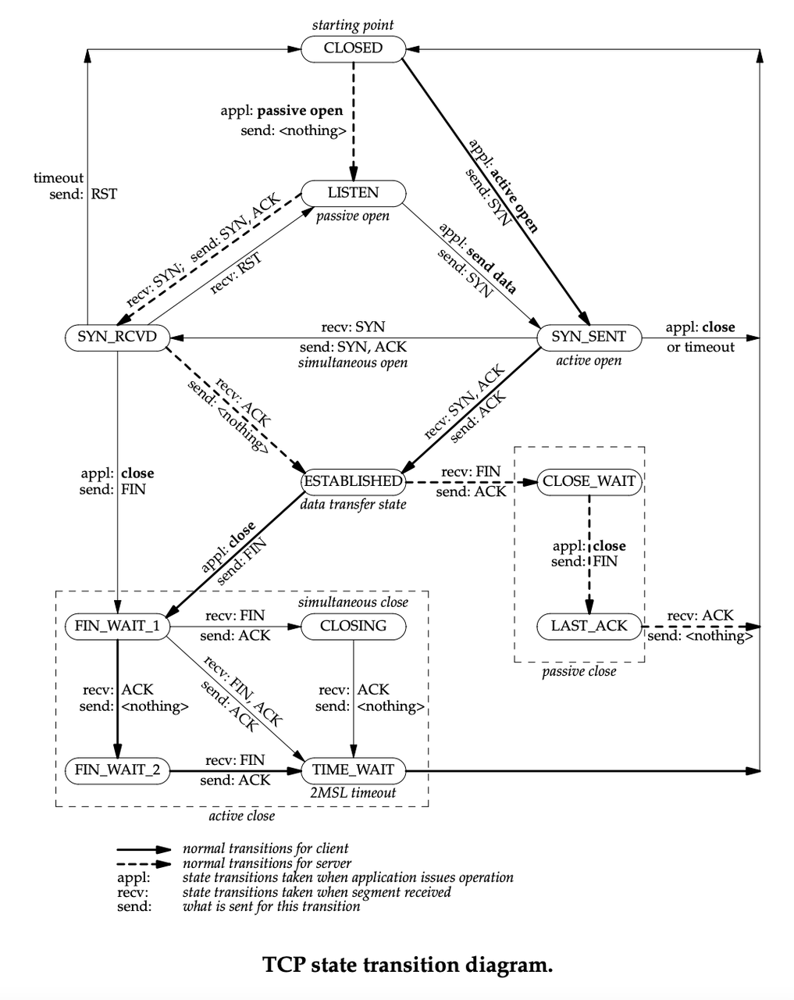
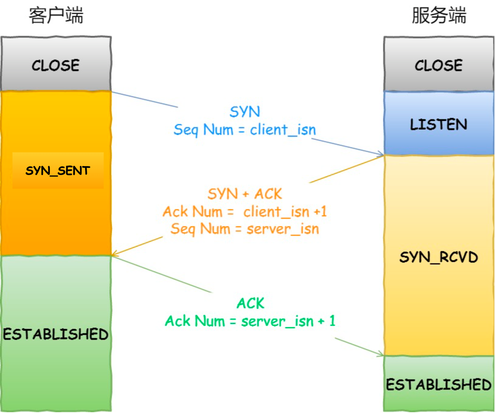
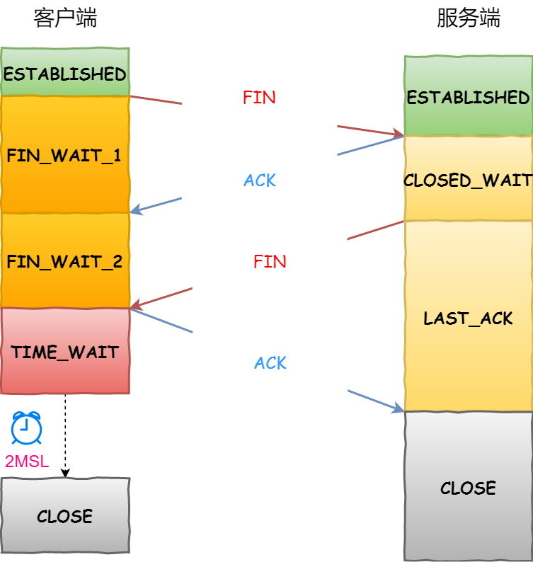
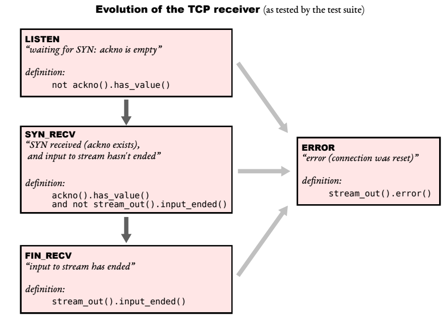
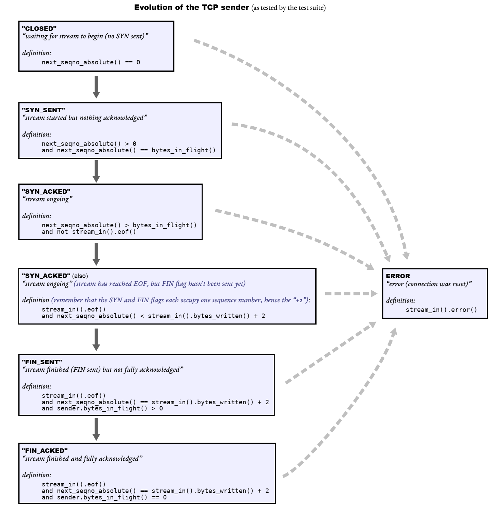
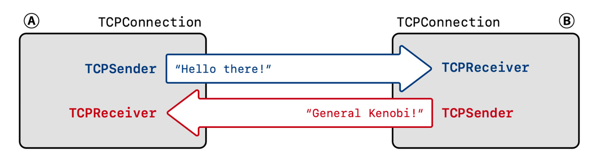

# 翻译
1. Overview

到目前为止，你已经实现了几乎完全符合标准的传输控制协议 (TCP)。可以说，TCP 实现是世界上最流行的计算机程序之一，存在于数十亿台设备中。虽然大多数实现的策略与你的不同，但由于所有的 TCP 实现共享相同的协议语言，它们都是互通的——每个 TCP 实现都可以与其他任何一个实现进行通信。这个检查点是关于在现实世界中测试你的 TCP 实现，并测量特定网络路径的长期统计数据。

如果你的 TCP 实现编写正确，你可能不需要为这个检查点编写任何代码。但是，尽管我们进行了大量努力，还是有可能会有一些错误逃过了我们的单元测试。如果你发现了问题，你可能需要使用 Wireshark 进行调试并修复任何错误。我们非常欢迎（并会奖励）你为 TCP 模块贡献测试用例，以捕捉现有单元测试未能发现的错误。

3. Using your TCP implementation in the real world

还记得在检查点 0 时你编写的 webget.cc 吗？你使用了一个 TCPSocket，这是一个模拟 Linux 内核 TCP 实现的 C++ 类。现在你能否用自己的 TCP 实现替换它，并且仍然能让 Web 获取器正常工作呢？

 1. 运行 `cmake --build build --target check_webget` 以确认你的 `webget` 仍然可以正常工作。（如果不行，请先调试修复这个问题再继续。）
 2. 确保你的 TCP 实现从不将调试信息发送到 cout。这会干扰到任何使用 TCP 的程序的实际输出。可以使用 cerr 进行调试，但不要使用 cout。
 3. 在合并检查点 4 的起始代码后，回到你的 `apps/webget.cc` 文件。在文件顶部添加一个额外的 `include：#include "tcp_minnow_socket.hh"`，并将 `TCPSocket` 替换为 `CS144TCPSocket`。这是一个 C++ 类，它包装了你的 TCP 实现，使其表现得像内核提供的套接字。
 4. 运行一个脚本，给你的 TCP 实现发送原始网络数据包的权限：`./scripts/tun.sh start 144`。（注意：每次重启虚拟机时都需要重新运行此命令。）
 5. 现在，重新运行 `cmake --build build --target check_webget`。如果测试通过，恭喜你！你已经创建了一个成功与互联网上任意计算机互操作的 TCP 实现
 6. 如果测试没有通过……尝试手动运行 webget 程序：./build/apps/webget cs144.keithw.org /nph-hasher/xyzzy 如果一切顺利，输出将如下所示：
   
   > $ ./build/apps/webget cs144.keithw.org /nph-hasher/xyzzy DEBUG: minnow    > connecting to 104.196.238.229:80... DEBUG: minnow successfully    connected > to 104.196.238.229:80. HTTP/1.1 200 OK Content-type: text/   plain
   > 7SmXqWkrLKzVBCEalbSPqBcvs11Pw263K7x4Wv3JckI DEBUG: minnow waiting for    > clean shutdown... DEBUG: minnow inbound stream from 104.196.238.229:80    > finished cleanly. DEBUG: minnow outbound stream to 104.196.238.229:80    > finished (0 seqnos still in flight). DEBUG: minnow outbound stream to    > 104.196.238.229:80 has been fully acknowledged. DEBUG: minnow TCP >    connection finished cleanly. done.
  如果测试没有通过，就需要使用 Wireshark（或命令行版本的 tshark）在 tun144 接口上进行调试。我们可以提供帮助。
 7. 对于调试，你还可能会发现 `./build/apps/tcp_ipv4` 程序很有用。这个程序类似于 `telnet`，但使用的是你的 TCP 实现。在一个终端中，运行 `./build/apps/tcp_native -l 0 9090`（这是服务器，使用 Linux 的 TCP 实现）。在另一个终端中，运行 .`/build/apps/tcp_ipv4 169.254.144.1 9090`（这是客户端，使用你的 TCP 实现）。如果一切顺利，这两个对等端将能够相互通信，直到两个对等端都结束其传出流（通过按 Control-D）。

4. Collecting data

 1. 选择一个与互联网中某个远程主机的往返时间（RTT，与你的虚拟机的 RTT）至少为 100  毫秒的主机。可以考虑以下几个选项：
 
   + www.cs.ox.ac.uk（牛津大学计算机系网页服务器，英国）
   + 162.105.253.58（北京大学计算中心，中国）
   + www.canterbury.ac.nz（坎特伯雷大学网页服务器，新西兰）
   + 41.186.255.86（MTN 盧旺達）
   + 更好的是：选择一个与你的 RTT 至少为 100 毫秒的原始主机
 
 2. 使用 mtr 或 traceroute 命令追踪你虚拟机与该主机之间的路由。
 
 3. 运行至少两个小时的 ping 来收集这个互联网路径的数据。使用类似以下命令来将数据保 存到“data.txt”文件中：ping -D -n -i 0.2 hostname | tee data.txt。（-D 参数 使 ping 记录每行的时间戳，-i 0.2 使其每 0.2 秒发送一个“回显请求” ICMP 消息。 -n 参数使其跳过尝试使用 DNS 进行反向查找响应的 IP 地址到主机名。）
 
 4. 注意：每 0.2 秒发送一次默认大小的 ping 是可以的，但请不要以比这更快的速度淹没任 何人。

5. Analyzing data

 如果你每秒发送五个 ping 请求持续两个小时，你将发送大约 36,000 个回显请求（= 5  × 3600 × 2），其中我们期望大多数请求会在 ping 输出中收到回复。使用你选择的编程 语言和绘图工具，请准备一个报告（PDF 格式），其中至少包含以下信息：
 
 1. 整个时间段的总体投递率是多少？换句话说：收到的回显回复数量除以发送的回显请求数量 是多少？（注意：GNU/Linux 上的 ping 不会打印未收到的回显回复的消息。你需要通过 查看丢失的序列号来识别缺失的回复。）
 
 2. 连续成功 ping 的最长串是多少（所有回复连续出现）？
 
 3. 最长的丢包突发期是多少（所有连续未回复）？
 
 4. “数据包丢失”事件的独立性或相关性如何？换句话说：
   + 在回显请求 #N 收到回复的情况下，回显请求 #(N+1) 也成功收到回复的概率是多少？
   + 在回显请求 #N 未收到回复的情况下，回显请求 #(N+1) 成功收到回复的概率是多少？
   + 这些数据（条件投递率）与第一个问题中的总体“无条件”数据包投递率相比如何？丢包情况 有多独立或突发？
 5. 整个时间段内观察到的最小 RTT 是多少？（这可能是实际 MinRTT 的合理近似值...）
 6. 整个时间段内观察到的最大 RTT 是多少？
 7. 绘制 RTT 随时间变化的图表。x 轴标记实际的时间（覆盖 2 小时以上的时间段），y 轴 应为 RTT 的毫秒数。
 8. 绘制 RTT 分布的直方图或累积分布函数。分布的大致形状是什么？
 9. 绘制“ping #N 的 RTT”与“ping #N+1 的 RTT”之间的相关图表。x 轴应为第一个 RTT  的毫秒数，y 轴应为第二个 RTT 的毫秒数。RTT 随时间的相关性如何？
 
 10. 从数据中得出的结论是什么？网络路径的表现是否符合你的预期？查看图表和总结统计数据 时，有什么（如果有的话）让你感到惊讶的？


# 解
## 1. 运行`./scripts/tun.sh start 144`报错；
因为：
  因为微软商店中 WSL 没有开启所有的 Linux 内核功能（如本次实验需要使用的 CONNMARK）

> 根本原因是脚本 tun.sh 需要使用 /dev/net/tun 创建多个虚拟的隧道网络设备，但是因> 为 WSL 没有开启这部分的功能，所以导致了报错出现。
> 当然也可能是我问题没有找对，不过我实际使用时更换一个新环境就能够直接通过测试。
> 总之有什么新见解或者解决方案欢迎留言告诉我。

然后重装了一个  Ubuntu Server 23.10；我用 vmware ，然后发现一会就卡死了，搞了一下午才搞好，早知道一开始就使用虚拟机了。
 
## 2. 运行`./build/apps/webget cs144.keithw.org /nph-hasher/xyzzy`出错误

```bash
7SmXqWkrLKzVBCEalbSPqBcvs11Pw263K7x4Wv3JckI
DEBUG: minnow inbound stream from 104.196.238.229:80 finished cleanly.
Function called: get_URL(cs144.keithw.org, /nph-hasher/xyzzy)

Warning: unclean shutdown of TCPMinnowSocket
Exception in TCPConnection runner thread: shutdown: Bad file descriptor
terminate called after throwing an instance of 'std::exception'
  what():  std::exception
Aborted (core dumped)
```
1. Warning: unclean shutdown of TCPMinnowSocket
  这条警告说明 TCPMinnowSocket 在关闭连接时没有正确地完成关闭过程，可能有一些资源未被释放或者连接未正确终止
2. Exception in TCPConnection runner thread: shutdown: Bad file descriptor
  这是导致程序中止的主要错误。Bad file descriptor 错误通常意味着在对一个无效或已经关闭的文件描述符执行了不正确的操作（例如，尝试关闭已经关闭的socket）。这个错误发生在 TCPConnection 的执行线程中，表明可能是由于在不适当的时机调用了 shutdown 或者是资源管理出了问题。

```cpp
void get_URL( const string& host, const string& path )
{
    CS144TCPSocket client_sock;
    string buf;
    client_sock.connect(Address(host,"http"));
    client_sock.write("GET "+ path + " HTTP/1.1\r\n");
    client_sock.write("Host: "+ host + "\r\n");
    client_sock.write("Connection: close\r\n\r\n");

    client_sock.shutdown(SHUT_WR);
    while(!client_sock.eof())
    {
        client_sock.read(buf);
        cout << buf;
    }
    client_sock.close();
    cerr << "Function called: get_URL(" << host << ", " << path << ")\n";
}
```
这是我原来写的，根据这个报告，感觉应该是：
 `client_sock.shutdown(SHUT_WR);` 或者 `client_sock.close();`

可以知道：CS144TCPSocket -> TCPOverIPv4MinnowSocket -> LocalStreamSocket -> Socket -> FileDescriptor

shutdown : 在 Socket中，调用系统调用关闭写端
close : 在FileDescriptor，关闭文件描述符
感觉思路上应该没什么问题，但是问题出现在：发生在 TCPConnection 的执行线程中，表明可能是由于在不适当的时机调用了 shutdown 

用调试工具，发现可以正常使用；不同的是这里使用 `tcp_socket.wait_until_closed();`
这个函数里面已经有 `shutdown( SHUT_RDWR );`,所以修改;
发现修改后，可以正常使用了

```cpp
void get_URL( const string& host, const string& path )
{
    CS144TCPSocket client_sock;
    string buf;
    client_sock.connect(Address(host,"http"));
    client_sock.write("GET "+ path + " HTTP/1.1\r\n");
    client_sock.write("Host: "+ host + "\r\n");
    client_sock.write("Connection: close\r\n\r\n");

    //client_sock.shutdown(SHUT_WR);
    while(!client_sock.eof())
    {
        client_sock.read(buf);
        cout << buf;
    }
    client_sock.wait_until_closed();

    //cerr << "Function called: get_URL(" << host << ", " << path << ")\n";
}
```
为什么？
  可以看一下这个代码
  ```cpp
    template<TCPDatagramAdapter AdaptT>
    void TCPMinnowSocket<AdaptT>::wait_until_closed()
    {
    shutdown( SHUT_RDWR );
    if ( _tcp_thread.joinable() ) {
        std::cerr << "DEBUG: minnow waiting for clean shutdown... ";
        _tcp_thread.join();
        std::cerr << "done.\n";
    }
    }
  ```
  _tcp_thread 是管理 TCP 连接的线程对象。joinable() 检查该线程是否仍然可以被 join。如果线程已经启动且尚未被 join 或分离（detach），那么这个检查将返回 true，表示可以等待该线程结束。
  即通过 join() 等待线程完成执行，以确保 TCP 连接能够干净地关闭，避免资源泄漏或不干净的终止。
  
## 3. traceroute 使用
traceroute 用来追踪你的虚拟机与目标主机之间的路由路径，显示中间经过的每一跳。
`traceroute 41.186.255.86`
41.186.255.86: 目标主机的 IP 地址
运行后，你会看到从你的虚拟机到目标主机之间经过的每一个路由器的 IP 地址和延迟时间。

```bash
traceroute to 41.186.255.86 (41.186.255.86), 30 hops max, 60 byte packets
 1  192.168.28.2 (192.168.28.2)  0.157 ms  0.172 ms  0.124 ms
 2  * * *
 3  * * *
```
每一行代表一跳。
第一列是跳数。
接下来的 IP 地址是该跳所经过的路由器的 IP。
后面的数字表示到该跳的延迟（以毫秒为单位）。
* * * 表示该跳没有收到回应，可能是由于防火墙阻挡或者其他网络问题。

这三个时间分别表示三次 ICMP 回显请求（或 UDP/TCP 探测包）发送到该路由器并返回的往返时间（Round-Trip Time, RTT）。traceroute 默认会发送三次探测包到每一个跳点;

mtr:
`mtr -r -c 100 162.105.253.58`
-r: 生成报告模式，显示一次性结果而非实时更新。
-c 100: 设置发送 100 个探测包来统计延迟和丢包率（你可以根据需要调整）。
162.105.253.58: 目标主机的 IP 地址

## 4. 
后面统计没做，有时间再补！


## connection
2021年的connection











TCPConnection会将TCPSender和TCPReceiver整合起来，进而解决传输层的双向连接问题。
IP层会把TCP的segment给包起来，生成IP datagram，如此一来你就可以使用TCP/IP协议和世界上任何一台计算机进行通信了。

CAUTION：TCPConnection的作用是把你之前lab里实现过的sender和receiver整合起来，TCPConnection模块本身实现起来可能100行代码都不到。如果你之前实现的sender和receiver代码足够健壮，这个lab对你来说是小菜一碟。但如果不是，你可能会花大量的时间去看报错信息和debug。（我们不鼓励你去看测试代码去面向测试用例编程，除非你没别的法子了。）根据以往的经验，建议早点做实验，不要等到DDL的时候再去尝试。

回顾：TCP为字节流提供了双向的、具有流量控制功能的可靠传输。在两方建立了TCP连接的这段时间里，它们都即是发送者（从网络字节流里发送数据）又是接收者（从网络字节流里接收数据）。



我们也将通信的双方称作“终端”，或者“节点”。你的TCPConnection就是建立连接的一个节点。TCPConnection的作用是发送和接收segment，确保发送方和接收方能够从收到的segment中获取到它们所关心的字段。

### 接收segment

如图1所示，当`segment_received`函数被调用的时候，就意味着TCPConnection从互联网中接收到了TCPSegment。于是TCPConnection需要考察segment的信息并进行如下处理：

1. 如果`RST`（reset）标志位为真，将发送端stream和接受端stream设置成error state并终止连接   
2. 把segment传递给TCPReceiver，这样的话，TCPReceiver就能从segment取出它所关心的字段进行处理了：seqno，SYN，payload，FIN。    
3. 如果ACK标志位为真，通知TCPSender有segment被确认，TCPSender关心的字段有ackno和window_size。   
4. 如果收到的segment不为空，TCPConnection必须确保至少给这个segment回复一个ACK，以便远端的发送方更新ackno和window_size。  
5. 在TCPConnection里的`segment_received()`中，有一个特殊情况需要做额外的处理：给“keep-alive” segment回复消息。对面的终端可能会发送一个不合法的seqno，来探测你的TCP连接是否仍然alive（如果alive，那么你当前的window状态是什么样子的）。即使这些segment不包含任何有效的seqno，你的TCPConnection依然要给这些“keep-avlie”的segment回复消息。代码大概长这个样子：

```cpp
if (_receiver.ackno().has_value() and (seg.length_in_sequence_space() == 0)
     and seg.header().seqno == _receiver.ackno().value() - 1) {
     _sender.send_empty_segment();
     // 在发送segment之前，
     // TCPConnection会读取TCPReceiver中关于ackno和window_size相关的信息。
     // 如果当前TCPReceiver里有一个合法的ackno，
     // TCPConnection会更改TCPSegment里的ACK标志位，
     // 将其设置为真。
}
```

**发送Segment**
TCPConnection发送segment的规则如下：
1. 当TCPSender把segment放入它的待发送队列中的时候，TCPSender需要将该sengment发送出去。
2. 在发送segment之前，TCPConnection会读取TCPReceiver中关于ackno和window_size相关的信息。如果当前TCPReceiver里有一个合法的ackno，TCPConnection会更改TCPSegment里的ACK标志位，将其设置为真。
随着时间的流逝，操作系统会定期调用TCPConnection的tick方法。当tick方法被调用，TCPConnection需要做如下几件事情：
1. 告诉TCPSender时间正在流逝。
2. 如果同一个segment连续重传的次数超过`TCPConfig::MAX_RETX_ATTEMPTS`，终止连接，并且给对方发送一个reset segment（一个RST为真的空segment）。
3. 尽可能地干净利落地结束该连接（参考Section5）。
综上，TCPSegmnet的数据结构如下图所示，有些字段是sender写入的，有些字段是receiver写入的，我们用不同的颜色标记了出来。
有关TCPConnection的详细信息请参考[TCPConnection的接口文档](https://cs144.github.io/doc/lab4/class_t_c_p_connection.html)。建议仔细阅读。TCPConnection的大多数工作都是在调用TCPSender和TCPReceiver的API，而这些API你在之前的lab中已经实现过了。
不过也有一些隐晦的地方，需要你去仔细思考，你必须以收发双方的整体角度来看待TCP连接。最难的部分是应该在何时终止TCPConnection的连接并发送终止连接的RST segment。
接下来是FAQ和一些你需要处理的边界case。


## 5 TCP连接的尽头：如何达成断开连接共识？

TCPConnection一个很重要的功能就是判断什么时候连接已经结束。当连接结束，TCPConnection会将连接中的本地端口号释放，然后把这个连接看作是history，停止给收到的segment回复ACK，且`active()`始终返回false。
有两种方式会让连接终止。一种是不优雅的关闭，TCPConnection发送或者收到了RST segment。这种情况下，要把出向和入向的ByteStream设置成error state，令`active()`始终返回false。

那么何为优雅地关闭呢？这意味着active()返回false，但是state并不是"error" state。这种情况更复杂，但是事情将变得更加漂亮，因为双端字节流都准确可靠地传达了它们已经完全地接收到了对方信息的消息。在Section5.1中，我们将详细描述当这种优雅结束连接的情形发生时，会带来什么样的结果。你现在就可以直接跳到Section5.1去看。

不过，在讲5.1之前，我们还要谈论**两军问题（Two Generals' Problem）**。尽管不可能使收发双方都能达到优雅地退出的状态，但是TCP已经尽力地试图在接近这种理想状态了。让我们看看到底咋回事。
从一方的角度来看，要想优雅地关闭与远端的连接（之后我们称自己的角度是本地，另一方是远端），需要满足如下4个前提条件：
1. 入向stream已经被完全地接收、排列整齐，并被上层调用者读取完毕。   
2. 出向stream已经被上层应用关闭，即stream不会再被写入新的字节，且stream里的字节流已经全被发送了出去（包括声明stream结束的FIN的segment也已经被发送）。    
3. 出向stream发出的segment都收到了来自远端的ACK。   
4. 本地的TCPConnection要充分确认远端的状态是满足前提条件3的。有点类似脑筋急转弯。我们来考察两种方案：  

**方案A. 当双向stream结束后，先呆一会儿。** 当前提条件1～3满足，远端似乎看上去也收到了本地的ACK。问题在于本地TCP不知道远端到底有没有收到ACK（TCP不给ACK回复ACK）。不过如果本地等待一段时间之后，它应该能够确认远端收到了它的ACK了，毕竟远端已经有段时间没有重传任何数据了。

特别地，我们可以规定，当前提条件1～3满足的时候，从本地从远端收到最后一个segment开始，TCPConnection要等待10* the_initial_retransmission_timeout的时间。the initial retransmission timeout的值可以通过_cfg.rt_timeout获得。我们称这种双端stream结束后的等待为“lingering”，它的目的是确保远端不会尝试重传任何我们已经返回过ACK的segment。

也就是说我们的TCPConnection需要额外地为这个端口stay alive一段时间，当它收到发过来的segment的时候，仍然可以回复重复的ACK（即便TCPSender和TCPReceiver的stream已经关闭，并且都已经完成了它们该完成的所有工作）。


### TCP关闭连接的简易版实用指南
你的TCPConnection有一个成员变量_linger_after_streams_finish，以及一个成员方法state()，state()会把_linger_after_streams_finish的值给暴露出来以便我们测试。_linger_after_streams_finish一开始的时候应该是true。如果出向字节流还没有到EOF的时候，入向stream就关闭了字节流，当前_linger_after_streams_finish应该设置为false。

一旦前提条件1～3被满足，如果_linger_after_streams_finish为假，连接就会被立刻终止（active()从此之后返回false）。否则的话你需要linger，自最后一个segment收到之后，等待一段时间（10倍的_cfg.rt_timeout），然后结束连接。

> 总结一下吧，在connect.cc中，有几个重要的变量，_active，用于表示连接的状态，rst：出现异常，告诉对端异常关闭的头标志，time_now，此时时间，_linger_after_streams_finish，是否是后结束的一方。经过上面的文档阅读，我想你已经大概了解了TCP挥手的过程。_

现在请闭着眼睛再过一下这个过程，想一下为什么。
其实在我看来这和人类聊天结束没什么区别，假如我在和某个人聊天，我已经说完了，没有话了，我就会告诉对方，我已经说完了。但是这个时候又不能立马跑，因为对方还没说完，需要对对方说的话进行回复还。对方接收到一个fin标志后告诉我，我知道你说完了，但是我还有话说，会继续说，你需要确认，直到把话说完。然后告诉你，我也说完了，我要关闭了，我对这个回复进行确认后，对方收到这个ack就可以立马睡觉了，而我们这边由于不知道对方是否睡觉，只能不断确认他发过来的ack，直到当你在接收到一个seg后，对方10* the_initial_retransmission_timeout的时间没有回复，那我也就没必要等了，因为这么长时间没回复肯定是去睡觉了，上一个接收的seg就是最后一个seg，那我也可以睡觉去了。这个时候我就可以关闭连接了。


```CPP
TCPState::TCPState(const TCPState::State state) {
    switch (state) {
        case TCPState::State::LISTEN:
            _receiver = TCPReceiverStateSummary::LISTEN;
            _sender = TCPSenderStateSummary::CLOSED;
            break;
        case TCPState::State::SYN_RCVD:
            _receiver = TCPReceiverStateSummary::SYN_RECV;
            _sender = TCPSenderStateSummary::SYN_SENT;
            break;
        case TCPState::State::SYN_SENT:
            _receiver = TCPReceiverStateSummary::LISTEN;
            _sender = TCPSenderStateSummary::SYN_SENT;
            break;
        case TCPState::State::ESTABLISHED:
            _receiver = TCPReceiverStateSummary::SYN_RECV;
            _sender = TCPSenderStateSummary::SYN_ACKED;
            break;
        case TCPState::State::CLOSE_WAIT:
            _receiver = TCPReceiverStateSummary::FIN_RECV;
            _sender = TCPSenderStateSummary::SYN_ACKED;
            _linger_after_streams_finish = false;
            break;
        case TCPState::State::LAST_ACK:
            _receiver = TCPReceiverStateSummary::FIN_RECV;
            _sender = TCPSenderStateSummary::FIN_SENT;
            _linger_after_streams_finish = false;
            break;
        case TCPState::State::CLOSING:
            _receiver = TCPReceiverStateSummary::FIN_RECV;
            _sender = TCPSenderStateSummary::FIN_SENT;
            break;
        case TCPState::State::FIN_WAIT_1:
            _receiver = TCPReceiverStateSummary::SYN_RECV;
            _sender = TCPSenderStateSummary::FIN_SENT;
            break;
        case TCPState::State::FIN_WAIT_2:
            _receiver = TCPReceiverStateSummary::SYN_RECV;
            _sender = TCPSenderStateSummary::FIN_ACKED;
            break;
        case TCPState::State::TIME_WAIT:
            _receiver = TCPReceiverStateSummary::FIN_RECV;
            _sender = TCPSenderStateSummary::FIN_ACKED;
            break;
        case TCPState::State::RESET:
            _receiver = TCPReceiverStateSummary::ERROR;
            _sender = TCPSenderStateSummary::ERROR;
            _linger_after_streams_finish = false;
            _active = false;
            break;
        case TCPState::State::CLOSED:
            _receiver = TCPReceiverStateSummary::FIN_RECV;
            _sender = TCPSenderStateSummary::FIN_ACKED;
            _linger_after_streams_finish = false;
            _active = false;
            break;
    }
}
```


   