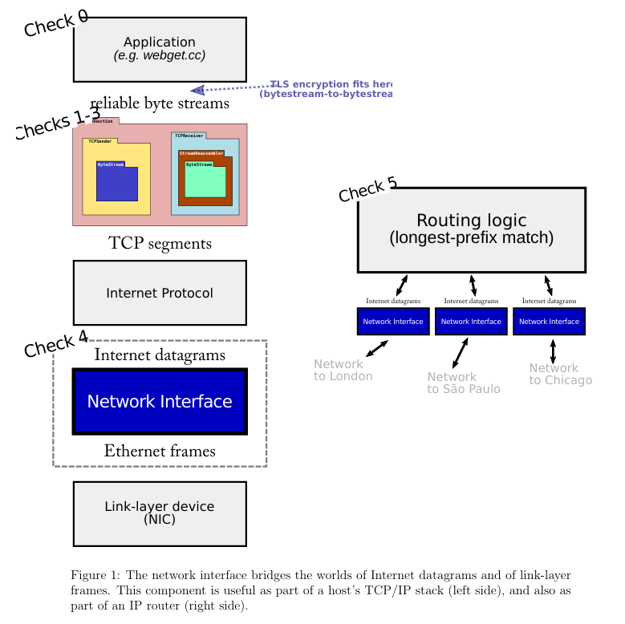

# 翻译

## 0. Overview


在本周的检查点中，你将实现一个网络接口：这是互联网数据报和链路层以太网帧之间的桥梁。这个组件可以“位于”你早期实验室中的 TCP/IP 实现之下，但它也会在不同的环境中使用：当你在第六实验室构建一个路由器时，它将路由数据报在网络接口之间。图 1 显示了网络接口在这两种环境中的位置。

在之前的实验室中，你编写了一个可以与任何其他讲 TCP 的计算机交换 TCP 段的 TCP 实现。这些段实际上是如何传送到对等方的 TCP 实现的？正如我们所讨论的，有几种选项：

  + TCP-in-UDP-in-IP：TCP 段可以通过用户数据报的有效负载来传输。在正常的（用户空间）设置中，这种实现方式最简单：Linux 提供了一个接口（“数据报套接字”，UDPSocket），允许应用程序只提供用户数据报的有效负载和目标地址，内核负责构建 UDP 头、IP 头和以太网头，然后将数据包发送到适当的下一跳。内核确保每个套接字具有唯一的本地和远程地址及端口号组合，并且由于内核负责将这些写入 UDP 和 IP 头中，它可以保证不同应用程序之间的隔离。

  + TCP-in-IP：在常见的用法中，TCP 段几乎总是直接放置在互联网数据报内部，没有 UDP 头在 IP 和 TCP 头之间。这就是人们所说的“TCP/IP”。这种实现方式稍微复杂一些。Linux 提供了一个接口，称为 TUN 设备，允许应用程序提供整个互联网数据报，内核负责其余部分（编写以太网头，并通过物理以太网卡实际发送等）。但这时应用程序必须自己构造完整的 IP 头，而不仅仅是有效负载。

  + TCP-in-IP-in-Ethernet：在上述方法中，我们仍然依赖于 Linux 内核来处理网络栈的一部分。每次你的代码将 IP 数据报写入 TUN 设备时，Linux 都必须构造一个适当的**链路层（以太网）帧**，将 IP 数据报作为其有效负载。这意味着 Linux 必须根据下一跳的 IP 地址来确定下一跳的以太网目的地址。如果 Linux 还不知道这个映射，它会广播一个查询，问道：“谁拥有以下 IP 地址？你的以太网地址是什么？”并等待响应。这些功能是由网络接口执行的：一个将出站 IP 数据报转换为链路层（如以太网）帧并反向转换的组件。（在真实系统中，网络接口通常有诸如 eth0、eth1、wlan0 等名称。）在本周的实验室中，你将实现一个网络接口，并将其放置在 TCP/IP 栈的最底层。你的代码将生成原始的以太网帧，并通过一个称为 TAP 设备的接口交给 Linux——它类似于 TUN 设备，但更底层，因为它交换的是原始的链路层帧而不是 IP 数据报。

大部分工作将涉及查找（并缓存）每个下一跳 IP 地址的以太网地址。用于此目的的协议称为**地址解析协议（ARP）**。

我们为你提供了单元测试，以测试你的网络接口。在第六实验室中，你将在 TCP 环境之外使用同样的网络接口，作为 IP 路由器的一部分

## 2. Checkpoint 5: The Address Resolution Protocol

在本次实验中，你的主要任务是实现 `NetworkInterface` 的三个主要方法（在 `network_interface.cc` 文件中），并维护一个从 IP 地址到以太网地址的映射。这个映射是一个缓存，或称为“软状态”：网络接口保存它是为了提高效率，但如果必须从头开始，映射将自然重新生成，不会造成问题。

1. void NetworkInterface::send_datagram(const InternetDatagram &dgram, const Address &next_hop);
   
当调用者（例如你的 TCPConnection 或路由器）想要将一个出站的互联网（IP）数据报发送到下一跳时，会调用此方法。这个接口的任务是**将此数据报转换为以太网帧并（最终）发送出去**。

  + 如果已经知道目的地的以太网地址，立即发送。创建一个以太网帧（类型为 EthernetHeader::TYPE_IPV4），将有效负载设置为序列化的数据报，并设置源地址和目的地址。
  + 如果不知道目的地的以太网地址，广播一个 ARP 请求以获取下一跳的以太网地址，并将 IP 数据报排队，待收到 ARP 回复后再发送。
  
  例外情况：你不希望向网络泛洪 ARP 请求。如果网络接口在最近的五秒内已经针对同一个 IP 地址发送过 ARP 请求，不要发送第二个请求——只需等待第一次请求的回复。同样，将数据报排队，直到你获得目的地的以太网地址。

2. void NetworkInterface::recv_frame(const EthernetFrame &frame);
当从网络接收到以太网帧时，会调用此方法。代码应忽略任何不是发给网络接口的帧（意味着以太网目的地址既不是广播地址，也不是接口自己的以太网地址，这个地址存储在 ethernet_address 成员变量中）。

  + 如果接收到的帧是 IPv4，解析其有效负载为 InternetDatagram，并且如果成功（意味着 parse() 方法返回 ParseResult::NoError），将解析出的数据报推入接收到的数据报队列。
  + 如果接收到的帧是 ARP，解析其有效负载为 ARPMessage，并且如果成功，记住发送者的 IP 地址和以太网地址之间的映射，保存 30 秒（从请求和回复中学习映射）。此外，如果这是一个请求我们的 IP 地址的 ARP 请求，发送一个合适的 ARP 回复。
3. void NetworkInterface::tick(const size_t ms_since_last_tick);
随着时间的推移，会调用此方法。清除任何已过期的 IP 到以太网地址映射。

## 3. Q & A

1. 你可能会问代码量有多少？
  总体而言，我们预计在 network_interface.cc 文件中的实现代码总共需要大约 100-150 行代码。

2. 如何“发送”以太网帧？ 调用 transmit() 方法即可。

3. 我应该使用什么数据结构来记录下一跳 IP 地址和以太网地址之间的映射？ 由你决定！

4. 如何将 Address 对象形式的 IP 地址转换为可以写入 ARP 消息的原始 32 位整数？ 使用 Address::ipv4_numeric() 方法。

5. 如果 NetworkInterface 发送了 ARP 请求但从未收到回复，我应该怎么办？是否应该在超时后重发请求？通过 ICMP 向原始发送者发出错误信号？ 现实中是的，这两者都需要，但在本次实验中不必担心这个问题。（在现实中，如果接口无法收到 ARP 请求的回复，最终会通过互联网向原始发送者发送一个 ICMP "host unreachable" 消息。）

6. 如果一个 InternetDatagram 在队列中等待获取下一跳的以太网地址，而该信息始终没有到来，我应该怎么办？是否应该在超时后丢弃数据报？ 现实中是的，但在本次实验中不必担心这个问题。


# 解
主要完成**arp协议**，当上层发送数据包，arp负责找到 mac，然后传递到目标。

需要三个数据结构：
1. _ip_to_ethernet：当前路由存放的 ip地址与 mac的映射
2.  _waiting_arp_respons_ip_addr：记录发送arp请求的时间，如果当前路由没有目标mac，就会发送arp广播找ip的mac，因为需要5s后才能发第二次，所以需要记录每一次请求的时间
3.  _waiting_arp_internet_datagrams：还未处理的数据报；也是如果当前路由没有目标mac，就会发送arp广播找ip的mac，所以我们需要保存此时的数据报。当找到目标ip的mac时，就发送这个数据报

## send_datagram
1. 如果当前路由存有目标ip的mac，那么就直接发送
2. 如果当前路由没有存有目标ip的mac，那么就需要发送arp广播，寻找目标ip的mac
参考这个图，来配置arp和以太网帧，然后需要把当前数据包保存到_waiting_arp_internet_datagrams，以便后序发送


## recv_frame
1. 如果接收的以太网帧的数据格式是IPv4，且目标mac就是当前路由的mac，那么就把数据包保存发送到上游
2. 如果接受的以太网帧的数据格式是 ARP，如果是 ARP 请求，那么就组装对应的 ARPMessage 并发送给请求发送方；如果是 ARP 响应，那么就将先前缓存的、现在能发送的 IP 数据报全部发送出去。

注意这里无论是 ARP 请求还是 ARP 响应，只要数据帧解析成功，都要从中学习新的地址映射关系。

## tick

更新映射表和 ARP 请求限制（5 秒内不能发出对相同 IP 的 ARP 请求）。

## 实现
```cpp
#pragma once

#include <queue>
#include <utility>
#include <list>
#include <unordered_map>
#include "address.hh"
#include "ethernet_frame.hh"
#include "ipv4_datagram.hh"

// A "network interface" that connects IP (the internet layer, or network layer)
// with Ethernet (the network access layer, or link layer).

// This module is the lowest layer of a TCP/IP stack
// (connecting IP with the lower-layer network protocol,
// e.g. Ethernet). But the same module is also used repeatedly
// as part of a router: a router generally has many network
// interfaces, and the router's job is to route Internet datagrams
// between the different interfaces.

// The network interface translates datagrams (coming from the
// "customer," e.g. a TCP/IP stack or router) into Ethernet
// frames. To fill in the Ethernet destination address, it looks up
// the Ethernet address of the next IP hop of each datagram, making
// requests with the [Address Resolution Protocol](\ref rfc::rfc826).
// In the opposite direction, the network interface accepts Ethernet
// frames, checks if they are intended for it, and if so, processes
// the the payload depending on its type. If it's an IPv4 datagram,
// the network interface passes it up the stack. If it's an ARP
// request or reply, the network interface processes the frame
// and learns or replies as necessary.
class NetworkInterface
{
public:
  // An abstraction for the physical output port where the NetworkInterface sends Ethernet frames
  class OutputPort
  {
  public:
    // 发送以太网帧
    virtual void transmit( const NetworkInterface& sender, const EthernetFrame& frame ) = 0;
    virtual ~OutputPort() = default;
  };

  // Construct a network interface with given Ethernet (network-access-layer) and IP (internet-layer)
  // addresses
  NetworkInterface( std::string_view name,
                    std::shared_ptr<OutputPort> port,
                    const EthernetAddress& ethernet_address,
                    const Address& ip_address );

  // Sends an Internet datagram, encapsulated in an Ethernet frame (if it knows the Ethernet destination
  // address). Will need to use [ARP](\ref rfc::rfc826) to look up the Ethernet destination address for the next
  // hop. Sending is accomplished by calling `transmit()` (a member variable) on the frame.
  // 这个接口的任务是将此数据报转换为以太网帧并（最终）发送出去。
  void send_datagram( const InternetDatagram& dgram, const Address& next_hop );

  // Receives an Ethernet frame and responds appropriately.
  // If type is IPv4, pushes the datagram to the datagrams_in queue.
  // If type is ARP request, learn a mapping from the "sender" fields, and send an ARP reply.
  // If type is ARP reply, learn a mapping from the "sender" fields.
  void recv_frame( const EthernetFrame& frame );

  // Called periodically when time elapses
  void tick( size_t ms_since_last_tick );

  // Accessors
  const std::string& name() const { return name_; }
  const OutputPort& output() const { return *port_; }
  OutputPort& output() { return *port_; }
  std::queue<InternetDatagram>& datagrams_received() { return datagrams_received_; }

private:
  // Human-readable name of the interface
  std::string name_;

  // The physical output port (+ a helper function `transmit` that uses it to send an Ethernet frame)
  std::shared_ptr<OutputPort> port_;
  void transmit( const EthernetFrame& frame ) const { port_->transmit( *this, frame ); }

  // Ethernet (known as hardware, network-access-layer, or link-layer) address of the interface
  EthernetAddress ethernet_address_;

  // IP (known as internet-layer or network-layer) address of the interface
  Address ip_address_;

  // Datagrams that have been received
  std::queue<InternetDatagram> datagrams_received_ {};

std::unordered_map<uint32_t,std::pair<EthernetAddress, uint64_t>> _ip_to_ethernet {}; //映射表,TTL=30s
const size_t _arp_entry_default_ttl = 30 * 1000;

std::unordered_map<uint32_t, size_t> _waiting_arp_respons_ip_addr {}; //arp 请求时间
const size_t _arp_response_default_ttl = 5 * 1000;

std::list<std::pair<Address, InternetDatagram>> _waiting_arp_internet_datagrams{}; // 等待 ARP 报文返回的待处理 IP 报文


EthernetFrame make_frame( const EthernetAddress& src,
                          const EthernetAddress& dst,
                          const uint16_t type,
                          std::vector<std::string> payload );

};

```
```cpp
#include <iostream>

#include "arp_message.hh"
#include "exception.hh"
#include "network_interface.hh"

using namespace std;

//! \param[in] ethernet_address Ethernet (what ARP calls "hardware") address of the interface
//! \param[in] ip_address IP (what ARP calls "protocol") address of the interface
NetworkInterface::NetworkInterface( string_view name,
                                    shared_ptr<OutputPort> port,
                                    const EthernetAddress& ethernet_address,
                                    const Address& ip_address )
  : name_( name )
  , port_( notnull( "OutputPort", move( port ) ) )
  , ethernet_address_( ethernet_address )
  , ip_address_( ip_address )
{
  cerr << "DEBUG: Network interface has Ethernet address " << to_string( ethernet_address ) << " and IP address "
       << ip_address.ip() << "\n";
}

//! \param[in] dgram the IPv4 datagram to be sent
//! \param[in] next_hop the IP address of the interface to send it to (typically a router or default gateway, but
//! may also be another host if directly connected to the same network as the destination) Note: the Address type
//! can be converted to a uint32_t (raw 32-bit IP address) by using the Address::ipv4_numeric() method.
void NetworkInterface::send_datagram( const InternetDatagram& dgram, const Address& next_hop )
{
  // Your code here.
    const uint32_t next_hop_id = next_hop.ipv4_numeric();
    auto it = _ip_to_ethernet.find(next_hop_id);
    if(it == _ip_to_ethernet.end()){
        //如果之前也没有请求,则重新发送，超时的在tick中处理
        if(_waiting_arp_respons_ip_addr.find(next_hop_id)==_waiting_arp_respons_ip_addr.end()){
            ARPMessage arp;
            arp.opcode = ARPMessage::OPCODE_REQUEST;
            arp.sender_ethernet_address = ethernet_address_;
            arp.sender_ip_address = ip_address_.ipv4_numeric();
            arp.target_ethernet_address = {};
            arp.target_ip_address = next_hop_id;

            EthernetFrame eth_frame = make_frame(
                ethernet_address_,
                ETHERNET_BROADCAST,
                EthernetHeader::TYPE_ARP,
                serialize(arp)
            );
            transmit(eth_frame);

            _waiting_arp_respons_ip_addr[next_hop_id] = _arp_response_default_ttl;
        }
        //ip包加入等待队列
        _waiting_arp_internet_datagrams.push_back({next_hop,dgram});
    }else{
        transmit(make_frame(
                ethernet_address_,
                it->second.first,
                EthernetHeader::TYPE_IPv4,
                serialize(dgram))
            );
    }
}

//! \param[in] frame the incoming Ethernet frame
void NetworkInterface::recv_frame( const EthernetFrame& frame )
{
  // Your code here.
    if(frame.header.dst != ethernet_address_ && frame.header.dst != ETHERNET_BROADCAST){
        return;
    }
    // 如果是数据包
    if(frame.header.type == EthernetHeader::TYPE_IPv4){
        InternetDatagram daragram;
        if(!parse(daragram, frame.payload)){
            return;
        }
        datagrams_received_.emplace( move(daragram) );
    }else if(frame.header.type == EthernetHeader::TYPE_ARP){
        // 如果是arp，可能是请求，也可能是响应
        ARPMessage arp_message;
        if(!parse(arp_message, frame.payload)){
            return;
        }
        EthernetAddress sender_ethernet_address = arp_message.sender_ethernet_address;
        uint32_t sender_ip_address = arp_message.sender_ip_address;

        EthernetAddress target_ethernet_address = arp_message.target_ethernet_address;
        uint32_t target_ip_address = arp_message.target_ip_address;

        bool is_valid_arp_request = (arp_message.opcode == ARPMessage::OPCODE_REQUEST) && (target_ip_address == ip_address_.ipv4_numeric());
        bool is_valid_aro_reply = (arp_message.opcode == ARPMessage::OPCODE_REPLY) && (target_ethernet_address == ethernet_address_);
        if(is_valid_arp_request){ //如果是请求，发送arp
            ARPMessage arp_reply;
            arp_reply.opcode = ARPMessage::OPCODE_REPLY;
            arp_reply.sender_ethernet_address = ethernet_address_;
            arp_reply.sender_ip_address = ip_address_.ipv4_numeric();
            arp_reply.target_ethernet_address = sender_ethernet_address;
            arp_reply.target_ip_address = sender_ip_address;

            EthernetFrame eth_frame = make_frame(
                ethernet_address_,
                sender_ethernet_address,
                EthernetHeader::TYPE_ARP,
                serialize(arp_reply)
            );
            transmit(eth_frame);
        }
        if(is_valid_arp_request || is_valid_aro_reply){
            _ip_to_ethernet[sender_ip_address] = make_pair(sender_ethernet_address,_arp_entry_default_ttl);
            for(auto iter =_waiting_arp_internet_datagrams.begin();iter != _waiting_arp_internet_datagrams.end();){
                if(iter->first.ipv4_numeric() == sender_ip_address){
                    send_datagram(iter->second,iter->first);
                    iter = _waiting_arp_internet_datagrams.erase(iter);
                }else{
                    ++iter;
                }
            }
            _waiting_arp_respons_ip_addr.erase(sender_ip_address);
        }
    }
}

//! \param[in] ms_since_last_tick the number of milliseconds since the last call to this method
void NetworkInterface::tick( const size_t ms_since_last_tick )
{
  // Your code here.
  //删除超出30s的
  for(auto it = _ip_to_ethernet.begin();it != _ip_to_ethernet.end();){
    if(it->second.second <= ms_since_last_tick){
        it = _ip_to_ethernet.erase(it);
    }else{
        it->second.second -= ms_since_last_tick;
        ++it;
    }
  }
  for(auto it = _waiting_arp_respons_ip_addr.begin();it != _waiting_arp_respons_ip_addr.end();){
    if(it->second <= ms_since_last_tick){
            ARPMessage arp_request;
            arp_request.opcode = ARPMessage::OPCODE_REQUEST;
            arp_request.sender_ethernet_address = ethernet_address_;
            arp_request.sender_ip_address = ip_address_.ipv4_numeric();
            arp_request.target_ethernet_address = {};
            arp_request.target_ip_address = it->first;

            EthernetFrame eth_frame = make_frame(
                ethernet_address_,
                ETHERNET_BROADCAST,
                EthernetHeader::TYPE_ARP,
                serialize(arp_request)
            );
            transmit(eth_frame);
            it->second = _arp_response_default_ttl;
    }else{
        it->second -= ms_since_last_tick;
        ++it;
    }
  }
}
EthernetFrame NetworkInterface::make_frame( const EthernetAddress& src,
                          const EthernetAddress& dst,
                          const uint16_t type,
                          vector<string> payload )
{
  EthernetFrame frame;
  frame.header.src = src;
  frame.header.dst = dst;
  frame.header.type = type;
  frame.payload = std::move( payload );
  return frame;
}

// ARPMessage NetworkInterface::make_arp( const uint16_t opcode,
//                      EthernetAddress sender_ethernet_address,
//                      uint32_t& sender_ip_address,
//                      EthernetAddress target_ethernet_address,
//                      uint32_t& target_ip_address )
// {
//   ARPMessage arp;
//   arp.opcode = opcode;
//   arp.sender_ethernet_address = sender_ethernet_address;
//   arp.sender_ip_address = sender_ip_address;
//   arp.target_ethernet_address = target_ethernet_address;
//   arp.target_ip_address = target_ip_address;
//   return arp;
// }
```

## 一位大佬的写法
映射表和 ARP 请求限制使用 std::unordered_map 实现，主键就是 uint32_t 状态下的 IP 地址；

数据报缓存使用 std::unordered_multimap 实现，主键定义同上，这是因为同一个目的 IP 地址可以对应很多个 IP 报文。
```cpp
class address_mapping{
    EthernetAddress ether_addr_; 
    size_t timer_;
public:
    explicit address_mapping(EthernetAddress ether_addr) : ether_addr_(ether_addr), timer_{}{};

    EthernetAddress get_ether() const noexcept{return ether_addr_;};
    address_mapping& operator+=(const size_t ms_time_passed) noexcept {
        return tick(ms_time_passed);
    }
    auto operator<=>(const size_t deadline)const {return timer_ <=> deadline;}
    address_mapping& tick(const size_t ms_time_passed) noexcept{
        timer_ += ms_time_passed;
        return *this;
    }
};

std::unordered_map<uint32_t, address_mapping> mapping_table_ {}; //映射表
std::unordered_map<uint32_t, size_t> arp_recorder_ {}; //记录每个ip的请求时间
std::unordered_map<uint32_t, InternetDatagram> dgrams_waiting_addr_ {}; //未发送数据报
```


选择使用 switch;使用equal_range删除；使用 lambd构建函数对象，来删除超时的数据
```cpp
#include <iostream>

#include "arp_message.hh"
#include "exception.hh"
#include "network_interface.hh"

using namespace std;

//! \param[in] ethernet_address Ethernet (what ARP calls "hardware") address of the interface
//! \param[in] ip_address IP (what ARP calls "protocol") address of the interface
NetworkInterface::NetworkInterface( string_view name,
                                    shared_ptr<OutputPort> port,
                                    const EthernetAddress& ethernet_address,
                                    const Address& ip_address )
  : name_( name )
  , port_( notnull( "OutputPort", move( port ) ) )
  , ethernet_address_( ethernet_address )
  , ip_address_( ip_address )
{
  cerr << "DEBUG: Network interface has Ethernet address " << to_string( ethernet_address ) << " and IP address "
       << ip_address.ip() << "\n";
}

//! \param[in] dgram the IPv4 datagram to be sent
//! \param[in] next_hop the IP address of the interface to send it to (typically a router or default gateway, but
//! may also be another host if directly connected to the same network as the destination) Note: the Address type
//! can be converted to a uint32_t (raw 32-bit IP address) by using the Address::ipv4_numeric() method.
void NetworkInterface::send_datagram( const InternetDatagram& dgram, const Address& next_hop )
{
    uint32_t next_hop_ip = next_hop.ipv4_numeric();
    auto it = mapping_table_.find(next_hop_ip);
    if(it == mapping_table_.end()){
        dgrams_waiting_addr_.emplace(next_hop_ip, dgram);
        if(arp_recorder_.find(next_hop_ip)==arp_recorder_.end()){
            ARPMessage  arp_request = make_arp(
                    ARPMessage::OPCODE_REQUEST,
                    ethernet_address_,
                    ip_address_.ipv4_numeric(),
                    {},
                    next_hop_ip
                );
            transmit(make_frame(
                ethernet_address_,
                ETHERNET_BROADCAST,
                EthernetHeader::TYPE_ARP,
                serialize(arp_request)
            ));
            arp_recorder_.emplace(next_hop_ip, 0);
        }
    }else{
        transmit(make_frame(
            ethernet_address_,
            it->second.get_ether(),
            EthernetHeader::TYPE_IPv4,
            serialize(dgram)
            ));
    }
}

//! \param[in] frame the incoming Ethernet frame
void NetworkInterface::recv_frame( const EthernetFrame& frame )
{
    if(frame.header.dst != ethernet_address_ && frame.header.dst != ETHERNET_BROADCAST){
    return;
  }
    switch (frame.header.type)
    {
    case EthernetHeader::TYPE_IPv4 :{
            InternetDatagram datagram;
            if(!parse(datagram, frame.payload)){
                return;
            }
            datagrams_received_.emplace(move(datagram));
        }
        break;
    case EthernetHeader::TYPE_ARP:{
        ARPMessage  arp_message;
        if(!parse(arp_message, frame.payload)){
            return;
        }
        mapping_table_.emplace(arp_message.sender_ip_address, address_mapping(arp_message.sender_ethernet_address));
        switch (arp_message.opcode)
        {
        case ARPMessage::OPCODE_REQUEST:{
            if(arp_message.target_ip_address == ip_address_.ipv4_numeric()){
                ARPMessage  arp_reply = make_arp(
                        ARPMessage::OPCODE_REPLY,
                        ethernet_address_,
                        ip_address_.ipv4_numeric(),
                        arp_message.sender_ethernet_address,
                        arp_message.sender_ip_address
                    );
                transmit(make_frame(
                    ethernet_address_,
                    arp_message.sender_ethernet_address,
                    EthernetHeader::TYPE_ARP,
                    serialize(arp_reply)
                ));
            }
        }
            break;
        case ARPMessage::OPCODE_REPLY:{
            // 把存的数据发送出去
            auto [head, tail] = dgrams_waiting_addr_.equal_range(arp_message.sender_ip_address);
            for_each(head, tail, [this, &arp_message](auto&& iter)->void{
                    transmit(make_frame(
                        ethernet_address_,
                        arp_message.sender_ethernet_address,
                        EthernetHeader::TYPE_IPv4,
                        serialize(iter.second)
                ));
            });
            if(head != tail){
                dgrams_waiting_addr_.erase(head, tail);
            }
        }
        break;
        default:
            break;
        }
    }
    break;
    default:
        break;
    }
}

//! \param[in] ms_since_last_tick the number of milliseconds since the last call to this method
void NetworkInterface::tick( const size_t ms_since_last_tick )
{
    const size_t ms_mappings_ttl = 30'000, ms_resend_arp = 5'000;
    auto flush_timer = [&ms_since_last_tick](auto& datasheet, const size_t deadline)->void{
        for(auto iter = datasheet.begin();iter != datasheet.end();){
            if((iter->second += ms_since_last_tick)>deadline){
                iter = datasheet.erase(iter);
            }else{
                ++iter;
            }
        }
    };
    flush_timer(mapping_table_, ms_mappings_ttl);
    flush_timer(arp_recorder_, ms_resend_arp);

}
EthernetFrame NetworkInterface::make_frame( const EthernetAddress& src,
                          const EthernetAddress& dst,
                          const uint16_t type,
                          vector<string> payload )
{
  EthernetFrame frame;
  frame.header.src = src;
  frame.header.dst = dst;
  frame.header.type = type;
  frame.payload = std::move( payload );
  return frame;
}

ARPMessage NetworkInterface::make_arp( const uint16_t opcode,
                     EthernetAddress sender_ethernet_address,
                     const uint32_t& sender_ip_address,
                     EthernetAddress target_ethernet_address,
                     const uint32_t& target_ip_address )
{
  ARPMessage arp;
  arp.opcode = opcode;
  arp.sender_ethernet_address = sender_ethernet_address;
  arp.sender_ip_address = sender_ip_address;
  arp.target_ethernet_address = target_ethernet_address;
  arp.target_ip_address = target_ip_address;
  return arp;
}
```


