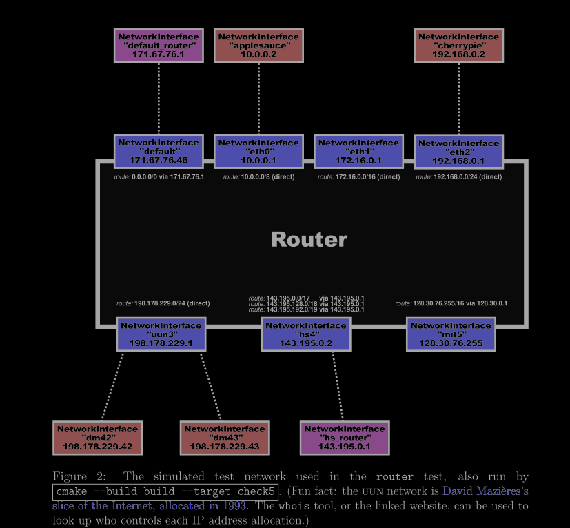
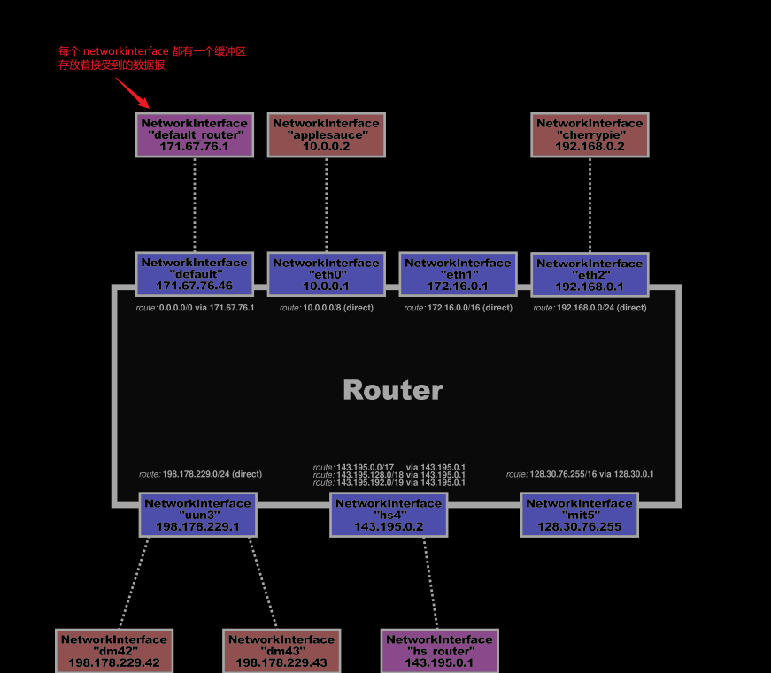

# 翻译
## 1. Overview
本周的实验检查点中，你将基于现有的 NetworkInterface 实现一个 IP 路由器。路由器有多个网络接口，能够在任意接口上接收 Internet 数据报。路由器的任务是**根据路由表转发收到的数据报**：路由表是一组规则，指示路由器在接收到特定数据报时：

  + 应该通过哪个接口发送
  + 下一跳的 IP 地址

你的任务是实现一个路由器，能够为任意数据报找出这两个信息（**接口和下一跳 IP 地址**）。你不需要实现生成 （例如 RIP、OSPF、BGP 或 SDN 控制器），只需实现根据路由表转发数据报的算法。

你的路由器实现将使用 Minnow 库中的一个新的 Router 类，并通过在模拟网络中测试你的路由器功能。检查点 6 建立在你在检查点 5 中实现的 NetworkInterface 之上，但不会使用之前实现的 TCP 栈。IP 路由器无需了解 TCP、ARP 或以太网（只需了解 IP）。我们预计你的实现大约需要 30-60 行代码。（starter code 的脚本/代码行数工具显示 "Router: 38 lines of code"，而我们的示例解决方案显示 "89 lines of code"。）

## 3. Implementing the Router

在这个实验中，你将实现一个 Router 类，它能够：

  + 跟踪路由表（即转发规则或路由列表），并且
  + 转发每个收到的数据报：
    + 到正确的下一跳
    + 通过正确的出站 NetworkInterface

你的实现将被添加到 router.hh 和 router.cc 的骨架文件中。在开始编码之前，请先查看 router.hh 中 Router 类的文档。

以下是你需要实现的两个方法，以及我们对每个方法的期望：

```cpp
void add_route(uint32_t route_prefix, uint8_t prefix_length, optional<Address> next_hop, size_t interface_num);

```
该方法将路由添加到路由表中。你需要在 Router 类中添加一个私有成员数据结构来存储这些信息。此方法只需要保存路由，以便以后使用。

>What do the parts of a route mean?

> 一条路由是一个“匹配-动作”规则：它告诉路由器，如果某个数据报是发往特定网络（一个 IP 地址范> 围），并且该路由被选为最具体的匹配路由，那么路由器应将数据报转发到特定接口上的特定下一跳。
> 
> “匹配”：数据报是否发往该网络？路由前缀和前缀长度一起指定了一个可能包含数据报目的地的 IP > 地址范围（即网络）。路由前缀是一个 32 位的数值型 IP 地址。前缀长度是一个介于 0 到 32> （含）之间的数字，用来告诉路由器路由前缀中有多少个最重要的比特是有效的。例如，要表示到网络> “18.47.0.0/16”的路由（这匹配任何前两字节为 18 和 47 的 32 位 IP 地址），路由前缀将是 > 305070080（18 × 2²⁴ + 47 × 2¹⁶），前缀长度将是 16。任何目的地为“18.47.x.y”的数据报都> 将匹配此路由。
> 
> “动作”：如果路由匹配并被选中，应该做什么。如果路由器直接连接到相关网络，下一跳将是一个空> 的 optional。在这种情况下，下一跳就是数据报的目的地址。但如果路由器通过另一个路由器连接到> 相关网络，下一跳将包含该路径上下一个路由器的 IP 地址。interface_num 提供了路由器 > NetworkInterface 的索引，该接口将用于将数据报发送到下一跳。你可以通过 interface (interface_num) 方法访问该接口。
> 

```cpp
void route();
```
这就是关键所在。该方法需要将每个传入的数据报通过适当的接口路由到下一跳。它需要实现 IP 路由器的“最长前缀匹配”逻辑，以找到最佳的路由。具体来说：

  + 路由器搜索路由表，找到与数据报目标地址匹配的路由。所谓“匹配”，是指目标地址的最重要的前缀长度位与路由前缀的最重要前缀长度位相同。
  + 在匹配的路由中，路由器选择前缀长度值最大的路由。这就是最长前缀匹配路由。
  + 如果没有路由匹配，路由器将丢弃该数据报。
  + 路由器将递减数据报的 TTL（生存时间）。如果 TTL 已经为零，或递减后变为零，路由器应丢弃该数据报。
  + 否则，路由器会通过适当的接口（interface(interface_num)->send_datagram()）将修改后的数据报发送到适当的下一跳。

这里体现了互联网设计的一个美妙之处（或者至少是一种成功的抽象）：路由器从不考虑 TCP、ARP 或以太网帧。路由器甚至不知道链路层的具体情况。路由器只处理互联网数据报，并且只通过 NetworkInterface 抽象与链路层交互。当涉及到诸如“链路层地址如何解析？”、“链路层是否有与 IP 不同的地址方案？”、“链路层帧的格式是什么？”或者“数据报负载的含义是什么？”这样的问题时，路由器根本不关心。

## 5. Q & A



1. 我应该使用什么数据结构来记录路由表？
由你决定！但请不要复杂化。每个数据报需要执行 O(N) 的操作是完全可以接受的，其中 N 是路由表中的条目数。如果你想实现更高效的方案，我们建议你先实现一个可行的版本，然后再进行优化，并仔细记录和注释你选择实现的内容。

2. 如何将以 Address 对象形式表示的 IP 地址转换为可以写入 ARP 消息的原始 32 位整数？
 使用 Address::ipv4_numeric() 方法。

3. 如何将以原始 32 位整数表示的 IP 地址转换为 Address 对象？ 
使用  Address::from_ipv4_numeric() 方法

4. 如何比较两个 32 位 IP 地址的最重要的 N 位（其中 0 ≤ N ≤ 32）？
 这是本次作业中“最棘手”的部分——正确处理该逻辑。值得编写一个小型 C++ 测试程序（一个独立的简短程序）或为 Minnow 添加一个测试，以验证你对相关 C++ 运算符的理解，并仔细检查你的逻辑。请注意，在 C 和 C++ 中，将 32 位整数左移或右移 32 位可能会产生未定义的行为。测试程序会在代码中运行检测器，试图发现这种行为。你可以通过在 Minnow 目录中运行 `./build/tests/router` 来直接运行路由器测试。

5. 如果路由器没有到达目的地的路由，或者 TTL 变为零，是否应该向数据报的源地址发送 ICMP 错误消息？
在现实中，是的，这会很有帮助。但在这个实验中不需要——丢弃数据报就足够了。（即使在现实世界中，也不是每个路由器都会在这些情况下向源地址发送 ICMP 消息。）


# 解

实现路由器的转换功能；
参考下面这张图：




## add_rotu 

该方法主要负责向路由器的路由表中添加新的路由规则。一条路由规则由以下几个信息组成：

  + uint32_t prefix 路由前缀，即网络号；
  + uint8_t prefix_length 前缀长度，即子网掩码长度；
  + optional<Address> next_hop 下一跳地址，这个信息是可空的，因为当这个路由接口直接连接（点对点）到目的主机上时，下一跳是  + 不存在的（也就是所谓的“直接交付”）；
  + size_t interface_num 当前路由规则对应的路由接口编号。
我们需要使用给定网络前缀找出网络接口编号，并使用方法 Router::interface 选中对应的网络接口，再调用方法 NetworkInterface::send_datagram 发出数据报

## route
代码注释里直接告诉我们，这个方法需要在每次调用时遍历所有网络接口，并处理所有存储在网络接口的缓冲队列中的数据报。

处理数据报时，按照数据报的目的 ip 地址，使用最长前缀匹配算法从路由表中找出最合适的路由项。路由器仅在数据报 TTL 下降到 0、或者找不到路由表项时丢弃数据报。

> 数据报的 TTL 不仅要在刚从队列中取出时大于 0，并且在经过此路由器、TTL - 1 时也必须大于 0，否则一律丢弃。

在找到匹配的路由表项后，使用路由表中的接口序号、调用 Router::interface 方法选中路由器持有的网络接口，并使用 NetworkInterface::interface 方法转发数据报。

需要注意的是，IP 数据报是带校验和的，因此在更改数据报头部的 TTL 值后一定要调用 IPv4Header::compute_checksum 方法重新计算数据报的校验和。

```cpp
class Router
{
public:
  // Add an interface to the router
  // \param[in] interface an already-constructed network interface
  // \returns The index of the interface after it has been added to the router
  size_t add_interface( std::shared_ptr<NetworkInterface> interface )
  {
    _interfaces.push_back( notnull( "add_interface", std::move( interface ) ) );
    return _interfaces.size() - 1;
  }

  // Access an interface by index
  std::shared_ptr<NetworkInterface> interface( const size_t N ) { return _interfaces.at( N ); }

  // Add a route (a forwarding rule)
  //将路由添加到路由表中。你需要在 Router 类中添加一个私有成员数据结构来存储这些信息。
  //此方法只需要保存路由，以便以后使用。
  void add_route( uint32_t route_prefix,
                  uint8_t prefix_length,
                  std::optional<Address> next_hop,
                  size_t interface_num );

  // Route packets between the interfaces
  void route();

private:
  // The router's collection of network interfaces
  std::vector<std::shared_ptr<NetworkInterface>> _interfaces {}; //接口

class entry{
public:
    uint32_t route_prefix_ {};
    uint8_t prefix_length_ {};
    std::optional<Address> next_hop_;
    size_t interface_num_ {};

    entry(uint32_t route_prefix, uint8_t prefix_length, std::optional<Address> next_hop, size_t interface_num) :
    route_prefix_(route_prefix),
    prefix_length_(prefix_length),
    next_hop_(next_hop),
    interface_num_(interface_num)
    {}
};
std::vector<entry> entry_table_ {};

};
```
```cpp
#include "router.hh"

#include <iostream>
#include <limits>

using namespace std;

// route_prefix: The "up-to-32-bit" IPv4 address prefix to match the datagram's destination address against
// prefix_length: For this route to be applicable, how many high-order (most-significant) bits of
//    the route_prefix will need to match the corresponding bits of the datagram's destination address?
// next_hop: The IP address of the next hop. Will be empty if the network is directly attached to the router (in
//    which case, the next hop address should be the datagram's final destination).
// interface_num: The index of the interface to send the datagram out on.
void Router::add_route( const uint32_t route_prefix,
                        const uint8_t prefix_length,
                        const optional<Address> next_hop,
                        const size_t interface_num )
{
  cerr << "DEBUG: adding route " << Address::from_ipv4_numeric( route_prefix ).ip() << "/"
       << static_cast<int>( prefix_length ) << " => " << ( next_hop.has_value() ? next_hop->ip() : "(direct)" )
       << " on interface " << interface_num << "\n";

  // Your code here.
    entry_table_.emplace_back(route_prefix, prefix_length, next_hop, interface_num);

}

// Go through all the interfaces, and route every incoming datagram to its proper outgoing interface.
void Router::route()
{
  // Your code here.
    for(auto& interface : _interfaces){ // 遍历所有的接口，然后发送该接口接受的数据包
        auto& datagrams_received = (*interface).datagrams_received();
        while(!datagrams_received.empty()){ // 发送数据包
            InternetDatagram& datagrm = datagrams_received.front(); //当前数据报
            uint32_t dst_ip_addr = datagrm.header.dst;
            auto max_it = entry_table_.end();
            for(auto it = entry_table_.begin();it != entry_table_.end();++it){ //遍历路由表
                // 注意不能左移32位，所以要单独拿出来
                if(it->prefix_length_ == 0 || ((it->route_prefix_ ^ dst_ip_addr) >> (32 - it->prefix_length_))==0){ //如果匹配成功
                    if(max_it == entry_table_.end() || max_it->prefix_length_ < it->prefix_length_){
                        max_it = it;
                    }
                }
            }
            if(max_it != entry_table_.end() && datagrm.header.ttl-- > 1){
                // 发送
                datagrm.header.compute_checksum();
                std::optional<Address> next_hop = max_it->next_hop_;
                auto& send_interface = _interfaces[max_it->interface_num_];
                if(next_hop.has_value()){
                    (*send_interface).send_datagram(datagrm, next_hop.value());
                }else{
                    (*send_interface).send_datagram(datagrm, Address::from_ipv4_numeric(dst_ip_addr));
                }
            }
            datagrams_received.pop();
        }

    }
}

```
