# ARP
## 什么是arp？

基本上，ARP（地址解析协议）是一个位于网络层2的协议。第2层使用物理地址（MAC地址），而第3层使用逻辑地址（IP地址）进行通信。**ARP协议用于发现与给定IPv4地址相关联的节点的MAC地址**。这项重要职责使该协议成为基于以太网的网络中的关键协议。ARP仅与IPv4一起使用。对于IPv6，有另一个执行类似功能的协议，称为IPv6 NDP（邻居发现协议）。

基本上，在网络中传输IP数据包时，除了IP地址外，发送方还必须知道目的地的硬件地址（MAC地址）。如果源主机不知道目的MAC地址，它将把数据包发送给网络中的所有设备。换句话说，它会导致网络泛洪，从而引发不必要的流量。但是，如果已知目标的MAC地址，源主机就可以直接将数据包发送到目的地。因此，如果在传输之前不知道目标的MAC地址，就必须学习它。这就是ARP的作用。

## 1. ARP Protocol Packet

ARP数据包由以太网帧头和ARP头组成。以太网帧头的长度为14字节，ARP头的长度为28字节。地址解析协议的信息位于这部分。

在ARP数据包中，以太网数据包的EtherType值为0x0806。以太网头的其他部分与其他以太网数据包类似。至于ARP头，它包含不同的部分。以下是ARP头的各个部分。

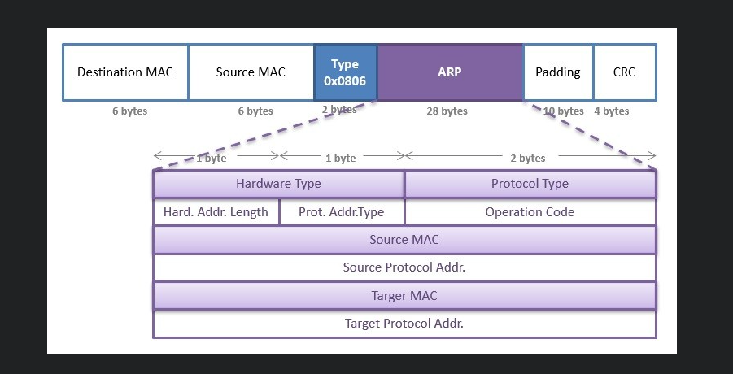

## 2. ARP Protocol Operation

我们可以通过一些基本步骤来解释ARP操作。这里，我们将使用一个例子来说明ARP的工作原理。我们的示例拓扑如下：

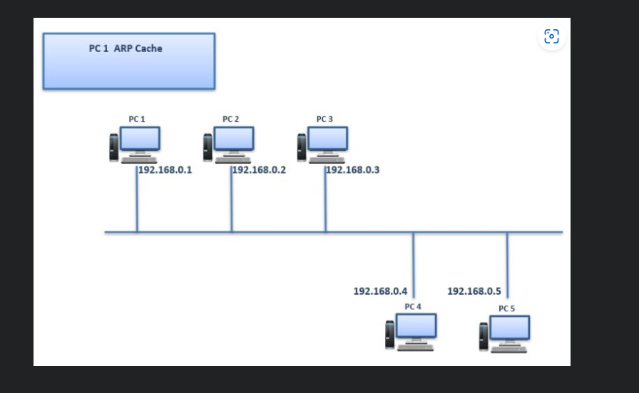

假设PC 1想要ping PC 5。首先，它会检查其ARP表（ARP缓存）并尝试在那里找到PC 5的MAC地址。起初，PC 1的ARP表（ARP缓存）是空的，没有包含PC 5的MAC地址。PC 1只知道PC 5的IP地址。

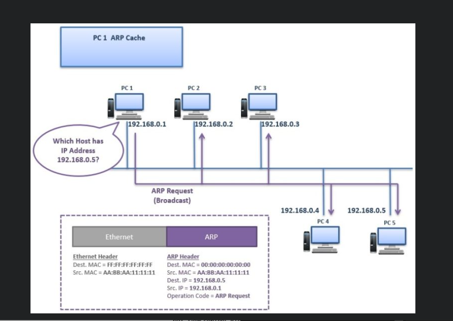

PC 1向网络发送一个“ARP请求”消息，作为广播发送。这个ARP请求消息会发送给网络中的所有节点。ARP请求的意思是：

“哪个主机拥有IP地址192.168.0.5？”

这个ARP请求消息包含源IP和目的IP、源MAC地址以及操作码“请求”。目的MAC地址被写为00:00:00:00:00:00，这意味着它需要被请求。

在此消息的第2层头部中，目的MAC地址为FF:FF:FF:FF:FF
，这是广播MAC地址。

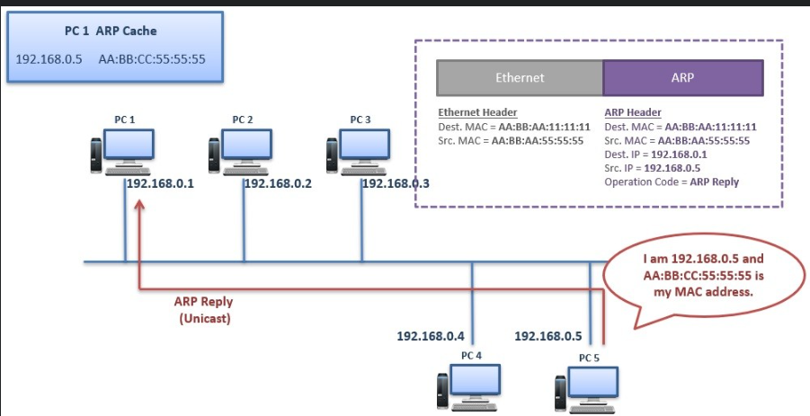

PC 5通过发送“ARP回复”消息来响应这个ARP请求消息。PC 5将此ARP回复消息作为单播消息直接发送给PC 1。这个ARP回复消息的意思是：

“我是192.168.0.5，这是我的MAC地址AA:BB:CC:55:55:55。”

ARP回复消息包含源和目的MAC地址、源和目的IP地址以及操作码“回复”。

当PC 1收到ARP回复消息时，它会将此MAC地址记录到ARP表（ARP缓存）中。每当它需要向PC 5发送数据包时，它都会使用该记录。但这里也有一个时间限制（ARP超时）。ARP记录会在ARP超时之前保留在ARP缓存中。

在这个过程之后，来自PC 1的Ping（ICMP回显请求）可以直接发送到PC 5。随后，来自PC 5的Ping回复（ICMP回显回复）会返回到PC 1。

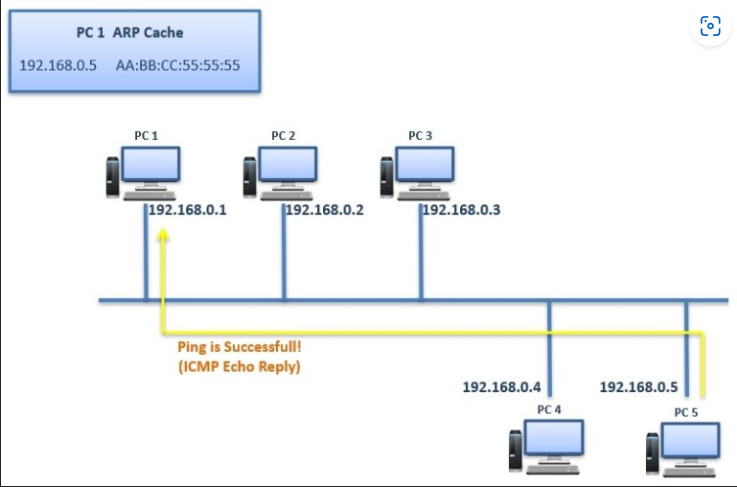

## 不同子网通信 

基本上，代理ARP是一种用于多个网络之间的ARP。换句话说，我们可以说代理ARP在不同网络之间提供数据链路发现。

这里，我们将通过一个例子来解释代理ARP。对于我们的代理ARP示例，我们将使用以下拓扑。

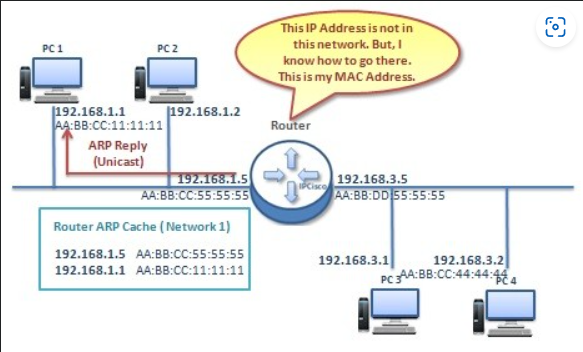

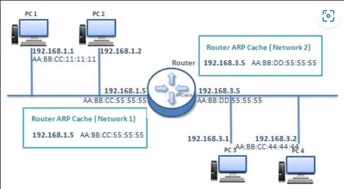

假设PC 1想要ping PC 4，并且它的ARP缓存中没有PC 4的MAC地址。此时，路由器也有一个ARP缓存。我们假设路由器的ARP缓存中最初只有它自己的接口。

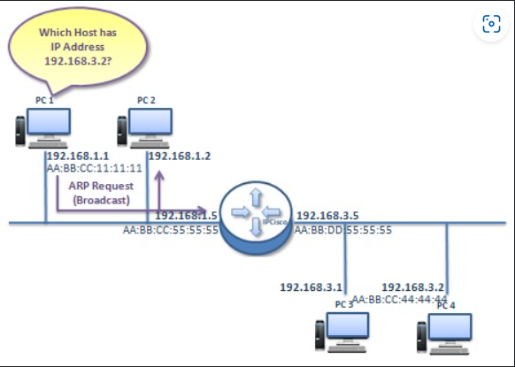

首先，PC 1发送一个广播ARP请求，以获取目标PC 4的MAC地址。在同一网络中的其他PC和路由器的第一个网络接口也会接收到这个广播。

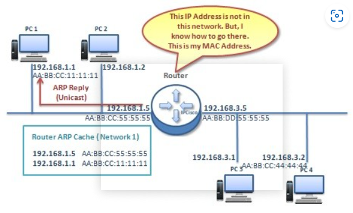

路由器检测到目标不在该网络中，但它知道另一个网络。因此，路由器向PC 1发送一个ARP回复，带有它自己的接口MAC地址。这条消息的意思是：

“这个IP地址不在此网络中，但我知道如何到达那里。这是我的MAC地址。”

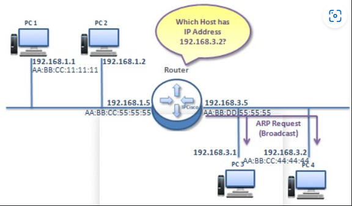

路由器检查其ARP缓存，发现没有关于PC 4的IP地址和MAC地址的记录。所以，它向第二个网络发送了一个广播ARP请求。

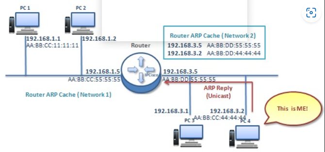

第二个网络中的PC 4确定正在查找的路由器就是它自己，并发送一个ARP回复，意思是：“是我！”

链接： https://ipcisco.com/lesson/address-resolution-protocol-arp/
