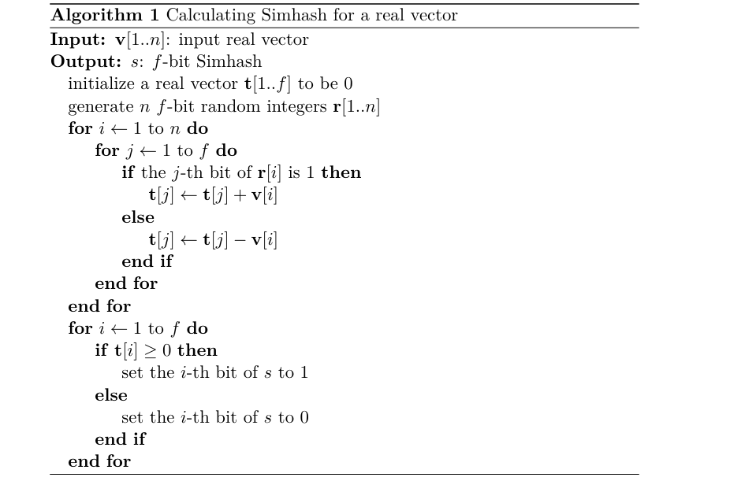

# 1 Overview

本次测试包含两个问题。第一个问题包含两个子问题，而另一个问题是独立的。对于每个问题，请提供源代码文件和一个Makefile。所有程序都应在指定的测试服务器上的Linux环境中编译。您必须使用C++编程语言来解决问题。您可以使用标准的C++库。本测试不允许使用其他第三方代码。在测试期间，您可以使用书籍、上网进行研究或采用任何其他方式来得出正确的解决方案。但是，您不得与其它参赛者讨论或分享此测试中任何问题的代码、想法或具体解决方案。任何此类活动将使涉及者的解决方案完全无效。

# 2 评估
本测试中的每个问题都有一个最高得分。我们的评分方式如下：

首先，如果您的程序在解压您的解决方案文件后，在任意目录下的命令行界面简单输入make即可正确编译，并且无错误地产生预期输出，则您将获得该问题的满分（正确性）。如果您的Makefile无法正常工作，您将在该问题上得零分。请确保您的Makefile绝对可以正常运行！

其次，在您的程序通过正确性检查后，它将根据性能进行评估。也就是说，我们将测量其在随机且相当大的输入文件上执行所需的平均时间。如果有N名参赛者的解决方案通过了正确性测试，这些解决方案将按照它们的平均时间表现按速度排序。排名第一位的解决方案将获得分配的最大性能分数，而排名最后的解决方案将得零分，其余的解决方案将根据其排名从最大性能分数线性递减至零分。如果您的程序未能通过正确性测试，您将自动在性能评估上得零分。

此外请注意，有样例测试输入和输出文件。如果您的程序通过了提供的这个基本测试用例，即使它在其他更复杂的测试用例中失败，您也将获得该问题最高得分的10%。

由于测试涉及到在有限的时间内进行大量的阅读和设计，因此不要求对源代码文件进行文档说明或编写readme文件。评估严格基于程序的正确性和速度。


# 3. 提交
请使用Linux的tar命令归档您的源代码和Makefile。归档文件中不应包含目标文件或可执行文件。归档文件名应为firstname.lastname.tar。如果您给归档文件命名时未遵循此格式，将会被扣除10分！
请通过电子邮件(yingfeng.zhang@gmail.com)提交您的解决方案。请注意，您只能提交一次解决方案。任何后续提交都将被忽略。


# 4. 概率Simhash匹配
在此次测试中，您需要**实现一个近似重复检测系统**。所采用的方法基于广为人知的Simhash技术。以下简要描述了该算法的部分细节。您还应该阅读相关论文《概率Simhash匹配》以获取更多详细信息，不过下面提供的材料已经足够。

## 4.1 Simhash与汉明距离
Simhash由Moses Charikar开发，并在其论文《来自舍入算法的相似度估计技术》中进行了描述。Simhash的主要目的是使相似的项目被哈希到相似的哈希值。**相似性可以通过哈希值之间的位级汉明距离**来判断。

下面是将一个具有实数元素的n维向量映射到f位Simhash值的算法。



步骤：
输入v，输出f;
首先初始化一个长度为f的向量t，用来累积计算各个维度上的加权结果。
接着，为输入向量 v中的每个元素生成一个f位的随机数 r，并通过 r 的每一位决定
v 的对应元素是在 t 的对应维度上增加还是减少。
最终，根据 t 中每个维度的累积值是正还是负来决定Simhash值 s 的每一位是1还是0。

## 4.2 算法
### 4.2.1 近似重复检测

通常，如果两个Simhash值之间的汉明距离不超过某个经验阈值h，我们可以认为这两个Simhash值是近似重复的。为了在一个包含m个Simhash值的数据库中找到所有与某个Simhash值近似的重复项，最直接的方法是对所有Simhash值进行全量线性扫描，这需要进行m次汉明距离计算。

然而，当m增加时，全量线性扫描的时间成本会变得难以忍受。实际上，大多数汉明距离计算都是不必要的，因为对于每次查询的Simhash值来说，只有少数几个近似重复项可以被找到。为了减少比较次数，已经提出了几种解决方案，例如Manku等人在2007年提出的方案。

### 4.2.2 位翻转组合
在此编程测试中，我们考虑了一种新的方法，即Sood和Lugovin提出的**概率Simhash匹配(PSM)系统**。这种方法在进行近似重复搜索时不需要维护数据的多个副本，同时还能保持较高的召回率。对于给定的查询指纹，我们基于找到近似重复匹配的概率探索不同的现有指纹，并限制尝试次数以实现良好的查询速度。

首先，可以使**Simhash数据库有序并建立索引**。为了更好地理解这里的“索引”，建议将所有的Simhash值视为f位整数，并按列表排序，然后根据每个Simhash值的前p位将其分割成子列表，这样每个子列表的第一个元素的位置就构成了索引。例如，索引的第32767个元素指示Simhash列表中第一个p位等于特定值的最小元素的位置。由于汉明距离阈值h通常是经验值2或3，我们可以轻松构建位翻转组合，这意味着查询Simhash值的所有可能的前16位。对于h=3和p=16的索引，我们需要在全量线性扫描中扫描所有65536（2^16）个子列表，但由于位翻转组合的存在，实际上只需要扫描697个子列表。

在下一节中，我们将展示如何通过确定弱位进一步减少需要扫描的子列表数量，同时仍然保持高召回率。

### 4.2.3 位翻转概率

### 计算f位Simhash

为了计算一个f位的Simhash，中间步骤是计算一个f维的权重向量 \(W_d\)，其中每个维度初始被设置为零。哈希函数 \(\theta\) 依次应用于每个特征 \(t_{i,d}\)，并且根据哈希值 \(\theta(t_{i,d})\) 的比特值，\(w_{i,d}\) 将被加到或从 \(W_d\) 的相应维度中减去，具体如下：如果哈希值的第j位是1，那么 \(W_d\) 的第j维将增加 \(w_{i,d}\)；否则，\(W_d\) 的第j维将减少 \(w_{j,d}\)。当所有n个权重根据每个特征哈希值的特定索引处的比特值被加或减之后，中间向量 \(W_d\) 就被生成了。


# 问题A: 在线模式的PSM (100分)
## 5.1 描述
在这个问题中，您需要实现在线PSM（Probabilistic Simhash Matching）算法。注意，对于图像搜索，近似重复项的经验汉明距离阈值 h 可以假设为2。共有20个单独的测试，每个测试为5分。

这个问题可以分为以下两个子问题。

### 5.11 
### 子问题：Simhash匹配的索引策略

在这个子问题中，您需要实现Simhash匹配的索引策略。这是PSM的基础。您应该首先将每个特征映射到一个64位的Simhash值，然后在图像特征数据库中为查询特征列表中的每个特征查找近似重复项。

您的得分将根据性能进行评估。对于每个测试点，如果我们的样本解决方案的时间成本为 \(t_{\text{judge}}\)，您的程序的平均时间成本为 \(t_{\text{contestant}}\)，您的得分将按以下公式计算：

\[
\text{score} = \text{score}_0 \times \max\left(0, 1 - 0.2 \lg \frac{t_{\text{contestant}}}{t_{\text{judge}}}\right)
\]

其中 \(\text{score}_0 = 5\) 是每个测试点的满分。

### 5.1.2

在这个子问题中，您需要完成您的PSM算法。得分将根据相对于问题A.1程序的性能提升和召回率进行评估。

这个子问题的得分与您相对于问题A.1程序的召回率和性能提升有关。假设您的召回率为 \(r_p\)，您的时间成本分别为 \(t_{\text{non-psm}}\) 和 \(t_{\text{psm}}\)，那么您的得分将按以下公式计算：

\[
\text{score}_0 = \left(1 - 0.1 \left(3 \log_2 \frac{t_{\text{non-psm}}}{t_{\text{psm}}}\right)\right) \times \min\left(1, 1 - 5 (0.95 - r_p)\right)
\]

其中 \(\text{score}_0 = 5\)。

**警告**：如果您的PSM算法检测到任何不在问题A.1结果中的近似重复项，您将在这个测试点得0分，因为正确的PSM只能找到非PSM结果的一个子集。为了确保这一点，您在这两个子问题中应使用相同的随机哈希值。

### 5.2 输入
两个子问题共享相同的输入文件。您将有20个测试点，每个测试点包含两个输入文件：一个图像特征数据库和一个查询特征列表。在 `sample_input` 子目录下有5个样本文件，命名为 `ProblemA_[00-05].dat` 和 `ProblemA_[00-05].que`。

- **图像特征数据库**：第一行是一个整数 \(n\)，表示数据库中的特征数量。接下来的 \(n\) 行，每行包含一个字符串表示的图像文件名和128个浮点数表示的特征。请注意，一个文件名可以对应多个特征。
- **查询特征列表**：第一行是一个整数 \(m\)，表示查询特征的数量。接下来的 \(m\) 行，每行是一个特征（128个浮点数）。

**警告**：为了便于性能评估，您的程序应该在处理查询特征列表之前加载并处理图像特征数据库，然后打印一个时间戳，在程序结束时再打印一个时间戳。这是因为数据库加载过程可能占用大部分总时间成本，而我们只关心查询处理的性能。请务必在处理查询前后打印时间戳。在提供的 `util/psm-helper.hpp` 文件中有一个名为 `print_current_timestamp()` 的函数，可以方便地打印时间戳。

### 5.3 输出
对于每个子问题，您应该将结果输出到一个文件中。对应于5个样本输入，`sample_output` 子目录下有5个样本结果文件，命名为 `ProblemA1_[00-05].out` 和 `ProblemA2_[00-05].out`。对于每个查询特征，您应该输出所有由您的程序检测到的近似重复项的文件名，然后用一个额外的 `\n` 分隔不同查询的匹配结果。

### 5.4 样本输入和输出
对于每个子问题，您的可执行文件应该接受3个参数，分别对应图像特征数据库文件名、查询特征列表文件名和结果文件名。在评估过程中，我们将使用如下命令：
```sh
./your_program 00.dat 00.que 00.out
```
表2显示了一个样本输入和输出的例子。

### 5.5 提示
- **输出顺序必须与查询顺序相同**！
- `psm-helper.hpp` 文件中的 `MurmurHash64A()` 哈希函数可以帮助您将一个特征（128维实数向量）映射到一个64位的Simhash。

在我们的样本PSM解决方案中，从一个包含800,000个特征的图像特征数据库中查询100,000个特征需要消耗450MB内存和15秒时间。尽量努力超越这一性能！


